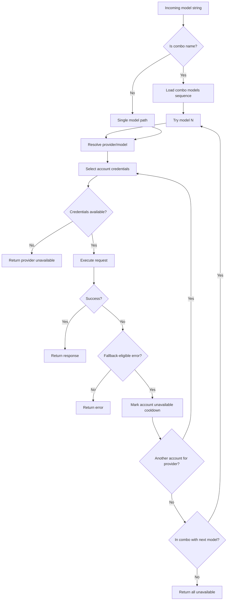

# OmniRoute Architecture (العربية)

🌐 **Languages:** 🇺🇸 [English](../../../../docs/ARCHITECTURE.md) · 🇪🇸 [es](../../es/docs/ARCHITECTURE.md) · 🇫🇷 [fr](../../fr/docs/ARCHITECTURE.md) · 🇩🇪 [de](../../de/docs/ARCHITECTURE.md) · 🇮🇹 [it](../../it/docs/ARCHITECTURE.md) · 🇷🇺 [ru](../../ru/docs/ARCHITECTURE.md) · 🇨🇳 [zh-CN](../../zh-CN/docs/ARCHITECTURE.md) · 🇯🇵 [ja](../../ja/docs/ARCHITECTURE.md) · 🇰🇷 [ko](../../ko/docs/ARCHITECTURE.md) · 🇸🇦 [ar](../../ar/docs/ARCHITECTURE.md) · 🇮🇳 [hi](../../hi/docs/ARCHITECTURE.md) · 🇮🇳 [in](../../in/docs/ARCHITECTURE.md) · 🇹🇭 [th](../../th/docs/ARCHITECTURE.md) · 🇻🇳 [vi](../../vi/docs/ARCHITECTURE.md) · 🇮🇩 [id](../../id/docs/ARCHITECTURE.md) · 🇲🇾 [ms](../../ms/docs/ARCHITECTURE.md) · 🇳🇱 [nl](../../nl/docs/ARCHITECTURE.md) · 🇵🇱 [pl](../../pl/docs/ARCHITECTURE.md) · 🇸🇪 [sv](../../sv/docs/ARCHITECTURE.md) · 🇳🇴 [no](../../no/docs/ARCHITECTURE.md) · 🇩🇰 [da](../../da/docs/ARCHITECTURE.md) · 🇫🇮 [fi](../../fi/docs/ARCHITECTURE.md) · 🇵🇹 [pt](../../pt/docs/ARCHITECTURE.md) · 🇷🇴 [ro](../../ro/docs/ARCHITECTURE.md) · 🇭🇺 [hu](../../hu/docs/ARCHITECTURE.md) · 🇧🇬 [bg](../../bg/docs/ARCHITECTURE.md) · 🇸🇰 [sk](../../sk/docs/ARCHITECTURE.md) · 🇺🇦 [uk-UA](../../uk-UA/docs/ARCHITECTURE.md) · 🇮🇱 [he](../../he/docs/ARCHITECTURE.md) · 🇵🇭 [phi](../../phi/docs/ARCHITECTURE.md) · 🇧🇷 [pt-BR](../../pt-BR/docs/ARCHITECTURE.md) · 🇨🇿 [cs](../../cs/docs/ARCHITECTURE.md) · 🇹🇷 [tr](../../tr/docs/ARCHITECTURE.md)

---

_آخر تحديث: 2026-03-28_## الملخص التنفيذي

OmniRoute عبارة عن بوابة توجيه نقطة تعمل بالذكاء الاصطناعي ولوحة معلومات مبنية على Next.js.
وهو يوفر نقطة نهاية واحدة متوافقة مع OpenAI (`/v1/*`) ويوجه حركة المرور عبر العديد من الخدمات الموفري الأولية مع الترجمة والاحتياط وتحديث الرمز المميز وتتبع الاستخدام.

التان الأساسية:

- سطح API متوافق مع OpenAI لـ CLI/الأدوات (28 منتجًا)
- ترجمة الطلب/الاستجابة عبر التنسيقات الموفر
- نموذج بناء التحرير والسرد (سلسلة الارتباطات المتعددة)
- موازنة حساب الحساب (حسابات متعددة لكل شخص)
- إدارة اتصال موفر OAuth + API-key
- إنشاء التضمين عبر `/v1/embeddings` (6 مقدمي خدمات، 9 نماذج)
- إنشاء الصور عبر `/v1/images/Generation` (4 مقدمي خدمات، 9 نماذج)
- فكر في تحليل العلامات (`<think>...</think>`) لنماذج الاستدلال
- تحديد القيمة للتوافق مع OpenAI SDK
- تطبيع الدور (المطور → النظام، النظام → المستخدم) للتوافق بين الموفرين
- تحويل المنتج منظم (json_schema → Gemini ResponseSchema)
- الثبات المحلي لمقدمي الخدمات والمفاتيح والأسماء المستعارة والمجموعات والإعدادات والتسعير
- تتبع تكلفة/التكلفة وتسجيل الطلب
- نوبات سحابية اختيارية للأجهزة/الحالة الثابتة
- القائمة الخاصة بها/القائمة المحظورة لـ IP للتحكم في الوصول إلى واجهة برمجة التطبيقات
- التفكير في إدارة الميزانية (العبور / التلقائي / المقصود / التكيفي)
- هيكل البناء العالمي
- تتبع البصمات
- تحديد المحسن لكل حساب مع الملفات الشخصية الخاصة بالمزود
- تقطع فاصل لمرونة المورد
- حماية القطيع ضد الرعد مع موتكس
- ذاكرة التخزين المؤقتة لإلغاء البيانات المكررة للطلبة المستندية للتوقيع
- المجال: توفر النموذج، وقواعد التكلفة، والسياسة الاحتياطية، وسياسة فك الضغط
- فرانسيسكوية المجال المجال (ذاكرة التخزين المؤقتة للكتاب في SQLite للاحتياطيات والميزانيات وفتح قواطع الضوء)
- السياسة التي تحدد الطلب المركزي (التأمين → الميزانية → الاحتياطي)
- طلب القياس عن بعد مع تجميع الكمون ص50/ص95/ص99
- معرف الارتباط (X-Request-Id) للتتبع الشامل
- تسجيل تدقيق كامل مع إلغاء الاشتراك لمفتاح API
- إطار تقييمي وجودة LLM
- لوحة تحكم واجهة المستخدم المرنة مع فاصل زمني في العمل
- مفري OAuth المطاطيون (12 وحدة ضمن `src/lib/oauth/providers/`)

وقت نموذج التشغيل الأساسي:

- تقوم مسارات تطبيق Next.js ضمن `src/app/api/*` ولتتمكن كل من واجهات تطبيقات برمجة لوحة المعلومات وواجهات برمجة تطبيقات التوافق
- نواة توجيه/SSE اشترك في `src/sse/*` + `open-sse/*` تمويل مع تنفيذ الموفر والترجمة والتدفق والرجوع والاستخدام## النطاق والحدود### In Scope

- وقت تشغيل البوابة المحلية
- واجهات برمجة التطبيقات المبتكرة للوحة المعلومات
- مصادقة الموفر وتحديث الرمز المميز
- طلب الترجمة و التدفق SSE
- الحالة المحلية + استمرارية الاستخدام
- نوبات سحابية اختيارية### خارج النطاق

- تنفيذ خدمة السحابية خلف `NEXT_PUBLIC_CLOUD_URL`
- مستوى تحرير السودان/مستوى التحكم خارج نطاق العمل
- ثنائيات CLI الخارجية نفسها (Claude CLI، Codex CLI، وما إلى ذلك) ## سطح لوحة القيادة (الحالي)

الصفحة الرئيسية ضمن `src/app/(dashboard)/dashboard/`:

- `/dashboard` - بداية سريعة + نظرة عامة على الموفر
- `/dashboard/endpoint` - وكيل نقطة النهاية + علامات نهاية نقطة النهاية MCP + A2A + API
- `/dashboard/providers` - اتصالات الموفر وبيانات الاعتماد
- `/dashboard/combos` - إستراتيجيات التحرير والسرد والقوالب وقواعد توجيه التطورات
- `/dashboard/costs` - تجميع الأسعار ورؤية الأسعار
- `/dashboard/analytics` - تحليلات تعاطيات البناء
- `/dashboard/limits` - ضوابط الحصص/المعدلات
- `/dashboard/cli-tools` - إعداد واجهة سطر مودم، والكشف عن وقت التشغيل، ويشمل ذلك
- `/dashboard/agents` — تم ابتكار عملاء ACP + تسجيل عميل مخصص
- `/dashboard/media` — ساحة لعب الصور/الفيديو/الموسيقى
- `/dashboard/search-tools` - اختبار خريطة البحث
- `/dashboard/health` - وقت التشغيل، قواطع الدائرة، حدود المعدل
- `/dashboard/logs` - سجلات الطلب/الوكيل/التدقيق/وحدة التحكم
- `/dashboard/settings` - علامات إعدادات النظام (عامة، توجيه، إعدادات التحرير والإعدادات البرمجية، إلخ.)
- `/dashboard/api-manager` - دورة حياة مفتاح برمجة برمجة التطبيقات والأذونات النموذجية## سياق النظام عالي المستوى```mermaid
  flowchart LR
  subgraph Clients[Developer Clients]
  C1[Claude Code]
  C2[Codex CLI]
  C3[OpenClaw / Droid / Cline / Continue / Roo]
  C4[Custom OpenAI-compatible clients]
  BROWSER[Browser Dashboard]
  end

      subgraph Router[OmniRoute Local Process]
          API[V1 Compatibility API\n/v1/*]
          DASH[Dashboard + Management API\n/api/*]
          CORE[SSE + Translation Core\nopen-sse + src/sse]
          DB[(storage.sqlite)]
          UDB[(usage tables + log artifacts)]
      end

      subgraph Upstreams[Upstream Providers]
          P1[OAuth Providers\nClaude/Codex/Gemini/Qwen/Qoder/GitHub/Kiro/Cursor/Antigravity]
          P2[API Key Providers\nOpenAI/Anthropic/OpenRouter/GLM/Kimi/MiniMax\nDeepSeek/Groq/xAI/Mistral/Perplexity\nTogether/Fireworks/Cerebras/Cohere/NVIDIA]
          P3[Compatible Nodes\nOpenAI-compatible / Anthropic-compatible]
      end

      subgraph Cloud[Optional Cloud Sync]
          CLOUD[Cloud Sync Endpoint\nNEXT_PUBLIC_CLOUD_URL]
      end

      C1 --> API
      C2 --> API
      C3 --> API
      C4 --> API
      BROWSER --> DASH

      API --> CORE
      DASH --> DB
      CORE --> DB
      CORE --> UDB

      CORE --> P1
      CORE --> P2
      CORE --> P3

      DASH --> CLOUD

````

## Core Runtime Components

## 1) API and Routing Layer (Next.js App Routes)

الدلائل الرئيسية:

- `src/app/api/v1/*` و `src/app/api/v1beta/*` لواجهات برمجة التطبيقات المتوافقة
- `src/app/api/*` لواجهات برمجة تطبيقات للإدارة/التكوين
- إعادة الكتابة التالية في الخريطة `next.config.mjs` `/v1/*` إلى `/api/v1/*`

طرق التوافق:

- `src/app/api/v1/chat/completions/route.ts`
- `src/app/api/v1/messages/route.ts`
- `src/app/api/v1/responses/route.ts`
- `src/app/api/v1/models/route.ts` - تشمل نماذج مخصصة ذات `مخصصة: صحيح`
- `src/app/api/v1/embeddings/route.ts` - إنشاء التضمين (6 مفري)
- `src/app/api/v1/images/ Generations/route.ts` - إنشاء الصور (4+ موفري خدمات بما في ذلك Antigravity/Nebius)
- `src/app/api/v1/messages/count_tokens/route.ts`
- `src/app/api/v1/providers/[provider]/chat/completions/route.ts` - دردشة مخصصة لكل المرشحين
- `src/app/api/v1/providers/[provider]/embeddings/route.ts` - عمليات التضمين المخصصة لكل المجالات
- `src/app/api/v1/providers/[provider]/images/ Generations/route.ts` - صور مخصصة لكل إطار
- `src/app/api/v1beta/models/route.ts`
- `src/app/api/v1beta/models/[...path]/route.ts`

الفترات الإدارية:

- المصادقة/الإعدادات: `src/app/api/auth/*`، `src/app/api/settings/*`
- مقدمو الخدمة/الاتصالات: `src/app/api/providers*`
- عقد الموفر: `src/app/api/provider-nodes*`
- الروابط ذات الصلة: `src/app/api/provider-models` (GET/POST/DELETE)
- كتالوج الارتباطات: `src/app/api/models/route.ts` (GET)
- الوكيل التنفيذي: `src/app/api/settings/proxy` (GET/PUT/DELETE) + `src/app/api/settings/proxy/test` (POST)
- OAuth: `src/app/api/oauth/*`
-لوحة المفاتيح/الأسماء المستعارة/المجموعات/التسعير: `src/app/api/keys*`، `src/app/api/models/alias`، `src/app/api/combos*`، `src/app/api/pricing`
-استخدام: `src/app/api/usage/*`
- الناقلات/السحابة: `src/app/api/sync/*`، `src/app/api/cloud/*`
- مساعدي أدوات CLI: `src/app/api/cli-tools/*`
- مرشح IP: `src/app/api/settings/ip-filter` (GET/PUT)
- تكلفة التفكير: `src/app/api/settings/thinking-budget` (GET/PUT)
- متشوق النظام: `src/app/api/settings/system-prompt` (GET/PUT)
- الجلسات: `src/app/api/sessions` (GET)
- النطاق المعدل: `src/app/api/rate-limits` (GET)
- معطف: `src/app/api/resilience` (GET/PATCH) - ملفات تعريف الموفر، التفاضل والتكامل، حالة لا يمكن تعديلها
- إعادة ضبط ضبط: `src/app/api/resilience/reset` (POST) - إعادة ضبط القواطع + تخفيف التهدئة
- إحصائيات ذاكرة تخزين مؤقتة: `src/app/api/cache/stats` (GET/DELETE)
- توفر النموذج: `src/app/api/models/availability` (GET/POST)
- القياس عن بعد: `src/app/api/telemetry/summary` (GET)
- الميزانية: `src/app/api/usage/budget` (GET/POST)
- السلاسل الاحتياطية: `src/app/api/fallback/chains` (GET/POST/DELETE)
- تدقيق تماما: `src/app/api/compliance/audit-log` (GET)
- التقييمات: `src/app/api/evals` (GET/POST)، `src/app/api/evals/[suiteId]` (GET)
- للمزيد: `src/app/api/policies` (GET/POST)## 2) SSE + Translation Core

وحدات السرعة الرئيسية:- الإدخال: `src/sse/handlers/chat.ts`
- أريد الأساسي: `open-sse/handlers/chatCore.ts`
- محولات تنفيذ الموفر: `open-sse/executors/*`
- الاكتشاف الجديد/تكوين الموفر: `open-sse/services/provider.ts`
- تحليل/حل النموذج: `src/sse/services/model.ts`، `open-sse/services/model.ts`
- الحساب الاحتياطي للحساب: `open-sse/services/accountFallback.ts`
- سجل الترجمة: `open-sse/translator/index.ts`
- تحويلات الدفق: `open-sse/utils/stream.ts`، `open-sse/utils/streamHandler.ts`
-الطلب/تطبيع الاستخدام: `open-sse/utils/usageTracking.ts`
- فكر في محلل العناوين: `open-sse/utils/thinkTagParser.ts`
-معالج التضمين: `open-sse/handlers/embeddings.ts`
- سجل موفر التضمين: open-sse/config/embeddingRegistry.ts
-معالج إنشاء الصور: `open-sse/handlers/imageGeneration.ts`
- سجل موفر الصور: `open-sse/config/imageRegistry.ts`
- تعريف القيمة: `open-sse/handlers/responseSanitizer.ts`
- تطبيع الدور: `open-sse/services/roleNormalizer.ts`

الخدمات (منطقة الأعمال):

- اختيار الحساب/تسجيل النقاط: `open-sse/services/accountSelector.ts`
- إدارة دورة حياة السياق: `open-sse/services/contextManager.ts`
- فرض مرشح IP: `open-sse/services/ipFilter.ts`
- تعقيب النظر: `open-sse/services/sessionManager.ts`
-طلب إلغاء البيانات المكررة: `open-sse/services/signatureCache.ts`
- البناء الكامل: `open-sse/services/systemPrompt.ts`
- التفكير في إدارة الميزانية: `open-sse/services/thinkingBudget.ts`
- توجيه نموذج حرف البدل: `open-sse/services/wildcardRouter.ts`
- إدارة إلى حد التعديل: `open-sse/services/rateLimitManager.ts`
- قاطع الدائرة: `open-sse/services/circuitBreaker.ts`

وحدات المجال:

- توفر النموذج: `src/lib/domain/modelAvailability.ts`
- متطلبات/ميزانيات التكلفة: `src/lib/domain/costRules.ts`
- السياسة الافتراضية: `src/lib/domain/fallbackPolicy.ts`
- محلل التحرير والسرد: `src/lib/domain/comboResolver.ts`
- تأمين التأمين: `src/lib/domain/lockoutPolicy.ts`
- محرك السياسة: `src/domain/policyEngine.ts` - القفل المركزي ← الميزانية ← التقييم الاحتياطي
- كتالوج الرموز لسبب: `src/lib/domain/errorCodes.ts`
- معرف الطلب: `src/lib/domain/requestId.ts`
- مهلة الجلب: `src/lib/domain/fetchTimeout.ts`
-طلب القياس عن بعد: `src/lib/domain/requestTelemetry.ts`
- شامل/الدقيق: `src/lib/domain/compliance/index.ts`
- عداء التقييم: `src/lib/domain/evalRunner.ts`
- دونية المجال المجال: `src/lib/db/domainState.ts` - SQLite CRUD للسلاسل الاحتياطية، والميزانيات، خسر التكلفة، وحالة القفل، وقواطع الضوء

وحدات موفر OAuth (12 ملفًا فرديًا ضمن `src/lib/oauth/providers/`):

- فهرس التسجيل: `src/lib/oauth/providers/index.ts`
- مقدمو الخدمات الأشخاص: `claude.ts`، `codex.ts`، `gemini.ts`، `antigravity.ts`، `qode.ts`، `qwen.ts`، `kimi-coding.ts`، `github.ts`، `kiro.ts`، `cursor.ts`، `kilocode.ts`، `cline.ts`
- طعام السباحة: `src/lib/oauth/providers.ts` - يُعاد تصديره من العناصر العناصر## 3) طبقة الثبات

قاعدة بيانات الحالة الأساسية (SQLite):- المعرفة البشرية الأساسية: `src/lib/db/core.ts` (better-sqlite3، migrations، WAL)
- واجهة إعادة التصدير: `src/lib/localDb.ts` (طبقة توافق مختلفة للمتصلين)
- الملف: `${DATA_DIR}/storage.sqlite` (أو `$XDG_CONFIG_HOME/omniroute/storage.sqlite` عند الضرورة، وإلا `~/.omniroute/storage.sqlite`)
- كيانات (الجداول + أسماء KV): ProvideConnections، وproviderNodes، وmodelAliases، والمجموعات، WapiKeys، والإعدادات، والتسعير،**customModels**،**proxyConfig**،**ipFilter**،**thinkingBudget**،**systemPrompt**

بمرور الوقت الاستخدام:

- الواجهة: `src/lib/usageDb.ts` (وحدات متحللة في `src/lib/usage/*`)
- جداول SQLite في `storage.sqlite`: `usage_history`، `call_logs`، `proxy_logs`
- تبرز عناصر الملف الاختياري للتوافق/تصحيح سبب (`${DATA_DIR}/log.txt`, `${DATA_DIR}/call_logs/`, `<repo>/logs/...`)
- يتم رحيل ملفات JSON القديمة إلى SQLite عن طريق عمليات رحيل بدء التشغيل عند وجودها

قاعدة بيانات المجال (SQLite):

- `src/lib/db/domainState.ts` - عمليات إنتاج CRUD لحالة المجال
- الجداول (التي تم تحديدها في `src/lib/db/core.ts`): `domain_fallback_chains`، `domain_budgets`، `domain_cost_history`، `domain_lockout_state`، `domain_circuit_breakers`.
- نمط ذاكرة التخزين المؤقت للكتابة: قرص الاتصال موجود في الذاكرة الموثوقة في وقت التشغيل؛ تتم كتابة الطفرات بشكل متزامن إلى SQLite؛ يتم استعادة حالة قاعدة البيانات عند البداية الباردة ## 4) المصادقة + الأسطح الأمنية

- مصادقة ملف تعريف الارتباط في لوحة المعلومات: `src/proxy.ts`، `src/app/api/auth/login/route.ts`
- إنشاء/التحقق من مفتاح واجهة برمجة التطبيقات: `src/shared/utils/apiKey.ts`
-أسرار الموفر في الخطوط "providerConnections".
- دعم خارجي تمامًا عبر `open-sse/utils/proxyFetch.ts` (env vars) و`open-sse/utils/networkProxy.ts` (قابل للتكوين لكل المرشحين أو عالمي)## 5) Cloud Sync

- جدولة init: `src/lib/initCloudSync.ts`، `src/shared/services/initializeCloudSync.ts`، `src/shared/services/modelSyncScheduler.ts`
- أهم الأحداث: `src/shared/services/cloudSyncScheduler.ts`
- أهم الأحداث: `src/shared/services/modelSyncScheduler.ts`
- التحكم في المسار: `src/app/api/sync/cloud/route.ts`## دورة حياة الطلب (`/v1/chat/completions`)```mermaid
sequenceDiagram
    autonumber
    participant Client as CLI/SDK Client
    participant Route as /api/v1/chat/completions
    participant Chat as src/sse/handlers/chat
    participant Core as open-sse/handlers/chatCore
    participant Model as Model Resolver
    participant Auth as Credential Selector
    participant Exec as Provider Executor
    participant Prov as Upstream Provider
    participant Stream as Stream Translator
    participant Usage as usageDb

    Client->>Route: POST /v1/chat/completions
    Route->>Chat: handleChat(request)
    Chat->>Model: parse/resolve model or combo

    alt Combo model
        Chat->>Chat: iterate combo models (handleComboChat)
    end

    Chat->>Auth: getProviderCredentials(provider)
    Auth-->>Chat: active account + tokens/api key

    Chat->>Core: handleChatCore(body, modelInfo, credentials)
    Core->>Core: detect source format
    Core->>Core: translate request to target format
    Core->>Exec: execute(provider, transformedBody)
    Exec->>Prov: upstream API call
    Prov-->>Exec: SSE/JSON response
    Exec-->>Core: response + metadata

    alt 401/403
        Core->>Exec: refreshCredentials()
        Exec-->>Core: updated tokens
        Core->>Exec: retry request
    end

    Core->>Stream: translate/normalize stream to client format
    Stream-->>Client: SSE chunks / JSON response

    Stream->>Usage: extract usage + persist history/log
````

## Combo + Account Fallback Flow



يتم اتخاذ القرار الاحتياطي بواسطة `open-sse/services/accountFallback.ts` باستخدام رموز الحالة للاستدلال على رسائل الخطأ. تسهيل توجيه التشغيل والتنسيق بين الطرفين طوعًا للمساعدة في تقديم الطلبات: يتم التعامل مع 400s على نطاق الموفر مثل كتلة المحتوى الأول وفشل التحقق من صحة الدور على أنها فشل رئيسي للنموذج، لذا لا يزال لا يزال مطلوبًا التحرير والسرد التالي.## OAuth Onboarding and Token Refresh Lifecycle```mermaid
sequenceDiagram
autonumber
participant UI as Dashboard UI
participant OAuth as /api/oauth/[provider]/[action]
participant ProvAuth as Provider Auth Server
participant DB as localDb
participant Test as /api/providers/[id]/test
participant Exec as Provider Executor

    UI->>OAuth: GET authorize or device-code
    OAuth->>ProvAuth: create auth/device flow
    ProvAuth-->>OAuth: auth URL or device code payload
    OAuth-->>UI: flow data

    UI->>OAuth: POST exchange or poll
    OAuth->>ProvAuth: token exchange/poll
    ProvAuth-->>OAuth: access/refresh tokens
    OAuth->>DB: createProviderConnection(oauth data)
    OAuth-->>UI: success + connection id

    UI->>Test: POST /api/providers/[id]/test
    Test->>Exec: validate credentials / optional refresh
    Exec-->>Test: valid or refreshed token info
    Test->>DB: update status/tokens/errors
    Test-->>UI: validation result

````

يتم تنفيذ التحديث أثناء حركة التحرير المباشر داخل `open-sse/handlers/chatCore.ts` عبر المنفذ `refreshCredentials()`.## دورة حياة المزامنة السحابية (تمكين / مزامنة / تعطيل)```mermaid
sequenceDiagram
    autonumber
    participant UI as Endpoint Page UI
    participant Sync as /api/sync/cloud
    participant DB as localDb
    participant Cloud as External Cloud Sync
    participant Claude as ~/.claude/settings.json

    UI->>Sync: POST action=enable
    Sync->>DB: set cloudEnabled=true
    Sync->>DB: ensure API key exists
    Sync->>Cloud: POST /sync/{machineId} (providers/aliases/combos/keys)
    Cloud-->>Sync: sync result
    Sync->>Cloud: GET /{machineId}/v1/verify
    Sync-->>UI: enabled + verification status

    UI->>Sync: POST action=sync
    Sync->>Cloud: POST /sync/{machineId}
    Cloud-->>Sync: remote data
    Sync->>DB: update newer local tokens/status
    Sync-->>UI: synced

    UI->>Sync: POST action=disable
    Sync->>DB: set cloudEnabled=false
    Sync->>Cloud: DELETE /sync/{machineId}
    Sync->>Claude: switch ANTHROPIC_BASE_URL back to local (if needed)
    Sync-->>UI: disabled
````

يتم تشغيل الدورية بواسطة "CloudSyncScheduler" عند السحابة.## نموذج البيانات وخريطة التخزين```mermaid
erDiagram
SETTINGS ||--o{ PROVIDER_CONNECTION : controls
PROVIDER_NODE ||--o{ PROVIDER_CONNECTION : backs_compatible_provider
PROVIDER_CONNECTION ||--o{ USAGE_ENTRY : emits_usage

    SETTINGS {
      boolean cloudEnabled
      number stickyRoundRobinLimit
      boolean requireLogin
      string password_hash
      string fallbackStrategy
      json rateLimitDefaults
      json providerProfiles
    }

    PROVIDER_CONNECTION {
      string id
      string provider
      string authType
      string name
      number priority
      boolean isActive
      string apiKey
      string accessToken
      string refreshToken
      string expiresAt
      string testStatus
      string lastError
      string rateLimitedUntil
      json providerSpecificData
    }

    PROVIDER_NODE {
      string id
      string type
      string name
      string prefix
      string apiType
      string baseUrl
    }

    MODEL_ALIAS {
      string alias
      string targetModel
    }

    COMBO {
      string id
      string name
      string[] models
    }

    API_KEY {
      string id
      string name
      string key
      string machineId
    }

    USAGE_ENTRY {
      string provider
      string model
      number prompt_tokens
      number completion_tokens
      string connectionId
      string timestamp
    }

    CUSTOM_MODEL {
      string id
      string name
      string providerId
    }

    PROXY_CONFIG {
      string global
      json providers
    }

    IP_FILTER {
      string mode
      string[] allowlist
      string[] blocklist
    }

    THINKING_BUDGET {
      string mode
      number customBudget
      string effortLevel
    }

    SYSTEM_PROMPT {
      boolean enabled
      string prompt
      string position
    }

````

ملفات الوضع المالي:

- قاعدة بيانات وقت التشغيل الأساسي: `${DATA_DIR}/storage.sqlite`
- أسطر سجل الطلب: `${DATA_DIR}/log.txt` (أداة متوافقة/تصحيح سبب)
- أرشيفات استضافة المؤتمرات التنظيمية: `${DATA_DIR}/call_logs/`
- مجموعات تصحيح الأخطاء المترجم/الطلب الاختيارية: `<repo>/logs/...`## Deployment Topology```mermaid
flowchart LR
    subgraph LocalHost[Developer Host]
        CLI[CLI Tools]
        Browser[Dashboard Browser]
    end

    subgraph ContainerOrProcess[OmniRoute Runtime]
        Next[Next.js Server\nPORT=20128]
        Core[SSE Core + Executors]
        MainDB[(storage.sqlite)]
        UsageDB[(usage tables + log artifacts)]
    end

    subgraph External[External Services]
        Providers[AI Providers]
        SyncCloud[Cloud Sync Service]
    end

    CLI --> Next
    Browser --> Next
    Next --> Core
    Next --> MainDB
    Core --> MainDB
    Core --> UsageDB
    Core --> Providers
    Next --> SyncCloud
````

## Module Mapping (Decision-Critical)

### Route and API Modules

- `src/app/api/v1/*`، `src/app/api/v1beta/*`: واجهات برمجة التطبيقات المتوافقة
- `src/app/api/v1/providers/[provider]/*`: مسارات مخصصة لكل دليل (الدردشة والتضمينات والصور)
- `src/app/api/providers*`: موفر CRUD، التحقق من الصحة، الاختبار
- `src/app/api/provider-nodes*`: إدارة العقد المتوافقة المخصصة
- `src/app/api/provider-models`: إدارة الارتباطات المخصصة (CRUD)
- `src/app/api/models/route.ts`: برمجة تطبيقات كتالوج الارتباطات (الأسماء المستعارة + الارتباطات البديلة)
- `src/app/api/oauth/*`: تدفقات رمز OAuth/الجهاز
- `src/app/api/keys*`: دورة حياة مفتاح برمجة التطبيقات المحلية
- `src/app/api/models/alias`: إدارة الأسماء المستعارة
- `src/app/api/combos*`: إدارة التحرير والسرد الاحتياطي
- `src/app/api/pricing`: تجاوزات التسعير لحساب التكلفة
- `src/app/api/settings/proxy`: الصارم المعتمد (GET/PUT/DELETE)
- `src/app/api/settings/proxy/test`: اختبار تشغيل الوكيل (POST)
- `src/app/api/usage/*`: واجهات برمجة تطبيقات الاستخدام والسجلات
- `src/app/api/sync/*` + `src/app/api/cloud/*`: نوبات السحابية والمساعدون الذين يتحملون السحابة
- `src/app/api/cli-tools/*`: كاتب/أداة الدما لتكوين CLI المحلي
- `src/app/api/settings/ip-filter`: قائمة IP مخصصة لها/القائمة المبتكرة (GET/PUT)
- `src/app/api/settings/thinking-budget`: الاختيار المناسب رمز التفكير (GET/PUT)
- `src/app/api/settings/system-prompt`: موجه النظام العام (GET/PUT)
- `src/app/api/sessions`: قائمة العناصر العضوية (GET)
- `src/app/api/rate-limits`: حالة لا يمكن تعديلها لكل حساب (GET)### التوجيه والتنفيذ الأساسي

- `src/sse/handlers/chat.ts`: تحليل الطلب، ومعالجة التحرير والسرد، حلقة الحساب
- `open-sse/handlers/chatCore.ts`: الترجمة، المنفذ، إعادة المحاولة/التحديث، إعداد الدفق
- `open-sse/executors/*`: التحكم الشبكة والتنسيق الخاص بالموفر### سجل الترجمة ومحولات التنسيق

- `open-sse/translator/index.ts`: تسجيل المترجم وتنسيقه
  -طلب المترجمين: `open-sse/translator/request/*`
- مترجمو المصدر: `open-sse/translator/response/*`
- ثوابت عادة: `open-sse/translator/formats.ts`### Persistence

- `src/lib/db/*`: تفعيل/الحالة الفعالة واستمرارية المجال على SQLite
- `src/lib/localDb.ts`: إعادة تصدير التوافق لوحدات قاعدة البيانات
- `src/lib/usageDb.ts`: واجهة سجل/سجلات استخدامات المكالمات أعلى جداول SQLite## Provider Executor Coverage (Strategy Pattern)

| يحتوي على كل موفر على منفذ تنفيذي متخصص لعدة `BaseExecutor` (في `open-sse/executors/base.ts`)، والذي يوفر بيانات إنشاء عنوان URL، ولكنه، جاهز المحاولة مع الأسيي، ومآثر تحديث الاعتماد، وطريقة استمرار `execute()`. | المنفذ                                                                                                                                                                  | المزود (المقدمون)                                                       | التعامل الخاص |
| ------------------------------------------------------------------------------------------------------------------------------------------------------------------------------------------------------------------- | ----------------------------------------------------------------------------------------------------------------------------------------------------------------------- | ----------------------------------------------------------------------- | ------------- |
| `المنفذ الافتراضي`                                                                                                                                                                                                  | أوبن إيه آي، كلود، جيميني، كوين، كيودر، أوبن روتر، جي إل إم، كيمي، ميني ماكس، ديب سيك، جروك، إكس آي آي، ميسترال، بيربليكسيتي، توغا، فاير ووركس، سيريبراس، كوهير، نفيديا | الاختيارية عنوان URL/الرأس الكيميائي لكل                                |
| `منفذ مضاد للجغرافيا`                                                                                                                                                                                               | جوجل مكافحة الجاذبية                                                                                                                                                    | معرفات المشروع/الجلسة المخصصة، إعادة المحاولة بعد التحليل               |
| `منفذ الكودكس`                                                                                                                                                                                                      | OpenAI Codex                                                                                                                                                            | يحقن تعليمات النظام، ويفرض جهدًا منطقيًا                                |
| `منفذ مفصل`                                                                                                                                                                                                         | بيئة تطوير متكاملة للمؤشر                                                                                                                                               | البروتوكول ConnectRPC، ترجمة Protobuf، طلب التوقيع عبر الفصول الاختباري |
| `GithubExecutor`                                                                                                                                                                                                    | جيثب مساعد الطيار                                                                                                                                                       | تحديث الرمز المميز لـ Copilot، ورؤوس محاكاة VSCode                      |
| `KiroExecutor`                                                                                                                                                                                                      | AWS CodeWhisperer/كيرو                                                                                                                                                  | يتغير الثنائي لـ AWS EventStream → تحويل SSE                            |
| `الجوزاءCLIEExecutor`                                                                                                                                                                                               | الجوزاء CLI                                                                                                                                                             | دورة تحديث رمز OAuth المميز لـ Google                                   |

| يستخدم جميع الموفرين الآخرين (بما في ذلك العقد المتوافق المخصص) "DefaultExecutor".## مصفوفة توافق الموفرين | مقدم             | التنسيق                                | مصادقة          | تيار مستمر | غير دفق | تحديث الرمز المميز      | برمجة تطبيقات الاستخدام |
| ---------------------------------------------------------------------------------------------------------- | ---------------- | -------------------------------------- | --------------- | ---------- | ------- | ----------------------- | ----------------------- |
| كلود                                                                                                       | كلود             | واجهة برمجة التطبيقات الرئيسية / OAuth | ✅              | ✅         | ✅      | ⚠️ المشرف فقط           |
| الجوزاء                                                                                                    | الجوزاء          | واجهة برمجة التطبيقات الرئيسية / OAuth | ✅              | ✅         | ✅      | ⚠️ وحدة التحكم السحابية |
| الجوزاء CLI                                                                                                | الجوزاء-cli      | أووث                                   | ✅              | ✅         | ✅      | ⚠️ وحدة التحكم السحابية |
| مكافحة الجاذبية                                                                                            | ضد الجاذبية      | أووث                                   | ✅              | ✅         | ✅      | ✅ الحصة الكاملة API    |
| أوبن آي                                                                                                    | أوبيناي          | مفتاح واجهة برمجة التطبيقات            | ✅              | ✅         | ❌      | ❌                      |
| الدستور الغذائي                                                                                            | openai-responses | أووث                                   | ✅ مجبور        | ❌         | ✅      | ✅الحدود المعدلة        |
| جيثب مساعد الطيار                                                                                          | أوبيناي          | OAuth + رمز مساعد الطيار               | ✅              | ✅         | ✅      | ✅ لقطات الحصص          |
|                                                                                                            | مؤثر             | مؤثر الاستطلاع المفضل                  | ✅              | ✅         | ❌      | ❌                      |
| كيرو                                                                                                       | كيرو             | AWS SSO OIDC                           | ✅(ايفنت ستريم) | ❌         | ✅      | ✅ حدود الاستخدام       |
| كوين                                                                                                       | أوبيناي          | أووث                                   | ✅              | ✅         | ✅      | ⚠️ طلب حسب الطلب        |
| قدير                                                                                                       | أوبيناي          | OAuth (أساسي)                          | ✅              | ✅         | ✅      | ⚠️ طلب حسب الطلب        |
| اوبن راوتر                                                                                                 | أوبيناي          | مفتاح واجهة برمجة التطبيقات            | ✅              | ✅         | ❌      | ❌                      |
| جي إل إم/كيمي/ميني ماكس                                                                                    | كلود             | مفتاح واجهة برمجة التطبيقات            | ✅              | ✅         | ❌      | ❌                      |
| ديب سيك                                                                                                    | أوبيناي          | مفتاح واجهة برمجة التطبيقات            | ✅              | ✅         | ❌      | ❌                      |
| جروك                                                                                                       | أوبيناي          | مفتاح واجهة برمجة التطبيقات            | ✅              | ✅         | ❌      | ❌                      |
| xAI (جروك)                                                                                                 | أوبيناي          | مفتاح واجهة برمجة التطبيقات            | ✅              | ✅         | ❌      | ❌                      |
| ميسترال                                                                                                    | أوبيناي          | مفتاح واجهة برمجة التطبيقات            | ✅              | ✅         | ❌      | ❌                      |
| الحيرة                                                                                                     | أوبيناي          | مفتاح واجهة برمجة التطبيقات            | ✅              | ✅         | ❌      | ❌                      |
| منظمة العفو الدولية                                                                                        | أوبيناي          | مفتاح واجهة برمجة التطبيقات            | ✅              | ✅         | ❌      | ❌                      |
| منظمة العفو الدولية للعبة                                                                                  | أوبيناي          | مفتاح واجهة برمجة التطبيقات            | ✅              | ✅         | ❌      | ❌                      |
| الشيخ                                                                                                      | أوبيناي          | مفتاح واجهة برمجة التطبيقات            | ✅              | ✅         | ❌      | ❌                      |
| كوهير                                                                                                      | أوبيناي          | مفتاح واجهة برمجة التطبيقات            | ✅              | ✅         | ❌      | ❌                      |
| نفيديا نيم                                                                                                 | أوبيناي          | مفتاح واجهة برمجة التطبيقات            | ✅              | ✅         | ❌      | ❌                      | ## تنسيق تغطية الترجمة  |

تتضمن التنسيقات المصدر المكتشفة ما يلي:

- `أوبيني`
- `الردود المفتوحة`
- "كلود".
- "الجوزاء".

تتضمن الواردات التفصيلية ما يلي:

- دردشة/ردود OpenAI
- كلود
  -الجوزاء/الجوزاء-CLI/الظرف للجاذبية
- كيرو
- مرض

استخدم الترجمات**OpenAI كتنسيق مركزي**— جرب جميع التحويلات عبر OpenAI كتنسيق وسيط:`
تنسيق المصدر → OpenAI (المحور) → التنسيق المستهدف`

يتم تحديد الترجمات ديناميكيًا استنادًا إلى شكل حمولة المصدر والتنسيق المستهدف للموفر.

طبقات معالجة إضافية في مسار الترجمة:

-**تطهير الاستجابة**— يزيل الحقول غير القياسية من استجابات تنسيق OpenAI (سواء المتدفقة أو غير المتدفقة) لضمان الامتثال الصارم لـ SDK -**تطبيع الدور**— تحويل `المطور` ← `النظام` للأهداف غير التابعة لـ OpenAI؛ يدمج "النظام" → "المستخدم" للنماذج التي ترفض دور النظام (GLM، ERNIE) -**استخراج علامة التفكير**— يوزع كتل `<think>...</think>` من المحتوى إلى حقل `reasoning_content` -**الإخراج المنظم**— يحول OpenAI `response_format.json_schema` إلى `responseMimeType` + `responseSchema` الخاص بـ Gemini## Supported API Endpoints

| نقطة النهاية                                       | تنسيق              | معالج                                                                     |
| -------------------------------------------------- | ------------------ | ------------------------------------------------------------------------- | ----------------- |
| `POST /v1/chat/completions`                        | دردشة OpenAI       | `src/sse/handlers/chat.ts`                                                |
| `POST /v1/messages`                                | رسائل كلود         | نفس المعالج (تم اكتشافه تلقائيًا)                                         |
| `POST /v1/responses`                               | ردود OpenAI        | `open-sse/handlers/responsesHandler.ts`                                   |
| `POST /v1/embeddings`                              | تضمينات OpenAI     | `open-sse/handlers/embeddings.ts`                                         |
| `الحصول على /v1/embeddings`                        | قائمة النماذج      | طريق API                                                                  |
| `POST /v1/images/أجيال`                            | صور OpenAI         | `open-sse/handlers/imageGeneration.ts`                                    |
| `الحصول على /v1/images/أجيال`                      | قائمة النماذج      | طريق API                                                                  |
| `POST /v1/providers/{provider}/chat/completions`   | دردشة OpenAI       | مخصص لكل مزود مع التحقق من صحة النموذج                                    |
| `POST /v1/providers/{provider}/embeddings`         | تضمينات OpenAI     | مخصص لكل مزود مع التحقق من صحة النموذج                                    |
| `POST /v1/providers/{provider}/images/generations` | صور OpenAI         | مخصص لكل مزود مع التحقق من صحة النموذج                                    |
| `POST /v1/messages/count_tokens`                   | عدد كلود توكن      | طريق API                                                                  |
| `الحصول على /v1/models`                            | قائمة نماذج OpenAI | مسار واجهة برمجة التطبيقات (الدردشة + التضمين + الصورة + النماذج المخصصة) |
| `الحصول على /api/models/catalog`                   | كتالوج             | جميع النماذج مجمعة حسب الموفر + النوع                                     |
| `POST /v1beta/models/*:streamGenerateContent`      | مولود برج الجوزاء  | طريق API                                                                  |
| `الحصول على/PUT/DELETE /api/settings/proxy`        | تكوين الوكيل       | تكوين وكيل الشبكة                                                         |
| `POST /api/settings/proxy/test`                    | اتصال الوكيل       | نقطة نهاية اختبار صحة الوكيل/الاتصال                                      |
| `الحصول على/النشر/الحذف /api/provider-models`      | نماذج المزود       | البيانات الوصفية لنموذج الموفر تدعم النماذج المتاحة المخصصة والمدارة      | ## Bypass Handler |

يعترض معالج التجاوز (`open-sse/utils/bypassHandler.ts`) طلبات "رمية سريعة" معروفة من Claude CLI - أصوات التمهيد، واستخراج العناوين، وعدد الرموز المميزة - ويعيد**استجابة زائفة**دون استهلاك الرموز المميزة للموفر الرئيسي. يتم تشغيل هذا فقط عندما يحتوي "User-Agent" على "clude-cli".## Request Logger Pipeline

يوفر مسجل الطلب (`open-sse/utils/requestLogger.ts`) مسارًا لتسجيل تصحيح الأخطاء مكون من 7 مراحل، معطل افتراضيًا، وممكن عبر `ENABLE_REQUEST_LOGS=true`:```
1_req_client.json → 2_req_source.json → 3_req_openai.json → 4_req_target.json
→ 5_res_provider.txt → 6_res_openai.txt → 7_res_client.txt

```

تتم كتابة الملفات إلى `<repo>/logs/<session>/` لكل جلسة طلب.## أوضاع الفشل والمرونة## 1) Account/Provider Availability

- عبارة عن حساب الموفر عند أخطاء/معدل/مصادقة
- إرجاع الحساب قبل فشل الطلب
- نموذج التحرير والسرد الاحتياطي عند استنفاد مسار النموذج/المزود الحالي## 2) Token Expiry

- ملفات التقدم والتحديث مع إعادة محاولة توفير خدمة موثوقة للتحديث
- 401/403 إعادة المحاولة بعد محاولة التحديث في المسار الأساسي## 3) Stream Safety

- وحدة تحكم قطع الاتصال بالتيار المستمر
- دفق الترجمة تدفق مع نهاية الدفق و `[تم]`
- ترخيص للاستخدام عندما تكون البيانات الوصفية للاستخدام الموفر المفقود## 4) تدهور المزامنة السحابية

- أخطاء الأخطاء ولكن استمر تشغيلها محليًا
- يحتوي على المجدول على منطقه قادر على إعادة المحاولة، ولكن التنفيذ الدوري يستدعي حاليا متزامنة التفعيل بشكل افتراضي## 5) Data Integrity

- عمليات ترحيل مخطط SQLite وفواتير الترقية التلقائية عند بدء التشغيل
- JSON القديم → مسار التوافق ترحيل SQLite## إمكانية المراقبة والإشارات التشغيلية

مصادر معرفة وقت التشغيل:

- أرشيف وحدة التحكم من `src/sse/utils/logger.ts`
- مجاميع الاستخدام لكل طلب في SQLite (`usage_history`، `call_logs`، `proxy_logs`)
- التقاط التفاصيل الصافية الصافية على أربع مراحل في SQLite (`request_detail_logs`) عندما تكون `settings.detailed_logs_enabled=true`
- سجل حالة الطلب النصي في "log.txt" (اختياري/متوافق)
- سجلات الطلب/الترجمة المتخصصة الاختيارية ضمن `السجلات/` عندما يكون `ENABLE_REQUEST_LOGS=true`
- نقاط نهاية استخدام معلومات اللوحة (`/api/usage/*`) لاستهلاك واجهة المستخدم

يقوم بالتقاط تكتيكات متعددة بتخزين ما يصل إلى أربع مراحل من نشاطات JSON لكل ما يستقبل بصرية:

- الطلب الوارد من العميل
- تم إرسال الطلب المترجم إلى المنبع
- إعادة بناء الرابط الموفر JSON؛ يتم ضغط الاستجابات المتدفقة إلى الملخص النهائي بالإضافة إلى بيانات تعريف الدفق
-الرد النهائي الذي تم إرجاعه بواسطة OmniRoute؛ يتم تخزين الاستجابات المتدفقة في نفس النموذج الملخص المكون## الحدود الحساسة للأمان

- يعمل سر JWT (`JWT_SECRET`) على تأمين المصادقة/التوقيع على ملف تعريف الارتباط لجلسة لوحة المعلومات
- يجب الالتزام بالبراءة الأولية لكلمة المرور (`INITIAL_PASSWORD`) ووافق على الاعتراف بها لأول مرة
- يعمل سر HMAC لمفتاح API (`API_KEY_SECRET`) على تنسيق تنسيق مفتاح API المحلي الذي تم التعاقد معه
- تظلل أسرار الموفر (مفاتيح/رموز برمجة التطبيقات) موجودة في قاعدة البيانات الأصلية وحماتها على مستوى نظام الملفات
- تعتمد نقاط نهاية الهجمات السحابية على مصادقة مفتاح API + دلالات معرف الجهاز## مصفوفة البيئة ووقت التشغيل

تحريرات البيئة المستخدمة بشكل نشط بواسطة تعليمات الحظر:- التطبيق/المصادقة: `JWT_SECRET`، `INITIAL_PASSWORD`
- التخزين: `DATA_DIR`
- العقدة المتوافقة: `ALLOW_MULTI_CONNECTIONS_PER_COMPAT_NODE`
- تجاوز قاعدة الاختيار الاختيارية (Linux/macOS عند إلغاء تعيين `DATA_DIR`): `XDG_CONFIG_HOME`
- التجزئة الأمنية: `API_KEY_SECRET`، `MACHINE_ID_SALT`
- التسجيل: `ENABLE_REQUEST_LOGS`
- عناوين URL للاستقبال/السحابة: `NEXT_PUBLIC_BASE_URL`، `NEXT_PUBLIC_CLOUD_URL`
- الوكيل الشامل: `HTTP_PROXY`، `HTTPS_PROXY`، `ALL_PROXY`، `NO_PROXY` ومتغيرات الصغيرة الصغيرة
- علامات ميزات SOCKS5: `ENABLE_SOCKS5_PROXY`، `NEXT_PUBLIC_ENABLE_SOCKS5_PROXY`
- مساعدو النظام الأساسي/وقت التشغيل (وليس تفعيل الخاص بالتطبيق): `APPDATA`، `NODE_ENV`، `PORT`، `HOSTNAME`## الملاحظات المعمارية المعروفة

1. تشارك `usageDb` و`localDb` في نفس الدليل الأساسي (`DATA_DIR` -> `XDG_CONFIG_HOME/omniroute` -> ``~/.omniroute`) مع ترحيل الملفات القديمة.
2. يفوض `/api/v1/route.ts` إلى نفس منشئ الكتالوج الموحد الذي يستخدمه `/api/v1/models` (`src/app/api/v1/models/catalog.ts`) العلم الانحراف الدلالي.
3. يقوم بطلب تسجيل بكتابة الرؤوس/النص الكامل عند جاكسونه؛ التعامل مع سجل الدليل على أنه حساسية.
4. يعتمد حماية السحابة على `NEXT_PUBLIC_BASE_URL` صحيح وإمكانية الوصول إلى نقطة نهاية السحابة.
5. تم نشر الدليل `open-sse/` باسم `@omniroute/open-sse`**حزمة مساحة العمل npm**. يقوم بكود المصدر باستيراده عبر `@omniroute/open-sse/...` (تم حله بواسطة Next.js `transpilePackages`). لا تسلك الطرق المستمرة في هذا المستند استخدم اسم الدليل `open-sse/` للاتساق.
6. نستخدم الكائنات الموجودة في لوحة المعلومات**Recharts**(المستندة إلى SVG) لتصورات التحليلات التفاعلية التي يمكن الوصول إليها (المخططات الشريطية للاستخدام للنموذج، والجرافيك المستخدمة للمخرجين مع النجاح).
7.استخدام السيولة E2E**Playwright**(`tests/e2e/`)، ويمكنها عبر `npm run test:e2e`. المستخدمة في الوحدة**Node.js test runner**(`tests/unit/`)، ويمكن تشغيلها عبر `npm run test:unit`. كود المصدر ضمن `src/` هو**TypeScript**(`.ts`/`.tsx`)؛ تختلف مساحة العمل `open-sse/` JavaScript (`.js`).
8. تم ضبط صفحة الإعدادات في 5 علامات: الأمان، التوجيه (6 إستراتيجيات عالمية: التعبئة العامة، جولة روبن، p2c، تنظيم غير محدد لاستخدامًا، تحسين التكلفة)، اشتراك (حدود الرسوم المتحركة للتحرير، قطع الدقة، إبداع)، الذكاء الاصطناعي (ميزانية التفكير، متشوق للنظام، ذاكرة التخزين المؤقت السريع)، المتقدمة (الوكيل).## قائمة التحقق من التشغيل

- البناء من المصدر: ``npm run build``
- إنشاء صورة Docker: `docker build -t omniroute .`
- بدء الخدمة والتحقق:
- `الحصول على /api/settings`
- `الحصول على /api/v1/models`
- يجب أن يكون عنوان URL الأساسي لهدف واجهة سطر اللاسلكي هو `http://<host>:20128/v1` عندما يكون `PORT=20128`
```
