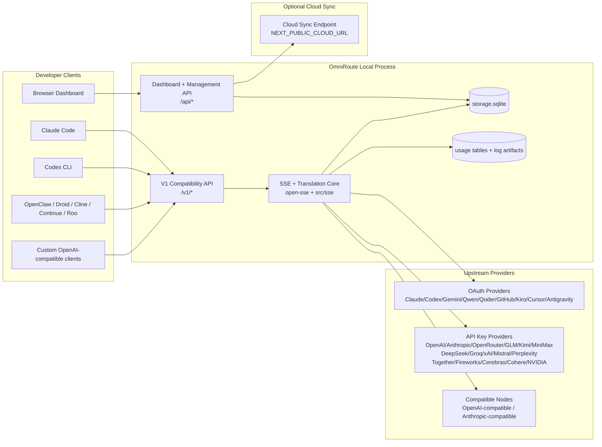
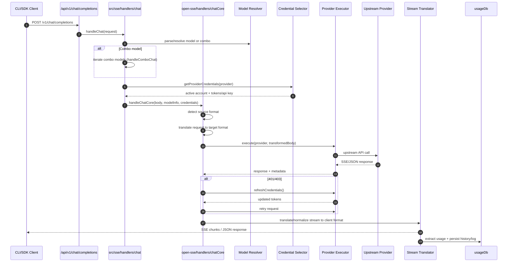
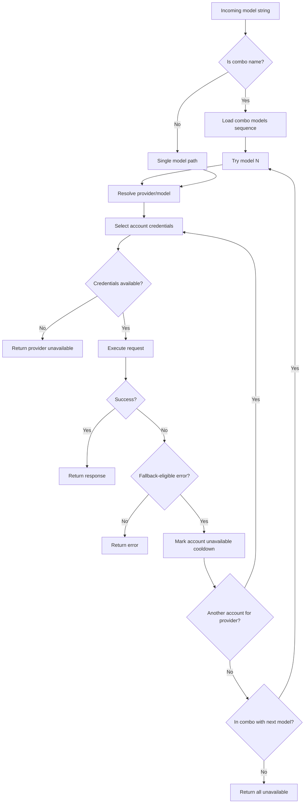
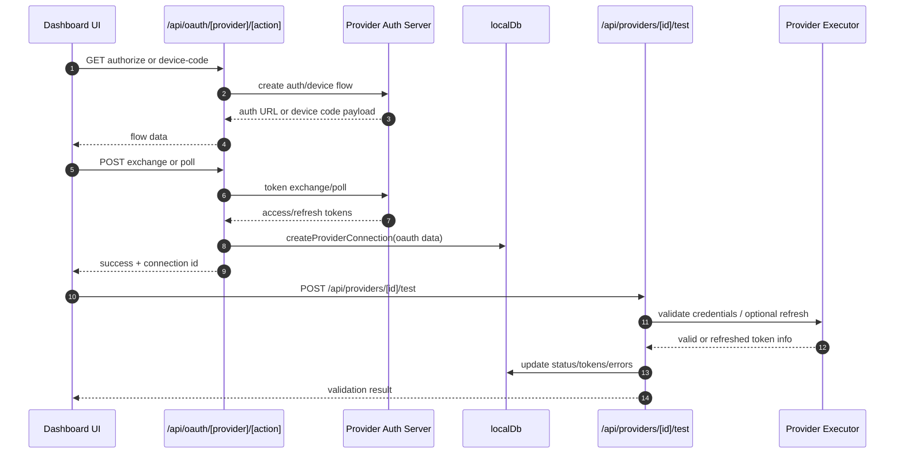
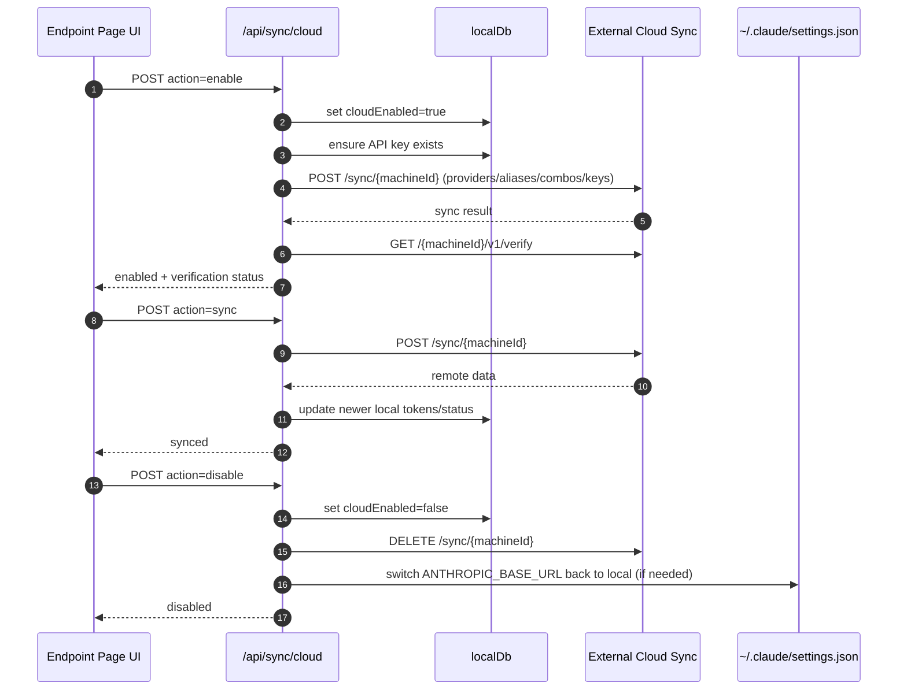
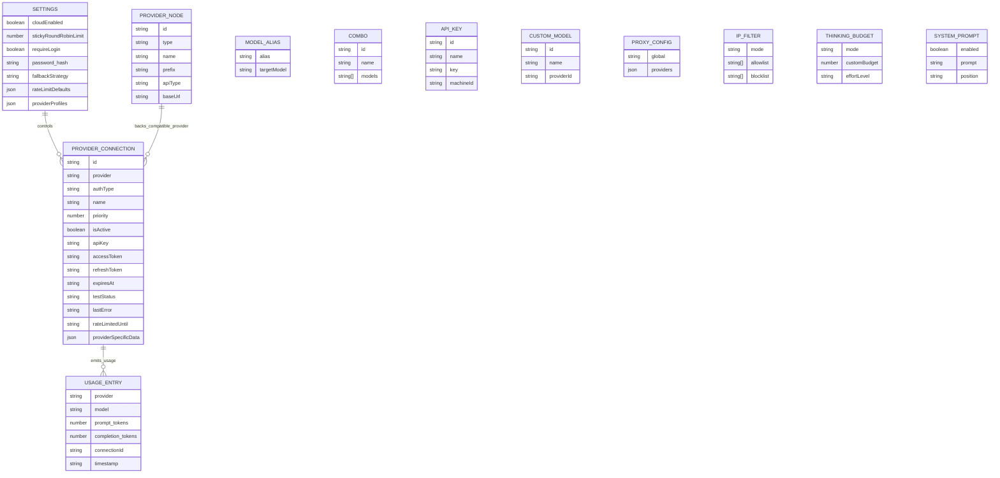
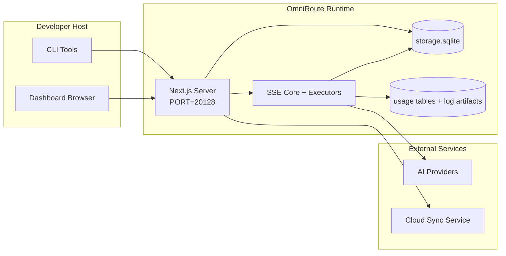

# OmniRoute Architecture (Čeština)

🌐 **Languages:** 🇺🇸 [English](../../../../docs/ARCHITECTURE.md) · 🇪🇸 [es](../../es/docs/ARCHITECTURE.md) · 🇫🇷 [fr](../../fr/docs/ARCHITECTURE.md) · 🇩🇪 [de](../../de/docs/ARCHITECTURE.md) · 🇮🇹 [it](../../it/docs/ARCHITECTURE.md) · 🇷🇺 [ru](../../ru/docs/ARCHITECTURE.md) · 🇨🇳 [zh-CN](../../zh-CN/docs/ARCHITECTURE.md) · 🇯🇵 [ja](../../ja/docs/ARCHITECTURE.md) · 🇰🇷 [ko](../../ko/docs/ARCHITECTURE.md) · 🇸🇦 [ar](../../ar/docs/ARCHITECTURE.md) · 🇮🇳 [hi](../../hi/docs/ARCHITECTURE.md) · 🇮🇳 [in](../../in/docs/ARCHITECTURE.md) · 🇹🇭 [th](../../th/docs/ARCHITECTURE.md) · 🇻🇳 [vi](../../vi/docs/ARCHITECTURE.md) · 🇮🇩 [id](../../id/docs/ARCHITECTURE.md) · 🇲🇾 [ms](../../ms/docs/ARCHITECTURE.md) · 🇳🇱 [nl](../../nl/docs/ARCHITECTURE.md) · 🇵🇱 [pl](../../pl/docs/ARCHITECTURE.md) · 🇸🇪 [sv](../../sv/docs/ARCHITECTURE.md) · 🇳🇴 [no](../../no/docs/ARCHITECTURE.md) · 🇩🇰 [da](../../da/docs/ARCHITECTURE.md) · 🇫🇮 [fi](../../fi/docs/ARCHITECTURE.md) · 🇵🇹 [pt](../../pt/docs/ARCHITECTURE.md) · 🇷🇴 [ro](../../ro/docs/ARCHITECTURE.md) · 🇭🇺 [hu](../../hu/docs/ARCHITECTURE.md) · 🇧🇬 [bg](../../bg/docs/ARCHITECTURE.md) · 🇸🇰 [sk](../../sk/docs/ARCHITECTURE.md) · 🇺🇦 [uk-UA](../../uk-UA/docs/ARCHITECTURE.md) · 🇮🇱 [he](../../he/docs/ARCHITECTURE.md) · 🇵🇭 [phi](../../phi/docs/ARCHITECTURE.md) · 🇧🇷 [pt-BR](../../pt-BR/docs/ARCHITECTURE.md) · 🇨🇿 [cs](../../cs/docs/ARCHITECTURE.md) · 🇹🇷 [tr](../../tr/docs/ARCHITECTURE.md)

---

_Poslední aktualizace: 28.03.2026_## Executive Summary

OmniRoute je místní AI směrovací brána a řídicí panel postavený na Next.js.
Poskytuje jeden koncový bod kompatibilní s OpenAI (`/v1/*`) a směruje provoz přes několik upstreamových poskytovatelů s překladem, nouzovým obnovením, obnovením tokenu a sledováním využití.

Základní schopnosti:

- OpenAI kompatibilní povrch API pro CLI/nástroje (28 poskytovatelů)
- Překlad požadavku/odpovědi mezi formáty poskytovatelů
- Záložní kombinace modelů (sekvence více modelů)
  – Záloha na úrovni účtu (více účtů na poskytovatele)
- Správa připojení poskytovatele OAuth + API klíče
- Generování vkládání pomocí `/v1/embeddings` (6 poskytovatelů, 9 modelů)
- Generování obrázků pomocí `/v1/images/generations` (4 poskytovatelé, 9 modelů)
- Myslete na analýzu značek (`<think>...</think>`) pro modely uvažování
- Dezinfekce odezvy pro přísnou kompatibilitu OpenAI SDK
- Normalizace rolí (vývojář→systém, systém→uživatel) pro kompatibilitu mezi poskytovateli
- Konverze strukturovaného výstupu (json_schema → Gemini responseSchema)
- Místní perzistence pro poskytovatele, klíče, aliasy, komba, nastavení, ceny
- Sledování využití/nákladů a protokolování požadavků
- Volitelná cloudová synchronizace pro synchronizaci mezi více zařízeními/stavy
- Seznam povolených/blokovaných IP pro řízení přístupu k API
- Myslet na správu rozpočtu (průchozí/automatické/vlastní/adaptivní)
- Okamžité vstřikování globálního systému
- Sledování relací a snímání otisků prstů
- Rozšířené omezení sazeb na účet pomocí profilů specifických pro poskytovatele
- Vzor jističe pro odolnost poskytovatele
- Ochrana stáda proti hromu s mutexovým zamykáním
- Mezipaměť deduplikace požadavků na základě podpisu
- Doménová vrstva: dostupnost modelu, nákladová pravidla, záložní politika, politika uzamčení
- Perzistence stavu domény (mezipaměť pro zápis SQLite pro záložní, rozpočty, uzamčení, jističe)
- Modul zásad pro centralizované vyhodnocování požadavků (uzamčení → rozpočet → záložní)
- Vyžádejte si telemetrii s agregací latence p50/p95/p99
- ID korelace (X-Request-Id) pro end-to-end trasování
- Protokolování auditu shody s odhlášením podle klíče API
- Eval rámec pro zajištění kvality LLM
- Řídicí panel Resilience UI se stavem jističe v reálném čase
- Modulární poskytovatelé OAuth (12 jednotlivých modulů pod `src/lib/oauth/providers/`)

Primární runtime model:

- Trasy aplikací Next.js pod `src/app/api/*` implementují jak rozhraní API řídicího panelu, tak rozhraní API pro kompatibilitu
- Sdílené jádro SSE/směrování v `src/sse/*` + `open-sse/*` se stará o provádění poskytovatele, překlad, streamování, zálohování a používání## Scope and Boundaries

### In Scope

- Runtime místní brány
- Rozhraní API pro správu řídicích panelů
- Ověření poskytovatele a obnovení tokenu
- Vyžádejte si překlad a streamování SSE
- Místní stav + perzistence používání
- Volitelná orchestrace synchronizace s cloudem### Out of Scope

- Implementace cloudové služby za `NEXT_PUBLIC_CLOUD_URL`
- Poskytovatel SLA/řídící rovina mimo místní proces
- Samotné externí binární soubory CLI (Claude CLI, Codex CLI atd.)## Dashboard Surface (Current)

Hlavní stránky pod `src/app/(dashboard)/dashboard/`:

- `/dashboard` — rychlý start + přehled poskytovatele
- `/dashboard/endpoint` — proxy koncového bodu + MCP + A2A + karty koncového bodu API
- `/dashboard/providers` — připojení a přihlašovací údaje poskytovatele
- `/dashboard/combos` — kombo strategie, šablony, pravidla směrování modelů
- `/dashboard/costs` — agregace nákladů a viditelnost cen
- `/dashboard/analytics` — analýzy a vyhodnocení využití
- `/dashboard/limits` — kontroly kvót/sazeb
- `/dashboard/cli-tools` — CLI onboarding, runtime detekce, generování konfigurace
- `/dashboard/agents` — detekovaní agenti AKT + vlastní registrace agenta
- `/dashboard/media` — hřiště pro obrázky/video/hudbu
- `/dashboard/search-tools` — testování a historie poskytovatelů vyhledávání
- `/dashboard/health` — doba provozuschopnosti, jističe, limity sazeb
- `/dashboard/logs` — protokoly požadavku/proxy/audit/konzole
- `/dashboard/settings` — karty nastavení systému (obecné, směrování, výchozí kombinace atd.)
- `/dashboard/api-manager` — životní cyklus klíče API a oprávnění k modelu## High-Level System Context



## Core Runtime Components

## 1) API and Routing Layer (Next.js App Routes)

Hlavní adresáře:

- `src/app/api/v1/*` a `src/app/api/v1beta/*` pro rozhraní API pro kompatibilitu
- `src/app/api/*` pro správu/konfiguraci API
- Další přepíše mapu `next.config.mjs` `/v1/*` na `/api/v1/*`

Důležité cesty kompatibility:

- `src/app/api/v1/chat/completions/route.ts`
- `src/app/api/v1/messages/route.ts`
- `src/app/api/v1/responses/route.ts`
- `src/app/api/v1/models/route.ts` — zahrnuje vlastní modely s `custom: true`
- `src/app/api/v1/embeddings/route.ts` — generování vložení (6 poskytovatelů)
- `src/app/api/v1/images/generations/route.ts` — generování obrázků (4+ poskytovatelé včetně Antigravity/Nebius)
- `src/app/api/v1/messages/count_tokens/route.ts`
  – `src/app/api/v1/providers/[poskytovatel]/chat/completions/route.ts` – vyhrazený chat pro jednotlivé poskytovatele
  – `src/app/api/v1/providers/[poskytovatel]/embeddings/route.ts` – vyhrazená vložení pro jednotlivé poskytovatele
- `src/app/api/v1/providers/[poskytovatel]/images/generations/route.ts` – vyhrazené obrázky pro jednotlivé poskytovatele
- `src/app/api/v1beta/models/route.ts`
- `src/app/api/v1beta/models/[...cesta]/route.ts`

Domény správy:

- Auth/settings: `src/app/api/auth/*`, `src/app/api/settings/*`
- Poskytovatelé/připojení: `src/app/api/providers*`
- Uzly poskytovatele: `src/app/api/provider-nodes*`
- Vlastní modely: `src/app/api/provider-models` (GET/POST/DELETE)
- Katalog modelů: `src/app/api/models/route.ts` (GET)
- Konfigurace proxy: `src/app/api/settings/proxy` (GET/PUT/DELETE) + `src/app/api/settings/proxy/test` (POST)
- OAuth: `src/app/api/oauth/*`
- Klíče/aliasy/komba/cena: `src/app/api/keys*`, `src/app/api/models/alias`, `src/app/api/combos*`, `src/app/api/pricing`
- Použití: `src/app/api/usage/*`
- Sync/cloud: `src/app/api/sync/*`, `src/app/api/cloud/*`
- Pomocníci nástrojů CLI: `src/app/api/cli-tools/*`
- IP filtr: `src/app/api/settings/ip-filter` (GET/PUT)
- Thinking budget: `src/app/api/settings/thinking-budget` (GET/PUT)
- Systémová výzva: `src/app/api/settings/system-prompt` (GET/PUT)
- Relace: `src/app/api/sessions` (GET)
- Sazbové limity: `src/app/api/rate-limits` (GET)
- Odolnost: `src/app/api/resilience` (GET/PATCH) — profily poskytovatelů, jistič, stav omezení rychlosti
- Resetování odolnosti: `src/app/api/resilience/reset` (POST) — resetujte jističe + cooldowny
- Statistiky mezipaměti: `src/app/api/cache/stats` (GET/DELETE)
- Dostupnost modelu: `src/app/api/models/availability` (GET/POST)
- Telemetrie: `src/app/api/telemetry/summary` (GET)
  – Rozpočet: `src/app/api/usage/budget` (GET/POST)
- Záložní řetězce: `src/app/api/fallback/chains` (GET/POST/DELETE)
- Audit souladu: `src/app/api/compliance/audit-log` (GET)
- Hodnoty: `src/app/api/evals` (GET/POST), `src/app/api/evals/[suiteId]` (GET)
- Zásady: `src/app/api/policies` (GET/POST)## 2) SSE + Translation Core

Hlavní průtokové moduly:

- Záznam: `src/sse/handlers/chat.ts`
- Základní orchestrace: `open-sse/handlers/chatCore.ts`
- Spouštěcí adaptéry poskytovatele: `open-sse/executors/*`
- Detekce formátu/konfigurace poskytovatele: `open-sse/services/provider.ts`
- Parse/resolve modelu: `src/sse/services/model.ts`, `open-sse/services/model.ts`
- Logika záložního účtu: `open-sse/services/accountFallback.ts`
- Registr překladů: `open-sse/translator/index.ts`
- Transformace streamu: `open-sse/utils/stream.ts`, `open-sse/utils/streamHandler.ts`
- Extrakce/normalizace použití: `open-sse/utils/usageTracking.ts`
- Analyzátor značek Think: `open-sse/utils/thinkTagParser.ts`
- Obsluha vkládání: `open-sse/handlers/embeddings.ts`
- Registr poskytovatele vkládání: `open-sse/config/embeddingRegistry.ts`
- Ovladač generování obrázků: `open-sse/handlers/imageGeneration.ts`
- Registr poskytovatele obrázků: `open-sse/config/imageRegistry.ts`
- Dezinfekce odezvy: `open-sse/handlers/responseSanitizer.ts`
- Normalizace rolí: `open-sse/services/roleNormalizer.ts`

Služby (obchodní logika):

- Výběr účtu/bodování: `open-sse/services/accountSelector.ts`
- Kontextová správa životního cyklu: `open-sse/services/contextManager.ts`
- Vynucení filtru IP: `open-sse/services/ipFilter.ts`
- Sledování relací: `open-sse/services/sessionManager.ts`
- Žádost o deduplikaci: `open-sse/services/signatureCache.ts`
- Vložení příkazu systému: `open-sse/services/systemPrompt.ts`
- Thinking budget management: `open-sse/services/thinkingBudget.ts`
- Směrování modelu se zástupnými znaky: `open-sse/services/wildcardRouter.ts`
- Správa limitu sazby: `open-sse/services/rateLimitManager.ts`
- Jistič: `open-sse/services/circuitBreaker.ts`

Moduly vrstvy domény:

- Dostupnost modelu: `src/lib/domain/modelAvailability.ts`
- Pravidla/rozpočty nákladů: `src/lib/domain/costRules.ts`
- Záložní zásady: `src/lib/domain/fallbackPolicy.ts`
- Combo resolver: `src/lib/domain/comboResolver.ts`
- Zásady uzamčení: `src/lib/domain/lockoutPolicy.ts`
- Modul zásad: `src/domain/policyEngine.ts` — centralizované uzamčení → rozpočet → záložní vyhodnocení
- Katalog chybových kódů: `src/lib/domain/errorCodes.ts`
- ID požadavku: `src/lib/domain/requestId.ts`
- Časový limit načtení: `src/lib/domain/fetchTimeout.ts`
- Žádost o telemetrii: `src/lib/domain/requestTelemetry.ts`
- Soulad/audit: `src/lib/domain/compliance/index.ts`
- Eval runner: `src/lib/domain/evalRunner.ts`
- Trvalost stavu domény: `src/lib/db/domainState.ts` — SQLite CRUD pro záložní řetězce, rozpočty, historii nákladů, stav uzamčení, jističe

Moduly poskytovatele OAuth (12 samostatných souborů pod `src/lib/oauth/providers/`):

- Index registru: `src/lib/oauth/providers/index.ts`
  – Jednotliví poskytovatelé: `claude.ts`, `codex.ts`, `gemini.ts`, `antigravity.ts`, `qoder.ts`, `qwen.ts`, `kimi-coding.ts`, `github.ts`, `kiro.ts`, `cursor.ts`, `kilo`codes`, `kilo`code
- Tenký obal: `src/lib/oauth/providers.ts` — reexporty z jednotlivých modulů## 3) Persistence Layer

Primární stav DB (SQLite):

- Základní jádro: `src/lib/db/core.ts` (better-sqlite3, migrace, WAL)
- Fasáda pro reexport: `src/lib/localDb.ts` (tenká vrstva kompatibility pro volající)
- soubor: `${DATA_DIR}/storage.sqlite` (nebo `$XDG_CONFIG_HOME/omniroute/storage.sqlite`, pokud je nastaven, jinak `~/.omniroute/storage.sqlite`)
- entity (tabulky + jmenné prostory KV): providerConnections, providerNodes, modelAliases, komba, apiKeys, nastavení, ceny,**customModels**,**proxyConfig**,**ipFilter**,**thinkingBudget**,**systemPrompt**

Perzistence při používání:

- fasáda: `src/lib/usageDb.ts` (rozložené moduly v `src/lib/usage/*`)
- SQLite tabulky v `storage.sqlite`: `usage_history`, `call_logs`, `proxy_logs`
- volitelné artefakty souborů zůstávají kvůli kompatibilitě/ladění (`${DATA_DIR}/log.txt`, `${DATA_DIR}/call_logs/`, `<repo>/logs/...`)
- starší soubory JSON jsou migrovány do SQLite migrací při spuštění, pokud jsou k dispozici

Stavová databáze domény (SQLite):

- `src/lib/db/domainState.ts` — operace CRUD pro stav domény
  – Tabulky (vytvořené v `src/lib/db/core.ts`): `domain_fallback_chains`, `domain_budgets`, `domain_cost_history`, `domain_lockout_state`, `domain_circuit_breakers`
- Vzor mezipaměti pro zápis: mapy v paměti jsou autoritativní za běhu; mutace se zapisují synchronně do SQLite; stav je obnoven z DB při studeném startu## 4) Auth + Security Surfaces

- Ověření souboru cookie řídicího panelu: `src/proxy.ts`, `src/app/api/auth/login/route.ts`
- Generování/ověření klíče API: `src/shared/utils/apiKey.ts`
- Tajné informace poskytovatele zůstaly v položkách `providerConnections`
- Podpora odchozích proxy přes `open-sse/utils/proxyFetch.ts` (env vars) a `open-sse/utils/networkProxy.ts` (konfigurovatelné pro jednotlivé poskytovatele nebo globální)## 5) Cloud Sync

- Init plánovače: `src/lib/initCloudSync.ts`, `src/shared/services/initializeCloudSync.ts`, `src/shared/services/modelSyncScheduler.ts`
- Pravidelný úkol: `src/shared/services/cloudSyncScheduler.ts`
- Pravidelný úkol: `src/shared/services/modelSyncScheduler.ts`
- Řídící cesta: `src/app/api/sync/cloud/route.ts`## Request Lifecycle (`/v1/chat/completions`)



## Combo + Account Fallback Flow



Záložní rozhodnutí jsou řízena `open-sse/services/accountFallback.ts` pomocí stavových kódů a heuristiky chybových zpráv. Kombinované směrování přidává ještě jednu ochranu: 400s v rozsahu poskytovatele, jako jsou selhání blokování obsahu a ověřování rolí, jsou považovány za lokální selhání modelu, takže pozdější kombinované cíle mohou stále běžet.## OAuth Onboarding and Token Refresh Lifecycle



Obnovení během živého provozu se provádí uvnitř `open-sse/handlers/chatCore.ts` prostřednictvím spouštěče `refreshCredentials()`.## Cloud Sync Lifecycle (Enable / Sync / Disable)



Pravidelnou synchronizaci spouští „CloudSyncScheduler“, když je povolen cloud.## Data Model and Storage Map



Soubory fyzického úložiště:

- primární runtime DB: `${DATA_DIR}/storage.sqlite`
- řádky protokolu požadavku: `${DATA_DIR}/log.txt` (artefakt compat/debug)
- archivy strukturovaného obsahu volání: `${DATA_DIR}/call_logs/`
- volitelné relace ladění překladatele/požadavku: `<repo>/logs/...`## Deployment Topology



## Module Mapping (Decision-Critical)

### Route and API Modules

- `src/app/api/v1/*`, `src/app/api/v1beta/*`: rozhraní API pro kompatibilitu
- `src/app/api/v1/providers/[poskytovatel]/*`: vyhrazené trasy pro jednotlivé poskytovatele (chat, vkládání, obrázky)
- `src/app/api/providers*`: poskytovatel CRUD, ověření, testování
- `src/app/api/provider-nodes*`: vlastní kompatibilní správa uzlů
- `src/app/api/provider-models`: správa vlastních modelů (CRUD)
- `src/app/api/models/route.ts`: API katalogu modelů (aliasy + vlastní modely)
- `src/app/api/oauth/*`: toky OAuth/kódu zařízení
- `src/app/api/keys*`: životní cyklus místního klíče API
- `src/app/api/models/alias`: správa aliasů
- `src/app/api/combos*`: správa záložních kombinací
- `src/app/api/pricing`: přepisy cen pro výpočet nákladů
- `src/app/api/settings/proxy`: konfigurace proxy (GET/PUT/DELETE)
- `src/app/api/settings/proxy/test`: test odchozího proxy připojení (POST)
- `src/app/api/usage/*`: využití a protokoly API
- `src/app/api/sync/*` + `src/app/api/cloud/*`: cloudová synchronizace a pomocníci pro cloud
- `src/app/api/cli-tools/*`: místní zapisovače/kontroly konfigurace CLI
- `src/app/api/settings/ip-filter`: seznam povolených/blokovaných IP adres (GET/PUT)
- `src/app/api/settings/thinking-budget`: konfigurace rozpočtu tokenu myšlení (GET/PUT)
- `src/app/api/settings/system-prompt`: globální systémová výzva (GET/PUT)
- `src/app/api/sessions`: seznam aktivních relací (GET)
- `src/app/api/rate-limits`: stav limitu sazby na účet (GET)### Routing and Execution Core

- `src/sse/handlers/chat.ts`: analýza požadavků, zpracování kombinací, smyčka výběru účtu
- `open-sse/handlers/chatCore.ts`: překlad, odeslání exekutora, zpracování opakování/obnovení, nastavení streamu
- `open-sse/executors/*`: chování sítě a formátu specifické pro poskytovatele### Translation Registry and Format Converters

- `open-sse/translator/index.ts`: registr a orchestrace překladatelů
- Požadavek na překladatele: `open-sse/translator/request/*`
- Překladače odpovědí: `open-sse/translator/response/*`
- Formátové konstanty: `open-sse/translator/formats.ts`### Persistence

- `src/lib/db/*`: trvalá trvalá konfigurace/stav a doména na SQLite
- `src/lib/localDb.ts`: reexport kompatibility pro moduly DB
- `src/lib/usageDb.ts`: fasáda historie použití/protokolů volání nad tabulkami SQLite## Provider Executor Coverage (Strategy Pattern)

Každý poskytovatel má specializovaný spouštěč rozšiřující `BaseExecutor` (v `open-sse/executors/base.ts`), který poskytuje vytváření URL, konstrukci záhlaví, opakování s exponenciálním stažením, háky pro obnovení pověření a metodu orchestrace `execute()`.

| Exekutor              | Poskytovatel(é)                                                                                                                                              | Speciální manipulace                                                                     |
| --------------------- | ------------------------------------------------------------------------------------------------------------------------------------------------------------ | ---------------------------------------------------------------------------------------- |
| `DefaultExecutor`     | OpenAI, Claude, Gemini, Qwen, Qoder, OpenRouter, GLM, Kimi, MiniMax, DeepSeek, Groq, xAI, Mistral, Perplexity, Together, Fireworks, Cerebras, Cohere, NVIDIA | Dynamická konfigurace URL/záhlaví na poskytovatele                                       |
| "AntigravityExecutor" | Google Antigravity                                                                                                                                           | Vlastní ID projektů/relací, Opakovat po analýze                                          |
| "CodexExecutor"       | Kodex OpenAI                                                                                                                                                 | Vkládá systémové instrukce, nutí k logickému úsilí                                       |
| `CursorExecutor`      | Kurzor IDE                                                                                                                                                   | Protokol ConnectRPC, kódování Protobuf, podepisování požadavků pomocí kontrolního součtu |
| "GithubExecutor"      | GitHub Copilot                                                                                                                                               | Obnovení tokenu druhého pilota, hlavičky napodobující VSCode                             |
| "KiroExecutor"        | AWS CodeWhisperer/Kiro                                                                                                                                       | Binární formát AWS EventStream → konverze SSE                                            |
| "GeminiCLIExecutor"   | Gemini CLI                                                                                                                                                   | Cyklus obnovení tokenu Google OAuth                                                      |

Všichni ostatní poskytovatelé (včetně vlastních kompatibilních uzlů) používají `DefaultExecutor`.## Provider Compatibility Matrix

| Poskytovatel     | Formát           | Auth                     | Stream               | Nestreamovat | Obnovení tokenu | Použití API         |
| ---------------- | ---------------- | ------------------------ | -------------------- | ------------ | --------------- | ------------------- | ------------------------------ |
| Claude           | claude           | Klíč API / OAuth         | ✅                   | ✅           | ✅              | ⚠️ Pouze správce    |
| Blíženci         | Blíženci         | Klíč API / OAuth         | ✅                   | ✅           | ✅              | ⚠️ Cloudová konzole |
| Gemini CLI       | gemini-cli       | OAuth                    | ✅                   | ✅           | ✅              | ⚠️ Cloudová konzole |
| Antigravitace    | antigravitace    | OAuth                    | ✅                   | ✅           | ✅              | ✅ Plná kvóta API   |
| OpenAI           | openai           | API klíč                 | ✅                   | ✅           | ❌              | ❌                  |
| Codex            | openai-responses | OAuth                    | ✅ nuceně            | ❌           | ✅              | ✅ Sazbové limity   |
| GitHub Copilot   | openai           | OAuth + Copilot Token    | ✅                   | ✅           | ✅              | ✅ Snímky kvót      |
| Kurzor           | kurzor           | Vlastní kontrolní součet | ✅                   | ✅           | ❌              | ❌                  |
| Kiro             | kiro             | AWS SSO OIDC             | ✅ (Stream událostí) | ❌           | ✅              | ✅ Limity použití   |
| Qwen             | openai           | OAuth                    | ✅                   | ✅           | ✅              | ⚠️ Na vyžádání      |
| Qoder            | openai           | OAuth (základní)         | ✅                   | ✅           | ✅              | ⚠️ Na vyžádání      |
| OpenRouter       | openai           | API klíč                 | ✅                   | ✅           | ❌              | ❌                  |
| GLM/Kimi/MiniMax | claude           | API klíč                 | ✅                   | ✅           | ❌              | ❌                  |
| DeepSeek         | openai           | API klíč                 | ✅                   | ✅           | ❌              | ❌                  |
| Groq             | openai           | API klíč                 | ✅                   | ✅           | ❌              | ❌                  |
| xAI (Grok)       | openai           | API klíč                 | ✅                   | ✅           | ❌              | ❌                  |
| Mistral          | openai           | API klíč                 | ✅                   | ✅           | ❌              | ❌                  |
| Zmatenost        | openai           | API klíč                 | ✅                   | ✅           | ❌              | ❌                  |
| Společně AI      | openai           | Klíč API                 | ✅                   | ✅           | ❌              | ❌                  |
| Ohňostroje AI    | openai           | API klíč                 | ✅                   | ✅           | ❌              | ❌                  |
| Cerebras         | openai           | API klíč                 | ✅                   | ✅           | ❌              | ❌                  |
| Cohere           | openai           | API klíč                 | ✅                   | ✅           | ❌              | ❌                  |
| NVIDIA NIM       | openai           | API klíč                 | ✅                   | ✅           | ❌              | ❌                  | ## Format Translation Coverage |

Mezi zjištěné zdrojové formáty patří:

- "openai".
- "openai-odpovědi".
- "claude".
- "blíženci".

Mezi cílové formáty patří:

- OpenAI chat/odpovědi
- Claude
- Gemini/Gemini-CLI/Antigravitační obálka
- Kiro
- Kurzor

Překlady používají**OpenAI jako formát centra**— všechny konverze procházejí přes OpenAI jako prostředník:```
Source Format → OpenAI (hub) → Target Format

````

Překlady jsou vybírány dynamicky na základě tvaru zdrojové užitečné zátěže a cílového formátu poskytovatele.

Další vrstvy zpracování v překladovém potrubí:

-**Dezinfekce odezvy**– Odstraňuje nestandardní pole z odpovědí ve formátu OpenAI (streamovaných i nestreamovaných), aby byla zajištěna přísná shoda se sadou SDK
-**Normalizace rolí**— Převádí `vývojář` → `systém` pro jiné cíle než OpenAI; sloučí `systém` → `uživatel` pro modely, které odmítají systémovou roli (GLM, ERNIE)
–**Extrakce značek Think**– analyzuje bloky „<think>...</think>“ z obsahu do pole „reasoning_content“
–**Strukturovaný výstup**– Převádí OpenAI `response_format.json_schema` na Gemini `responseMimeType` + `responseSchema`## Supported API Endpoints

| Koncový bod | Formát | Psovod |
| --------------------------------------------------- | ------------------- | -------------------------------------------------------------------- |
| `POST /v1/chat/completions` | Chat OpenAI | `src/sse/handlers/chat.ts` |
| `POST /v1/messages` | Claude Messages | Stejná obsluha (automaticky zjištěna) |
| `POST /v1/responses` | Odezvy OpenAI | `open-sse/handlers/responsesHandler.ts` |
| `POST /v1/embeddings` | OpenAI Embeddings | `open-sse/handlers/embeddings.ts` |
| `ZÍSKAT /v1/embeddings` | Seznam modelů | Cesta API |
| `POST /v1/images/generations` | Obrázky OpenAI | `open-sse/handlers/imageGeneration.ts` |
| `ZÍSKAT /v1/images/generations` | Seznam modelů | Cesta API |
| `POST /v1/providers/{provider}/chat/completions` | Chat OpenAI | Vyhrazené na poskytovatele s ověřením modelu |
| `POST /v1/providers/{provider}/embeddings` | OpenAI Embeddings | Vyhrazené na poskytovatele s ověřením modelu |
| `POST /v1/providers/{poskytovatel}/images/generations` | Obrázky OpenAI | Vyhrazené na poskytovatele s ověřením modelu |
| `POST /v1/messages/count_tokens` | Počet tokenů Claude | Cesta API |
| `GET /v1/models` | Seznam modelů OpenAI | Cesta API (chat + vkládání + obrázek + vlastní modely) |
| `GET /api/models/catalog` | Katalog | Všechny modely seskupené podle poskytovatele + typ |
| `POST /v1beta/models/*:streamGenerateContent` | Blíženec domorodec | Cesta API |
| `GET/PUT/DELETE /api/settings/proxy` | Konfigurace proxy | Konfigurace síťového proxy |
| `POST /api/settings/proxy/test` | Připojení proxy | Koncový bod testu stavu proxy/konektivity |
| `GET/POST/DELETE /api/provider-models` | Modely poskytovatelů | Vlastní a spravované dostupné modely podporují metadata modelu poskytovatele |## Bypass Handler

Obslužná rutina bypassu (`open-sse/utils/bypassHandler.ts`) zachycuje známé požadavky na „zahození“ od Claude CLI – zahřívací pingy, extrakce titulů a počty tokenů – a vrací**falešnou odpověď**, aniž by spotřebovával tokeny poskytovatele upstream. To se spustí pouze v případě, že `User-Agent` obsahuje `claude-cli`.## Request Logger Pipeline

Záznamník požadavků (`open-sse/utils/requestLogger.ts`) poskytuje 7fázový kanál protokolování ladění, který je ve výchozím nastavení vypnutý, povolený pomocí `ENABLE_REQUEST_LOGS=true`:```
1_req_client.json → 2_req_source.json → 3_req_openai.json → 4_req_target.json
→ 5_res_provider.txt → 6_res_openai.txt → 7_res_client.txt
````

Soubory se zapisují do `<repo>/logs/<session>/` pro každou relaci požadavku.## Failure Modes and Resilience

## 1) Account/Provider Availability

- Cooldown účtu poskytovatele při přechodných chybách/chybách rychlosti/autorizace
- záložní účet před neúspěšným žádostí
- Záloha kombinovaného modelu, když je vyčerpána aktuální cesta modelu/poskytovatele## 2) Token Expiry

- Předběžná kontrola a obnovení s opakovaným pokusem pro poskytovatele obnovitelných zdrojů
- 401/403 opakování po pokusu o obnovení v cestě jádra## 3) Stream Safety

- řadič toku s vědomím odpojení
- překladový proud s vyprázdněním konce proudu a zpracováním `[DONE]`
- záložní odhad využití, když chybí metadata využití poskytovatele## 4) Cloud Sync Degradation

- Objeví se chyby synchronizace, ale místní běh pokračuje
- plánovač má logiku umožňující opakování, ale periodické spouštění aktuálně standardně volá synchronizaci na jeden pokus## 5) Data Integrity

- Migrace schémat SQLite a automatické upgrady při spuštění
- starší cesta ke kompatibilitě migrace JSON → SQLite## Observability and Operational Signals

Zdroje viditelnosti za běhu:

- protokoly konzoly z `src/sse/utils/logger.ts`
- agregáty využití na žádost v SQLite (`usage_history`, `call_logs`, `proxy_logs`)
- čtyřfázové podrobné zachycení užitečného zatížení v SQLite (`request_detail_logs`), když `settings.detailed_logs_enabled=true`
- textový protokol o stavu požadavku v `log.txt` (nepovinné/kompatibilní)
- volitelné protokoly hlubokých požadavků/překladů pod `logs/`, když `ENABLE_REQUEST_LOGS=true`
- koncové body využití řídicího panelu (`/api/usage/*`) pro spotřebu uživatelského rozhraní

Podrobné zachycení datové části požadavku ukládá až čtyři fáze datové zátěže JSON na směrované volání:

- nezpracovaný požadavek přijatý od klienta
- přeložená žádost skutečně odeslaná proti proudu
- odpověď poskytovatele rekonstruovaná jako JSON; streamované odpovědi jsou komprimovány do konečného shrnutí plus metadata streamu
- konečná odpověď klienta vrácená OmniRoute; streamované odpovědi jsou uloženy ve stejném kompaktním souhrnném formuláři## Security-Sensitive Boundaries

- Tajný klíč JWT (`JWT_SECRET`) zajišťuje ověřování/podepisování souborů cookie relace řídicího panelu
- Počáteční zaváděcí heslo (`INITIAL_PASSWORD`) by mělo být explicitně nakonfigurováno pro zřizování při prvním spuštění
- Tajný klíč API HMAC (`API_KEY_SECRET`) zabezpečuje vygenerovaný formát lokálního klíče API
- Tajné informace poskytovatele (klíče/tokeny API) jsou uloženy v místní databázi a měly by být chráněny na úrovni souborového systému
- Koncové body synchronizace cloudu se spoléhají na sémantiku klíče API + ID počítače## Environment and Runtime Matrix

Proměnné prostředí aktivně používané kódem:

- Aplikace/auth: `JWT_SECRET`, `INITIAL_PASSWORD`
- Úložiště: `DATA_DIR`
- Kompatibilní chování uzlu: `ALLOW_MULTI_CONNECTIONS_PER_COMPAT_NODE`
- Volitelné přepsání základny úložiště (Linux/macOS, když není `DATA_DIR` nastaveno): `XDG_CONFIG_HOME`
  – Bezpečnostní hash: `API_KEY_SECRET`, `MACHINE_ID_SALT`
- Protokolování: `ENABLE_REQUEST_LOGS`
  – Synchronizace/cloudové URL: `NEXT_PUBLIC_BASE_URL`, `NEXT_PUBLIC_CLOUD_URL`
  – Outbound proxy: `HTTP_PROXY`, `HTTPS_PROXY`, `ALL_PROXY`, `NO_PROXY` a varianty s malými písmeny
- Příznaky funkce SOCKS5: `ENABLE_SOCKS5_PROXY`, `NEXT_PUBLIC_ENABLE_SOCKS5_PROXY`
- Pomocníci platformy/běhu (nikoli konfigurace specifická pro aplikaci): `APPDATA`, `NODE_ENV`, `PORT`, `HOSTNAME`## Known Architectural Notes

1. `usageDb` a `localDb` sdílejí stejnou zásadu základního adresáře (`DATA_DIR` -> `XDG_CONFIG_HOME/omniroute` -> `~/.omniroute`) se starší migrací souborů.
2. `/api/v1/route.ts` deleguje stejný tvůrce jednotného katalogu, který používá `/api/v1/models` (`src/app/api/v1/models/catalog.ts`), aby se zabránilo sémantickému posunu.
3. Pokud je povoleno, zapisovač požadavku zapisuje celé záhlaví/tělo; považovat adresář log za citlivý.
4. Chování cloudu závisí na správné dosažitelnosti koncového bodu cloudu „NEXT_PUBLIC_BASE_URL“.
5. Adresář `open-sse/` je publikován jako balíček `@omniroute/open-sse`**npm workspace**. Zdrojový kód jej importuje přes `@omniroute/open-sse/...` (vyřešeno Next.js `transpilePackages`). Cesty k souborům v tomto dokumentu stále používají název adresáře `open-sse/` kvůli konzistenci.
6. Grafy v řídicím panelu používají**Recharts**(založené na SVG) pro přístupné, interaktivní analytické vizualizace (sloupcové grafy využití modelu, tabulky rozdělení poskytovatelů s mírou úspěšnosti).
7. E2E testy používají**Playwright**(`tests/e2e/`), spouštěné přes `npm run test:e2e`. Unit testy používají**Node.js test runner**(`tests/unit/`), spouštějí se přes `npm run test:unit`. Zdrojový kód pod `src/` je**TypeScript**(`.ts`/`.tsx`); pracovní prostor `open-sse/` zůstává JavaScriptem (`.js`).
8. Stránka Nastavení je uspořádána do 5 záložek: Zabezpečení, Směrování (6 globálních strategií: fill-first, round-robin, p2c, náhodné, nejméně používané, nákladově optimalizované), Odolnost (upravitelné rychlostní limity, jistič, zásady), AI (rozpočet myšlení, systémová výzva, mezipaměť výzvy), Pokročilé (proxy).## Operational Verification Checklist

- Sestavení ze zdroje: `npm run build`
- Sestavení obrazu Dockeru: `docker build -t omniroute .`
- Spusťte službu a ověřte:
- `GET /api/settings`
- `GET /api/v1/models`
- Základní adresa URL cíle CLI by měla být `http://<hostitel>:20128/v1`, když `PORT=20128`
