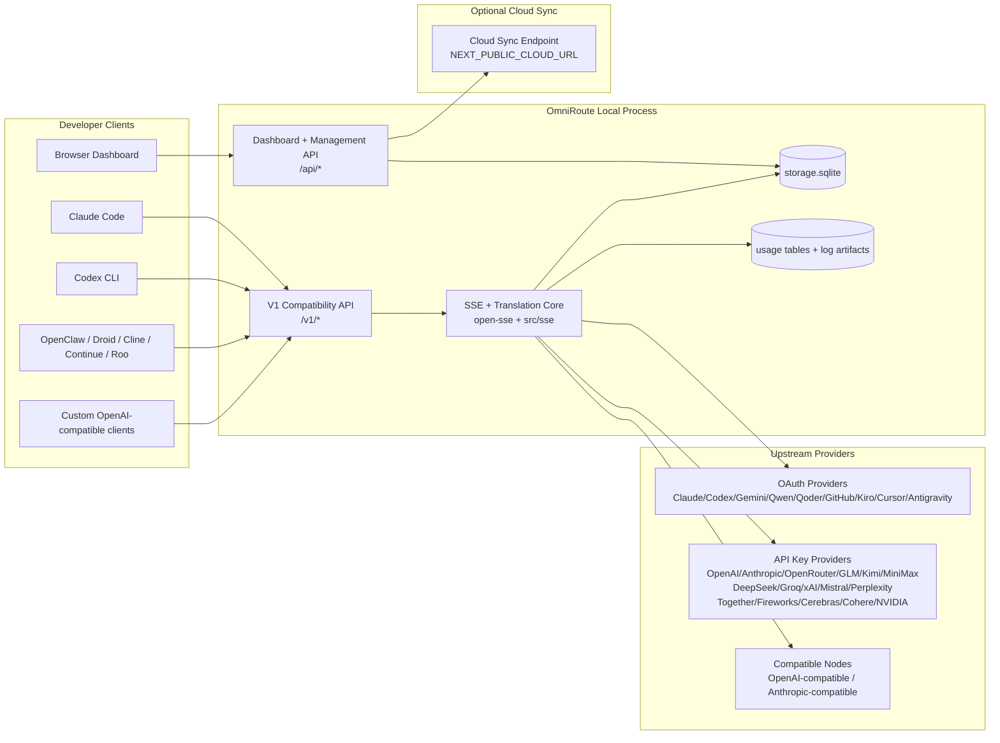
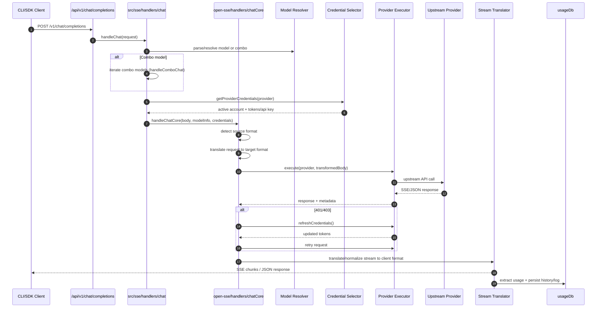
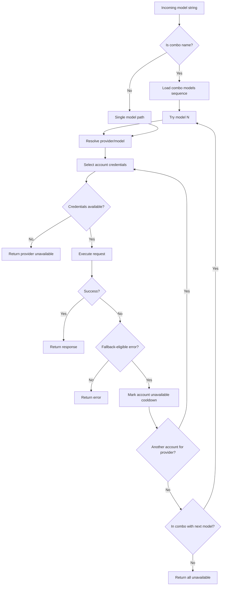
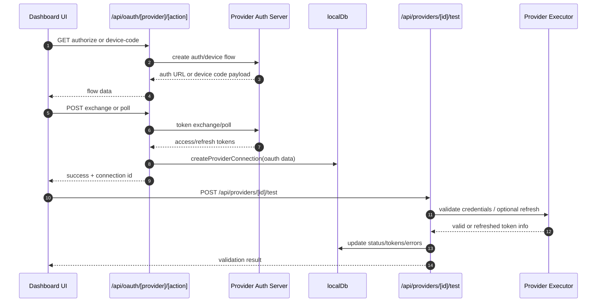
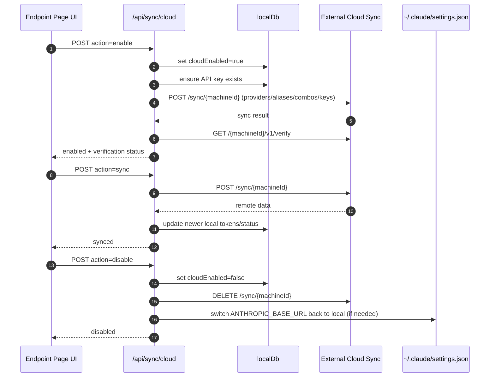
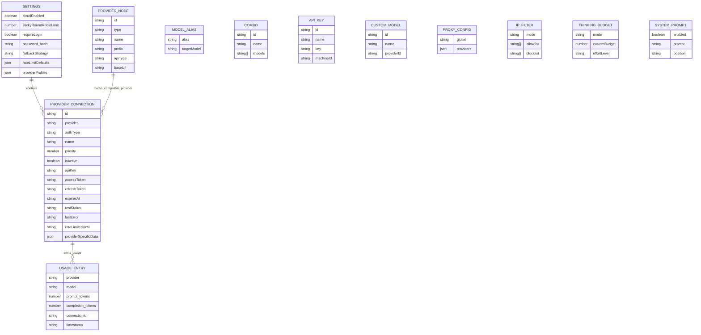
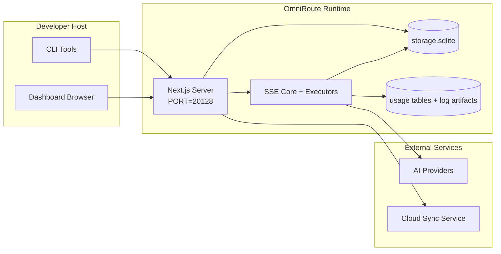

# OmniRoute Architecture (Dansk)

🌐 **Languages:** 🇺🇸 [English](../../../../docs/ARCHITECTURE.md) · 🇪🇸 [es](../../es/docs/ARCHITECTURE.md) · 🇫🇷 [fr](../../fr/docs/ARCHITECTURE.md) · 🇩🇪 [de](../../de/docs/ARCHITECTURE.md) · 🇮🇹 [it](../../it/docs/ARCHITECTURE.md) · 🇷🇺 [ru](../../ru/docs/ARCHITECTURE.md) · 🇨🇳 [zh-CN](../../zh-CN/docs/ARCHITECTURE.md) · 🇯🇵 [ja](../../ja/docs/ARCHITECTURE.md) · 🇰🇷 [ko](../../ko/docs/ARCHITECTURE.md) · 🇸🇦 [ar](../../ar/docs/ARCHITECTURE.md) · 🇮🇳 [hi](../../hi/docs/ARCHITECTURE.md) · 🇮🇳 [in](../../in/docs/ARCHITECTURE.md) · 🇹🇭 [th](../../th/docs/ARCHITECTURE.md) · 🇻🇳 [vi](../../vi/docs/ARCHITECTURE.md) · 🇮🇩 [id](../../id/docs/ARCHITECTURE.md) · 🇲🇾 [ms](../../ms/docs/ARCHITECTURE.md) · 🇳🇱 [nl](../../nl/docs/ARCHITECTURE.md) · 🇵🇱 [pl](../../pl/docs/ARCHITECTURE.md) · 🇸🇪 [sv](../../sv/docs/ARCHITECTURE.md) · 🇳🇴 [no](../../no/docs/ARCHITECTURE.md) · 🇩🇰 [da](../../da/docs/ARCHITECTURE.md) · 🇫🇮 [fi](../../fi/docs/ARCHITECTURE.md) · 🇵🇹 [pt](../../pt/docs/ARCHITECTURE.md) · 🇷🇴 [ro](../../ro/docs/ARCHITECTURE.md) · 🇭🇺 [hu](../../hu/docs/ARCHITECTURE.md) · 🇧🇬 [bg](../../bg/docs/ARCHITECTURE.md) · 🇸🇰 [sk](../../sk/docs/ARCHITECTURE.md) · 🇺🇦 [uk-UA](../../uk-UA/docs/ARCHITECTURE.md) · 🇮🇱 [he](../../he/docs/ARCHITECTURE.md) · 🇵🇭 [phi](../../phi/docs/ARCHITECTURE.md) · 🇧🇷 [pt-BR](../../pt-BR/docs/ARCHITECTURE.md) · 🇨🇿 [cs](../../cs/docs/ARCHITECTURE.md) · 🇹🇷 [tr](../../tr/docs/ARCHITECTURE.md)

---

_Sidst opdateret: 2026-03-28_## Executive Summary

OmniRoute er en lokal AI-routinggateway og dashboard bygget på Next.js.
Det giver et enkelt OpenAI-kompatibelt slutpunkt (`/v1/*`) og dirigerer trafik på tværs af flere upstream-udbydere med oversættelse, fallback, token-opdatering og brugssporing.

Kerneegenskaber:

- OpenAI-kompatibel API-overflade til CLI/værktøjer (28 udbydere)
- Anmodning/svar oversættelse på tværs af udbyderformater
- Model combo fallback (multi-model sekvens)
- Fallback på kontoniveau (multi-konto pr. udbyder)
- Administration af forbindelse til OAuth + API-nøgleudbyder
- Indlejringsgenerering via `/v1/embeddings` (6 udbydere, 9 modeller)
- Billedgenerering via `/v1/images/generations` (4 udbydere, 9 modeller)
- Tænk tag-parsing (`<think>...</think>`) for ræsonneringsmodeller
- Response sanitization for streng OpenAI SDK-kompatibilitet
- Rollenormalisering (udvikler→system, system→bruger) for kompatibilitet på tværs af udbydere
- Struktureret outputkonvertering (json_schema → Gemini responseSchema)
- Lokal persistens for udbydere, nøgler, aliaser, kombinationer, indstillinger, priser
- Brug/omkostningssporing og anmodningslogning
- Valgfri skysynkronisering til synkronisering af flere enheder/tilstande
- IP-tilladelsesliste/blokeringsliste til API-adgangskontrol
- Tænkende budgetstyring (passthrough/auto/custom/adaptive)
- Global system prompt injektion
- Sessionssporing og fingeraftryk
- Forbedret prisbegrænsning pr. konto med udbyderspecifikke profiler
- Circuit breaker mønster for udbyderens modstandsdygtighed
- Anti-tordenbeskyttelse med mutex-låsning
- Signaturbaseret anmodnings deduplikeringscache
- Domænelag: modeltilgængelighed, omkostningsregler, fallback-politik, lockout-politik
- Vedvarende domænetilstand (SQLite-gennemskrivningscache til fallbacks, budgetter, lockouts, strømafbrydere)
- Politikmotor til centraliseret anmodningsevaluering (lockout → budget → fallback)
- Anmod om telemetri med p50/p95/p99 latency aggregering
- Korrelations-ID (X-Request-Id) til ende-til-ende-sporing
- Overholdelsesrevisionslogning med opt-out pr. API-nøgle
- Evalueringsramme for LLM kvalitetssikring
- Resilience UI-dashboard med strømafbryderstatus i realtid
- Modulære OAuth-udbydere (12 individuelle moduler under `src/lib/oauth/providers/`)

Primær runtime model:

- Next.js app-ruter under `src/app/api/*` implementerer både dashboard-API'er og kompatibilitets-API'er
- En delt SSE/routingkerne i `src/sse/*` + `open-sse/*` håndterer udbyderens udførelse, oversættelse, streaming, fallback og brug## Scope and Boundaries

### In Scope

- Lokal gateway køretid
- Dashboard management API'er
- Udbydergodkendelse og tokenopdatering
- Anmod om oversættelse og SSE-streaming
- Lokal stat + vedvarende brug
- Valgfri skysynkroniseringsorkestrering### Out of Scope

- Implementering af skytjenester bag `NEXT_PUBLIC_CLOUD_URL`
- Udbyder SLA/kontrolplan uden for lokal proces
- Eksterne CLI-binære filer selv (Claude CLI, Codex CLI osv.)## Dashboard Surface (Current)

Hovedsider under `src/app/(dashboard)/dashboard/`:

- `/dashboard` — hurtig start + udbyderoversigt
- `/dashboard/endpoint` — endpoint proxy + MCP + A2A + API endpoint faner
- `/dashboard/providers` — udbyderforbindelser og legitimationsoplysninger
- `/dashboard/combos` — kombinationsstrategier, skabeloner, modelrutingsregler
- `/dashboard/costs` — prissammenlægning og prissynlighed
- `/dashboard/analytics` — brugsanalyse og -evalueringer
- `/dashboard/limits` — kvote-/satskontrol
- `/dashboard/cli-tools` — CLI onboarding, runtime detection, config generation
- `/dashboard/agents` — opdagede ACP-agenter + tilpasset agentregistrering
- `/dashboard/media` — billed-/video-/musiklegeplads
- `/dashboard/search-tools` — test af søgeudbydere og historik
- `/dashboard/health` — oppetid, strømafbrydere, hastighedsgrænser
- `/dashboard/logs` — request/proxy/audit/console logs
- `/dashboard/indstillinger` — systemindstillinger faner (generelt, routing, kombinationsstandarder osv.)
- `/dashboard/api-manager` — API-nøglelivscyklus og modeltilladelser## High-Level System Context



## Core Runtime Components

## 1) API and Routing Layer (Next.js App Routes)

Hovedmapper:

- `src/app/api/v1/*` og `src/app/api/v1beta/*` til kompatibilitets-API'er
- `src/app/api/*` til administrations-/konfigurations-API'er
- Næste omskrivninger i `next.config.mjs` map `/v1/*` til `/api/v1/*`

Vigtige kompatibilitetsruter:

- `src/app/api/v1/chat/completions/route.ts`
- `src/app/api/v1/messages/route.ts`
- `src/app/api/v1/responses/route.ts`
- `src/app/api/v1/models/route.ts` – inkluderer brugerdefinerede modeller med `custom: true`
- `src/app/api/v1/embeddings/route.ts` — indlejringsgenerering (6 udbydere)
- `src/app/api/v1/images/generations/route.ts` — billedgenerering (4+ udbydere inkl. Antigravity/Nebius)
- `src/app/api/v1/messages/count_tokens/route.ts`
- `src/app/api/v1/providers/[provider]/chat/completions/route.ts` — dedikeret chat pr. udbyder
- `src/app/api/v1/providers/[provider]/embeddings/route.ts` — dedikerede indlejringer pr. udbyder
- `src/app/api/v1/providers/[provider]/images/generations/route.ts` — dedikerede billeder pr. udbyder
- `src/app/api/v1beta/models/route.ts`
- `src/app/api/v1beta/models/[...path]/route.ts`

Ledelsesdomæner:

- Godkendelse/indstillinger: `src/app/api/auth/*`, `src/app/api/settings/*`
- Udbydere/forbindelser: `src/app/api/providers*`
- Provider noder: `src/app/api/provider-nodes*`
- Brugerdefinerede modeller: `src/app/api/provider-models` (GET/POST/DELETE)
- Modelkatalog: `src/app/api/models/route.ts` (GET)
- Proxy config: `src/app/api/settings/proxy` (GET/PUT/DELETE) + `src/app/api/settings/proxy/test` (POST)
- OAuth: `src/app/api/oauth/*`
- Keys/aliases/combos/pricing: `src/app/api/keys*`, `src/app/api/models/alias`, `src/app/api/combos*`, `src/app/api/pricing`
- Brug: `src/app/api/usage/*`
- Sync/cloud: `src/app/api/sync/*`, `src/app/api/cloud/*`
- CLI-værktøjshjælpere: `src/app/api/cli-tools/*`
- IP-filter: `src/app/api/settings/ip-filter` (GET/PUT)
- Tænkebudget: `src/app/api/settings/thinking-budget` (GET/PUT)
- Systemprompt: `src/app/api/settings/system-prompt` (GET/PUT)
- Sessioner: `src/app/api/sessions` (GET)
- Satsgrænser: `src/app/api/rate-limits` (GET)
- Resiliens: `src/app/api/resilience` (GET/PATCH) — udbyderprofiler, afbryder, hastighedsgrænsetilstand
- Resilience reset: `src/app/api/resilience/reset` (POST) — nulstil breakers + cooldowns
- Cachestatistik: `src/app/api/cache/stats` (GET/DELETE)
- Modeltilgængelighed: `src/app/api/models/availability` (GET/POST)
- Telemetri: `src/app/api/telemetry/summary` (GET)
- Budget: `src/app/api/usage/budget` (GET/POST)
- Fallback-kæder: `src/app/api/fallback/chains` (GET/POST/DELETE)
- Overholdelsesrevision: `src/app/api/compliance/audit-log` (GET)
- Evals: `src/app/api/evals` (GET/POST), `src/app/api/evals/[suiteId]` (GET)
- Politikker: `src/app/api/policies` (GET/POST)## 2) SSE + Translation Core

Hovedflowmoduler:

- Indtastning: `src/sse/handlers/chat.ts`
- Kerneorkestrering: `open-sse/handlers/chatCore.ts`
- Udbyder eksekveringsadaptere: `open-sse/executors/*`
- Formatdetektion/udbyderkonfiguration: `open-sse/services/provider.ts`
- Model parse/resolve: `src/sse/services/model.ts`, `open-sse/services/model.ts`
- Konto fallback logik: `open-sse/services/accountFallback.ts`
- Oversættelsesregister: `open-sse/translator/index.ts`
- Stream transformationer: `open-sse/utils/stream.ts`, `open-sse/utils/streamHandler.ts`
- Brugsudtrækning/normalisering: `open-sse/utils/usageTracking.ts`
- Tænk tag-parser: `open-sse/utils/thinkTagParser.ts`
- Indlejringshåndtering: `open-sse/handlers/embeddings.ts`
- Indlejringsudbyderregistrering: `open-sse/config/embeddingRegistry.ts`
- Billedgenereringshåndtering: `open-sse/handlers/imageGeneration.ts`
- Billedudbyderregistrering: `open-sse/config/imageRegistry.ts`
- Reaktionssanering: `open-sse/handlers/responseSanitizer.ts`
- Rollenormalisering: `open-sse/services/roleNormalizer.ts`

Tjenester (forretningslogik):

- Kontovalg/scoring: `open-sse/services/accountSelector.ts`
- Context lifecycle management: `open-sse/services/contextManager.ts`
- Håndhævelse af IP-filter: `open-sse/services/ipFilter.ts`
- Sessionssporing: `open-sse/services/sessionManager.ts`
- Anmod om deduplikering: `open-sse/services/signatureCache.ts`
- Injektion af systemprompt: `open-sse/services/systemPrompt.ts`
- Tænkende budgetstyring: `open-sse/services/thinkingBudget.ts`
- Wildcard model routing: `open-sse/services/wildcardRouter.ts`
- Satsgrænsestyring: `open-sse/services/rateLimitManager.ts`
- Circuit breaker: `open-sse/services/circuitBreaker.ts`

Domænelagsmoduler:

- Modeltilgængelighed: `src/lib/domain/modelAvailability.ts`
- Omkostningsregler/budgetter: `src/lib/domain/costRules.ts`
- Fallback-politik: `src/lib/domain/fallbackPolicy.ts`
- Combo resolver: `src/lib/domain/comboResolver.ts`
- Lockout-politik: `src/lib/domain/lockoutPolicy.ts`
- Politikmotor: `src/domain/policyEngine.ts` — centraliseret lockout → budget → fallback-evaluering
- Fejlkodekatalog: `src/lib/domain/errorCodes.ts`
- Anmodnings-id: `src/lib/domain/requestId.ts`
- Hente timeout: `src/lib/domain/fetchTimeout.ts`
- Anmod om telemetri: `src/lib/domain/requestTelemetry.ts`
- Overholdelse/revision: `src/lib/domain/compliance/index.ts`
- Eval runner: `src/lib/domain/evalRunner.ts`
- Vedvarende domænetilstand: `src/lib/db/domainState.ts` — SQLite CRUD til reservekæder, budgetter, omkostningshistorik, lockouttilstand, strømafbrydere

OAuth-udbydermoduler (12 individuelle filer under `src/lib/oauth/providers/`):

- Registerindeks: `src/lib/oauth/providers/index.ts`
- Individuelle udbydere: `claude.ts`, `codex.ts`, `gemini.ts`, `antigravity.ts`, `qoder.ts`, `qwen.ts`, `kimi-coding.ts`, `github.ts`, `kiro.ts`, `cursor.ts.line`, `t.`s.`s.`s.`
- Tyndt omslag: `src/lib/oauth/providers.ts` — reeksporterer fra individuelle moduler## 3) Persistence Layer

Primær tilstand DB (SQLite):

- Core infra: `src/lib/db/core.ts` (better-sqlite3, migrationer, WAL)
- Re-eksport facade: `src/lib/localDb.ts` (tyndt kompatibilitetslag for opkaldere)
- fil: `${DATA_DIR}/storage.sqlite` (eller `$XDG_CONFIG_HOME/omniroute/storage.sqlite` når indstillet, ellers `~/.omniroute/storage.sqlite`)
- enheder (tabeller + KV-navnerum): providerConnections, providerNodes, modelAliaser, combos, apiKeys, indstillinger, prissætning,**customModels**,**proxyConfig**,**ipFilter**,**thinkingBudget**,**systemPrompt**

Brugsvedholdenhed:

- facade: `src/lib/usageDb.ts` (dekomponerede moduler i `src/lib/usage/*`)
- SQLite-tabeller i `storage.sqlite`: `usage_history`, `call_logs`, `proxy_logs`
- valgfrie filartefakter forbliver for kompatibilitet/debug (`${DATA_DIR}/log.txt`, `${DATA_DIR}/call_logs/`, `<repo>/logs/...`)
- Ældre JSON-filer migreres til SQLite ved opstartsmigreringer, når de er til stede

Domain State DB (SQLite):

- `src/lib/db/domainState.ts` — CRUD-operationer for domænetilstand
- Tabeller (oprettet i `src/lib/db/core.ts`): `domain_fallback_chains`, `domain_budgets`, `domain_cost_history`, `domain_lockout_state`, `domain_circuit_breakers`
- Gennemskrivningscachemønster: Kort i hukommelsen er autoritative under kørsel; mutationer skrives synkront til SQLite; tilstand gendannes fra DB ved koldstart## 4) Auth + Security Surfaces

- Dashboard cookie auth: `src/proxy.ts`, `src/app/api/auth/login/route.ts`
- Generering/bekræftelse af API-nøgler: `src/shared/utils/apiKey.ts`
- Udbyderhemmeligheder vedblev i 'providerConnections'-poster
- Udgående proxy-understøttelse via `open-sse/utils/proxyFetch.ts` (env vars) og `open-sse/utils/networkProxy.ts` (konfigurerbar pr. udbyder eller global)## 5) Cloud Sync

- Scheduler init: `src/lib/initCloudSync.ts`, `src/shared/services/initializeCloudSync.ts`, `src/shared/services/modelSyncScheduler.ts`
- Periodisk opgave: `src/shared/services/cloudSyncScheduler.ts`
- Periodisk opgave: `src/shared/services/modelSyncScheduler.ts`
- Styr rute: `src/app/api/sync/cloud/route.ts`## Request Lifecycle (`/v1/chat/completions`)



## Combo + Account Fallback Flow



Fallback-beslutninger er drevet af `open-sse/services/accountFallback.ts` ved hjælp af statuskoder og fejlmeddelelsesheuristik. Combo-routing tilføjer en ekstra beskyttelse: udbyder-omfattede 400'er, såsom upstream-indholdsblokering og rollevalideringsfejl, behandles som model-lokale fejl, så senere combo-mål kan stadig køre.## OAuth Onboarding and Token Refresh Lifecycle



Opdatering under live trafik udføres inde i `open-sse/handlers/chatCore.ts` via eksekveren `refreshCredentials()`.## Cloud Sync Lifecycle (Enable / Sync / Disable)



Periodisk synkronisering udløses af "CloudSyncScheduler", når skyen er aktiveret.## Data Model and Storage Map



Fysiske lagerfiler:

- primær runtime DB: `${DATA_DIR}/storage.sqlite`
- anmode om log linjer: `${DATA_DIR}/log.txt` (compat/debug artefakt)
- strukturerede opkaldsdataarkiver: `${DATA_DIR}/call_logs/`
- valgfri oversætter/anmodningsfejlfindingssessioner: `<repo>/logs/...`## Deployment Topology



## Module Mapping (Decision-Critical)

### Route and API Modules

- `src/app/api/v1/*`, `src/app/api/v1beta/*`: kompatibilitets-API'er
- `src/app/api/v1/providers/[provider]/*`: dedikerede ruter pr. udbyder (chat, indlejringer, billeder)
- `src/app/api/providers*`: udbyder CRUD, validering, test
- `src/app/api/provider-nodes*`: tilpasset kompatibel nodestyring
- `src/app/api/provider-models`: Custom model management (CRUD)
- `src/app/api/models/route.ts`: modelkatalog API (aliaser + tilpassede modeller)
- `src/app/api/oauth/*`: OAuth/enhedskode-flow
- `src/app/api/keys*`: lokal API-nøglelivscyklus
- `src/app/api/models/alias`: aliashåndtering
- `src/app/api/combos*`: fallback combo management
- `src/app/api/pricing`: pristilsidesættelser til omkostningsberegning
- `src/app/api/settings/proxy`: proxy-konfiguration (GET/PUT/DELETE)
- `src/app/api/settings/proxy/test`: test af udgående proxyforbindelse (POST)
- `src/app/api/usage/*`: brugs- og log-API'er
- `src/app/api/sync/*` + `src/app/api/cloud/*`: skysynkronisering og skyvendte hjælpere
- `src/app/api/cli-tools/*`: lokale CLI-konfigurationsskrivere/checkers
- `src/app/api/settings/ip-filter`: IP-tilladelsesliste/blokeringsliste (GET/PUT)
- `src/app/api/settings/thinking-budget`: Tænketoken-budgetkonfiguration (GET/PUT)
- `src/app/api/settings/system-prompt`: global systemprompt (GET/PUT)
- `src/app/api/sessions`: aktiv sessionsfortegnelse (GET)
- `src/app/api/rate-limits`: rategrænsestatus pr. konto (GET)### Routing and Execution Core

- `src/sse/handlers/chat.ts`: anmodning om parse, kombinationshåndtering, kontovalgsløkke
- `open-sse/handlers/chatCore.ts`: oversættelse, eksekutorafsendelse, genforsøg/opdateringshåndtering, stream-opsætning
- `open-sse/executors/*`: udbyderspecifik netværks- og formatadfærd### Translation Registry and Format Converters

- `open-sse/translator/index.ts`: oversætterregister og orkestrering
- Anmod om oversættere: `open-sse/translator/request/*`
- Svaroversættere: `open-sse/translator/response/*`
- Formatkonstanter: `open-sse/translator/formats.ts`### Persistence

- `src/lib/db/*`: persistent config/state og domæne persistens på SQLite
- `src/lib/localDb.ts`: re-eksport af kompatibilitet til DB-moduler
- `src/lib/usageDb.ts`: brugshistorik/opkaldslogs facade oven på SQLite-tabeller## Provider Executor Coverage (Strategy Pattern)

Hver udbyder har en specialiseret executor, der udvider `BaseExecutor` (i `open-sse/executors/base.ts`), som giver URL-opbygning, header-konstruktion, genforsøg med eksponentiel backoff, credential refresh hooks og `execute()`-orkestreringsmetoden.

| Eksekutør             | Udbyder(e)                                                                                                                                                    | Særlig håndtering                                                       |
| --------------------- | ------------------------------------------------------------------------------------------------------------------------------------------------------------- | ----------------------------------------------------------------------- |
| `DefaultExecutor`     | OpenAI, Claude, Gemini, Qwen, Qoder, OpenRouter, GLM, Kimi, MiniMax, DeepSeek, Groq, xAI, Mistral, Perplexity, Together, Fyrværkeri, Cerebras, Cohere, NVIDIA | Dynamisk URL/header-konfiguration pr. udbyder                           |
| `AntigravityExecutor` | Google Antigravity                                                                                                                                            | Brugerdefinerede projekt-/sessions-id'er, forsøg igen - efter parsing   |
| `CodexExecutor`       | OpenAI Codex                                                                                                                                                  | Injicerer systeminstruktioner, fremtvinger ræsonnement indsats          |
| `CursorExecutor`      | Markør IDE                                                                                                                                                    | ConnectRPC-protokol, Protobuf-kodning, anmodningssignering via checksum |
| `GithubExecutor`      | GitHub Copilot                                                                                                                                                | Copilot token opdatering, VSCode-mimicing headers                       |
| `KiroExecutor`        | AWS CodeWhisperer/Kiro                                                                                                                                        | AWS EventStream binært format → SSE-konvertering                        |
| `GeminiCLIEexecutor`  | Gemini CLI                                                                                                                                                    | Opdateringscyklus for Google OAuth-token                                |

Alle andre udbydere (inklusive brugerdefinerede kompatible noder) bruger `DefaultExecutor`.## Provider Compatibility Matrix

| Udbyder          | Format          | Auth                  | Stream           | Ikke-stream | Token Opdater | Brug API             |
| ---------------- | --------------- | --------------------- | ---------------- | ----------- | ------------- | -------------------- | ------------------------------ |
| Claude           | claude          | API-nøgle / OAuth     | ✅               | ✅          | ✅            | ⚠️ Kun administrator |
| Tvillingerne     | gemini          | API-nøgle / OAuth     | ✅               | ✅          | ✅            | ⚠️ Cloud Console     |
| Gemini CLI       | gemini-cli      | OAuth                 | ✅               | ✅          | ✅            | ⚠️ Cloud Console     |
| Antigravitation  | antityngdekraft | OAuth                 | ✅               | ✅          | ✅            | ✅ Fuld kvote API    |
| OpenAI           | åbne            | API-nøgle             | ✅               | ✅          | ❌            | ❌                   |
| Codex            | openai-svar     | OAuth                 | ✅ tvunget       | ❌          | ✅            | ✅ Satsgrænser       |
| GitHub Copilot   | åbne            | OAuth + Copilot Token | ✅               | ✅          | ✅            | ✅ Kvote snapshots   |
| Markør           | markør          | Tilpasset kontrolsum  | ✅               | ✅          | ❌            | ❌                   |
| Kiro             | kiro            | AWS SSO OIDC          | ✅ (EventStream) | ❌          | ✅            | ✅ Brugsgrænser      |
| Qwen             | åbne            | OAuth                 | ✅               | ✅          | ✅            | ⚠️ Efter anmodning   |
| Qoder            | åbne            | OAuth (Grundlæggende) | ✅               | ✅          | ✅            | ⚠️ Efter anmodning   |
| OpenRouter       | åbne            | API-nøgle             | ✅               | ✅          | ❌            | ❌                   |
| GLM/Kimi/MiniMax | claude          | API-nøgle             | ✅               | ✅          | ❌            | ❌                   |
| DeepSeek         | åbne            | API-nøgle             | ✅               | ✅          | ❌            | ❌                   |
| Groq             | åbne            | API-nøgle             | ✅               | ✅          | ❌            | ❌                   |
| xAI (Grok)       | åbne            | API-nøgle             | ✅               | ✅          | ❌            | ❌                   |
| Mistral          | åbne            | API-nøgle             | ✅               | ✅          | ❌            | ❌                   |
| Forvirring       | åbne            | API-nøgle             | ✅               | ✅          | ❌            | ❌                   |
| Sammen AI        | åbne            | API-nøgle             | ✅               | ✅          | ❌            | ❌                   |
| Fyrværkeri AI    | åbne            | API-nøgle             | ✅               | ✅          | ❌            | ❌                   |
| Cerebras         | åbne            | API-nøgle             | ✅               | ✅          | ❌            | ❌                   |
| Sammenhæng       | åbne            | API-nøgle             | ✅               | ✅          | ❌            | ❌                   |
| NVIDIA NIM       | åbne            | API-nøgle             | ✅               | ✅          | ❌            | ❌                   | ## Format Translation Coverage |

Detekterede kildeformater omfatter:

- 'openai'
- `openai-svar`
- `Claude`
- 'tvilling'

Målformater omfatter:

- OpenAI chat/svar
- Claude
- Gemini/Gemini-CLI/Antigravity kuvert
- Kiro
- Markør

Oversættelser bruger**OpenAI som hub-format**- alle konverteringer går gennem OpenAI som mellemliggende:```
Source Format → OpenAI (hub) → Target Format

````

Oversættelser vælges dynamisk baseret på kildens nyttelastform og udbyderens målformat.

Yderligere behandlingslag i oversættelsespipelinen:

-**Responssanering**— Fjerner ikke-standardfelter fra OpenAI-formatsvar (både streaming og ikke-streaming) for at sikre streng SDK-overholdelse
-**Rollenormalisering**— Konverterer `udvikler` → `system` til ikke-OpenAI-mål; fletter `system` → `bruger` for modeller, der afviser systemrollen (GLM, ERNIE)
-**Tænk tag-udtrækning**— Parser "<think>...</think>"-blokke fra indhold til feltet "reasoning_content"
-**Structured output**— Konverterer OpenAI `response_format.json_schema` til Geminis `responseMimeType` + `responseSchema`## Supported API Endpoints

| Slutpunkt | Format | Behandler |
| -------------------------------------------------- | ------------------ | -------------------------------------------------------------------------- |
| `POST /v1/chat/afslutninger` | OpenAI Chat | `src/sse/handlers/chat.ts` |
| `POST /v1/meddelelser` | Claude Beskeder | Samme handler (auto-detekteret) |
| `POST /v1/svar` | OpenAI-svar | `open-sse/handlers/responsesHandler.ts` |
| `POST /v1/indlejringer` | OpenAI-indlejringer | `open-sse/handlers/embeddings.ts` |
| `GET /v1/indlejringer` | Modelliste | API-rute |
| `POST /v1/billeder/generationer` | OpenAI Billeder | `open-sse/handlers/imageGeneration.ts` |
| `GET /v1/billeder/generationer` | Modelliste | API-rute |
| `POST /v1/providers/{provider}/chat/completions` | OpenAI Chat | Dedikeret per udbyder med modelvalidering |
| `POST /v1/providers/{provider}/embeddings` | OpenAI-indlejringer | Dedikeret per udbyder med modelvalidering |
| `POST /v1/providers/{provider}/images/generations` | OpenAI Billeder | Dedikeret per udbyder med modelvalidering |
| `POST /v1/messages/count_tokens` | Claude Token Count | API-rute |
| `GET /v1/modeller` | OpenAI Models liste | API-rute (chat + indlejring + billede + brugerdefinerede modeller) |
| `GET /api/models/catalog` | Katalog | Alle modeller grupperet efter udbyder + type |
| `POST /v1beta/models/*:streamGenerateContent` | Tvilling hjemmehørende | API-rute |
| `GET/PUT/DELETE /api/indstillinger/proxy` | Proxy-konfiguration | Netværk proxy-konfiguration |
| `POST /api/settings/proxy/test` | Proxy-forbindelse | Proxy-sundheds-/forbindelsestestslutpunkt |
| `GET/POST/DELETE /api/provider-models` | Udbyder modeller | Udbydermodelmetadata understøtter tilpassede og administrerede tilgængelige modeller |## Bypass Handler

Bypass-handleren (`open-sse/utils/bypassHandler.ts`) opsnapper kendte "throwaway"-anmodninger fra Claude CLI - opvarmningsping, titeludtræk og tokentællinger - og returnerer et**falsk svar**uden at forbruge upstream-udbydertokens. Dette udløses kun, når `User-Agent` indeholder `claude-cli`.## Request Logger Pipeline

Anmodningsloggeren (`open-sse/utils/requestLogger.ts`) giver en 7-trins debug-logningspipeline, deaktiveret som standard, aktiveret via `ENABLE_REQUEST_LOGS=true`:```
1_req_client.json → 2_req_source.json → 3_req_openai.json → 4_req_target.json
→ 5_res_provider.txt → 6_res_openai.txt → 7_res_client.txt
````

Filer skrives til `<repo>/logs/<session>/` for hver anmodningssession.## Failure Modes and Resilience

## 1) Account/Provider Availability

- Nedkøling af udbyderkonto på forbigående/rate/godkendelsesfejl
- konto fallback før mislykket anmodning
- combo model fallback, når den nuværende model/udbydersti er udtømt## 2) Token Expiry

- Forhåndstjek og opdater med genforsøg for udbydere, der kan opdateres
- 401/403 forsøg igen efter opdateringsforsøg i kernestien## 3) Stream Safety

- afbrydelsesbevidst streamcontroller
- oversættelsesstrøm med slut-af-stream-skyl og `[DONE]`-håndtering
- forbrugsestimeret fallback, når udbyderens brugsmetadata mangler## 4) Cloud Sync Degradation

- Synkroniseringsfejl dukker op, men lokal kørsel fortsætter
- Scheduler har logik, der kan genforsøge, men periodisk udførelse kalder i øjeblikket enkelt-forsøgssynkronisering som standard## 5) Data Integrity

- SQLite-skemamigreringer og auto-opgraderingshooks ved opstart
- ældre JSON → SQLite-migreringskompatibilitetssti## Observability and Operational Signals

Kilder til synlighed ved kørsel:

- konsollogfiler fra `src/sse/utils/logger.ts`
- brugsaggregater pr. anmodning i SQLite (`usage_history`, `call_logs`, `proxy_logs`)
- fire-trins detaljeret nyttelastfangst i SQLite (`request_detail_logs`), når `settings.detailed_logs_enabled=true`
- statuslog for tekstanmodning i `log.txt` (valgfrit/kompatibelt)
- valgfri dybe anmodnings-/oversættelseslogfiler under `logs/` når `ENABLE_REQUEST_LOGS=true`
- dashboardbrugsslutpunkter (`/api/usage/*`) for brugergrænsefladeforbrug

Detaljeret anmodning om nyttelastfangst gemmer op til fire JSON-nyttelasttrin pr. dirigeret opkald:

- rå anmodning modtaget fra klienten
- oversat anmodning faktisk sendt opstrøms
- Providersvar rekonstrueret som JSON; streamede svar komprimeres til den endelige oversigt plus stream metadata
- endelig kundesvar returneret af OmniRoute; streamede svar gemmes i den samme kompakte oversigtsform## Security-Sensitive Boundaries

- JWT-hemmelighed (`JWT_SECRET`) sikrer bekræftelse/signering af dashboard-sessionscookie
- Oprindelig adgangskode-bootstrap ('INITIAL_PASSWORD') skal eksplicit konfigureres til førstegangs-klargøring
- API-nøgle HMAC-hemmelighed (`API_KEY_SECRET`) sikrer genereret lokalt API-nøgleformat
- Udbyderhemmeligheder (API-nøgler/tokens) bevares i lokal DB og bør beskyttes på filsystemniveau
- Slutpunkter for skysynkronisering er afhængige af API-nøglegodkendelse + maskin-id-semantik## Environment and Runtime Matrix

Miljøvariabler aktivt brugt af kode:

- App/godkendelse: `JWT_SECRET`, `INITIAL_PASSWORD`
- Lager: `DATA_DIR`
- Kompatibel nodeadfærd: `ALLOW_MULTI_CONNECTIONS_PER_COMPAT_NODE`
- Valgfri lagerbasetilsidesættelse (Linux/macOS, når `DATA_DIR` er deaktiveret): `XDG_CONFIG_HOME`
- Sikkerhedshashing: `API_KEY_SECRET`, `MACHINE_ID_SALT`
- Logning: `ENABLE_REQUEST_LOGS`
- Synkronisering/sky-URL: `NEXT_PUBLIC_BASE_URL`, `NEXT_PUBLIC_CLOUD_URL`
- Udgående proxy: `HTTP_PROXY`, `HTTPS_PROXY`, `ALL_PROXY`, `NO_PROXY` og varianter med små bogstaver
- SOCKS5-funktionsflag: `ENABLE_SOCKS5_PROXY`, `NEXT_PUBLIC_ENABLE_SOCKS5_PROXY`
- Platform/runtime-hjælpere (ikke app-specifik konfiguration): `APPDATA`, `NODE_ENV`, `PORT`, `HOSTNAME`## Known Architectural Notes

1. `usageDb` og `localDb` deler den samme basismappepolitik (`DATA_DIR` -> `XDG_CONFIG_HOME/omniroute` -> `~/.omniroute`) med ældre filmigrering.
2. `/api/v1/route.ts` uddelegerer til den samme forenede katalogbygger, der bruges af `/api/v1/models` (`src/app/api/v1/models/catalog.ts`) for at undgå semantisk drift.
3. Anmodningslogger skriver hele headers/body, når den er aktiveret; behandle logbiblioteket som følsomt.
4. Cloudadfærd afhænger af korrekt `NEXT_PUBLIC_BASE_URL` og cloud-endepunkts tilgængelighed.
5. `open-sse/` biblioteket udgives som `@omniroute/open-sse`**npm workspace-pakken**. Kildekoden importerer den via `@omniroute/open-sse/...` (løst af Next.js `transpilePackages`). Filstier i dette dokument bruger stadig mappenavnet `open-sse/` for at opnå konsistens.
6. Diagrammer i dashboardet bruger**Recharts**(SVG-baseret) til tilgængelige, interaktive analysevisualiseringer (søjlediagrammer for modelbrug, udbyderopdelingstabeller med succesrater).
7. E2E-tests bruger**Playwright**(`tests/e2e/`), køres via `npm run test:e2e`. Enhedstests bruger**Node.js test runner**(`tests/unit/`), køres via `npm run test:unit`. Kildekoden under `src/` er**TypeScript**(`.ts`/`.tsx`); `open-sse/`-arbejdsområdet forbliver JavaScript (`.js`).
8. Siden Indstillinger er organiseret i 5 faner: Sikkerhed, Routing (6 globale strategier: fill-first, round-robin, p2c, random, mindst brugt, omkostningsoptimeret), Resiliens (redigerbare hastighedsgrænser, strømafbryder, politikker), AI (tænkebudget, systemprompt, promptcache), Avanceret (proxy).## Operational Verification Checklist

- Byg fra kilde: `npm run build`
- Byg Docker-billede: `docker build -t omniroute .`
- Start service og bekræft:
- `GET /api/indstillinger`
- `GET /api/v1/modeller`
- CLI-målbasis-URL skal være "http://<host>:20128/v1", når "PORT=20128"
