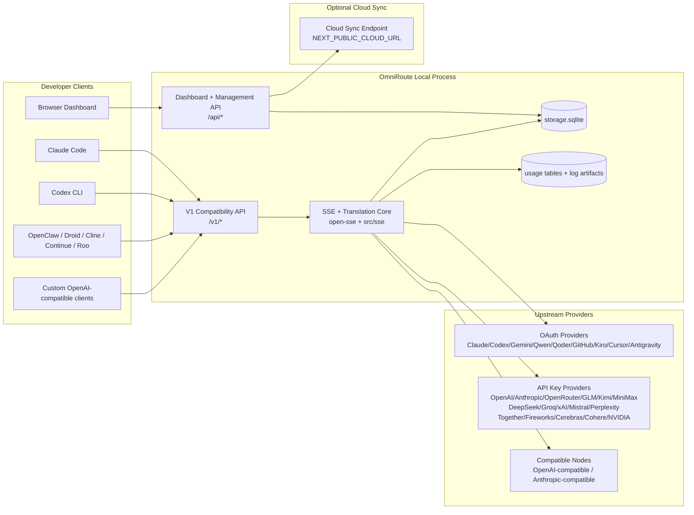
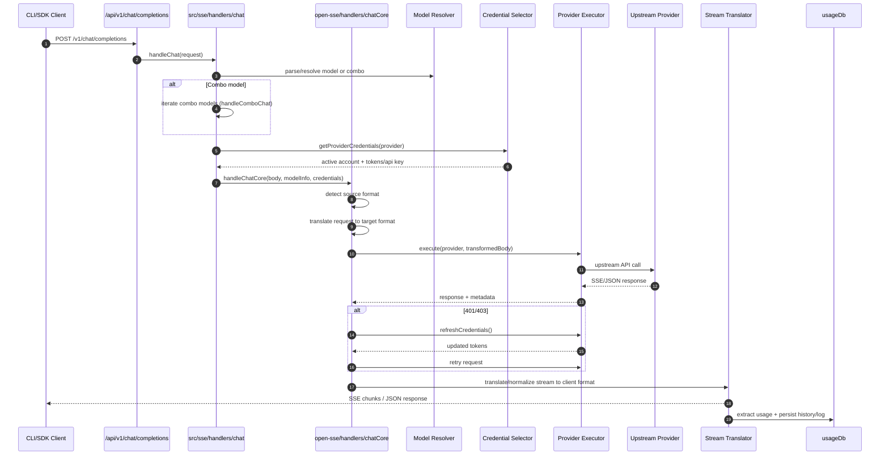
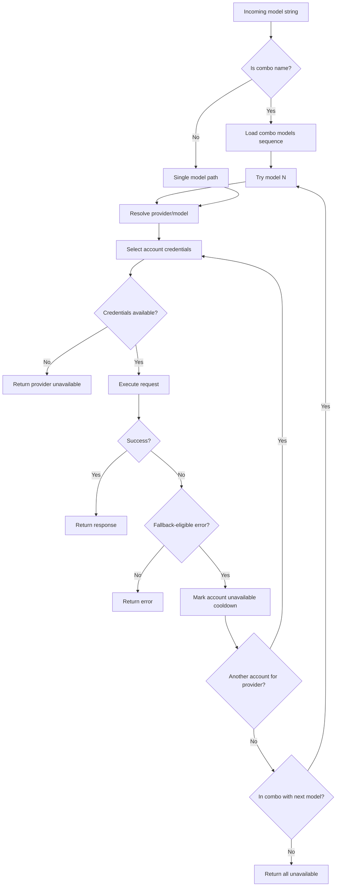
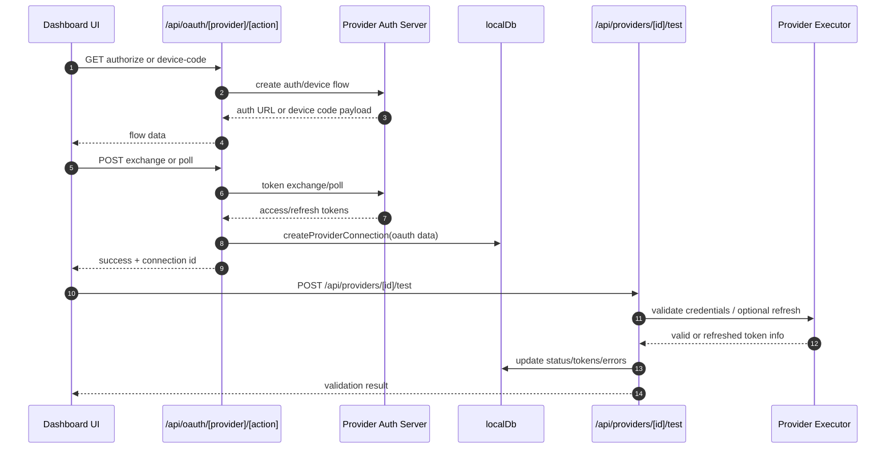
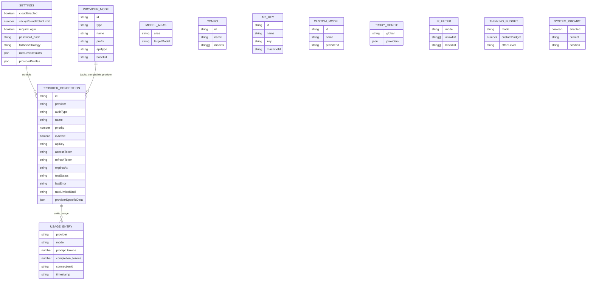
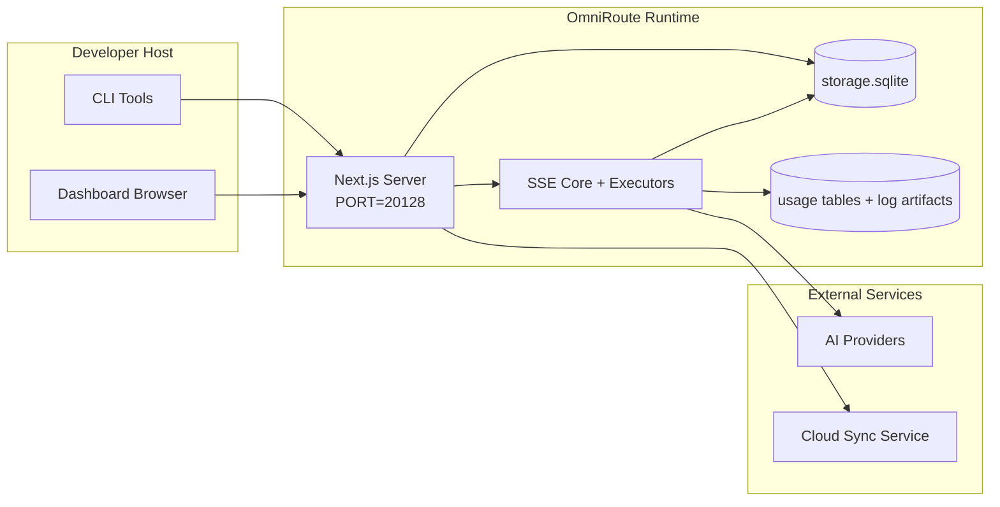

# OmniRoute Architecture (Deutsch)

🌐 **Languages:** 🇺🇸 [English](../../../../docs/ARCHITECTURE.md) · 🇪🇸 [es](../../es/docs/ARCHITECTURE.md) · 🇫🇷 [fr](../../fr/docs/ARCHITECTURE.md) · 🇩🇪 [de](../../de/docs/ARCHITECTURE.md) · 🇮🇹 [it](../../it/docs/ARCHITECTURE.md) · 🇷🇺 [ru](../../ru/docs/ARCHITECTURE.md) · 🇨🇳 [zh-CN](../../zh-CN/docs/ARCHITECTURE.md) · 🇯🇵 [ja](../../ja/docs/ARCHITECTURE.md) · 🇰🇷 [ko](../../ko/docs/ARCHITECTURE.md) · 🇸🇦 [ar](../../ar/docs/ARCHITECTURE.md) · 🇮🇳 [hi](../../hi/docs/ARCHITECTURE.md) · 🇮🇳 [in](../../in/docs/ARCHITECTURE.md) · 🇹🇭 [th](../../th/docs/ARCHITECTURE.md) · 🇻🇳 [vi](../../vi/docs/ARCHITECTURE.md) · 🇮🇩 [id](../../id/docs/ARCHITECTURE.md) · 🇲🇾 [ms](../../ms/docs/ARCHITECTURE.md) · 🇳🇱 [nl](../../nl/docs/ARCHITECTURE.md) · 🇵🇱 [pl](../../pl/docs/ARCHITECTURE.md) · 🇸🇪 [sv](../../sv/docs/ARCHITECTURE.md) · 🇳🇴 [no](../../no/docs/ARCHITECTURE.md) · 🇩🇰 [da](../../da/docs/ARCHITECTURE.md) · 🇫🇮 [fi](../../fi/docs/ARCHITECTURE.md) · 🇵🇹 [pt](../../pt/docs/ARCHITECTURE.md) · 🇷🇴 [ro](../../ro/docs/ARCHITECTURE.md) · 🇭🇺 [hu](../../hu/docs/ARCHITECTURE.md) · 🇧🇬 [bg](../../bg/docs/ARCHITECTURE.md) · 🇸🇰 [sk](../../sk/docs/ARCHITECTURE.md) · 🇺🇦 [uk-UA](../../uk-UA/docs/ARCHITECTURE.md) · 🇮🇱 [he](../../he/docs/ARCHITECTURE.md) · 🇵🇭 [phi](../../phi/docs/ARCHITECTURE.md) · 🇧🇷 [pt-BR](../../pt-BR/docs/ARCHITECTURE.md) · 🇨🇿 [cs](../../cs/docs/ARCHITECTURE.md) · 🇹🇷 [tr](../../tr/docs/ARCHITECTURE.md)

---

_Letzte Aktualisierung: 28.03.2026_## Executive Summary

OmniRoute ist ein lokales KI-Routing-Gateway und Dashboard, das auf Next.js basiert.
Es bietet einen einzigen OpenAI-kompatiblen Endpunkt („/v1/\*“) und leitet den Datenverkehr über mehrere Upstream-Anbieter mit Übersetzung, Fallback, Token-Aktualisierung und Nutzungsverfolgung weiter.

Kernkompetenzen:

- OpenAI-kompatible API-Oberfläche für CLI/Tools (28 Anbieter)
- Anforderungs-/Antwortübersetzung über Anbieterformate hinweg
- Modell-Combo-Fallback (Multi-Modell-Sequenz)
- Fallback auf Kontoebene (mehrere Konten pro Anbieter)
- OAuth + API-Schlüssel-Provider-Verbindungsverwaltung
- Einbettungsgenerierung über „/v1/embeddings“ (6 Anbieter, 9 Modelle)
- Bildgenerierung über „/v1/images/generations“ (4 Anbieter, 9 Modelle)
- Think-Tag-Parsing (`<think>...</think>`) für Argumentationsmodelle
- Antwortbereinigung für strikte OpenAI SDK-Kompatibilität
- Rollennormalisierung (Entwickler→System, System→Benutzer) für anbieterübergreifende Kompatibilität
- Strukturierte Ausgabekonvertierung (json_schema → Gemini ResponseSchema)
- Lokale Persistenz für Anbieter, Schlüssel, Aliase, Kombinationen, Einstellungen, Preise
- Nutzungs-/Kostenverfolgung und Anforderungsprotokollierung
- Optionale Cloud-Synchronisierung für die Synchronisierung mehrerer Geräte/Status
- IP-Zulassungs-/Blockierungsliste für die API-Zugriffskontrolle
- Denken Sie an die Budgetverwaltung (Passthrough/Auto/Benutzerdefiniert/Adaptiv)
- Sofortige Injektion des globalen Systems
- Sitzungsverfolgung und Fingerabdruck
- Erweiterte Ratenbegrenzung pro Konto mit anbieterspezifischen Profilen
- Leistungsschaltermuster für die Ausfallsicherheit des Anbieters
- Donnernder Herdenschutz mit Mutex-Sperre
  – Signaturbasierter Anforderungsdeduplizierungs-Cache
- Domänenschicht: Modellverfügbarkeit, Kostenregeln, Fallback-Richtlinie, Sperrrichtlinie
- Persistenz des Domänenstatus (SQLite-Durchschreibcache für Fallbacks, Budgets, Sperrungen, Leistungsschalter)
- Richtlinien-Engine für zentralisierte Anfrageauswertung (Sperrung → Budget → Fallback)
- Fordern Sie Telemetrie mit p50/p95/p99-Latenzaggregation an
- Korrelations-ID (X-Request-Id) für eine durchgängige Nachverfolgung
- Compliance-Audit-Protokollierung mit Opt-out pro API-Schlüssel
- Evaluierungsrahmen für die LLM-Qualitätssicherung
- Resilience-UI-Dashboard mit Echtzeit-Leistungsschalterstatus
- Modulare OAuth-Anbieter (12 einzelne Module unter „src/lib/oauth/providers/“)

Primäres Laufzeitmodell:

– Next.js-App-Routen unter „src/app/api/_“ implementieren sowohl Dashboard-APIs als auch Kompatibilitäts-APIs
– Ein gemeinsam genutzter SSE/Routing-Kern in „src/sse/_“ + „open-sse/\*“ kümmert sich um die Ausführung, Übersetzung, Streaming, Fallback und Nutzung des Anbieters## Scope and Boundaries

### In Scope

- Lokale Gateway-Laufzeit
- Dashboard-Verwaltungs-APIs
- Anbieterauthentifizierung und Token-Aktualisierung
- Fordern Sie Übersetzung und SSE-Streaming an
- Lokaler Status + Nutzungspersistenz
- Optionale Orchestrierung der Cloud-Synchronisierung### Out of Scope

- Cloud-Service-Implementierung hinter „NEXT_PUBLIC_CLOUD_URL“.
- Anbieter-SLA/Kontrollebene außerhalb des lokalen Prozesses
- Externe CLI-Binärdateien selbst (Claude CLI, Codex CLI usw.)## Dashboard Surface (Current)

Hauptseiten unter „src/app/(dashboard)/dashboard/“:

- „/dashboard“ – Schnellstart + Anbieterübersicht
- „/dashboard/endpoint“ – Endpunkt-Proxy + MCP + A2A + API-Endpunkt-Registerkarten
- „/dashboard/providers“ – Anbieterverbindungen und Anmeldeinformationen
- „/dashboard/combos“ – Kombinationsstrategien, Vorlagen, Modell-Routing-Regeln
- „/dashboard/costs“ – Kostenaggregation und Preistransparenz
- „/dashboard/analytics“ – Nutzungsanalysen und Auswertungen
- „/dashboard/limits“ – Kontingent-/Ratenkontrolle
- „/dashboard/cli-tools“ – CLI-Onboarding, Laufzeiterkennung, Konfigurationsgenerierung
- „/dashboard/agents“ – erkannte ACP-Agenten + benutzerdefinierte Agentenregistrierung
- „/dashboard/media“ – Bild-/Video-/Musikspielplatz
- „/dashboard/search-tools“ – Tests und Verlauf des Suchanbieters
- „/dashboard/health“ – Betriebszeit, Leistungsschalter, Ratenbegrenzungen
- „/dashboard/logs“ – Anforderungs-/Proxy-/Audit-/Konsolenprotokolle
- „/dashboard/settings“ – Registerkarten für Systemeinstellungen (Allgemein, Routing, Combo-Standardeinstellungen usw.)
- „/dashboard/api-manager“ – API-Schlüssellebenszyklus und Modellberechtigungen## High-Level System Context



## Core Runtime Components

## 1) API and Routing Layer (Next.js App Routes)

Hauptverzeichnisse:

- „src/app/api/v1/_“ und „src/app/api/v1beta/_“ für Kompatibilitäts-APIs
- „src/app/api/\*“ für Verwaltungs-/Konfigurations-APIs
- Next schreibt in „next.config.mjs“ die Zuordnung von „/v1/_“ zu „/api/v1/_“ um

Wichtige Kompatibilitätsrouten:

- `src/app/api/v1/chat/completions/route.ts`
- `src/app/api/v1/messages/route.ts`
- `src/app/api/v1/responses/route.ts`
- „src/app/api/v1/models/route.ts“ – enthält benutzerdefinierte Modelle mit „custom: true“.
- „src/app/api/v1/embeddings/route.ts“ – Einbettungsgenerierung (6 Anbieter)
- `src/app/api/v1/images/generations/route.ts` — Bildgenerierung (4+ Anbieter inkl. Antigravity/Nebius)
- `src/app/api/v1/messages/count_tokens/route.ts`
- „src/app/api/v1/providers/[provider]/chat/completions/route.ts“ – dedizierter Chat pro Anbieter
- „src/app/api/v1/providers/[provider]/embeddings/route.ts“ – dedizierte Einbettungen pro Anbieter
- „src/app/api/v1/providers/[provider]/images/generations/route.ts“ – dedizierte Bilder pro Anbieter
- `src/app/api/v1beta/models/route.ts`
- `src/app/api/v1beta/models/[...pfad]/route.ts`

Verwaltungsdomänen:

- Authentifizierung/Einstellungen: `src/app/api/auth/*`, `src/app/api/settings/*`
- Anbieter/Verbindungen: `src/app/api/providers*`
- Anbieterknoten: `src/app/api/provider-nodes*`
- Benutzerdefinierte Modelle: `src/app/api/provider-models` (GET/POST/DELETE)
- Modellkatalog: `src/app/api/models/route.ts` (GET)
- Proxy-Konfiguration: `src/app/api/settings/proxy` (GET/PUT/DELETE) + `src/app/api/settings/proxy/test` (POST)
- OAuth: `src/app/api/oauth/*`
- Schlüssel/Aliase/Combos/Preise: „src/app/api/keys*“, „src/app/api/models/alias“, „src/app/api/combos*“, „src/app/api/pricing“.
- Verwendung: `src/app/api/usage/*`
- Synchronisierung/Cloud: `src/app/api/sync/*`, `src/app/api/cloud/*`
- CLI-Tool-Helfer: `src/app/api/cli-tools/*`
- IP-Filter: `src/app/api/settings/ip-filter` (GET/PUT)
- Thinking-Budget: `src/app/api/settings/thinking-budget` (GET/PUT)
- Systemeingabeaufforderung: `src/app/api/settings/system-prompt` (GET/PUT)
- Sitzungen: `src/app/api/sessions` (GET)
- Ratenlimits: `src/app/api/rate-limits` (GET)
  – Resilienz: „src/app/api/resilience“ (GET/PATCH) – Anbieterprofile, Leistungsschalter, Ratengrenzstatus
- Resilience-Reset: `src/app/api/resilience/reset` (POST) – Breaker + Abklingzeiten zurücksetzen
- Cache-Statistiken: `src/app/api/cache/stats` (GET/DELETE)
- Modellverfügbarkeit: `src/app/api/models/availability` (GET/POST)
- Telemetrie: `src/app/api/telemetry/summary` (GET)
- Budget: `src/app/api/usage/budget` (GET/POST)
- Fallback-Ketten: `src/app/api/fallback/chains` (GET/POST/DELETE)
- Compliance-Audit: `src/app/api/compliance/audit-log` (GET)
- Auswertungen: `src/app/api/evals` (GET/POST), `src/app/api/evals/[suiteId]` (GET)
- Richtlinien: `src/app/api/policies` (GET/POST)## 2) SSE + Translation Core

Hauptflussmodule:

- Eintrag: `src/sse/handlers/chat.ts`
- Kernorchestrierung: „open-sse/handlers/chatCore.ts“.
- Anbieterausführungsadapter: „open-sse/executors/\*“.
- Formaterkennung/Anbieterkonfiguration: „open-sse/services/provider.ts“.
- Modellanalyse/-auflösung: `src/sse/services/model.ts`, `open-sse/services/model.ts`
- Konto-Fallback-Logik: „open-sse/services/accountFallback.ts“.
- Übersetzungsregister: „open-sse/translator/index.ts“.
- Stream-Transformationen: „open-sse/utils/stream.ts“, „open-sse/utils/streamHandler.ts“.
- Nutzungsextraktion/-normalisierung: `open-sse/utils/usageTracking.ts`
- Think-Tag-Parser: „open-sse/utils/thinkTagParser.ts“.
- Einbettungshandler: `open-sse/handlers/embeddings.ts`
- Einbettungsanbieter-Registrierung: „open-sse/config/embeddingRegistry.ts“.
- Handler für die Bildgenerierung: „open-sse/handlers/imageGeneration.ts“.
- Registrierung des Bildanbieters: „open-sse/config/imageRegistry.ts“.
- Antwortbereinigung: `open-sse/handlers/responseSanitizer.ts`
- Rollennormalisierung: `open-sse/services/roleNormalizer.ts`

Dienste (Geschäftslogik):

- Kontoauswahl/-bewertung: `open-sse/services/accountSelector.ts`
- Kontextlebenszyklusverwaltung: „open-sse/services/contextManager.ts“.
- Durchsetzung des IP-Filters: „open-sse/services/ipFilter.ts“.
- Sitzungsverfolgung: `open-sse/services/sessionManager.ts`
- Deduplizierung anfordern: „open-sse/services/signatureCache.ts“.
- System-Prompt-Injection: „open-sse/services/systemPrompt.ts“.
- Thinking Budget Management: „open-sse/services/thinkingBudget.ts“.
- Wildcard-Modell-Routing: „open-sse/services/wildcardRouter.ts“.
- Ratenlimitverwaltung: `open-sse/services/rateLimitManager.ts`
- Leistungsschalter: `open-sse/services/CircuitBreaker.ts`

Module der Domänenschicht:

- Modellverfügbarkeit: `src/lib/domain/modelAvailability.ts`
- Kostenregeln/Budgets: `src/lib/domain/costRules.ts`
- Fallback-Richtlinie: `src/lib/domain/fallbackPolicy.ts`
- Combo-Resolver: `src/lib/domain/comboResolver.ts`
- Sperrrichtlinie: `src/lib/domain/lockoutPolicy.ts`
  – Richtlinien-Engine: „src/domain/policyEngine.ts“ – zentralisierte Sperrung → Budget → Fallback-Auswertung
- Fehlercodekatalog: `src/lib/domain/errorCodes.ts`
- Anforderungs-ID: `src/lib/domain/requestId.ts`
- Abrufzeitüberschreitung: `src/lib/domain/fetchTimeout.ts`
- Telemetrie anfordern: `src/lib/domain/requestTelemetry.ts`
- Compliance/Audit: `src/lib/domain/compliance/index.ts`
- Eval-Runner: `src/lib/domain/evalRunner.ts`
  – Domänenstatus-Persistenz: „src/lib/db/domainState.ts“ – SQLite CRUD für Fallback-Ketten, Budgets, Kostenverlauf, Sperrstatus, Leistungsschalter

OAuth-Provider-Module (12 einzelne Dateien unter „src/lib/oauth/providers/“):

- Registrierungsindex: `src/lib/oauth/providers/index.ts`
- Einzelne Anbieter: `claude.ts`, `codex.ts`, `gemini.ts`, `antigravity.ts`, `qoder.ts`, `qwen.ts`, `kimi-coding.ts`, `github.ts`, `kiro.ts`, `cursor.ts`, `kilocode.ts`, `cline.ts`
  – Thin Wrapper: „src/lib/oauth/providers.ts“ – erneuter Export aus einzelnen Modulen## 3) Persistence Layer

Primärstatus-DB (SQLite):

- Kerninfra: `src/lib/db/core.ts` (better-sqlite3, Migrationen, WAL)
- Fassade erneut exportieren: `src/lib/localDb.ts` (dünne Kompatibilitätsschicht für Aufrufer)
- Datei: „${DATA_DIR}/storage.sqlite“ (oder „$XDG_CONFIG_HOME/omniroute/storage.sqlite“, wenn festgelegt, sonst „~/.omniroute/storage.sqlite“)
- Entitäten (Tabellen + KV-Namespaces): ProviderConnections, ProviderNodes, ModelAliases, Combos, APIKeys, Einstellungen, Preise,**customModels**,**proxyConfig**,**ipFilter**,**thinkingBudget**,**systemPrompt**

Nutzungsdauer:

- Fassade: `src/lib/usageDb.ts` (zerlegte Module in `src/lib/usage/*`)
- SQLite-Tabellen in „storage.sqlite“: „usage_history“, „call_logs“, „proxy_logs“.
- Optionale Dateiartefakte bleiben aus Kompatibilitäts-/Debuggründen erhalten (`${DATA_DIR}/log.txt`, `${DATA_DIR}/call_logs/`, `<repo>/logs/...`)
  – Ältere JSON-Dateien werden durch Startmigrationen nach SQLite migriert, sofern vorhanden

Domain State DB (SQLite):

– „src/lib/db/domainState.ts“ – CRUD-Operationen für den Domänenstatus

- Tabellen (erstellt in `src/lib/db/core.ts`): `domain_fallback_chains`, `domain_budgets`, `domain_cost_history`, `domain_lockout_state`, `domain_Circuit_breakers`
- Write-Through-Cache-Muster: In-Memory-Maps sind zur Laufzeit maßgeblich; Mutationen werden synchron zu SQLite geschrieben; Der Status wird beim Kaltstart aus der DB wiederhergestellt## 4) Auth + Security Surfaces

- Dashboard-Cookie-Authentifizierung: „src/proxy.ts“, „src/app/api/auth/login/route.ts“.
- API-Schlüsselgenerierung/-überprüfung: `src/shared/utils/apiKey.ts`
  – Provider-Geheimnisse blieben in „providerConnections“-Einträgen bestehen
- Unterstützung für ausgehende Proxys über „open-sse/utils/proxyFetch.ts“ (env vars) und „open-sse/utils/networkProxy.ts“ (pro Anbieter oder global konfigurierbar)## 5) Cloud Sync

- Scheduler-Init: „src/lib/initCloudSync.ts“, „src/shared/services/initializeCloudSync.ts“, „src/shared/services/modelSyncScheduler.ts“.
- Periodische Aufgabe: `src/shared/services/cloudSyncScheduler.ts`
- Periodische Aufgabe: `src/shared/services/modelSyncScheduler.ts`
- Kontrollroute: `src/app/api/sync/cloud/route.ts`## Request Lifecycle (`/v1/chat/completions`)



## Combo + Account Fallback Flow



Fallback-Entscheidungen werden von „open-sse/services/accountFallback.ts“ unter Verwendung von Statuscodes und Fehlermeldungsheuristiken gesteuert. Combo-Routing fügt einen zusätzlichen Schutz hinzu: 400-Fehler im Anbieterbereich wie Upstream-Inhaltsblockierungs- und Rollenvalidierungsfehler werden als modelllokale Fehler behandelt, sodass spätere Combo-Ziele weiterhin ausgeführt werden können.## OAuth Onboarding and Token Refresh Lifecycle



Die Aktualisierung während des Live-Verkehrs wird in „open-sse/handlers/chatCore.ts“ über den Executor „refreshCredentials()“ ausgeführt.## Cloud Sync Lifecycle (Enable / Sync / Disable)

```mermaid
sequenceDiagram
    autonumber
    participant UI as Endpoint Page UI
    participant Sync as /api/sync/cloud
    participant DB as localDb
    participant Cloud as External Cloud Sync
    participant Claude as ~/.claude/settings.json

    UI->>Sync: POST action=enable
    Sync->>DB: set cloudEnabled=true
    Sync->>DB: ensure API key exists
    Sync->>Cloud: POST /sync/{machineId} (providers/aliases/combos/keys)
    Cloud-->>Sync: sync result
    Sync->>Cloud: GET /{machineId}/v1/verify
    Sync-->>UI: enabled + verification status

    UI->>Sync: POST action=sync
    Sync->>Cloud: POST /sync/{machineId}
    Cloud-->>Sync: remote data
    Sync->>DB: update newer local tokens/status
    Sync-->>UI: synced

    UI->>Sync: POST action=disable
    Sync->>DB: set cloudEnabled=false
    Sync->>Cloud: DELETE /sync/{machineId}
    Sync->>Claude: switch ANTHROPIC_BASE_URL back to local (if needed)
    Sync-->>UI: disabled
```



Die regelmäßige Synchronisierung wird durch „CloudSyncScheduler“ ausgelöst, wenn die Cloud aktiviert ist.## Data Model and Storage Map



Physische Speicherdateien:

- Primäre Laufzeit-DB: „${DATA_DIR}/storage.sqlite“.
- Protokollzeilen anfordern: „${DATA_DIR}/log.txt“ (Kompatibilitäts-/Debug-Artefakt)
- Strukturierte Anrufnutzlastarchive: „${DATA_DIR}/call_logs/“.
- optionale Übersetzer-/Request-Debug-Sitzungen: `<repo>/logs/...`## Deployment Topology



## Module Mapping (Decision-Critical)

### Route and API Modules

- `src/app/api/v1/*`, `src/app/api/v1beta/*`: Kompatibilitäts-APIs
- `src/app/api/v1/providers/[provider]/*`: dedizierte Routen pro Anbieter (Chat, Einbettungen, Bilder)
- „src/app/api/providers\*“: Anbieter-CRUD, Validierung, Tests
- „src/app/api/provider-nodes\*“: benutzerdefinierte kompatible Knotenverwaltung
- „src/app/api/provider-models“: benutzerdefinierte Modellverwaltung (CRUD)
- `src/app/api/models/route.ts`: Modellkatalog-API (Aliase + benutzerdefinierte Modelle)
- `src/app/api/oauth/*`: OAuth/Gerätecodeflüsse
- „src/app/api/keys\*“: Lebenszyklus des lokalen API-Schlüssels
- `src/app/api/models/alias`: Alias-Verwaltung
- `src/app/api/combos*`: Fallback-Combo-Verwaltung
- „src/app/api/pricing“: Preisüberschreibungen für die Kostenberechnung
- `src/app/api/settings/proxy`: Proxy-Konfiguration (GET/PUT/DELETE)
- „src/app/api/settings/proxy/test“: Test der ausgehenden Proxy-Konnektivität (POST)
- `src/app/api/usage/*`: Nutzungs- und Protokoll-APIs
- `src/app/api/sync/*` + `src/app/api/cloud/*`: Cloud-Synchronisierung und Cloud-orientierte Helfer
- `src/app/api/cli-tools/*`: lokale CLI-Konfigurationsschreiber/-prüfer
- `src/app/api/settings/ip-filter`: IP-Zulassungsliste/Blockliste (GET/PUT)
- `src/app/api/settings/thinking-budget`: Thinking-Token-Budgetkonfiguration (GET/PUT)
- `src/app/api/settings/system-prompt`: globale Systemeingabeaufforderung (GET/PUT)
- `src/app/api/sessions`: Auflistung der aktiven Sitzungen (GET)
- `src/app/api/rate-limits`: Status des Ratenlimits pro Konto (GET)### Routing and Execution Core

- „src/sse/handlers/chat.ts“: Anforderungsanalyse, Kombinationsverarbeitung, Kontoauswahlschleife
- „open-sse/handlers/chatCore.ts“: Übersetzung, Executor-Dispatch, Wiederholungs-/Aktualisierungsbehandlung, Stream-Setup
- „open-sse/executors/\*“: anbieterspezifisches Netzwerk- und Formatverhalten### Translation Registry and Format Converters

- „open-sse/translator/index.ts“: Übersetzerregistrierung und Orchestrierung
- Übersetzer anfordern: `open-sse/translator/request/*`
- Antwortübersetzer: `open-sse/translator/response/*`
- Formatkonstanten: „open-sse/translator/formats.ts“.### Persistence

- `src/lib/db/*`: persistente Konfiguration/Status und Domänenpersistenz auf SQLite
- `src/lib/localDb.ts`: Kompatibilitäts-Neuexport für DB-Module
- „src/lib/usageDb.ts“: Fassade der Nutzungshistorie/Anrufprotokolle über SQLite-Tabellen## Provider Executor Coverage (Strategy Pattern)

Jeder Anbieter verfügt über einen speziellen Executor, der „BaseExecutor“ (in „open-sse/executors/base.ts“) erweitert und URL-Erstellung, Header-Konstruktion, Wiederholung mit exponentiellem Backoff, Hooks für die Aktualisierung von Anmeldeinformationen und die Orchestrierungsmethode „execute()“ bereitstellt.

| Testamentsvollstrecker | Anbieter(n)                                                                                                                                                  | Besondere Handhabung                                                          |
| ---------------------- | ------------------------------------------------------------------------------------------------------------------------------------------------------------ | ----------------------------------------------------------------------------- |
| `DefaultExecutor`      | OpenAI, Claude, Gemini, Qwen, Qoder, OpenRouter, GLM, Kimi, MiniMax, DeepSeek, Groq, xAI, Mistral, Perplexity, Together, Fireworks, Cerebras, Cohere, NVIDIA | Dynamische URL-/Header-Konfiguration pro Anbieter                             |
| `AntigravityExecutor`  | Google Antigravitation                                                                                                                                       | Benutzerdefinierte Projekt-/Sitzungs-IDs, Wiederholen nach dem Parsen         |
| `CodexExecutor`        | OpenAI-Codex                                                                                                                                                 | Fügt Systemanweisungen ein und erzwingt den Denkaufwand                       |
| `CursorExecutor`       | Cursor-IDE                                                                                                                                                   | ConnectRPC-Protokoll, Protobuf-Kodierung, Anforderungssignatur über Prüfsumme |
| `GithubExecutor`       | GitHub-Copilot                                                                                                                                               | Copilot-Token-Aktualisierung, VSCode-imitierende Header                       |
| `KiroExecutor`         | AWS CodeWhisperer/Kiro                                                                                                                                       | AWS EventStream-Binärformat → SSE-Konvertierung                               |
| `GeminiCLIExecutor`    | Gemini CLI                                                                                                                                                   | Aktualisierungszyklus des Google OAuth-Tokens                                 |

Alle anderen Anbieter (einschließlich benutzerdefinierter kompatibler Knoten) verwenden den „DefaultExecutor“.## Provider Compatibility Matrix

| Anbieter         | Formatieren      | Authentifizierung            | Stream           | Nicht-Stream | Token-Aktualisierung | Nutzungs-API                   |
| ---------------- | ---------------- | ---------------------------- | ---------------- | ------------ | -------------------- | ------------------------------ | ------------------------------ |
| Claude           | Claude           | API-Schlüssel / OAuth        | ✅               | ✅           | ✅                   | ⚠️ Nur Administrator           |
| Zwillinge        | Zwillinge        | API-Schlüssel / OAuth        | ✅               | ✅           | ✅                   | ⚠️ Cloud-Konsole               |
| Gemini CLI       | gemini-cli       | OAuth                        | ✅               | ✅           | ✅                   | ⚠️ Cloud-Konsole               |
| Antigravitation  | Antigravitation  | OAuth                        | ✅               | ✅           | ✅                   | ✅ Vollständige Kontingent-API |
| OpenAI           | openai           | API-Schlüssel                | ✅               | ✅           | ❌                   | ❌                             |
| Kodex            | Openai-Antworten | OAuth                        | ✅ gezwungen     | ❌           | ✅                   | ✅ Tariflimits                 |
| GitHub-Copilot   | openai           | OAuth + Copilot-Token        | ✅               | ✅           | ✅                   | ✅ Kontingent-Snapshots        |
| Cursor           | Cursor           | Benutzerdefinierte Prüfsumme | ✅               | ✅           | ❌                   | ❌                             |
| Kiro             | kiro             | AWS SSO OIDC                 | ✅ (EventStream) | ❌           | ✅                   | ✅ Nutzungsbeschränkungen      |
| Qwen             | openai           | OAuth                        | ✅               | ✅           | ✅                   | ⚠️ Auf Anfrage                 |
| Qoder            | openai           | OAuth (Basic)                | ✅               | ✅           | ✅                   | ⚠️ Auf Anfrage                 |
| OpenRouter       | openai           | API-Schlüssel                | ✅               | ✅           | ❌                   | ❌                             |
| GLM/Kimi/MiniMax | Claude           | API-Schlüssel                | ✅               | ✅           | ❌                   | ❌                             |
| DeepSeek         | openai           | API-Schlüssel                | ✅               | ✅           | ❌                   | ❌                             |
| Groq             | openai           | API-Schlüssel                | ✅               | ✅           | ❌                   | ❌                             |
| xAI (Grok)       | openai           | API-Schlüssel                | ✅               | ✅           | ❌                   | ❌                             |
| Mistral          | openai           | API-Schlüssel                | ✅               | ✅           | ❌                   | ❌                             |
| Ratlosigkeit     | openai           | API-Schlüssel                | ✅               | ✅           | ❌                   | ❌                             |
| Zusammen KI      | openai           | API-Schlüssel                | ✅               | ✅           | ❌                   | ❌                             |
| Feuerwerk KI     | openai           | API-Schlüssel                | ✅               | ✅           | ❌                   | ❌                             |
| Großhirn         | openai           | API-Schlüssel                | ✅               | ✅           | ❌                   | ❌                             |
| Kohärent         | openai           | API-Schlüssel                | ✅               | ✅           | ❌                   | ❌                             |
| NVIDIA NIM       | openai           | API-Schlüssel                | ✅               | ✅           | ❌                   | ❌                             | ## Format Translation Coverage |

Zu den erkannten Quellformaten gehören:

- `openai`
- „Openai-Antworten“.
- `Claude`
- „Zwillinge“.

Zu den Zielformaten gehören:

- OpenAI-Chat/Antworten
- Claude
- Gemini/Gemini-CLI/Antigravity-Umschlag
- Kiro
- Cursor

Übersetzungen verwenden**OpenAI als Hub-Format**– alle Konvertierungen durchlaufen OpenAI als Zwischenformat:```
Source Format → OpenAI (hub) → Target Format

````

Übersetzungen werden dynamisch basierend auf der Form der Quellnutzlast und dem Zielformat des Anbieters ausgewählt.

Zusätzliche Verarbeitungsebenen in der Übersetzungspipeline:

-**Antwortbereinigung**– Entfernt nicht standardmäßige Felder aus Antworten im OpenAI-Format (sowohl Streaming als auch Nicht-Streaming), um eine strikte SDK-Konformität sicherzustellen
-**Rollennormalisierung**– Konvertiert „Entwickler“ → „System“ für Nicht-OpenAI-Ziele; führt „System“ → „Benutzer“ für Modelle zusammen, die die Systemrolle ablehnen (GLM, ERNIE)
-**Think-Tag-Extraktion**– Analysiert „<think>...</think>“-Blöcke aus dem Inhalt in das Feld „reasoning_content“.
-**Strukturierte Ausgabe**– Konvertiert OpenAI „response_format.json_schema“ in „responseMimeType“ + „responseSchema“ von Gemini## Supported API Endpoints

| Endpunkt | Formatieren | Handler |
| ------------------------------------------------- | ------------------- | ------------------------------------------------------------------- |
| `POST /v1/chat/completions` | OpenAI-Chat | `src/sse/handlers/chat.ts` |
| `POST /v1/messages` | Claude-Nachrichten | Gleicher Handler (automatisch erkannt) |
| `POST /v1/responses` | OpenAI-Antworten | `open-sse/handlers/responsesHandler.ts` |
| `POST /v1/embeddings` | OpenAI-Einbettungen | `open-sse/handlers/embeddings.ts` |
| `GET /v1/embeddings` | Modellliste | API-Route |
| `POST /v1/images/generations` | OpenAI-Bilder | `open-sse/handlers/imageGeneration.ts` |
| `GET /v1/images/generations` | Modellliste | API-Route |
| `POST /v1/providers/{provider}/chat/completions` | OpenAI-Chat | Dedizierter pro Anbieter mit Modellvalidierung |
| `POST /v1/providers/{provider}/embeddings` | OpenAI-Einbettungen | Dedizierter pro Anbieter mit Modellvalidierung |
| `POST /v1/providers/{provider}/images/generations` | OpenAI-Bilder | Dedizierter pro Anbieter mit Modellvalidierung |
| `POST /v1/messages/count_tokens` | Claude Token Count | API-Route |
| `GET /v1/models` | Liste der OpenAI-Modelle | API-Route (Chat + Einbettung + Bild + benutzerdefinierte Modelle) |
| `GET /api/models/catalog` | Katalog | Alle Modelle gruppiert nach Anbieter + Typ |
| `POST /v1beta/models/*:streamGenerateContent` | Zwillinge heimisch | API-Route |
| `GET/PUT/DELETE /api/settings/proxy` | Proxy-Konfiguration | Netzwerk-Proxy-Konfiguration |
| `POST /api/settings/proxy/test` | Proxy-Konnektivität | Proxy-Zustands-/Konnektivitätstest-Endpunkt |
| `GET/POST/DELETE /api/provider-models` | Anbietermodelle | Metadaten des Anbietermodells, die benutzerdefinierte und verwaltete verfügbare Modelle unterstützen |## Bypass Handler

Der Bypass-Handler („open-sse/utils/bypassHandler.ts“) fängt bekannte „Wegwerf“-Anfragen von Claude CLI ab – Warmup-Pings, Titelextraktionen und Token-Zählungen – und gibt eine**falsche Antwort**zurück, ohne Upstream-Anbieter-Tokens zu verbrauchen. Dies wird nur ausgelöst, wenn „User-Agent“ „claude-cli“ enthält.## Request Logger Pipeline

Der Anforderungslogger („open-sse/utils/requestLogger.ts“) bietet eine 7-stufige Debug-Protokollierungspipeline, die standardmäßig deaktiviert und über „ENABLE_REQUEST_LOGS=true“ aktiviert ist:```
1_req_client.json → 2_req_source.json → 3_req_openai.json → 4_req_target.json
→ 5_res_provider.txt → 6_res_openai.txt → 7_res_client.txt
````

Dateien werden für jede Anforderungssitzung in „<repo>/logs/<session>/“ geschrieben.## Failure Modes and Resilience

## 1) Account/Provider Availability

- Abklingzeit des Anbieterkontos bei vorübergehenden/Raten-/Authentifizierungsfehlern
- Konto-Fallback vor fehlgeschlagener Anfrage
- Combo-Modell-Fallback, wenn der aktuelle Modell-/Anbieterpfad erschöpft ist## 2) Token Expiry

- Vorabprüfung und Aktualisierung mit erneutem Versuch für aktualisierbare Anbieter
  – 401/403-Wiederholungsversuch nach Aktualisierungsversuch im Kernpfad## 3) Stream Safety

- Trennungsfähiger Stream-Controller
- Übersetzungsstream mit Stream-Ende-Flush und „[FERTIG]“-Behandlung
- Fallback der Nutzungsschätzung, wenn Metadaten zur Anbieternutzung fehlen## 4) Cloud Sync Degradation

– Synchronisierungsfehler werden angezeigt, die lokale Laufzeit wird jedoch fortgesetzt
– Der Scheduler verfügt über eine wiederholfähige Logik, aber die regelmäßige Ausführung ruft derzeit standardmäßig eine Einzelversuchssynchronisierung auf## 5) Data Integrity

- SQLite-Schemamigrationen und automatische Upgrade-Hooks beim Start
- Legacy-JSON → SQLite-Migrationskompatibilitätspfad## Observability and Operational Signals

Quellen für die Laufzeitsichtbarkeit:

- Konsolenprotokolle von „src/sse/utils/logger.ts“.
- Nutzungsaggregate pro Anfrage in SQLite („usage_history“, „call_logs“, „proxy_logs“)
- Vierstufige detaillierte Nutzlasterfassungen in SQLite (`request_detail_logs`), wenn `settings.detailed_logs_enabled=true`
- Statusprotokoll der Textanfrage in „log.txt“ (optional/kompatibel)
- optionale tiefe Anforderungs-/Übersetzungsprotokolle unter „logs/“, wenn „ENABLE_REQUEST_LOGS=true“ ist
- Dashboard-Nutzungsendpunkte (`/api/usage/*`) für die UI-Nutzung

Die detaillierte Anforderungsnutzlasterfassung speichert bis zu vier JSON-Nutzlaststufen pro weitergeleitetem Anruf:

- Rohanfrage vom Client erhalten
- Die übersetzte Anfrage wurde tatsächlich an den Upstream gesendet
- Anbieterantwort als JSON rekonstruiert; Gestreamte Antworten werden zur endgültigen Zusammenfassung plus Stream-Metadaten komprimiert
  – endgültige Client-Antwort, die von OmniRoute zurückgegeben wird; Gestreamte Antworten werden in derselben kompakten Zusammenfassungsform gespeichert## Security-Sensitive Boundaries

- JWT-Geheimnis („JWT_SECRET“) sichert die Überprüfung/Signatur von Dashboard-Sitzungscookies
  – Der anfängliche Passwort-Bootstrap („INITIAL_PASSWORD“) sollte explizit für die erstmalige Bereitstellung konfiguriert werden
- Das HMAC-Geheimnis des API-Schlüssels („API_KEY_SECRET“) sichert das generierte lokale API-Schlüsselformat
  – Anbietergeheimnisse (API-Schlüssel/Tokens) werden in der lokalen Datenbank gespeichert und sollten auf Dateisystemebene geschützt werden
  – Cloud-Synchronisierungsendpunkte basieren auf der API-Schlüsselauthentifizierung und der Maschinen-ID-Semantik## Environment and Runtime Matrix

Vom Code aktiv verwendete Umgebungsvariablen:

- App/Auth: „JWT_SECRET“, „INITIAL_PASSWORD“.
- Speicher: `DATA_DIR`
- Kompatibles Knotenverhalten: „ALLOW_MULTI_CONNECTIONS_PER_COMPAT_NODE“.
- Optionale Speicherbasisüberschreibung (Linux/macOS, wenn „DATA_DIR“ nicht festgelegt ist): „XDG_CONFIG_HOME“.
- Sicherheits-Hashing: „API_KEY_SECRET“, „MACHINE_ID_SALT“.
- Protokollierung: „ENABLE_REQUEST_LOGS“.
- Synchronisierungs-/Cloud-URLing: „NEXT_PUBLIC_BASE_URL“, „NEXT_PUBLIC_CLOUD_URL“.
- Ausgehender Proxy: „HTTP_PROXY“, „HTTPS_PROXY“, „ALL_PROXY“, „NO_PROXY“ und Varianten in Kleinbuchstaben
- SOCKS5-Funktionsflags: „ENABLE_SOCKS5_PROXY“, „NEXT_PUBLIC_ENABLE_SOCKS5_PROXY“.
- Plattform-/Laufzeit-Helfer (keine App-spezifische Konfiguration): „APPDATA“, „NODE_ENV“, „PORT“, „HOSTNAME“.## Known Architectural Notes

1. „usageDb“ und „localDb“ verwenden dieselbe Basisverzeichnisrichtlinie („DATA_DIR“ -> „XDG_CONFIG_HOME/omniroute“ -> „~/.omniroute“) bei der Migration älterer Dateien.
2. „/api/v1/route.ts“ delegiert an denselben einheitlichen Katalog-Builder, der von „/api/v1/models“ verwendet wird (`src/app/api/v1/models/catalog.ts`), um semantische Abweichungen zu vermeiden.
3. Der Anforderungslogger schreibt bei Aktivierung vollständige Header/Textkörper. Behandeln Sie das Protokollverzeichnis als vertraulich.
4. Das Cloud-Verhalten hängt von der korrekten „NEXT_PUBLIC_BASE_URL“ und der Erreichbarkeit des Cloud-Endpunkts ab.
5. Das Verzeichnis „open-sse/“ wird als „@omniroute/open-sse“**npm-Workspace-Paket**veröffentlicht. Der Quellcode importiert es über „@omniroute/open-sse/...“ (aufgelöst durch Next.js „transpilePackages“). Dateipfade in diesem Dokument verwenden aus Konsistenzgründen weiterhin den Verzeichnisnamen „open-sse/“.
6. Diagramme im Dashboard verwenden**Recharts**(SVG-basiert) für zugängliche, interaktive Analysevisualisierungen (Modellnutzungs-Balkendiagramme, Anbieteraufschlüsselungstabellen mit Erfolgsquoten).
7. E2E-Tests verwenden**Playwright**(`tests/e2e/`) und werden über `npm run test:e2e` ausgeführt. Unit-Tests verwenden**Node.js Test Runner**(`tests/unit/`) und werden über `npm run test:unit` ausgeführt. Der Quellcode unter „src/“ ist**TypeScript**(`.ts`/`.tsx`); Der `open-sse/`-Arbeitsbereich bleibt JavaScript (`.js`).
8. Die Einstellungsseite ist in 5 Registerkarten unterteilt: Sicherheit, Routing (6 globale Strategien: Fill-First, Round-Robin, P2C, Random, Least-Used, Cost-Optimized), Resilience (bearbeitbare Ratenlimits, Leistungsschalter, Richtlinien), AI (Thinking Budget, System Prompt, Prompt Cache), Advanced (Proxy).## Operational Verification Checklist

- Aus der Quelle erstellen: „npm run build“.
- Docker-Image erstellen: `docker build -t omniroute .`
- Starten Sie den Dienst und überprüfen Sie:
- `GET /api/settings`
- `GET /api/v1/models`
  – Die Basis-URL des CLI-Ziels sollte „http://<host>:20128/v1“ lauten, wenn „PORT=20128“.
