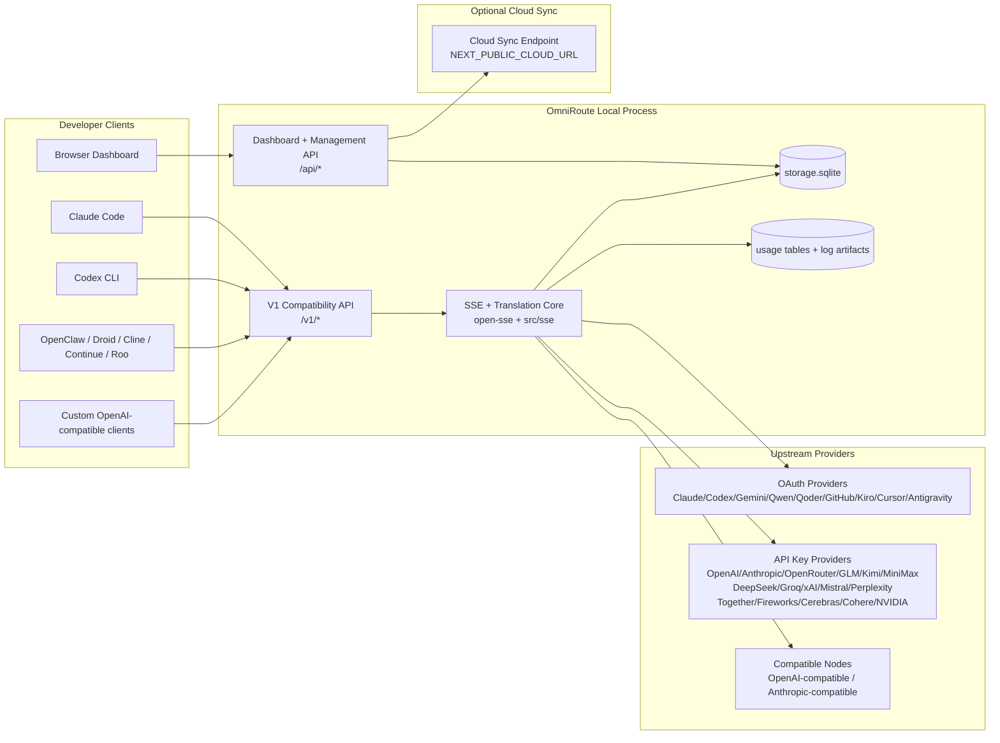
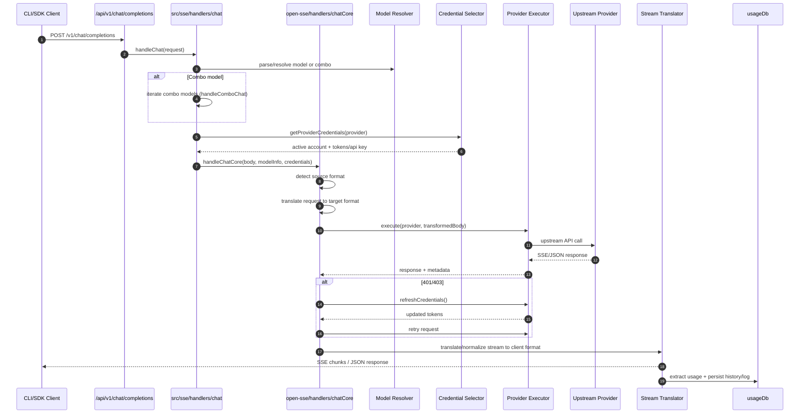
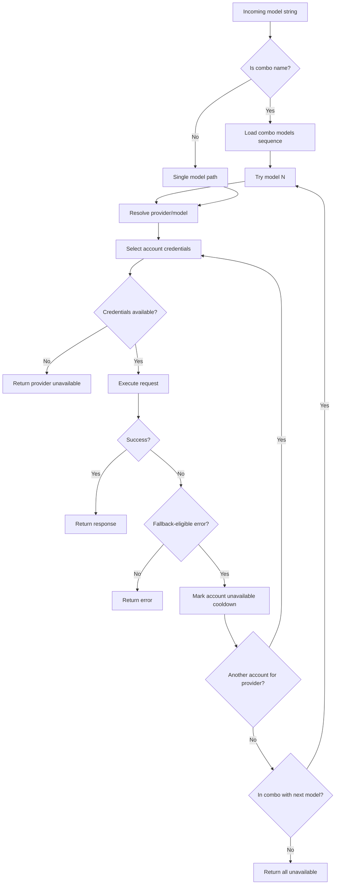
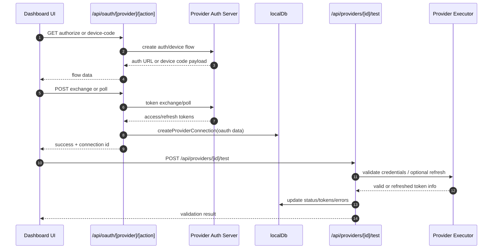
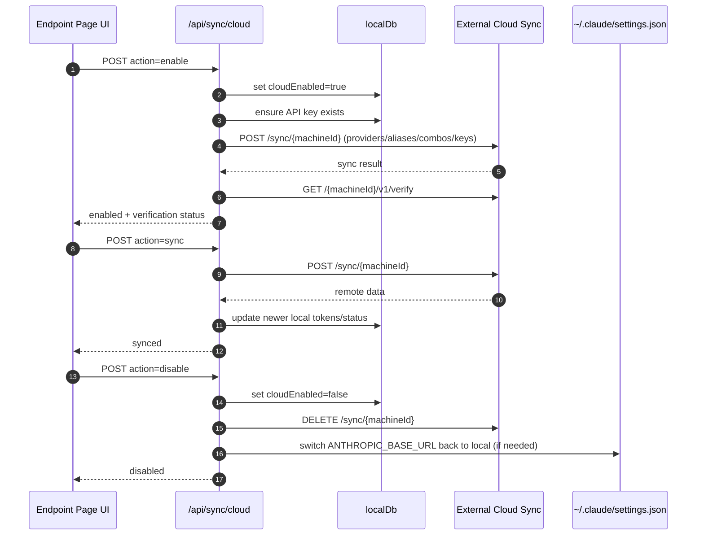
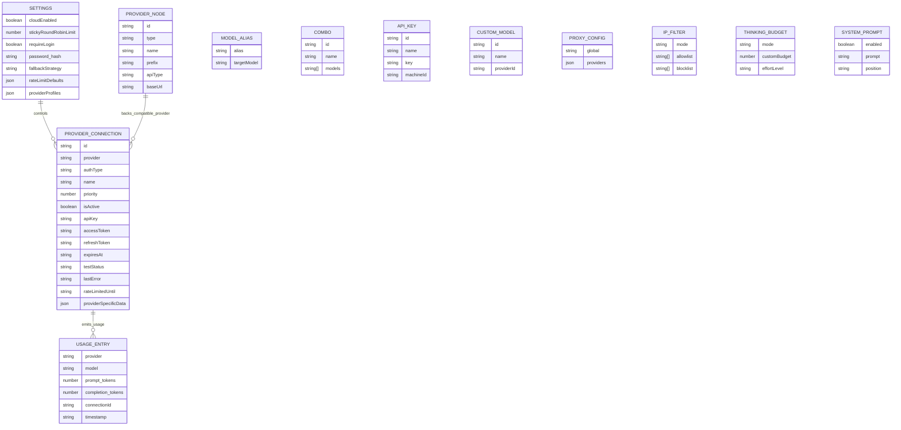
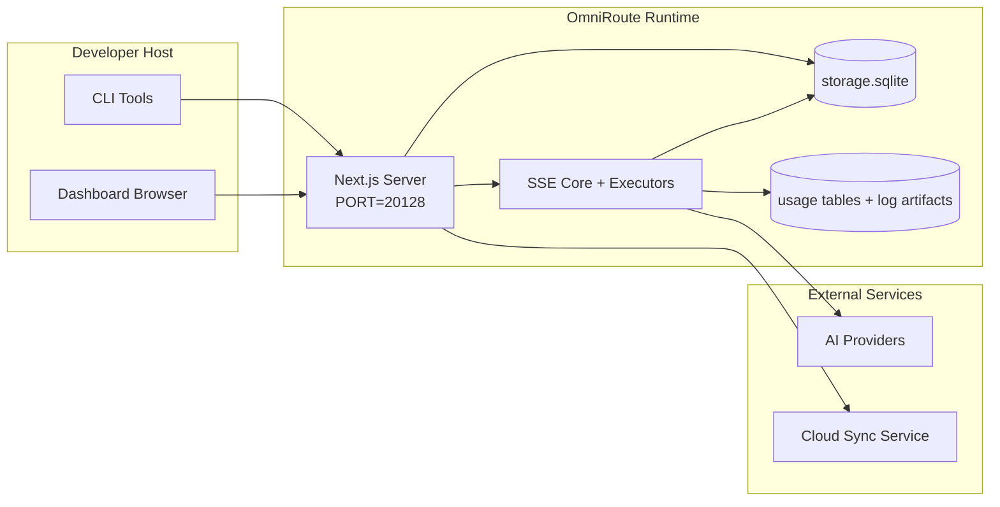

# OmniRoute Architecture (Español)

🌐 **Languages:** 🇺🇸 [English](../../../../docs/ARCHITECTURE.md) · 🇪🇸 [es](../../es/docs/ARCHITECTURE.md) · 🇫🇷 [fr](../../fr/docs/ARCHITECTURE.md) · 🇩🇪 [de](../../de/docs/ARCHITECTURE.md) · 🇮🇹 [it](../../it/docs/ARCHITECTURE.md) · 🇷🇺 [ru](../../ru/docs/ARCHITECTURE.md) · 🇨🇳 [zh-CN](../../zh-CN/docs/ARCHITECTURE.md) · 🇯🇵 [ja](../../ja/docs/ARCHITECTURE.md) · 🇰🇷 [ko](../../ko/docs/ARCHITECTURE.md) · 🇸🇦 [ar](../../ar/docs/ARCHITECTURE.md) · 🇮🇳 [hi](../../hi/docs/ARCHITECTURE.md) · 🇮🇳 [in](../../in/docs/ARCHITECTURE.md) · 🇹🇭 [th](../../th/docs/ARCHITECTURE.md) · 🇻🇳 [vi](../../vi/docs/ARCHITECTURE.md) · 🇮🇩 [id](../../id/docs/ARCHITECTURE.md) · 🇲🇾 [ms](../../ms/docs/ARCHITECTURE.md) · 🇳🇱 [nl](../../nl/docs/ARCHITECTURE.md) · 🇵🇱 [pl](../../pl/docs/ARCHITECTURE.md) · 🇸🇪 [sv](../../sv/docs/ARCHITECTURE.md) · 🇳🇴 [no](../../no/docs/ARCHITECTURE.md) · 🇩🇰 [da](../../da/docs/ARCHITECTURE.md) · 🇫🇮 [fi](../../fi/docs/ARCHITECTURE.md) · 🇵🇹 [pt](../../pt/docs/ARCHITECTURE.md) · 🇷🇴 [ro](../../ro/docs/ARCHITECTURE.md) · 🇭🇺 [hu](../../hu/docs/ARCHITECTURE.md) · 🇧🇬 [bg](../../bg/docs/ARCHITECTURE.md) · 🇸🇰 [sk](../../sk/docs/ARCHITECTURE.md) · 🇺🇦 [uk-UA](../../uk-UA/docs/ARCHITECTURE.md) · 🇮🇱 [he](../../he/docs/ARCHITECTURE.md) · 🇵🇭 [phi](../../phi/docs/ARCHITECTURE.md) · 🇧🇷 [pt-BR](../../pt-BR/docs/ARCHITECTURE.md) · 🇨🇿 [cs](../../cs/docs/ARCHITECTURE.md) · 🇹🇷 [tr](../../tr/docs/ARCHITECTURE.md)

---

_Última actualización: 2026-03-28_## Executive Summary

OmniRoute es un panel y una puerta de enlace de enrutamiento de IA local creado en Next.js.
Proporciona un único punto final compatible con OpenAI (`/v1/*`) y enruta el tráfico a través de múltiples proveedores ascendentes con traducción, respaldo, actualización de tokens y seguimiento de uso.

Capacidades principales:

- Superficie API compatible con OpenAI para CLI/herramientas (28 proveedores)
- Traducción de solicitudes/respuestas entre formatos de proveedores.
- Modelo combinado de respaldo (secuencia multimodelo)
- Respaldo a nivel de cuenta (varias cuentas por proveedor)
- Gestión de conexión de proveedor de claves OAuth + API
- Generación de incrustaciones mediante `/v1/embeddings` (6 proveedores, 9 modelos)
- Generación de imágenes a través de `/v1/images/generaciones` (4 proveedores, 9 modelos)
- Piense en el análisis de etiquetas (`<think>...</think>`) para modelos de razonamiento
- Saneamiento de respuesta para una estricta compatibilidad con OpenAI SDK
- Normalización de roles (desarrollador → sistema, sistema → usuario) para compatibilidad entre proveedores
- Conversión de salida estructurada (json_schema → Gemini ResponseSchema)
- Persistencia local para proveedores, claves, alias, combos, configuraciones, precios.
- Seguimiento de uso/costos y registro de solicitudes
- Sincronización en la nube opcional para sincronización multidispositivo/estado
- Lista de IP permitidas/lista de bloqueo para control de acceso a API
- Pensando en la gestión del presupuesto (transferencia/automática/personalizada/adaptativa)
- Inyección rápida del sistema global
- Seguimiento de sesiones y toma de huellas digitales
- Limitación de tarifas mejorada por cuenta con perfiles específicos del proveedor
- Patrón de disyuntor para la resiliencia del proveedor
- Protección de rebaño anti-truenos con bloqueo mutex
- Caché de deduplicación de solicitudes basado en firmas
- Capa de dominio: disponibilidad del modelo, reglas de costos, política de respaldo, política de bloqueo
- Persistencia del estado del dominio (caché de escritura SQLite para respaldos, presupuestos, bloqueos, disyuntores)
- Motor de políticas para la evaluación centralizada de solicitudes (bloqueo → presupuesto → respaldo)
- Solicitar telemetría con agregación de latencia p50/p95/p99
- ID de correlación (X-Request-Id) para seguimiento de un extremo a otro
- Registro de auditoría de cumplimiento con opción de exclusión por clave API
- Marco de evaluación para el aseguramiento de la calidad del LLM.
- Panel de interfaz de usuario de resiliencia con estado del disyuntor en tiempo real
- Proveedores modulares de OAuth (12 módulos individuales en `src/lib/oauth/providers/`)

Modelo de tiempo de ejecución principal:

- Las rutas de la aplicación Next.js en `src/app/api/*` implementan tanto las API del panel como las API de compatibilidad.
- Un núcleo de enrutamiento/SSE compartido en `src/sse/*` + `open-sse/*` maneja la ejecución, traducción, transmisión, respaldo y uso del proveedor.## Scope and Boundaries

### In Scope

- Tiempo de ejecución de la puerta de enlace local
- API de gestión de paneles
- Autenticación de proveedor y actualización de token
- Solicitar traducción y transmisión SSE
- Estado local + persistencia de uso.
- Orquestación de sincronización en la nube opcional### Out of Scope

- Implementación del servicio en la nube detrás de `NEXT_PUBLIC_CLOUD_URL`
- Proveedor SLA/plano de control fuera del proceso local
- Los propios binarios CLI externos (Claude CLI, Codex CLI, etc.)## Dashboard Surface (Current)

Páginas principales en `src/app/(dashboard)/dashboard/`:

- `/dashboard` — inicio rápido + descripción general del proveedor
- `/dashboard/endpoint` — proxy de punto final + MCP + A2A + pestañas de punto final API
- `/dashboard/providers` — conexiones y credenciales de proveedores
- `/dashboard/combos` — estrategias combinadas, plantillas, reglas de enrutamiento de modelos
- `/dashboard/costs` — agregación de costos y visibilidad de precios
- `/dashboard/analytics` — análisis y evaluaciones de uso
- `/dashboard/limits` — controles de cuota/tasa
- `/dashboard/cli-tools`: incorporación de CLI, detección de tiempo de ejecución, generación de configuración
- `/dashboard/agents` — agentes ACP detectados + registro de agente personalizado
- `/dashboard/media` — área de juegos de imágenes/videos/música
- `/dashboard/search-tools` — historial y pruebas del proveedor de búsqueda
- `/dashboard/health`: tiempo de actividad, disyuntores, límites de velocidad
- `/dashboard/logs` — registros de solicitud/proxy/auditoría/consola
- `/dashboard/settings`: pestañas de configuración del sistema (general, enrutamiento, valores predeterminados combinados, etc.)
- `/dashboard/api-manager` — Ciclo de vida de la clave API y permisos del modelo## High-Level System Context



## Core Runtime Components

## 1) API and Routing Layer (Next.js App Routes)

Main directories:

- `src/app/api/v1/*` and `src/app/api/v1beta/*` for compatibility APIs
- `src/app/api/*` for management/configuration APIs
- Next rewrites in `next.config.mjs` map `/v1/*` to `/api/v1/*`

Important compatibility routes:

- `src/app/api/v1/chat/completions/route.ts`
- `src/app/api/v1/messages/route.ts`
- `src/app/api/v1/responses/route.ts`
- `src/app/api/v1/models/route.ts` — includes custom models with `custom: true`
- `src/app/api/v1/embeddings/route.ts` — embedding generation (6 providers)
- `src/app/api/v1/images/generations/route.ts` — image generation (4+ providers incl. Antigravity/Nebius)
- `src/app/api/v1/messages/count_tokens/route.ts`
- `src/app/api/v1/providers/[provider]/chat/completions/route.ts` — dedicated per-provider chat
- `src/app/api/v1/providers/[provider]/embeddings/route.ts` — dedicated per-provider embeddings
- `src/app/api/v1/providers/[provider]/images/generations/route.ts` — dedicated per-provider images
- `src/app/api/v1beta/models/route.ts`
- `src/app/api/v1beta/models/[...path]/route.ts`

Management domains:

- Auth/settings: `src/app/api/auth/*`, `src/app/api/settings/*`
- Providers/connections: `src/app/api/providers*`
- Provider nodes: `src/app/api/provider-nodes*`
- Custom models: `src/app/api/provider-models` (GET/POST/DELETE)
- Model catalog: `src/app/api/models/route.ts` (GET)
- Proxy config: `src/app/api/settings/proxy` (GET/PUT/DELETE) + `src/app/api/settings/proxy/test` (POST)
- OAuth: `src/app/api/oauth/*`
- Keys/aliases/combos/pricing: `src/app/api/keys*`, `src/app/api/models/alias`, `src/app/api/combos*`, `src/app/api/pricing`
- Usage: `src/app/api/usage/*`
- Sync/cloud: `src/app/api/sync/*`, `src/app/api/cloud/*`
- CLI tooling helpers: `src/app/api/cli-tools/*`
- IP filter: `src/app/api/settings/ip-filter` (GET/PUT)
- Thinking budget: `src/app/api/settings/thinking-budget` (GET/PUT)
- System prompt: `src/app/api/settings/system-prompt` (GET/PUT)
- Sessions: `src/app/api/sessions` (GET)
- Rate limits: `src/app/api/rate-limits` (GET)
- Resilience: `src/app/api/resilience` (GET/PATCH) — provider profiles, circuit breaker, rate limit state
- Resilience reset: `src/app/api/resilience/reset` (POST) — reset breakers + cooldowns
- Cache stats: `src/app/api/cache/stats` (GET/DELETE)
- Model availability: `src/app/api/models/availability` (GET/POST)
- Telemetry: `src/app/api/telemetry/summary` (GET)
- Budget: `src/app/api/usage/budget` (GET/POST)
- Fallback chains: `src/app/api/fallback/chains` (GET/POST/DELETE)
- Compliance audit: `src/app/api/compliance/audit-log` (GET)
- Evals: `src/app/api/evals` (GET/POST), `src/app/api/evals/[suiteId]` (GET)
- Policies: `src/app/api/policies` (GET/POST)

## 2) SSE + Translation Core

Módulos de flujo principales:

- Entrada: `src/sse/handlers/chat.ts`
- Orquestación central: `open-sse/handlers/chatCore.ts`
- Adaptadores de ejecución del proveedor: `open-sse/executors/*`
- Detección de formato/configuración del proveedor: `open-sse/services/provider.ts`
- Análisis/resolución del modelo: `src/sse/services/model.ts`, `open-sse/services/model.ts`
- Lógica alternativa de cuenta: `open-sse/services/accountFallback.ts`
- Registro de traducción: `open-sse/translator/index.ts`
- Transformaciones de flujo: `open-sse/utils/stream.ts`, `open-sse/utils/streamHandler.ts`
- Extracción/normalización de uso: `open-sse/utils/usageTracking.ts`
- Analizador de etiquetas Think: `open-sse/utils/thinkTagParser.ts`
- Controlador de incrustación: `open-sse/handlers/embeddings.ts`
- Registro de proveedores de incrustación: `open-sse/config/embeddingRegistry.ts`
- Manejador de generación de imágenes: `open-sse/handlers/imageGeneration.ts`
- Registro del proveedor de imágenes: `open-sse/config/imageRegistry.ts`
- Sanitización de respuestas: `open-sse/handlers/responseSanitizer.ts`
- Normalización de roles: `open-sse/services/roleNormalizer.ts`

Servicios (lógica de negocios):

- Selección/puntuación de cuenta: `open-sse/services/accountSelector.ts`
- Gestión del ciclo de vida del contexto: `open-sse/services/contextManager.ts`
- Aplicación del filtro IP: `open-sse/services/ipFilter.ts`
- Seguimiento de sesión: `open-sse/services/sessionManager.ts`
- Solicitar deduplicación: `open-sse/services/signatureCache.ts`
- Inyección de aviso del sistema: `open-sse/services/systemPrompt.ts`
- Pensando en la gestión del presupuesto: `open-sse/services/thinkingBudget.ts`
- Enrutamiento del modelo comodín: `open-sse/services/wildcardRouter.ts`
- Gestión de límites de tarifas: `open-sse/services/rateLimitManager.ts`
- Disyuntor: `open-sse/services/circuitBreaker.ts`

Módulos de capa de dominio:

- Disponibilidad del modelo: `src/lib/domain/modelAvailability.ts`
- Reglas de costos/presupuestos: `src/lib/domain/costRules.ts`
- Política alternativa: `src/lib/domain/fallbackPolicy.ts`
- Resolución combinada: `src/lib/domain/comboResolver.ts`
- Política de bloqueo: `src/lib/domain/lockoutPolicy.ts`
- Motor de políticas: `src/domain/policyEngine.ts` — bloqueo centralizado → presupuesto → evaluación alternativa
- Catálogo de códigos de error: `src/lib/domain/errorCodes.ts`
- ID de solicitud: `src/lib/domain/requestId.ts`
- Recuperar tiempo de espera: `src/lib/domain/fetchTimeout.ts`
- Solicitar telemetría: `src/lib/domain/requestTelemetry.ts`
- Cumplimiento/auditoría: `src/lib/domain/compliance/index.ts`
- Corredor de evaluación: `src/lib/domain/evalRunner.ts`
- Persistencia del estado del dominio: `src/lib/db/domainState.ts` — SQLite CRUD para cadenas de respaldo, presupuestos, historial de costos, estado de bloqueo, disyuntores

Módulos de proveedor de OAuth (12 archivos individuales en `src/lib/oauth/providers/`):

- Índice de registro: `src/lib/oauth/providers/index.ts`
- Proveedores individuales: `claude.ts`, `codex.ts`, `gemini.ts`, `antigravity.ts`, `qoder.ts`, `qwen.ts`, `kimi-coding.ts`, `github.ts`, `kiro.ts`, `cursor.ts`, `kilocode.ts`, `cline.ts`
- Contenedor delgado: `src/lib/oauth/providers.ts` — reexportaciones desde módulos individuales## 3) Persistence Layer

Base de datos de estado primario (SQLite):

- Infraestructura principal: `src/lib/db/core.ts` (better-sqlite3, migraciones, WAL)
- Reexportación de fachada: `src/lib/localDb.ts` (capa delgada de compatibilidad para quienes llaman)
- archivo: `${DATA_DIR}/storage.sqlite` (o `$XDG_CONFIG_HOME/omniroute/storage.sqlite` cuando está configurado, en caso contrario `~/.omniroute/storage.sqlite`)
- entidades (tablas + espacios de nombres KV): conexiones de proveedor, nodos de proveedor, alias de modelo, combos, claves de API, configuración, precios,**modelos personalizados**,**proxyConfig**,**ipFilter**,**thinkingBudget**,**systemPrompt**

Persistencia de uso:

- fachada: `src/lib/usageDb.ts` (módulos descompuestos en `src/lib/usage/*`)
- Tablas SQLite en `storage.sqlite`: `usage_history`, `call_logs`, `proxy_logs`
- Los artefactos de archivos opcionales permanecen para compatibilidad/depuración (`${DATA_DIR}/log.txt`, `${DATA_DIR}/call_logs/`, `<repo>/logs/...`)
- Los archivos JSON heredados se migran a SQLite mediante migraciones de inicio cuando están presentes

Base de datos de estado de dominio (SQLite):

- `src/lib/db/domainState.ts` — Operaciones CRUD para el estado del dominio
- Tablas (creadas en `src/lib/db/core.ts`): `domain_fallback_chains`, `domain_budgets`, `domain_cost_history`, `domain_lockout_state`, `domain_circuit_breakers`
- Patrón de caché de escritura simultánea: los mapas en memoria tienen autoridad en tiempo de ejecución; las mutaciones se escriben sincrónicamente en SQLite; El estado se restaura desde la base de datos en el arranque en frío.## 4) Auth + Security Surfaces

- Autenticación de cookies del panel: `src/proxy.ts`, `src/app/api/auth/login/route.ts`
- Generación/verificación de clave API: `src/shared/utils/apiKey.ts`
- Los secretos del proveedor persistieron en las entradas de `providerConnections`
- Soporte de proxy saliente a través de `open-sse/utils/proxyFetch.ts` (env vars) y `open-sse/utils/networkProxy.ts` (configurable por proveedor o global)## 5) Cloud Sync

- Inicio del programador: `src/lib/initCloudSync.ts`, `src/shared/services/initializeCloudSync.ts`, `src/shared/services/modelSyncScheduler.ts`
- Tarea periódica: `src/shared/services/cloudSyncScheduler.ts`
- Tarea periódica: `src/shared/services/modelSyncScheduler.ts`
- Ruta de control: `src/app/api/sync/cloud/route.ts`## Request Lifecycle (`/v1/chat/completions`)



## Combo + Account Fallback Flow



Las decisiones de respaldo están impulsadas por `open-sse/services/accountFallback.ts` utilizando códigos de estado y heurísticas de mensajes de error. El enrutamiento combinado agrega una protección adicional: los 400 con alcance del proveedor, como los errores de validación de roles y bloques de contenido ascendentes, se tratan como errores del modelo local, por lo que los destinos combinados posteriores aún pueden ejecutarse.## OAuth Onboarding and Token Refresh Lifecycle



La actualización durante el tráfico en vivo se ejecuta dentro de `open-sse/handlers/chatCore.ts` a través del ejecutor `refreshCredentials()`.## Cloud Sync Lifecycle (Enable / Sync / Disable)



La sincronización periódica la activa "CloudSyncScheduler" cuando la nube está habilitada.## Data Model and Storage Map



Archivos de almacenamiento físico:

- Base de datos de ejecución principal: `${DATA_DIR}/storage.sqlite`
- solicitar líneas de registro: `${DATA_DIR}/log.txt` (artefacto de compatibilidad/depuración)
- archivos de carga útil de llamadas estructuradas: `${DATA_DIR}/call_logs/`
- traductor opcional/solicitar sesiones de depuración: `<repo>/logs/...`## Deployment Topology



## Module Mapping (Decision-Critical)

### Route and API Modules

- `src/app/api/v1/*`, `src/app/api/v1beta/*`: API de compatibilidad
- `src/app/api/v1/providers/[provider]/*`: rutas dedicadas por proveedor (chat, incrustaciones, imágenes)
- `src/app/api/providers*`: proveedor CRUD, validación, pruebas
- `src/app/api/provider-nodes*`: gestión personalizada de nodos compatibles
- `src/app/api/provider-models`: gestión de modelos personalizados (CRUD)
- `src/app/api/models/route.ts`: API de catálogo de modelos (alias + modelos personalizados)
- `src/app/api/oauth/*`: OAuth/flujos de código de dispositivo
- `src/app/api/keys*`: ciclo de vida de la clave API local
- `src/app/api/models/alias`: gestión de alias
- `src/app/api/combos*`: gestión de combos alternativos
- `src/app/api/pricing`: anulación de precios para el cálculo de costos
- `src/app/api/settings/proxy`: configuración del proxy (GET/PUT/DELETE)
- `src/app/api/settings/proxy/test`: prueba de conectividad de proxy saliente (POST)
- `src/app/api/usage/*`: API de uso y registros
- `src/app/api/sync/*` + `src/app/api/cloud/*`: sincronización en la nube y ayudantes orientados a la nube
- `src/app/api/cli-tools/*`: escritores/comprobadores de configuración CLI local
- `src/app/api/settings/ip-filter`: lista de IP permitidas/lista de bloqueo (GET/PUT)
- `src/app/api/settings/thinking-budget`: configuración del presupuesto del token de pensamiento (GET/PUT)
- `src/app/api/settings/system-prompt`: indicador global del sistema (GET/PUT)
- `src/app/api/sessions`: listado de sesiones activas (GET)
- `src/app/api/rate-limits`: estado del límite de tasa por cuenta (GET)### Routing and Execution Core

- `src/sse/handlers/chat.ts`: análisis de solicitudes, manejo combinado, bucle de selección de cuentas
- `open-sse/handlers/chatCore.ts`: traducción, envío del ejecutor, reintento/actualización, configuración de flujo
- `open-sse/executors/*`: comportamiento de formato y red específico del proveedor### Translation Registry and Format Converters

- `open-sse/translator/index.ts`: registro y orquestación de traductores
- Solicitar traductores: `open-sse/translator/request/*`
- Traductores de respuesta: `open-sse/translator/response/*`
- Constantes de formato: `open-sse/translator/formats.ts`### Persistence

- `src/lib/db/*`: configuración/estado persistente y persistencia de dominio en SQLite
- `src/lib/localDb.ts`: reexportación de compatibilidad para módulos DB
- `src/lib/usageDb.ts`: fachada de historial de uso/registros de llamadas encima de las tablas SQLite## Provider Executor Coverage (Strategy Pattern)

Cada proveedor tiene un ejecutor especializado que extiende `BaseExecutor` (en `open-sse/executors/base.ts`), que proporciona creación de URL, construcción de encabezados, reintentos con retroceso exponencial, enlaces de actualización de credenciales y el método de orquestación `execute()`.

| Ejecutor                  | Proveedor(es)                                                                                                                                                | Manejo Especial                                                                               |
| ------------------------- | ------------------------------------------------------------------------------------------------------------------------------------------------------------ | --------------------------------------------------------------------------------------------- |
| `Ejecutor predeterminado` | OpenAI, Claude, Gemini, Qwen, Qoder, OpenRouter, GLM, Kimi, MiniMax, DeepSeek, Groq, xAI, Mistral, Perplexity, Together, Fireworks, Cerebras, Cohere, NVIDIA | Configuración dinámica de URL/encabezado por proveedor                                        |
| `AntigravityExecutor`     | Antigravedad de Google                                                                                                                                       | ID personalizados de proyecto/sesión, reintento después del análisis                          |
| `CodexExecutor`           | Códice OpenAI                                                                                                                                                | Inyecta instrucciones del sistema, fuerza el esfuerzo de razonamiento                         |
| `CursorEjecutor`          | Cursor IDE                                                                                                                                                   | Protocolo ConnectRPC, codificación Protobuf, solicitud de firma mediante suma de comprobación |
| `GithubExecutor`          | Copiloto de GitHub                                                                                                                                           | Actualización del token Copilot, encabezados que imitan VSCode                                |
| `KiroExecutor`            | AWS CodeWhisperer/Kiro                                                                                                                                       | Formato binario de AWS EventStream → Conversión SSE                                           |
| `GeminiCLIExecutor`       | Géminis CLI                                                                                                                                                  | Ciclo de actualización del token OAuth de Google                                              |

Todos los demás proveedores (incluidos los nodos compatibles personalizados) utilizan `DefaultExecutor`.## Provider Compatibility Matrix

| Proveedor              | Formato           | Autenticación                      | Corriente                   | Sin transmisión | Actualización de token | API de uso                |
| ---------------------- | ----------------- | ---------------------------------- | --------------------------- | --------------- | ---------------------- | ------------------------- | ------------------------------ |
| Claudio                | claudio           | Clave API/OAuth                    | ✅                          | ✅              | ✅                     | ⚠️ Solo administrador     |
| Géminis                | géminis           | Clave API/OAuth                    | ✅                          | ✅              | ✅                     | ⚠️ Consola en la nube     |
| Géminis CLI            | gemini-cli        | OAuth                              | ✅                          | ✅              | ✅                     | ⚠️ Consola en la nube     |
| Antigravedad           | antigravedad      | OAuth                              | ✅                          | ✅              | ✅                     | ✅ API de cuota completa  |
| Abierta AI             | abierto           | Clave API                          | ✅                          | ✅              | ❌                     | ❌                        |
| Códice                 | respuestas-openai | OAuth                              | ✅ forzado                  | ❌              | ✅                     | ✅ Límites de tarifas     |
| Copiloto de GitHub     | abierto           | OAuth + Token de copiloto          | ✅                          | ✅              | ✅                     | ✅ Instantáneas de cuotas |
| Cursores               | cursor            | Suma de comprobación personalizada | ✅                          | ✅              | ❌                     | ❌                        |
| kiro                   | kiro              | AWS SSO OIDC                       | ✅ (Transmisión de eventos) | ❌              | ✅                     | ✅ Límites de uso         |
| Qwen                   | abierto           | OAuth                              | ✅                          | ✅              | ✅                     | ⚠️ Por solicitud          |
| Qoder                  | abierto           | OAuth (básico)                     | ✅                          | ✅              | ✅                     | ⚠️ Por solicitud          |
| Enrutador abierto      | abierto           | Clave API                          | ✅                          | ✅              | ❌                     | ❌                        |
| GLM/Kimi/MiniMax       | claudio           | Clave API                          | ✅                          | ✅              | ❌                     | ❌                        |
| Búsqueda profunda      | abierto           | Clave API                          | ✅                          | ✅              | ❌                     | ❌                        |
| Groq                   | abierto           | Clave API                          | ✅                          | ✅              | ❌                     | ❌                        |
| xAI (Grok)             | abierto           | Clave API                          | ✅                          | ✅              | ❌                     | ❌                        |
| Mistral                | abierto           | Clave API                          | ✅                          | ✅              | ❌                     | ❌                        |
| Perplejidad            | abierto           | Clave API                          | ✅                          | ✅              | ❌                     | ❌                        |
| Juntos IA              | abierto           | Clave API                          | ✅                          | ✅              | ❌                     | ❌                        |
| Fuegos artificiales AI | abierto           | Clave API                          | ✅                          | ✅              | ❌                     | ❌                        |
| Cerebras               | abierto           | Clave API                          | ✅                          | ✅              | ❌                     | ❌                        |
| Coherir                | abierto           | Clave API                          | ✅                          | ✅              | ❌                     | ❌                        |
| NIM de NVIDIA          | abierto           | Clave API                          | ✅                          | ✅              | ❌                     | ❌                        | ## Format Translation Coverage |

Los formatos de origen detectados incluyen:

- `openai`
- `respuestas openai`
- `claudio`
- `géminis`

Los formatos de destino incluyen:

- Chat/Respuestas de OpenAI
- Claudio
- Géminis/Gemini-CLI/sobre antigravedad
  -Kiro
- Cursores

Las traducciones utilizan**OpenAI como formato central**; todas las conversiones pasan por OpenAI como formato intermedio:```
Source Format → OpenAI (hub) → Target Format

````

Las traducciones se seleccionan dinámicamente según la forma de la carga útil de origen y el formato de destino del proveedor.

Capas de procesamiento adicionales en el proceso de traducción:

-**Desinfección de respuestas**: elimina los campos no estándar de las respuestas en formato OpenAI (tanto en streaming como sin streaming) para garantizar el estricto cumplimiento del SDK.
-**Normalización de roles**: convierte `desarrollador` → `sistema` para objetivos que no son OpenAI; fusiona `sistema` → `usuario` para modelos que rechazan el rol del sistema (GLM, ERNIE)
-**Extracción de etiquetas Think**: analiza los bloques `<think>...</think>` del contenido en el campo `reasoning_content`
-**Salida estructurada**: convierte OpenAI `response_format.json_schema` en `responseMimeType` + `responseSchema` de Gemini.## Supported API Endpoints

| Punto final | Formato | Manejador |
| -------------------------------------------------- | ------------------ | ------------------------------------------------------------------- |
| `POST /v1/chat/compleciones` | Chat abierto de IA | `src/sse/handlers/chat.ts` |
| `POST /v1/mensajes` | Mensajes de Claude | Mismo controlador (detectado automáticamente) |
| `POST /v1/respuestas` | Respuestas de OpenAI | `open-sse/handlers/responsesHandler.ts` |
| `POST /v1/incrustaciones` | Incrustaciones de OpenAI | `open-sse/handlers/embeddings.ts` |
| `GET /v1/incrustaciones` | Listado de modelos | Ruta API |
| `POST /v1/imagenes/generaciones` | Imágenes de OpenAI | `open-sse/handlers/imageGeneration.ts` |
| `GET /v1/images/generaciones` | Listado de modelos | Ruta API |
| `POST /v1/proveedores/{proveedor}/chat/completions` | Chat abierto de IA | Dedicado por proveedor con validación de modelo |
| `POST /v1/proveedores/{proveedor}/incrustaciones` | Incrustaciones de OpenAI | Dedicado por proveedor con validación de modelo |
| `POST /v1/proveedores/{proveedor}/images/generaciones` | Imágenes de OpenAI | Dedicado por proveedor con validación de modelo |
| `POST /v1/mensajes/count_tokens` | Recuento de fichas de Claude | Ruta API |
| `OBTENER /v1/modelos` | Lista de modelos OpenAI | Ruta API (chat + incrustación + imagen + modelos personalizados) |
| `OBTENER /api/modelos/catalog` | Catálogo | Todos los modelos agrupados por proveedor + tipo |
| `POST /v1beta/models/*:streamGenerateContent` | Nativo de Géminis | Ruta API |
| `OBTENER/PONER/BORRAR /api/settings/proxy` | Configuración de proxy | Configuración del proxy de red |
| `POST /api/configuración/proxy/prueba` | Conectividad de proxy | Punto final de prueba de conectividad/estado del proxy |
| `GET/POST/DELETE /api/provider-models` | Modelos de proveedores | Metadatos del modelo de proveedor que respaldan los modelos disponibles personalizados y administrados |## Bypass Handler

El controlador de omisión (`open-sse/utils/bypassHandler.ts`) intercepta solicitudes "desechables" conocidas de Claude CLI (pings de preparación, extracciones de títulos y recuentos de tokens) y devuelve una**respuesta falsa**sin consumir tokens del proveedor ascendente. Esto se activa solo cuando "User-Agent" contiene "claude-cli".## Request Logger Pipeline

El registrador de solicitudes (`open-sse/utils/requestLogger.ts`) proporciona un canal de registro de depuración de 7 etapas, deshabilitado de forma predeterminada, habilitado a través de `ENABLE_REQUEST_LOGS=true`:```
1_req_client.json → 2_req_source.json → 3_req_openai.json → 4_req_target.json
→ 5_res_provider.txt → 6_res_openai.txt → 7_res_client.txt
````

Los archivos se escriben en `<repo>/logs/<session>/` para cada sesión de solicitud.## Failure Modes and Resilience

## 1) Account/Provider Availability

- tiempo de reutilización de la cuenta del proveedor en errores transitorios/de tasa/autenticación
- respaldo de la cuenta antes de fallar la solicitud
- retroceso del modelo combinado cuando se agota la ruta del modelo/proveedor actual## 2) Token Expiry

- verificación previa y actualización con reintento para proveedores actualizables
- Reintento 401/403 después de un intento de actualización en la ruta principal## 3) Stream Safety

- controlador de flujo con reconocimiento de desconexión
- flujo de traducción con descarga de final de flujo y manejo `[DONE]`
- reserva de estimación de uso cuando faltan metadatos de uso del proveedor## 4) Cloud Sync Degradation

- Aparecen errores de sincronización pero el tiempo de ejecución local continúa
- El programador tiene una lógica con capacidad de reintento, pero la ejecución periódica actualmente llama a la sincronización de un solo intento de forma predeterminada.## 5) Data Integrity

- Migraciones de esquema SQLite y enlaces de actualización automática al inicio
- JSON heredado → ruta de compatibilidad de migración SQLite## Observability and Operational Signals

Fuentes de visibilidad en tiempo de ejecución:

- registros de consola desde `src/sse/utils/logger.ts`
- agregados de uso por solicitud en SQLite (`usage_history`, `call_logs`, `proxy_logs`)
- capturas de carga útil detalladas en cuatro etapas en SQLite (`request_detail_logs`) cuando `settings.detailed_logs_enabled=true`
- registro de estado de solicitud textual en `log.txt` (opcional/compatible)
- registros de traducción/solicitud profunda opcionales en `logs/` cuando `ENABLE_REQUEST_LOGS=true`
- puntos finales de uso del panel (`/api/usage/*`) para el consumo de UI

La captura de carga útil de solicitud detallada almacena hasta cuatro etapas de carga útil JSON por llamada enrutada:

- solicitud sin procesar recibida del cliente
- solicitud traducida realmente enviada en sentido ascendente
- respuesta del proveedor reconstruida como JSON; las respuestas transmitidas se compactan en el resumen final más los metadatos de la transmisión
- respuesta final del cliente devuelta por OmniRoute; las respuestas transmitidas se almacenan en el mismo formulario de resumen compacto## Security-Sensitive Boundaries

- JWT secret (`JWT_SECRET`) protege la verificación/firma de cookies de sesión del panel
- El arranque de contraseña inicial (`INITIAL_PASSWORD`) debe configurarse explícitamente para el aprovisionamiento de primera ejecución.
- La clave API HMAC secreta (`API_KEY_SECRET`) protege el formato de clave API local generado
- Los secretos del proveedor (claves/tokens de API) se conservan en la base de datos local y deben protegerse a nivel del sistema de archivos.
- Los puntos finales de sincronización en la nube se basan en la semántica de autenticación de clave API + ID de máquina## Environment and Runtime Matrix

Variables de entorno utilizadas activamente por el código:

- Aplicación/autenticación: `JWT_SECRET`, `INITIAL_PASSWORD`
- Almacenamiento: `DATA_DIR`
- Comportamiento de nodo compatible: `ALLOW_MULTI_CONNECTIONS_PER_COMPAT_NODE`
- Anulación de la base de almacenamiento opcional (Linux/macOS cuando `DATA_DIR` no está configurado): `XDG_CONFIG_HOME`
- Hashing de seguridad: `API_KEY_SECRET`, `MACHINE_ID_SALT`
- Registro: `ENABLE_REQUEST_LOGS`
- Sincronización/URL en la nube: `NEXT_PUBLIC_BASE_URL`, `NEXT_PUBLIC_CLOUD_URL`
- Proxy saliente: `HTTP_PROXY`, `HTTPS_PROXY`, `ALL_PROXY`, `NO_PROXY` y variantes en minúsculas
- Marcas de características de SOCKS5: `ENABLE_SOCKS5_PROXY`, `NEXT_PUBLIC_ENABLE_SOCKS5_PROXY`
- Ayudantes de plataforma/tiempo de ejecución (no configuración específica de la aplicación): `APPDATA`, `NODE_ENV`, `PORT`, `HOSTNAME`## Known Architectural Notes

1. `usageDb` y `localDb` comparten la misma política de directorio base (`DATA_DIR` -> `XDG_CONFIG_HOME/omniroute` -> `~/.omniroute`) con la migración de archivos heredados.
2. `/api/v1/route.ts` delega al mismo generador de catálogo unificado utilizado por `/api/v1/models` (`src/app/api/v1/models/catalog.ts`) para evitar la deriva semántica.
3. El registrador de solicitudes escribe encabezados/cuerpo completo cuando está habilitado; trate el directorio de registro como confidencial.
4. El comportamiento de la nube depende de la `NEXT_PUBLIC_BASE_URL` correcta y de la accesibilidad del punto final de la nube.
5. El directorio `open-sse/` se publica como `@omniroute/open-sse`**paquete de espacio de trabajo npm**. El código fuente lo importa a través de `@omniroute/open-sse/...` (resuelto por Next.js `transpilePackages`). Las rutas de archivo en este documento todavía usan el nombre de directorio `open-sse/` para mantener la coherencia.
6. Los gráficos en el panel utilizan**Recharts**(basados ​​en SVG) para visualizaciones analíticas interactivas y accesibles (gráficos de barras de uso de modelos, tablas de desglose de proveedores con tasas de éxito).
7. Las pruebas E2E utilizan**Playwright**(`tests/e2e/`), se ejecutan mediante `npm run test:e2e`. Las pruebas unitarias utilizan**ejecutor de pruebas Node.js**(`tests/unit/`), se ejecutan a través de `npm run test:unit`. El código fuente bajo `src/` es**TypeScript**(`.ts`/`.tsx`); el espacio de trabajo `open-sse/` sigue siendo JavaScript (`.js`).
8. La página de configuración está organizada en 5 pestañas: Seguridad, Enrutamiento (6 estrategias globales: completar primero, por turnos, p2c, aleatorio, menos utilizado, de costo optimizado), Resiliencia (límites de velocidad editables, disyuntor, políticas), IA (presupuesto pensado, aviso del sistema, caché de avisos), Avanzado (proxy).## Operational Verification Checklist

- Compilación desde la fuente: `npm run build`
- Crear imagen de Docker: `docker build -t omniroute.`
- Iniciar el servicio y verificar:
- `OBTENER /api/configuración`
- `OBTENER /api/v1/modelos`
- La URL base de destino de CLI debe ser `http://<host>:20128/v1` cuando `PORT=20128`
