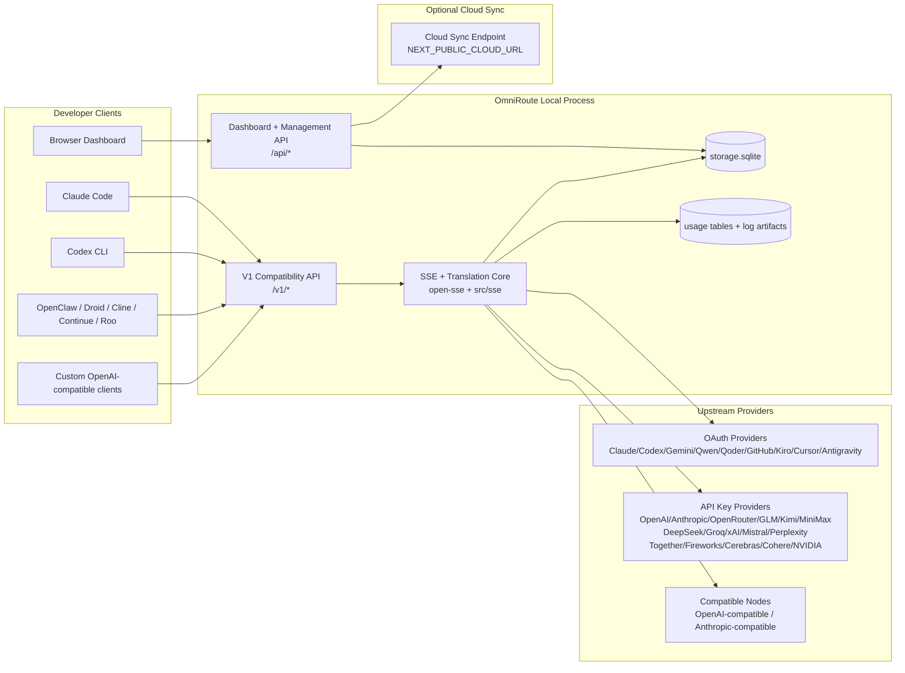
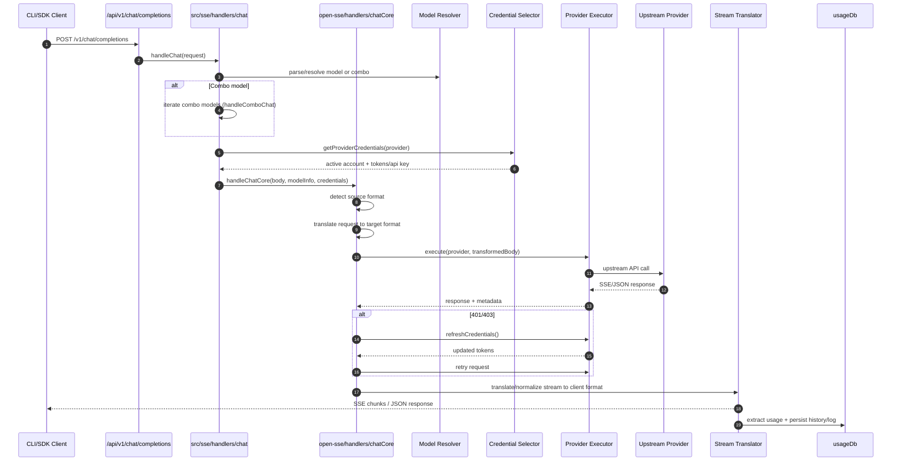
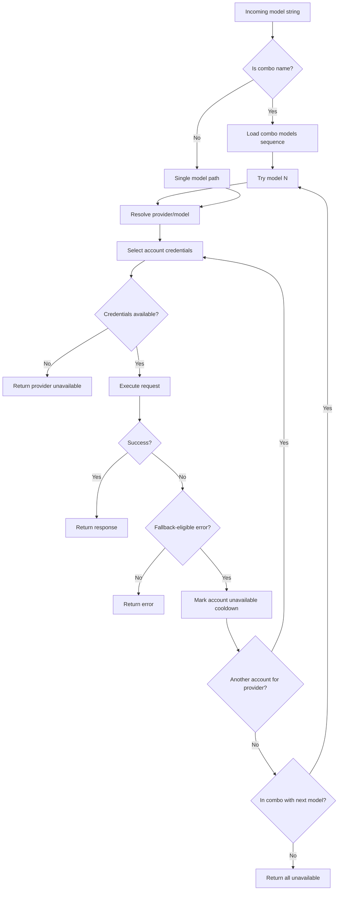
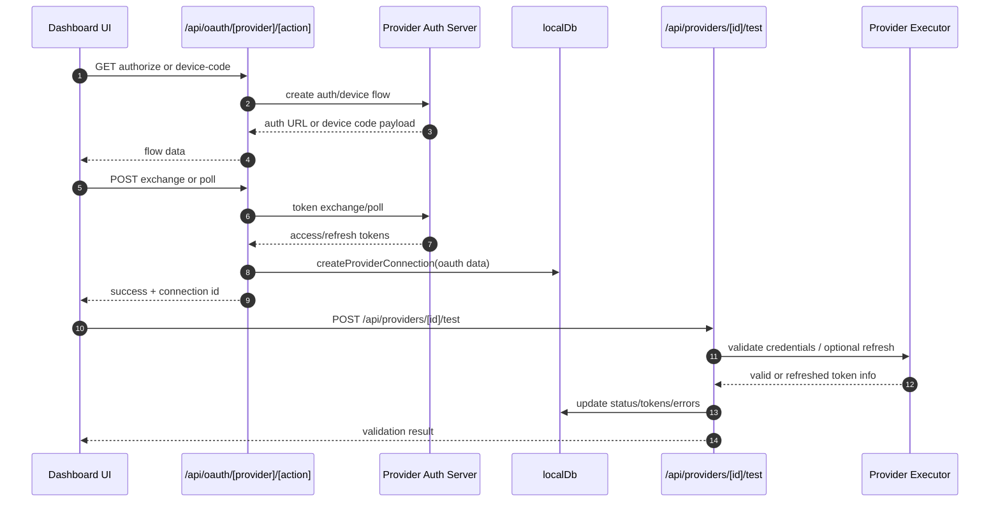
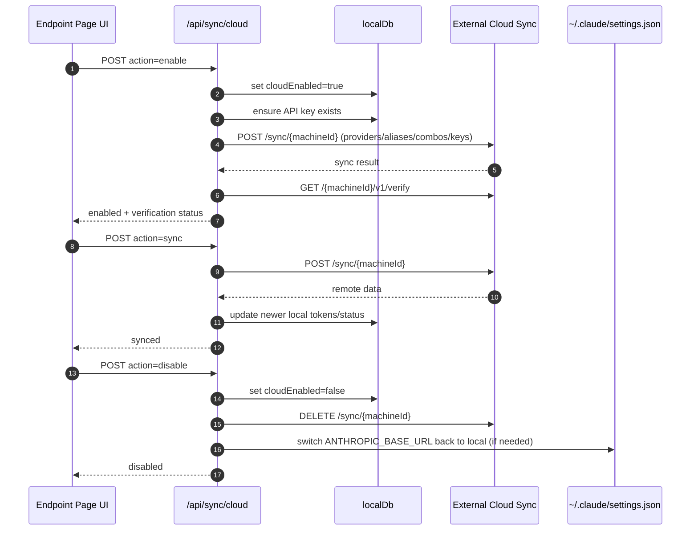
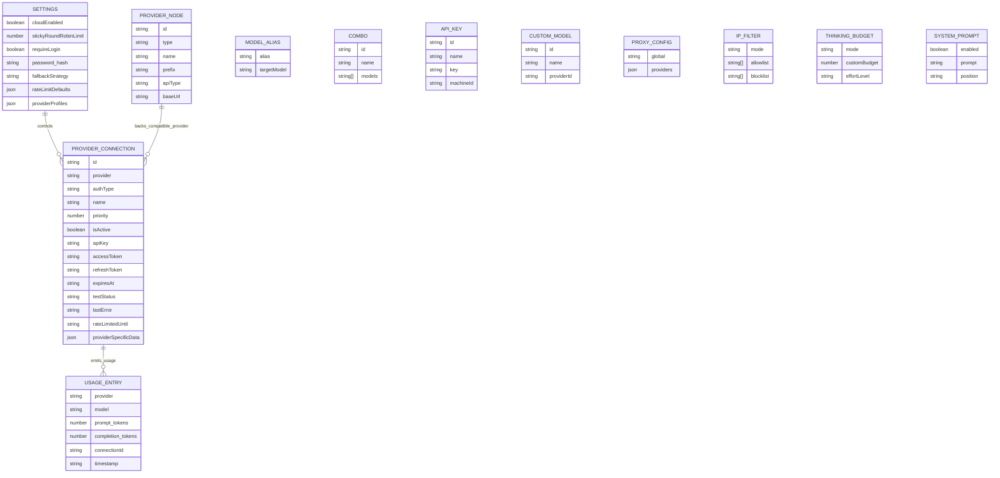
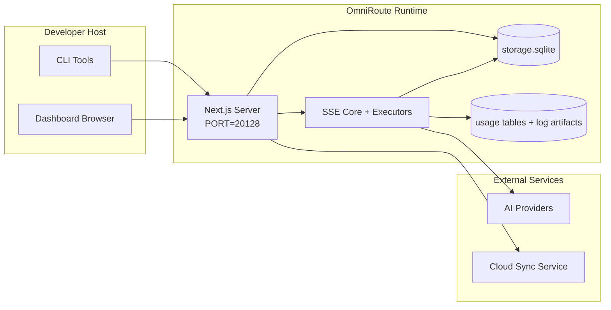

# OmniRoute Architecture (Suomi)

🌐 **Languages:** 🇺🇸 [English](../../../../docs/ARCHITECTURE.md) · 🇪🇸 [es](../../es/docs/ARCHITECTURE.md) · 🇫🇷 [fr](../../fr/docs/ARCHITECTURE.md) · 🇩🇪 [de](../../de/docs/ARCHITECTURE.md) · 🇮🇹 [it](../../it/docs/ARCHITECTURE.md) · 🇷🇺 [ru](../../ru/docs/ARCHITECTURE.md) · 🇨🇳 [zh-CN](../../zh-CN/docs/ARCHITECTURE.md) · 🇯🇵 [ja](../../ja/docs/ARCHITECTURE.md) · 🇰🇷 [ko](../../ko/docs/ARCHITECTURE.md) · 🇸🇦 [ar](../../ar/docs/ARCHITECTURE.md) · 🇮🇳 [hi](../../hi/docs/ARCHITECTURE.md) · 🇮🇳 [in](../../in/docs/ARCHITECTURE.md) · 🇹🇭 [th](../../th/docs/ARCHITECTURE.md) · 🇻🇳 [vi](../../vi/docs/ARCHITECTURE.md) · 🇮🇩 [id](../../id/docs/ARCHITECTURE.md) · 🇲🇾 [ms](../../ms/docs/ARCHITECTURE.md) · 🇳🇱 [nl](../../nl/docs/ARCHITECTURE.md) · 🇵🇱 [pl](../../pl/docs/ARCHITECTURE.md) · 🇸🇪 [sv](../../sv/docs/ARCHITECTURE.md) · 🇳🇴 [no](../../no/docs/ARCHITECTURE.md) · 🇩🇰 [da](../../da/docs/ARCHITECTURE.md) · 🇫🇮 [fi](../../fi/docs/ARCHITECTURE.md) · 🇵🇹 [pt](../../pt/docs/ARCHITECTURE.md) · 🇷🇴 [ro](../../ro/docs/ARCHITECTURE.md) · 🇭🇺 [hu](../../hu/docs/ARCHITECTURE.md) · 🇧🇬 [bg](../../bg/docs/ARCHITECTURE.md) · 🇸🇰 [sk](../../sk/docs/ARCHITECTURE.md) · 🇺🇦 [uk-UA](../../uk-UA/docs/ARCHITECTURE.md) · 🇮🇱 [he](../../he/docs/ARCHITECTURE.md) · 🇵🇭 [phi](../../phi/docs/ARCHITECTURE.md) · 🇧🇷 [pt-BR](../../pt-BR/docs/ARCHITECTURE.md) · 🇨🇿 [cs](../../cs/docs/ARCHITECTURE.md) · 🇹🇷 [tr](../../tr/docs/ARCHITECTURE.md)

---

_Viimeksi päivitetty: 2026-03-28_## Executive Summary

OmniRoute on paikallinen AI-reititysyhdyskäytävä ja kojelauta, joka on rakennettu Next.js:lle.
Se tarjoaa yhden OpenAI-yhteensopivan päätepisteen (`/v1/*`) ja reitittää liikenteen useiden alkupään palveluntarjoajien kesken kääntämisen, varaajan, tunnuksen päivityksen ja käytön seurannan avulla.

Ydinominaisuudet:

- OpenAI-yhteensopiva API-pinta CLI:lle/työkaluille (28 toimittajaa)
- Pyydä/vastaa käännös palveluntarjoajan eri formaattien välillä
- Mallin yhdistelmävara (usean mallin sarja)
- Tilitason varatoiminto (usea tili palveluntarjoajaa kohti)
- OAuth + API-avain tarjoajan yhteyden hallinta
- Upottamisen luominen /v1/embeddings-tiedoston kautta (6 palveluntarjoajaa, 9 mallia)
- Kuvien luominen /v1/images/generations-tiedoston kautta (4 toimittajaa, 9 mallia)
- Ajattele tagien jäsentämistä (`<think>...</think>`) päättelymalleille
- Vastauksen desinfiointi tiukan OpenAI SDK -yhteensopivuuden takaamiseksi
- Roolien normalisointi (kehittäjä→järjestelmä, järjestelmä→käyttäjä) palveluntarjoajien välistä yhteensopivuutta varten
- Strukturoitu lähdön muunnos (json_schema → Gemini responseSchema)
- Paikallinen pysyvyys tarjoajille, avaimille, aliaksille, yhdistelmille, asetuksille, hinnoittelulle
- Käytön/kustannusten seuranta ja pyyntöjen kirjaaminen
- Valinnainen pilvisynkronointi usean laitteen/tilan synkronointiin
- IP-sallitut / estolistat API-käyttöoikeuksien hallinnassa
- Ajatteleva budjetin hallinta (läpivienti/automaattinen/mukautettu/mukautuva)
- Globaali järjestelmän nopea ruiskutus
- Istunnon seuranta ja sormenjäljet
- Tilikohtainen tehostettu hintarajoitus tarjoajakohtaisilla profiileilla
- Katkaisijakuvio palveluntarjoajan joustavuuden parantamiseksi
- Ukkosta estävä laumasuoja mutex-lukolla
- Allekirjoituspohjainen pyyntöjen duplikoinnin välimuisti
- Verkkotunnustaso: mallin saatavuus, hintasäännöt, varakäytäntö, lukituskäytäntö
- Verkkotunnuksen tilan pysyvyys (SQLite-kirjoitusvälimuisti varauksille, budjeteille, lukituksille, katkaisimille)
- Käytäntömoottori keskitettyä pyyntöjen arviointia varten (sulku → budjetti → vara)
- Pyydä telemetriaa p50/p95/p99-latenssiaggregaatiolla
- Korrelaatiotunnus (X-Request-Id) päästä päähän -jäljitykseen
- Vaatimustenmukaisuuden tarkastuksen kirjaaminen ja opt-out API-avaimella
- Eval-kehys LLM-laadunvarmistukseen
- Joustavan käyttöliittymän kojelauta, jossa on reaaliaikainen katkaisijatila
- Modulaariset OAuth-palveluntarjoajat (12 yksittäistä moduulia kohdassa "src/lib/oauth/providers/")

Ensisijainen suoritusaikamalli:

- Next.js-sovellusreitit kohdassa `src/app/api/*` toteuttavat sekä hallintapaneelin sovellusliittymiä että yhteensopivuussovellusliittymiä
- Jaettu SSE/reititysydin kohdassa `src/sse/*` + `open-sse/*` hoitaa palveluntarjoajan suorittamisen, käännöksen, suoratoiston, varatoiminnon ja käytön## Scope and Boundaries

### In Scope

- Paikallisen yhdyskäytävän suoritusaika
- Kojelaudan hallintasovellusliittymät
- Palveluntarjoajan todennus ja tunnuksen päivitys
- Pyydä käännöstä ja SSE-suoratoistoa
- Paikallinen tila + käytön pysyvyys
- Valinnainen pilvisynkronointiorkesteri### Out of Scope

- Pilvipalvelun toteutus osoitteen "NEXT_PUBLIC_CLOUD_URL" takana
- Palveluntarjoajan SLA/ohjaustaso paikallisen prosessin ulkopuolella
- Itse ulkoiset CLI-binaarit (Claude CLI, Codex CLI jne.)## Dashboard Surface (Current)

Pääsivut kohdassa `src/app/(dashboard)/dashboard/`:

- `/dashboard` — pika-aloitus + palveluntarjoajan yleiskatsaus
- "/dashboard/endpoint" - päätepisteen välityspalvelin + MCP + A2A + API-päätepisteen välilehdet
- "/dashboard/providers" — palveluntarjoajan yhteydet ja tunnistetiedot
- "/dashboard/combos" - yhdistelmästrategiat, mallit, mallin reitityssäännöt
- "/dashboard/costs" — kustannusten yhteenlaskettu ja hinnoittelun näkyvyys
- `/dashboard/analytics' — käyttöanalytiikka ja arvioinnit
- "/dashboard/limits" - kiintiön/hinnan säätimet
- "/dashboard/cli-tools" - CLI:n käyttöönotto, suorituksenaikainen tunnistus, asetusten luominen
- "/dashboard/agents" — havaitut ACP-agentit + mukautetun agentin rekisteröinti
- `/dashboard/media` — kuvan/videon/musiikin leikkipaikka
- `/dashboard/search-tools' — hakupalveluntarjoajan testaus ja historia
- `/dashboard/health' — käytettävyysaika, katkaisijat, nopeusrajoitukset
- "/dashboard/logs" — pyyntö/välityspalvelin/tarkastus/konsolilokit
- "/dashboard/settings" — järjestelmäasetusten välilehdet (yleiset, reititys, yhdistelmäoletusasetukset jne.)
- `/dashboard/api-manager` — API-avaimen elinkaaren ja mallin käyttöoikeudet## High-Level System Context



## Core Runtime Components

## 1) API and Routing Layer (Next.js App Routes)

Päähakemistot:

- `src/app/api/v1/*` ja `src/app/api/v1beta/*` yhteensopiville sovellusliittymille
- `src/app/api/*` hallinta-/määrityssovellusliittymille
- Seuraavaksi kirjoitetaan uudelleen `next.config.mjs`-kartassa `/v1/*` muotoon `/api/v1/*`

Tärkeitä yhteensopivuusreittejä:

- `src/app/api/v1/chat/completions/route.ts'
- "src/app/api/v1/messages/route.ts".
- "src/app/api/v1/responses/route.ts".
- "src/app/api/v1/models/route.ts" - sisältää mukautettuja malleja "custom: true"
- "src/app/api/v1/embeddings/route.ts" - upotuksen sukupolvi (6 tarjoajaa)
- "src/app/api/v1/images/generations/route.ts" - kuvien luominen (4+ tarjoajaa, mukaan lukien Antigravity/Nebius)
- `src/app/api/v1/messages/count_tokens/route.ts`
- "src/app/api/v1/providers/[provider]/chat/completions/route.ts" - palveluntarjoajakohtainen keskustelu
- `src/app/api/v1/providers/[provider]/embeddings/route.ts' – omat palveluntarjoajakohtaiset upotukset
- "src/app/api/v1/providers/[provider]/images/generations/route.ts" - palveluntarjoajakohtaiset kuvat
- "src/app/api/v1beta/models/route.ts".
- `src/app/api/v1beta/models/[...polku]/route.ts`

Hallintoverkkotunnukset:

- Todennus/asetukset: `src/app/api/auth/*`, `src/app/api/settings/*`
- Palveluntarjoajat/yhteydet: `src/app/api/providers*`
- Palveluntarjoajan solmut: `src/app/api/provider-nodes\*'
- Mukautetut mallit: `src/app/api/provider-models' (GET/POST/DELETE)
- Malliluettelo: `src/app/api/models/route.ts' (GET)
- Välityspalvelimen konfiguraatio: "src/app/api/settings/proxy" (GET/PUT/DELETE) + "src/app/api/settings/proxy/test" (POST)
- OAuth: `src/app/api/oauth/*`
- Keys/aliases/combos/pricing: "src/app/api/keys*", "src/app/api/models/alias", "src/app/api/combos*", "src/app/api/pricing"
- Käyttö: `src/app/api/usage/*`
- Synkronointi/pilvi: `src/app/api/sync/*`, `src/app/api/cloud/*`
- CLI-työkalujen apuohjelmat: `src/app/api/cli-tools/*`
- IP-suodatin: `src/app/api/settings/ip-filter' (GET/PUT)
- Thinking-budjetti: `src/app/api/settings/thinking-budget' (GET/PUT)
- Järjestelmäkehote: `src/app/api/settings/system-prompt' (GET/PUT)
- Istunnot: `src/app/api/sessions' (GET)
- Nopeusrajoitukset: `src/app/api/rate-limits' (GET)
- Kestävyys: "src/app/api/resilience" (GET/PATCH) – palveluntarjoajan profiilit, katkaisija, nopeusrajoitustila
- Kestävyyden nollaus: "src/app/api/resilience/reset" (POST) - nollaa katkaisijat + jäähdytys
- Välimuistitilastot: `src/app/api/cache/stats' (GET/DELETE)
- Mallin saatavuus: `src/app/api/models/availability' (GET/POST)
- Telemetria: "src/app/api/telemetry/summary" (GET)
- Budjetti: `src/app/api/usage/budget' (GET/POST)
- Varaketjut: `src/app/api/fallback/chains' (GET/POST/DELETE)
- Vaatimustenmukaisuuden tarkastus: `src/app/api/compliance/audit-log' (GET)
- Evals: "src/app/api/evals" (GET/POST), "src/app/api/evals/[suiteId]" (GET)
- Käytännöt: `src/app/api/policies' (GET/POST)## 2) SSE + Translation Core

Päävirtausmoduulit:

- Merkintä: "src/sse/handlers/chat.ts".
- Ydinorkesteri: `open-sse/handlers/chatCore.ts`
- Tarjoajan suoritussovittimet: `open-sse/executors/*`
- Muototunnistuksen/palveluntarjoajan kokoonpano: `open-sse/services/provider.ts`
- Mallin jäsennys/resolve: `src/sse/services/model.ts`, `open-sse/services/model.ts`
- Tilin varalogiikka: "open-sse/services/accountFallback.ts".
- Käännösrekisteri: "open-sse/translator/index.ts".
- Stream-muunnokset: "open-sse/utils/stream.ts", "open-sse/utils/streamHandler.ts"
- Käytön purkaminen/normalisointi: `open-sse/utils/usageTracking.ts`
- Think tag -parser: `open-sse/utils/thinkTagParser.ts`
- Upotuskäsittelijä: "open-sse/handlers/embeddings.ts".
- Upotuspalveluntarjoajan rekisteri: `open-sse/config/embeddingRegistry.ts`
- Kuvanluontikäsittelijä: "open-sse/handlers/imageGeneration.ts".
- Kuvantarjoajan rekisteri: "open-sse/config/imageRegistry.ts".
- Vastauksen desinfiointi: "open-sse/handlers/responseSanitizer.ts"
- Roolin normalisointi: "open-sse/services/roleNormalizer.ts".

Palvelut (liiketoimintalogiikka):

- Tilin valinta/pisteytys: `open-sse/services/accountSelector.ts`
- Kontekstin elinkaarihallinta: `open-sse/services/contextManager.ts`
- IP-suodattimen valvonta: "open-sse/services/ipFilter.ts".
- Istunnon seuranta: `open-sse/services/sessionManager.ts`
- Pyydä päällekkäisyyden poistoa: `open-sse/services/signatureCache.ts`
- Järjestelmäkehotteen lisäys: "open-sse/services/systemPrompt.ts".
- Ajatteleva budjetin hallinta: "open-sse/services/thinkingBudget.ts"
- Jokerimerkkimallin reititys: `open-sse/services/wildcardRouter.ts`
- Hintarajan hallinta: `open-sse/services/rateLimitManager.ts`
- Katkaisija: "open-sse/services/circuitBreaker.ts"

Domain-kerroksen moduulit:

- Mallin saatavuus: "src/lib/domain/modelAvailability.ts".
- Kustannussäännöt/budjetit: `src/lib/domain/costRules.ts`
- Varakäytäntö: "src/lib/domain/fallbackPolicy.ts".
- Yhdistelmäratkaisu: `src/lib/domain/comboResolver.ts'
- Lukituskäytäntö: "src/lib/domain/lockoutPolicy.ts".
- Käytäntömoottori: "src/domain/policyEngine.ts" — keskitetty lukitus → budjetti → varaarviointi
- Virhekoodiluettelo: "src/lib/domain/errorCodes.ts".
- Pyyntötunnus: `src/lib/domain/requestId.ts'
- Haun aikakatkaisu: "src/lib/domain/fetchTimeout.ts".
- Pyydä telemetriaa: `src/lib/domain/requestTelemetry.ts`
- Vaatimustenmukaisuus/tarkastus: `src/lib/domain/compliance/index.ts'
- Eval runner: `src/lib/domain/evalRunner.ts`
- Verkkotunnuksen tilan pysyvyys: `src/lib/db/domainState.ts' — SQLite CRUD varaketjuille, budjeteille, kustannushistorialle, lukitustilalle, katkaisimille

OAuth-palveluntarjoajan moduulit (12 yksittäistä tiedostoa kohdassa "src/lib/oauth/providers/"):

- Rekisterihakemisto: "src/lib/oauth/providers/index.ts".
- Yksittäiset palveluntarjoajat: "claude.ts", "codex.ts", "gemini.ts", "antigravity.ts", "qoder.ts", "qwen.ts", "kimi-coding.ts", "github.ts", "kiro.cursorts", `cline.ts`
- Ohut kääre: "src/lib/oauth/providers.ts" - uudelleenvienti yksittäisistä moduuleista## 3) Persistence Layer

Ensisijainen tila DB (SQLite):

- Ydininfrastruktuuri: "src/lib/db/core.ts" (better-sqlite3, migraatiot, WAL)
- Vie julkisivu uudelleen: "src/lib/localDb.ts" (ohut yhteensopivuuskerros soittajille)
- tiedosto: `${DATA_DIR}/storage.sqlite` (tai `$XDG_CONFIG_HOME/omniroute/storage.sqlite`, kun se on asetettu, muuten `~/.omniroute/storage.sqlite`)
- entiteetit (taulukot + KV-nimitilat): providerConnections, providerNodes, mallialiakset, yhdistelmät, apiKeys, asetukset, hinnoittelu,**customModels**,**proxyConfig**,**ipFilter**,**thhinkingBudget**,**systemPrompt**

Käytön pysyvyys:

- julkisivu: "src/lib/usageDb.ts" (hajotetut moduulit tiedostossa "src/lib/usage/\*")
- SQLite-taulukot tiedostossa "storage.sqlite": "usage_history", "call_logs", "proxy_logs"
- valinnaiset tiedostoartefaktit jäävät yhteensopivuutta/virheenkorjausta varten (`${DATA_DIR}/log.txt`, `${DATA_DIR}/call_logs/`, `<repo>/logs/...`)
- Vanhat JSON-tiedostot siirretään SQLiteen käynnistyssiirroilla, kun ne ovat olemassa

Domain State DB (SQLite):

- "src/lib/db/domainState.ts" - CRUD-toiminnot toimialueen tilalle
- Taulukot (luodut tiedostossa "src/lib/db/core.ts"): "domain_fallback_chains", "domain_budgets", "domain_cost_history", "domain_lockout_state", "domain_circuit_breakers"
- Kirjoitusvälimuistin malli: muistissa olevat kartat ovat arvovaltaisia ajon aikana; mutaatiot kirjoitetaan synkronisesti SQLiten kanssa; tila palautetaan DB:stä kylmäkäynnistyksen yhteydessä## 4) Auth + Security Surfaces

- Hallintapaneelin evästeiden todennus: "src/proxy.ts", "src/app/api/auth/login/route.ts"
- API-avaimen luonti/vahvistus: `src/shared/utils/apiKey.ts`
- Palveluntarjoajan salaisuudet säilyivät "providerConnections"-merkinnöissä
- Lähtevän välityspalvelimen tuki "open-sse/utils/proxyFetch.ts" (env vars) ja "open-sse/utils/networkProxy.ts" kautta (määritettävä palveluntarjoajakohtaisesti tai globaali)## 5) Cloud Sync

- Aikataulun aloitus: `src/lib/initCloudSync.ts`, `src/shared/services/initializeCloudSync.ts`, `src/shared/services/modelSyncScheduler.ts`
- Säännöllinen tehtävä: `src/shared/services/cloudSyncScheduler.ts`
- Säännöllinen tehtävä: `src/shared/services/modelSyncScheduler.ts`
- Hallitse reittiä: `src/app/api/sync/cloud/route.ts'## Request Lifecycle (`/v1/chat/completions`)



## Combo + Account Fallback Flow



Varapäätökset tehdään "open-sse/services/accountFallback.ts":n avulla tilakoodeja ja virheviestiheuristiikkaa käyttäen. Yhdistelmäreititys lisää yhden ylimääräisen suojan: palveluntarjoajan kattamat 400:t, kuten ylävirran sisällön lohko- ja roolivahvistuksen epäonnistumiset, käsitellään mallin paikallisina virheinä, jotta myöhempiä yhdistelmäkohteita voidaan edelleen suorittaa.## OAuth Onboarding and Token Refresh Lifecycle



Päivitys reaaliaikaisen liikenteen aikana suoritetaan "open-sse/handlers/chatCore.ts" -tiedostossa suorittimen "refreshCredentials()" kautta.## Cloud Sync Lifecycle (Enable / Sync / Disable)



"CloudSyncScheduler" käynnistää säännöllisen synkronoinnin, kun pilvi on käytössä.## Data Model and Storage Map



Fyysiset tallennustiedostot:

- ensisijainen ajonaikainen tietokanta: `${DATA_DIR}/storage.sqlite`
- pyyntölokin rivit: `${DATA_DIR}/log.txt` (compat/debug artefact)
- jäsennellyt puhelun hyötykuorma-arkistot: `${DATA_DIR}/call_logs/`
- valinnainen kääntäjä/pyydä virheenkorjausistuntoja: `<repo>/logs/...`## Deployment Topology



## Module Mapping (Decision-Critical)

### Route and API Modules

- `src/app/api/v1/*`, `src/app/api/v1beta/*`: yhteensopivuussovellusliittymät
- `src/app/api/v1/providers/[provider]/*`: omat palveluntarjoajakohtaiset reitit (chat, upotukset, kuvat)
- `src/app/api/providers\*: palveluntarjoajan CRUD, validointi, testaus
- `src/app/api/provider-nodes\*: mukautettu yhteensopiva solmuhallinta
- "src/app/api/provider-models": mukautetun mallin hallinta (CRUD)
- "src/app/api/models/route.ts": malliluettelon sovellusliittymä (aliakset + mukautetut mallit)
- `src/app/api/oauth/*`: OAuth/laitekoodikulku
- `src/app/api/keys\*: paikallisen API-avaimen elinkaari
- "src/app/api/models/alias": aliaksen hallinta
- `src/app/api/combos*`: varayhdistelmähallinta
- "src/app/api/pricing": hinnoittelu ohittaa kustannuslaskennan
- "src/app/api/settings/proxy": välityspalvelimen määritykset (GET/PUT/DELETE)
- "src/app/api/settings/proxy/test": lähtevän välityspalvelimen yhteystesti (POST)
- `src/app/api/usage/*`: käyttö- ja lokisovellusliittymät
- `src/app/api/sync/*` + `src/app/api/cloud/*`: pilvisynkronointi ja pilveen suuntautuvat apuohjelmat
- `src/app/api/cli-tools/*`: paikalliset CLI-asetusten kirjoittajat/tarkistajat
- `src/app/api/settings/ip-filter': IP-sallittujen luettelo/estolista (GET/PUT)
- `src/app/api/settings/thhinking-budget': ajattelutunnuksen budjetin konfiguraatio (GET/PUT)
- "src/app/api/settings/system-prompt": yleinen järjestelmäkehote (GET/PUT)
- `src/app/api/sessions': aktiivisten istuntojen luettelo (GET)
- "src/app/api/rate-limits": tilikohtainen korkorajoitustila (GET)### Routing and Execution Core

- `src/sse/handlers/chat.ts: pyynnön jäsennys, yhdistelmäkäsittely, tilin valintasilmukka
- `open-sse/handlers/chatCore.ts`: käännös, suorittimen lähettäminen, uudelleenyritys/päivityskäsittely, streamin määritys
- `open-sse/executors/*`: palveluntarjoajakohtainen verkko- ja muotokäyttäytyminen### Translation Registry and Format Converters

- "open-sse/translator/index.ts": kääntäjien rekisteri ja orkestrointi
- Pyydä kääntäjiä: `open-sse/translator/request/*`
- Vastauskääntäjät: `open-sse/translator/response/*`
- Muotovakiot: "open-sse/translator/formats.ts".### Persistence

- `src/lib/db/*`: pysyvä konfiguraatio/tila ja verkkotunnuksen pysyvyys SQLitessa
- `src/lib/localDb.ts`: DB-moduulien yhteensopivuuden uudelleenvienti
- `src/lib/usageDb.ts`: käyttöhistorian/puhelulokien julkisivu SQLite-taulukoiden päällä## Provider Executor Coverage (Strategy Pattern)

Jokaisella palveluntarjoajalla on erikoistunut suorittaja, joka laajentaa "BaseExecutoria" (hakemistossa "open-sse/executors/base.ts"), joka tarjoaa URL-osoitteen rakentamisen, otsikon rakentamisen, uudelleenyrityksen eksponentiaalisella perääntymisellä, valtuustietojen päivityskoukut ja execute()-orkesterimenetelmän.

| Toteuttaja            | Palveluntarjoaja(t)                                                                                                                                           | Erikoiskäsittely                                                                      |
| --------------------- | ------------------------------------------------------------------------------------------------------------------------------------------------------------- | ------------------------------------------------------------------------------------- |
| "DefaultExecutor"     | OpenAI, Claude, Gemini, Qwen, Qoder, OpenRouter, GLM, Kimi, MiniMax, DeepSeek, Groq, xAI, Mistral, Perplexity, Together, ilotulitus, Cerebras, Cohere, NVIDIA | Dynaaminen URL-/otsikkomääritykset tarjoajakohtaisesti                                |
| "AntigravityExecutor" | Google Antigravity                                                                                                                                            | Mukautetut projekti-/istuntotunnukset, Yritä uudelleen jäsentämisen jälkeen           |
| "CodexExecutor"       | OpenAI Codex                                                                                                                                                  | Syöttää järjestelmäohjeita, pakottaa päättelyponnistuksen                             |
| "CursorExecutor"      | Kohdistin IDE                                                                                                                                                 | ConnectRPC-protokolla, Protobuf-koodaus, pyynnön allekirjoitus tarkistussumman kautta |
| "GithubExecutor"      | GitHub Copilot                                                                                                                                                | Copilot-tunnuksen päivitys, VSC-koodia jäljittelevät otsikot                          |
| "KiroExecutor"        | AWS CodeWhisperer/Kiro                                                                                                                                        | AWS EventStream binaarimuoto → SSE-muunnos                                            |
| "GeminiCLIExecutor"   | Gemini CLI                                                                                                                                                    | Google OAuth -tunnuksen päivitysjakso                                                 |

Kaikki muut palveluntarjoajat (mukaan lukien mukautetut yhteensopivat solmut) käyttävät DefaultExecutoria.## Provider Compatibility Matrix

| Palveluntarjoaja | Muoto             | Auth                      | Striimaa             | Ei-stream | Token Refresh | Käyttösovellusliittymä      |
| ---------------- | ----------------- | ------------------------- | -------------------- | --------- | ------------- | --------------------------- | ------------------------------ |
| Claude           | claude            | API-avain / OAuth         | ✅                   | ✅        | ✅            | ⚠️ Vain järjestelmänvalvoja |
| Kaksoset         | kaksoset          | API-avain / OAuth         | ✅                   | ✅        | ✅            | ⚠️ Cloud Console            |
| Gemini CLI       | gemini-cli        | OAuth                     | ✅                   | ✅        | ✅            | ⚠️ Cloud Console            |
| Antigravitaatio  | antigravitaatio   | OAuth                     | ✅                   | ✅        | ✅            | ✅ Full quota API           |
| OpenAI           | openai            | API-avain                 | ✅                   | ✅        | ❌            | ❌                          |
| Codex            | openai-vastaukset | OAuth                     | ✅ pakotettu         | ❌        | ✅            | ✅ Hintarajat               |
| GitHub Copilot   | openai            | OAuth + Copilot Token     | ✅                   | ✅        | ✅            | ✅ Kiintiön tilannekuvat    |
| Kursori          | kohdistin         | Mukautettu tarkistussumma | ✅                   | ✅        | ❌            | ❌                          |
| Kiro             | kiro              | AWS SSO OIDC              | ✅ (TapahtumaStream) | ❌        | ✅            | ✅ Käyttörajoitukset        |
| Qwen             | openai            | OAuth                     | ✅                   | ✅        | ✅            | ⚠️ Pyynnöstä                |
| Qoder            | openai            | OAuth (Perus)             | ✅                   | ✅        | ✅            | ⚠️ Pyynnöstä                |
| OpenRouter       | openai            | API-avain                 | ✅                   | ✅        | ❌            | ❌                          |
| GLM/Kimi/MiniMax | claude            | API-avain                 | ✅                   | ✅        | ❌            | ❌                          |
| DeepSeek         | openai            | API-avain                 | ✅                   | ✅        | ❌            | ❌                          |
| Groq             | openai            | API-avain                 | ✅                   | ✅        | ❌            | ❌                          |
| xAI (Grok)       | openai            | API-avain                 | ✅                   | ✅        | ❌            | ❌                          |
| Mistral          | openai            | API-avain                 | ✅                   | ✅        | ❌            | ❌                          |
| Hämmennys        | openai            | API-avain                 | ✅                   | ✅        | ❌            | ❌                          |
| Yhdessä AI       | openai            | API-avain                 | ✅                   | ✅        | ❌            | ❌                          |
| Ilotulitus AI    | openai            | API-avain                 | ✅                   | ✅        | ❌            | ❌                          |
| Aivot            | openai            | API-avain                 | ✅                   | ✅        | ❌            | ❌                          |
| Cohere           | openai            | API-avain                 | ✅                   | ✅        | ❌            | ❌                          |
| NVIDIA NIM       | openai            | API-avain                 | ✅                   | ✅        | ❌            | ❌                          | ## Format Translation Coverage |

Havaittuja lähdemuotoja ovat:

- "openai".
- "openai-vastaukset".
- "claude".
- "kaksoset".

Kohdemuotoja ovat:

- OpenAI chat / vastaukset
- Claude
- Gemini/Gemini-CLI/Antigravity-kuori
- Kiro
- Kursori

Käännöksissä käytetään keskitinmuotona**OpenAI-muotoa**— kaikki konversiot menevät OpenAI:n kautta välimuotona:```
Source Format → OpenAI (hub) → Target Format

````

Käännökset valitaan dynaamisesti lähteen hyötykuorman muodon ja toimittajan kohdemuodon perusteella.

Muut käsittelytasot käännösputkessa:

-**Vastausten desinfiointi**– Poistaa standardista poikkeavat kentät OpenAI-muotoisista vastauksista (sekä suoratoistosta että ei-suoratoistosta) varmistaakseen tiukan SDK-yhteensopivuuden
-**Roolin normalisointi**— Muuntaa "kehittäjä" → "järjestelmä" muille kuin OpenAI-kohteille; yhdistää `system` → `user` malleille, jotka hylkäävät järjestelmäroolin (GLM, ERNIE)
-**Think-tunnisteen purkaminen**— Jäsentää "<think>...</think>" -lohkot sisällöstä "reasoning_content"-kenttään
-**Strukturoitu tulos**— Muuntaa OpenAI `response_format.json_schema` Geminin `responseMimeType` + `responseSchema`.## Supported API Endpoints

| Päätepiste | Muoto | Käsittelijä |
| --------------------------------------------------- | ------------------- | -------------------------------------------------------------------- |
| `POST /v1/chat/completions` | OpenAI Chat | `src/sse/handlers/chat.ts` |
| `POST /v1/messages` | Claude Viestit | Sama käsittelijä (tunnistettu automaattisesti) |
| `POST /v1/responses` | OpenAI-vastaukset | `open-sse/handlers/responsesHandler.ts` |
| `POST /v1/embeddings` | OpenAI Embeddings | "open-sse/handlers/embeddings.ts" |
| `HAE /v1/embeddings` | Malliluettelo | API reitti |
| `POST /v1/images/generations` | OpenAI-kuvat | `open-sse/handlers/imageGeneration.ts` |
| `GET /v1/images/generations` | Malliluettelo | API reitti |
| `POST /v1/providers/{provider}/chat/completions` | OpenAI Chat | Palveluntarjoajakohtainen mallin validointi |
| `POST /v1/providers/{provider}/embeddings` | OpenAI Embeddings | Palveluntarjoajakohtainen mallin validointi |
| `POST /v1/providers/{provider}/images/generations` | OpenAI-kuvat | Palveluntarjoajakohtainen mallin validointi |
| `POST /v1/messages/count_tokens` | Claude Token Count | API reitti |
| `HAE /v1/mallit` | OpenAI-mallien luettelo | API-reitti (chat + upotus + kuva + mukautetut mallit) |
| "GET /api/models/catalog" | Luettelo | Kaikki mallit ryhmitelty tarjoajan + tyypin mukaan |
| `POST /v1beta/models/*:streamGenerateContent` | Gemini syntyperäinen | API reitti |
| `GET/PUT/DELETE /api/settings/proxy` | Välityspalvelimen kokoonpano | Verkon välityspalvelimen määritykset |
| "POST /api/settings/proxy/test" | Välityspalvelinyhteydet | Välityspalvelimen kunto/yhteystestin päätepiste |
| `GET/POST/DELETE /api/provider-models` | Palveluntarjoajan mallit | Palveluntarjoajan mallin metatietojen tausta mukautettuja ja hallittuja saatavilla olevia malleja |## Bypass Handler

Ohituskäsittelijä (`open-sse/utils/bypassHandler.ts`) sieppaa Claude CLI:n tunnetut "heittopyynnöt" – lämmittelypingit, otsikon poiminnot ja tunnukset - ja palauttaa**väärennetyn vastauksen**kuluttamatta alkupään toimittajatunnuksia. Tämä käynnistyy vain, kun "User-Agent" sisältää "claude-cli".## Request Logger Pipeline

Pyyntöloggeri (`open-sse/utils/requestLogger.ts`) tarjoaa 7-vaiheisen virheenkorjauslokiputken, joka on oletusarvoisesti pois käytöstä ja joka on käytössä kohdassa ENABLE_REQUEST_LOGS=true:```
1_req_client.json → 2_req_source.json → 3_req_openai.json → 4_req_target.json
→ 5_res_provider.txt → 6_res_openai.txt → 7_res_client.txt
````

Tiedostot kirjoitetaan hakemistoon `<repo>/logs/<session>/` jokaista pyyntöistuntoa varten.## Failure Modes and Resilience

## 1) Account/Provider Availability

- Palveluntarjoajan tilin jäähtyminen ohimenevien / nopeus / todennusvirheiden vuoksi
- tilin varaosa ennen epäonnistunutta pyyntöä
- Yhdistelmämallin palautus, kun nykyisen mallin/palveluntarjoajan polku on käytetty loppuun## 2) Token Expiry

- esitarkista ja päivitä yrittämällä uudelleen päivitettävien palveluntarjoajien kohdalla
- 401/403 yritä uudelleen päivitysyrityksen jälkeen ydinpolulla## 3) Stream Safety

- irrotettava stream-ohjain
- käännösvirta streamin lopun huuhtelulla ja [VALMIS]-käsittelyllä
- käyttöarvion varavaihtoehto, kun palveluntarjoajan käytön metatiedot puuttuvat## 4) Cloud Sync Degradation

- Synkronointivirheet tulevat esiin, mutta paikallinen suoritusaika jatkuu
- ajastimessa on uudelleenyrityslogiikka, mutta säännöllinen suoritus tällä hetkellä kutsuu oletusarvoisesti yhden yrityksen synkronointia## 5) Data Integrity

- SQLite-skeeman siirrot ja automaattisen päivityksen koukut käynnistyksen yhteydessä
- vanha JSON → SQLite-siirtoyhteensopivuuspolku## Observability and Operational Signals

Ajonaikaisen näkyvyyden lähteet:

- konsolin lokit osoitteesta "src/sse/utils/logger.ts".
- SQLiten pyyntökohtaiset käyttöaggregaatit ("usage_history", "call_logs", "proxy_logs")
- nelivaiheiset yksityiskohtaiset hyötykuorman kaappaukset SQLitessa (`request_detail_logs`), kun `settings.detailed_logs_enabled=true`
- tekstimuotoisen pyynnön tilaloki tiedostossa "log.txt" (valinnainen/compat)
- valinnaiset syvät pyyntö-/käännöslokit lokit/-kohdassa, kun ENABLE_REQUEST_LOGS=true
- hallintapaneelin käyttöpäätepisteet (`/api/usage/*`) käyttöliittymän käyttöä varten

Yksityiskohtainen pyyntöhyötykuormakaappaus tallentaa jopa neljä JSON-hyötykuorman vaihetta reititettyä puhelua kohden:

- Asiakkaalta saatu raakapyyntö
- käännetty pyyntö todella lähetetty alkupäässä
- palveluntarjoajan vastaus rekonstruoitu JSON-muodossa; suoratoistovastaukset tiivistetään lopulliseksi yhteenvedoksi ja virran metadataksi
- OmniRouten palauttama lopullinen asiakkaan vastaus; suoratoistovastaukset tallennetaan samaan kompaktiin tiivistelmään## Security-Sensitive Boundaries

- JWT-salaisuus (`JWT_SECRET`) suojaa hallintapaneelin istunnon evästeen vahvistuksen/allekirjoituksen
- Alkuperäisen salasanan käynnistys (`INITIAL_PASSWORD`) on määritettävä eksplisiittisesti ensiajoa varten
- API-avaimen HMAC-salaisuus (`API_KEY_SECRET`) suojaa luodun paikallisen API-avainmuodon
- Tarjoajan salaisuudet (API-avaimet/tunnisteet) säilyvät paikallisessa tietokannassa, ja ne tulee suojata tiedostojärjestelmätasolla
- Pilvisynkronoinnin päätepisteet perustuvat API-avaimen todennus + konetunnuksen semantiikkaan## Environment and Runtime Matrix

Koodin aktiivisesti käyttämät ympäristömuuttujat:

- Sovellus/todennus: "JWT_SECRET", "INITIAL_PASSWORD"
- Tallennustila: "DATA_DIR".
- Yhteensopivan solmun toiminta: `ALLOW_MULTI_CONNECTIONS_PER_COMPAT_NODE`
- Valinnainen tallennuskannan ohitus (Linux/macOS, kun "DATA_DIR" ei ole asetettu): "XDG_CONFIG_HOME"
- Suojaushajautus: `API_KEY_SECRET`, `MACHINE_ID_SALT`
- Kirjaaminen: "ENABLE_REQUEST_LOGS".
- Synkronointi/pilvi-URL-osoite: NEXT_PUBLIC_BASE_URL, NEXT_PUBLIC_CLOUD_URL
- Lähtevä välityspalvelin: "HTTP_PROXY", "HTTPS_PROXY", "ALL_PROXY", "NO_PROXY" ja pienet versiot
- SOCKS5-ominaisuuden liput: "ENABLE_SOCKS5_PROXY", "NEXT_PUBLIC_ENABLE_SOCKS5_PROXY"
- Alusta/ajonaikaiset apuohjelmat (ei sovelluskohtaiset asetukset): "APPDATA", "NODE_ENV", "PORTTI", "HOSTNAME"## Known Architectural Notes

1. `usageDb` ja `localDb` jakavat saman perushakemistokäytännön (`DATA_DIR` -> `XDG_CONFIG_HOME/omniroute` -> `~/.omniroute`) vanhojen tiedostojen siirrolla.
2. "/api/v1/route.ts" siirtää samaan yhdistetyn luettelon rakennustyökaluun, jota "/api/v1/models" ("src/app/api/v1/models/catalog.ts") käyttää semanttisen ajautumisen välttämiseksi.
3. Pyyntöloggeri kirjoittaa täydet otsikot/runko, kun se on käytössä; käsittele lokihakemistoa arkaluontoisena.
4. Pilven toiminta riippuu oikeasta NEXT_PUBLIC_BASE_URL-osoitteesta ja pilvipäätepisteen saavutettavuudesta.
5. Hakemisto "open-sse/" julkaistaan ​​@omniroute/open-sse**npm-työtilapaketina**. Lähdekoodi tuo sen @omniroute/open-sse/...-tiedoston kautta (ratkaisi Next.js `transpilePackages`). Tämän asiakirjan tiedostopolut käyttävät edelleen hakemistonimeä `open-sse/` johdonmukaisuuden vuoksi.
6. Hallintapaneelin kaaviot käyttävät**Uudelleenkaavioita**(SVG-pohjainen) helppokäyttöisten, interaktiivisten analytiikkavisualisoinnit (mallien käyttöpalkkikaaviot, toimittajien erittelytaulukot onnistumisprosentteineen) varten.
7. E2E-testit käyttävät**Playwrightia**(`tests/e2e/`), suoritetaan komennolla "npm run test:e2e". Yksikkötesteissä käytetään**Node.js-testirunneria**(`tests/unit/`), suoritetaan komennolla "npm run test:unit". Lähdekoodi kohdassa `src/` on**TypeScript**(`.ts`/`.tsx`); `open-sse/`-työtila pysyy JavaScriptina (`.js`).
8. Asetukset-sivu on järjestetty viiteen välilehteen: Suojaus, Reititys (6 globaalia strategiaa: täytä ensin, round-robin, p2c, satunnainen, vähiten käytetty, kustannusoptimoitu), Resilience (muokattavat nopeusrajoitukset, katkaisija, käytännöt), AI (ajattelubudjetti, järjestelmäkehote, kehote välimuisti), Advanced (välityspalvelin).## Operational Verification Checklist

- Koonti lähteestä: `npm run build`
- Build Docker -kuva: `docker build -t omniroute .`
- Aloita huolto ja varmista:
- "HAE /api/settings".
- "GET /api/v1/models".
- CLI-kohteen perus-URL-osoitteen tulee olla "http://<host>:20128/v1", kun PORT=20128
