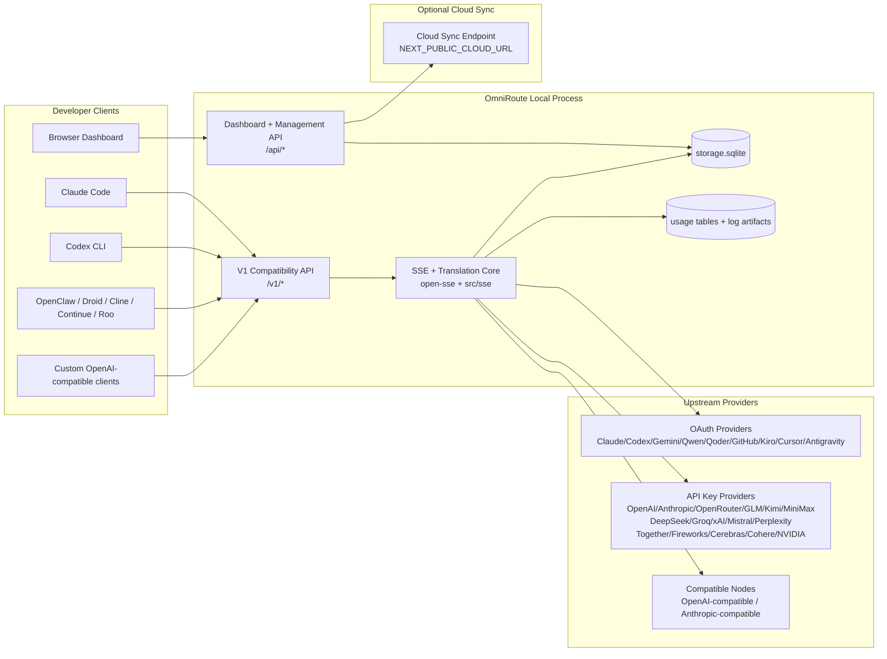
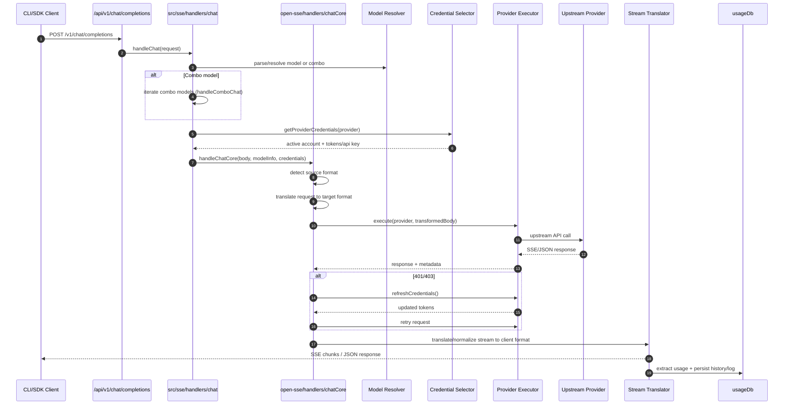
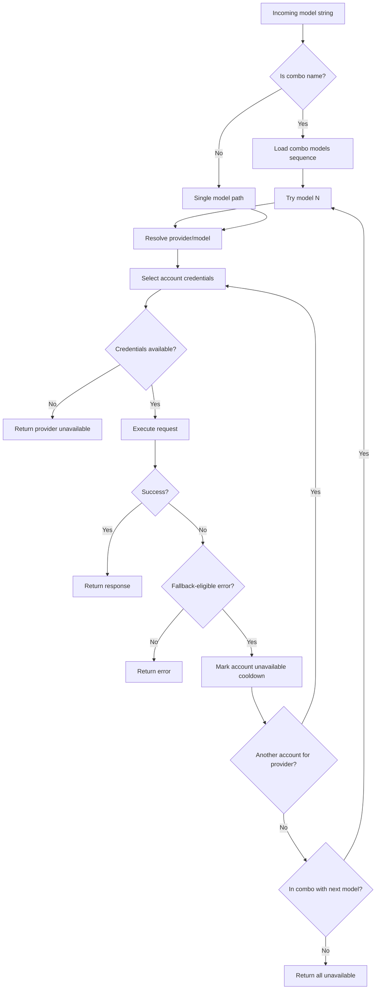
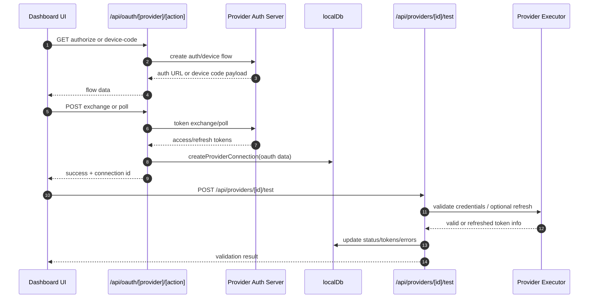
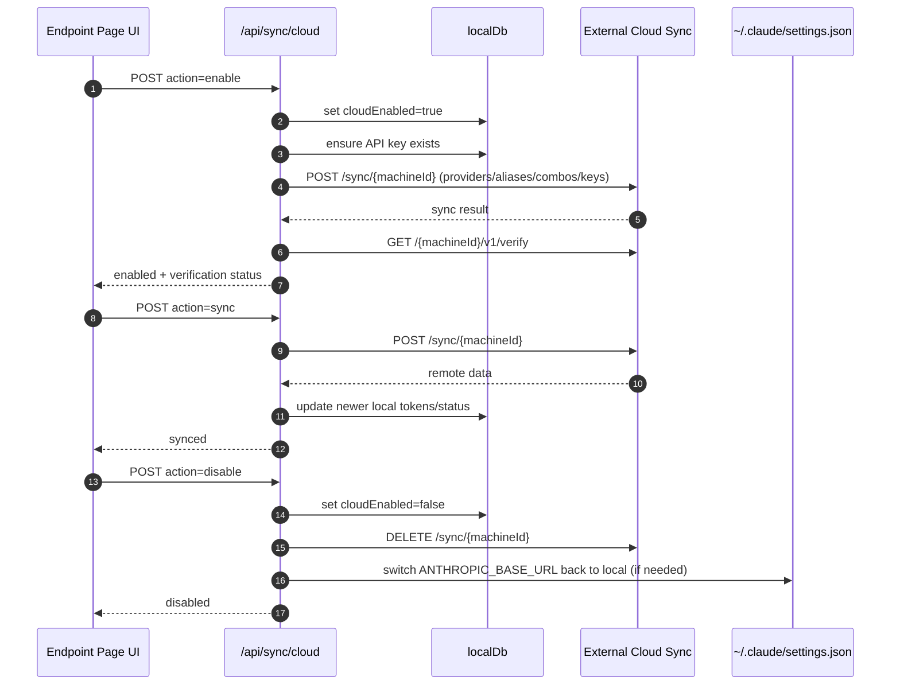
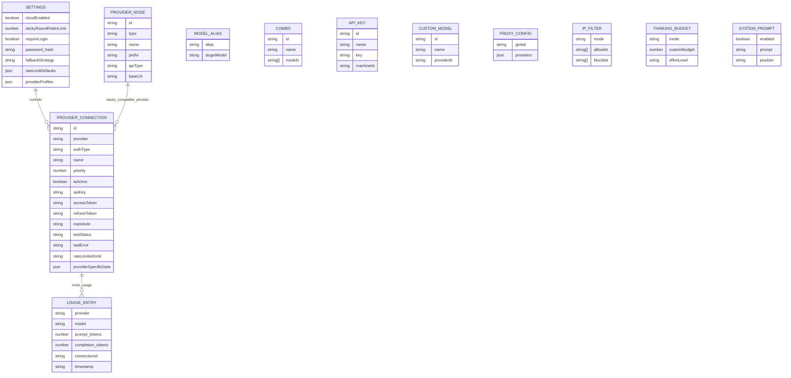
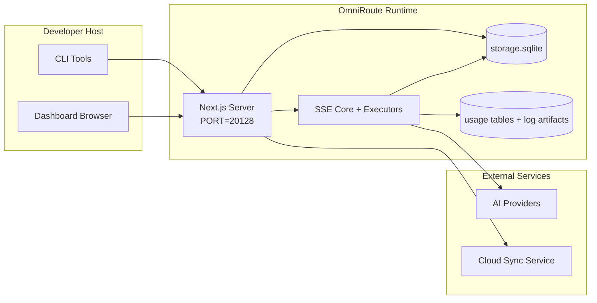

# OmniRoute Architecture (Français)

🌐 **Languages:** 🇺🇸 [English](../../../../docs/ARCHITECTURE.md) · 🇪🇸 [es](../../es/docs/ARCHITECTURE.md) · 🇫🇷 [fr](../../fr/docs/ARCHITECTURE.md) · 🇩🇪 [de](../../de/docs/ARCHITECTURE.md) · 🇮🇹 [it](../../it/docs/ARCHITECTURE.md) · 🇷🇺 [ru](../../ru/docs/ARCHITECTURE.md) · 🇨🇳 [zh-CN](../../zh-CN/docs/ARCHITECTURE.md) · 🇯🇵 [ja](../../ja/docs/ARCHITECTURE.md) · 🇰🇷 [ko](../../ko/docs/ARCHITECTURE.md) · 🇸🇦 [ar](../../ar/docs/ARCHITECTURE.md) · 🇮🇳 [hi](../../hi/docs/ARCHITECTURE.md) · 🇮🇳 [in](../../in/docs/ARCHITECTURE.md) · 🇹🇭 [th](../../th/docs/ARCHITECTURE.md) · 🇻🇳 [vi](../../vi/docs/ARCHITECTURE.md) · 🇮🇩 [id](../../id/docs/ARCHITECTURE.md) · 🇲🇾 [ms](../../ms/docs/ARCHITECTURE.md) · 🇳🇱 [nl](../../nl/docs/ARCHITECTURE.md) · 🇵🇱 [pl](../../pl/docs/ARCHITECTURE.md) · 🇸🇪 [sv](../../sv/docs/ARCHITECTURE.md) · 🇳🇴 [no](../../no/docs/ARCHITECTURE.md) · 🇩🇰 [da](../../da/docs/ARCHITECTURE.md) · 🇫🇮 [fi](../../fi/docs/ARCHITECTURE.md) · 🇵🇹 [pt](../../pt/docs/ARCHITECTURE.md) · 🇷🇴 [ro](../../ro/docs/ARCHITECTURE.md) · 🇭🇺 [hu](../../hu/docs/ARCHITECTURE.md) · 🇧🇬 [bg](../../bg/docs/ARCHITECTURE.md) · 🇸🇰 [sk](../../sk/docs/ARCHITECTURE.md) · 🇺🇦 [uk-UA](../../uk-UA/docs/ARCHITECTURE.md) · 🇮🇱 [he](../../he/docs/ARCHITECTURE.md) · 🇵🇭 [phi](../../phi/docs/ARCHITECTURE.md) · 🇧🇷 [pt-BR](../../pt-BR/docs/ARCHITECTURE.md) · 🇨🇿 [cs](../../cs/docs/ARCHITECTURE.md) · 🇹🇷 [tr](../../tr/docs/ARCHITECTURE.md)

---

_Dernière mise à jour : 2026-03-28_## Executive Summary

OmniRoute est une passerelle de routage d'IA locale et un tableau de bord construit sur Next.js.
Il fournit un seul point de terminaison compatible OpenAI (`/v1/*`) et achemine le trafic vers plusieurs fournisseurs en amont avec traduction, secours, actualisation des jetons et suivi de l'utilisation.

Capacités de base :

- Surface API compatible OpenAI pour CLI/outils (28 fournisseurs)
- Traduction des requêtes/réponses dans tous les formats de fournisseurs
- Modèle de repli combo (séquence multi-modèles)
- Repli au niveau du compte (multi-comptes par fournisseur)
- Gestion des connexions du fournisseur de clé OAuth + API
- Génération d'embarquement via `/v1/embeddings` (6 fournisseurs, 9 modèles)
- Génération d'images via `/v1/images/generations` (4 fournisseurs, 9 modèles)
- Pensez à l'analyse des balises (`<think>...</think>`) pour les modèles de raisonnement
- Désinfection des réponses pour une compatibilité stricte avec le SDK OpenAI
- Normalisation des rôles (développeur → système, système → utilisateur) pour une compatibilité entre fournisseurs
- Conversion de sortie structurée (json_schema → Gemini ResponseSchema)
- Persistance locale pour les fournisseurs, les clés, les alias, les combos, les paramètres, les prix
- Suivi de l'utilisation/des coûts et journalisation des demandes
- Synchronisation cloud en option pour la synchronisation multi-appareils/états
- Liste d'autorisation/liste de blocage IP pour le contrôle d'accès aux API
- Penser la gestion budgétaire (passthrough/auto/custom/adaptatif)
  -Injection rapide du système global
- Suivi de session et prise d'empreintes digitales
- Limitation de débit améliorée par compte avec des profils spécifiques au fournisseur
- Modèle de disjoncteur pour la résilience du fournisseur
- Protection de troupeau anti-tonnerre avec verrouillage mutex
- Cache de déduplication de requêtes basé sur les signatures
- Couche domaine : disponibilité du modèle, règles de coûts, politique de repli, politique de verrouillage
- Persistance de l'état du domaine (cache en écriture SQLite pour les solutions de repli, les budgets, les verrouillages, les disjoncteurs)
- Moteur de politique pour l'évaluation centralisée des demandes (verrouillage → budget → repli)
- Demande de télémétrie avec agrégation de latence p50/p95/p99
- ID de corrélation (X-Request-Id) pour le traçage de bout en bout
- Journalisation d'audit de conformité avec désinscription par clé API
- Cadre d'évaluation pour l'assurance qualité LLM
- Tableau de bord de l'interface utilisateur de résilience avec l'état du disjoncteur en temps réel
- Fournisseurs OAuth modulaires (12 modules individuels sous `src/lib/oauth/providers/`)

Modèle d'exécution principal :

- Les routes de l'application Next.js sous `src/app/api/*` implémentent à la fois les API de tableau de bord et les API de compatibilité
- Un noyau SSE/routage partagé dans `src/sse/*` + `open-sse/*` gère l'exécution, la traduction, le streaming, le repli et l'utilisation du fournisseur## Scope and Boundaries

### In Scope

- Runtime de la passerelle locale
- API de gestion des tableaux de bord
- Authentification du fournisseur et actualisation du jeton
- Demander une traduction et un streaming SSE
- État local + persistance d'utilisation
- Orchestration de synchronisation cloud en option### Out of Scope

- Implémentation du service Cloud derrière `NEXT_PUBLIC_CLOUD_URL`
- SLA/plan de contrôle du fournisseur en dehors du processus local
- Les binaires CLI externes eux-mêmes (Claude CLI, Codex CLI, etc.)## Dashboard Surface (Current)

Pages principales sous `src/app/(dashboard)/dashboard/` :

- `/dashboard` — démarrage rapide + aperçu du fournisseur
- `/dashboard/endpoint` — proxy de point de terminaison + MCP + A2A + onglets de point de terminaison API
- `/dashboard/providers` — connexions et informations d'identification du fournisseur
- `/dashboard/combos` — stratégies de combo, modèles, règles de routage de modèles
- `/dashboard/costs` — agrégation des coûts et visibilité sur les prix
- `/dashboard/analytics` — analyses et évaluations d'utilisation
- `/dashboard/limits` — contrôles de quotas/taux
- `/dashboard/cli-tools` — Intégration CLI, détection d'exécution, génération de configuration
- `/dashboard/agents` — agents ACP détectés + enregistrement d'agent personnalisé
- `/dashboard/media` — terrain de jeu image/vidéo/musique
- `/dashboard/search-tools` — tests et historique du moteur de recherche
- `/dashboard/health` — temps de disponibilité, disjoncteurs, limites de débit
- `/dashboard/logs` — journaux de requête/proxy/audit/console
- `/dashboard/settings` — onglets des paramètres système (général, routage, valeurs par défaut des combos, etc.)
- `/dashboard/api-manager` — Cycle de vie des clés API et autorisations du modèle## High-Level System Context



## Core Runtime Components

## 1) API and Routing Layer (Next.js App Routes)

Principaux répertoires :

- `src/app/api/v1/*` et `src/app/api/v1beta/*` pour les API de compatibilité
- `src/app/api/*` pour les API de gestion/configuration
- Les réécritures suivantes dans `next.config.mjs` mappent `/v1/*` en `/api/v1/*`

Itinéraires de compatibilité importants :

- `src/app/api/v1/chat/completions/route.ts`
- `src/app/api/v1/messages/route.ts`
- `src/app/api/v1/responses/route.ts`
- `src/app/api/v1/models/route.ts` — inclut des modèles personnalisés avec `custom: true`
- `src/app/api/v1/embeddings/route.ts` — génération d'intégration (6 fournisseurs)
- `src/app/api/v1/images/generations/route.ts` — génération d'images (4+ fournisseurs dont Antigravity/Nebius)
- `src/app/api/v1/messages/count_tokens/route.ts`
- `src/app/api/v1/providers/[provider]/chat/completions/route.ts` — chat dédié par fournisseur
- `src/app/api/v1/providers/[provider]/embeddings/route.ts` — intégrations dédiées par fournisseur
- `src/app/api/v1/providers/[provider]/images/generations/route.ts` — images dédiées par fournisseur
- `src/app/api/v1beta/models/route.ts`
- `src/app/api/v1beta/models/[...chemin]/route.ts`

Domaines de gestion :

- Authentification/paramètres : `src/app/api/auth/*`, `src/app/api/settings/*`
- Fournisseurs/connexions : `src/app/api/providers*`
- Nœuds fournisseurs : `src/app/api/provider-nodes*`
- Modèles personnalisés : `src/app/api/provider-models` (GET/POST/DELETE)
- Catalogue de modèles : `src/app/api/models/route.ts` (GET)
- Configuration du proxy : `src/app/api/settings/proxy` (GET/PUT/DELETE) + `src/app/api/settings/proxy/test` (POST)
  -OAuth : `src/app/api/oauth/*`
- Clés/alias/combos/pricing : `src/app/api/keys*`, `src/app/api/models/alias`, `src/app/api/combos*`, `src/app/api/pricing`
- Utilisation : `src/app/api/usage/*`
- Synchronisation/cloud : `src/app/api/sync/*`, `src/app/api/cloud/*`
- Aides aux outils CLI : `src/app/api/cli-tools/*`
- Filtre IP : `src/app/api/settings/ip-filter` (GET/PUT)
- Budget de réflexion : `src/app/api/settings/thinking-budget` (GET/PUT)
- Invite système : `src/app/api/settings/system-prompt` (GET/PUT)
- Sessions : `src/app/api/sessions` (GET)
- Limites de débit : `src/app/api/rate-limits` (GET)
- Résilience : `src/app/api/resilience` (GET/PATCH) — profils de fournisseur, disjoncteur, état limite de débit
- Réinitialisation de la résilience : `src/app/api/resilience/reset` (POST) — réinitialisation des disjoncteurs + temps de recharge
- Statistiques du cache : `src/app/api/cache/stats` (GET/DELETE)
- Disponibilité du modèle : `src/app/api/models/availability` (GET/POST)
- Télémétrie : `src/app/api/telemetry/summary` (GET)
- Budget : `src/app/api/usage/budget` (GET/POST)
- Chaînes de secours : `src/app/api/fallback/chains` (GET/POST/DELETE)
- Audit de conformité : `src/app/api/compliance/audit-log` (GET)
- Évaluations : `src/app/api/evals` (GET/POST), `src/app/api/evals/[suiteId]` (GET)
- Politiques : `src/app/api/policies` (GET/POST)## 2) SSE + Translation Core

Principaux modules de flux :

- Entrée : `src/sse/handlers/chat.ts`
- Orchestration de base : `open-sse/handlers/chatCore.ts`
- Adaptateurs d'exécution du fournisseur : `open-sse/executors/*`
- Détection de format/configuration du fournisseur : `open-sse/services/provider.ts`
- Analyse/résolution du modèle : `src/sse/services/model.ts`, `open-sse/services/model.ts`
- Logique de repli du compte : `open-sse/services/accountFallback.ts`
- Registre de traduction : `open-sse/translator/index.ts`
- Transformations de flux : `open-sse/utils/stream.ts`, `open-sse/utils/streamHandler.ts`
- Extraction/normalisation d'utilisation : `open-sse/utils/usageTracking.ts`
- Analyseur de balises Think : `open-sse/utils/thinkTagParser.ts`
- Gestionnaire d'intégration : `open-sse/handlers/embeddings.ts`
- Registre du fournisseur d'intégration : `open-sse/config/embeddingRegistry.ts`
- Gestionnaire de génération d'images : `open-sse/handlers/imageGeneration.ts`
- Registre du fournisseur d'images : `open-sse/config/imageRegistry.ts`
- Désinfection des réponses : `open-sse/handlers/responseSanitizer.ts`
- Normalisation des rôles : `open-sse/services/roleNormalizer.ts`

Services (logique métier) :

- Sélection/scoration des comptes : `open-sse/services/accountSelector.ts`
- Gestion du cycle de vie du contexte : `open-sse/services/contextManager.ts`
- Application du filtre IP : `open-sse/services/ipFilter.ts`
- Suivi de session : `open-sse/services/sessionManager.ts`
- Demande de déduplication : `open-sse/services/signatureCache.ts`
- Injection d'invite système : `open-sse/services/systemPrompt.ts`
- Penser la gestion budgétaire : `open-sse/services/thinkingBudget.ts`
- Routage du modèle générique : `open-sse/services/wildcardRouter.ts`
- Gestion des limites de débit : `open-sse/services/rateLimitManager.ts`
- Disjoncteur : `open-sse/services/circuitBreaker.ts`

Modules de couche de domaine :

- Disponibilité du modèle : `src/lib/domain/modelAvailability.ts`
- Règles de coûts/budgets : `src/lib/domain/costRules.ts`
- Politique de repli : `src/lib/domain/fallbackPolicy.ts`
- Résolveur combo : `src/lib/domain/comboResolver.ts`
- Politique de verrouillage : `src/lib/domain/lockoutPolicy.ts`
- Moteur de politique : `src/domain/policyEngine.ts` — verrouillage centralisé → budget → évaluation de secours
- Catalogue de codes d'erreur : `src/lib/domain/errorCodes.ts`
- ID de demande : `src/lib/domain/requestId.ts`
- Délai d'expiration de la récupération : `src/lib/domain/fetchTimeout.ts`
- Demande de télémétrie : `src/lib/domain/requestTelemetry.ts`
- Conformité/audit : `src/lib/domain/compliance/index.ts`
- Exécuteur d'évaluation : `src/lib/domain/evalRunner.ts`
- Persistance de l'état du domaine : `src/lib/db/domainState.ts` — SQLite CRUD pour les chaînes de secours, les budgets, l'historique des coûts, l'état de verrouillage, les disjoncteurs

Modules du fournisseur OAuth (12 fichiers individuels sous `src/lib/oauth/providers/`) :

- Index du registre : `src/lib/oauth/providers/index.ts`
- Fournisseurs individuels : `claude.ts`, `codex.ts`, `gemini.ts`, `antigravity.ts`, `qoder.ts`, `qwen.ts`, `kimi-coding.ts`, `github.ts`, `kiro.ts`, `cursor.ts`, `kilocode.ts`, `cline.ts`
- Thin wrapper : `src/lib/oauth/providers.ts` — réexportations à partir de modules individuels## 3) Persistence Layer

Base de données d'état primaire (SQLite) :

- Infrastructure de base : `src/lib/db/core.ts` (better-sqlite3, migrations, WAL)
- Façade de réexportation : `src/lib/localDb.ts` (fine couche de compatibilité pour les appelants)
- fichier : `${DATA_DIR}/storage.sqlite` (ou `$XDG_CONFIG_HOME/omniroute/storage.sqlite` lorsqu'il est défini, sinon `~/.omniroute/storage.sqlite`)
- entités (tables + espaces de noms KV) : ProviderConnections, ProviderNodes, modelAliases, combos, apiKeys, settings, pricing,**customModels**,**proxyConfig**,**ipFilter**,**thinkingBudget**,**systemPrompt**

Persistance d'utilisation :

- façade : `src/lib/usageDb.ts` (modules décomposés dans `src/lib/usage/*`)
- Tables SQLite dans `storage.sqlite` : `usage_history`, `call_logs`, `proxy_logs`
- des artefacts de fichiers facultatifs restent pour la compatibilité/débogage (`${DATA_DIR}/log.txt`, `${DATA_DIR}/call_logs/`, `<repo>/logs/...`)
- Les anciens fichiers JSON sont migrés vers SQLite par les migrations de démarrage lorsqu'ils sont présents

Base de données d'état du domaine (SQLite) :

- `src/lib/db/domainState.ts` — Opérations CRUD pour l'état du domaine
- Tableaux (créés dans `src/lib/db/core.ts`) : `domain_fallback_chains`, `domain_budgets`, `domain_cost_history`, `domain_lockout_state`, `domain_circuit_breakers`
- Modèle de cache en écriture : les cartes en mémoire font autorité au moment de l'exécution ; les mutations sont écrites de manière synchrone dans SQLite ; l'état est restauré à partir de la base de données lors d'un démarrage à froid## 4) Auth + Security Surfaces

- Authentification des cookies du tableau de bord : `src/proxy.ts`, `src/app/api/auth/login/route.ts`
- Génération/vérification de clé API : `src/shared/utils/apiKey.ts`
- Les secrets du fournisseur ont persisté dans les entrées `providerConnections`
- Prise en charge du proxy sortant via `open-sse/utils/proxyFetch.ts` (vars env) et `open-sse/utils/networkProxy.ts` (configurable par fournisseur ou global)## 5) Cloud Sync

- Initialisation du planificateur : `src/lib/initCloudSync.ts`, `src/shared/services/initializeCloudSync.ts`, `src/shared/services/modelSyncScheduler.ts`
- Tâche périodique : `src/shared/services/cloudSyncScheduler.ts`
- Tâche périodique : `src/shared/services/modelSyncScheduler.ts`
- Route de contrôle : `src/app/api/sync/cloud/route.ts`## Request Lifecycle (`/v1/chat/completions`)



## Combo + Account Fallback Flow



Les décisions de secours sont pilotées par « open-sse/services/accountFallback.ts » à l'aide de codes d'état et d'heuristiques de messages d'erreur. Le routage combiné ajoute une protection supplémentaire : les 400 à l'échelle du fournisseur, tels que les échecs de bloc de contenu en amont et de validation de rôle, sont traités comme des échecs locaux du modèle afin que les cibles combinées ultérieures puissent toujours s'exécuter.## OAuth Onboarding and Token Refresh Lifecycle



L'actualisation pendant le trafic en direct est exécutée dans `open-sse/handlers/chatCore.ts` via l'exécuteur `refreshCredentials()`.## Cloud Sync Lifecycle (Enable / Sync / Disable)



La synchronisation périodique est déclenchée par « CloudSyncScheduler » lorsque le cloud est activé.## Data Model and Storage Map



Fichiers de stockage physique :

- Base de données d'exécution principale : `${DATA_DIR}/storage.sqlite`
- lignes de journal de requête : `${DATA_DIR}/log.txt` (artefact compat/debug)
- archives de charge utile d'appel structurées : `${DATA_DIR}/call_logs/`
- sessions facultatives de débogage de traduction/demande : `<repo>/logs/...`## Deployment Topology



## Module Mapping (Decision-Critical)

### Route and API Modules

- `src/app/api/v1/*`, `src/app/api/v1beta/*` : API de compatibilité
- `src/app/api/v1/providers/[provider]/*` : routes dédiées par fournisseur (chat, intégrations, images)
- `src/app/api/providers*` : fournisseur CRUD, validation, tests
- `src/app/api/provider-nodes*` : gestion des nœuds compatibles personnalisés
- `src/app/api/provider-models` : gestion de modèles personnalisés (CRUD)
- `src/app/api/models/route.ts` : API de catalogue de modèles (alias + modèles personnalisés)
- `src/app/api/oauth/*` : flux OAuth/device-code
- `src/app/api/keys*` : cycle de vie de la clé API locale
- `src/app/api/models/alias` : gestion des alias
- `src/app/api/combos*` : gestion des combos de repli
- `src/app/api/pricing` : remplacements de prix pour le calcul des coûts
- `src/app/api/settings/proxy` : configuration du proxy (GET/PUT/DELETE)
- `src/app/api/settings/proxy/test` : test de connectivité proxy sortant (POST)
- `src/app/api/usage/*` : API d'utilisation et de logs
- `src/app/api/sync/*` + `src/app/api/cloud/*` : synchronisation cloud et assistants orientés cloud
- `src/app/api/cli-tools/*` : rédacteurs/vérificateurs de configuration CLI locaux
- `src/app/api/settings/ip-filter` : liste autorisée/liste de blocage IP (GET/PUT)
- `src/app/api/settings/thinking-budget` : configuration du budget du jeton de réflexion (GET/PUT)
- `src/app/api/settings/system-prompt` : invite système globale (GET/PUT)
- `src/app/api/sessions` : liste des sessions actives (GET)
- `src/app/api/rate-limits` : statut de limite de débit par compte (GET)### Routing and Execution Core

- `src/sse/handlers/chat.ts` : analyse des requêtes, gestion des combos, boucle de sélection de compte
- `open-sse/handlers/chatCore.ts` : traduction, envoi de l'exécuteur, gestion des nouvelles tentatives/actualisations, configuration du flux
- `open-sse/executors/*` : comportement du réseau et du format spécifique au fournisseur### Translation Registry and Format Converters

- `open-sse/translator/index.ts` : registre et orchestration du traducteur
- Demander des traducteurs : `open-sse/translator/request/*`
- Traducteurs de réponses : `open-sse/translator/response/*`
- Constantes de format : `open-sse/translator/formats.ts`### Persistence

- `src/lib/db/*` : configuration/état persistant et persistance du domaine sur SQLite
- `src/lib/localDb.ts` : réexportation de compatibilité pour les modules DB
- `src/lib/usageDb.ts` : façade historique d'utilisation/journaux d'appels au-dessus des tables SQLite## Provider Executor Coverage (Strategy Pattern)

Chaque fournisseur dispose d'un exécuteur spécialisé étendant `BaseExecutor` (dans `open-sse/executors/base.ts`), qui fournit la construction d'URL, la construction d'en-tête, les nouvelles tentatives avec intervalle exponentiel, les hooks d'actualisation des informations d'identification et la méthode d'orchestration `execute()`.

| Exécuteur testamentaire | Fournisseur(s)                                                                                                                                               | Manutention spéciale                                                                |
| ----------------------- | ------------------------------------------------------------------------------------------------------------------------------------------------------------ | ----------------------------------------------------------------------------------- |
| `Exécuteur par défaut`  | OpenAI, Claude, Gemini, Qwen, Qoder, OpenRouter, GLM, Kimi, MiniMax, DeepSeek, Groq, xAI, Mistral, Perplexity, Together, Fireworks, Cerebras, Cohere, NVIDIA | Configuration dynamique d'URL/d'en-tête par fournisseur                             |
| `AntigravityExecutor`   | Google Antigravité                                                                                                                                           | ID de projet/session personnalisés, analyse réessayée après                         |
| `CodexExecutor`         | Codex OpenAI                                                                                                                                                 | Injecte des instructions système, force un effort de raisonnement                   |
| `CurseurExécuteur`      | Curseur IDE                                                                                                                                                  | Protocole ConnectRPC, encodage Protobuf, signature de demande via somme de contrôle |
| `GithubExecutor`        | Copilote GitHub                                                                                                                                              | Actualisation du jeton Copilot, en-têtes imitant VSCode                             |
| `KiroExécuteur`         | AWS CodeWhisperer/Kiro                                                                                                                                       | Format binaire AWS EventStream → conversion SSE                                     |
| `GeminiCLIEExecutor`    | CLI Gémeaux                                                                                                                                                  | Cycle d'actualisation du jeton Google OAuth                                         |

Tous les autres fournisseurs (y compris les nœuds compatibles personnalisés) utilisent « DefaultExecutor ».## Provider Compatibility Matrix

| Fournisseur           | Formater          | Authentification                | Flux             | Hors flux | Actualisation des jetons | API d'utilisation            |
| --------------------- | ----------------- | ------------------------------- | ---------------- | --------- | ------------------------ | ---------------------------- | ------------------------------ |
| Claude                | Claude            | Clé API/OAuth                   | ✅               | ✅        | ✅                       | ⚠️ Administrateur uniquement |
| Gémeaux               | Gémeaux           | Clé API/OAuth                   | ✅               | ✅        | ✅                       | ⚠️Console Cloud              |
| CLI Gémeaux           | gemini-cli        | OAuth                           | ✅               | ✅        | ✅                       | ⚠️Console Cloud              |
| Antigravité           | antigravity       | OAuth                           | ✅               | ✅        | ✅                       | ✅ API de quota complet      |
| OpenAI                | ouvert            | Clé API                         | ✅               | ✅        | ❌                       | ❌                           |
| Codex                 | réponses ouvertes | OAuth                           | ✅ forcé         | ❌        | ✅                       | ✅ Limites de taux           |
| Copilote GitHub       | ouvert            | OAuth + Jeton Copilot           | ✅               | ✅        | ✅                       | ✅ Instantanés de quotas     |
| Curseur               | curseur           | Somme de contrôle personnalisée | ✅               | ✅        | ❌                       | ❌                           |
| Kiro                  | Kiro              | AWS SSO OIDC                    | ✅ (EventStream) | ❌        | ✅                       | ✅ Usage limits              |
| Qwen                  | ouvert            | OAuth                           | ✅               | ✅        | ✅                       | ⚠️ Par demande               |
| Qoder                 | ouvert            | OAuth (de base)                 | ✅               | ✅        | ✅                       | ⚠️ Par demande               |
| OuvrirRouter          | ouvert            | Clé API                         | ✅               | ✅        | ❌                       | ❌                           |
| GLM/Kimi/MiniMax      | Claude            | Clé API                         | ✅               | ✅        | ❌                       | ❌                           |
| Recherche profonde    | ouvert            | Clé API                         | ✅               | ✅        | ❌                       | ❌                           |
| Groq                  | ouvert            | Clé API                         | ✅               | ✅        | ❌                       | ❌                           |
| xAI (Grok)            | ouvert            | Clé API                         | ✅               | ✅        | ❌                       | ❌                           |
| Mistral               | ouvert            | Clé API                         | ✅               | ✅        | ❌                       | ❌                           |
| Perplexité            | ouvert            | Clé API                         | ✅               | ✅        | ❌                       | ❌                           |
| Ensemble IA           | ouvert            | Clé API                         | ✅               | ✅        | ❌                       | ❌                           |
| IA de feux d'artifice | ouvert            | Clé API                         | ✅               | ✅        | ❌                       | ❌                           |
| Cérébraux             | ouvert            | Clé API                         | ✅               | ✅        | ❌                       | ❌                           |
| Cohérer               | ouvert            | Clé API                         | ✅               | ✅        | ❌                       | ❌                           |
| NIM NVIDIA            | ouvert            | Clé API                         | ✅               | ✅        | ❌                       | ❌                           | ## Format Translation Coverage |

Les formats sources détectés incluent :

- `openaï`
- `openai-responses`
- 'Claude'
- `Gémeaux`

Les formats cibles incluent :

- Discussion/Réponses OpenAI
  -Claude
- Enveloppe Gemini/Gemini-CLI/Antigravité
  -Kiro
- Curseur

Les traductions utilisent**OpenAI comme format hub**— toutes les conversions passent par OpenAI comme intermédiaire :```
Source Format → OpenAI (hub) → Target Format

````

Les traductions sont sélectionnées dynamiquement en fonction de la forme de la charge utile source et du format cible du fournisseur.

Couches de traitement supplémentaires dans le pipeline de traduction :

-**Désinfection des réponses**— Supprime les champs non standard des réponses au format OpenAI (à la fois en streaming et hors streaming) pour garantir une stricte conformité au SDK.
-**Normalisation des rôles**— Convertit « développeur » → « système » pour les cibles non OpenAI ; fusionne `system` → `user` pour les modèles qui rejettent le rôle système (GLM, ERNIE)
-**Think tag extraction**— Analyse les blocs `<think>...</think>` du contenu dans le champ `reasoning_content`
-**Sortie structurée**— Convertit OpenAI `response_format.json_schema` en `responseMimeType` + `responseSchema` de Gemini## Supported API Endpoints

| Point de terminaison | Formater | Gestionnaire |
| -------------------------------------------------- | ------------------ | ------------------------------------------------------------------- |
| `POST /v1/chat/complétions` | Chat OpenAI | `src/sse/handlers/chat.ts` |
| `POST /v1/messages` | Messages de Claude | Même gestionnaire (détecté automatiquement) |
| `POST /v1/réponses` | Réponses OpenAI | `open-sse/handlers/responsesHandler.ts` |
| `POST /v1/embeddings` | Intégrations OpenAI | `open-sse/handlers/embeddings.ts` |
| `GET /v1/embeddings` | Liste des modèles | Itinéraire API |
| `POST /v1/images/générations` | Images OpenAI | `open-sse/handlers/imageGeneration.ts` |
| `GET /v1/images/générations` | Liste des modèles | Itinéraire API |
| `POST /v1/providers/{provider}/chat/completions` | OpenAI Chat        | Dédié par fournisseur avec validation du modèle |
| `POST /v1/providers/{provider}/embeddings` | Intégrations OpenAI | Dédié par fournisseur avec validation du modèle |
| `POST /v1/providers/{provider}/images/générations` | Images OpenAI | Dédié par fournisseur avec validation du modèle |
| `POST /v1/messages/count_tokens` | Compte de jetons Claude | Itinéraire API |
| `GET /v1/models` | Liste des modèles OpenAI | Route API (chat + intégration + image + modèles personnalisés) |
| `GET /api/models/catalogue` | Catalogue | Tous les modèles regroupés par fournisseur + type |
| `POST /v1beta/models/*:streamGenerateContent` | Natif des Gémeaux | Itinéraire API |
| `GET/PUT/DELETE /api/settings/proxy` | Configuration du proxy | Configuration du proxy réseau |
| `POST /api/settings/proxy/test` | Connectivité proxy | Point de terminaison du test d’intégrité/de connectivité du proxy |
| `GET/POST/DELETE /api/provider-models` | Modèles de fournisseurs | Métadonnées du modèle de fournisseur soutenant les modèles disponibles personnalisés et gérés |## Bypass Handler

Le gestionnaire de contournement (`open-sse/utils/bypassHandler.ts`) intercepte les requêtes « jetables » connues de Claude CLI — pings d'échauffement, extractions de titres et nombre de jetons — et renvoie une**fausse réponse**sans consommer de jetons du fournisseur en amont. Ceci est déclenché uniquement lorsque `User-Agent` contient `claude-cli`.## Request Logger Pipeline

L'enregistreur de requêtes (`open-sse/utils/requestLogger.ts`) fournit un pipeline de journalisation de débogage en 7 étapes, désactivé par défaut, activé via `ENABLE_REQUEST_LOGS=true` :```
1_req_client.json → 2_req_source.json → 3_req_openai.json → 4_req_target.json
→ 5_res_provider.txt → 6_res_openai.txt → 7_res_client.txt
````

Les fichiers sont écrits dans `<repo>/logs/<session>/` pour chaque session de requête.## Failure Modes and Resilience

## 1) Account/Provider Availability

- Temps de recharge du compte du fournisseur en cas d'erreurs transitoires/taux/auth.
- repli du compte avant l'échec de la demande
- repli du modèle combiné lorsque le chemin modèle/fournisseur actuel est épuisé## 2) Token Expiry

- pré-vérification et actualisation avec nouvelle tentative pour les fournisseurs actualisables
- Nouvelle tentative 401/403 après tentative d'actualisation dans le chemin principal## 3) Stream Safety

- contrôleur de flux prenant en charge la déconnexion
- flux de traduction avec vidage de fin de flux et gestion `[DONE]`
- repli de l'estimation de l'utilisation lorsque les métadonnées d'utilisation du fournisseur sont manquantes## 4) Cloud Sync Degradation

- des erreurs de synchronisation apparaissent mais l'exécution locale continue
- le planificateur a une logique capable de réessayer, mais l'exécution périodique appelle actuellement une synchronisation à tentative unique par défaut## 5) Data Integrity

- Migrations de schéma SQLite et hooks de mise à niveau automatique au démarrage
- chemin de compatibilité de migration JSON → SQLite hérité## Observability and Operational Signals

Sources de visibilité d'exécution :

- les journaux de la console de `src/sse/utils/logger.ts`
- agrégats d'utilisation par requête dans SQLite (`usage_history`, `call_logs`, `proxy_logs`)
- captures de charge utile détaillées en quatre étapes dans SQLite (`request_detail_logs`) lorsque `settings.detailed_logs_enabled=true`
- journal textuel de l'état de la demande dans `log.txt` (facultatif/compat)
- Journaux facultatifs de requêtes/traductions approfondies sous `logs/` lorsque `ENABLE_REQUEST_LOGS=true`
- points de terminaison d'utilisation du tableau de bord (`/api/usage/*`) pour la consommation de l'interface utilisateur

La capture détaillée de la charge utile des requêtes stocke jusqu'à quatre étapes de charge utile JSON par appel routé :

- demande brute reçue du client
- requête traduite effectivement envoyée en amont
- réponse du fournisseur reconstruite en JSON ; les réponses diffusées en continu sont compactées dans le résumé final ainsi que les métadonnées du flux
- réponse finale du client renvoyée par OmniRoute ; les réponses diffusées en continu sont stockées dans le même formulaire récapitulatif compact## Security-Sensitive Boundaries

- Le secret JWT (`JWT_SECRET`) sécurise la vérification/signature des cookies de session du tableau de bord
- L'amorçage du mot de passe initial (`INITIAL_PASSWORD`) doit être explicitement configuré pour le provisionnement de première exécution
- Le secret de la clé API HMAC (`API_KEY_SECRET`) sécurise le format de clé API locale générée
- Les secrets du fournisseur (clés/jetons API) sont conservés dans la base de données locale et doivent être protégés au niveau du système de fichiers
- Les points de terminaison de synchronisation dans le cloud s'appuient sur l'authentification par clé API + la sémantique de l'identifiant de la machine## Environment and Runtime Matrix

Variables d'environnement activement utilisées par le code :

- Application/authentification : `JWT_SECRET`, `INITIAL_PASSWORD`
- Stockage : `DATA_DIR`
- Comportement du nœud compatible : `ALLOW_MULTI_CONNECTIONS_PER_COMPAT_NODE`
- Remplacement facultatif de la base de stockage (Linux/macOS lorsque `DATA_DIR` n'est pas défini) : `XDG_CONFIG_HOME`
- Hachage de sécurité : `API_KEY_SECRET`, `MACHINE_ID_SALT`
- Journalisation : `ENABLE_REQUEST_LOGS`
- URL de synchronisation/cloud : `NEXT_PUBLIC_BASE_URL`, `NEXT_PUBLIC_CLOUD_URL`
- Proxy sortant : `HTTP_PROXY`, `HTTPS_PROXY`, `ALL_PROXY`, `NO_PROXY` et variantes minuscules
- Indicateurs de fonctionnalités SOCKS5 : `ENABLE_SOCKS5_PROXY`, `NEXT_PUBLIC_ENABLE_SOCKS5_PROXY`
- Aides de plate-forme/d'exécution (pas de configuration spécifique à l'application) : `APPDATA`, `NODE_ENV`, `PORT`, `HOSTNAME`## Known Architectural Notes

1. `usageDb` et `localDb` partagent la même politique de répertoire de base (`DATA_DIR` -> `XDG_CONFIG_HOME/omniroute` -> `~/.omniroute`) avec la migration des fichiers hérités.
2. `/api/v1/route.ts` délègue au même constructeur de catalogue unifié utilisé par `/api/v1/models` (`src/app/api/v1/models/catalog.ts`) pour éviter la dérive sémantique.
3. L'enregistreur de requêtes écrit les en-têtes/corps complets lorsqu'il est activé ; traiter le répertoire des journaux comme sensible.
4. Le comportement du cloud dépend de l'exactitude de « NEXT_PUBLIC_BASE_URL » et de l'accessibilité du point de terminaison du cloud.
5. Le répertoire `open-sse/` est publié sous le nom `@omniroute/open-sse`**npm workspace package**. Le code source l'importe via `@omniroute/open-sse/...` (résolu par Next.js `transpilePackages`). Les chemins de fichiers dans ce document utilisent toujours le nom de répertoire « open-sse/ » pour des raisons de cohérence.
6. Les graphiques du tableau de bord utilisent**Recharts**(basé sur SVG) pour des visualisations analytiques accessibles et interactives (graphiques à barres d'utilisation du modèle, tableaux de répartition des fournisseurs avec taux de réussite).
7. Les tests E2E utilisent**Playwright**(`tests/e2e/`), exécutés via `npm run test:e2e`. Les tests unitaires utilisent**l'exécuteur de test Node.js**(`tests/unit/`), exécutés via `npm run test:unit`. Le code source sous `src/` est**TypeScript**(`.ts`/`.tsx`) ; l'espace de travail `open-sse/` reste JavaScript (`.js`).
8. La page Paramètres est organisée en 5 onglets : Sécurité, Routage (6 stratégies globales : remplissage en premier, round-robin, p2c, aléatoire, moins utilisé, coût optimisé), Résilience (limites de débit modifiables, disjoncteur, politiques), IA (budget de réflexion, invite système, cache d'invite), Avancé (proxy).## Operational Verification Checklist

- Construire à partir des sources : `npm run build`
- Construire l'image Docker : `docker build -t omniroute .`
- Démarrez le service et vérifiez :
- `GET /api/settings`
- `GET /api/v1/models`
- L'URL de base cible CLI doit être `http://<host>:20128/v1` lorsque `PORT=20128`
