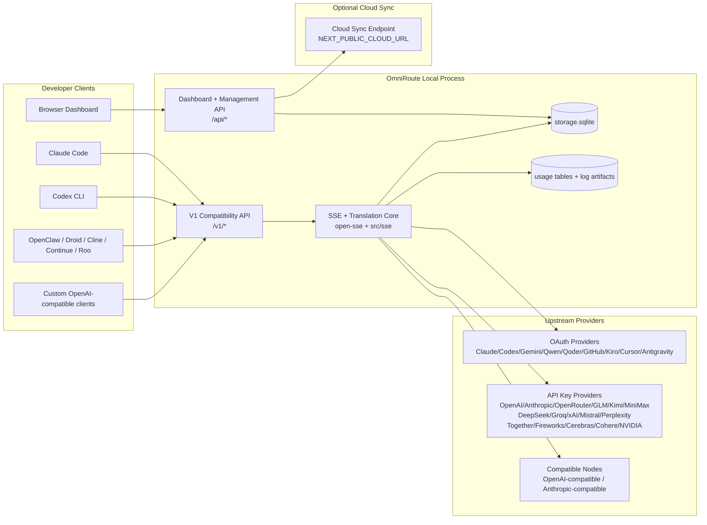
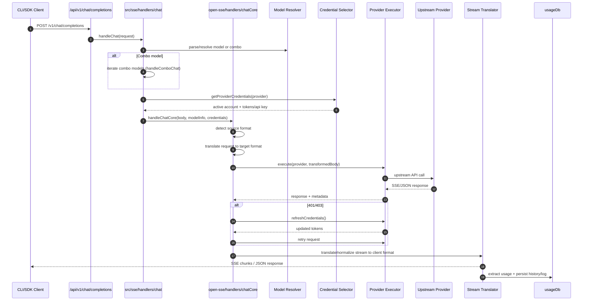
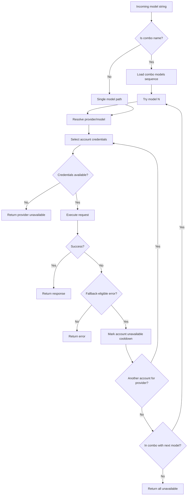
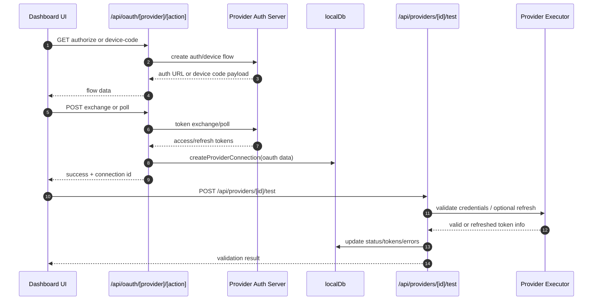
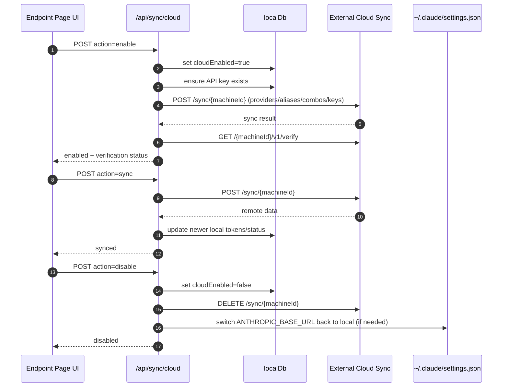
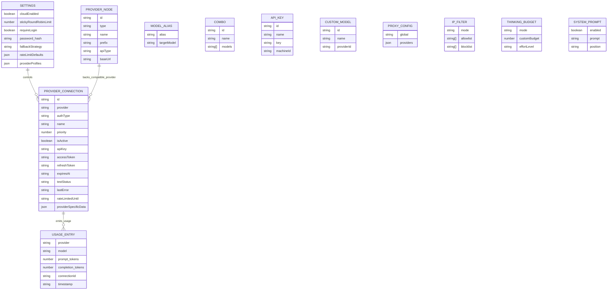
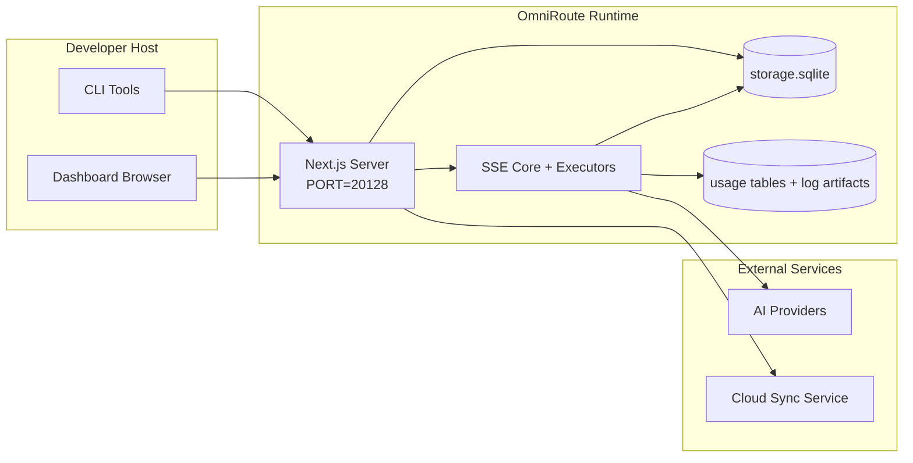

# OmniRoute Architecture (Magyar)

🌐 **Languages:** 🇺🇸 [English](../../../../docs/ARCHITECTURE.md) · 🇪🇸 [es](../../es/docs/ARCHITECTURE.md) · 🇫🇷 [fr](../../fr/docs/ARCHITECTURE.md) · 🇩🇪 [de](../../de/docs/ARCHITECTURE.md) · 🇮🇹 [it](../../it/docs/ARCHITECTURE.md) · 🇷🇺 [ru](../../ru/docs/ARCHITECTURE.md) · 🇨🇳 [zh-CN](../../zh-CN/docs/ARCHITECTURE.md) · 🇯🇵 [ja](../../ja/docs/ARCHITECTURE.md) · 🇰🇷 [ko](../../ko/docs/ARCHITECTURE.md) · 🇸🇦 [ar](../../ar/docs/ARCHITECTURE.md) · 🇮🇳 [hi](../../hi/docs/ARCHITECTURE.md) · 🇮🇳 [in](../../in/docs/ARCHITECTURE.md) · 🇹🇭 [th](../../th/docs/ARCHITECTURE.md) · 🇻🇳 [vi](../../vi/docs/ARCHITECTURE.md) · 🇮🇩 [id](../../id/docs/ARCHITECTURE.md) · 🇲🇾 [ms](../../ms/docs/ARCHITECTURE.md) · 🇳🇱 [nl](../../nl/docs/ARCHITECTURE.md) · 🇵🇱 [pl](../../pl/docs/ARCHITECTURE.md) · 🇸🇪 [sv](../../sv/docs/ARCHITECTURE.md) · 🇳🇴 [no](../../no/docs/ARCHITECTURE.md) · 🇩🇰 [da](../../da/docs/ARCHITECTURE.md) · 🇫🇮 [fi](../../fi/docs/ARCHITECTURE.md) · 🇵🇹 [pt](../../pt/docs/ARCHITECTURE.md) · 🇷🇴 [ro](../../ro/docs/ARCHITECTURE.md) · 🇭🇺 [hu](../../hu/docs/ARCHITECTURE.md) · 🇧🇬 [bg](../../bg/docs/ARCHITECTURE.md) · 🇸🇰 [sk](../../sk/docs/ARCHITECTURE.md) · 🇺🇦 [uk-UA](../../uk-UA/docs/ARCHITECTURE.md) · 🇮🇱 [he](../../he/docs/ARCHITECTURE.md) · 🇵🇭 [phi](../../phi/docs/ARCHITECTURE.md) · 🇧🇷 [pt-BR](../../pt-BR/docs/ARCHITECTURE.md) · 🇨🇿 [cs](../../cs/docs/ARCHITECTURE.md) · 🇹🇷 [tr](../../tr/docs/ARCHITECTURE.md)

---

_Utolsó frissítés: 2026-03-28_## Executive Summary

Az OmniRoute egy helyi mesterséges intelligencia-útválasztó átjáró és irányítópult, amely a Next.js-re épül.
Egyetlen OpenAI-kompatibilis végpontot (`/v1/*`) biztosít, és a forgalmat több upstream szolgáltató között irányítja át fordítással, tartalékkal, tokenfrissítéssel és használati követéssel.

Alapvető képességek:

- OpenAI-kompatibilis API felület a CLI-hez/eszközökhöz (28 szolgáltató)
- Fordítás kérése/válaszolása a szolgáltatói formátumok között
- Model kombinált tartalék (több modell sorozat)
- Fiókszintű tartalék (szolgáltatónként több fiók)
- OAuth + API-kulcs szolgáltatói kapcsolatkezelés
- Beágyazás generálása a „/v1/embeddings” fájlon keresztül (6 szolgáltató, 9 modell)
- Képgenerálás a `/v1/images/generations' fájlon keresztül (4 szolgáltató, 9 modell)
- Gondoljon a címkeelemzésre (`<think>...</think>`) az érvelési modellekhez
- Válasz fertőtlenítés a szigorú OpenAI SDK-kompatibilitás érdekében
- Szerepnormalizálás (fejlesztő→rendszer, rendszer→felhasználó) a szolgáltatók közötti kompatibilitás érdekében
- Strukturált kimenet átalakítás (json_schema → Gemini responseSchema)
- Helyi kitartás a szolgáltatók, kulcsok, álnevek, kombinációk, beállítások, árképzés számára
- Használat/költségkövetés és kérések naplózása
- Opcionális felhőszinkronizálás több eszköz/állapot szinkronizáláshoz
- IP engedélyezési/blokkolási lista API hozzáférés-vezérléshez
- Átgondolt költségvetés-kezelés (áthaladó/automatikus/egyéni/adaptív)
- Globális rendszer azonnali befecskendezése
- Munkamenet követés és ujjlenyomat
- Fiókonként továbbfejlesztett díjkorlátozás szolgáltató-specifikus profilokkal
- Megszakító minta a szolgáltatói rugalmasság érdekében
- Mennydörgés elleni állományvédelem mutex zárral
- Aláírás alapú kérés deduplikációs gyorsítótár
- Domain réteg: modell elérhetősége, költségszabályok, tartalék házirend, kizárási szabályzat
- Tartomány állapotának fennmaradása (SQLite átírási gyorsítótár tartalékok, költségvetések, zárolások, megszakítók számára)
- Házirend motor a kérelmek központosított értékeléséhez (zárás → költségvetés → tartalék)
- Telemetria kérése p50/p95/p99 késleltetési összesítéssel
- Korrelációs azonosító (X-Request-Id) a végpontok közötti nyomkövetéshez
- Megfelelőségi naplózás API-kulcsonkénti leiratkozással
- Eval keretrendszer az LLM minőségbiztosításhoz
- Rugalmas UI műszerfal valós idejű megszakító állapottal
- Moduláris OAuth-szolgáltatók (12 különálló modul az `src/lib/oauth/providers/` alatt)

Elsődleges futásidejű modell:

- A Next.js alkalmazásútvonalai az `src/app/api/*` alatt mind az irányítópult API-kat, mind a kompatibilitási API-kat megvalósítják
- Egy megosztott SSE/routing mag az `src/sse/*` + `open-sse/*` állományban kezeli a szolgáltató végrehajtását, fordítását, adatfolyamát, tartalékát és használatát## Scope and Boundaries

### In Scope

- Helyi átjáró futásidejű
- Irányítópult-kezelő API-k
- Szolgáltató hitelesítése és token frissítése
- Fordítás és SSE streaming kérése
- Helyi állapot + használat tartóssága
- Opcionális felhőszinkronizálás### Out of Scope

- Felhőszolgáltatás megvalósítása a `NEXT_PUBLIC_CLOUD_URL' mögött
- Szolgáltató SLA/vezérlő síkja a helyi folyamaton kívül
- Maguk a külső CLI binárisok (Claude CLI, Codex CLI stb.)## Dashboard Surface (Current)

Főoldalak az `src/app/(dashboard)/dashboard/` alatt:

- `/dashboard` — gyorsindítás + szolgáltató áttekintése
- "/dashboard/endpoint" - végpont proxy + MCP + A2A + API végpont lapjai
- "/dashboard/providers" – szolgáltatói kapcsolatok és hitelesítő adatok
- "/dashboard/combos" - kombinált stratégiák, sablonok, modell-útválasztási szabályok
- "/dashboard/costs" – a költségek összesítése és az árképzés láthatósága
- "/dashboard/analytics" — használati elemzések és kiértékelések
- "/dashboard/limits" – kvóta/kamat szabályozás
- "/dashboard/cli-tools" - CLI-beépítés, futásidejű észlelés, konfiguráció generálása
- "/dashboard/agents" — észlelt ACP ügynökök + egyéni ügynök regisztráció
- `/dashboard/media` — kép/videó/zene játszótér
- "/dashboard/search-tools" – a keresőszolgáltató tesztelése és előzményei
- "/dashboard/health" – üzemidő, megszakítók, sebességkorlátok
- "/dashboard/logs" — kérés/proxy/audit/konzolnaplók
- "/dashboard/settings" – rendszerbeállítások lapjai (általános, útválasztás, kombinált alapértelmezések stb.)
- `/dashboard/api-manager` – API kulcs életciklusa és modellengedélyei## High-Level System Context



## Core Runtime Components

## 1) API and Routing Layer (Next.js App Routes)

Fő könyvtárak:

- `src/app/api/v1/*` és `src/app/api/v1beta/*` a kompatibilitási API-khoz
- `src/app/api/*` a felügyeleti/konfigurációs API-khoz
- Következő átírja a `next.config.mjs` `/v1/*` leképezését `/api/v1/*`-re

Fontos kompatibilitási útvonalak:

- "src/app/api/v1/chat/completions/route.ts".
- `src/app/api/v1/messages/route.ts`
- `src/app/api/v1/responses/route.ts`
- "src/app/api/v1/models/route.ts" - egyéni modelleket tartalmaz "custom: true"
- "src/app/api/v1/embeddings/route.ts" - beágyazás generálása (6 szolgáltató)
- "src/app/api/v1/images/generations/route.ts" - képgenerálás (4+ szolgáltató, beleértve az Antigravitációt/Nebiust)
- `src/app/api/v1/messages/count_tokens/route.ts`
- "src/app/api/v1/providers/[provider]/chat/completions/route.ts" – dedikált szolgáltatónkénti csevegés
- "src/app/api/v1/providers/[szolgáltató]/embeddings/route.ts" – dedikált szolgáltatónkénti beágyazások
- "src/app/api/v1/providers/[szolgáltató]/images/generations/route.ts" – szolgáltatónként dedikált képek
- `src/app/api/v1beta/models/route.ts`
- `src/app/api/v1beta/models/[...útvonal]/route.ts`

Kezelési tartományok:

- Hitelesítés/beállítások: `src/app/api/auth/*`, `src/app/api/settings/*`
- Szolgáltatók/kapcsolatok: `src/app/api/providers*`
- Szolgáltatói csomópontok: `src/app/api/provider-nodes*`
- Egyéni modellek: "src/app/api/provider-models" (GET/POST/DELETE)
- Modellkatalógus: `src/app/api/models/route.ts` (GET)
- Proxy konfigurációja: "src/app/api/settings/proxy" (GET/PUT/DELETE) + "src/app/api/settings/proxy/test" (POST)
- OAuth: `src/app/api/oauth/*`
- Keys/aliases/combos/pricing: "src/app/api/keys*", "src/app/api/models/alias", "src/app/api/combos*", "src/app/api/pricing"
- Használat: `src/app/api/usage/*`
- Szinkronizálás/felhő: `src/app/api/sync/*`, `src/app/api/cloud/*`
- CLI-eszközök segédei: `src/app/api/cli-tools/*`
- IP-szűrő: "src/app/api/settings/ip-filter" (GET/PUT)
- Gondolkodási költségkeret: `src/app/api/settings/thinking-budget' (GET/PUT)
- Rendszerprompt: "src/app/api/settings/system-prompt" (GET/PUT)
- Munkamenetek: `src/app/api/sessions' (GET)
- Díjkorlátok: "src/app/api/rate-limits" (GET)
- Rugalmasság: "src/app/api/resilience" (GET/PATCH) – szolgáltatói profilok, megszakító, sebességkorlát állapot
- Rugalmasság visszaállítása: `src/app/api/resilience/reset' (POST) – megszakítók visszaállítása + lehűlés
- Gyorsítótár statisztikái: "src/app/api/cache/stats" (GET/DELETE)
- A modell elérhetősége: "src/app/api/models/availability" (GET/POST)
- Telemetria: "src/app/api/telemetry/summary" (GET)
- Költségkeret: `src/app/api/usage/budget' (GET/POST)
- Tartalék láncok: `src/app/api/fallback/chains' (GET/POST/DELETE)
- Megfelelőségi ellenőrzés: `src/app/api/compliance/audit-log' (GET)
- Evals: "src/app/api/evals" (GET/POST), "src/app/api/evals/[suiteId]" (GET)
- Irányelvek: `src/app/api/policies' (GET/POST)## 2) SSE + Translation Core

Fő áramlási modulok:

- Bejegyzés: `src/sse/handlers/chat.ts`
- Alapvető hangszerelés: "open-sse/handlers/chatCore.ts"
- Szolgáltató végrehajtási adapterei: `open-sse/executors/*`
- Formátumészlelés/szolgáltató konfigurációja: "open-sse/services/provider.ts"
- Modell parse/resolve: `src/sse/services/model.ts`, `open-sse/services/model.ts`
- A fiók tartalék logikája: `open-sse/services/accountFallback.ts`
- Fordítási nyilvántartás: "open-sse/translator/index.ts".
- Adatfolyam-átalakítások: "open-sse/utils/stream.ts", "open-sse/utils/streamHandler.ts"
- Használat kibontása/normalizálása: "open-sse/utils/usageTracking.ts"
- Think tag parser: `open-sse/utils/thinkTagParser.ts`
- Beágyazáskezelő: `open-sse/handlers/embeddings.ts`
- Beágyazási szolgáltató nyilvántartása: "open-sse/config/embeddingRegistry.ts"
- Képgeneráló kezelő: `open-sse/handlers/imageGeneration.ts`
- Képszolgáltató regisztrációs adatbázisa: `open-sse/config/imageRegistry.ts`
- A válaszok fertőtlenítése: "open-sse/handlers/responseSanitizer.ts"
- Szerepkör normalizálása: `open-sse/services/roleNormalizer.ts`

Szolgáltatások (üzleti logika):

- Fiókválasztás/pontozás: "open-sse/services/accountSelector.ts"
- Kontextus-életciklus-kezelés: `open-sse/services/contextManager.ts`
- IP-szűrő végrehajtása: `open-sse/services/ipFilter.ts`
- Munkamenetkövetés: `open-sse/services/sessionManager.ts`
- Deduplikáció kérése: "open-sse/services/signatureCache.ts"
- Rendszerprompt injekció: `open-sse/services/systemPrompt.ts`
- Gondolkodó költségvetés-kezelés: `open-sse/services/thinkingBudget.ts`
- Helyettesítő karakteres modell-útválasztás: "open-sse/services/wildcardRouter.ts"
- Díjkorlát kezelése: `open-sse/services/rateLimitManager.ts`
- Megszakító: "open-sse/services/circuitBreaker.ts"

Domain réteg modulok:

- A modell elérhetősége: `src/lib/domain/modelAvailability.ts`
- Költségszabályok/költségkeretek: `src/lib/domain/costRules.ts`
- Tartalék házirend: `src/lib/domain/fallbackPolicy.ts`
- Kombinált feloldó: `src/lib/domain/comboResolver.ts`
- Kizárási szabályzat: `src/lib/domain/lockoutPolicy.ts`
- Házirend motor: `src/domain/policyEngine.ts` — központosított zárolás → költségvetés → tartalék kiértékelés
- Hibakód-katalógus: "src/lib/domain/errorCodes.ts".
- Kérelemazonosító: `src/lib/domain/requestId.ts`
- Lekérési időtúllépés: `src/lib/domain/fetchTimeout.ts`
- Telemetria kérése: `src/lib/domain/requestTelemetry.ts`
- Megfelelőség/ellenőrzés: `src/lib/domain/compliance/index.ts`
- Eval runner: `src/lib/domain/evalRunner.ts`
- Tartomány állapotának fennmaradása: `src/lib/db/domainState.ts' — SQLite CRUD tartalék láncokhoz, költségvetésekhez, költségelőzményekhez, zárolási állapothoz, megszakítókhoz

OAuth-szolgáltató modulok (12 külön fájl az `src/lib/oauth/providers/` alatt):

- Registry index: `src/lib/oauth/providers/index.ts`
- Egyéni szolgáltatók: "claude.ts", "codex.ts", "gemini.ts", "antigravity.ts", "qoder.ts", "qwen.ts", "kimi-coding.ts", "github.ts", "kiro.ts", "codex". `cline.ts`
- Vékony burkolóanyag: `src/lib/oauth/providers.ts' – újraexportálás az egyes modulokból## 3) Persistence Layer

Elsődleges állapotú DB (SQLite):

- Alapvető infrastruktúra: `src/lib/db/core.ts` (better-sqlite3, migrációk, WAL)
- Homlokzat újraexportálása: "src/lib/localDb.ts" (vékony kompatibilitási réteg a hívók számára)
- fájl: `${DATA_DIR}/storage.sqlite` (vagy `$XDG_CONFIG_HOME/omniroute/storage.sqlite`, ha be van állítva, különben `~/.omniroute/storage.sqlite`)
- entitások (táblák + KV névterek): szolgáltatói kapcsolatok, szolgáltató csomópontok, modellálnevek, kombók, apiKeys, beállítások, árképzés,**customModels**,**proxyConfig**,**ipFilter**,**thhinkingBudget**,**systemPrompt**

Használat tartóssága:

- homlokzat: `src/lib/usageDb.ts` (bontott modulok az `src/lib/usage/*` fájlban)
- SQLite táblák a "storage.sqlite" fájlban: "használati_előzmények", "hívásnaplók", "proxy_naplók"
- az opcionális melléktermékek a kompatibilitáshoz/hibakereséshez maradnak (`${DATA_DIR}/log.txt`, `${DATA_DIR}/call_logs/`, `<repo>/logs/...`)
- A régebbi JSON-fájlokat a rendszer indítási migrációval költözteti az SQLite-ba, ha vannak

Domain State DB (SQLite):

- "src/lib/db/domainState.ts" - CRUD műveletek a tartomány állapotához
- Táblázatok (az "src/lib/db/core.ts" fájlban létrehozva): "domain_fallback_chains", "domain_budgets", "domain_cost_history", "domain_lockout_state", "domain_circuit_breakers"
- Átírási gyorsítótár minta: a memórián belüli térképek mérvadóak futás közben; a mutációk szinkronban íródnak az SQLite-ba; állapot visszaáll a DB-ből hidegindításkor## 4) Auth + Security Surfaces

- Az irányítópult cookie hitelesítése: "src/proxy.ts", "src/app/api/auth/login/route.ts"
- API-kulcs létrehozása/ellenőrzése: `src/shared/utils/apiKey.ts`
- A szolgáltatói titkok megmaradtak a "providerConnections" bejegyzésekben
- Kimenő proxy támogatása az "open-sse/utils/proxyFetch.ts" (env vars) és az "open-sse/utils/networkProxy.ts" segítségével (szolgáltatónként vagy globálisan konfigurálható)## 5) Cloud Sync

- Ütemező init: "src/lib/initCloudSync.ts", "src/shared/services/initializeCloudSync.ts", "src/shared/services/modelSyncScheduler.ts"
- Időszakos feladat: `src/shared/services/cloudSyncScheduler.ts`
- Időszakos feladat: `src/shared/services/modelSyncScheduler.ts`
- Útvonal vezérlése: "src/app/api/sync/cloud/route.ts"## Request Lifecycle (`/v1/chat/completions`)



## Combo + Account Fallback Flow



A tartalék döntéseket az `open-sse/services/accountFallback.ts` vezérli állapotkódok és hibaüzenet-heurisztika használatával. A kombinált útválasztás egy plusz védelmet ad: a szolgáltatói hatókörű 400-asokat, mint például az upstream tartalomblokkolás és a szerepérvényesítési hibák, modellhelyi hibákként kezelik, így a későbbi kombinált célok továbbra is futhatnak.## OAuth Onboarding and Token Refresh Lifecycle



Az élő forgalom alatti frissítés az `open-sse/handlers/chatCore.ts` fájlban, a `refreshCredentials()` végrehajtón keresztül történik.## Cloud Sync Lifecycle (Enable / Sync / Disable)



Az időszakos szinkronizálást a „CloudSyncScheduler” indítja el, ha a felhő engedélyezve van.## Data Model and Storage Map



Fizikai tároló fájlok:

- elsődleges futásidejű DB: `${DATA_DIR}/storage.sqlite`
- kérésnapló sorai: `${DATA_DIR}/log.txt` (kompat/debug melléktermék)
- Strukturált hívások hasznosadat-archívuma: `${DATA_DIR}/call_logs/`
- opcionális fordítói/hibakereső munkamenetek kérése: `<repo>/logs/...`## Deployment Topology



## Module Mapping (Decision-Critical)

### Route and API Modules

- `src/app/api/v1/*`, `src/app/api/v1beta/*`: kompatibilitási API-k
- `src/app/api/v1/providers/[szolgáltató]/\*: szolgáltatónként dedikált útvonalak (csevegés, beágyazások, képek)
- `src/app/api/providers*`: szolgáltató CRUD, érvényesítés, tesztelés
- `src/app/api/provider-nodes*`: egyéni kompatibilis csomópontkezelés
- "src/app/api/provider-models": egyéni modellkezelés (CRUD)
- "src/app/api/models/route.ts": modellkatalógus API (álnevek + egyéni modellek)
- `src/app/api/oauth/*`: OAuth/eszközkód folyamatok
- `src/app/api/keys*`: helyi API kulcs életciklusa
- `src/app/api/models/alias`: alias kezelése
- `src/app/api/combos*`: tartalék kombinált kezelés
- "src/app/api/pricing": az árképzés felülbírálása a költségszámításhoz
- "src/app/api/settings/proxy": proxykonfiguráció (GET/PUT/DELETE)
- "src/app/api/settings/proxy/test": kimenő proxykapcsolati teszt (POST)
- `src/app/api/usage/*`: használati és naplózási API-k
- `src/app/api/sync/*` + `src/app/api/cloud/*`: felhőszinkronizálás és felhő felé néző segítők
- `src/app/api/cli-tools/*`: helyi CLI konfigurációs írók/ellenőrzők
- "src/app/api/settings/ip-filter": IP engedélyezési lista/blokkolista (GET/PUT)
- "src/app/api/settings/thhinking-budget": gondolkodási jogkivonat költségvetési konfigurációja (GET/PUT)
- "src/app/api/settings/system-prompt": globális rendszerprompt (GET/PUT)
- "src/app/api/sessions": aktív munkamenet-lista (GET)
- "src/app/api/rate-limits": fiókonkénti kamatkorlát állapota (GET)### Routing and Execution Core

- `src/sse/handlers/chat.ts`: kéréselemzés, kombinált kezelés, fiókválasztó hurok
- "open-sse/handlers/chatCore.ts": fordítás, végrehajtó feladás, újrapróbálkozás/frissítés kezelése, adatfolyam beállítása
- `open-sse/executors/*`: szolgáltató-specifikus hálózat- és formátumviselkedés### Translation Registry and Format Converters

- "open-sse/translator/index.ts": fordítói nyilvántartás és hangszerelés
- Fordítók kérése: `open-sse/translator/request/*`
- Válasz fordítók: `open-sse/translator/response/*`
- Formátumkonstansok: `open-sse/translator/formats.ts`### Persistence

- `src/lib/db/*`: állandó konfiguráció/állapot és tartomány fennmaradása az SQLite-on
- `src/lib/localDb.ts`: DB modulok kompatibilitási újraexportálása
- `src/lib/usageDb.ts`: a használati előzmények/hívásnaplók homlokzata az SQLite táblák tetején## Provider Executor Coverage (Strategy Pattern)

Minden szolgáltató rendelkezik egy speciális végrehajtóval, amely kiterjeszti a „BaseExecutort” (az „open-sse/executors/base.ts” fájlban), amely URL-építést, fejléc-építést, újrapróbálkozást exponenciális visszalépéssel, hitelesítő adatok frissítését és az „execute()” hangszerelési metódust biztosítja.

| Végrehajtó            | Szolgáltató(k)                                                                                                                                               | Különleges kezelés                                                         |
| --------------------- | ------------------------------------------------------------------------------------------------------------------------------------------------------------ | -------------------------------------------------------------------------- |
| `DefaultExecutor`     | OpenAI, Claude, Gemini, Qwen, Qoder, OpenRouter, GLM, Kimi, MiniMax, DeepSeek, Groq, xAI, Mistral, Perplexity, Together, Fireworks, Cerebras, Cohere, NVIDIA | Dinamikus URL/fejléc konfiguráció szolgáltatónként                         |
| "AntigravityExecutor" | Google Antigravitáció                                                                                                                                        | Egyéni projekt/munkamenet azonosítók, Újrapróbálkozás-elemzés után         |
| "CodexExecutor"       | OpenAI Codex                                                                                                                                                 | Rendszerutasításokat szúr be, érvelési erőfeszítést kényszerít             |
| "CursorExecutor"      | Kurzor IDE                                                                                                                                                   | ConnectRPC protokoll, Protobuf kódolás, kérés aláírása ellenőrző összeggel |
| "GithubExecutor"      | GitHub másodpilóta                                                                                                                                           | Másodpilóta token frissítése, VSCode-utánzó fejlécek                       |
| "KiroExecutor"        | AWS CodeWhisperer/Kiro                                                                                                                                       | AWS EventStream bináris formátum → SSE konverzió                           |
| "GeminiCLIExecutor"   | Gemini CLI                                                                                                                                                   | Google OAuth-token frissítési ciklus                                       |

Minden más szolgáltató (beleértve az egyéni kompatibilis csomópontokat is) a "DefaultExecutor"-t használja.## Provider Compatibility Matrix

| Szolgáltató        | Formátum         | Auth                      | Stream             | Nem adatfolyam | Token Refresh | Használati API            |
| ------------------ | ---------------- | ------------------------- | ------------------ | -------------- | ------------- | ------------------------- | ------------------------------ |
| Claude             | claude           | API kulcs / OAuth         | ✅                 | ✅             | ✅            | ⚠️ Csak adminisztrátor    |
| Ikrek              | ikrek            | API kulcs / OAuth         | ✅                 | ✅             | ✅            | ⚠️ Cloud Console          |
| Gemini CLI         | gemini-cli       | OAuth                     | ✅                 | ✅             | ✅            | ⚠️ Cloud Console          |
| Antigravitáció     | antigravitáció   | OAuth                     | ✅                 | ✅             | ✅            | ✅ Teljes kvóta API       |
| OpenAI             | openai           | API kulcs                 | ✅                 | ✅             | ❌            | ❌                        |
| Codex              | openai-responses | OAuth                     | ✅ kényszer        | ❌             | ✅            | ✅ Díjkorlátok            |
| GitHub másodpilóta | openai           | OAuth + másodpilóta token | ✅                 | ✅             | ✅            | ✅ Kvóta pillanatképek    |
| Kurzor             | kurzor           | Egyéni ellenőrző összeg   | ✅                 | ✅             | ❌            | ❌                        |
| Kiro               | kiro             | AWS SSO OIDC              | ✅ (Eseményfolyam) | ❌             | ✅            | ✅ Felhasználási korlátok |
| Qwen               | openai           | OAuth                     | ✅                 | ✅             | ✅            | ⚠️ Kérésre                |
| Qoder              | openai           | OAuth (alap)              | ✅                 | ✅             | ✅            | ⚠️ Kérésre                |
| OpenRouter         | openai           | API kulcs                 | ✅                 | ✅             | ❌            | ❌                        |
| GLM/Kimi/MiniMax   | claude           | API kulcs                 | ✅                 | ✅             | ❌            | ❌                        |
| DeepSeek           | openai           | API kulcs                 | ✅                 | ✅             | ❌            | ❌                        |
| Groq               | openai           | API kulcs                 | ✅                 | ✅             | ❌            | ❌                        |
| xAI (Grok)         | openai           | API kulcs                 | ✅                 | ✅             | ❌            | ❌                        |
| Mistral            | openai           | API kulcs                 | ✅                 | ✅             | ❌            | ❌                        |
| Zavartság          | openai           | API kulcs                 | ✅                 | ✅             | ❌            | ❌                        |
| Együtt AI          | openai           | API kulcs                 | ✅                 | ✅             | ❌            | ❌                        |
| Tűzijáték AI       | openai           | API kulcs                 | ✅                 | ✅             | ❌            | ❌                        |
| Cerebrák           | openai           | API kulcs                 | ✅                 | ✅             | ❌            | ❌                        |
| Cohere             | openai           | API kulcs                 | ✅                 | ✅             | ❌            | ❌                        |
| NVIDIA NIM         | openai           | API kulcs                 | ✅                 | ✅             | ❌            | ❌                        | ## Format Translation Coverage |

Az észlelt forrásformátumok a következők:

- "openai".
- "Openai-responses".
- `claude`
- "ikrek".

A célformátumok a következők:

- OpenAI chat/válaszok
- Claude
- Gemini/Gemini-CLI/Antigravitációs boríték
- Kiro
- Kurzor

A fordítások az**OpenAI-t használják hub-formátumként**– minden konverzió köztesként az OpenAI-n megy keresztül:```
Source Format → OpenAI (hub) → Target Format

````

A fordítások kiválasztása dinamikusan történik a forrás hasznos adat alakja és a szolgáltató célformátuma alapján.

További feldolgozási rétegek a fordítási folyamatban:

-**Választisztítás**– Megszünteti a nem szabványos mezőket az OpenAI-formátumú válaszoktól (mind az adatfolyam-, mind a nem adatfolyam-küldéstől) a szigorú SDK-megfelelőség biztosítása érdekében
-**Szerepkör normalizálása**— Átalakítja a "fejlesztő" → "rendszert" nem OpenAI-célokhoz; egyesíti a "rendszer" → "felhasználó" paramétert a rendszerszerepkört elutasító modellekhez (GLM, ERNIE)
-**Think címke kivonatolás**– A tartalomból a `<think>...</think>` blokkokat elemzi a `reasoning_content` mezőbe
-**Strukturált kimenet**- Az OpenAI `response_format.json_schema`-t a Gemini `responseMimeType` + `responseSchema`-jává alakítja## Supported API Endpoints

| Végpont | Formátum | Kezelő |
| --------------------------------------------------- | ------------------- | -------------------------------------------------------------------- |
| `POST /v1/chat/completions` | OpenAI Chat | `src/sse/handlers/chat.ts` |
| `POST /v1/messages` | Claude Üzenetek | Ugyanaz a kezelő (automatikusan észlelve) |
| `POST /v1/responses` | OpenAI válaszok | `open-sse/handlers/responsesHandler.ts` |
| `POST /v1/embeddings` | OpenAI beágyazások | `open-sse/handlers/embeddings.ts` |
| `GET /v1/embeddings` | Modell lista | API útvonal |
| `POST /v1/images/generations` | OpenAI Images | `open-sse/handlers/imageGeneration.ts` |
| `GET /v1/images/generations` | Modell lista | API útvonal |
| `POST /v1/providers/{provider}/chat/completions` | OpenAI Chat | Dedikált szolgáltatónként modellellenőrzéssel |
| `POST /v1/providers/{provider}/embeddings` | OpenAI beágyazások | Dedikált szolgáltatónként modellellenőrzéssel |
| `POST /v1/providers/{provider}/images/generations` | OpenAI Images | Dedikált szolgáltatónként modellellenőrzéssel |
| `POST /v1/messages/count_tokens` | Claude Token Count | API útvonal |
| `GET /v1/models` | OpenAI modellek listája | API útvonal (csevegés + beágyazás + kép + egyéni modellek) |
| `GET /api/models/catalog` | Katalógus | Minden modell szolgáltató + típus szerint csoportosítva |
| `POST /v1beta/models/*:streamGenerateContent` | Ikrek bennszülött | API route                                                           |
| `GET/PUT/DELETE /api/settings/proxy` | Proxy konfiguráció | Hálózati proxy konfiguráció |
| `POST /api/settings/proxy/test` | Proxy kapcsolat | Proxy állapot/kapcsolati teszt végpontja |
| `GET/POST/DELETE /api/provider-models` | Szolgáltatói modellek | A szolgáltatói modell metaadatainak háttere egyéni és felügyelt elérhető modellek |## Bypass Handler

A bypass kezelő (`open-sse/utils/bypassHandler.ts`) elfogja a Claude CLI ismert "kidobási" kéréseit – bemelegítő pingeket, címkivonatokat és tokenszámlálásokat –, és**hamis választ**ad vissza anélkül, hogy felemészti a szolgáltatói tokeneket. Ez csak akkor aktiválódik, ha a „User-Agent” tartalmazza a „claude-cli”-t.## Request Logger Pipeline

A kérésnaplózó (`open-sse/utils/requestLogger.ts`) egy 7 szakaszból álló hibakeresési naplózási folyamatot biztosít, amely alapértelmezés szerint le van tiltva, és az `ENABLE_REQUEST_LOGS=true` paraméterrel engedélyezve van:```
1_req_client.json → 2_req_source.json → 3_req_openai.json → 4_req_target.json
→ 5_res_provider.txt → 6_res_openai.txt → 7_res_client.txt
````

A fájlok a `<repo>/logs/<session>/` mappába íródnak minden egyes kérési munkamenethez.## Failure Modes and Resilience

## 1) Account/Provider Availability

- szolgáltatói fiók lehűtése tranziens/sebesség/hitelesítési hibák esetén
- tartalék fiók a sikertelen kérés előtt
- kombinált modell tartalék, ha az aktuális modell/szolgáltató elérési útja kimerült## 2) Token Expiry

- Előzetes ellenőrzés és frissítés újrapróbálkozással a frissíthető szolgáltatóknál
- 401/403 újrapróbálkozás frissítési kísérlet után az alapútvonalon## 3) Stream Safety

- leválasztást érzékelő streamvezérlő
- fordítási adatfolyam a folyamvégi öblítéssel és `[KÉSZ]` kezeléssel
- a használati becslés tartaléka, ha hiányoznak a szolgáltató használati metaadatai## 4) Cloud Sync Degradation

- szinkronizálási hibák jelennek meg, de a helyi futásidő folytatódik
- Az ütemező rendelkezik újrapróbálkozásra alkalmas logikával, de az időszakos végrehajtás jelenleg alapértelmezés szerint egykísérletű szinkronizálást hív meg## 5) Data Integrity

- SQLite schema migrations and auto-upgrade hooks at startup
- örökölt JSON → SQLite migrációs kompatibilitási útvonal## Observability and Operational Signals

Runtime visibility sources:

- konzolnaplók innen: `src/sse/utils/logger.ts`
- kérésenkénti használati aggregátumok az SQLite-ban (`usage_history`, `call_logs`, `proxy_logs`)
- négylépcsős részletes hasznos adatrögzítés az SQLite-ben (`request_detail_logs`), amikor a `settings.detailed_logs_enabled=true`
- szöveges kérés állapotnaplózása a `log.txt' fájlban (opcionális/kompat)
- opcionális mélykérési/fordítási naplók a "logs/" alatt, ha "ENABLE_REQUEST_LOGS=true"
- irányítópult-használati végpontok (`/api/usage/*`) a felhasználói felület felhasználásához

A részletes kérés hasznos adatrögzítése irányított hívásonként legfeljebb négy JSON-adatterhelési szakaszt tárol:

- nyers kérés érkezett az ügyféltől
- a lefordított kérés ténylegesen felfelé küldve
- a szolgáltatói válasz JSON-ként rekonstruálva; a streamelt válaszokat a végső összefoglalóba és az adatfolyam metaadataiba tömörítik
- az OmniRoute által visszaküldött végső ügyfélválasz; a streamelt válaszokat ugyanabban a tömör összefoglaló formában tároljuk## Security-Sensitive Boundaries

- A JWT titkos (`JWT_SECRET`) biztosítja az irányítópult munkamenet-cookie-ellenőrzését/aláírását
- A kezdeti jelszó-betöltést (`INITIAL_PASSWORD`) kifejezetten be kell állítani az első futtatáshoz
- API kulcs HMAC titkos (`API_KEY_SECRET`) biztosítja a generált helyi API kulcs formátumot
- A szolgáltatói titkok (API-kulcsok/tokenek) megmaradnak a helyi adatbázisban, és fájlrendszer-szinten védeni kell őket
- A felhőszinkronizálási végpontok API kulcs hitelesítés + gépazonosító szemantikára támaszkodnak## Environment and Runtime Matrix

A kód által aktívan használt környezeti változók:

- Alkalmazás/hitelesítés: "JWT_SECRET", "INITIAL_PASSWORD"
- Tárhely: `DATA_DIR`
- Kompatibilis csomópont viselkedése: `ALLOW_MULTI_CONNECTIONS_PER_COMPAT_NODE`
- Opcionális tárhely-alap-felülírás (Linux/macOS, ha a "DATA_DIR" nincs beállítva): "XDG_CONFIG_HOME"
- Biztonsági kivonat: `API_KEY_SECRET`, `MACHINE_ID_SALT`
- Naplózás: `ENABLE_REQUEST_LOGS`
- Szinkronizálás/felhő URL-elés: `NEXT_PUBLIC_BASE_URL`, `NEXT_PUBLIC_CLOUD_URL`
- Kimenő proxy: "HTTP_PROXY", "HTTPS_PROXY", "ALL_PROXY", "NO_PROXY" és kisbetűs változatai
- SOCKS5 funkciójelzők: "ENABLE_SOCKS5_PROXY", "NEXT_PUBLIC_ENABLE_SOCKS5_PROXY"
- Platform/futásidejű segítők (nem alkalmazás-specifikus konfiguráció): "APPDATA", "NODE_ENV", "PORT", "HOSTNAME"## Known Architectural Notes

1. A `usageDb` és a `localDb` ugyanazon az alapkönyvtár-házirenden (`DATA_DIR` -> `XDG_CONFIG_HOME/omniroute` -> `~/.omniroute`) osztozik a régi fájlmigrációval.
2. Az `/api/v1/route.ts' ugyanahhoz az egyesített katalóguskészítőhöz delegálódik, amelyet a `/api/v1/models' (`src/app/api/v1/models/catalog.ts`) használ a szemantikai eltolódás elkerülése érdekében.
3. A kérésnaplózó teljes fejlécet/törzsöt ír, ha engedélyezve van; a naplókönyvtárat érzékenyként kezeli.
4. A felhő viselkedése a helyes "NEXT_PUBLIC_BASE_URL" és a felhő-végpont elérhetőségétől függ.
5. Az `open-sse/` könyvtár `@omniroute/open-sse`**npm munkaterület-csomagként**kerül közzétételre. A forráskód az `@omniroute/open-sse/...` (a Next.js `transpilePackages`) segítségével importálja. A dokumentum elérési útjai továbbra is az `open-sse/` könyvtárnevet használják a következetesség érdekében.
6. Az irányítópulton lévő diagramok**Újragrafikonokat**(SVG-alapú) használnak az elérhető, interaktív analitikai vizualizációkhoz (modellhasználati sávdiagramok, szolgáltatói bontási táblázatok sikerarányokkal).
7. Az E2E-tesztek a**Playwright**-ot használják (`tests/e2e/`), az `npm run test:e2e`-n keresztül futnak. Az egységtesztek a**Node.js tesztfutót**(`tests/unit/`) használják, az `npm run test:unit` segítségével futnak. Az `src/` alatti forráskód**TypeScript**(`.ts`/`.tsx`); az `open-sse/` munkaterület továbbra is JavaScript (`.js`).
8. A Beállítások oldal 5 lapra van felosztva: Biztonság, Útválasztás (6 globális stratégia: kitöltés-első, kör-robin, p2c, véletlenszerű, legkevésbé használt, költségoptimalizált), Rugalmasság (szerkeszthető sebességkorlátok, megszakító, házirendek), AI (gondolkodó költségvetés, rendszerkérdés, gyorsítótár), Speciális (proxy).## Operational Verification Checklist

- Build forrásból: `npm run build`
- Build Docker kép: `docker build -t omniroute .`
- Indítsa el a szervizt és ellenőrizze:
- `GET /api/settings`
- `GET /api/v1/models`
- A CLI cél alap URL-jének `http://<host>:20128/v1` kell lennie, ha `PORT=20128`
