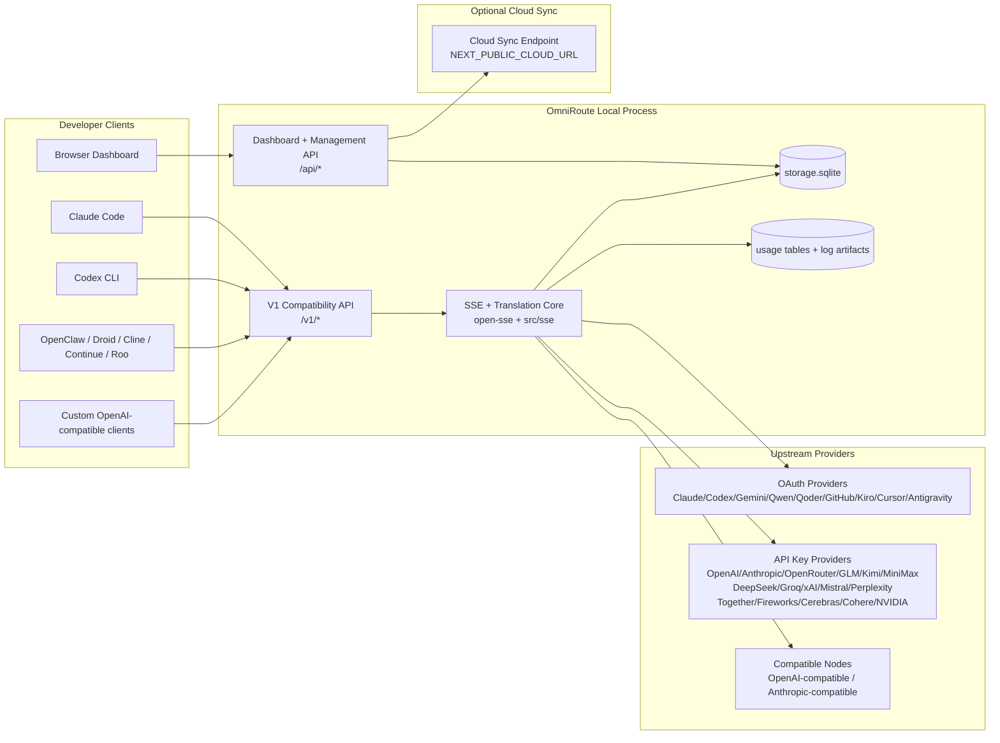
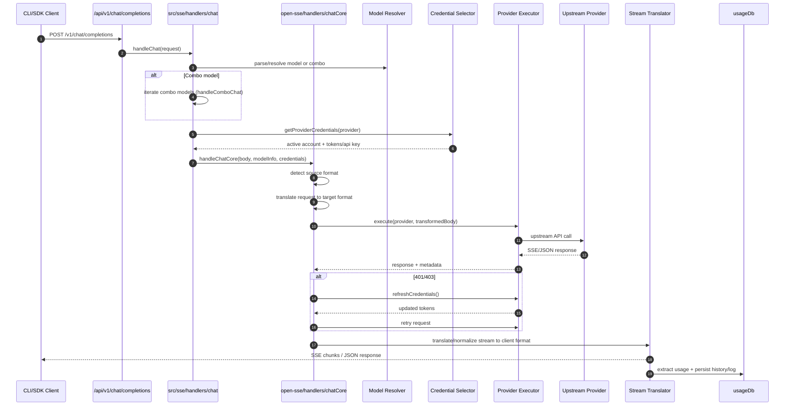
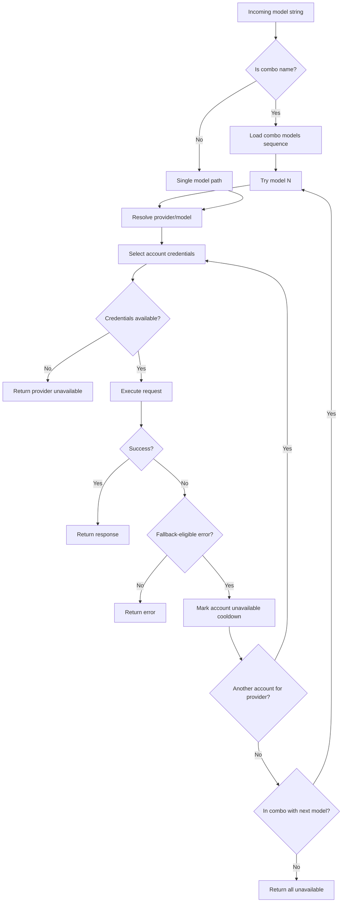
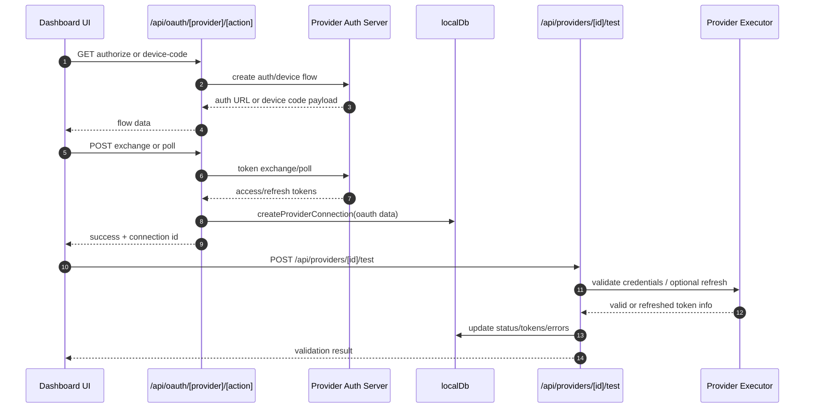
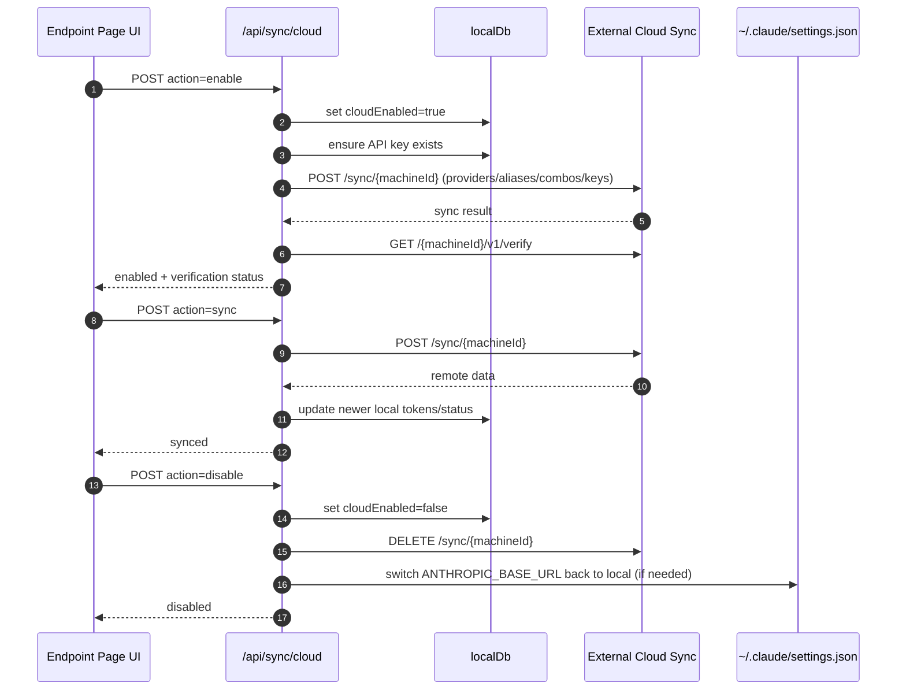
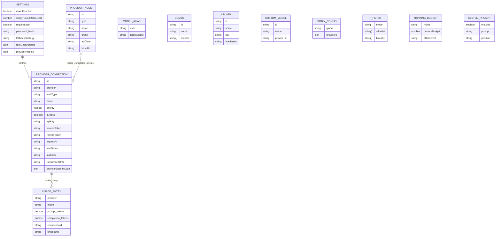
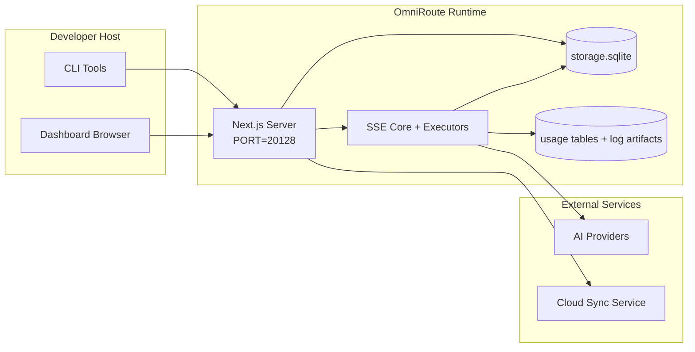

# OmniRoute Architecture (Bahasa Indonesia)

🌐 **Languages:** 🇺🇸 [English](../../../../docs/ARCHITECTURE.md) · 🇪🇸 [es](../../es/docs/ARCHITECTURE.md) · 🇫🇷 [fr](../../fr/docs/ARCHITECTURE.md) · 🇩🇪 [de](../../de/docs/ARCHITECTURE.md) · 🇮🇹 [it](../../it/docs/ARCHITECTURE.md) · 🇷🇺 [ru](../../ru/docs/ARCHITECTURE.md) · 🇨🇳 [zh-CN](../../zh-CN/docs/ARCHITECTURE.md) · 🇯🇵 [ja](../../ja/docs/ARCHITECTURE.md) · 🇰🇷 [ko](../../ko/docs/ARCHITECTURE.md) · 🇸🇦 [ar](../../ar/docs/ARCHITECTURE.md) · 🇮🇳 [hi](../../hi/docs/ARCHITECTURE.md) · 🇮🇳 [in](../../in/docs/ARCHITECTURE.md) · 🇹🇭 [th](../../th/docs/ARCHITECTURE.md) · 🇻🇳 [vi](../../vi/docs/ARCHITECTURE.md) · 🇮🇩 [id](../../id/docs/ARCHITECTURE.md) · 🇲🇾 [ms](../../ms/docs/ARCHITECTURE.md) · 🇳🇱 [nl](../../nl/docs/ARCHITECTURE.md) · 🇵🇱 [pl](../../pl/docs/ARCHITECTURE.md) · 🇸🇪 [sv](../../sv/docs/ARCHITECTURE.md) · 🇳🇴 [no](../../no/docs/ARCHITECTURE.md) · 🇩🇰 [da](../../da/docs/ARCHITECTURE.md) · 🇫🇮 [fi](../../fi/docs/ARCHITECTURE.md) · 🇵🇹 [pt](../../pt/docs/ARCHITECTURE.md) · 🇷🇴 [ro](../../ro/docs/ARCHITECTURE.md) · 🇭🇺 [hu](../../hu/docs/ARCHITECTURE.md) · 🇧🇬 [bg](../../bg/docs/ARCHITECTURE.md) · 🇸🇰 [sk](../../sk/docs/ARCHITECTURE.md) · 🇺🇦 [uk-UA](../../uk-UA/docs/ARCHITECTURE.md) · 🇮🇱 [he](../../he/docs/ARCHITECTURE.md) · 🇵🇭 [phi](../../phi/docs/ARCHITECTURE.md) · 🇧🇷 [pt-BR](../../pt-BR/docs/ARCHITECTURE.md) · 🇨🇿 [cs](../../cs/docs/ARCHITECTURE.md) · 🇹🇷 [tr](../../tr/docs/ARCHITECTURE.md)

---

_Terakhir diperbarui: 28-03-2026_## Executive Summary

OmniRoute adalah gateway dan dasbor perutean AI lokal yang dibangun di Next.js.
Ini menyediakan satu titik akhir yang kompatibel dengan OpenAI (`/v1/*`) dan merutekan lalu lintas di beberapa penyedia upstream dengan terjemahan, fallback, penyegaran token, dan pelacakan penggunaan.

Kemampuan inti:

- Permukaan API yang kompatibel dengan OpenAI untuk CLI/alat (28 penyedia)
- Permintaan/tanggapan terjemahan lintas format penyedia
- Model kombo fallback (urutan multi-model)
- Penggantian tingkat akun (multi-akun per penyedia)
- Manajemen koneksi penyedia kunci OAuth + API
- Menyematkan generasi melalui `/v1/embeddings` (6 penyedia, 9 model)
- Pembuatan gambar melalui `/v1/images/generasi` (4 penyedia, 9 model)
- Penguraian tag Think (`<think>...</think>`) untuk model penalaran
- Sanitasi respons untuk kompatibilitas OpenAI SDK yang ketat
- Normalisasi peran (pengembang→sistem, sistem→pengguna) untuk kompatibilitas lintas penyedia
- Konversi keluaran terstruktur (json_schema → Gemini responSchema)
- Persistensi lokal untuk penyedia, kunci, alias, kombo, pengaturan, harga
- Pelacakan penggunaan/biaya dan pencatatan permintaan
- Sinkronisasi cloud opsional untuk sinkronisasi multi-perangkat/negara
- Daftar IP yang diizinkan/daftar blokir untuk kontrol akses API
- Memikirkan manajemen anggaran (passthrough/otomatis/custom/adaptif)
- Injeksi cepat sistem global
- Pelacakan sesi dan sidik jari
- Pembatasan tarif yang ditingkatkan per akun dengan profil khusus penyedia
- Pola pemutus sirkuit untuk ketahanan penyedia
- Perlindungan kawanan anti guntur dengan penguncian mutex
- Cache deduplikasi permintaan berbasis tanda tangan
- Lapisan domain: ketersediaan model, aturan biaya, kebijakan fallback, kebijakan lockout
- Persistensi status domain (cache tulis SQLite untuk fallback, anggaran, penguncian, pemutus sirkuit)
- Mesin kebijakan untuk evaluasi permintaan terpusat (lockout → anggaran → fallback)
- Minta telemetri dengan agregasi latensi p50/p95/p99
- ID Korelasi (X-Request-Id) untuk penelusuran ujung ke ujung
- Pencatatan audit kepatuhan dengan opt-out per kunci API
- Kerangka evaluasi untuk penjaminan mutu LLM
- Dasbor UI ketahanan dengan status pemutus sirkuit waktu nyata
- Penyedia OAuth modular (12 modul individual di bawah `src/lib/oauth/providers/`)

Model waktu proses utama:

- Rute aplikasi Next.js di bawah `src/app/api/*` mengimplementasikan API dasbor dan API kompatibilitas
- Inti SSE/perutean bersama di `src/sse/*` + `open-sse/*` menangani eksekusi penyedia, terjemahan, streaming, fallback, dan penggunaan## Scope and Boundaries

### In Scope

- Waktu aktif gateway lokal
- API manajemen dasbor
- Otentikasi penyedia dan penyegaran token
- Minta terjemahan dan streaming SSE
- Status lokal + persistensi penggunaan
- Orkestrasi sinkronisasi cloud opsional### Out of Scope

- Implementasi layanan cloud di belakang `NEXT_PUBLIC_CLOUD_URL`
- Penyedia SLA/bidang kontrol di luar proses lokal
- Biner CLI eksternal itu sendiri (Claude CLI, Codex CLI, dll.)## Dashboard Surface (Current)

Halaman utama di bawah `src/app/(dashboard)/dashboard/`:

- `/dasbor` — mulai cepat + ikhtisar penyedia
- `/dashboard/endpoint` — proksi titik akhir + MCP + A2A + tab titik akhir API
- `/dashboard/providers` — koneksi dan kredensial penyedia
- `/dashboard/combos` — strategi kombo, templat, aturan perutean model
- `/dashboard/cost` — agregasi biaya dan visibilitas harga
- `/dashboard/analytics` — analisis dan evaluasi penggunaan
- `/dasbor/batas` — kontrol kuota/tarif
- `/dashboard/cli-tools` — Orientasi CLI, deteksi runtime, pembuatan konfigurasi
- `/dashboard/agents` — mendeteksi agen ACP + pendaftaran agen khusus
- `/dasbor/media` — taman bermain gambar/video/musik
- `/dashboard/search-tools` — pengujian dan riwayat penyedia pencarian
- `/dasbor/kesehatan` — waktu aktif, pemutus sirkuit, batas kecepatan
- `/dashboard/logs` — log permintaan/proksi/audit/konsol
- `/dashboard/settings` — tab pengaturan sistem (umum, perutean, default kombo, dll.)
- `/dashboard/api-manager` — siklus hidup kunci API dan izin model## High-Level System Context



## Core Runtime Components

## 1) API and Routing Layer (Next.js App Routes)

Direktori utama:

- `src/app/api/v1/*` dan `src/app/api/v1beta/*` untuk API kompatibilitas
- `src/app/api/*` untuk API manajemen/konfigurasi
- Selanjutnya penulisan ulang di `next.config.mjs` peta `/v1/*` menjadi `/api/v1/*`

Rute kompatibilitas penting:

- `src/app/api/v1/chat/completions/route.ts`
- `src/app/api/v1/messages/route.ts`
- `src/app/api/v1/responses/route.ts`
- `src/app/api/v1/models/route.ts` — menyertakan model khusus dengan `custom: true`
- `src/app/api/v1/embeddings/route.ts` — pembuatan penyematan (6 penyedia)
- `src/app/api/v1/images/generasi/route.ts` — pembuatan gambar (4+ penyedia termasuk Antigravity/Nebius)
- `src/app/api/v1/messages/count_tokens/route.ts`
- `src/app/api/v1/providers/[provider]/chat/completions/route.ts` — obrolan khusus per penyedia
- `src/app/api/v1/providers/[provider]/embeddings/route.ts` — penyematan khusus per penyedia
- `src/app/api/v1/providers/[provider]/images/generasi/route.ts` — gambar khusus per penyedia
- `src/app/api/v1beta/models/route.ts`
- `src/app/api/v1beta/models/[...path]/route.ts`

Domain manajemen:

- Otentikasi/pengaturan: `src/app/api/auth/*`, `src/app/api/settings/*`
- Penyedia/koneksi: `src/app/api/providers*`
- Node penyedia: `src/app/api/provider-nodes*`
- Model khusus: `src/app/api/provider-models` (GET/POST/DELETE)
- Katalog model: `src/app/api/models/route.ts` (GET)
- Konfigurasi proxy: `src/app/api/settings/proxy` (GET/PUT/DELETE) + `src/app/api/settings/proxy/test` (POST)
- OAuth: `src/app/api/oauth/*`
- Kunci/alias/combos/pricing: `src/app/api/keys*`, `src/app/api/models/alias`, `src/app/api/combos*`, `src/app/api/pricing`
- Penggunaan: `src/app/api/usage/*`
- Sinkronisasi/cloud: `src/app/api/sync/*`, `src/app/api/cloud/*`
- Pembantu perkakas CLI: `src/app/api/cli-tools/*`
- Filter IP: `src/app/api/settings/ip-filter` (GET/PUT)
- Memikirkan anggaran: `src/app/api/settings/thinking-budget` (GET/PUT)
- Perintah sistem: `src/app/api/settings/system-prompt` (GET/PUT)
- Sesi: `src/app/api/sessions` (GET)
- Batas tarif: `src/app/api/rate-limits` (GET)
- Ketahanan: `src/app/api/resilience` (GET/PATCH) — profil penyedia, pemutus sirkuit, status batas kecepatan
- Reset ketahanan: `src/app/api/resilience/reset` (POST) — reset pemutus + cooldown
- Statistik cache: `src/app/api/cache/stats` (DAPATKAN/HAPUS)
- Ketersediaan model: `src/app/api/models/availability` (GET/POST)
- Telemetri: `src/app/api/telemetri/ringkasan` (GET)
- Anggaran: `src/app/api/usage/budget` (GET/POST)
- Rantai cadangan: `src/app/api/fallback/chains` (GET/POST/DELETE)
- Audit kepatuhan: `src/app/api/compliance/audit-log` (GET)
- Evaluasi: `src/app/api/evals` (GET/POST), `src/app/api/evals/[suiteId]` (GET)
- Kebijakan: `src/app/api/policies` (GET/POST)## 2) SSE + Translation Core

Modul aliran utama:

- Entri: `src/sse/handlers/chat.ts`
- Orkestrasi inti: `open-sse/handlers/chatCore.ts`
- Adaptor eksekusi penyedia: `open-sse/executors/*`
- Deteksi format/konfigurasi penyedia: `open-sse/services/provider.ts`
- Penguraian/penyelesaian model: `src/sse/services/model.ts`, `open-sse/services/model.ts`
- Logika penggantian akun: `open-sse/services/accountFallback.ts`
- Registri terjemahan: `open-sse/translator/index.ts`
- Transformasi aliran: `open-sse/utils/stream.ts`, `open-sse/utils/streamHandler.ts`
- Ekstraksi/normalisasi penggunaan: `open-sse/utils/usageTracking.ts`
- Pikirkan pengurai tag: `open-sse/utils/thinkTagParser.ts`
- Pengendali penyematan: `open-sse/handlers/embeddings.ts`
- Menyematkan registri penyedia: `open-sse/config/embeddingRegistry.ts`
- Pengendali pembuatan gambar: `open-sse/handlers/imageGeneration.ts`
- Registri penyedia gambar: `open-sse/config/imageRegistry.ts`
- Sanitasi respons: `open-sse/handlers/responseSanitizer.ts`
- Normalisasi peran: `open-sse/services/roleNormalizer.ts`

Layanan (logika bisnis):

- Pemilihan/penilaian akun: `open-sse/services/accountSelector.ts`
- Manajemen siklus hidup konteks: `open-sse/services/contextManager.ts`
- Penegakan filter IP: `open-sse/services/ipFilter.ts`
- Pelacakan sesi: `open-sse/services/sessionManager.ts`
- Minta deduplikasi: `open-sse/services/signatureCache.ts`
- Injeksi cepat sistem: `open-sse/services/systemPrompt.ts`
- Berpikir manajemen anggaran: `open-sse/services/thinkingBudget.ts`
- Perutean model wildcard: `open-sse/services/wildcardRouter.ts`
- Manajemen batas tarif: `open-sse/services/rateLimitManager.ts`
- Pemutus sirkuit: `open-sse/services/circirBreaker.ts`

Modul lapisan domain:

- Ketersediaan model: `src/lib/domain/modelAvailability.ts`
- Aturan/anggaran biaya: `src/lib/domain/costRules.ts`
- Kebijakan cadangan: `src/lib/domain/fallbackPolicy.ts`
- Penyelesai kombo: `src/lib/domain/comboResolver.ts`
- Kebijakan penguncian: `src/lib/domain/lockoutPolicy.ts`
- Mesin kebijakan: `src/domain/policyEngine.ts` — penguncian terpusat → anggaran → evaluasi cadangan
- Katalog kode kesalahan: `src/lib/domain/errorCodes.ts`
- ID Permintaan: `src/lib/domain/requestId.ts`
- Batas waktu pengambilan: `src/lib/domain/fetchTimeout.ts`
- Permintaan telemetri: `src/lib/domain/requestTelemetry.ts`
- Kepatuhan/audit: `src/lib/domain/compliance/index.ts`
- Pelari evaluasi: `src/lib/domain/evalRunner.ts`
- Persistensi status domain: `src/lib/db/domainState.ts` — SQLite CRUD untuk rantai fallback, anggaran, riwayat biaya, status lockout, pemutus sirkuit

Modul penyedia OAuth (12 file individual di bawah `src/lib/oauth/providers/`):

- Indeks registri: `src/lib/oauth/providers/index.ts`
- Penyedia individu: `claude.ts`, `codex.ts`, `gemini.ts`, `antigravity.ts`, `qoder.ts`, `qwen.ts`, `kimi-coding.ts`, `github.ts`, `kiro.ts`, `cursor.ts`, `kilocode.ts`, `cline.ts`
- Pembungkus tipis: `src/lib/oauth/providers.ts` — mengekspor ulang dari masing-masing modul## 3) Persistence Layer

DB status utama (SQLite):

- Infra inti: `src/lib/db/core.ts` (lebih baik-sqlite3, migrasi, WAL)
- Ekspor ulang fasad: `src/lib/localDb.ts` (lapisan kompatibilitas tipis untuk penelepon)
- file: `${DATA_DIR}/storage.sqlite` (atau `$XDG_CONFIG_HOME/omniroute/storage.sqlite` bila disetel, jika tidak `~/.omniroute/storage.sqlite`)
- entitas (tabel + namespace KV): ProviderConnections, ProviderNodes, ModelAliases, Combo, ApiKeys, Pengaturan, Harga,**customModels**,**proxyConfig**,**ipFilter**,**ThinkingBudget**,**systemPrompt**

Kegigihan penggunaan:

- fasad: `src/lib/usageDb.ts` (modul yang didekomposisi di `src/lib/usage/*`)
- Tabel SQLite di `storage.sqlite`: `usage_history`, `call_logs`, `proxy_logs`
- artefak file opsional tetap ada untuk kompatibilitas/debug (`${DATA_DIR}/log.txt`, `${DATA_DIR}/call_logs/`, `<repo>/logs/...`)
- File JSON lama dimigrasikan ke SQLite melalui migrasi startup jika ada

DB Status Domain (SQLite):

- `src/lib/db/domainState.ts` — Operasi CRUD untuk status domain
- Tabel (dibuat di `src/lib/db/core.ts`): `domain_fallback_chains`, `domain_budgets`, `domain_cost_history`, `domain_lockout_state`, `domain_circir_breakers`
- Pola cache write-through: Peta dalam memori bersifat otoritatif saat runtime; mutasi ditulis secara sinkron ke SQLite; keadaan dipulihkan dari DB pada start dingin## 4) Auth + Security Surfaces

- Otentikasi cookie dasbor: `src/proxy.ts`, `src/app/api/auth/login/route.ts`
- Pembuatan/verifikasi kunci API: `src/shared/utils/apiKey.ts`
- Rahasia penyedia tetap ada di entri `providerConnections`
- Dukungan proxy keluar melalui `open-sse/utils/proxyFetch.ts` (env vars) dan `open-sse/utils/networkProxy.ts` (dapat dikonfigurasi per penyedia atau global)## 5) Cloud Sync

- Penjadwal init: `src/lib/initCloudSync.ts`, `src/shared/services/initializeCloudSync.ts`, `src/shared/services/modelSyncScheduler.ts`
- Tugas berkala: `src/shared/services/cloudSyncScheduler.ts`
- Tugas berkala: `src/shared/services/modelSyncScheduler.ts`
- Rute kontrol: `src/app/api/sync/cloud/route.ts`## Request Lifecycle (`/v1/chat/completions`)



## Combo + Account Fallback Flow



Keputusan fallback didorong oleh `open-sse/services/accountFallback.ts` menggunakan kode status dan heuristik pesan kesalahan. Perutean kombo menambahkan satu perlindungan tambahan: 400 dengan cakupan penyedia seperti blok konten upstream dan kegagalan validasi peran diperlakukan sebagai kegagalan model lokal sehingga target kombo selanjutnya masih dapat berjalan.## OAuth Onboarding and Token Refresh Lifecycle



Penyegaran selama lalu lintas langsung dijalankan di dalam `open-sse/handlers/chatCore.ts` melalui pelaksana `refreshCredentials()`.## Cloud Sync Lifecycle (Enable / Sync / Disable)



Sinkronisasi berkala dipicu oleh `CloudSyncScheduler` saat cloud diaktifkan.## Data Model and Storage Map



File penyimpanan fisik:

- DB waktu proses utama: `${DATA_DIR}/storage.sqlite`
- baris log permintaan: `${DATA_DIR}/log.txt` (artefak compat/debug)
- arsip muatan panggilan terstruktur: `${DATA_DIR}/call_logs/`
- sesi debug penerjemah/permintaan opsional: `<repo>/logs/...`## Deployment Topology



## Module Mapping (Decision-Critical)

### Route and API Modules

- `src/app/api/v1/*`, `src/app/api/v1beta/*`: API kompatibilitas
- `src/app/api/v1/providers/[provider]/*`: rute khusus per penyedia (obrolan, penyematan, gambar)
- `src/app/api/providers*`: penyedia CRUD, validasi, pengujian
- `src/app/api/provider-nodes*`: manajemen node khusus yang kompatibel
- `src/app/api/provider-models`: manajemen model khusus (CRUD)
- `src/app/api/models/route.ts`: API katalog model (alias + model khusus)
- `src/app/api/oauth/*`: OAuth/kode perangkat mengalir
- `src/app/api/keys*`: siklus hidup kunci API lokal
- `src/app/api/models/alias`: manajemen alias
- `src/app/api/combos*`: manajemen kombo cadangan
- `src/app/api/pricing`: penggantian harga untuk penghitungan biaya
- `src/app/api/settings/proxy`: konfigurasi proxy (GET/PUT/DELETE)
- `src/app/api/settings/proxy/test`: uji konektivitas proxy keluar (POST)
- `src/app/api/usage/*`: penggunaan dan log API
- `src/app/api/sync/*` + `src/app/api/cloud/*`: sinkronisasi cloud dan bantuan yang menghadap cloud
- `src/app/api/cli-tools/*`: penulis/pemeriksa konfigurasi CLI lokal
- `src/app/api/settings/ip-filter`: Daftar IP yang diizinkan/daftar blokir (GET/PUT)
- `src/app/api/settings/thinking-budget`: konfigurasi anggaran token pemikiran (GET/PUT)
- `src/app/api/settings/system-prompt`: perintah sistem global (GET/PUT)
- `src/app/api/sessions`: daftar sesi aktif (GET)
- `src/app/api/rate-limits`: status batas tarif per akun (GET)### Routing and Execution Core

- `src/sse/handlers/chat.ts`: penguraian permintaan, penanganan kombo, putaran pemilihan akun
- `open-sse/handlers/chatCore.ts`: terjemahan, pengiriman eksekutor, coba lagi/penyegaran penanganan, pengaturan streaming
- `open-sse/executors/*`: perilaku format dan jaringan khusus penyedia### Translation Registry and Format Converters

- `open-sse/translator/index.ts`: registrasi dan orkestrasi penerjemah
- Permintaan penerjemah: `open-sse/translator/request/*`
- Penerjemah respons: `open-sse/translator/response/*`
- Konstanta format: `open-sse/translator/formats.ts`### Persistence

- `src/lib/db/*`: konfigurasi/status persisten dan persistensi domain di SQLite
- `src/lib/localDb.ts`: ekspor ulang kompatibilitas untuk modul DB
- `src/lib/usageDb.ts`: riwayat penggunaan/log panggilan fasad di atas tabel SQLite## Provider Executor Coverage (Strategy Pattern)

Setiap penyedia memiliki pelaksana khusus yang memperluas `BaseExecutor` (dalam `open-sse/executors/base.ts`), yang menyediakan pembuatan URL, konstruksi header, percobaan ulang dengan backoff eksponensial, kait penyegaran kredensial, dan metode orkestrasi `execute()`.

| Pelaksana                 | Penyedia                                                                                                                                                            | Penanganan Khusus                                                                     |
| ------------------------- | ------------------------------------------------------------------------------------------------------------------------------------------------------------------- | ------------------------------------------------------------------------------------- |
| `Eksekutor Default`       | OpenAI, Claude, Gemini, Qwen, Qoder, OpenRouter, GLM, Kimi, MiniMax, DeepSeek, Groq, xAI, Mistral, Kebingungan, Bersama-sama, Kembang Api, Cerebras, Cohere, NVIDIA | Konfigurasi URL/tajuk dinamis per penyedia                                            |
| `Pelaksana Antigravitasi` | Google Antigravitasi                                                                                                                                                | ID proyek/sesi khusus, Coba Lagi-Setelah penguraian                                   |
| `Pelaksana Codex`         | Kodeks OpenAI                                                                                                                                                       | Menyuntikkan instruksi sistem, memaksakan upaya penalaran                             |
| `Pelaksana Kursor`        | IDE Kursor                                                                                                                                                          | Protokol ConnectRPC, pengkodean Protobuf, penandatanganan permintaan melalui checksum |
| `GithubExecutor`          | Kopilot GitHub                                                                                                                                                      | Penyegaran token kopilot, header yang meniru VSCode                                   |
| `Pelaksana Kiro`          | AWS CodeWhisperer/Kiro                                                                                                                                              | Format biner AWS EventStream → konversi SSE                                           |
| `Eksekutor GeminiCLI`     | CLI Gemini                                                                                                                                                          | Siklus penyegaran token Google OAuth                                                  |

Semua penyedia lain (termasuk node khusus yang kompatibel) menggunakan `DefaultExecutor`.## Provider Compatibility Matrix

| Penyedia         | Format           | Otentikasi            | Aliran            | Non-Aliran | Penyegaran Token | API Penggunaan        |
| ---------------- | ---------------- | --------------------- | ----------------- | ---------- | ---------------- | --------------------- | ------------------------------ |
| Claude           | claude           | Kunci API / OAuth     | ✅                | ✅         | ✅               | ⚠️ Admin saja         |
| kembar           | gemilang         | Kunci API / OAuth     | ✅                | ✅         | ✅               | ⚠️ Konsol Cloud       |
| CLI Gemini       | gemini-cli       | OAuth                 | ✅                | ✅         | ✅               | ⚠️ Konsol Cloud       |
| Antigravitasi    | antigravitasi    | OAuth                 | ✅                | ✅         | ✅               | ✅ API kuota penuh    |
| OpenAI           | buka             | Kunci API             | ✅                | ✅         | ❌               | ❌                    |
| Kodeks           | openai-tanggapan | OAuth                 | ✅ dipaksa        | ❌         | ✅               | ✅ Batas tarif        |
| Kopilot GitHub   | buka             | OAuth + Token Kopilot | ✅                | ✅         | ✅               | ✅ Cuplikan kuota     |
| Kursor           | kursor           | Checksum khusus       | ✅                | ✅         | ❌               | ❌                    |
| Kiro             | kiri             | AWSSSO OIDC           | ✅ (Aliran Acara) | ❌         | ✅               | ✅ Batasan penggunaan |
| Qwen             | buka             | OAuth                 | ✅                | ✅         | ✅               | ⚠️ Sesuai permintaan  |
| Qoder            | buka             | OAuth (Dasar)         | ✅                | ✅         | ✅               | ⚠️ Sesuai permintaan  |
| BukaRouter       | buka             | Kunci API             | ✅                | ✅         | ❌               | ❌                    |
| GLM/Kimi/MiniMax | claude           | Kunci API             | ✅                | ✅         | ❌               | ❌                    |
| Pencarian Dalam  | buka             | Kunci API             | ✅                | ✅         | ❌               | ❌                    |
| Bagus            | buka             | Kunci API             | ✅                | ✅         | ❌               | ❌                    |
| xAI (Grok)       | buka             | Kunci API             | ✅                | ✅         | ❌               | ❌                    |
| Mistral          | buka             | Kunci API             | ✅                | ✅         | ❌               | ❌                    |
| Kebingungan      | buka             | Kunci API             | ✅                | ✅         | ❌               | ❌                    |
| Bersama AI       | buka             | Kunci API             | ✅                | ✅         | ❌               | ❌                    |
| AI kembang api   | buka             | Kunci API             | ✅                | ✅         | ❌               | ❌                    |
| Otak             | buka             | Kunci API             | ✅                | ✅         | ❌               | ❌                    |
| menyatu          | buka             | Kunci API             | ✅                | ✅         | ❌               | ❌                    |
| NVIDIA NIM       | buka             | Kunci API             | ✅                | ✅         | ❌               | ❌                    | ## Format Translation Coverage |

Format sumber yang terdeteksi meliputi:

- `buka`
- `openai-tanggapan`
- `claude`
- `gemini`

Format sasaran meliputi:

- Obrolan/Respon OpenAI
- Claude
- Amplop Gemini/Gemini-CLI/Antigravitasi
- Kiro
- Kursor

Penerjemahan menggunakan**OpenAI sebagai format hub**— semua konversi melalui OpenAI sebagai perantara:```
Source Format → OpenAI (hub) → Target Format

````

Terjemahan dipilih secara dinamis berdasarkan bentuk muatan sumber dan format target penyedia.

Lapisan pemrosesan tambahan dalam alur terjemahan:

-**Sanitasi respons**— Menghapus kolom non-standar dari respons format OpenAI (streaming dan non-streaming) untuk memastikan kepatuhan SDK yang ketat
-**Normalisasi peran**— Mengonversi `developer` → `system` untuk target non-OpenAI; menggabungkan `sistem` → `pengguna` untuk model yang menolak peran sistem (GLM, ERNIE)
-**Think tag ekstraksi**— Mengurai `<think>...</think>` blok dari konten ke dalam kolom `reasoning_content`
-**Output terstruktur**— Mengonversi `response_format.json_schema` OpenAI menjadi `responseMimeType` + `responseSchema` Gemini## Supported API Endpoints

| Titik akhir | Format | Penangan |
| --------------------------------------------------- | ---- | ------------------------------------------------------------------- |
| `POST /v1/obrolan/penyelesaian` | Obrolan OpenAI | `src/sse/handlers/chat.ts` |
| `POSTING /v1/pesan` | Pesan Claude | Penangan yang sama (terdeteksi otomatis) |
| `POSTING /v1/tanggapan` | Tanggapan OpenAI | `open-sse/handlers/responsesHandler.ts` |
| `POSTING /v1/embeddings` | Penyematan OpenAI | `open-sse/handlers/embeddings.ts` |
| `DAPATKAN /v1/embeddings` | Daftar model | Rute API |
| `POST /v1/gambar/generasi` | Gambar OpenAI | `open-sse/handlers/imageGeneration.ts` |
| `DAPATKAN /v1/gambar/generasi` | Daftar model | Rute API |
| `POST /v1/providers/{provider}/chat/completions` | Obrolan OpenAI | Per penyedia khusus dengan validasi model |
| `POST /v1/providers/{provider}/embeddings` | Penyematan OpenAI | Per penyedia khusus dengan validasi model |
| `POST /v1/providers/{provider}/images/generasi` | Gambar OpenAI | Per penyedia khusus dengan validasi model |
| `POST /v1/messages/count_tokens` | Jumlah Token Claude | Rute API |
| `DAPATKAN /v1/model` | Daftar Model OpenAI | Rute API (obrolan + penyematan + gambar + model khusus) |
| `DAPATKAN /api/model/katalog` | Katalog | Semua model dikelompokkan berdasarkan penyedia + tipe |
| `POST /v1beta/models/*:streamGenerateContent` | Gemini asli | Rute API |
| `GET/PUT/HAPUS /api/settings/proxy` | Konfigurasi Proksi | Konfigurasi proksi jaringan |
| `POST /api/settings/proxy/test` | Konektivitas Proksi | Titik akhir pengujian kesehatan/konektivitas proxy |
| `GET/POST/HAPUS /api/provider-models` | Model Penyedia | Metadata model penyedia mendukung model kustom dan terkelola yang tersedia |## Bypass Handler

Penangan bypass (`open-sse/utils/bypassHandler.ts`) mencegat permintaan "sekali pakai" yang diketahui dari Claude CLI — ping pemanasan, ekstraksi judul, dan jumlah token — dan mengembalikan**respons palsu**tanpa menggunakan token penyedia upstream. Ini dipicu hanya ketika `Agen-Pengguna` berisi `claude-cli`.## Request Logger Pipeline

Pencatat permintaan (`open-sse/utils/requestLogger.ts`) menyediakan pipeline logging debug 7 tahap, dinonaktifkan secara default, diaktifkan melalui `ENABLE_REQUEST_LOGS=true`:```
1_req_client.json → 2_req_source.json → 3_req_openai.json → 4_req_target.json
→ 5_res_provider.txt → 6_res_openai.txt → 7_res_client.txt
````

File ditulis ke `<repo>/logs/<session>/` untuk setiap sesi permintaan.## Failure Modes and Resilience

## 1) Account/Provider Availability

- cooldown akun penyedia pada kesalahan sementara/rate/auth
- penggantian akun sebelum permintaan gagal
- penggantian model kombo ketika jalur model/penyedia saat ini habis## 2) Token Expiry

- pra-periksa dan segarkan dengan coba lagi untuk penyedia yang dapat disegarkan
- 401/403 percobaan ulang setelah upaya penyegaran di jalur inti## 3) Stream Safety

- pengontrol aliran yang sadar akan pemutusan hubungan
- aliran terjemahan dengan flush akhir aliran dan penanganan `[SELESAI]`
- penggantian estimasi penggunaan ketika metadata penggunaan penyedia tidak ada## 4) Cloud Sync Degradation

- kesalahan sinkronisasi muncul tetapi runtime lokal terus berlanjut
- penjadwal memiliki logika yang mampu mencoba ulang, namun eksekusi berkala saat ini memanggil sinkronisasi upaya tunggal secara default## 5) Data Integrity

- Migrasi skema SQLite dan kait pemutakhiran otomatis saat startup
- JSON lama → jalur kompatibilitas migrasi SQLite## Observability and Operational Signals

Sumber visibilitas waktu proses:

- log konsol dari `src/sse/utils/logger.ts`
- agregat penggunaan per permintaan di SQLite (`usage_history`, `call_logs`, `proxy_logs`)
- pengambilan muatan terperinci empat tahap dalam SQLite (`request_detail_logs`) ketika `settings.detailed_logs_enabled=true`
- status permintaan tekstual masuk `log.txt` (opsional/compat)
- log permintaan/terjemahan dalam opsional di bawah `logs/` ketika `ENABLE_REQUEST_LOGS=true`
- titik akhir penggunaan dasbor (`/api/usage/*`) untuk konsumsi UI

Penangkapan payload permintaan terperinci menyimpan hingga empat tahap payload JSON per panggilan yang dirutekan:

- permintaan mentah diterima dari klien
- permintaan yang diterjemahkan sebenarnya dikirim ke hulu
- respons penyedia direkonstruksi sebagai JSON; tanggapan yang dialirkan dipadatkan ke ringkasan akhir ditambah metadata aliran
- respons klien akhir yang dikembalikan oleh OmniRoute; tanggapan yang dialirkan disimpan dalam bentuk ringkasan ringkas yang sama## Security-Sensitive Boundaries

- Rahasia JWT (`JWT_SECRET`) mengamankan verifikasi/penandatanganan cookie sesi dasbor
- Bootstrap kata sandi awal (`INITIAL_PASSWORD`) harus dikonfigurasi secara eksplisit untuk provisi yang dijalankan pertama kali
- Rahasia kunci API HMAC (`API_KEY_SECRET`) mengamankan format kunci API lokal yang dihasilkan
- Rahasia penyedia (kunci/token API) disimpan di DB lokal dan harus dilindungi di tingkat sistem file
- Titik akhir sinkronisasi cloud mengandalkan autentikasi kunci API + semantik id mesin## Environment and Runtime Matrix

Variabel lingkungan yang aktif digunakan oleh kode:

- Aplikasi/autentikasi: `JWT_SECRET`, `INITIAL_PASSWORD`
- Penyimpanan: `DATA_DIR`
- Perilaku node yang kompatibel: `ALLOW_MULTI_CONNECTIONS_PER_COMPAT_NODE`
- Penggantian basis penyimpanan opsional (Linux/macOS ketika `DATA_DIR` tidak disetel): `XDG_CONFIG_HOME`
- Hashing keamanan: `API_KEY_SECRET`, `MACHINE_ID_SALT`
- Pencatatan: `ENABLE_REQUEST_LOGS`
- URL sinkronisasi/cloud: `NEXT_PUBLIC_BASE_URL`, `NEXT_PUBLIC_CLOUD_URL`
- Proksi keluar: `HTTP_PROXY`, `HTTPS_PROXY`, `ALL_PROXY`, `NO_PROXY` dan varian huruf kecil
- Tanda fitur SOCKS5: `ENABLE_SOCKS5_PROXY`, `NEXT_PUBLIC_ENABLE_SOCKS5_PROXY`
- Pembantu platform/runtime (bukan konfigurasi khusus aplikasi): `APPDATA`, `NODE_ENV`, `PORT`, `HOSTNAME`## Known Architectural Notes

1. `usageDb` dan `localDb` berbagi kebijakan direktori dasar yang sama (`DATA_DIR` -> `XDG_CONFIG_HOME/omniroute` -> `~/.omniroute`) dengan migrasi file lama.
2. `/api/v1/route.ts` mendelegasikan ke pembuat katalog terpadu yang sama dengan yang digunakan oleh `/api/v1/models` (`src/app/api/v1/models/catalog.ts`) untuk menghindari penyimpangan semantik.
3. Pencatat permintaan menulis header/isi lengkap saat diaktifkan; memperlakukan direktori log sebagai sensitif.
4. Perilaku cloud bergantung pada `NEXT_PUBLIC_BASE_URL` yang benar dan jangkauan titik akhir cloud.
5. Direktori `open-sse/` diterbitkan sebagai `@omniroute/open-sse`**paket ruang kerja npm**. Kode sumber mengimpornya melalui `@omniroute/open-sse/...` (diselesaikan dengan `transpilePackages` Next.js). Jalur file dalam dokumen ini masih menggunakan nama direktori `open-sse/` untuk konsistensi.
6. Bagan di dasbor menggunakan**Recharts**(berbasis SVG) untuk visualisasi analitik interaktif yang mudah diakses (diagram batang penggunaan model, tabel perincian penyedia dengan tingkat keberhasilan).
7. Tes E2E menggunakan**Playwright**(`tests/e2e/`), dijalankan melalui `npm run test:e2e`. Pengujian unit menggunakan**Node.js test runner**(`tests/unit/`), dijalankan melalui `npm run test:unit`. Kode sumber di bawah `src/` adalah**TypeScript**(`.ts`/`.tsx`); ruang kerja `open-sse/` tetap berupa JavaScript (`.js`).
8. Halaman pengaturan disusun dalam 5 tab: Keamanan, Perutean (6 strategi global: isi dulu, round-robin, p2c, acak, jarang digunakan, optimal biaya), Ketahanan (batas kecepatan yang dapat diedit, pemutus sirkuit, kebijakan), AI (anggaran berpikir, perintah sistem, cache cepat), Lanjutan (proxy).## Operational Verification Checklist

- Bangun dari sumber: `npm run build`
- Bangun gambar Docker: `docker build -t omniroute .`
- Mulai layanan dan verifikasi:
- `DAPATKAN /api/pengaturan`
- `DAPATKAN /api/v1/model`
- URL basis target CLI harus `http://<host>:20128/v1` ketika `PORT=20128`
