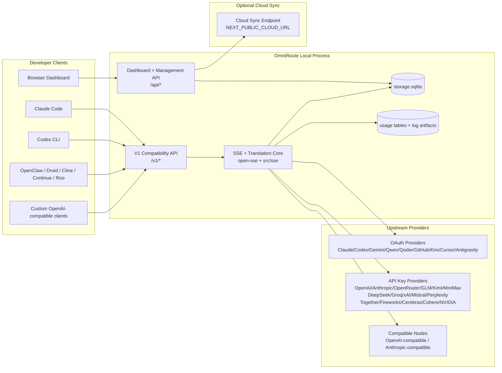
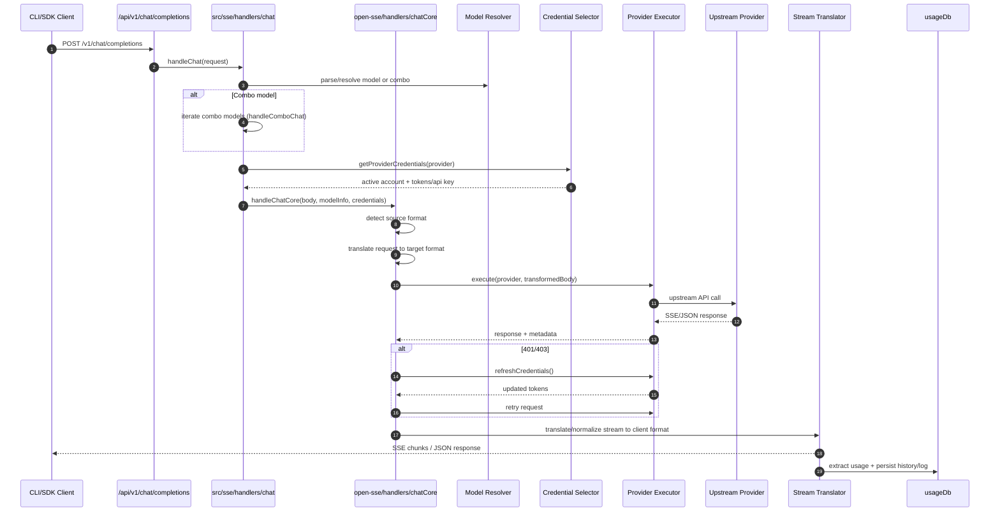
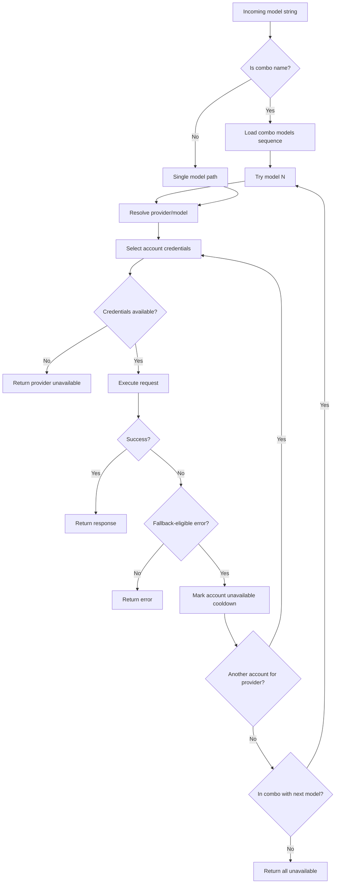
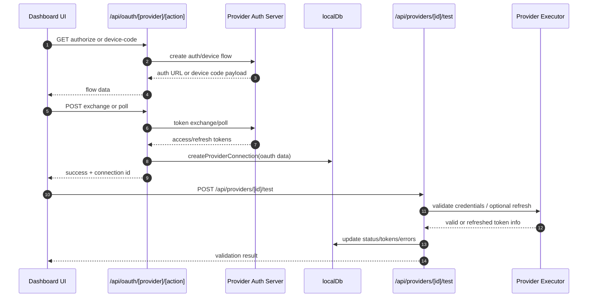
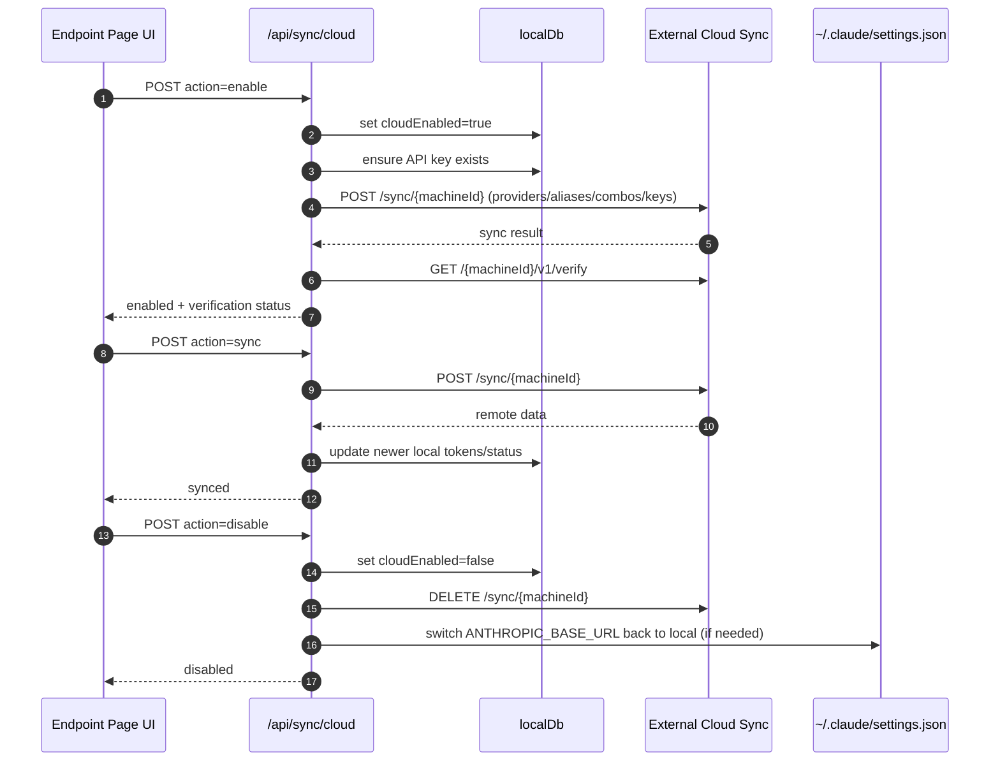
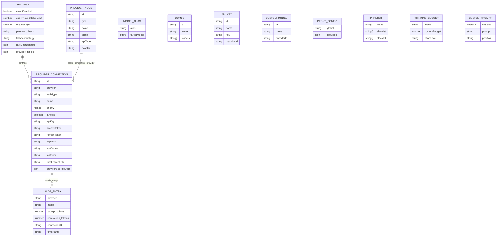
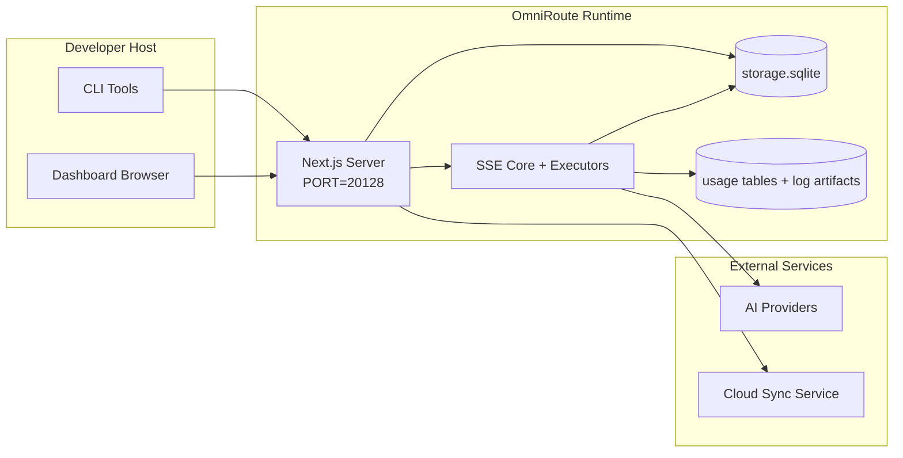

# OmniRoute Architecture (Italiano)

🌐 **Languages:** 🇺🇸 [English](../../../../docs/ARCHITECTURE.md) · 🇪🇸 [es](../../es/docs/ARCHITECTURE.md) · 🇫🇷 [fr](../../fr/docs/ARCHITECTURE.md) · 🇩🇪 [de](../../de/docs/ARCHITECTURE.md) · 🇮🇹 [it](../../it/docs/ARCHITECTURE.md) · 🇷🇺 [ru](../../ru/docs/ARCHITECTURE.md) · 🇨🇳 [zh-CN](../../zh-CN/docs/ARCHITECTURE.md) · 🇯🇵 [ja](../../ja/docs/ARCHITECTURE.md) · 🇰🇷 [ko](../../ko/docs/ARCHITECTURE.md) · 🇸🇦 [ar](../../ar/docs/ARCHITECTURE.md) · 🇮🇳 [hi](../../hi/docs/ARCHITECTURE.md) · 🇮🇳 [in](../../in/docs/ARCHITECTURE.md) · 🇹🇭 [th](../../th/docs/ARCHITECTURE.md) · 🇻🇳 [vi](../../vi/docs/ARCHITECTURE.md) · 🇮🇩 [id](../../id/docs/ARCHITECTURE.md) · 🇲🇾 [ms](../../ms/docs/ARCHITECTURE.md) · 🇳🇱 [nl](../../nl/docs/ARCHITECTURE.md) · 🇵🇱 [pl](../../pl/docs/ARCHITECTURE.md) · 🇸🇪 [sv](../../sv/docs/ARCHITECTURE.md) · 🇳🇴 [no](../../no/docs/ARCHITECTURE.md) · 🇩🇰 [da](../../da/docs/ARCHITECTURE.md) · 🇫🇮 [fi](../../fi/docs/ARCHITECTURE.md) · 🇵🇹 [pt](../../pt/docs/ARCHITECTURE.md) · 🇷🇴 [ro](../../ro/docs/ARCHITECTURE.md) · 🇭🇺 [hu](../../hu/docs/ARCHITECTURE.md) · 🇧🇬 [bg](../../bg/docs/ARCHITECTURE.md) · 🇸🇰 [sk](../../sk/docs/ARCHITECTURE.md) · 🇺🇦 [uk-UA](../../uk-UA/docs/ARCHITECTURE.md) · 🇮🇱 [he](../../he/docs/ARCHITECTURE.md) · 🇵🇭 [phi](../../phi/docs/ARCHITECTURE.md) · 🇧🇷 [pt-BR](../../pt-BR/docs/ARCHITECTURE.md) · 🇨🇿 [cs](../../cs/docs/ARCHITECTURE.md) · 🇹🇷 [tr](../../tr/docs/ARCHITECTURE.md)

---

_Ultimo aggiornamento: 28-03-2026_## Executive Summary

OmniRoute è un gateway di routing AI locale e un dashboard basato su Next.js.
Fornisce un singolo endpoint compatibile con OpenAI (`/v1/*`) e instrada il traffico attraverso più provider upstream con traduzione, fallback, aggiornamento dei token e monitoraggio dell'utilizzo.

Funzionalità principali:

- Superficie API compatibile con OpenAI per CLI/strumenti (28 provider)
- Traduzione di richieste/risposte tra formati di fornitori
- Fallback combo modello (sequenza multi-modello)
- Fallback a livello di account (più account per fornitore)
- Gestione della connessione del provider OAuth + chiave API
- Generazione di incorporamenti tramite `/v1/embeddings` (6 fornitori, 9 modelli)
- Generazione di immagini tramite `/v1/images/ generations` (4 fornitori, 9 modelli)
- Analisi dei tag Think (`<think>...</think>`) per modelli di ragionamento
- Sanificazione della risposta per una rigorosa compatibilità con l'SDK OpenAI
- Normalizzazione dei ruoli (sviluppatore→sistema, sistema→utente) per compatibilità tra provider
- Conversione dell'output strutturato (json_schema → Gemini ResponseSchema)
- Persistenza locale per provider, chiavi, alias, combo, impostazioni, prezzi
- Monitoraggio dell'utilizzo/costo e registrazione delle richieste
- Sincronizzazione cloud opzionale per la sincronizzazione multi-dispositivo/stato
- Lista consentita/lista bloccata IP per il controllo dell'accesso API
- Gestione intelligente del budget (passthrough/automatico/personalizzato/adattivo)
- Iniezione rapida del sistema globale
- Monitoraggio della sessione e rilevamento delle impronte digitali
- Limitazione tariffaria migliorata per account con profili specifici del fornitore
- Modello di interruttore automatico per la resilienza del fornitore
- Protezione gregge antituono con bloccaggio mutex
- Cache di deduplicazione delle richieste basata su firma
- Livello dominio: disponibilità del modello, regole di costo, politica di fallback, politica di blocco
- Persistenza dello stato del dominio (cache write-through SQLite per fallback, budget, blocchi, interruttori automatici)
- Motore di policy per la valutazione centralizzata delle richieste (blocco → budget → fallback)
- Richiedi telemetria con aggregazione della latenza p50/p95/p99
- ID di correlazione (X-Request-Id) per la traccia end-to-end
- Registrazione del controllo di conformità con rinuncia per chiave API
- Quadro di valutazione per la garanzia della qualità LLM
- Dashboard dell'interfaccia utente di resilienza con stato dell'interruttore automatico in tempo reale
- Provider OAuth modulari (12 moduli individuali in `src/lib/oauth/provviders/`)

Modello runtime primario:

- I percorsi dell'app Next.js in "src/app/api/\*" implementano sia le API del dashboard che le API di compatibilità
- Un core SSE/routing condiviso in `src/sse/*` + `open-sse/*` gestisce l'esecuzione, la traduzione, lo streaming, il fallback e l'utilizzo del provider## Scope and Boundaries

### In Scope

- Runtime del gateway locale
- API di gestione della dashboard
- Autenticazione del provider e aggiornamento del token
- Richiedi traduzione e streaming SSE
- Stato locale + persistenza dell'utilizzo
- Orchestrazione opzionale della sincronizzazione cloud### Out of Scope

- Implementazione del servizio cloud dietro `NEXT_PUBLIC_CLOUD_URL`
- SLA/piano di controllo del fornitore esterno al processo locale
- Gli stessi binari CLI esterni (Claude CLI, Codex CLI, ecc.)## Dashboard Surface (Current)

Pagine principali in `src/app/(dashboard)/dashboard/`:

- `/dashboard`: avvio rapido + panoramica del provider
- `/dashboard/endpoint`: proxy endpoint + MCP + A2A + schede endpoint API
- `/dashboard/providers`: connessioni e credenziali del provider
- `/dashboard/combos`: strategie combinate, modelli, regole di routing del modello
- "/dashboard/costs": aggregazione dei costi e visibilità dei prezzi
- "/dashboard/analytics" — analisi e valutazioni sull'utilizzo
- "/dashboard/limits": controlli di quote/tariffe
- `/dashboard/cli-tools`: onboarding della CLI, rilevamento del runtime, generazione della configurazione
- `/dashboard/agents`: agenti ACP rilevati + registrazione dell'agente personalizzato
- `/dashboard/media`: area giochi per immagini/video/musica
- `/dashboard/search-tools`: test e cronologia del provider di ricerca
- "/dashboard/health": tempo di attività, interruttori automatici, limiti di velocità
- `/dashboard/logs`: registri di richieste/proxy/audit/console
- `/dashboard/settings`: schede delle impostazioni di sistema (generale, routing, impostazioni predefinite combinate, ecc.)
- `/dashboard/api-manager`: ciclo di vita della chiave API e autorizzazioni del modello## High-Level System Context



## Core Runtime Components

## 1) API and Routing Layer (Next.js App Routes)

Directory principali:

- `src/app/api/v1/*` e `src/app/api/v1beta/*` per le API di compatibilità
- `src/app/api/*` per le API di gestione/configurazione
- Successivamente riscrive la mappa `next.config.mjs` da `/v1/*` a `/api/v1/*`

Percorsi di compatibilità importanti:

- `src/app/api/v1/chat/completions/route.ts`
- `src/app/api/v1/messages/route.ts`
- `src/app/api/v1/responses/route.ts`
- `src/app/api/v1/models/route.ts`: include modelli personalizzati con `custom: true`
- `src/app/api/v1/embeddings/route.ts` — generazione di incorporamenti (6 provider)
- `src/app/api/v1/images/ generations/route.ts` — generazione di immagini (4+ fornitori incluso Antigravity/Nebius)
- `src/app/api/v1/messages/count_tokens/route.ts`
- `src/app/api/v1/providers/[provider]/chat/completions/route.ts` — chat dedicata per provider
- `src/app/api/v1/providers/[provider]/embeddings/route.ts` — incorporamenti dedicati per provider
- `src/app/api/v1/providers/[provider]/images/ generations/route.ts`: immagini dedicate per provider
- `src/app/api/v1beta/models/route.ts`
- `src/app/api/v1beta/models/[...percorso]/route.ts`

Domini di gestione:

- Autenticazione/impostazioni: `src/app/api/auth/*`, `src/app/api/settings/*`
- Provider/connessioni: `src/app/api/provviders*`
- Nodi del provider: `src/app/api/provider-nodes*`
- Modelli personalizzati: `src/app/api/provider-models` (GET/POST/DELETE)
- Catalogo modelli: `src/app/api/models/route.ts` (GET)
- Configurazione proxy: `src/app/api/settings/proxy` (GET/PUT/DELETE) + `src/app/api/settings/proxy/test` (POST)
- OAuth: `src/app/api/oauth/*`
- Chiavi/alias/combo/prezzi: `src/app/api/keys*`, `src/app/api/models/alias`, `src/app/api/combos*`, `src/app/api/pricing`
- Utilizzo: `src/app/api/usage/*`
- Sincronizzazione/cloud: `src/app/api/sync/*`, `src/app/api/cloud/*`
- Supporti per gli strumenti CLI: `src/app/api/cli-tools/*`
- Filtro IP: `src/app/api/settings/ip-filter` (GET/PUT)
- Budget pensante: `src/app/api/settings/thinking-budget` (GET/PUT)
- Prompt di sistema: `src/app/api/settings/system-prompt` (GET/PUT)
- Sessioni: `src/app/api/sessions` (GET)
- Limiti di velocità: `src/app/api/rate-limits` (GET)
- Resilienza: "src/app/api/resilience" (GET/PATCH): profili del fornitore, interruttore automatico, stato limite di velocità
- Ripristino della resilienza: `src/app/api/resilience/reset` (POST): ripristina gli interruttori + tempi di recupero
- Statistiche della cache: `src/app/api/cache/stats` (GET/DELETE)
- Disponibilità del modello: `src/app/api/models/availability` (GET/POST)
- Telemetria: `src/app/api/telemetry/summary` (GET)
- Budget: `src/app/api/usage/budget` (GET/POST)
- Catene di fallback: `src/app/api/fallback/chains` (GET/POST/DELETE)
- Controllo di conformità: `src/app/api/compliance/audit-log` (GET)
- Valutazioni: `src/app/api/evals` (GET/POST), `src/app/api/evals/[suiteId]` (GET)
- Politiche: `src/app/api/policies` (GET/POST)## 2) SSE + Translation Core

Principali moduli di flusso:

- Voce: `src/sse/handlers/chat.ts`
- Orchestrazione principale: `open-sse/handlers/chatCore.ts`
- Adattatori di esecuzione del provider: `open-sse/executors/*`
- Rilevamento formato/configurazione provider: `open-sse/services/provider.ts`
- Analisi/risoluzione del modello: `src/sse/services/model.ts`, `open-sse/services/model.ts`
- Logica di fallback dell'account: `open-sse/services/accountFallback.ts`
- Registro di traduzione: `open-sse/translator/index.ts`
- Trasformazioni del flusso: `open-sse/utils/stream.ts`, `open-sse/utils/streamHandler.ts`
- Estrazione/normalizzazione dell'utilizzo: `open-sse/utils/usageTracking.ts`
- Think tag parser: `open-sse/utils/thinkTagParser.ts`
- Gestore di incorporamento: `open-sse/handlers/embeddings.ts`
- Incorporamento del registro del provider: `open-sse/config/embeddingRegistry.ts`
- Gestore di generazione di immagini: `open-sse/handlers/imageGeneration.ts`
- Registro del fornitore di immagini: `open-sse/config/imageRegistry.ts`
- Sanificazione della risposta: `open-sse/handlers/responseSanitizer.ts`
- Normalizzazione del ruolo: `open-sse/services/roleNormalizer.ts`

Servizi (logica aziendale):

- Selezione/punteggio dell'account: `open-sse/services/accountSelector.ts`
- Gestione del ciclo di vita del contesto: `open-sse/services/contextManager.ts`
- Applicazione del filtro IP: `open-sse/services/ipFilter.ts`
- Tracciamento della sessione: `open-sse/services/sessionManager.ts`
- Richiedi la deduplicazione: `open-sse/services/signatureCache.ts`
- Inserimento del prompt del sistema: `open-sse/services/systemPrompt.ts`
- Gestione intelligente del budget: `open-sse/services/thinkingBudget.ts`
- Routing del modello jolly: `open-sse/services/wildcardRouter.ts`
- Gestione dei limiti di tariffa: `open-sse/services/rateLimitManager.ts`
- Interruttore automatico: `open-sse/services/circuitBreaker.ts`

Moduli del livello di dominio:

- Disponibilità del modello: `src/lib/domain/modelAvailability.ts`
- Regole/budget di costo: `src/lib/domain/costRules.ts`
- Politica di fallback: `src/lib/domain/fallbackPolicy.ts`
- Risolutore combinato: `src/lib/domain/comboResolver.ts`
- Politica di blocco: `src/lib/domain/lockoutPolicy.ts`
- Motore delle politiche: `src/domain/policyEngine.ts` — blocco centralizzato → budget → valutazione fallback
- Catalogo dei codici di errore: `src/lib/domain/errorCodes.ts`
- ID richiesta: `src/lib/domain/requestId.ts`
- Timeout di recupero: `src/lib/domain/fetchTimeout.ts`
- Richiedi telemetria: `src/lib/domain/requestTelemetry.ts`
- Conformità/controllo: `src/lib/domain/compliance/index.ts`
- Corridore di valutazione: `src/lib/domain/evalRunner.ts`
- Persistenza dello stato del dominio: `src/lib/db/domainState.ts` — SQLite CRUD per catene di fallback, budget, cronologia dei costi, stato di blocco, interruttori automatici

Moduli provider OAuth (12 file singoli in `src/lib/oauth/provviders/`):

- Indice del registro: `src/lib/oauth/provviders/index.ts`
- Singoli fornitori: `claude.ts`, `codex.ts`, `gemini.ts`, `antigravity.ts`, `qoder.ts`, `qwen.ts`, `kimi-coding.ts`, `github.ts`, `kiro.ts`, `cursor.ts`, `kilocode.ts`, `cline.ts`
- Thin wrapper: `src/lib/oauth/provviders.ts` — riesporta da singoli moduli## 3) Persistence Layer

DB di stato primario (SQLite):

- Infrastruttura core: `src/lib/db/core.ts` (better-sqlite3, migrazioni, WAL)
- Riesportazione della facciata: `src/lib/localDb.ts` (livello di compatibilità sottile per i chiamanti)
- file: `${DATA_DIR}/storage.sqlite` (o `$XDG_CONFIG_HOME/omniroute/storage.sqlite` se impostato, altrimenti `~/.omniroute/storage.sqlite`)
- entità (tabelle + spazi dei nomi KV): providerConnections, providerNodes, modelAliases, combos, apiKeys, impostazioni, prezzi,**customModels**,**proxyConfig**,**ipFilter**,**thinkingBudget**,**systemPrompt**

Persistenza dell'utilizzo:

- facciata: `src/lib/usageDb.ts` (moduli scomposti in `src/lib/usage/*`)
- Tabelle SQLite in `storage.sqlite`: `usage_history`, `call_logs`, `proxy_logs`
- rimangono elementi di file opzionali per compatibilità/debug (`${DATA_DIR}/log.txt`, `${DATA_DIR}/call_logs/`, `<repo>/logs/...`)
- I file JSON legacy vengono migrati su SQLite dalle migrazioni di avvio quando presenti

DB dello stato del dominio (SQLite):

- `src/lib/db/domainState.ts` — Operazioni CRUD per lo stato del dominio
- Tabelle (create in `src/lib/db/core.ts`): `domain_fallback_chains`, `domain_budgets`, `domain_cost_history`, `domain_lockout_state`, `domain_circuit_breakers`
- Schema cache write-through: le mappe in memoria sono autorevoli in fase di esecuzione; le mutazioni vengono scritte in modo sincrono su SQLite; lo stato viene ripristinato dal DB all'avvio a freddo## 4) Auth + Security Surfaces

- Autenticazione cookie dashboard: `src/proxy.ts`, `src/app/api/auth/login/route.ts`
- Generazione/verifica della chiave API: `src/shared/utils/apiKey.ts`
- I segreti del provider sono persistenti nelle voci "providerConnections".
- Supporto proxy in uscita tramite `open-sse/utils/proxyFetch.ts` (env vars) e `open-sse/utils/networkProxy.ts` (configurabile per provider o globale)## 5) Cloud Sync

- Programmazione init: `src/lib/initCloudSync.ts`, `src/shared/services/initializeCloudSync.ts`, `src/shared/services/modelSyncScheduler.ts`
- Attività periodica: `src/shared/services/cloudSyncScheduler.ts`
- Attività periodica: `src/shared/services/modelSyncScheduler.ts`
- Controlla il percorso: `src/app/api/sync/cloud/route.ts`## Request Lifecycle (`/v1/chat/completions`)



## Combo + Account Fallback Flow



Le decisioni di fallback sono guidate da "open-sse/services/accountFallback.ts" utilizzando codici di stato ed euristica dei messaggi di errore. Il routing combinato aggiunge un'ulteriore protezione: gli errori 400 con ambito provider, come gli errori di blocco del contenuto upstream e di convalida del ruolo, vengono trattati come errori locali del modello in modo che le destinazioni combinate successive possano ancora essere eseguite.## OAuth Onboarding and Token Refresh Lifecycle



L'aggiornamento durante il traffico live viene eseguito all'interno di `open-sse/handlers/chatCore.ts` tramite l'esecutore `refreshCredentials()`.## Cloud Sync Lifecycle (Enable / Sync / Disable)



La sincronizzazione periodica viene attivata da "CloudSyncScheduler" quando il cloud è abilitato.## Data Model and Storage Map



File di archiviazione fisica:

- DB di runtime primario: `${DATA_DIR}/storage.sqlite`
- richieste di righe di log: `${DATA_DIR}/log.txt` (artefatto compat/debug)
- archivi strutturati del payload delle chiamate: `${DATA_DIR}/call_logs/`
- sessioni di debug traduttore/richiesta opzionali: `<repo>/logs/...`## Deployment Topology



## Module Mapping (Decision-Critical)

### Route and API Modules

- `src/app/api/v1/*`, `src/app/api/v1beta/*`: API di compatibilità
- `src/app/api/v1/providers/[provider]/*`: percorsi dedicati per provider (chat, incorporamenti, immagini)
- `src/app/api/providers*`: CRUD del provider, convalida, test
- `src/app/api/provider-nodes*`: gestione personalizzata dei nodi compatibili
- `src/app/api/provider-models`: gestione dei modelli personalizzati (CRUD)
- `src/app/api/models/route.ts`: API del catalogo modelli (alias + modelli personalizzati)
- `src/app/api/oauth/*`: flussi OAuth/codice dispositivo
- `src/app/api/keys*`: ciclo di vita della chiave API locale
- `src/app/api/models/alias`: gestione degli alias
- `src/app/api/combos*`: gestione delle combo fallback
- `src/app/api/pricing`: il prezzo sostituisce il calcolo dei costi
- `src/app/api/settings/proxy`: configurazione del proxy (GET/PUT/DELETE)
- `src/app/api/settings/proxy/test`: test di connettività proxy in uscita (POST)
- `src/app/api/usage/*`: API di utilizzo e log
- `src/app/api/sync/*` + `src/app/api/cloud/*`: sincronizzazione cloud e helper rivolti al cloud
- `src/app/api/cli-tools/*`: scrittori/controllori di configurazione CLI locali
- `src/app/api/settings/ip-filter`: lista consentita/lista bloccata IP (GET/PUT)
- `src/app/api/settings/thinking-budget`: configurazione del budget del token pensante (GET/PUT)
- `src/app/api/settings/system-prompt`: prompt di sistema globale (GET/PUT)
- `src/app/api/sessions`: elenco delle sessioni attive (GET)
- `src/app/api/rate-limits`: stato del limite di tariffa per account (GET)### Routing and Execution Core

- `src/sse/handlers/chat.ts`: analisi delle richieste, gestione delle combo, ciclo di selezione dell'account
- `open-sse/handlers/chatCore.ts`: traduzione, invio dell'esecutore, gestione dei tentativi/aggiornamenti, impostazione dello streaming
- `open-sse/executors/*`: comportamento di rete e formato specifico del provider### Translation Registry and Format Converters

- `open-sse/translator/index.ts`: registro e orchestrazione dei traduttori
- Richiedi traduttori: `open-sse/translator/request/*`
- Traduttori di risposta: `open-sse/translator/response/*`
- Costanti di formato: `open-sse/translator/formats.ts`### Persistence

- `src/lib/db/*`: configurazione/stato persistente e persistenza del dominio su SQLite
- `src/lib/localDb.ts`: riesportazione della compatibilità per i moduli DB
- `src/lib/usageDb.ts`: facciata della cronologia di utilizzo/registri delle chiamate sopra le tabelle SQLite## Provider Executor Coverage (Strategy Pattern)

Ogni provider dispone di un esecutore specializzato che estende "BaseExecutor" (in "open-sse/executors/base.ts"), che fornisce la creazione di URL, la costruzione di intestazioni, i tentativi con backoff esponenziale, gli hook di aggiornamento delle credenziali e il metodo di orchestrazione "execute()".

| Esecutore testamentario | Fornitore/i                                                                                                                                                  | Movimentazione speciale                                                          |
| ----------------------- | ------------------------------------------------------------------------------------------------------------------------------------------------------------ | -------------------------------------------------------------------------------- |
| `DefaultExecutor`       | OpenAI, Claude, Gemini, Qwen, Qoder, OpenRouter, GLM, Kimi, MiniMax, DeepSeek, Groq, xAI, Mistral, Perplexity, Together, Fireworks, Cerebras, Cohere, NVIDIA | Configurazione URL/intestazione dinamica per provider                            |
| "Esecutore Antigravità" | Google Antigravità                                                                                                                                           | ID progetto/sessione personalizzati, analisi Riprova dopo                        |
| `CodexExecutor`         | Codice OpenAI                                                                                                                                                | Inserisce istruzioni di sistema, forza lo sforzo di ragionamento                 |
| `CursorExecutor`        | Cursore IDE                                                                                                                                                  | Protocollo ConnectRPC, codifica Protobuf, firma della richiesta tramite checksum |
| "GithubExecutor"        | Copilota GitHub                                                                                                                                              | Aggiornamento del token Copilot, intestazioni che imitano VSCode                 |
| "KiroExecutor"          | AWS CodeWhisperer/Kiro                                                                                                                                       | Formato binario AWS EventStream → conversione SSE                                |
| "GeminiCLIExecutor"     | Gemelli CLI                                                                                                                                                  | Ciclo di aggiornamento del token OAuth di Google                                 |

Tutti gli altri provider (inclusi i nodi compatibili personalizzati) utilizzano "DefaultExecutor".## Provider Compatibility Matrix

| Fornitore             | Formato         | Aut.                    | Flusso           | Non streaming | Aggiornamento token | API di utilizzo          |
| --------------------- | --------------- | ----------------------- | ---------------- | ------------- | ------------------- | ------------------------ | ------------------------------ |
| Claudio               | claude          | Chiave API/OAuth        | ✅               | ✅            | ✅                  | ⚠️ Solo amministratore   |
| Gemelli               | gemelli         | Chiave API/OAuth        | ✅               | ✅            | ✅                  | ⚠️ Console cloud         |
| Gemelli CLI           | gemelli-cli     | OAuth                   | ✅               | ✅            | ✅                  | ⚠️ Console cloud         |
| Antigravità           | antigravità     | OAuth                   | ✅               | ✅            | ✅                  | ✅ API quota completa    |
| OpenAI                | openai          | Chiave API              | ✅               | ✅            | ❌                  | ❌                       |
| Codice                | risposte-openai | OAuth                   | ✅ forzato       | ❌            | ✅                  | ✅ Limiti tariffari      |
| Copilota GitHub       | openai          | OAuth + token copilota  | ✅               | ✅            | ✅                  | ✅Istantanee delle quote |
| Cursore               | cursore         | Checksum personalizzato | ✅               | ✅            | ❌                  | ❌                       |
| Kiro                  | Kiro            | AWS SSO OIDC            | ✅ (EventStream) | ❌            | ✅                  | ✅ Limiti di utilizzo    |
| Qwen                  | openai          | OAuth                   | ✅               | ✅            | ✅                  | ⚠️ Su richiesta          |
| Qoder                 | openai          | OAuth (base)            | ✅               | ✅            | ✅                  | ⚠️ Su richiesta          |
| OpenRouter            | openai          | Chiave API              | ✅               | ✅            | ❌                  | ❌                       |
| GLM/Kimi/MiniMax      | claude          | Chiave API              | ✅               | ✅            | ❌                  | ❌                       |
| Ricerca profonda      | openai          | Chiave API              | ✅               | ✅            | ❌                  | ❌                       |
| Groq                  | openai          | Chiave API              | ✅               | ✅            | ❌                  | ❌                       |
| xAI (Grok)            | openai          | Chiave API              | ✅               | ✅            | ❌                  | ❌                       |
| Maestrale             | openai          | Chiave API              | ✅               | ✅            | ❌                  | ❌                       |
| Perplessità           | openai          | Chiave API              | ✅               | ✅            | ❌                  | ❌                       |
| Insieme AI            | openai          | Chiave API              | ✅               | ✅            | ❌                  | ❌                       |
| Fuochi d'artificio AI | openai          | Chiave API              | ✅               | ✅            | ❌                  | ❌                       |
| Cerebri               | openai          | Chiave API              | ✅               | ✅            | ❌                  | ❌                       |
| Coerenza              | openai          | Chiave API              | ✅               | ✅            | ❌                  | ❌                       |
| NVIDIA NIM            | openai          | Chiave API              | ✅               | ✅            | ❌                  | ❌                       | ## Format Translation Coverage |

I formati sorgente rilevati includono:

- "openai".
- "risposte-openai".
- "claude".
- "gemelli".

I formati di destinazione includono:

- Chat/risposte OpenAI
- Claudio
- Busta Gemini/Gemini-CLI/Antigravità
- Kiro
- Cursore

Le traduzioni utilizzano**OpenAI come formato hub**: tutte le conversioni passano attraverso OpenAI come formato intermedio:```
Source Format → OpenAI (hub) → Target Format

````

Translations are selected dynamically based on source payload shape and provider target format.

Additional processing layers in the translation pipeline:

-**Sanificazione delle risposte**: rimuove i campi non standard dalle risposte in formato OpenAI (sia in streaming che non in streaming) per garantire la rigorosa conformità dell'SDK
-**Role normalization**— Converts `developer` → `system` for non-OpenAI targets; merges `system` → `user` for models that reject the system role (GLM, ERNIE)
-**Think tag extraction**— Parses `<think>...</think>` blocks from content into `reasoning_content` field
-**Structured output**— Converts OpenAI `response_format.json_schema` to Gemini's `responseMimeType` + `responseSchema`## Supported API Endpoints

| Endpoint                                           | Formato | Gestore |
| -------------------------------------------------- | ------------------ | ------------------------------------------------------------------- |
| `POST /v1/chat/completions`                        | Chatta OpenAI | `src/sse/handlers/chat.ts` |
| `POST /v1/messaggi` | Messaggi di Claude | Same handler (auto-detected)                                        |
| `POST /v1/responses`                               | Risposte OpenAI | `open-sse/handlers/responsesHandler.ts` |
| `POST /v1/embeddings`                              | Incorporamenti OpenAI | `open-sse/handlers/embeddings.ts`                                   |
| `GET /v1/embeddings`                               | Elenco dei modelli | Percorso API |
| `POST /v1/images/generations`                      | Immagini OpenAI | `open-sse/handlers/imageGeneration.ts`                              |
| `OTTIENI /v1/immagini/generazioni` | Elenco dei modelli | Percorso API |
| `POST /v1/provider/{provider}/chat/completions` | Chatta OpenAI | Dedicated per-provider with model validation                        |
| `POST /v1/provider/{provider}/embeddings` | Incorporamenti OpenAI | Dedicated per-provider with model validation                        |
| `POST /v1/providers/{provider}/images/generations` | Immagini OpenAI | Dedicato per provider con convalida del modello |
| `POST /v1/messages/count_tokens`                   | Conteggio gettoni Claude | Percorso API |
| `GET /v1/models`                                   | Elenco modelli OpenAI | Percorso API (chat + incorporamento + immagine + modelli personalizzati) |
| `GET /api/models/catalog` | Catalogo | Tutti i modelli raggruppati per fornitore + tipo |
| `POST /v1beta/models/*:streamGenerateContent`      | Nativo dei Gemelli | Percorso API |
| `OTTIENI/INSERISCI/ELIMINA /api/settings/proxy` | Configurazione proxy | Configurazione proxy di rete |
| `POST /api/settings/proxy/test` | Connettività proxy | Endpoint di test di integrità/connettività proxy |
| `GET/POST/DELETE /api/provider-models` | Modelli di provider | Metadati del modello del provider che supportano i modelli disponibili personalizzati e gestiti |## Bypass Handler

Il gestore di bypass (`open-sse/utils/bypassHandler.ts`) intercetta le richieste "usa e getta" note dalla CLI di Claude (ping di riscaldamento, estrazioni di titoli e conteggi di token) e restituisce una**risposta falsa**senza consumare token del provider upstream. Questo viene attivato solo quando "User-Agent" contiene "claude-cli".## Request Logger Pipeline

Il logger delle richieste (`open-sse/utils/requestLogger.ts`) fornisce una pipeline di registrazione del debug in 7 fasi, disabilitata per impostazione predefinita, abilitata tramite `ENABLE_REQUEST_LOGS=true`:```
1_req_client.json → 2_req_source.json → 3_req_openai.json → 4_req_target.json
→ 5_res_provider.txt → 6_res_openai.txt → 7_res_client.txt
````

I file vengono scritti in `<repo>/logs/<session>/` per ogni sessione di richiesta.## Failure Modes and Resilience

## 1) Account/Provider Availability

- Tempo di recupero dell'account del provider in caso di errori temporanei/velocità/autenticazione
- fallback dell'account prima di fallire la richiesta
- fallback del modello combinato quando il percorso del modello/provider corrente è esaurito## 2) Token Expiry

- controllo preliminare e aggiornamento con nuovo tentativo per i provider aggiornabili
- Nuovo tentativo 401/403 dopo il tentativo di aggiornamento nel percorso principale## 3) Stream Safety

- controller di flusso in grado di riconoscere la disconnessione
- flusso di traduzione con flush di fine flusso e gestione "[DONE]".
- fallback della stima dell'utilizzo quando mancano i metadati di utilizzo del provider## 4) Cloud Sync Degradation

- Sono emersi errori di sincronizzazione ma il runtime locale continua
- Lo scheduler ha una logica che consente di riprovare, ma l'esecuzione periodica attualmente chiama la sincronizzazione a tentativo singolo per impostazione predefinita## 5) Data Integrity

- Migrazioni dello schema SQLite e hook di aggiornamento automatico all'avvio
- JSON legacy → percorso di compatibilità della migrazione SQLite## Observability and Operational Signals

Origini della visibilità in runtime:

- log della console da `src/sse/utils/logger.ts`
- aggregati di utilizzo per richiesta in SQLite (`usage_history`, `call_logs`, `proxy_logs`)
- Acquisizioni dettagliate del payload in quattro fasi in SQLite (`request_detail_logs`) quando "settings.detailed_logs_enabled=true"
- registro testuale dello stato della richiesta in `log.txt` (opzionale/compat)
- log di richiesta/traduzione approfonditi opzionali in "logs/" quando "ENABLE_REQUEST_LOGS=true"
- Endpoint di utilizzo del dashboard (`/api/usage/*`) per il consumo dell'interfaccia utente

L'acquisizione dettagliata del payload della richiesta memorizza fino a quattro fasi del payload JSON per chiamata instradata:

- richiesta grezza ricevuta dal cliente
- richiesta tradotta effettivamente inviata a monte
- risposta del provider ricostruita come JSON; le risposte in streaming vengono compattate nel riepilogo finale più i metadati del flusso
- risposta del cliente finale restituita da OmniRoute; le risposte in streaming vengono archiviate nello stesso modulo di riepilogo compatto## Security-Sensitive Boundaries

- Il segreto JWT ("JWT_SECRET") protegge la verifica/firma dei cookie della sessione del dashboard
- Il bootstrap della password iniziale (`INITIAL_PASSWORD`) deve essere configurato esplicitamente per il provisioning di prima esecuzione
- Il segreto HMAC della chiave API (`API_KEY_SECRET`) protegge il formato della chiave API locale generata
- I segreti del provider (chiavi/token API) vengono mantenuti nel DB locale e devono essere protetti a livello di file system
- Gli endpoint di sincronizzazione cloud si basano sull'autenticazione della chiave API e sulla semantica dell'ID macchina## Environment and Runtime Matrix

Variabili d'ambiente utilizzate attivamente dal codice:

- App/autenticazione: `JWT_SECRET`, `INITIAL_PASSWORD`
- Memorizzazione: `DATA_DIR`
- Comportamento del nodo compatibile: `ALLOW_MULTI_CONNECTIONS_PER_COMPAT_NODE`
- Override opzionale della base di archiviazione (Linux/macOS quando `DATA_DIR` non è impostato): `XDG_CONFIG_HOME`
- Hashing di sicurezza: `API_KEY_SECRET`, `MACHINE_ID_SALT`
- Registrazione: `ENABLE_REQUEST_LOGS`
- URL di sincronizzazione/cloud: `NEXT_PUBLIC_BASE_URL`, `NEXT_PUBLIC_CLOUD_URL`
- Proxy in uscita: `HTTP_PROXY`, `HTTPS_PROXY`, `ALL_PROXY`, `NO_PROXY` e varianti minuscole
- Flag funzionalità SOCKS5: "ENABLE_SOCKS5_PROXY", "NEXT_PUBLIC_ENABLE_SOCKS5_PROXY"
- Supporti piattaforma/runtime (non configurazione specifica dell'app): `APPDATA`, `NODE_ENV`, `PORT`, `HOSTNAME`## Known Architectural Notes

1. `usageDb` e `localDb` condividono la stessa policy di directory di base (`DATA_DIR` -> `XDG_CONFIG_HOME/omniroute` -> `~/.omniroute`) con migrazione dei file legacy.
2. `/api/v1/route.ts` delega allo stesso generatore di catalogo unificato utilizzato da `/api/v1/models` (`src/app/api/v1/models/catalog.ts`) per evitare la deriva semantica.
3. Il registro delle richieste scrive intestazioni/corpo completi quando abilitato; considera la directory dei log come sensibile.
4. Il comportamento del cloud dipende dal `NEXT_PUBLIC_BASE_URL` corretto e dalla raggiungibilità dell'endpoint cloud.
5. La directory `open-sse/` è pubblicata come `@omniroute/open-sse`**pacchetto spazio di lavoro npm**. Il codice sorgente lo importa tramite `@omniroute/open-sse/...` (risolto da Next.js `transpilePackages`). I percorsi dei file in questo documento utilizzano ancora il nome della directory "open-sse/" per coerenza.
6. I grafici nel dashboard utilizzano**Recharts**(basati su SVG) per visualizzazioni analitiche accessibili e interattive (grafici a barre sull'utilizzo del modello, tabelle di suddivisione dei fornitori con percentuali di successo).
7. I test E2E utilizzano**Playwright**(`tests/e2e/`), eseguiti tramite `npm run test:e2e`. I test unitari utilizzano il**test runner Node.js**(`tests/unit/`), eseguito tramite `npm run test:unit`. Il codice sorgente in `src/` è**TypeScript**(`.ts`/`.tsx`); lo spazio di lavoro `open-sse/` rimane JavaScript (`.js`).
8. La pagina Impostazioni è organizzata in 5 schede: Sicurezza, Routing (6 strategie globali: riempimento prima, round robin, p2c, casuale, meno utilizzato, ottimizzato in termini di costi), Resilienza (limiti di velocità modificabili, interruttore automatico, policy), AI (budget pensato, prompt di sistema, cache dei prompt), Avanzate (proxy).## Operational Verification Checklist

- Compila dal sorgente: `npm run build`
- Costruisci l'immagine Docker: `docker build -t omniroute .`
- Avviare il servizio e verificare:
- "OTTIENI /api/impostazioni".
- "OTTIENI /api/v1/models".
- L'URL di base di destinazione della CLI deve essere "http://<host>:20128/v1" quando "PORT=20128"
