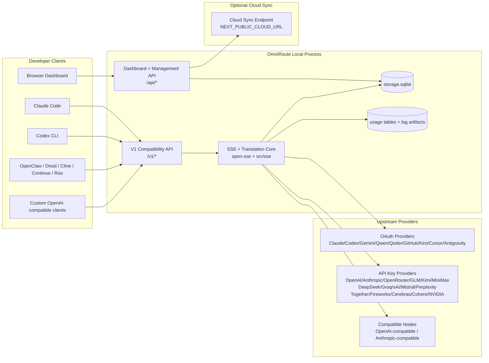
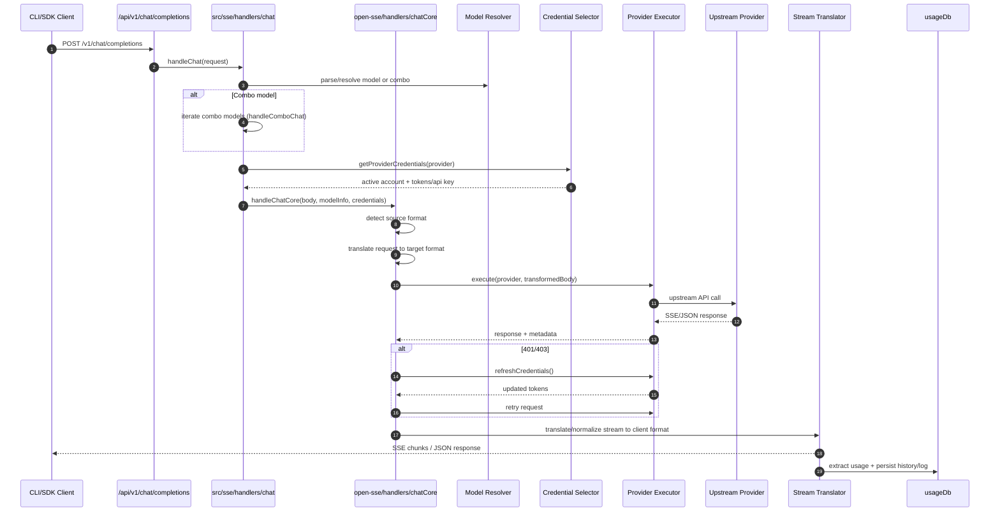
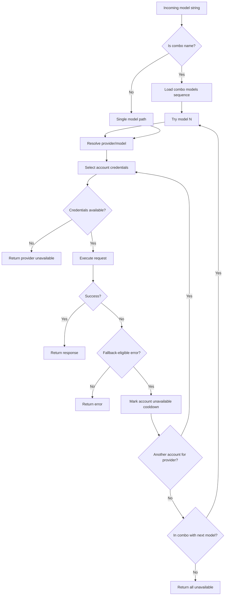
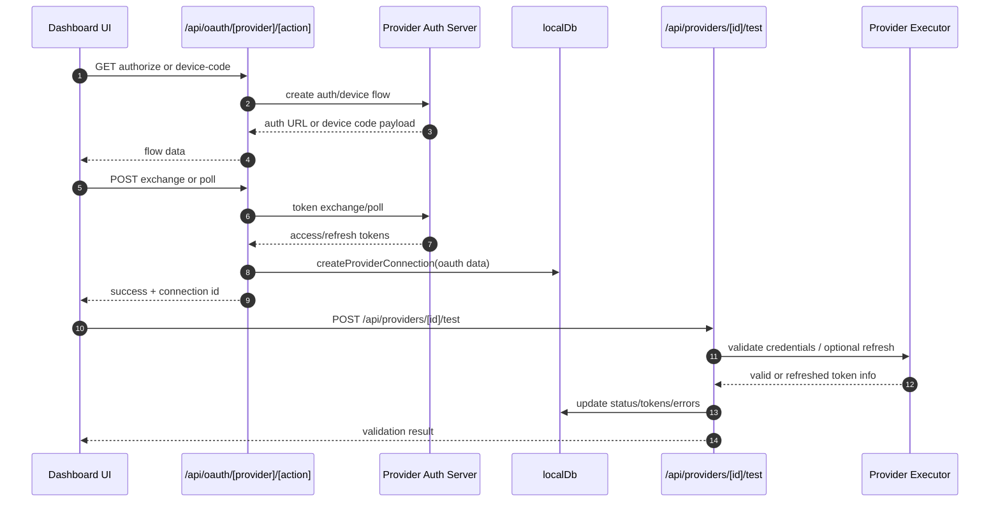
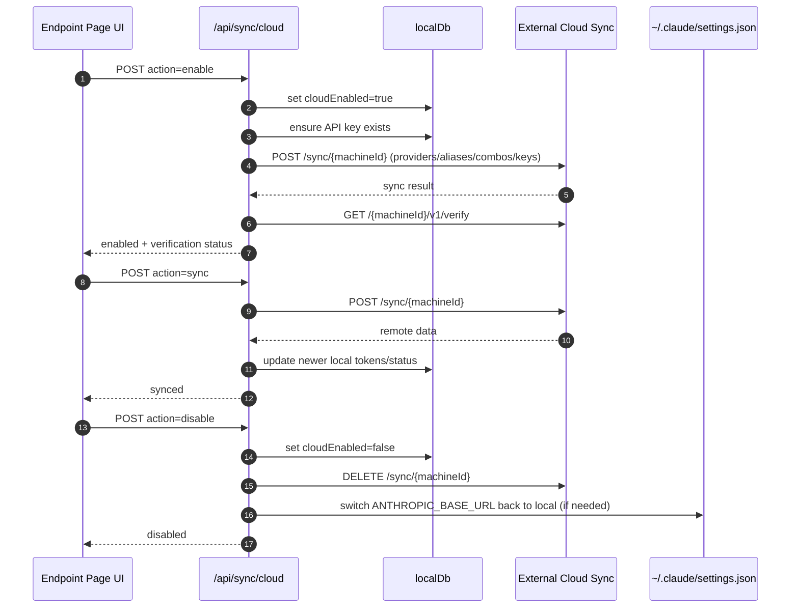
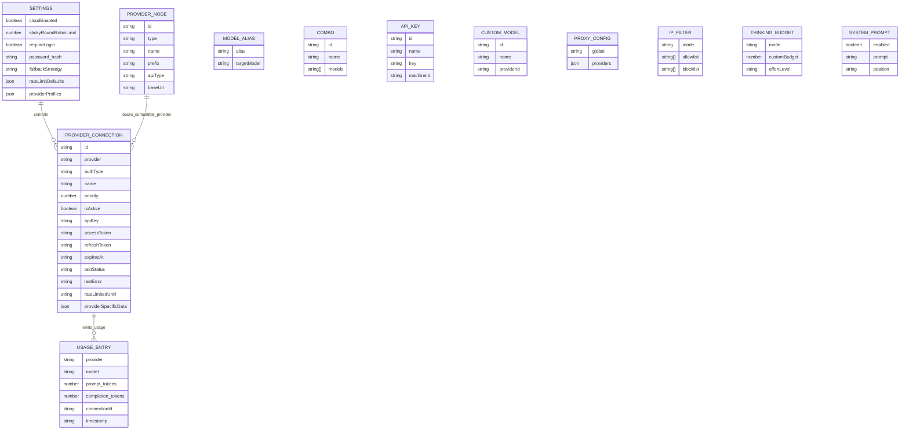
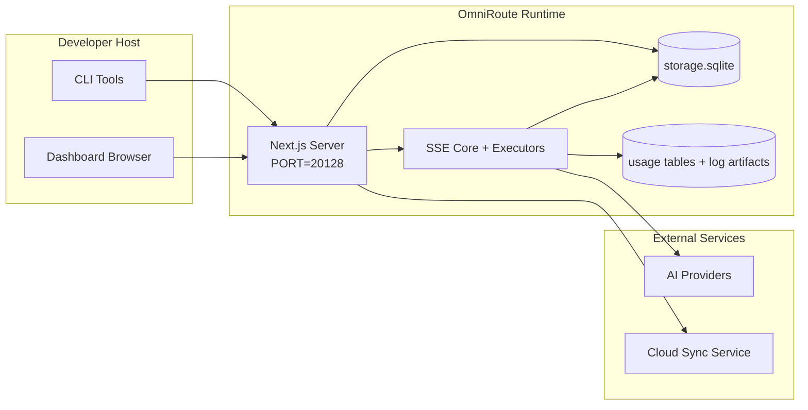

# OmniRoute Architecture (日本語)

🌐 **Languages:** 🇺🇸 [English](../../../../docs/ARCHITECTURE.md) · 🇪🇸 [es](../../es/docs/ARCHITECTURE.md) · 🇫🇷 [fr](../../fr/docs/ARCHITECTURE.md) · 🇩🇪 [de](../../de/docs/ARCHITECTURE.md) · 🇮🇹 [it](../../it/docs/ARCHITECTURE.md) · 🇷🇺 [ru](../../ru/docs/ARCHITECTURE.md) · 🇨🇳 [zh-CN](../../zh-CN/docs/ARCHITECTURE.md) · 🇯🇵 [ja](../../ja/docs/ARCHITECTURE.md) · 🇰🇷 [ko](../../ko/docs/ARCHITECTURE.md) · 🇸🇦 [ar](../../ar/docs/ARCHITECTURE.md) · 🇮🇳 [hi](../../hi/docs/ARCHITECTURE.md) · 🇮🇳 [in](../../in/docs/ARCHITECTURE.md) · 🇹🇭 [th](../../th/docs/ARCHITECTURE.md) · 🇻🇳 [vi](../../vi/docs/ARCHITECTURE.md) · 🇮🇩 [id](../../id/docs/ARCHITECTURE.md) · 🇲🇾 [ms](../../ms/docs/ARCHITECTURE.md) · 🇳🇱 [nl](../../nl/docs/ARCHITECTURE.md) · 🇵🇱 [pl](../../pl/docs/ARCHITECTURE.md) · 🇸🇪 [sv](../../sv/docs/ARCHITECTURE.md) · 🇳🇴 [no](../../no/docs/ARCHITECTURE.md) · 🇩🇰 [da](../../da/docs/ARCHITECTURE.md) · 🇫🇮 [fi](../../fi/docs/ARCHITECTURE.md) · 🇵🇹 [pt](../../pt/docs/ARCHITECTURE.md) · 🇷🇴 [ro](../../ro/docs/ARCHITECTURE.md) · 🇭🇺 [hu](../../hu/docs/ARCHITECTURE.md) · 🇧🇬 [bg](../../bg/docs/ARCHITECTURE.md) · 🇸🇰 [sk](../../sk/docs/ARCHITECTURE.md) · 🇺🇦 [uk-UA](../../uk-UA/docs/ARCHITECTURE.md) · 🇮🇱 [he](../../he/docs/ARCHITECTURE.md) · 🇵🇭 [phi](../../phi/docs/ARCHITECTURE.md) · 🇧🇷 [pt-BR](../../pt-BR/docs/ARCHITECTURE.md) · 🇨🇿 [cs](../../cs/docs/ARCHITECTURE.md) · 🇹🇷 [tr](../../tr/docs/ARCHITECTURE.md)

---

_最終更新日: 2026-03-28_## Executive Summary

OmniRoute は、Next.js 上に構築されたローカル AI ルーティング ゲートウェイおよびダッシュボードです。
単一の OpenAI 互換エンドポイント (`/v1/*`) を提供し、変換、フォールバック、トークン更新、および使用状況追跡を使用して複数の上流プロバイダー間でトラフィックをルーティングします。

コア機能:

- CLI/ツール用の OpenAI 互換 API サーフェス (28 プロバイダー)
- プロバイダ形式間でのリクエスト/レスポンスの変換
- モデル コンボ フォールバック (マルチモデル シーケンス)
- アカウントレベルのフォールバック (プロバイダーごとにマルチアカウント)
- OAuth + APIキープロバイダ接続管理
- `/v1/embeddings` による埋め込み生成 (6 プロバイダー、9 モデル)
- `/v1/images/generations` によるイメージ生成 (4 プロバイダー、9 モデル)
- 推論モデルの Think タグ解析 (`<think>...</think>`)
- 厳密な OpenAI SDK 互換性のための応答のサニタイズ
- プロバイダー間の互換性のための役割の正規化 (開発者→システム、システム→ユーザー)
- 構造化出力変換 (json_schema → Gemini responseSchema)
- プロバイダー、キー、エイリアス、コンボ、設定、価格設定のローカル永続性
- 使用量/コストの追跡とリクエストのロギング
- マルチデバイス/状態同期のためのオプションのクラウド同期
- API アクセス制御用の IP 許可リスト/ブロックリスト
- 予算管理を考える (パススルー/自動/カスタム/アダプティブ)
- グローバル システム プロンプト インジェクション
- セッション追跡とフィンガープリンティング
- プロバイダー固有のプロファイルによるアカウントごとの強化されたレート制限
- プロバイダーの回復力を高めるサーキット ブレーカー パターン
- ミューテックスロックによるアンチサンダーリング保護
- 署名ベースのリクエスト重複排除キャッシュ
- ドメイン層: モデルの可用性、コスト ルール、フォールバック ポリシー、ロックアウト ポリシー
- ドメイン状態の永続性 (フォールバック、バジェット、ロックアウト、サーキット ブレーカー用の SQLite ライトスルー キャッシュ)
- リクエストを一元的に評価するためのポリシー エンジン (ロックアウト → 予算 → フォールバック)
- p50/p95/p99 レイテンシ集約を使用したテレメトリのリクエスト
- エンドツーエンド トレース用の相関 ID (X-Request-Id)
- API キーごとのオプトアウトによるコンプライアンス監査ログ
- LLM品質保証のための評価フレームワーク
- リアルタイムのサーキット ブレーカー ステータスを備えた Resilience UI ダッシュボード
- モジュラー OAuth プロバイダー (`src/lib/oauth/providers/` にある 12 個の個別モジュール)

プライマリ ランタイム モデル:

- `src/app/api/*` の下の Next.js アプリ ルートは、ダッシュボード API と互換性 API の両方を実装します。
- `src/sse/*` + `open-sse/*` の共有 SSE/ルーティング コアは、プロバイダーの実行、変換、ストリーミング、フォールバック、および使用を処理します。## Scope and Boundaries

### In Scope

- ローカルゲートウェイランタイム
- ダッシュボード管理 API
- プロバイダー認証とトークンの更新
- 翻訳と SSE ストリーミングのリクエスト
- ローカル状態 + 使用状況の永続性
- オプションのクラウド同期オーケストレーション### Out of Scope

- `NEXT_PUBLIC_CLOUD_URL` の背後にあるクラウド サービスの実装
- ローカル プロセス外のプロバイダー SLA/コントロール プレーン
- 外部 CLI バイナリ自体 (Claude CLI、Codex CLI など)## Dashboard Surface (Current)

`src/app/(dashboard)/dashboard/` の下のメイン ページ:

- `/dashboard` — クイック スタート + プロバイダーの概要
- `/dashboard/endpoint` — エンドポイント プロキシ + MCP + A2A + API エンドポイント タブ
- `/dashboard/providers` — プロバイダー接続と認証情報
- `/dashboard/combos` — コンボ戦略、テンプレート、モデルルーティングルール
- `/dashboard/costs` — コストの集計と価格の可視性
- `/dashboard/analytics` — 使用状況の分析と評価
- `/dashboard/limits` — クォータ/レート制御
- `/dashboard/cli-tools` — CLI オンボーディング、ランタイム検出、構成生成
- `/dashboard/agents` — 検出された ACP エージェント + カスタム エージェント登録
- `/dashboard/media` — 画像/ビデオ/音楽のプレイグラウンド
- `/dashboard/search-tools` — 検索プロバイダーのテストと履歴
- `/dashboard/health` — 稼働時間、サーキットブレーカー、レート制限
- `/dashboard/logs` — リクエスト/プロキシ/監査/コンソール ログ
- `/dashboard/settings` — システム設定タブ (一般、ルーティング、コンボのデフォルトなど)
- `/dashboard/api-manager` — API キーのライフサイクルとモデルの権限## High-Level System Context



## Core Runtime Components

## 1) API and Routing Layer (Next.js App Routes)

メインディレクトリ:

- 互換性 API 用の `src/app/api/v1/*` および `src/app/api/v1beta/*`
- `src/app/api/*` for management/configuration APIs
- 次に、`next.config.mjs` を書き換えて `/v1/*` を `/api/v1/*` にマップします。

重要な互換性ルート:

- `src/app/api/v1/chat/completions/route.ts`
- `src/app/api/v1/messages/route.ts`
- `src/app/api/v1/responses/route.ts`
- `src/app/api/v1/models/route.ts` — `custom: true` のカスタム モデルが含まれます
- `src/app/api/v1/embeddings/route.ts` — 埋め込み生成 (6 プロバイダー)
- `src/app/api/v1/images/generations/route.ts` — 画像生成 (Antigravity/Nebius を含む 4 つ以上のプロバイダー)
- `src/app/api/v1/messages/count_tokens/route.ts`
- `src/app/api/v1/providers/[provider]/chat/completions/route.ts` — プロバイダーごとの専用チャット
- `src/app/api/v1/providers/[provider]/embeddings/route.ts` — プロバイダーごとの専用埋め込み
- `src/app/api/v1/providers/[provider]/images/generations/route.ts` — プロバイダーごとの専用イメージ
- `src/app/api/v1beta/models/route.ts`
- `src/app/api/v1beta/models/[...path]/route.ts`

管理ドメイン:

- 認証/設定: `src/app/api/auth/*`、`src/app/api/settings/*`
- プロバイダー/接続: `src/app/api/providers*`
- プロバイダーノード: `src/app/api/provider-nodes*`
- カスタム モデル: `src/app/api/provider-models` (GET/POST/DELETE)
- モデルカタログ: `src/app/api/models/route.ts` (GET)
- プロキシ設定: `src/app/api/settings/proxy` (GET/PUT/DELETE) + `src/app/api/settings/proxy/test` (POST)
- OAuth: `src/app/api/oauth/*`
- キー/エイリアス/コンボ/価格: `src/app/api/keys*`、`src/app/api/models/alias`、`src/app/api/combos*`、`src/app/api/pricing`
- 使用法: `src/app/api/usage/*`
- 同期/クラウド: `src/app/api/sync/*`、`src/app/api/cloud/*`
- CLI ツールヘルパー: `src/app/api/cli-tools/*`
- IP フィルター: `src/app/api/settings/ip-filter` (GET/PUT)
- 思考予算: `src/app/api/settings/ Thinking-budget` (GET/PUT)
- システムプロンプト: `src/app/api/settings/system-prompt` (GET/PUT)
- セッション: `src/app/api/sessions` (GET)
- レート制限: `src/app/api/rate-limits` (GET)
- 復元力: `src/app/api/resilience` (GET/PATCH) — プロバイダー プロファイル、サーキット ブレーカー、レート制限の状態
- レジリエンスのリセット: `src/app/api/resilience/reset` (POST) — ブレーカー + クールダウンのリセット
- キャッシュ統計: `src/app/api/cache/stats` (GET/DELETE)
- モデルの可用性: `src/app/api/models/availability` (GET/POST)
- テレメトリ: `src/app/api/telemetry/summary` (GET)
- 予算: `src/app/api/usage/budget` (GET/POST)
- フォールバック チェーン: `src/app/api/fallback/chains` (GET/POST/DELETE)
- コンプライアンス監査: `src/app/api/compliance/audit-log` (GET)
- Evals: `src/app/api/evals` (GET/POST)、`src/app/api/evals/[suiteId]` (GET)
- ポリシー: `src/app/api/policies` (GET/POST)## 2) SSE + Translation Core

メインフローモジュール:

- エントリ: `src/sse/handlers/chat.ts`
- コア オーケストレーション: `open-sse/handlers/chatCore.ts`
- プロバイダー実行アダプター: `open-sse/executors/*`
- フォーマット検出/プロバイダー設定: `open-sse/services/provider.ts`
- モデルの解析/解決: `src/sse/services/model.ts`、`open-sse/services/model.ts`
- アカウントフォールバックロジック: `open-sse/services/accountFallback.ts`
- 翻訳レジストリ: `open-sse/translator/index.ts`
- ストリーム変換: `open-sse/utils/stream.ts`、`open-sse/utils/streamHandler.ts`
- 使用状況の抽出/正規化: `open-sse/utils/usageTracking.ts`
- Think タグ パーサー: `open-sse/utils/thinkTagParser.ts`
- 埋め込みハンドラー: `open-sse/handlers/embeddings.ts`
- 埋め込みプロバイダー レジストリ: `open-sse/config/embeddingRegistry.ts`
- 画像生成ハンドラー: `open-sse/handlers/imageGeneration.ts`
- イメージ プロバイダー レジストリ: `open-sse/config/imageRegistry.ts`
- レスポンスのサニタイズ: `open-sse/handlers/responseSanitizer.ts`
- ロールの正規化: `open-sse/services/roleNormalizer.ts`

サービス (ビジネス ロジック):

- アカウントの選択/スコアリング: `open-sse/services/accountSelector.ts`
- コンテキストのライフサイクル管理: `open-sse/services/contextManager.ts`
- IP フィルターの適用: `open-sse/services/ipFilter.ts`
- セッション追跡: `open-sse/services/sessionManager.ts`
- 重複排除のリクエスト: `open-sse/services/signatureCache.ts`
- システム プロンプト インジェクション: `open-sse/services/systemPrompt.ts`
- 思考予算管理: `open-sse/services/ ThinkingBudget.ts`
- ワイルドカード モデル ルーティング: `open-sse/services/wildcardRouter.ts`
- レート制限管理: `open-sse/services/rateLimitManager.ts`
- サーキットブレーカー: `open-sse/services/circuitBreaker.ts`

ドメイン層モジュール:

- モデルの可用性: `src/lib/domain/modelAvailability.ts`
- コストルール/予算: `src/lib/domain/costRules.ts`
- フォールバック ポリシー: `src/lib/domain/fallbackPolicy.ts`
- コンボリゾルバー: `src/lib/domain/comboResolver.ts`
- ロックアウト ポリシー: `src/lib/domain/lockoutPolicy.ts`
- ポリシー エンジン: `src/domain/policyEngine.ts` — 集中ロックアウト → 予算 → フォールバック評価
- エラーコードカタログ: `src/lib/domain/errorCodes.ts`
- リクエストID: `src/lib/domain/requestId.ts`
- フェッチタイムアウト: `src/lib/domain/fetchTimeout.ts`
- テレメトリのリクエスト: `src/lib/domain/requestTelemetry.ts`
- コンプライアンス/監査: `src/lib/domain/compliance/index.ts`
- 評価ランナー: `src/lib/domain/evalRunner.ts`
- ドメイン状態の永続性: `src/lib/db/domainState.ts` — フォールバック チェーン、予算、コスト履歴、ロックアウト状態、サーキット ブレーカー用の SQLite CRUD

OAuth プロバイダー モジュール (`src/lib/oauth/providers/` にある 12 個の個別のファイル):

- レジストリ インデックス: `src/lib/oauth/providers/index.ts`
- 個々のプロバイダー: `claude.ts`、`codex.ts`、`gemini.ts`、`antigravity.ts`、`qoder.ts`、`qwen.ts`、`kimi-coding.ts`、`github.ts`、`kiro.ts`、`cursor.ts`、`kilocode.ts`、 「クライン.ts」
- 薄いラッパー: `src/lib/oauth/providers.ts` — 個々のモジュールからの再エクスポート## 3) Persistence Layer

プライマリ状態 DB (SQLite):

- コアインフラ: `src/lib/db/core.ts` (better-sqlite3、移行、WAL)
- ファサードの再エクスポート: `src/lib/localDb.ts` (呼び出し元用の薄い互換性レイヤー)
- ファイル: `${DATA_DIR}/storage.sqlite` (設定されている場合は `$XDG_CONFIG_HOME/omniroute/storage.sqlite`、それ以外の場合は `~/.omniroute/storage.sqlite`)
- エンティティ (テーブル + KV 名前空間): ProviderConnections、providerNodes、modelAliases、コンボ、apiKeys、設定、価格設定、**customModels**、**proxyConfig**、**ipFilter**、**ThinkingBudget**、**systemPrompt**

使用の永続性:

- ファサード: `src/lib/usageDb.ts` (`src/lib/usage/*` にある分解されたモジュール)
- `storage.sqlite` 内の SQLite テーブル: `usage_history`、`call_logs`、`proxy_logs`
- オプションのファイル アーティファクトは互換性/デバッグのために残ります (`${DATA_DIR}/log.txt`、`${DATA_DIR}/call_logs/`、`<repo>/logs/...`)
- 従来の JSON ファイルが存在する場合、起動時の移行によって SQLite に移行されます

ドメイン状態 DB (SQLite):

- `src/lib/db/domainState.ts` — ドメイン状態の CRUD 操作
- テーブル (`src/lib/db/core.ts` で作成): `domain_fallback_chains`、`domain_budgets`、`domain_cost_history`、`domain_lockout_state`、`domain_circuit_breakers`
- ライトスルー キャッシュ パターン: メモリ内マップは実行時に権限を持ちます。変更は SQLite に同期的に書き込まれます。状態はコールド スタート時に DB から復元されます## 4) Auth + Security Surfaces

- ダッシュボード Cookie 認証: `src/proxy.ts`、`src/app/api/auth/login/route.ts`
- APIキーの生成/検証: `src/shared/utils/apiKey.ts`
- プロバイダーのシークレットは「providerConnections」エントリに保持されます
- `open-sse/utils/proxyFetch.ts` (環境変数) および `open-sse/utils/networkProxy.ts` (プロバイダーごとまたはグローバルに構成可能) による送信プロキシのサポート## 5) Cloud Sync

- スケジューラの初期化: `src/lib/initCloudSync.ts`、`src/shared/services/initializeCloudSync.ts`、`src/shared/services/modelSyncScheduler.ts`
- 定期タスク: `src/shared/services/cloudSyncScheduler.ts`
- 定期タスク: `src/shared/services/modelSyncScheduler.ts`
- 制御ルート: `src/app/api/sync/cloud/route.ts`## Request Lifecycle (`/v1/chat/completions`)



## Combo + Account Fallback Flow



フォールバックの決定は、ステータス コードとエラー メッセージのヒューリスティックを使用して「open-sse/services/accountFallback.ts」によって行われます。コンボ ルーティングにより、追加のガードが 1 つ追加されます。アップストリームのコンテンツ ブロックやロール検証の失敗など、プロバイダー スコープの 400 はモデル ローカルの失敗として扱われるため、後のコンボ ターゲットは引き続き実行できます。## OAuth Onboarding and Token Refresh Lifecycle



ライブ トラフィック中の更新は、実行プログラム `refreshCredentials()` を介して `open-sse/handlers/chatCore.ts` 内で実行されます。## Cloud Sync Lifecycle (Enable / Sync / Disable)



クラウドが有効になっている場合、定期的な同期は「CloudSyncScheduler」によってトリガーされます。## Data Model and Storage Map



物理ストレージ ファイル:

- プライマリ ランタイム DB: `${DATA_DIR}/storage.sqlite`
- リクエストログ行: `${DATA_DIR}/log.txt` (互換/デバッグアーティファクト)
- 構造化された通話ペイロード アーカイブ: `${DATA_DIR}/call_logs/`
- オプションのトランスレーター/リクエスト デバッグ セッション: `<repo>/logs/...`## Deployment Topology



## Module Mapping (Decision-Critical)

### Route and API Modules

- `src/app/api/v1/*`、`src/app/api/v1beta/*`: 互換性 API
- `src/app/api/v1/providers/[provider]/*`: プロバイダーごとの専用ルート (チャット、埋め込み、画像)
- `src/app/api/providers*`: プロバイダー CRUD、検証、テスト
- `src/app/api/provider-nodes*`: カスタム互換ノード管理
- `src/app/api/provider-models`: カスタム モデル管理 (CRUD)
- `src/app/api/models/route.ts`: モデル カタログ API (エイリアス + カスタム モデル)
- `src/app/api/oauth/*`: OAuth/device-code フロー
- `src/app/api/keys*`: ローカル API キーのライフサイクル
- `src/app/api/models/alias`: エイリアス管理
- `src/app/api/combos*`: フォールバックコンボ管理
- `src/app/api/pricing`: コスト計算のための価格設定の上書き
- `src/app/api/settings/proxy`: プロキシ設定 (GET/PUT/DELETE)
- `src/app/api/settings/proxy/test`: 送信プロキシ接続テスト (POST)
- `src/app/api/usage/*`: 使用状況とログ API
- `src/app/api/sync/*` + `src/app/api/cloud/*`: クラウド同期およびクラウド対応ヘルパー
- `src/app/api/cli-tools/*`: ローカル CLI 設定ライター/チェッカー
- `src/app/api/settings/ip-filter`: IP 許可リスト/ブロックリスト (GET/PUT)
- `src/app/api/settings/ Thinking-budget`: 思考トークンの予算設定 (GET/PUT)
- `src/app/api/settings/system-prompt`: グローバル システム プロンプト (GET/PUT)
- `src/app/api/sessions`: アクティブなセッションのリスト (GET)
- `src/app/api/rate-limits`: アカウントごとのレート制限ステータス (GET)### Routing and Execution Core

- `src/sse/handlers/chat.ts`: リクエスト解析、コンボ処理、アカウント選択ループ
- `open-sse/handlers/chatCore.ts`: 変換、実行プログラムのディスパッチ、再試行/リフレッシュ処理、ストリームのセットアップ
- `open-sse/executors/*`: プロバイダー固有のネットワークと形式の動作### Translation Registry and Format Converters

- `open-sse/translator/index.ts`: トランスレーターのレジストリとオーケストレーション
- トランスレータのリクエスト: `open-sse/translator/request/*`
- 応答トランスレーター: `open-sse/translator/response/*`
- フォーマット定数: `open-sse/translator/formats.ts`### Persistence

- `src/lib/db/*`: SQLite での永続的な設定/状態とドメインの永続化
- `src/lib/localDb.ts`: DB モジュールの互換性再エクスポート
- `src/lib/usageDb.ts`: SQLite テーブルの上部にある使用履歴/通話ログのファサード## Provider Executor Coverage (Strategy Pattern)

各プロバイダーには、`BaseExecutor` (`open-sse/executors/base.ts` 内) を拡張する特殊なエグゼキューターがあり、URL の構築、ヘッダーの構築、指数バックオフによる再試行、資格情報の更新フック、および `execute()` オーケストレーション メソッドを提供します。

| 執行者                     | プロバイダー                                                                                                                                                 | 特殊な取り扱い                                                               |
| -------------------------- | ------------------------------------------------------------------------------------------------------------------------------------------------------------ | ---------------------------------------------------------------------------- |
| `デフォルトエグゼキュータ` | OpenAI、Claude、Gemini、Qwen、Qoder、OpenRouter、GLM、Kimi、MiniMax、DeepSeek、Groq、xAI、Mistral、Perplexity、Togetter、Fireworks、Cerebros、Cohere、NVIDIA | プロバイダーごとの動的 URL/ヘッダー構成                                      |
| `反重力エグゼキューター`   | Google 反重力                                                                                                                                                | カスタム プロジェクト/セッション ID、解析後の再試行                          |
| `CodexExecutor`            | OpenAI コーデックス                                                                                                                                          | システム命令を挿入し、推論努力を強制する                                     |
| `CursorExecutor`           | カーソルIDE                                                                                                                                                  | ConnectRPC プロトコル、Protobuf エンコーディング、チェックサムによる要求署名 |
| `GithubExecutor`           | GitHub コパイロット                                                                                                                                          | コパイロット トークンの更新、VSCode を模倣したヘッダー                       |
| `キロエグゼキューター`     | AWS CodeWhisperer/Kiro                                                                                                                                       | AWS EventStream バイナリ形式 → SSE 変換                                      |
| `GeminiCLIExecutor`        | ジェミニ CLI                                                                                                                                                 | Google OAuth トークンの更新サイクル                                          |

他のすべてのプロバイダー (カスタム互換ノードを含む) は `DefaultExecutor` を使用します。## Provider Compatibility Matrix

| プロバイダー          | フォーマット       | 認証                          | ストリーム              | 非ストリーム | トークンのリフレッシュ | 使用法 API                    |
| --------------------- | ------------------ | ----------------------------- | ----------------------- | ------------ | ---------------------- | ----------------------------- | ------------------------------ |
| クロード              | クロード           | APIキー/OAuth                 | ✅                      | ✅           | ✅                     | ⚠️管理者のみ                  |
| ジェミニ              | ジェミニ           | APIキー/OAuth                 | ✅                      | ✅           | ✅                     | ⚠️クラウドコンソール          |
| ジェミニ CLI          | ジェミニクリ       | OAuth                         | ✅                      | ✅           | ✅                     | ⚠️クラウドコンソール          |
| 反重力                | 反重力             | OAuth                         | ✅                      | ✅           | ✅                     | ✅ フルクォータ API           |
| オープンAI            | オープンナイ       | APIキー                       | ✅                      | ✅           | ❌                     | ❌                            |
| コーデックス          | オープンナイの応答 | OAuth                         | ✅強制                  | ❌           | ✅                     | ✅ レート制限                 |
| GitHub コパイロット   | オープンナイ       | OAuth + コパイロット トークン | ✅                      | ✅           | ✅                     | ✅ クォータのスナップショット |
| カーソル              | カーソル           | カスタムチェックサム          | ✅                      | ✅           | ❌                     | ❌                            |
| キロ                  | キロ               | AWS SSO OIDC                  | ✅ (イベントストリーム) | ❌           | ✅                     | ✅ 使用制限                   |
| クウェン              | オープンナイ       | OAuth                         | ✅                      | ✅           | ✅                     | ⚠️リクエストに応じて          |
| コーダー              | オープンナイ       | OAuth (基本)                  | ✅                      | ✅           | ✅                     | ⚠️リクエストに応じて          |
| オープンルーター      | オープンナイ       | APIキー                       | ✅                      | ✅           | ❌                     | ❌                            |
| GLM/キミ/ミニマックス | クロード           | APIキー                       | ✅                      | ✅           | ❌                     | ❌                            |
| ディープシーク        | オープンナイ       | APIキー                       | ✅                      | ✅           | ❌                     | ❌                            |
| グロク                | オープンナイ       | APIキー                       | ✅                      | ✅           | ❌                     | ❌                            |
| xAI (グロック)        | オープンナイ       | APIキー                       | ✅                      | ✅           | ❌                     | ❌                            |
| ミストラル            | オープンナイ       | APIキー                       | ✅                      | ✅           | ❌                     | ❌                            |
| 困惑                  | オープンナイ       | APIキー                       | ✅                      | ✅           | ❌                     | ❌                            |
| 一緒にAI              | オープンナイ       | APIキー                       | ✅                      | ✅           | ❌                     | ❌                            |
| 花火AI                | オープンナイ       | APIキー                       | ✅                      | ✅           | ❌                     | ❌                            |
| 大脳                  | オープンナイ       | APIキー                       | ✅                      | ✅           | ❌                     | ❌                            |
| コヒア                | オープンナイ       | APIキー                       | ✅                      | ✅           | ❌                     | ❌                            |
| NVIDIA NIM            | オープンナイ       | APIキー                       | ✅                      | ✅           | ❌                     | ❌                            | ## Format Translation Coverage |

検出されたソース形式は次のとおりです。

- 「オープンナイ」
- 「openai-responses」
- 「クロード」
- 「ジェミニ」

対象となる形式は次のとおりです。

- OpenAI チャット/応答
- クロード
- ジェミニ/ジェミニ-CLI/反重力エンベロープ
- キロ
- カーソル

翻訳では**OpenAI をハブ形式**として使用します。すべての変換は中間として OpenAI を経由します。```
Source Format → OpenAI (hub) → Target Format

````

翻訳は、ソース ペイロードの形状とプロバイダーのターゲット形式に基づいて動的に選択されます。

翻訳パイプラインの追加の処理レイヤー:

-**レスポンスのサニタイズ**— OpenAI 形式のレスポンス (ストリーミングと非ストリーミングの両方) から非標準フィールドを削除し、厳密な SDK コンプライアンスを確保します。
-**ロールの正規化**— 非 OpenAI ターゲットの「開発者」→「システム」を変換します。システムの役割を拒否するモデル (GLM、ERNIE) の `system` → `user` をマージします。
-**Think タグの抽出**— コンテンツから `<think>...</think>` ブロックを解析して `reasoning_content` フィールドに入れます
-**構造化出力**— OpenAI の `response_format.json_schema` を Gemini の `responseMimeType` + `responseSchema` に変換します## Supported API Endpoints

|エンドポイント |フォーマット |ハンドラー |
| -------------------------------------------------- | ------------------ | ------------------------------------------------------------------- |
| `POST /v1/chat/completions` | OpenAIチャット | `src/sse/handlers/chat.ts` |
| `POST /v1/messages`                                |クロードのメッセージ |同じハンドラー (自動検出) |
| `POST /v1/responses` | OpenAI の応答 | `open-sse/handlers/responsesHandler.ts` |
| `POST /v1/embeddings` | OpenAI 埋め込み | `open-sse/handlers/embeddings.ts` |
| `GET /v1/embeddings` |モデル一覧 | APIルート |
| `POST /v1/images/世代` | OpenAI 画像 | `open-sse/handlers/imageGeneration.ts` |
| `GET /v1/images/世代` |モデル一覧 | APIルート |
| `POST /v1/providers/{provider}/chat/completions` | OpenAIチャット |モデル検証を備えた専用のプロバイダーごと |
| `POST /v1/providers/{provider}/embeddings` | OpenAI 埋め込み |モデル検証を備えた専用のプロバイダーごと |
| `POST /v1/providers/{provider}/images/世代` | OpenAI 画像 |モデル検証を備えた専用のプロバイダーごと |
| `POST /v1/messages/count_tokens` |クロードトークン数 | APIルート |
| `GET /v1/models` | OpenAI Models list | API ルート (チャット + 埋め込み + 画像 + カスタム モデル) |
| `/api/models/catalog` を取得する |カタログ |プロバイダー + タイプごとにグループ化されたすべてのモデル |
| `POST /v1beta/models/*:streamGenerateContent` |双子座出身 | APIルート |
| `GET/PUT/DELETE /api/settings/proxy` |プロキシ構成 |ネットワークプロキシ構成 |
| `POST /api/settings/proxy/test` |プロキシ接続 |プロキシの正常性/接続テスト エンドポイント |
| `GET/POST/DELETE /api/provider-models` |プロバイダーモデル |カスタムおよび管理された利用可能なモデルを裏付けるプロバイダー モデルのメタデータ |## Bypass Handler

バイパス ハンドラー (`open-sse/utils/bypassHandler.ts`) は、Claude CLI からの既知の「使い捨て」リクエスト (ウォームアップ ping、タイトル抽出、トークン カウント) をインターセプトし、アップストリーム プロバイダー トークンを消費せずに**偽の応答**を返します。これは、`User-Agent` に `claude-cli` が含まれている場合にのみトリガーされます。## Request Logger Pipeline

リクエスト ロガー (`open-sse/utils/requestLogger.ts`) は 7 段階のデバッグ ロギング パイプラインを提供します。デフォルトでは無効になっており、`ENABLE_REQUEST_LOGS=true` で有効になります。```
1_req_client.json → 2_req_source.json → 3_req_openai.json → 4_req_target.json
→ 5_res_provider.txt → 6_res_openai.txt → 7_res_client.txt
````

ファイルはリクエスト セッションごとに `<repo>/logs/<session>/` に書き込まれます。## Failure Modes and Resilience

## 1) Account/Provider Availability

- 一時的/レート/認証エラー時のプロバイダー アカウントのクールダウン
- リクエストが失敗する前のアカウントのフォールバック
- 現在のモデル/プロバイダー パスが枯渇した場合のコンボ モデル フォールバック## 2) Token Expiry

- 更新可能なプロバイダーの事前チェックと再試行による更新
- コア パスでの更新試行後の 401/403 再試行## 3) Stream Safety

- 切断対応ストリーム コントローラー
- ストリーム終了フラッシュと「[DONE]」処理を備えた変換ストリーム
- プロバイダーの使用量メタデータが欠落している場合の使用量推定フォールバック## 4) Cloud Sync Degradation

- 同期エラーが表面化しましたが、ローカル ランタイムは継続します
- スケジューラには再試行可能なロジックがありますが、定期的な実行では現在、デフォルトで単一試行同期が呼び出されます。## 5) Data Integrity

- SQLite スキーマの移行と起動時の自動アップグレード フック
- レガシー JSON → SQLite 移行互換パス## Observability and Operational Signals

実行時の可視性ソース:

- `src/sse/utils/logger.ts` からのコンソール ログ
- SQLite でのリクエストごとの使用状況の集計 (`usage_history`、`call_logs`、`proxy_logs`)
- `settings.detailed_logs_enabled=true` の場合、SQLite での 4 段階の詳細なペイロード キャプチャ (`request_detail_logs`)
- `log.txt` 内のテキスト形式のリクエスト ステータス ログ (オプション/互換性)
- `ENABLE_REQUEST_LOGS=true` の場合、`logs/` の下にあるオプションの詳細なリクエスト/変換ログ
- UI 消費のためのダッシュボード使用エンドポイント (`/api/usage/*`)

詳細なリクエスト ペイロード キャプチャでは、ルーティングされた呼び出しごとに最大 4 つの JSON ペイロード ステージが保存されます。

- クライアントから受信した生のリクエスト
- 翻訳されたリクエストは実際に上流に送信されます
- プロバイダーの応答は JSON として再構築されます。ストリーミングされた応答は、最終的なサマリーとストリーム メタデータに圧縮されます。
- OmniRoute によって返される最終クライアント応答。ストリーミングされた応答は同じコンパクトな概要形式に保存されます## Security-Sensitive Boundaries

- JWT シークレット (`JWT_SECRET`) はダッシュボード セッションの Cookie 検証/署名を保護します
- 初回実行プロビジョニング用に初期パスワード ブートストラップ (`INITIAL_PASSWORD`) を明示的に構成する必要があります
- API キー HMAC シークレット (`API_KEY_SECRET`) は、生成されたローカル API キー形式を保護します
- プロバイダーのシークレット (API キー/トークン) はローカル DB に保存され、ファイルシステム レベルで保護される必要があります。
- クラウド同期エンドポイントは、API キー認証 + マシン ID セマンティクスに依存します。## Environment and Runtime Matrix

コードによってアクティブに使用される環境変数:

- アプリ/認証: `JWT_SECRET`、`INITIAL_PASSWORD`
- ストレージ: `DATA_DIR`
- 互換性のあるノードの動作: `ALLOW_MULTI_CONNECTIONS_PER_COMPAT_NODE`
- オプションのストレージ ベース オーバーライド (Linux/macOS `DATA_DIR` が設定されていない場合): `XDG_CONFIG_HOME`
- セキュリティハッシュ: `API_KEY_SECRET`、`MACHINE_ID_SALT`
- ロギング: `ENABLE_REQUEST_LOGS`
- 同期/クラウド URL 指定: `NEXT_PUBLIC_BASE_URL`、`NEXT_PUBLIC_CLOUD_URL`
- 送信プロキシ: `HTTP_PROXY`、`HTTPS_PROXY`、`ALL_PROXY`、`NO_PROXY` および小文字のバリアント
- SOCKS5 機能フラグ: `ENABLE_SOCKS5_PROXY`、`NEXT_PUBLIC_ENABLE_SOCKS5_PROXY`
- プラットフォーム/ランタイム ヘルパー (アプリ固有の構成ではない): `APPDATA`、`NODE_ENV`、`PORT`、`HOSTNAME`## Known Architectural Notes

1. `usageDb` と `localDb` は、レガシー ファイル移行と同じベース ディレクトリ ポリシー (`DATA_DIR` -> `XDG_CONFIG_HOME/omniroute` -> `~/.omniroute`) を共有します。
2. `/api/v1/route.ts` は、セマンティック ドリフトを避けるために、`/api/v1/models` (`src/app/api/v1/models/catalog.ts`) によって使用されるのと同じ統合カタログ ビルダーに委任します。
3. リクエスト ロガーは有効な場合、完全なヘッダー/本文を書き込みます。ログ ディレクトリを機密として扱います。
4. クラウドの動作は、正しい「NEXT_PUBLIC_BASE_URL」とクラウド エンドポイントの到達可能性に依存します。
5. The `open-sse/` directory is published as the `@omniroute/open-sse`**npm workspace package**.ソース コードは `@omniroute/open-sse/...` 経由でインポートします (Next.js `transpilePackages` によって解決されます)。このドキュメントのファイル パスでは、一貫性を保つために引き続きディレクトリ名 `open-sse/` が使用されます。
6. ダッシュボードのグラフでは、**Recharts**(SVG ベース) を使用して、アクセスしやすく対話型の分析を視覚化します (モデル使用状況の棒グラフ、成功率を示すプロバイダーの内訳表)。
7. E2E テストは**Playwright**(`tests/e2e/`) を使用し、`npm run test:e2e` 経由で実行します。単体テストは**Node.js テスト ランナー**(`tests/unit/`) を使用し、`npm run test:unit` 経由で実行します。 `src/` の下のソース コードは**TypeScript**(`.ts`/`.tsx`) です。 「open-sse/」ワークスペースは JavaScript (「.js」) のままです。
8. 設定ページは 5 つのタブで構成されています: セキュリティ、ルーティング (6 つのグローバル戦略: フィルファースト、ラウンドロビン、p2c、ランダム、最小使用、コスト最適化)、復元力 (編集可能なレート制限、サーキット ブレーカー、ポリシー)、AI (思考予算、システム プロンプト、プロンプト キャッシュ)、詳細 (プロキシ)。## Operational Verification Checklist

- ソースからビルド: `npm run build`
- Docker イメージをビルドします: `docker build -tomniroute .`
- サービスを開始して以下を確認します。
- `/api/settings` を取得します
- 「/api/v1/models を取得」
- CLI ターゲットのベース URL は、「PORT=20128」の場合は「http://<host>:20128/v1」である必要があります。
