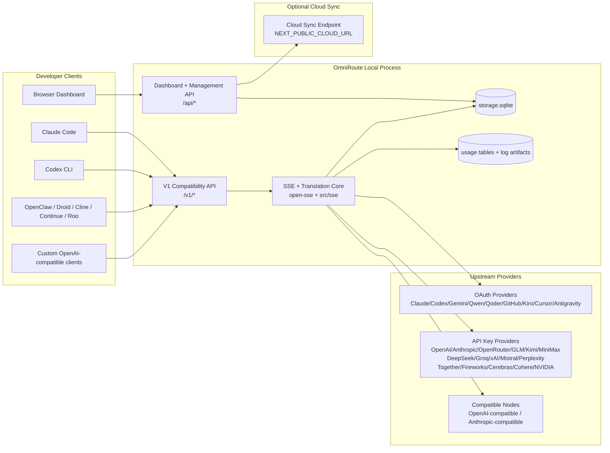
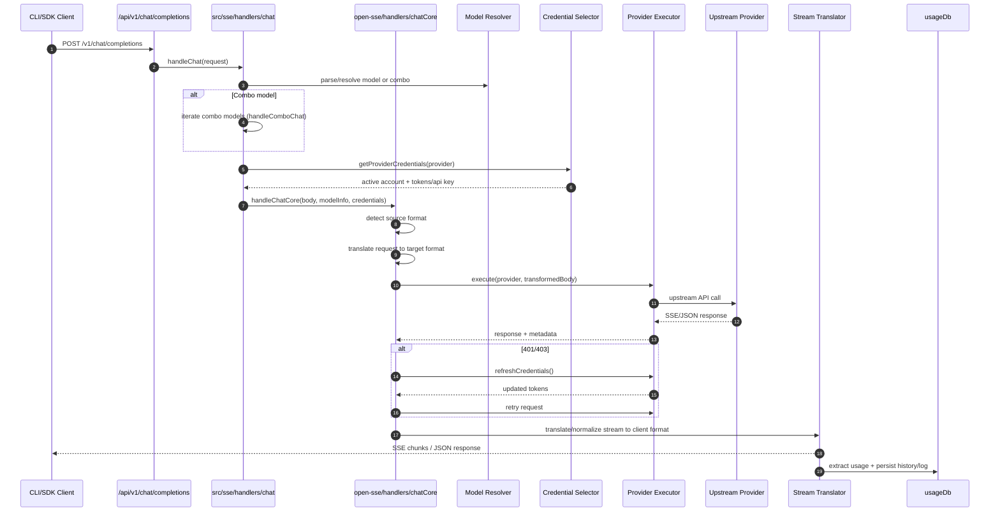
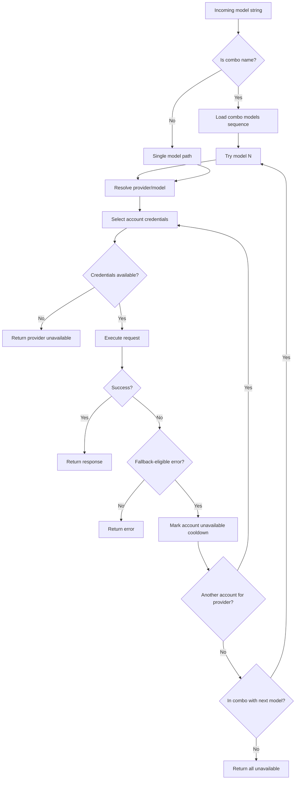
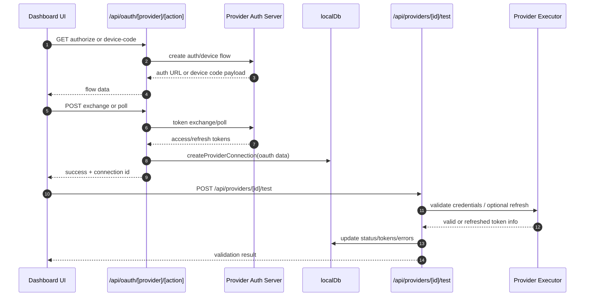
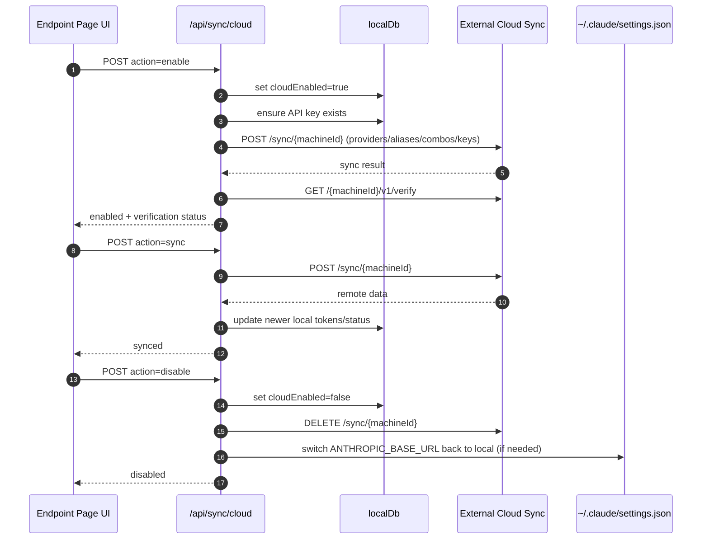
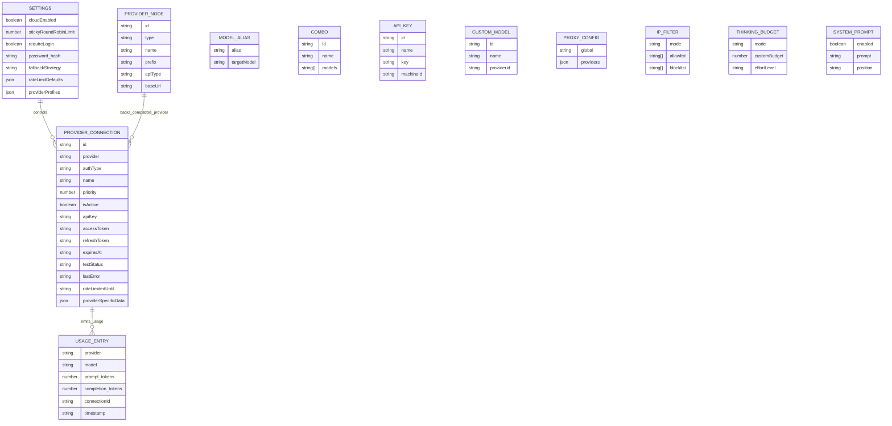
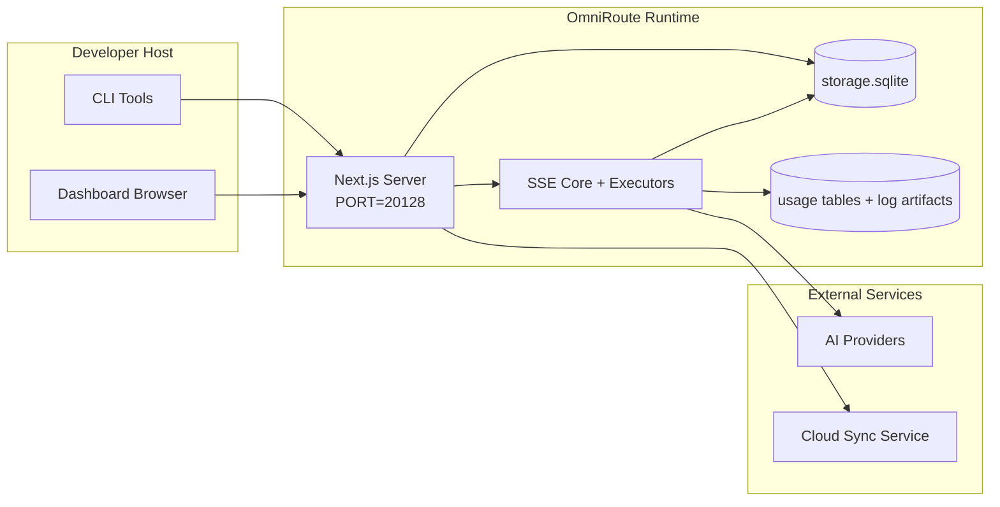

# OmniRoute Architecture (한국어)

🌐 **Languages:** 🇺🇸 [English](../../../../docs/ARCHITECTURE.md) · 🇪🇸 [es](../../es/docs/ARCHITECTURE.md) · 🇫🇷 [fr](../../fr/docs/ARCHITECTURE.md) · 🇩🇪 [de](../../de/docs/ARCHITECTURE.md) · 🇮🇹 [it](../../it/docs/ARCHITECTURE.md) · 🇷🇺 [ru](../../ru/docs/ARCHITECTURE.md) · 🇨🇳 [zh-CN](../../zh-CN/docs/ARCHITECTURE.md) · 🇯🇵 [ja](../../ja/docs/ARCHITECTURE.md) · 🇰🇷 [ko](../../ko/docs/ARCHITECTURE.md) · 🇸🇦 [ar](../../ar/docs/ARCHITECTURE.md) · 🇮🇳 [hi](../../hi/docs/ARCHITECTURE.md) · 🇮🇳 [in](../../in/docs/ARCHITECTURE.md) · 🇹🇭 [th](../../th/docs/ARCHITECTURE.md) · 🇻🇳 [vi](../../vi/docs/ARCHITECTURE.md) · 🇮🇩 [id](../../id/docs/ARCHITECTURE.md) · 🇲🇾 [ms](../../ms/docs/ARCHITECTURE.md) · 🇳🇱 [nl](../../nl/docs/ARCHITECTURE.md) · 🇵🇱 [pl](../../pl/docs/ARCHITECTURE.md) · 🇸🇪 [sv](../../sv/docs/ARCHITECTURE.md) · 🇳🇴 [no](../../no/docs/ARCHITECTURE.md) · 🇩🇰 [da](../../da/docs/ARCHITECTURE.md) · 🇫🇮 [fi](../../fi/docs/ARCHITECTURE.md) · 🇵🇹 [pt](../../pt/docs/ARCHITECTURE.md) · 🇷🇴 [ro](../../ro/docs/ARCHITECTURE.md) · 🇭🇺 [hu](../../hu/docs/ARCHITECTURE.md) · 🇧🇬 [bg](../../bg/docs/ARCHITECTURE.md) · 🇸🇰 [sk](../../sk/docs/ARCHITECTURE.md) · 🇺🇦 [uk-UA](../../uk-UA/docs/ARCHITECTURE.md) · 🇮🇱 [he](../../he/docs/ARCHITECTURE.md) · 🇵🇭 [phi](../../phi/docs/ARCHITECTURE.md) · 🇧🇷 [pt-BR](../../pt-BR/docs/ARCHITECTURE.md) · 🇨🇿 [cs](../../cs/docs/ARCHITECTURE.md) · 🇹🇷 [tr](../../tr/docs/ARCHITECTURE.md)

---

_최종 업데이트 날짜: 2026-03-28_## Executive Summary

OmniRoute는 Next.js를 기반으로 구축된 로컬 AI 라우팅 게이트웨이이자 대시보드입니다.
단일 OpenAI 호환 엔드포인트(`/v1/*`)를 제공하고 변환, 대체, 토큰 새로 고침 및 사용량 추적을 통해 여러 업스트림 공급자 간에 트래픽을 라우팅합니다.

핵심 기능:

- CLI/도구용 OpenAI 호환 API 표면(28개 공급자)
- 공급자 형식에 따른 요청/응답 번역
- 모델 콤보 대체(다중 모델 시퀀스)
- 계정 수준 대체(제공업체당 다중 계정)
- OAuth + API 키 공급자 연결 관리
- `/v1/embeddings`를 통한 임베딩 생성(6개 공급자, 9개 모델)
- `/v1/images/ Generations`를 통한 이미지 생성(4개 공급자, 9개 모델)
- 추론 모델을 위한 Think 태그 구문 분석(`<think>...</think>`)
- 엄격한 OpenAI SDK 호환성을 위한 응답 삭제
- 제공자 간 호환성을 위한 역할 정규화(개발자→시스템, 시스템→사용자)
- 구조화된 출력 변환(json_schema → Gemini responseSchema)
- 공급자, 키, 별칭, 콤보, 설정, 가격에 대한 로컬 지속성
- Usage/cost tracking and request logging
- 다중 장치/상태 동기화를 위한 선택적 클라우드 동기화
- API 접근 제어를 위한 IP 허용 목록/차단 목록
- 생각하는 예산 관리(패스스루/자동/커스텀/적응형)
- 글로벌 시스템 신속한 주입
- 세션 추적 및 지문 채취
- 제공자별 프로필을 통해 계정당 강화된 속도 제한
- 공급자 탄력성을 위한 회로 차단기 패턴
- 뮤텍스 잠금을 통한 천둥 방지 무리 보호
- 서명 기반 요청 중복 제거 캐시
- 도메인 레이어: 모델 가용성, 비용 규칙, 대체 정책, 잠금 정책
- 도메인 상태 지속성(폴백, 예산, 잠금, 회로 차단기를 위한 SQLite 연속 쓰기 캐시)
- 중앙화된 요청 평가를 위한 정책 엔진(잠금 → 예산 → 대체)
- p50/p95/p99 대기 시간 집계를 통한 원격 측정 요청
- 종단 간 추적을 위한 상관 ID(X-Request-Id)
- API 키별로 옵트아웃이 가능한 규정 준수 감사 로깅
- LLM 품질 보증을 위한 평가 프레임워크
- 실시간 회로 차단기 상태가 포함된 탄력성 UI 대시보드
- 모듈형 OAuth 제공자(`src/lib/oauth/providers/` 아래의 개별 모듈 12개)

기본 런타임 모델:

- `src/app/api/*` 아래의 Next.js 앱 경로는 대시보드 API와 호환성 API를 모두 구현합니다.
- `src/sse/*` + `open-sse/*`의 공유 SSE/라우팅 코어는 공급자 실행, 변환, 스트리밍, 대체 및 사용을 처리합니다.## Scope and Boundaries

### In Scope

- 로컬 게이트웨이 런타임
- 대시보드 관리 API
- 공급자 인증 및 토큰 새로 고침
- 번역 및 SSE 스트리밍 요청
- 로컬 상태 + 사용 지속성
- 선택적인 클라우드 동기화 조정### Out of Scope

- `NEXT_PUBLIC_CLOUD_URL` 뒤에 클라우드 서비스 구현
- 로컬 프로세스 외부의 공급자 SLA/제어 평면
- 외부 CLI 바이너리 자체(Claude CLI, Codex CLI 등)## Dashboard Surface (Current)

`src/app/(dashboard)/dashboard/` 아래의 기본 페이지:

- `/dashboard` — 빠른 시작 + 공급자 개요
- `/dashboard/endpoint` — 엔드포인트 프록시 + MCP + A2A + API 엔드포인트 탭
- `/dashboard/providers` — 공급자 연결 및 자격 증명
- `/dashboard/combos` — 콤보 전략, 템플릿, 모델 라우팅 규칙
- `/dashboard/costs` — 비용 집계 및 가격 가시성
- `/dashboard/analytics` — 사용 분석 및 평가
- `/dashboard/limits` — 할당량/비율 제어
- `/dashboard/cli-tools` — CLI 온보딩, 런타임 감지, 구성 생성
- `/dashboard/agents` — 감지된 ACP 에이전트 + 사용자 지정 에이전트 등록
- `/dashboard/media` — 이미지/비디오/음악 놀이터
- `/dashboard/search-tools` — 검색 공급자 테스트 및 기록
- `/dashboard/health` — 가동 시간, 회로 차단기, 속도 제한
- `/dashboard/logs` — 요청/프록시/감사/콘솔 로그
- `/dashboard/settings` — 시스템 설정 탭(일반, 라우팅, 콤보 기본값 등)
- `/dashboard/api-manager` — API 키 수명 주기 및 모델 권한## High-Level System Context



## Core Runtime Components

## 1) API and Routing Layer (Next.js App Routes)

주요 디렉토리:

- 호환성 API를 위한 `src/app/api/v1/*` 및 `src/app/api/v1beta/*`
- 관리/구성 API용 `src/app/api/*`
- 다음은 `next.config.mjs` 맵 `/v1/*`을 `/api/v1/*`로 다시 작성합니다.

중요한 호환성 경로:

- `src/app/api/v1/chat/completions/route.ts` -`src/app/api/v1/messages/route.ts` -`src/app/api/v1/responses/route.ts`
- `src/app/api/v1/models/route.ts` — `custom: true`를 사용하는 사용자 정의 모델을 포함합니다.
- `src/app/api/v1/embeddings/route.ts` — 임베딩 생성(6개 공급자)
- `src/app/api/v1/images/세대/route.ts` — 이미지 생성(Antigravity/Nebius를 포함한 4개 이상의 공급자) -`src/app/api/v1/messages/count_tokens/route.ts`
- `src/app/api/v1/providers/[provider]/chat/completions/route.ts` — 제공자별 전용 채팅
- `src/app/api/v1/providers/[provider]/embeddings/route.ts` — 제공자별 전용 임베딩
- `src/app/api/v1/providers/[provider]/images/ Generations/route.ts` — 제공자별 전용 이미지 -`src/app/api/v1beta/models/route.ts`
- `src/app/api/v1beta/models/[...경로]/route.ts`

관리 도메인:

- 인증/설정: `src/app/api/auth/*`, `src/app/api/settings/*`
- 공급자/연결: `src/app/api/providers*`
- 공급자 노드: `src/app/api/provider-nodes*`
- 사용자 정의 모델: `src/app/api/provider-models`(GET/POST/DELETE)
- 모델 카탈로그: `src/app/api/models/route.ts`(GET)
- 프록시 구성: `src/app/api/settings/proxy`(GET/PUT/DELETE) + `src/app/api/settings/proxy/test`(POST)
- OAuth: `src/app/api/oauth/*`
- 키/별칭/콤보/가격: `src/app/api/keys*`, `src/app/api/models/alias`, `src/app/api/combos*`, `src/app/api/pricing`
- 사용법: `src/app/api/usage/*`
- 동기화/클라우드: `src/app/api/sync/*`, `src/app/api/cloud/*`
- CLI 도구 도우미: `src/app/api/cli-tools/*`
- IP 필터: `src/app/api/settings/ip-filter`(GET/PUT)
- 생각하는 예산: `src/app/api/settings/thinking-budget` (GET/PUT)
- 시스템 프롬프트: `src/app/api/settings/system-prompt`(GET/PUT)
- 세션: `src/app/api/sessions`(GET)
- 속도 제한: `src/app/api/rate-limits`(GET)
- 복원력: `src/app/api/resilience`(GET/PATCH) — 공급자 프로필, 회로 차단기, 속도 제한 상태
- 복원력 재설정: `src/app/api/resilience/reset`(POST) — 재설정 차단기 + 재사용 대기시간
- 캐시 통계: `src/app/api/cache/stats`(GET/DELETE)
- 모델 가용성: `src/app/api/models/availability`(GET/POST)
- 원격 측정: `src/app/api/telemetry/summary`(GET)
- 예산: `src/app/api/usage/budget`(GET/POST)
- 대체 체인: `src/app/api/fallback/chains`(GET/POST/DELETE)
- 규정 준수 감사: `src/app/api/compliance/audit-log`(GET)
- 평가: `src/app/api/evals`(GET/POST), `src/app/api/evals/[suiteId]`(GET)
- 정책: `src/app/api/policies`(GET/POST)## 2) SSE + Translation Core

주요 흐름 모듈:

- 항목: `src/sse/handlers/chat.ts`
- 핵심 오케스트레이션: `open-sse/handlers/chatCore.ts`
- 공급자 실행 어댑터: `open-sse/executors/*`
- 형식 감지/공급자 구성: `open-sse/services/provider.ts`
- 모델 구문 분석/해결: `src/sse/services/model.ts`, `open-sse/services/model.ts`
- 계정 대체 논리: `open-sse/services/accountFallback.ts`
- 번역 레지스트리: `open-sse/translator/index.ts`
- 스트림 변환: `open-sse/utils/stream.ts`, `open-sse/utils/streamHandler.ts`
- 사용량 추출/정규화: `open-sse/utils/usageTracking.ts`
- Think 태그 파서: `open-sse/utils/thinkTagParser.ts`
- 임베딩 핸들러: `open-sse/handlers/embeddings.ts`
- 포함 공급자 레지스트리: `open-sse/config/embeddingRegistry.ts`
- 이미지 생성 핸들러: `open-sse/handlers/imageGeneration.ts`
- 이미지 제공자 레지스트리: `open-sse/config/imageRegistry.ts`
- 응답 삭제: `open-sse/handlers/responseSanitizer.ts`
- 역할 정규화: `open-sse/services/roleNormalizer.ts`

서비스(비즈니스 로직):

- 계정 선택/점수: `open-sse/services/accountSelector.ts`
- 컨텍스트 수명주기 관리: `open-sse/services/contextManager.ts`
- IP 필터 적용: `open-sse/services/ipFilter.ts`
- 세션 추적: `open-sse/services/sessionManager.ts`
- 중복 제거 요청: `open-sse/services/signatureCache.ts`
- 시스템 프롬프트 주입: `open-sse/services/systemPrompt.ts`
- 생각하는 예산 관리: `open-sse/services/thinkingBudget.ts`
- 와일드카드 모델 라우팅: `open-sse/services/wildcardRouter.ts`
- 비율 제한 관리: `open-sse/services/rateLimitManager.ts`
- 회로 차단기: `open-sse/services/circuitBreaker.ts`

도메인 레이어 모듈:

- 모델 가용성: `src/lib/domain/modelAvailability.ts`
- 비용 규칙/예산: `src/lib/domain/costRules.ts`
- 대체 정책: `src/lib/domain/fallbackPolicy.ts`
- 콤보 리졸버: `src/lib/domain/comboResolver.ts`
- 잠금 정책: `src/lib/domain/lockoutPolicy.ts`
- 정책 엔진: `src/domain/policyEngine.ts` — 중앙 집중식 잠금 → 예산 → 대체 평가
- 오류 코드 카탈로그: `src/lib/domain/errorCodes.ts`
- 요청 ID: `src/lib/domain/requestId.ts`
- 가져오기 시간 초과: `src/lib/domain/fetchTimeout.ts`
- 원격 측정 요청: `src/lib/domain/requestTelemetry.ts`
- 규정 준수/감사: `src/lib/domain/compliance/index.ts`
- 평가 실행기: `src/lib/domain/evalRunner.ts`
- 도메인 상태 지속성: `src/lib/db/domainState.ts` — 폴백 체인, 예산, 비용 기록, 잠금 상태, 회로 차단기를 위한 SQLite CRUD

OAuth 제공자 모듈(`src/lib/oauth/providers/` 아래의 개별 파일 12개):

- 레지스트리 인덱스: `src/lib/oauth/providers/index.ts`
- 개별 제공자: `claude.ts`, `codex.ts`, `gemini.ts`, `antigravity.ts`, `qoder.ts`, `qwen.ts`, `kimi-coding.ts`, `github.ts`, `kiro.ts`, `cursor.ts`, `kilocode.ts`, `cline.ts`
- 씬 래퍼: `src/lib/oauth/providers.ts` — 개별 모듈에서 다시 내보내기## 3) Persistence Layer

기본 상태 DB(SQLite):

- 핵심 인프라: `src/lib/db/core.ts`(better-sqlite3, 마이그레이션, WAL)
- 파사드 다시 내보내기: `src/lib/localDb.ts`(호출자를 위한 얇은 호환성 레이어)
- 파일: `${DATA_DIR}/storage.sqlite`(또는 설정된 경우 `$XDG_CONFIG_HOME/omniroute/storage.sqlite`, 그렇지 않으면 `~/.omniroute/storage.sqlite`)
- 엔터티(테이블 + KV 네임스페이스): 공급자 연결, 공급자 노드, 모델 별칭, 콤보, apiKeys, 설정, 가격 책정,**customModels**,**proxyConfig**,**ipFilter**,**thinkingBudget**,**systemPrompt**

사용 지속성:

- 외관: `src/lib/usageDb.ts`(`src/lib/usage/*`에서 분해된 모듈)
- `storage.sqlite`의 SQLite 테이블: `usage_history`, `call_logs`, `proxy_logs`
- 호환성/디버그를 위해 선택적 파일 아티팩트가 남아 있습니다(`${DATA_DIR}/log.txt`, `${DATA_DIR}/call_logs/`, `<repo>/logs/...`)
- 레거시 JSON 파일이 있는 경우 시작 마이그레이션을 통해 SQLite로 마이그레이션됩니다.

도메인 상태 DB(SQLite):

- `src/lib/db/domainState.ts` — 도메인 상태에 대한 CRUD 작업
- 테이블(`src/lib/db/core.ts`에서 생성됨): `domain_fallback_chains`, `domain_budgets`, `domain_cost_history`, `domain_lockout_state`, `domain_circuit_breakers`
- 연속 쓰기 캐시 패턴: 메모리 내 맵은 런타임 시 권한을 갖습니다. 변이는 SQLite에 동기적으로 기록됩니다. 콜드 스타트 ​​시 DB에서 상태가 복원됩니다.## 4) Auth + Security Surfaces

- 대시보드 쿠키 인증: `src/proxy.ts`, `src/app/api/auth/login/route.ts`
- API 키 생성/검증: `src/shared/utils/apiKey.ts`
- 'providerConnections' 항목에 유지되는 공급자 비밀
- `open-sse/utils/proxyFetch.ts`(env vars) 및 `open-sse/utils/networkProxy.ts`(공급자별로 구성 가능 또는 전역)를 통한 아웃바운드 프록시 지원## 5) Cloud Sync

- 스케줄러 초기화: `src/lib/initCloudSync.ts`, `src/shared/services/initializeCloudSync.ts`, `src/shared/services/modelSyncScheduler.ts`
- 정기 작업: `src/shared/services/cloudSyncScheduler.ts`
- 주기적 작업: `src/shared/services/modelSyncScheduler.ts`
- 제어 경로: `src/app/api/sync/cloud/route.ts`## Request Lifecycle (`/v1/chat/completions`)



## Combo + Account Fallback Flow



폴백 결정은 상태 코드와 오류 메시지 경험적 방법을 사용하는 'open-sse/services/accountFallback.ts'에 의해 이루어집니다. 콤보 라우팅은 하나의 추가 보호 기능을 추가합니다. 업스트림 콘텐츠 블록 및 역할 검증 실패와 같은 공급자 범위 400은 모델 로컬 실패로 처리되므로 이후 콤보 대상이 계속 실행될 수 있습니다.## OAuth Onboarding and Token Refresh Lifecycle



실시간 트래픽 중 새로 고침은 실행기 `refreshCredentials()`를 통해 `open-sse/handlers/chatCore.ts` 내에서 실행됩니다.## Cloud Sync Lifecycle (Enable / Sync / Disable)



클라우드가 활성화되면 `CloudSyncScheduler`에 의해 주기적 동기화가 트리거됩니다.## Data Model and Storage Map



물리적 저장 파일:

- 기본 런타임 DB: `${DATA_DIR}/storage.sqlite`
- 요청 로그 줄: `${DATA_DIR}/log.txt`(compat/debug 아티팩트)
- 구조화된 호출 페이로드 아카이브: `${DATA_DIR}/call_logs/`
- 선택적 변환기/요청 디버그 세션: `<repo>/logs/...`## Deployment Topology



## Module Mapping (Decision-Critical)

### Route and API Modules

- `src/app/api/v1/*`, `src/app/api/v1beta/*`: 호환성 API
- `src/app/api/v1/providers/[provider]/*`: 제공자별 전용 경로(채팅, 임베딩, 이미지)
- `src/app/api/providers*`: 공급자 CRUD, 유효성 검사, 테스트
- `src/app/api/provider-nodes*`: 맞춤형 호환 노드 관리
- `src/app/api/provider-models`: 사용자 정의 모델 관리(CRUD)
- `src/app/api/models/route.ts`: 모델 카탈로그 API(별칭 + 사용자 정의 모델)
- `src/app/api/oauth/*`: OAuth/장치 코드 흐름
- `src/app/api/keys*`: 로컬 API 키 수명 주기
- `src/app/api/models/alias`: 별칭 관리
- `src/app/api/combos*`: 대체 콤보 관리
- `src/app/api/pricing`: 비용 계산을 위한 가격 재정의
- `src/app/api/settings/proxy`: 프록시 구성(GET/PUT/DELETE)
- `src/app/api/settings/proxy/test`: 아웃바운드 프록시 연결 테스트(POST)
- `src/app/api/usage/*`: 사용 및 로그 API
- `src/app/api/sync/*` + `src/app/api/cloud/*`: 클라우드 동기화 및 클라우드 연결 도우미
- `src/app/api/cli-tools/*`: 로컬 CLI 구성 작성자/검사기
- `src/app/api/settings/ip-filter`: IP 허용 목록/차단 목록(GET/PUT)
- `src/app/api/settings/thinking-budget`: Thinking Token 예산 구성(GET/PUT)
- `src/app/api/settings/system-prompt`: 전역 시스템 프롬프트(GET/PUT)
- `src/app/api/sessions`: 활성 세션 목록(GET)
- `src/app/api/rate-limits`: 계정별 비율 제한 상태(GET)### Routing and Execution Core

- `src/sse/handlers/chat.ts`: 요청 구문 분석, 콤보 처리, 계정 선택 루프
- `open-sse/handlers/chatCore.ts`: 변환, 실행기 디스패치, 재시도/새로 고침 처리, 스트림 설정
- `open-sse/executors/*`: 공급자별 네트워크 및 형식 동작### Translation Registry and Format Converters

- `open-sse/translator/index.ts`: 번역기 레지스트리 및 오케스트레이션
- 번역자 요청: `open-sse/translator/request/*`
- 응답 번역기: `open-sse/translator/response/*`
- 형식 상수: `open-sse/translator/formats.ts`### Persistence

- `src/lib/db/*`: SQLite의 지속적인 구성/상태 및 도메인 지속성
- `src/lib/localDb.ts`: DB 모듈에 대한 호환성 다시 내보내기
- `src/lib/usageDb.ts`: SQLite 테이블 위에 있는 사용 내역/호출 로그 파사드## Provider Executor Coverage (Strategy Pattern)

각 공급자에는 URL 구축, 헤더 구성, 지수 백오프를 사용한 재시도, 자격 증명 새로 고침 후크 및 `execute()` 조정 방법을 제공하는 `BaseExecutor`(`open-sse/executors/base.ts`에 있음)를 확장하는 특수 실행기가 있습니다.

| 집행자              | 공급자                                                                                                                                                       | 특수취급                                                      |
| ------------------- | ------------------------------------------------------------------------------------------------------------------------------------------------------------ | ------------------------------------------------------------- |
| `기본 실행자`       | OpenAI, Claude, Gemini, Qwen, Qoder, OpenRouter, GLM, Kimi, MiniMax, DeepSeek, Groq, xAI, Mistral, Perplexity, Together, Fireworks, Cerebras, Cohere, NVIDIA | 공급자별 동적 URL/헤더 구성                                   |
| '반중력실행자'      | 구글 반중력                                                                                                                                                  | 사용자 정의 프로젝트/세션 ID, 구문 분석 후 재시도             |
| `CodexExecutor`     | OpenAI 코덱스                                                                                                                                                | 시스템 지침을 주입하고 추론 노력을 강요                       |
| `CursorExecutor`    | 커서 IDE                                                                                                                                                     | ConnectRPC 프로토콜, Protobuf 인코딩, 체크섬을 통한 서명 요청 |
| `GithubExecutor`    | GitHub 부조종사                                                                                                                                              | Copilot 토큰 새로 고침, VSCode 모방 헤더                      |
| '키로집행자'        | AWS 코드위스퍼러/키로                                                                                                                                        | AWS EventStream 바이너리 형식 → SSE 변환                      |
| `GeminiCLIExecutor` | 제미니 CLI                                                                                                                                                   | Google OAuth 토큰 새로고침 주기                               |

다른 모든 공급자(사용자 정의 호환 노드 포함)는 `DefaultExecutor`를 사용합니다.## Provider Compatibility Matrix

| 공급자            | 형식           | 인증                 | 스트림            | 비스트림 | 토큰 새로고침 | 사용 API           |
| ----------------- | -------------- | -------------------- | ----------------- | -------- | ------------- | ------------------ | ------------------------------ |
| 클로드            | 클로드         | API 키/OAuth         | ✅                | ✅       | ✅            | ⚠️ 관리자 전용     |
| 쌍둥이자리        | 쌍둥이자리     | API 키/OAuth         | ✅                | ✅       | ✅            | ⚠️ 클라우드 콘솔   |
| 제미니 CLI        | 쌍둥이자리 CLI | OAuth                | ✅                | ✅       | ✅            | ⚠️ 클라우드 콘솔   |
| 반중력            | 반중력         | OAuth                | ✅                | ✅       | ✅            | ✅ 전체 할당량 API |
| 오픈AI            | 공개           | API 키               | ✅                | ✅       | ❌            | ❌                 |
| 코덱스            | openai-응답    | OAuth                | ✅ 강제           | ❌       | ✅            | ✅ 비율 제한       |
| GitHub 부조종사   | 공개           | OAuth + Copilot 토큰 | ✅                | ✅       | ✅            | ✅ 할당량 스냅샷   |
| 커서              | 커서           | 사용자 정의 체크섬   | ✅                | ✅       | ❌            | ❌                 |
| 키로              | 키로           | AWS SSO OIDC         | ✅ (이벤트스트림) | ❌       | ✅            | ✅ 사용 제한       |
| 퀀                | 공개           | OAuth                | ✅                | ✅       | ✅            | ⚠️ 요청에 따라     |
| Qoder             | 공개           | OAuth(기본)          | ✅                | ✅       | ✅            | ⚠️ 요청에 따라     |
| 오픈라우터        | 공개           | API 키               | ✅                | ✅       | ❌            | ❌                 |
| GLM/키미/미니맥스 | 클로드         | API 키               | ✅                | ✅       | ❌            | ❌                 |
| 딥시크            | 공개           | API 키               | ✅                | ✅       | ❌            | ❌                 |
| 그로크            | 공개           | API 키               | ✅                | ✅       | ❌            | ❌                 |
| xAI(그록)         | 공개           | API 키               | ✅                | ✅       | ❌            | ❌                 |
| 미스트랄          | 공개           | API 키               | ✅                | ✅       | ❌            | ❌                 |
| 당혹감            | 공개           | API 키               | ✅                | ✅       | ❌            | ❌                 |
| 함께하는 AI       | 공개           | API 키               | ✅                | ✅       | ❌            | ❌                 |
| 불꽃놀이 AI       | 공개           | API 키               | ✅                | ✅       | ❌            | ❌                 |
| 대뇌              | 공개           | API 키               | ✅                | ✅       | ❌            | ❌                 |
| 코히어            | 공개           | API 키               | ✅                | ✅       | ❌            | ❌                 |
| 엔비디아 NIM      | 공개           | API 키               | ✅                | ✅       | ❌            | ❌                 | ## Format Translation Coverage |

감지된 소스 형식은 다음과 같습니다.

- 'openai' -`openai-응답`
- '클로드'
- `쌍둥이자리`

대상 형식은 다음과 같습니다.

- OpenAI 채팅/응답
- 클로드
- Gemini/Gemini-CLI/반중력 봉투
- 키로
- 커서

번역에서는**OpenAI를 허브 형식**으로 사용합니다. 모든 변환은 중간 형식으로 OpenAI를 거칩니다.```
Source Format → OpenAI (hub) → Target Format

````

번역은 소스 페이로드 형태와 공급자 대상 형식에 따라 동적으로 선택됩니다.

번역 파이프라인의 추가 처리 계층:

-**응답 삭제**— OpenAI 형식 응답(스트리밍 및 비스트리밍 모두)에서 비표준 필드를 제거하여 엄격한 SDK 규정 준수를 보장합니다.
-**역할 정규화**— OpenAI가 아닌 대상에 대해 `개발자` → `시스템`을 변환합니다. 시스템 역할을 거부하는 모델의 경우 `system` → `user`를 병합합니다(GLM, ERNIE)
-**Think 태그 추출**— 콘텐츠의 `<think>...</think>` 블록을 `reasoning_content` 필드로 구문 분석합니다.
-**구조화된 출력**— OpenAI `response_format.json_schema`를 Gemini의 `responseMimeType` + `responseSchema`로 변환합니다.## Supported API Endpoints

| 엔드포인트 | 형식 | 핸들러 |
| ------------------------------------- | ------------------ | ------------------------------------------------------ |
| `POST /v1/chat/completions` | OpenAI 채팅 | `src/sse/handlers/chat.ts` |
| `POST /v1/messages` | 클로드 메시지 | 동일한 핸들러(자동 감지) |
| `POST /v1/응답` | OpenAI 응답 | `open-sse/handlers/responsesHandler.ts` |
| `POST /v1/임베딩` | OpenAI 임베딩 | `open-sse/handlers/embeddings.ts` |
| `GET /v1/embeddings` | 모델 목록 | API 경로 |
| `POST /v1/이미지/세대` | OpenAI 이미지 | `open-sse/handlers/imageGeneration.ts` |
| `GET /v1/이미지/세대` | 모델 목록 | API 경로 |
| `POST /v1/providers/{provider}/chat/completions` | OpenAI 채팅 | 모델 검증을 통한 제공자별 전용 |
| `POST /v1/providers/{provider}/embeddings` | OpenAI 임베딩 | 모델 검증을 통한 제공자별 전용 |
| `POST /v1/providers/{provider}/이미지/세대` | OpenAI 이미지 | 모델 검증을 통한 제공자별 전용 |
| `POST /v1/messages/count_tokens` | 클로드 토큰 개수 | API 경로 |
| `GET /v1/models` | OpenAI 모델 목록 | API 경로(채팅 + 임베딩 + 이미지 + 사용자 정의 모델) |
| `GET /api/models/catalog` | 카탈로그 | 공급자 + 유형별로 그룹화된 모든 모델 |
| `POST /v1beta/models/*:streamGenerateContent` | 쌍둥이 자리 원주민 | API 경로 |
| `GET/PUT/DELETE /api/settings/proxy` | 프록시 구성 | 네트워크 프록시 구성 |
| `POST /api/settings/proxy/test` | 프록시 연결 | 프록시 상태/연결 테스트 엔드포인트 |
| `GET/POST/DELETE /api/provider-models` | 공급자 모델 | 사용자 정의 및 관리형 사용 가능한 모델을 지원하는 공급자 모델 메타데이터 |## Bypass Handler

우회 핸들러(`open-sse/utils/bypassHandler.ts`)는 Claude CLI의 알려진 "일시적" 요청(예열 핑, 타이틀 추출 및 토큰 카운트)을 가로채고 업스트림 공급자 토큰을 사용하지 않고**가짜 응답**을 반환합니다. 이는 `User-Agent`에 `claude-cli`가 포함된 경우에만 트리거됩니다.## Request Logger Pipeline

요청 로거(`open-sse/utils/requestLogger.ts`)는 기본적으로 비활성화되고 `ENABLE_REQUEST_LOGS=true`를 통해 활성화되는 7단계 디버그 로깅 파이프라인을 제공합니다.```
1_req_client.json → 2_req_source.json → 3_req_openai.json → 4_req_target.json
→ 5_res_provider.txt → 6_res_openai.txt → 7_res_client.txt
````

각 요청 세션마다 `<repo>/logs/<session>/`에 파일이 기록됩니다.## Failure Modes and Resilience

## 1) Account/Provider Availability

- 일시적/속도/인증 오류에 대한 공급자 계정 쿨다운
- 요청 실패 전 계정 대체
- 현재 모델/공급자 경로가 소진되면 콤보 모델 대체## 2) Token Expiry

- 새로 고칠 수 있는 공급자에 대한 사전 확인 및 재시도를 통한 새로 고침
- 코어 경로에서 새로 고침 시도 후 401/403 재시도## 3) Stream Safety

- 연결 해제 인식 스트림 컨트롤러
- 스트림 끝 플러시 및 `[DONE]` 처리가 포함된 번역 스트림
- 공급자 사용량 메타데이터가 누락된 경우 사용량 추정 대체## 4) Cloud Sync Degradation

- 동기화 오류가 표시되지만 로컬 런타임은 계속됩니다.
- 스케줄러에는 재시도 가능 논리가 있지만 주기적인 실행은 현재 기본적으로 단일 시도 동기화를 호출합니다.## 5) Data Integrity

- 시작 시 SQLite 스키마 마이그레이션 및 자동 업그레이드 후크
- 레거시 JSON → SQLite 마이그레이션 호환성 경로## Observability and Operational Signals

런타임 가시성 소스:

-`src/sse/utils/logger.ts`의 콘솔 로그

- SQLite의 요청별 사용량 집계(`usage_history`, `call_logs`, `proxy_logs`)
- `settings.detailed_logs_enabled=true`인 경우 SQLite(`request_detail_logs`)에서 4단계 상세 페이로드 캡처
- `log.txt`의 텍스트 요청 상태 로그(선택 사항/호환)
- `ENABLE_REQUEST_LOGS=true`인 경우 `logs/` 아래의 선택적 심층 요청/변환 로그
- UI 소비를 위한 대시보드 사용 엔드포인트(`/api/usage/*`)

세부 요청 페이로드 캡처는 라우팅된 호출당 최대 4개의 JSON 페이로드 단계를 저장합니다.

- 클라이언트로부터 받은 원시 요청
- 번역된 요청이 실제로 업스트림으로 전송됨
- 공급자 응답이 JSON으로 재구성되었습니다. 스트리밍된 응답은 최종 요약과 스트림 메타데이터로 압축됩니다.
- OmniRoute에서 반환된 최종 클라이언트 응답 스트리밍된 응답은 동일한 압축 요약 형식으로 저장됩니다.## Security-Sensitive Boundaries

- JWT 비밀(`JWT_SECRET`)은 대시보드 세션 쿠키 확인/서명을 보호합니다.
- 최초 실행 프로비저닝을 위해 초기 비밀번호 부트스트랩(`INITIAL_PASSWORD`)을 명시적으로 구성해야 합니다.
- API 키 HMAC 비밀(`API_KEY_SECRET`)은 생성된 로컬 API 키 형식을 보호합니다.
- 공급자 비밀(API 키/토큰)은 로컬 DB에 유지되며 파일 시스템 수준에서 보호되어야 합니다.
- 클라우드 동기화 엔드포인트는 API 키 인증 + 머신 ID 의미 체계를 사용합니다.## Environment and Runtime Matrix

코드에서 적극적으로 사용되는 환경 변수:

- 앱/인증: `JWT_SECRET`, `INITIAL_PASSWORD`
- 저장공간: `DATA_DIR`
- 호환 노드 동작: `ALLOW_MULTI_CONNECTIONS_PER_COMPAT_NODE`
- 선택적 저장소 기반 재정의(`DATA_DIR`이 설정되지 않은 경우 Linux/macOS): `XDG_CONFIG_HOME`
- 보안 해싱: `API_KEY_SECRET`, `MACHINE_ID_SALT`
- 로깅: `ENABLE_REQUEST_LOGS`
- 동기화/클라우드 URL 지정: `NEXT_PUBLIC_BASE_URL`, `NEXT_PUBLIC_CLOUD_URL`
- 아웃바운드 프록시: `HTTP_PROXY`, `HTTPS_PROXY`, `ALL_PROXY`, `NO_PROXY` 및 소문자 변형
- SOCKS5 기능 플래그: `ENABLE_SOCKS5_PROXY`, `NEXT_PUBLIC_ENABLE_SOCKS5_PROXY`
- 플랫폼/런타임 도우미(앱별 구성 아님): `APPDATA`, `NODE_ENV`, `PORT`, `HOSTNAME`## Known Architectural Notes

1. `usageDb` 및 `localDb`는 레거시 파일 마이그레이션과 동일한 기본 디렉터리 정책(`DATA_DIR` -> `XDG_CONFIG_HOME/omniroute` -> `~/.omniroute`)을 공유합니다.
2. 의미적 드리프트를 피하기 위해 `/api/v1/route.ts`는 `/api/v1/models`(`src/app/api/v1/models/catalog.ts`)에서 사용되는 동일한 통합 카탈로그 빌더에 위임합니다.
3. 요청 로거가 활성화되면 전체 헤더/본문을 씁니다. 로그 디렉토리를 중요하게 취급하십시오.
4. 클라우드 동작은 올바른 'NEXT_PUBLIC_BASE_URL' 및 클라우드 엔드포인트 연결 가능성에 따라 달라집니다.
5. `open-sse/` 디렉터리는 `@omniroute/open-sse`**npm 작업 공간 패키지**로 게시됩니다. 소스 코드는 `@omniroute/open-sse/...`(Next.js `transpilePackages`로 해결됨)를 통해 이를 가져옵니다. 이 문서의 파일 경로는 일관성을 위해 여전히 `open-sse/` 디렉토리 이름을 사용합니다.
6. 대시보드의 차트는 액세스 가능한 대화형 분석 시각화(모델 사용량 막대 차트, 성공률이 포함된 공급자 분석 테이블)를 위해**Recharts**(SVG 기반)를 사용합니다.
7. E2E 테스트는**Playwright**(`tests/e2e/`)를 사용하고 `npm run test:e2e`를 통해 실행됩니다. 단위 테스트는**Node.js 테스트 실행기**(`tests/unit/`)를 사용하고 `npm run test:unit`을 통해 실행됩니다. `src/` 아래의 소스 코드는**TypeScript**(`.ts`/`.tsx`)입니다. `open-sse/` 작업 공간은 JavaScript(`.js`)로 유지됩니다.
8. 설정 페이지는 보안, 라우팅(6개의 전역 전략: 채우기 우선, 라운드 로빈, p2c, 무작위, 최소 사용, 비용 최적화), 탄력성(편집 가능한 속도 제한, 회로 차단기, 정책), AI(생각 예산, 시스템 프롬프트, 프롬프트 캐시), 고급(프록시)의 5개 탭으로 구성됩니다.## Operational Verification Checklist

- 소스에서 빌드: `npm run build`
- Docker 이미지 빌드: `docker build -t omniroute .`
- 서비스 시작 및 확인:
- `GET /api/settings`
- `GET /api/v1/models`
- `PORT=20128`인 경우 CLI 대상 기본 URL은 `http://<host>:20128/v1`이어야 합니다.
