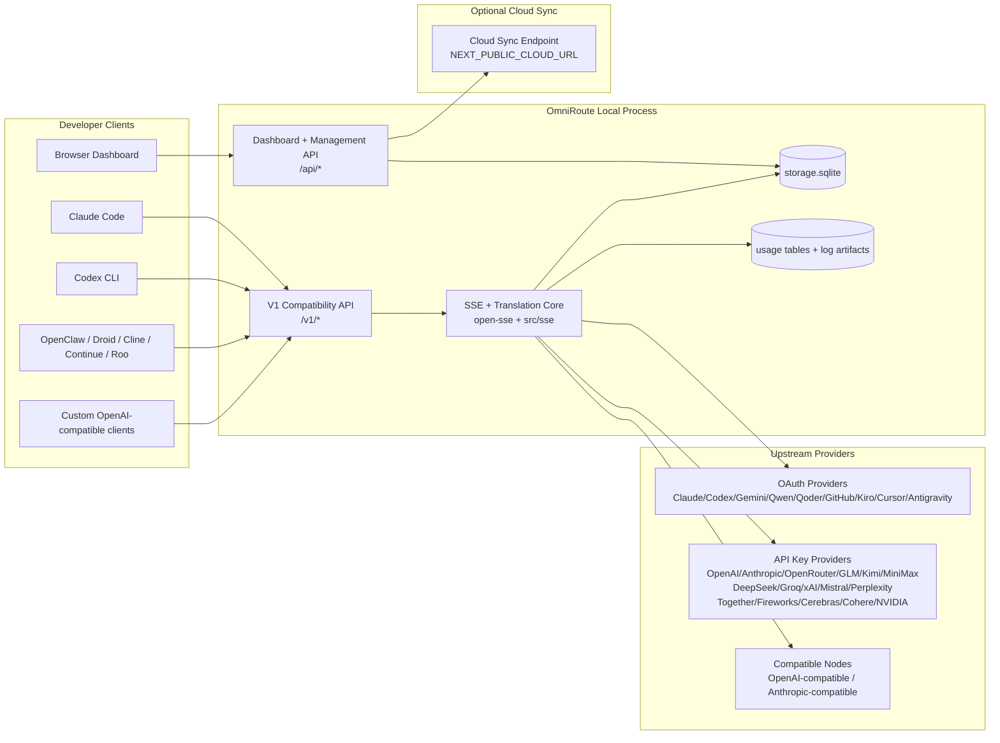
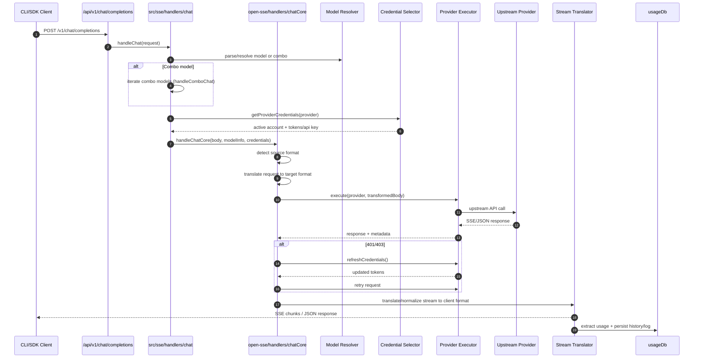
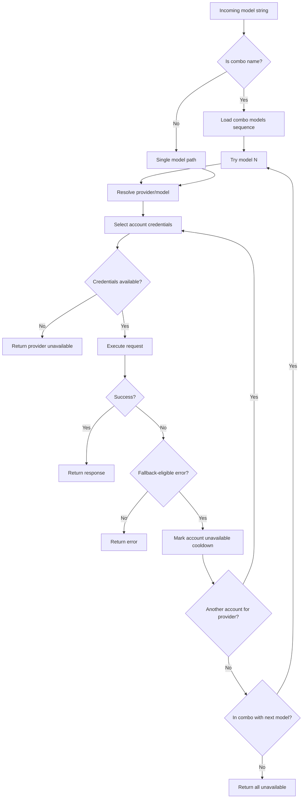
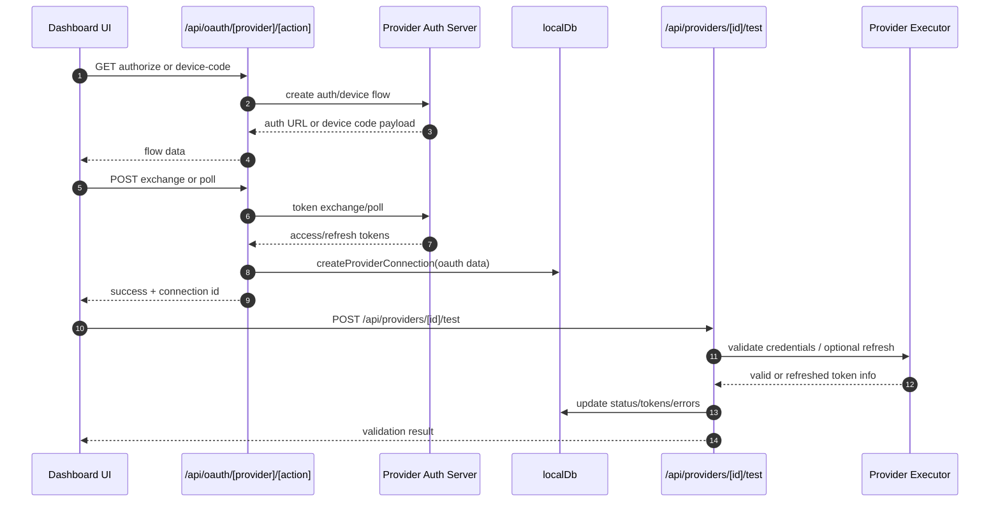
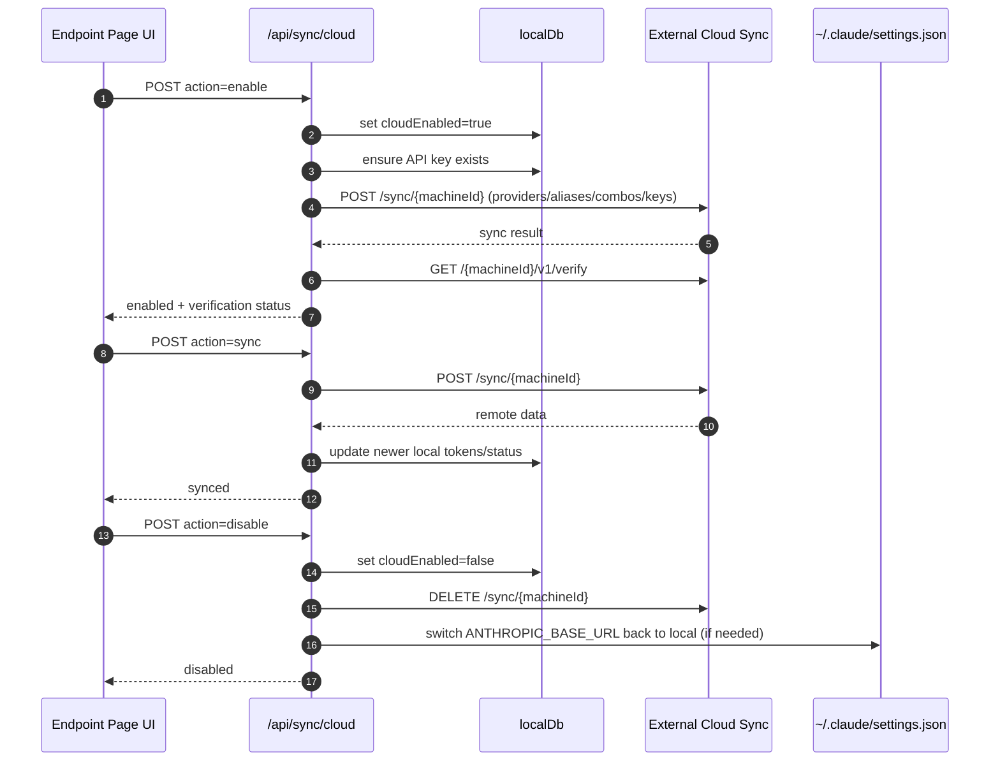
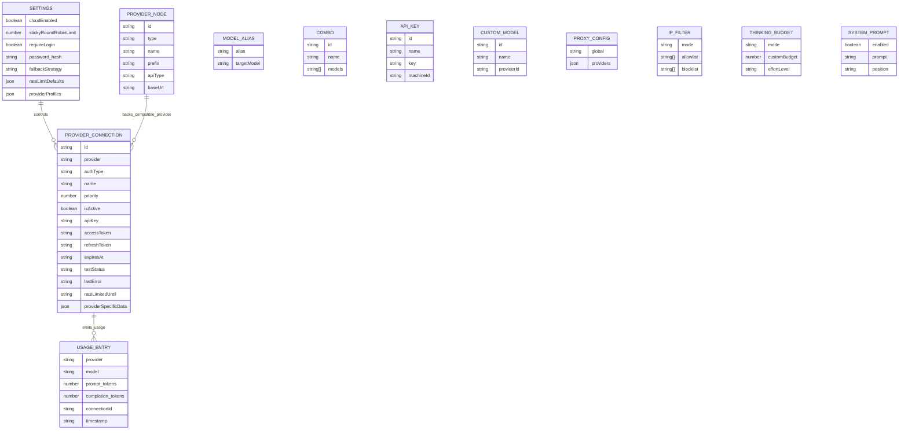
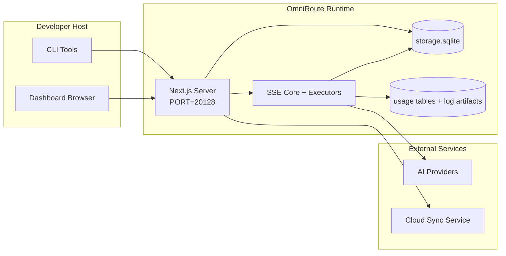

# OmniRoute Architecture (Bahasa Melayu)

🌐 **Languages:** 🇺🇸 [English](../../../../docs/ARCHITECTURE.md) · 🇪🇸 [es](../../es/docs/ARCHITECTURE.md) · 🇫🇷 [fr](../../fr/docs/ARCHITECTURE.md) · 🇩🇪 [de](../../de/docs/ARCHITECTURE.md) · 🇮🇹 [it](../../it/docs/ARCHITECTURE.md) · 🇷🇺 [ru](../../ru/docs/ARCHITECTURE.md) · 🇨🇳 [zh-CN](../../zh-CN/docs/ARCHITECTURE.md) · 🇯🇵 [ja](../../ja/docs/ARCHITECTURE.md) · 🇰🇷 [ko](../../ko/docs/ARCHITECTURE.md) · 🇸🇦 [ar](../../ar/docs/ARCHITECTURE.md) · 🇮🇳 [hi](../../hi/docs/ARCHITECTURE.md) · 🇮🇳 [in](../../in/docs/ARCHITECTURE.md) · 🇹🇭 [th](../../th/docs/ARCHITECTURE.md) · 🇻🇳 [vi](../../vi/docs/ARCHITECTURE.md) · 🇮🇩 [id](../../id/docs/ARCHITECTURE.md) · 🇲🇾 [ms](../../ms/docs/ARCHITECTURE.md) · 🇳🇱 [nl](../../nl/docs/ARCHITECTURE.md) · 🇵🇱 [pl](../../pl/docs/ARCHITECTURE.md) · 🇸🇪 [sv](../../sv/docs/ARCHITECTURE.md) · 🇳🇴 [no](../../no/docs/ARCHITECTURE.md) · 🇩🇰 [da](../../da/docs/ARCHITECTURE.md) · 🇫🇮 [fi](../../fi/docs/ARCHITECTURE.md) · 🇵🇹 [pt](../../pt/docs/ARCHITECTURE.md) · 🇷🇴 [ro](../../ro/docs/ARCHITECTURE.md) · 🇭🇺 [hu](../../hu/docs/ARCHITECTURE.md) · 🇧🇬 [bg](../../bg/docs/ARCHITECTURE.md) · 🇸🇰 [sk](../../sk/docs/ARCHITECTURE.md) · 🇺🇦 [uk-UA](../../uk-UA/docs/ARCHITECTURE.md) · 🇮🇱 [he](../../he/docs/ARCHITECTURE.md) · 🇵🇭 [phi](../../phi/docs/ARCHITECTURE.md) · 🇧🇷 [pt-BR](../../pt-BR/docs/ARCHITECTURE.md) · 🇨🇿 [cs](../../cs/docs/ARCHITECTURE.md) · 🇹🇷 [tr](../../tr/docs/ARCHITECTURE.md)

---

_Terakhir dikemas kini: 2026-03-28_## Executive Summary

OmniRoute ialah gerbang laluan dan papan pemuka penghalaan AI tempatan yang dibina pada Next.js.
Ia menyediakan satu titik akhir serasi OpenAI (`/v1/*`) dan mengarahkan trafik merentasi berbilang penyedia huluan dengan terjemahan, sandaran, muat semula token dan penjejakan penggunaan.

Keupayaan teras:

- Permukaan API serasi OpenAI untuk CLI/alat (28 pembekal)
- Permintaan/tindak balas terjemahan merentas format pembekal
- Model kombo mundur (jujukan berbilang model)
- Saling balik peringkat akaun (berbilang akaun setiap pembekal)
- Pengurusan sambungan pembekal kunci OAuth + API
- Penjanaan benam melalui `/v1/embeddings` (6 pembekal, 9 model)
- Penjanaan imej melalui `/v1/images/generations` (4 pembekal, 9 model)
- Penghuraian teg Fikir (`<think>...</think>`) untuk model penaakulan
- Pembersihan tindak balas untuk keserasian OpenAI SDK yang ketat
- Normalisasi peranan (pembangun→sistem, sistem→pengguna) untuk keserasian silang penyedia
- Penukaran output berstruktur (json_schema → Gemini responseSchema)
- Kegigihan setempat untuk pembekal, kunci, alias, kombo, tetapan, harga
- Penjejakan penggunaan/kos dan pengelogan permintaan
- Penyegerakan awan pilihan untuk penyegerakan berbilang peranti/keadaan
- Senarai dibenarkan/senarai sekatan IP untuk kawalan akses API
- Pengurusan belanjawan berfikir (laluan/auto/tersuai/adaptif)
- Suntikan segera sistem global
- Penjejakan sesi dan cap jari
- Pengehadan kadar dipertingkatkan setiap akaun dengan profil khusus pembekal
- Corak pemutus litar untuk daya tahan pembekal
- Perlindungan kumpulan anti-gemuruh dengan penguncian mutex
- Cache penyahduplikasi permintaan berasaskan tandatangan
- Lapisan domain: ketersediaan model, peraturan kos, dasar sandaran, dasar sekat keluar
- Kegigihan keadaan domain (cache tulis-melalui SQLite untuk sandaran, belanjawan, sekatan, pemutus litar)
- Enjin dasar untuk penilaian permintaan terpusat (kunci → belanjawan → sandaran)
- Minta telemetri dengan pengagregatan kependaman p50/p95/p99
- ID Korelasi (X-Request-Id) untuk pengesanan hujung ke hujung
- Pengelogan audit pematuhan dengan memilih keluar setiap kunci API
- Rangka kerja Eval untuk jaminan kualiti LLM
- Papan pemuka UI Ketahanan dengan status pemutus litar masa nyata
- Pembekal OAuth modular (12 modul individu di bawah `src/lib/oauth/providers/`)

Model masa jalan utama:

- Laluan apl Next.js di bawah `src/app/api/*` laksanakan kedua-dua API papan pemuka dan API keserasian
- SSE/tera laluan yang dikongsi dalam `src/sse/*` + `open-sse/*` mengendalikan pelaksanaan pembekal, terjemahan, penstriman, sandaran dan penggunaan## Scope and Boundaries

### In Scope

- Masa jalan gerbang tempatan
- API pengurusan papan pemuka
- Pengesahan pembekal dan penyegaran token
- Minta terjemahan dan penstriman SSE
- Keadaan setempat + kegigihan penggunaan
- Orkestrasi penyegerakan awan pilihan### Out of Scope

- Pelaksanaan perkhidmatan awan di belakang `NEXT_PUBLIC_CLOUD_URL`
- Pembekal SLA/pesawat kawalan di luar proses tempatan
- Perduaan CLI luaran sendiri (Claude CLI, Codex CLI, dll.)## Dashboard Surface (Current)

Halaman utama di bawah `src/app/(dashboard)/dashboard/`:

- `/papan pemuka` — permulaan pantas + gambaran keseluruhan pembekal
- `/papan pemuka/titik akhir` — proksi titik akhir + tab titik akhir MCP + A2A + API
- `/papan pemuka/penyedia` — sambungan pembekal dan bukti kelayakan
- `/papan pemuka/kombo` — strategi kombo, templat, peraturan penghalaan model
- `/papan pemuka/kos` — pengagregatan kos dan keterlihatan harga
- `/papan pemuka/analisis` — analitik dan penilaian penggunaan
- `/dashboard/limits` — kawalan kuota/kadar
- `/dashboard/cli-tools` — CLI onboarding, pengesanan masa jalan, penjanaan konfigurasi
- `/papan pemuka/ejen` — ejen ACP dikesan + pendaftaran ejen tersuai
- `/papan pemuka/media` — imej/video/taman permainan muzik
- `/dashboard/search-tools` — ujian dan sejarah pembekal carian
- `/papan pemuka/kesihatan` — masa hidup, pemutus litar, had kadar
- `/papan pemuka/log` — log permintaan/proksi/audit/konsol
- `/papan pemuka/tetapan` — tab tetapan sistem (umum, penghalaan, lalai kombo, dsb.)
- `/dashboard/api-manager` — Kitaran hayat kunci API dan kebenaran model## High-Level System Context



## Core Runtime Components

## 1) API and Routing Layer (Next.js App Routes)

Direktori utama:

- `src/app/api/v1/*` dan `src/app/api/v1beta/*` untuk API keserasian
- `src/app/api/*` untuk API pengurusan/konfigurasi
- Seterusnya menulis semula dalam peta `next.config.mjs` `/v1/*` kepada `/api/v1/*`

Laluan keserasian penting:

- `src/app/api/v1/chat/completions/route.ts`
- `src/app/api/v1/messages/route.ts`
- `src/app/api/v1/responses/route.ts`
- `src/app/api/v1/models/route.ts` — termasuk model tersuai dengan `custom: true`
- `src/app/api/v1/embeddings/route.ts` — penjanaan benam (6 pembekal)
- `src/app/api/v1/images/generations/route.ts` — penjanaan imej (4+ penyedia termasuk Antigravity/Nebius)
- `src/app/api/v1/messages/count_tokens/route.ts`
- `src/app/api/v1/providers/[provider]/chat/completions/route.ts` — sembang per-pembekal khusus
- `src/app/api/v1/providers/[provider]/embeddings/route.ts` — pembenaman per-pembekal khusus
- `src/app/api/v1/providers/[provider]/images/generations/route.ts` — imej setiap pembekal khusus
- `src/app/api/v1beta/models/route.ts`
- `src/app/api/v1beta/models/[...path]/route.ts`

Domain pengurusan:

- Pengesahan/tetapan: `src/app/api/auth/*`, `src/app/api/settings/*`
- Pembekal/sambungan: `src/app/api/providers*`
- Nod pembekal: `src/app/api/provider-nodes*`
- Model tersuai: `src/app/api/provider-models` (GET/POST/DELETE)
- Katalog model: `src/app/api/models/route.ts` (GET)
- Konfigurasi proksi: `src/app/api/settings/proxy` (GET/PUT/DELETE) + `src/app/api/settings/proxy/test` (POST)
- OAuth: `src/app/api/oauth/*`
- Kekunci/alias/kombo/harga: `src/app/api/keys*`, `src/app/api/models/alias`, `src/app/api/combos*`, `src/app/api/pricing`
- Penggunaan: `src/app/api/usage/*`
- Segerak/awan: `src/app/api/sync/*`, `src/app/api/cloud/*`
- Pembantu perkakas CLI: `src/app/api/cli-tools/*`
- Penapis IP: `src/app/api/settings/ip-filter` (GET/PUT)
- Belanjawan berfikir: `src/app/api/settings/thinking-budget` (GET/PUT)
- Gesaan sistem: `src/app/api/settings/system-prompt` (GET/PUT)
- Sesi: `src/app/api/sessions` (GET)
- Had kadar: `src/app/api/rate-limits` (GET)
- Ketahanan: `src/app/api/resilience` (GET/PATCH) — profil pembekal, pemutus litar, keadaan had kadar
- Tetapan semula daya tahan: `src/app/api/resilience/set semula` (POST) — set semula pemutus + cooldown
- Statistik cache: `src/app/api/cache/stats` (DAPAT/DELETE)
- Ketersediaan model: `src/app/api/models/availability` (GET/POST)
- Telemetri: `src/app/api/telemetri/ringkasan` (GET)
- Belanjawan: `src/app/api/usage/budget` (GET/POST)
- Rantaian mundur: `src/app/api/fallback/chains` (DAPATKAN/POST/DELETE)
- Audit pematuhan: `src/app/api/compliance/audit-log` (GET)
- Evals: `src/app/api/evals` (GET/POST), `src/app/api/evals/[suiteId]` (GET)
- Dasar: `src/app/api/policies` (DAPAT/POST)## 2) SSE + Translation Core

Modul aliran utama:

- Kemasukan: `src/sse/handlers/chat.ts`
- Orkestrasi teras: `open-sse/handlers/chatCore.ts`
- Penyesuai pelaksanaan pembekal: `open-sse/executors/*`
- Konfigurasi pengesanan format/pembekal: `open-sse/services/provider.ts`
- Parse/resolve model: `src/sse/services/model.ts`, `open-sse/services/model.ts`
- Logik sandaran akaun: `open-sse/services/accountFallback.ts`
- Pendaftaran terjemahan: `open-sse/translator/index.ts`
- Transformasi strim: `open-sse/utils/stream.ts`, `open-sse/utils/streamHandler.ts`
- Pengekstrakan/penormalan penggunaan: `open-sse/utils/usageTracking.ts`
- Penghurai teg Fikir: `open-sse/utils/thinkTagParser.ts`
- Pengendali benam: `open-sse/handlers/embeddings.ts`
- Membenamkan pendaftaran pembekal: `open-sse/config/embeddingRegistry.ts`
- Pengendali penjanaan imej: `open-sse/handlers/imageGeneration.ts`
- Pendaftaran pembekal imej: `open-sse/config/imageRegistry.ts`
- Pembersihan tindak balas: `open-sse/handlers/responseSanitizer.ts`
- Normalisasi peranan: `open-sse/services/roleNormalizer.ts`

Perkhidmatan (logik perniagaan):

- Pemilihan/pemarkahan akaun: `open-sse/services/accountSelector.ts`
- Pengurusan kitaran hayat konteks: `open-sse/services/contextManager.ts`
- Penguatkuasaan penapis IP: `open-sse/services/ipFilter.ts`
- Penjejakan sesi: `open-sse/services/sessionManager.ts`
- Minta penyahduaan: `open-sse/services/signatureCache.ts`
- Suntikan segera sistem: `open-sse/services/systemPrompt.ts`
- Pemikiran pengurusan belanjawan: `open-sse/services/thinkingBudget.ts`
- Penghalaan model kad liar: `open-sse/services/wildcardRouter.ts`
- Pengurusan had kadar: `open-sse/services/rateLimitManager.ts`
- Pemutus litar: `open-sse/services/circuitBreaker.ts`

Modul lapisan domain:

- Ketersediaan model: `src/lib/domain/modelAvailability.ts`
- Peraturan/belanjawan kos: `src/lib/domain/costRules.ts`
- Dasar mundur: `src/lib/domain/fallbackPolicy.ts`
- Penyelesai kombo: `src/lib/domain/comboResolver.ts`
- Dasar penguncian: `src/lib/domain/lockoutPolicy.ts`
- Enjin dasar: `src/domain/policyEngine.ts` — kunci keluar berpusat → belanjawan → penilaian mundur
- Katalog kod ralat: `src/lib/domain/errorCodes.ts`
- ID Permintaan: `src/lib/domain/requestId.ts`
- Ambil tamat masa: `src/lib/domain/fetchTimeout.ts`
- Minta telemetri: `src/lib/domain/requestTelemetry.ts`
- Pematuhan/audit: `src/lib/domain/compliance/index.ts`
- Pelari Eval: `src/lib/domain/evalRunner.ts`
- Kegigihan keadaan domain: `src/lib/db/domainState.ts` — SQLite CRUD untuk rantaian sandaran, belanjawan, sejarah kos, keadaan sekat keluar, pemutus litar

Modul pembekal OAuth (12 fail individu di bawah `src/lib/oauth/providers/`):

- Indeks pendaftaran: `src/lib/oauth/providers/index.ts`
- Pembekal individu: `claude.ts`, `codex.ts`, `gemini.ts`, `antigravity.ts`, `qoder.ts`, `qwen.ts`, `kimi-coding.ts`, `github.ts`, `kiro.ts`, `cursor.ts.ts`,`kilocode.ts.`,`kilocode.ts.
- Pembalut nipis: `src/lib/oauth/providers.ts` — eksport semula daripada modul individu## 3) Persistence Layer

DB keadaan utama (SQLite):

- Infra teras: `src/lib/db/core.ts` (better-sqlite3, migrasi, WAL)
- Eksport semula fasad: `src/lib/localDb.ts` (lapisan keserasian nipis untuk pemanggil)
- fail: `${DATA_DIR}/storage.sqlite` (atau `$XDG_CONFIG_HOME/omniroute/storage.sqlite` apabila ditetapkan, jika tidak `~/.omniroute/storage.sqlite`)
- entiti (jadual + ruang nama KV): providerConnections, providerNodes, modelAliases, combo, apiKeys, tetapan, harga,**customModels**,**proxyConfig**,**ipFilter**,**thinkingBudget**,**systemPrompt**

Kegigihan penggunaan:

- fasad: `src/lib/usageDb.ts` (modul terurai dalam `src/lib/usage/*`)
- Jadual SQLite dalam `storage.sqlite`: `usage_history`, `call_logs`, `proxy_logs`
- artifak fail pilihan kekal untuk keserasian/nyahpepijat (`${DATA_DIR}/log.txt`, `${DATA_DIR}/call_logs/`, `<repo>/logs/...`)
- fail JSON lama dipindahkan ke SQLite melalui migrasi permulaan apabila ada

DB Keadaan Domain (SQLite):

- `src/lib/db/domainState.ts` — Operasi CRUD untuk keadaan domain
- Jadual (dicipta dalam `src/lib/db/core.ts`): `domain_fallback_chains`, `domain_budgets`, `domain_cost_history`, `domain_lockout_state`, `domain_circuit_breakers`
- Corak cache tulis-lalu: Peta dalam ingatan adalah berwibawa pada masa jalan; mutasi ditulis serentak kepada SQLite; keadaan dipulihkan daripada DB pada permulaan sejuk## 4) Auth + Security Surfaces

- Pengesahan kuki papan pemuka: `src/proxy.ts`, `src/app/api/auth/login/route.ts`
- Penjanaan/pengesahan kunci API: `src/shared/utils/apiKey.ts`
- Rahsia pembekal kekal dalam entri `providerConnections`
- Sokongan proksi keluar melalui `open-sse/utils/proxyFetch.ts` (env vars) dan `open-sse/utils/networkProxy.ts` (boleh dikonfigurasikan setiap pembekal atau global)## 5) Cloud Sync

- Penjadual init: `src/lib/initCloudSync.ts`, `src/shared/services/initializeCloudSync.ts`, `src/shared/services/modelSyncScheduler.ts`
- Tugas berkala: `src/shared/services/cloudSyncScheduler.ts`
- Tugas berkala: `src/shared/services/modelSyncScheduler.ts`
- Laluan kawalan: `src/app/api/sync/cloud/route.ts`## Request Lifecycle (`/v1/chat/completions`)



## Combo + Account Fallback Flow



Keputusan mundur didorong oleh `open-sse/services/accountFallback.ts` menggunakan kod status dan heuristik mesej ralat. Penghalaan kombo menambah satu pengawal tambahan: 400s berskop penyedia seperti kegagalan sekatan kandungan huluan dan pengesahan peranan dianggap sebagai kegagalan model tempatan supaya sasaran kombo kemudiannya masih boleh dijalankan.## OAuth Onboarding and Token Refresh Lifecycle



Muat semula semasa trafik langsung dilaksanakan di dalam `open-sse/handlers/chatCore.ts` melalui pelaksana `refreshCredentials()`.## Cloud Sync Lifecycle (Enable / Sync / Disable)



Penyegerakan berkala dicetuskan oleh `CloudSyncScheduler` apabila awan didayakan.## Data Model and Storage Map



Fail storan fizikal:

- DB masa jalan utama: `${DATA_DIR}/storage.sqlite`
- baris log permintaan: `${DATA_DIR}/log.txt` (artifak compat/debug)
- arkib muatan panggilan berstruktur: `${DATA_DIR}/log_panggilan/`
- penterjemah pilihan/permintaan sesi nyahpepijat: `<repo>/log/...`## Deployment Topology



## Module Mapping (Decision-Critical)

### Route and API Modules

- `src/app/api/v1/*`, `src/app/api/v1beta/*`: API keserasian
- `src/app/api/v1/providers/[provider]/*`: laluan khusus bagi setiap pembekal (sembang, benam, imej)
- `src/app/api/providers*`: penyedia CRUD, pengesahan, ujian
- `src/app/api/provider-nodes*`: pengurusan nod serasi tersuai
- `src/app/api/provider-models`: pengurusan model tersuai (CRUD)
- `src/app/api/models/route.ts`: API katalog model (alias + model tersuai)
- `src/app/api/oauth/*`: OAuth/kod peranti mengalir
- `src/app/api/keys*`: kitaran hayat kunci API tempatan
- `src/app/api/models/alias`: pengurusan alias
- `src/app/api/combos*`: pengurusan kombo sandaran
- `src/app/api/pricing`: penetapan harga menimpa untuk pengiraan kos
- `src/app/api/settings/proxy`: konfigurasi proksi (GET/PUT/DELETE)
- `src/app/api/settings/proxy/test`: ujian sambungan proksi keluar (POST)
- `src/app/api/usage/*`: penggunaan dan log API
- `src/app/api/sync/*` + `src/app/api/cloud/*`: penyegerakan awan dan pembantu yang menghadap awan
- `src/app/api/cli-tools/*`: penulis/pemeriksa konfigurasi CLI setempat
- `src/app/api/settings/ip-filter`: Senarai dibenarkan/senarai sekat IP (GET/PUT)
- `src/app/api/settings/thinking-budget`: konfigurasi belanjawan token pemikiran (GET/PUT)
- `src/app/api/settings/system-prompt`: gesaan sistem global (GET/PUT)
- `src/app/api/sessions`: penyenaraian sesi aktif (GET)
- `src/app/api/rate-limits`: status had kadar setiap akaun (GET)### Routing and Execution Core

- `src/sse/handlers/chat.ts`: parse permintaan, pengendalian kombo, gelung pemilihan akaun
- `open-sse/handlers/chatCore.ts`: terjemahan, penghantaran pelaksana, pengendalian semula/refresh, persediaan strim
- `open-sse/executors/*`: rangkaian khusus pembekal dan tingkah laku format### Translation Registry and Format Converters

- `open-sse/translator/index.ts`: daftar penterjemah dan orkestrasi
- Minta penterjemah: `open-sse/translator/request/*`
- Penterjemah respons: `open-sse/translator/response/*`
- Pemalar format: `open-sse/translator/formats.ts`### Persistence

- `src/lib/db/*`: konfigurasi/keadaan berterusan dan kegigihan domain pada SQLite
- `src/lib/localDb.ts`: eksport semula keserasian untuk modul DB
- `src/lib/usageDb.ts`: sejarah penggunaan/log panggilan fasad di atas jadual SQLite## Provider Executor Coverage (Strategy Pattern)

Setiap pembekal mempunyai pelaksana khusus yang memanjangkan `BaseExecutor` (dalam `open-sse/executors/base.ts`), yang menyediakan pembinaan URL, pembinaan pengepala, cuba semula dengan backoff eksponen, cangkuk penyegaran semula kelayakan dan kaedah orkestrasi `execute()`.

| Pelaksana               | Pembekal                                                                                                                                                     | Pengendalian Khas                                                                 |
| ----------------------- | ------------------------------------------------------------------------------------------------------------------------------------------------------------ | --------------------------------------------------------------------------------- |
| `Pelaksana Lalai`       | OpenAI, Claude, Gemini, Qwen, Qoder, OpenRouter, GLM, Kimi, MiniMax, DeepSeek, Groq, xAI, Mistral, Perplexity, Together, Fireworks, Cerebras, Cohere, NVIDIA | URL dinamik/konfigurasi pengepala bagi setiap pembekal                            |
| `Pelaksana Antigraviti` | Antigraviti Google                                                                                                                                           | ID projek/sesi tersuai, Cuba Semula-Selepas menghuraikan                          |
| `CodexExecutor`         | OpenAI Codex                                                                                                                                                 | Menyuntik arahan sistem, memaksa usaha penaakulan                                 |
| `Pelaksana Kursor`      | IDE kursor                                                                                                                                                   | Protokol ConnectRPC, pengekodan Protobuf, tandatangan permintaan melalui checksum |
| `GithubExecutor`        | GitHub Copilot                                                                                                                                               | Penyegaran token salinan, pengepala meniru VSCode                                 |
| `KiroExecutor`          | AWS CodeWhisperer/Kiro                                                                                                                                       | Format binari AWS EventStream → penukaran SSE                                     |
| `GeminiCLIEexecutor`    | Gemini CLI                                                                                                                                                   | Kitaran muat semula token Google OAuth                                            |

Semua pembekal lain (termasuk nod serasi tersuai) menggunakan `DefaultExecutor`.## Provider Compatibility Matrix

| Pembekal         | Format         | Pengesahan            | Strim            | Bukan Strim | Token Refresh | API Penggunaan       |
| ---------------- | -------------- | --------------------- | ---------------- | ----------- | ------------- | -------------------- | ------------------------------ |
| Claude           | claude         | Kunci API / OAuth     | ✅               | ✅          | ✅            | ⚠️ Admin sahaja      |
| Gemini           | gemini         | Kunci API / OAuth     | ✅               | ✅          | ✅            | ⚠️ Cloud Console     |
| Gemini CLI       | gemini-cli     | OAuth                 | ✅               | ✅          | ✅            | ⚠️ Cloud Console     |
| Antigraviti      | antigraviti    | OAuth                 | ✅               | ✅          | ✅            | ✅ API kuota penuh   |
| OpenAI           | openai         | Kunci API             | ✅               | ✅          | ❌            | ❌                   |
| Codex            | openai-respons | OAuth                 | ✅ terpaksa      | ❌          | ✅            | ✅ Had kadar         |
| GitHub Copilot   | openai         | OAuth + Token Copilot | ✅               | ✅          | ✅            | ✅ Gambar kuota      |
| Kursor           | kursor         | Jumlah semak tersuai  | ✅               | ✅          | ❌            | ❌                   |
| Kiro             | kiro           | AWS SSO OIDC          | ✅ (EventStream) | ❌          | ✅            | ✅ Had penggunaan    |
| Qwen             | openai         | OAuth                 | ✅               | ✅          | ✅            | ⚠️ Setiap permintaan |
| Qoder            | openai         | OAuth (Asas)          | ✅               | ✅          | ✅            | ⚠️ Setiap permintaan |
| OpenRouter       | openai         | Kunci API             | ✅               | ✅          | ❌            | ❌                   |
| GLM/Kimi/MiniMax | claude         | Kunci API             | ✅               | ✅          | ❌            | ❌                   |
| DeepSeek         | openai         | Kunci API             | ✅               | ✅          | ❌            | ❌                   |
| Groq             | openai         | Kunci API             | ✅               | ✅          | ❌            | ❌                   |
| xAI (Grok)       | openai         | Kunci API             | ✅               | ✅          | ❌            | ❌                   |
| Mistral          | openai         | Kunci API             | ✅               | ✅          | ❌            | ❌                   |
| Kebingungan      | openai         | Kunci API             | ✅               | ✅          | ❌            | ❌                   |
| Bersama AI       | openai         | Kunci API             | ✅               | ✅          | ❌            | ❌                   |
| Bunga Api AI     | openai         | Kunci API             | ✅               | ✅          | ❌            | ❌                   |
| Serebral         | openai         | Kunci API             | ✅               | ✅          | ❌            | ❌                   |
| Cohere           | openai         | Kunci API             | ✅               | ✅          | ❌            | ❌                   |
| NVIDIA NIM       | openai         | Kunci API             | ✅               | ✅          | ❌            | ❌                   | ## Format Translation Coverage |

Format sumber yang dikesan termasuk:

- `openai`
- `openai-respons`
- `claude`
- `gemini`

Format sasaran termasuk:

- Sembang/Respons OpenAI
- Claude
- Sampul surat Gemini/Gemini-CLI/Antigraviti
- Kiro
- Kursor

Terjemahan menggunakan**OpenAI sebagai format hab**— semua penukaran melalui OpenAI sebagai perantaraan:```
Source Format → OpenAI (hub) → Target Format

````

Terjemahan dipilih secara dinamik berdasarkan bentuk muatan sumber dan format sasaran pembekal.

Lapisan pemprosesan tambahan dalam saluran paip terjemahan:

-**Pembersihan respons**— Menghapuskan medan bukan standard daripada respons format OpenAI (kedua-dua penstriman dan bukan penstriman) untuk memastikan pematuhan SDK yang ketat
-**Penormalan peranan**— Menukar `pembangun` → `sistem` untuk sasaran bukan OpenAI; menggabungkan `sistem` → `pengguna` untuk model yang menolak peranan sistem (GLM, ERNIE)
-**Think tag extraction**— Menghuraikan `<think>...</think>` blok daripada kandungan ke dalam medan `reasoning_content`
-**Output berstruktur**— Menukar OpenAI `response_format.json_schema` kepada `responseMimeType` + `responseSchema` Gemini## Supported API Endpoints

| Titik akhir | Format | Pengendali |
| -------------------------------------------------- | ------------------- | ------------------------------------------------------------------- |
| `POST /v1/chat/completions` | Sembang OpenAI | `src/sse/handlers/chat.ts` |
| `POST /v1/message` | Mesej Claude | Pengendali yang sama (dikesan secara automatik) |
| `POST /v1/respons` | Respons OpenAI | `open-sse/handlers/responsesHandler.ts` |
| `POST /v1/embeddings` | Pembenaman OpenAI | `open-sse/handlers/embeddings.ts` |
| `DAPATKAN /v1/embeddings` | Penyenaraian model | Laluan API |
| `POST /v1/images/generations` | Imej OpenAI | `open-sse/handlers/imageGeneration.ts` |
| `DAPATKAN /v1/imej/generasi` | Penyenaraian model | Laluan API |
| `POST /v1/providers/{provider}/chat/completions` | Sembang OpenAI | Khusus bagi setiap pembekal dengan pengesahan model |
| `POST /v1/providers/{provider}/embeddings` | Pembenaman OpenAI | Khusus bagi setiap pembekal dengan pengesahan model |
| `POST /v1/providers/{provider}/images/generations` | Imej OpenAI | Khusus bagi setiap pembekal dengan pengesahan model |
| `POST /v1/messages/count_tokens` | Kiraan Token Claude | Laluan API |
| `DAPATKAN /v1/model` | Senarai Model OpenAI | Laluan API (sembang + benam + imej + model tersuai) |
| `DAPATKAN /api/models/catalog` | Katalog | Semua model dikumpulkan mengikut pembekal + jenis |
| `POST /v1beta/models/*:streamGenerateContent` | Gemini asli | Laluan API |
| `DAPATKAN/LETAK/PADAM /api/tetapan/proksi` | Konfigurasi Proksi | Konfigurasi proksi rangkaian |
| `POST /api/settings/proxy/test` | Kesambungan Proksi | Titik akhir ujian kesihatan/ketersambungan proksi |
| `DAPATKAN/POST/DELETE /api/provider-models` | Model Pembekal | Metadata model pembekal menyokong model tersedia tersuai dan terurus |## Bypass Handler

Pengendali pintasan (`open-sse/utils/bypassHandler.ts`) memintas permintaan "buang" yang diketahui daripada Claude CLI — ping pemanasan, pengekstrakan tajuk dan kiraan token — dan mengembalikan**tindak balas palsu**tanpa menggunakan token penyedia huluan. Ini dicetuskan hanya apabila `User-Agent` mengandungi `claude-cli`.## Request Logger Pipeline

Logger permintaan (`open-sse/utils/requestLogger.ts`) menyediakan saluran paip pengelogan nyahpepijat 7 peringkat, dilumpuhkan secara lalai, didayakan melalui `ENABLE_REQUEST_LOGS=true`:```
1_req_client.json → 2_req_source.json → 3_req_openai.json → 4_req_target.json
→ 5_res_provider.txt → 6_res_openai.txt → 7_res_client.txt
````

Fail ditulis kepada `<repo>/logs/<session>/` untuk setiap sesi permintaan.## Failure Modes and Resilience

## 1) Account/Provider Availability

- cooldown akaun pembekal pada ralat sementara/kadar/auth
- sandaran akaun sebelum permintaan gagal
- sandaran model kombo apabila model semasa/laluan pembekal telah habis## 2) Token Expiry

- prasemak dan muat semula dengan mencuba semula untuk pembekal yang boleh dimuat semula
- 401/403 cuba semula selepas percubaan muat semula dalam laluan teras## 3) Stream Safety

- pengawal strim sedar putus sambungan
- strim terjemahan dengan siram akhir strim dan pengendalian `[DONE]`
- sandaran anggaran penggunaan apabila metadata penggunaan pembekal tiada## 4) Cloud Sync Degradation

- ralat penyegerakan muncul tetapi masa jalan tempatan diteruskan
- penjadual mempunyai logik yang mampu mencuba semula, tetapi pelaksanaan berkala pada masa ini memanggil penyegerakan percubaan tunggal secara lalai## 5) Data Integrity

- Penghijrahan skema SQLite dan cangkuk naik taraf automatik pada permulaan
- JSON warisan → laluan keserasian penghijrahan SQLite## Observability and Operational Signals

Sumber keterlihatan masa jalan:

- log konsol daripada `src/sse/utils/logger.ts`
- agregat penggunaan setiap permintaan dalam SQLite (`usage_history`, `call_logs`, `proxy_logs`)
- tangkapan muatan terperinci empat peringkat dalam SQLite (`request_detail_logs`) apabila `settings.detailed_logs_enabled=true`
- log masuk status permintaan teks `log.txt` (pilihan/compat)
- log permintaan/terjemahan dalam pilihan di bawah `log/` apabila `ENABLE_REQUEST_LOGS=true`
- titik akhir penggunaan papan pemuka (`/api/usage/*`) untuk penggunaan UI

Tangkapan muatan permintaan terperinci menyimpan sehingga empat peringkat muatan JSON bagi setiap panggilan dihalakan:

- permintaan mentah diterima daripada pelanggan
- permintaan diterjemahkan sebenarnya dihantar ke hulu
- respons pembekal dibina semula sebagai JSON; respons yang distrim dipadatkan kepada ringkasan akhir ditambah metadata strim
- respons pelanggan akhir dikembalikan oleh OmniRoute; respons yang distrim disimpan dalam bentuk ringkasan padat yang sama## Security-Sensitive Boundaries

- Rahsia JWT (`JWT_SECRET`) menjamin pengesahan/penandatanganan kuki sesi papan pemuka
- Tali but kata laluan awal (`INITIAL_PASSWORD`) harus dikonfigurasikan secara eksplisit untuk peruntukan jalan pertama
- Rahsia HMAC kunci API (`API_KEY_SECRET`) menjamin format kunci API tempatan yang dijana
- Rahsia pembekal (kunci/token API) dikekalkan dalam DB tempatan dan harus dilindungi pada peringkat sistem fail
- Titik akhir penyegerakan awan bergantung pada pengesahan kunci API + semantik id mesin## Environment and Runtime Matrix

Pembolehubah persekitaran digunakan secara aktif oleh kod:

- Apl/auth: `JWT_SECRET`, `INITIAL_PASSWORD`
- Storan: `DATA_DIR`
- Tingkah laku nod yang serasi: `ALLOW_MULTI_CONNECTIONS_PER_COMPAT_NODE`
- Penggantian asas storan pilihan (Linux/macOS apabila `DATA_DIR` dinyahset): `XDG_CONFIG_HOME`
- Pencincangan keselamatan: `API_KEY_SECRET`, `MACHINE_ID_SALT`
- Pengelogan: `ENABLE_REQUEST_LOGS`
- Penyegerakan/URL awan: `NEXT_PUBLIC_BASE_URL`, `NEXT_PUBLIC_CLOUD_URL`
- Proksi keluar: `HTTP_PROXY`, `HTTPS_PROXY`, `ALL_PROXY`, `NO_PROXY` dan varian huruf kecil
- Bendera ciri SOCKS5: `ENABLE_SOCKS5_PROXY`, `NEXT_PUBLIC_ENABLE_SOCKS5_PROXY`
- Pembantu platform/masa jalan (bukan konfigurasi khusus apl): `APPDATA`, `NODE_ENV`, `PORT`, `HOSTNAME`## Known Architectural Notes

1. `usageDb` dan `localDb` berkongsi dasar direktori asas yang sama (`DATA_DIR` -> `XDG_CONFIG_HOME/omniroute` -> `~/.omniroute`) dengan pemindahan fail lama.
2. `/api/v1/route.ts` mewakilkan kepada pembina katalog bersatu yang sama yang digunakan oleh `/api/v1/models` (`src/app/api/v1/models/catalog.ts`) untuk mengelakkan drift semantik.
3. Permintaan logger menulis tajuk/badan penuh apabila didayakan; anggap direktori log sebagai sensitif.
4. Gelagat awan bergantung pada `NEXT_PUBLIC_BASE_URL` dan kebolehcapaian titik akhir awan yang betul.
5. Direktori `open-sse/` diterbitkan sebagai `@omniroute/open-sse`**pakej ruang kerja npm**. Kod sumber mengimportnya melalui `@omniroute/open-sse/...` (diselesaikan oleh Next.js `transpilePackages`). Laluan fail dalam dokumen ini masih menggunakan nama direktori `open-sse/` untuk konsistensi.
6. Carta dalam papan pemuka menggunakan**Recharts**(berasaskan SVG) untuk visualisasi analitik interaktif yang boleh diakses (carta bar penggunaan model, jadual pecahan pembekal dengan kadar kejayaan).
7. Ujian E2E menggunakan**Playwright**(`tests/e2e/`), dijalankan melalui `npm run test:e2e`. Ujian unit menggunakan**Node.js test runner**(`tests/unit/`), dijalankan melalui `npm run test:unit`. Kod sumber di bawah `src/` ialah**TypeScript**(`.ts`/`.tsx`); ruang kerja `open-sse/` kekal JavaScript (`.js`).
8. Halaman tetapan disusun dalam 5 tab: Keselamatan, Penghalaan (6 strategi global: isikan dahulu, round-robin, p2c, rawak, paling kurang digunakan, dioptimumkan kos), Ketahanan (had kadar boleh diedit, pemutus litar, dasar), AI (belanjawan berfikir, gesaan sistem, cache segera), Lanjutan (proksi).## Operational Verification Checklist

- Bina daripada sumber: `npm run build`
- Bina imej Docker: `docker build -t omniroute .`
- Mulakan perkhidmatan dan sahkan:
- `DAPATKAN /api/tetapan`
- `DAPATKAN /api/v1/model`
- URL asas sasaran CLI hendaklah `http://<host>:20128/v1` apabila `PORT=20128`
