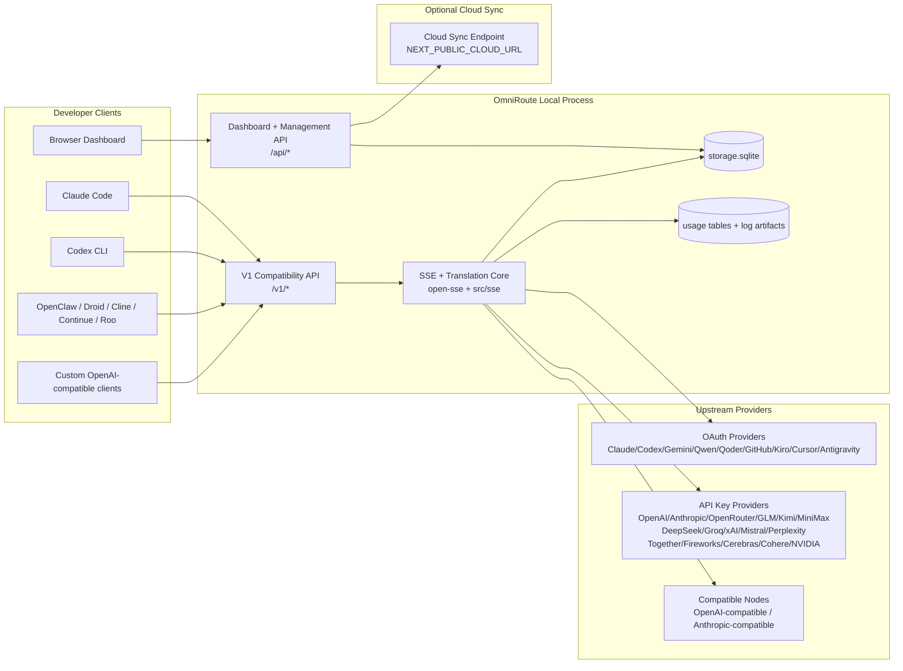
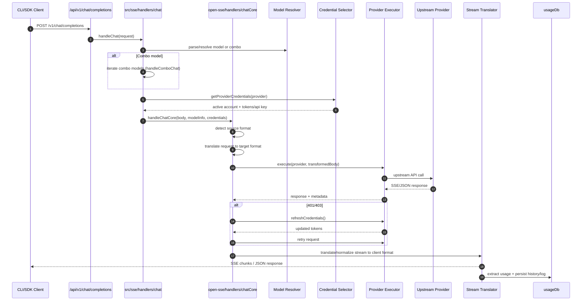
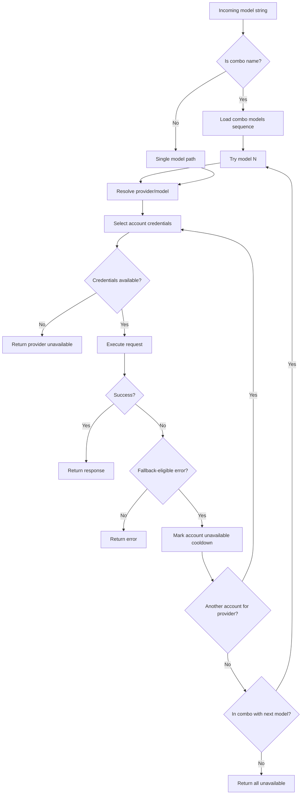
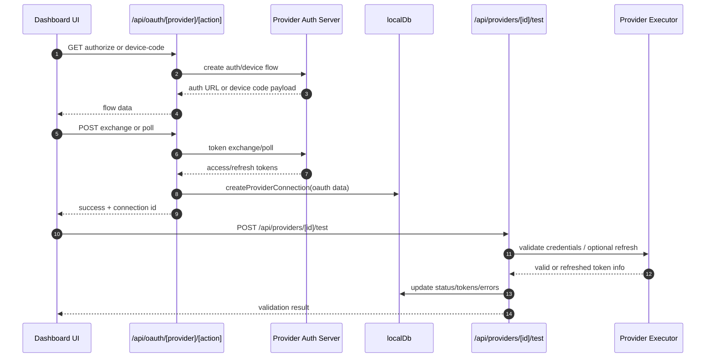
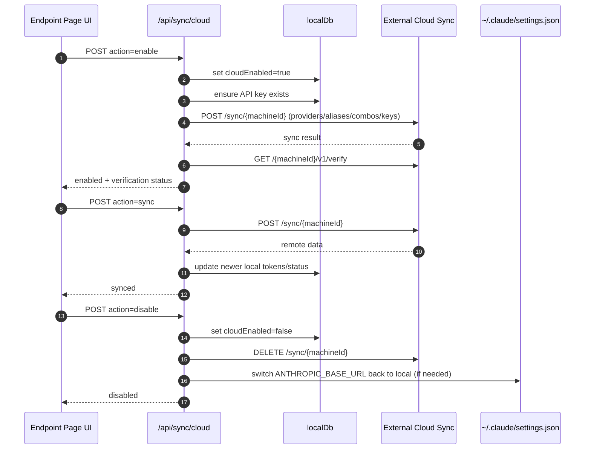
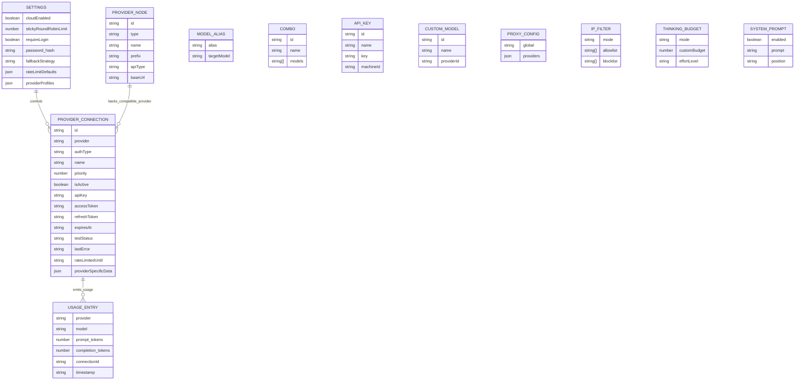
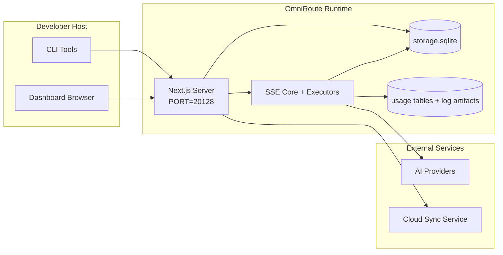

# OmniRoute Architecture (Nederlands)

🌐 **Languages:** 🇺🇸 [English](../../../../docs/ARCHITECTURE.md) · 🇪🇸 [es](../../es/docs/ARCHITECTURE.md) · 🇫🇷 [fr](../../fr/docs/ARCHITECTURE.md) · 🇩🇪 [de](../../de/docs/ARCHITECTURE.md) · 🇮🇹 [it](../../it/docs/ARCHITECTURE.md) · 🇷🇺 [ru](../../ru/docs/ARCHITECTURE.md) · 🇨🇳 [zh-CN](../../zh-CN/docs/ARCHITECTURE.md) · 🇯🇵 [ja](../../ja/docs/ARCHITECTURE.md) · 🇰🇷 [ko](../../ko/docs/ARCHITECTURE.md) · 🇸🇦 [ar](../../ar/docs/ARCHITECTURE.md) · 🇮🇳 [hi](../../hi/docs/ARCHITECTURE.md) · 🇮🇳 [in](../../in/docs/ARCHITECTURE.md) · 🇹🇭 [th](../../th/docs/ARCHITECTURE.md) · 🇻🇳 [vi](../../vi/docs/ARCHITECTURE.md) · 🇮🇩 [id](../../id/docs/ARCHITECTURE.md) · 🇲🇾 [ms](../../ms/docs/ARCHITECTURE.md) · 🇳🇱 [nl](../../nl/docs/ARCHITECTURE.md) · 🇵🇱 [pl](../../pl/docs/ARCHITECTURE.md) · 🇸🇪 [sv](../../sv/docs/ARCHITECTURE.md) · 🇳🇴 [no](../../no/docs/ARCHITECTURE.md) · 🇩🇰 [da](../../da/docs/ARCHITECTURE.md) · 🇫🇮 [fi](../../fi/docs/ARCHITECTURE.md) · 🇵🇹 [pt](../../pt/docs/ARCHITECTURE.md) · 🇷🇴 [ro](../../ro/docs/ARCHITECTURE.md) · 🇭🇺 [hu](../../hu/docs/ARCHITECTURE.md) · 🇧🇬 [bg](../../bg/docs/ARCHITECTURE.md) · 🇸🇰 [sk](../../sk/docs/ARCHITECTURE.md) · 🇺🇦 [uk-UA](../../uk-UA/docs/ARCHITECTURE.md) · 🇮🇱 [he](../../he/docs/ARCHITECTURE.md) · 🇵🇭 [phi](../../phi/docs/ARCHITECTURE.md) · 🇧🇷 [pt-BR](../../pt-BR/docs/ARCHITECTURE.md) · 🇨🇿 [cs](../../cs/docs/ARCHITECTURE.md) · 🇹🇷 [tr](../../tr/docs/ARCHITECTURE.md)

---

_Laatst bijgewerkt: 28-03-2026_## Executive Summary

OmniRoute is een lokale AI-routeringsgateway en dashboard gebouwd op Next.js.
Het biedt één OpenAI-compatibel eindpunt (`/v1/*`) en routeert verkeer over meerdere upstream-providers met vertaling, fallback, tokenvernieuwing en gebruiksregistratie.

Kernmogelijkheden:

- OpenAI-compatibel API-oppervlak voor CLI/tools (28 providers)
- Verzoek/antwoord-vertaling in verschillende providerformaten
- Modelcombo fallback (reeks met meerdere modellen)
- Terugval op accountniveau (meerdere accounts per provider)
- OAuth + API-sleutelproviderverbindingsbeheer
- Generatie van inbedding via `/v1/embeddings` (6 providers, 9 modellen)
- Beeldgeneratie via `/v1/images/generations` (4 providers, 9 modellen)
- Think-tag-parsing (`<think>...</think>`) voor redeneermodellen
- Reactieopschoning voor strikte OpenAI SDK-compatibiliteit
- Rolnormalisatie (ontwikkelaar → systeem, systeem → gebruiker) voor compatibiliteit tussen providers
- Gestructureerde uitvoerconversie (json_schema → Gemini responseSchema)
- Lokale persistentie voor providers, sleutels, aliassen, combo's, instellingen, prijzen
- Gebruik/kosten bijhouden en verzoekregistratie
- Optionele cloudsynchronisatie voor synchronisatie van meerdere apparaten/statussen
- IP-toelatingslijst/blokkeerlijst voor API-toegangscontrole
- Meedenken over budgetbeheer (passthrough/auto/custom/adaptive)
- Globale systeempromptinjectie
- Sessie volgen en vingerafdrukken maken
- Verbeterde tarieflimieten per account met providerspecifieke profielen
- Stroomonderbrekerpatroon voor veerkracht van de provider
- Bescherming tegen donderende kuddes met mutex-vergrendeling
- Op handtekeningen gebaseerde cache voor deduplicatie van verzoeken
- Domeinlaag: modelbeschikbaarheid, kostenregels, fallback-beleid, lock-outbeleid
- Persistentie van domeinstatus (SQLite-schrijfcache voor fallbacks, budgetten, uitsluitingen, stroomonderbrekers)
- Beleidsengine voor gecentraliseerde verzoekevaluatie (lockout → budget → fallback)
- Telemetrie aanvragen met p50/p95/p99-latency-aggregatie
- Correlatie-ID (X-Request-Id) voor end-to-end tracering
- Compliance-auditregistratie met opt-out per API-sleutel
- Evaluatiekader voor LLM-kwaliteitsborging
- Veerkracht UI-dashboard met realtime stroomonderbrekerstatus
- Modulaire OAuth-providers (12 individuele modules onder `src/lib/oauth/providers/`)

Primair runtimemodel:

- Next.js app-routes onder `src/app/api/*` implementeren zowel dashboard-API's als compatibiliteits-API's
- Een gedeelde SSE/routing-kern in `src/sse/*` + `open-sse/*` zorgt voor de uitvoering, vertaling, streaming, fallback en gebruik van de provider## Scope and Boundaries

### In Scope

- Runtime van lokale gateway
- Dashboardbeheer-API's
- Providerverificatie en tokenvernieuwing
- Vraag vertaling en SSE-streaming aan
- Lokale status + gebruikspersistentie
- Optionele cloudsynchronisatie-orkestratie### Out of Scope

- Implementatie van cloudservices achter `NEXT_PUBLIC_CLOUD_URL`
- Provider SLA/controlevlak buiten het lokale proces
- Externe CLI-binaire bestanden zelf (Claude CLI, Codex CLI, enz.)## Dashboard Surface (Current)

Hoofdpagina's onder `src/app/(dashboard)/dashboard/`:

- `/dashboard` — snelle start + provideroverzicht
- `/dashboard/endpoint` — eindpuntproxy + MCP + A2A + API-eindpunttabbladen
- `/dashboard/providers` — providerverbindingen en inloggegevens
- `/dashboard/combos` — combostrategieën, sjablonen, modelrouteringsregels
- `/dashboard/kosten` — aggregatie van kosten en zichtbaarheid van prijzen
- `/dashboard/analytics` — gebruiksanalyses en evaluaties
- `/dashboard/limits` — controles op quota/tarieven
- `/dashboard/cli-tools` — CLI-onboarding, runtime-detectie, genereren van configuraties
- `/dashboard/agents` — gedetecteerde ACP-agenten + aangepaste agentregistratie
- `/dashboard/media` — speelplaats voor afbeeldingen/video/muziek
- `/dashboard/search-tools` — testen en geschiedenis van zoekmachines
- `/dashboard/health` — uptime, stroomonderbrekers, snelheidslimieten
- `/dashboard/logs` — verzoek/proxy/audit/console-logboeken
- `/dashboard/settings` — tabbladen met systeeminstellingen (algemeen, routing, combo-standaardinstellingen, enz.)
- `/dashboard/api-manager` — API-sleutellevenscyclus en modelrechten## High-Level System Context



## Core Runtime Components

## 1) API and Routing Layer (Next.js App Routes)

Hoofdmappen:

- `src/app/api/v1/*` en `src/app/api/v1beta/*` voor compatibiliteits-API's
- `src/app/api/*` voor beheer-/configuratie-API's
- Volgende herschrijving in `next.config.mjs` kaart `/v1/*` naar `/api/v1/*`

Belangrijke compatibiliteitsroutes:

- `src/app/api/v1/chat/completions/route.ts`
- `src/app/api/v1/messages/route.ts`
- `src/app/api/v1/responses/route.ts`
- `src/app/api/v1/models/route.ts` — bevat aangepaste modellen met `custom: true`
- `src/app/api/v1/embeddings/route.ts` — genereren van inbedden (6 providers)
- `src/app/api/v1/images/generations/route.ts` — generatie van afbeeldingen (4+ providers incl. Antigravity/Nebius)
- `src/app/api/v1/messages/count_tokens/route.ts`
- `src/app/api/v1/providers/[provider]/chat/completions/route.ts` — speciale chat per provider
- `src/app/api/v1/providers/[provider]/embeddings/route.ts` — speciale insluitingen per provider
- `src/app/api/v1/providers/[provider]/images/generations/route.ts` — speciale afbeeldingen per provider
- `src/app/api/v1beta/models/route.ts`
- `src/app/api/v1beta/models/[...pad]/route.ts`

Beheerdomeinen:

- Authenticatie/instellingen: `src/app/api/auth/*`, `src/app/api/settings/*`
- Providers/verbindingen: `src/app/api/providers*`
- Providerknooppunten: `src/app/api/provider-nodes*`
- Aangepaste modellen: `src/app/api/provider-models` (GET/POST/DELETE)
- Modelcatalogus: `src/app/api/models/route.ts` (GET)
- Proxyconfiguratie: `src/app/api/settings/proxy` (GET/PUT/DELETE) + `src/app/api/settings/proxy/test` (POST)
- OAuth: `src/app/api/oauth/*`
- Sleutels/aliassen/combo's/prijzen: `src/app/api/keys*`, `src/app/api/models/alias`, `src/app/api/combos*`, `src/app/api/pricing`
- Gebruik: `src/app/api/usage/*`
- Synchronisatie/cloud: `src/app/api/sync/*`, `src/app/api/cloud/*`
- Hulpprogramma's voor CLI-tools: `src/app/api/cli-tools/*`
- IP-filter: `src/app/api/settings/ip-filter` (GET/PUT)
- Denkbudget: `src/app/api/settings/thinking-budget` (GET/PUT)
- Systeemprompt: `src/app/api/settings/system-prompt` (GET/PUT)
- Sessies: `src/app/api/sessions` (GET)
- Tarieflimieten: `src/app/api/rate-limits` (GET)
- Veerkracht: `src/app/api/resilience` (GET/PATCH) — providerprofielen, stroomonderbreker, snelheidslimietstatus
- Veerkracht reset: `src/app/api/resilience/reset` (POST) - reset onderbrekers + cooldowns
- Cachestatistieken: `src/app/api/cache/stats` (GET/DELETE)
- Beschikbaarheid van modellen: `src/app/api/models/availability` (GET/POST)
- Telemetrie: `src/app/api/telemetry/summary` (GET)
- Budget: `src/app/api/usage/budget` (GET/POST)
- Terugvalketens: `src/app/api/fallback/chains` (GET/POST/DELETE)
- Nalevingsaudit: `src/app/api/compliance/audit-log` (GET)
- Evals: `src/app/api/evals` (GET/POST), `src/app/api/evals/[suiteId]` (GET)
- Beleid: `src/app/api/policies` (GET/POST)## 2) SSE + Translation Core

Hoofdstroommodules:

- Invoer: `src/sse/handlers/chat.ts`
- Kernorkestratie: `open-sse/handlers/chatCore.ts`
- Uitvoeringsadapters van providers: `open-sse/executors/*`
- Formaatdetectie/providerconfiguratie: `open-sse/services/provider.ts`
- Model ontleden/oplossen: `src/sse/services/model.ts`, `open-sse/services/model.ts`
- Reservelogica voor accounts: `open-sse/services/accountFallback.ts`
- Vertaalregister: `open-sse/translator/index.ts`
- Streamtransformaties: `open-sse/utils/stream.ts`, `open-sse/utils/streamHandler.ts`
- Gebruiksextractie/normalisatie: `open-sse/utils/usageTracking.ts`
- Think tag-parser: `open-sse/utils/thinkTagParser.ts`
- Inbeddingshandler: `open-sse/handlers/embeddings.ts`
- Insluiten van providerregister: `open-sse/config/embeddingRegistry.ts`
- Handler voor het genereren van afbeeldingen: `open-sse/handlers/imageGeneration.ts`
- Register van de imageprovider: `open-sse/config/imageRegistry.ts`
- Opschoning van reacties: `open-sse/handlers/responseSanitizer.ts`
- Rolnormalisatie: `open-sse/services/roleNormalizer.ts`

Diensten (bedrijfslogica):

- Accountselectie/score: `open-sse/services/accountSelector.ts`
- Contextlevenscyclusbeheer: `open-sse/services/contextManager.ts`
- Handhaving van IP-filters: `open-sse/services/ipFilter.ts`
- Sessie volgen: `open-sse/services/sessionManager.ts`
- Ontdubbeling aanvragen: `open-sse/services/signatureCache.ts`
- Systeempromptinjectie: `open-sse/services/systemPrompt.ts`
- Denkend budgetbeheer: `open-sse/services/thinkingBudget.ts`
- Wildcard-modelroutering: `open-sse/services/wildcardRouter.ts`
- Beheer van tarieflimieten: `open-sse/services/rateLimitManager.ts`
- Stroomonderbreker: `open-sse/services/circuitBreaker.ts`

Domeinlaagmodules:

- Beschikbaarheid van modellen: `src/lib/domain/modelAvailability.ts`
- Kostenregels/budgetten: `src/lib/domain/costRules.ts`
- Terugvalbeleid: `src/lib/domain/fallbackPolicy.ts`
- Combo-resolver: `src/lib/domain/comboResolver.ts`
- Uitsluitingsbeleid: `src/lib/domain/lockoutPolicy.ts`
- Beleidsengine: `src/domain/policyEngine.ts` — gecentraliseerde uitsluiting → budget → fallback-evaluatie
- Foutcodecatalogus: `src/lib/domain/errorCodes.ts`
- Verzoek-ID: `src/lib/domain/requestId.ts`
- Time-out voor ophalen: `src/lib/domain/fetchTimeout.ts`
- Telemetrie aanvragen: `src/lib/domain/requestTelemetry.ts`
- Naleving/audit: `src/lib/domain/compliance/index.ts`
- Eval runner: `src/lib/domain/evalRunner.ts`
- Persistentie van domeinstatus: `src/lib/db/domainState.ts` — SQLite CRUD voor fallback-ketens, budgetten, kostengeschiedenis, uitsluitingsstatus, stroomonderbrekers

OAuth-providermodules (12 individuele bestanden onder `src/lib/oauth/providers/`):

- Registerindex: `src/lib/oauth/providers/index.ts`
- Individuele providers: `claude.ts`, `codex.ts`, `gemini.ts`, `antigravity.ts`, `qoder.ts`, `qwen.ts`, `kimi-coding.ts`, `github.ts`, `kiro.ts`, `cursor.ts`, `kilocode.ts`, `cline.ts`
- Thin wrapper: `src/lib/oauth/providers.ts` — exporteert opnieuw van individuele modules## 3) Persistence Layer

Primaire status DB (SQLite):

- Kerninfra: `src/lib/db/core.ts` (better-sqlite3, migraties, WAL)
- Façade opnieuw exporteren: `src/lib/localDb.ts` (dunne compatibiliteitslaag voor bellers)
- bestand: `${DATA_DIR}/storage.sqlite` (of `$XDG_CONFIG_HOME/omniroute/storage.sqlite` indien ingesteld, anders `~/.omniroute/storage.sqlite`)
- entiteiten (tabellen + KV-naamruimten): providerConnections, providerNodes, modelAliases, combo's, apiKeys, instellingen, prijzen,**customModels**,**proxyConfig**,**ipFilter**,**thinkingBudget**,**systemPrompt**

Gebruikspersistentie:

- façade: `src/lib/usageDb.ts` (ontbonden modules in `src/lib/usage/*`)
- SQLite-tabellen in `storage.sqlite`: `usage_history`, `call_logs`, `proxy_logs`
- optionele bestandsartefacten blijven bestaan voor compatibiliteit/debug (`${DATA_DIR}/log.txt`, `${DATA_DIR}/call_logs/`, `<repo>/logs/...`)
- verouderde JSON-bestanden worden gemigreerd naar SQLite door opstartmigraties, indien aanwezig

Domeinstatus DB (SQLite):

- `src/lib/db/domainState.ts` — CRUD-bewerkingen voor domeinstatus
- Tabellen (aangemaakt in `src/lib/db/core.ts`): `domain_fallback_chains`, `domain_budgets`, `domain_cost_history`, `domain_lockout_state`, `domain_circuit_breakers`
- Doorschrijfcachepatroon: kaarten in het geheugen zijn gezaghebbend tijdens runtime; mutaties worden synchroon naar SQLite geschreven; status wordt hersteld vanuit DB bij koude start## 4) Auth + Security Surfaces

- Dashboardcookieverificatie: `src/proxy.ts`, `src/app/api/auth/login/route.ts`
- API-sleutel genereren/verificatie: `src/shared/utils/apiKey.ts`
- Providergeheimen bleven bestaan in `providerConnections`-vermeldingen
- Uitgaande proxy-ondersteuning via `open-sse/utils/proxyFetch.ts` (env vars) en `open-sse/utils/networkProxy.ts` (configureerbaar per provider of globaal)## 5) Cloud Sync

- Scheduler init: `src/lib/initCloudSync.ts`, `src/shared/services/initializeCloudSync.ts`, `src/shared/services/modelSyncScheduler.ts`
- Periodieke taak: `src/shared/services/cloudSyncScheduler.ts`
- Periodieke taak: `src/shared/services/modelSyncScheduler.ts`
- Beheerroute: `src/app/api/sync/cloud/route.ts`## Request Lifecycle (`/v1/chat/completions`)



## Combo + Account Fallback Flow



Fallback-beslissingen worden aangestuurd door `open-sse/services/accountFallback.ts` met behulp van statuscodes en heuristieken voor foutmeldingen. Combo-routering voegt een extra beveiliging toe: op de provider gerichte 400's, zoals upstream content-block- en rolvalidatiefouten, worden behandeld als model-lokale fouten, zodat latere combo-doelen nog steeds kunnen worden uitgevoerd.## OAuth Onboarding and Token Refresh Lifecycle



Vernieuwen tijdens live verkeer wordt uitgevoerd binnen `open-sse/handlers/chatCore.ts` via uitvoerder `refreshCredentials()`.## Cloud Sync Lifecycle (Enable / Sync / Disable)



Periodieke synchronisatie wordt geactiveerd door `CloudSyncScheduler` wanneer de cloud is ingeschakeld.## Data Model and Storage Map



Fysieke opslagbestanden:

- primaire runtime-DB: `${DATA_DIR}/storage.sqlite`
- logregels opvragen: `${DATA_DIR}/log.txt` (compat/debug-artefact)
- gestructureerde payload-archieven voor oproepen: `${DATA_DIR}/call_logs/`
- optionele vertaler/verzoek debug-sessies: `<repo>/logs/...`## Deployment Topology



## Module Mapping (Decision-Critical)

### Route and API Modules

- `src/app/api/v1/*`, `src/app/api/v1beta/*`: compatibiliteits-API's
- `src/app/api/v1/providers/[provider]/*`: speciale routes per provider (chat, insluitingen, afbeeldingen)
- `src/app/api/providers*`: provider CRUD, validatie, testen
- `src/app/api/provider-nodes*`: aangepast compatibel knooppuntbeheer
- `src/app/api/provider-models`: aangepast modelbeheer (CRUD)
- `src/app/api/models/route.ts`: modelcatalogus-API (aliassen + aangepaste modellen)
- `src/app/api/oauth/*`: OAuth/device-code stromen
- `src/app/api/keys*`: levenscyclus van lokale API-sleutel
- `src/app/api/models/alias`: aliasbeheer
- `src/app/api/combos*`: fallback-combobeheer
- `src/app/api/pricing`: prijsoverschrijvingen voor kostenberekening
- `src/app/api/settings/proxy`: proxyconfiguratie (GET/PUT/DELETE)
- `src/app/api/settings/proxy/test`: uitgaande proxy-connectiviteitstest (POST)
- `src/app/api/usage/*`: API's voor gebruik en logboeken
- `src/app/api/sync/*` + `src/app/api/cloud/*`: cloudsynchronisatie en cloudgerichte helpers
- `src/app/api/cli-tools/*`: lokale CLI-configuratieschrijvers/checkers
- `src/app/api/settings/ip-filter`: IP-toelatingslijst/blokkeerlijst (GET/PUT)
- `src/app/api/settings/thinking-budget`: thinking token budgetconfiguratie (GET/PUT)
- `src/app/api/settings/system-prompt`: globale systeemprompt (GET/PUT)
- `src/app/api/sessions`: actieve sessielijst (GET)
- `src/app/api/rate-limits`: tarieflimietstatus per account (GET)### Routing and Execution Core

- `src/sse/handlers/chat.ts`: verzoekparse, combo-afhandeling, accountselectielus
- `open-sse/handlers/chatCore.ts`: vertaling, verzending van de uitvoerder, afhandeling van nieuwe pogingen/vernieuwen, stream-instellingen
- `open-sse/executors/*`: providerspecifiek netwerk- en formaatgedrag### Translation Registry and Format Converters

- `open-sse/translator/index.ts`: register en orkestratie van vertalers
- Vertalers aanvragen: `open-sse/translator/request/*`
- Antwoordvertalers: `open-sse/translator/response/*`
- Formaatconstanten: `open-sse/translator/formats.ts`### Persistence

- `src/lib/db/*`: persistente configuratie/status en domeinpersistentie op SQLite
- `src/lib/localDb.ts`: compatibiliteit opnieuw exporteren voor DB-modules
- `src/lib/usageDb.ts`: gevel van gebruiksgeschiedenis/oproeplogboeken bovenop SQLite-tabellen## Provider Executor Coverage (Strategy Pattern)

Elke provider heeft een gespecialiseerde uitvoerder die `BaseExecutor` uitbreidt (in `open-sse/executors/base.ts`), die het bouwen van URL's, het bouwen van headers, opnieuw proberen met exponentiële backoff, hooks voor het vernieuwen van referenties en de `execute()` orkestratiemethode biedt.

| executeur                   | Aanbieder(s)                                                                                                                                                | Speciale behandeling                                                         |
| --------------------------- | ----------------------------------------------------------------------------------------------------------------------------------------------------------- | ---------------------------------------------------------------------------- |
| `StandaardExecutor`         | OpenAI, Claude, Gemini, Qwen, Qoder, OpenRouter, GLM, Kimi, MiniMax, DeepSeek, Groq, xAI, Mistral, Verbijstering, Samen, Vuurwerk, Cerebras, Cohere, NVIDIA | Dynamische URL/header-configuratie per provider                              |
| `AntizwaartekrachtExecutor` | Google Antizwaartekracht                                                                                                                                    | Aangepaste project-/sessie-ID's, opnieuw proberen na parseren                |
| `CodexExecutor`             | OpenAI-codex                                                                                                                                                | Injecteert systeeminstructies, dwingt redeneerinspanning af                  |
| `CursorExecutor`            | Cursor-IDE                                                                                                                                                  | ConnectRPC-protocol, Protobuf-codering, ondertekening aanvragen via checksum |
| `GithubExecutor`            | GitHub-copiloot                                                                                                                                             | Copilot-token vernieuwen, VSCode-nabootsende headers                         |
| `KiroExecutor`              | AWS CodeWhisperer/Kiro                                                                                                                                      | AWS EventStream binair formaat → SSE-conversie                               |
| `GeminiCLIE-uitvoerder`     | Tweeling CLI                                                                                                                                                | Vernieuwingscyclus van Google OAuth-token                                    |

Alle andere providers (inclusief aangepaste compatibele knooppunten) gebruiken de `DefaultExecutor`.## Provider Compatibility Matrix

| Aanbieder         | Formaat            | Autorisatie            | Stroom           | Niet-stream | Token vernieuwen | Gebruiks-API               |
| ----------------- | ------------------ | ---------------------- | ---------------- | ----------- | ---------------- | -------------------------- | ------------------------------ |
| Claude            | claude             | API-sleutel / OAuth    | ✅               | ✅          | ✅               | ⚠️Alleen beheerder         |
| Tweeling          | Tweeling           | API-sleutel / OAuth    | ✅               | ✅          | ✅               | ⚠️ Cloudconsole            |
| Tweeling CLI      | tweeling-cli       | OAuth                  | ✅               | ✅          | ✅               | ⚠️ Cloudconsole            |
| Antizwaartekracht | anti-zwaartekracht | OAuth                  | ✅               | ✅          | ✅               | ✅ Volledige quota-API     |
| Open AI           | openai             | API-sleutel            | ✅               | ✅          | ❌               | ❌                         |
| Codex             | openai-reacties    | OAuth                  | ✅ gedwongen     | ❌          | ✅               | ✅ Tarieflimieten          |
| GitHub-copiloot   | openai             | OAuth + Copilot-token  | ✅               | ✅          | ✅               | ✅ Momentopnamen van quota |
| Cursor            | cursor             | Aangepaste controlesom | ✅               | ✅          | ❌               | ❌                         |
| Kiro              | kiro               | AWS SSO OIDC           | ✅ (EventStream) | ❌          | ✅               | ✅ Gebruikslimieten        |
| Qwen              | openai             | OAuth                  | ✅               | ✅          | ✅               | ⚠️Per aanvraag             |
| Qoder             | openai             | OAuth (basis)          | ✅               | ✅          | ✅               | ⚠️Per aanvraag             |
| OpenRouter        | openai             | API-sleutel            | ✅               | ✅          | ❌               | ❌                         |
| GLM/Kimi/MiniMax  | claude             | API-sleutel            | ✅               | ✅          | ❌               | ❌                         |
| DeepSeek          | openai             | API-sleutel            | ✅               | ✅          | ❌               | ❌                         |
| Groq              | openai             | API-sleutel            | ✅               | ✅          | ❌               | ❌                         |
| xAI (Grok)        | openai             | API-sleutel            | ✅               | ✅          | ❌               | ❌                         |
| Mistral           | openai             | API-sleutel            | ✅               | ✅          | ❌               | ❌                         |
| Verbijstering     | openai             | API-sleutel            | ✅               | ✅          | ❌               | ❌                         |
| Samen AI          | openai             | API-sleutel            | ✅               | ✅          | ❌               | ❌                         |
| Vuurwerk AI       | openai             | API-sleutel            | ✅               | ✅          | ❌               | ❌                         |
| Hersenen          | openai             | API-sleutel            | ✅               | ✅          | ❌               | ❌                         |
| Cohier            | openai             | API-sleutel            | ✅               | ✅          | ❌               | ❌                         |
| NVIDIA NIM        | openai             | API-sleutel            | ✅               | ✅          | ❌               | ❌                         | ## Format Translation Coverage |

Gedetecteerde bronformaten zijn onder meer:

- `openai`
- `openai-reacties`
- `claude`
- `Tweeling`

Doelformaten zijn onder meer:

- OpenAI-chat/reacties
  -Claude
- Gemini/Gemini-CLI/Antigravity-envelop
- Kiro
- Cursor

Vertalingen gebruiken**OpenAI als hubformaat**— alle conversies gaan via OpenAI als tussenproduct:```
Source Format → OpenAI (hub) → Target Format

````

Vertalingen worden dynamisch geselecteerd op basis van de vorm van de bronpayload en het doelformaat van de provider.

Extra verwerkingslagen in de vertaalpijplijn:

-**Opschoning van reacties**— Verwijdert niet-standaardvelden uit reacties in OpenAI-formaat (zowel streaming als niet-streaming) om strikte SDK-naleving te garanderen
-**Rolnormalisatie**— Converteert `ontwikkelaar` → `systeem` voor niet-OpenAI-doelen; voegt `systeem` → `gebruiker` samen voor modellen die de systeemrol afwijzen (GLM, ERNIE)
-**Think-tagextractie**— Parseert `<think>...</think>`-blokken uit de inhoud in het `reasoning_content`-veld
-**Gestructureerde uitvoer**— Converteert OpenAI `response_format.json_schema` naar Gemini's `responseMimeType` + `responseSchema`## Supported API Endpoints

| Eindpunt | Formaat | Behandelaar |
| --------------------------------------------- | ------------------ | ----------------------------------------------------------- |
| `POST /v1/chat/voltooiingen` | OpenAI-chat | `src/sse/handlers/chat.ts` |
| `POST /v1/berichten` | Claude-berichten | Dezelfde handler (automatisch gedetecteerd) |
| `POST /v1/reacties` | OpenAI-reacties | `open-sse/handlers/responsesHandler.ts` |
| `POST /v1/embeddings` | OpenAI-insluitingen | `open-sse/handlers/embeddings.ts` |
| `GET /v1/embeddings` | Modellijst | API-route |
| `POST /v1/images/generations` | OpenAI-afbeeldingen | `open-sse/handlers/imageGeneration.ts` |
| `GET /v1/images/generations` | Modellijst | API-route |
| `POST /v1/providers/{provider}/chat/completions` | OpenAI-chat | Toegewijd per provider met modelvalidatie |
| `POST /v1/providers/{provider}/embeddings` | OpenAI-insluitingen | Toegewijd per provider met modelvalidatie |
| `POST /v1/providers/{provider}/images/generations` | OpenAI-afbeeldingen | Toegewijd per provider met modelvalidatie |
| `POST /v1/messages/count_tokens` | Claude-tokentelling | API-route |
| `GET /v1/models` | OpenAI-modellenlijst | API-route (chat + insluiten + afbeelding + aangepaste modellen) |
| `KRIJG /api/models/catalog` | Catalogus | Alle modellen gegroepeerd op aanbieder + type |
| `POST /v1beta/models/*:streamGenerateContent` | Gemini geboren | API-route |
| `GET/PUT/DELETE /api/settings/proxy` | Proxyconfiguratie | Netwerkproxyconfiguratie |
| `POST /api/settings/proxy/test` | Proxy-connectiviteit | Eindpunt proxystatus/connectiviteitstest |
| `GET/POST/DELETE /api/provider-modellen` | Providermodellen | Metagegevens van het providermodel ter ondersteuning van aangepaste en beheerde beschikbare modellen |## Bypass Handler

De bypass-handler (`open-sse/utils/bypassHandler.ts`) onderschept bekende "throwaway"-verzoeken van Claude CLI - opwarmpingen, titelextracties en tokentellingen - en retourneert een**nepreactie**zonder upstream providertokens te verbruiken. Dit wordt alleen geactiveerd als `User-Agent` `claude-cli` bevat.## Request Logger Pipeline

De verzoeklogger (`open-sse/utils/requestLogger.ts`) biedt een pijplijn voor het registreren van fouten in 7 fasen, standaard uitgeschakeld en ingeschakeld via `ENABLE_REQUEST_LOGS=true`:```
1_req_client.json → 2_req_source.json → 3_req_openai.json → 4_req_target.json
→ 5_res_provider.txt → 6_res_openai.txt → 7_res_client.txt
````

Bestanden worden voor elke verzoeksessie naar `<repo>/logs/<sessie>/` geschreven.## Failure Modes and Resilience

## 1) Account/Provider Availability

- Afkoelperiode van provideraccount bij tijdelijke/snelheids-/authenticatiefouten
- accountterugval voordat het verzoek mislukt
- Terugval op combo-modellen wanneer het huidige model-/providerpad is uitgeput## 2) Token Expiry

- vooraf controleren en vernieuwen met nieuwe poging voor vernieuwbare providers
- 401/403 opnieuw proberen na vernieuwingspoging in kernpad## 3) Stream Safety

- verbindingsbewuste streamcontroller
- vertaalstroom met end-of-stream flush en `[DONE]` afhandeling
- Terugval in gebruiksschattingen wanneer metagegevens over het gebruik van de provider ontbreken## 4) Cloud Sync Degradation

- Er zijn synchronisatiefouten opgetreden, maar de lokale runtime gaat door
- Scheduler heeft logica die geschikt is voor opnieuw proberen, maar periodieke uitvoering roept momenteel standaard synchronisatie met één poging aan## 5) Data Integrity

- SQLite-schemamigraties en automatische upgrade-hooks bij het opstarten
- verouderd JSON → SQLite-migratiecompatibiliteitspad## Observability and Operational Signals

Bronnen voor runtime-zichtbaarheid:

- consolelogboeken van `src/sse/utils/logger.ts`
- gebruiksaggregaten per verzoek in SQLite (`usage_history`, `call_logs`, `proxy_logs`)
- Gedetailleerde payload-opnamen in vier fasen in SQLite (`request_detail_logs`) wanneer `settings.detailed_logs_enabled=true`
- tekstueel verzoek status log in `log.txt` (optioneel/compatibel)
- optionele diepe verzoek-/vertaallogboeken onder `logs/` wanneer `ENABLE_REQUEST_LOGS=true`
- Eindpunten voor dashboardgebruik (`/api/usage/*`) voor UI-gebruik

Bij het gedetailleerd vastleggen van de payload van verzoeken worden maximaal vier JSON-payloadfasen per gerouteerde oproep opgeslagen:

- ruwe aanvraag ontvangen van de klant
- vertaald verzoek dat daadwerkelijk stroomopwaarts is verzonden
- respons van de provider gereconstrueerd als JSON; gestreamde antwoorden worden gecomprimeerd tot de uiteindelijke samenvatting plus stream-metagegevens
- definitieve klantreactie geretourneerd door OmniRoute; gestreamde antwoorden worden opgeslagen in hetzelfde compacte samenvattingsformulier## Security-Sensitive Boundaries

- JWT-geheim (`JWT_SECRET`) beveiligt de verificatie/ondertekening van dashboardsessiecookies
- Initiële wachtwoord-bootstrap (`INITIAL_PASSWORD`) moet expliciet worden geconfigureerd voor inrichting bij eerste uitvoering
- API-sleutel HMAC-geheim (`API_KEY_SECRET`) beveiligt het gegenereerde lokale API-sleutelformaat
- Providergeheimen (API-sleutels/tokens) worden bewaard in de lokale database en moeten worden beschermd op bestandssysteemniveau
- Cloudsynchronisatie-eindpunten zijn afhankelijk van API-sleutelauthenticatie en machine-ID-semantiek## Environment and Runtime Matrix

Omgevingsvariabelen die actief worden gebruikt door code:

- App/auth: `JWT_SECRET`, `INITIAL_PASSWORD`
- Opslag: `DATA_DIR`
- Compatibel knooppuntgedrag: `ALLOW_MULTI_CONNECTIONS_PER_COMPAT_NODE`
- Optionele overschrijving van de opslagbasis (Linux/macOS wanneer `DATA_DIR` niet is ingesteld): `XDG_CONFIG_HOME`
- Beveiligingshashing: `API_KEY_SECRET`, `MACHINE_ID_SALT`
- Logboekregistratie: `ENABLE_REQUEST_LOGS`
- Synchroniseren/cloud-URL's: `NEXT_PUBLIC_BASE_URL`, `NEXT_PUBLIC_CLOUD_URL`
- Uitgaande proxy: `HTTP_PROXY`, `HTTPS_PROXY`, `ALL_PROXY`, `NO_PROXY` en varianten in kleine letters
- SOCKS5-functievlaggen: `ENABLE_SOCKS5_PROXY`, `NEXT_PUBLIC_ENABLE_SOCKS5_PROXY`
- Platform-/runtime-helpers (niet app-specifieke configuratie): `APPDATA`, `NODE_ENV`, `PORT`, `HOSTNAME`## Known Architectural Notes

1. `usageDb` en `localDb` delen hetzelfde basisdirectorybeleid (`DATA_DIR` -> `XDG_CONFIG_HOME/omniroute` -> `~/.omniroute`) met oudere bestandsmigratie.
2. `/api/v1/route.ts` delegeert naar dezelfde uniforme catalogusbouwer die wordt gebruikt door `/api/v1/models` (`src/app/api/v1/models/catalog.ts`) om semantische drift te voorkomen.
3. Verzoeklogger schrijft volledige headers/body indien ingeschakeld; behandel de logmap als gevoelig.
4. Het gedrag van de cloud is afhankelijk van de juiste `NEXT_PUBLIC_BASE_URL` en de bereikbaarheid van het cloudeindpunt.
5. De map `open-sse/` wordt gepubliceerd als het `@omniroute/open-sse`**npm-werkruimtepakket**. De broncode importeert het via `@omniroute/open-sse/...` (opgelost door Next.js `transpilePackages`). Bestandspaden in dit document gebruiken nog steeds de mapnaam `open-sse/` voor consistentie.
6. Grafieken in het dashboard maken gebruik van**Recharts**(op SVG-basis) voor toegankelijke, interactieve analytische visualisaties (staafdiagrammen voor modelgebruik, uitsplitsingstabellen van providers met succespercentages).
7. E2E-tests gebruiken**Playwright**(`tests/e2e/`), uitgevoerd via `npm run test:e2e`. Unit-tests gebruiken**Node.js test runner**(`tests/unit/`), uitgevoerd via `npm run test:unit`. De broncode onder `src/` is**TypeScript**(`.ts`/`.tsx`); de `open-sse/` werkruimte blijft JavaScript (`.js`).
8. De instellingenpagina is onderverdeeld in 5 tabbladen: Beveiliging, Routing (6 globale strategieën: eerst vullen, round-robin, p2c, willekeurig, minst gebruikt, kostengeoptimaliseerd), veerkracht (bewerkbare snelheidslimieten, stroomonderbreker, beleid), AI (denkbudget, systeemprompt, promptcache), Geavanceerd (proxy).## Operational Verification Checklist

- Bouw vanaf de bron: `npm run build`
- Bouw Docker-image: `docker build -t omniroute .`
- Start de service en controleer:
- `GET /api/instellingen`
- `KRIJG /api/v1/models`
- CLI-doelbasis-URL moet `http://<host>:20128/v1` zijn wanneer `PORT=20128`
