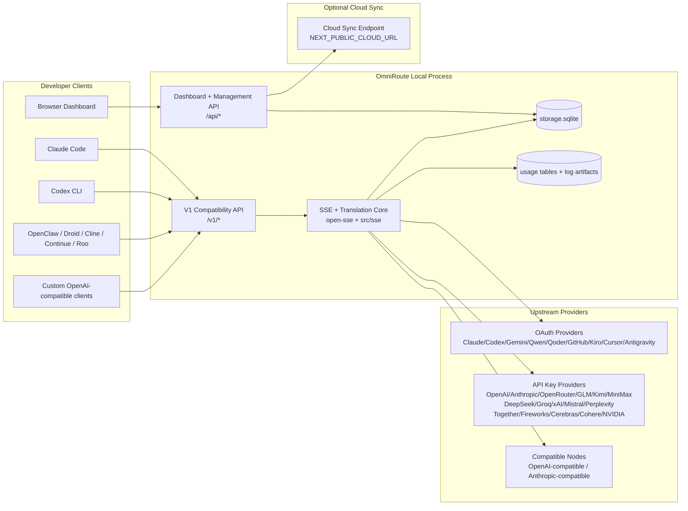
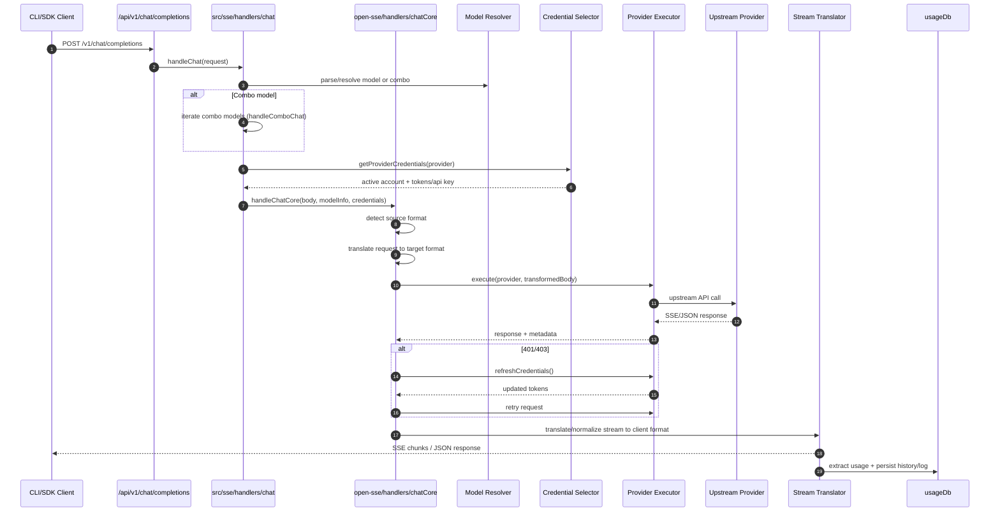
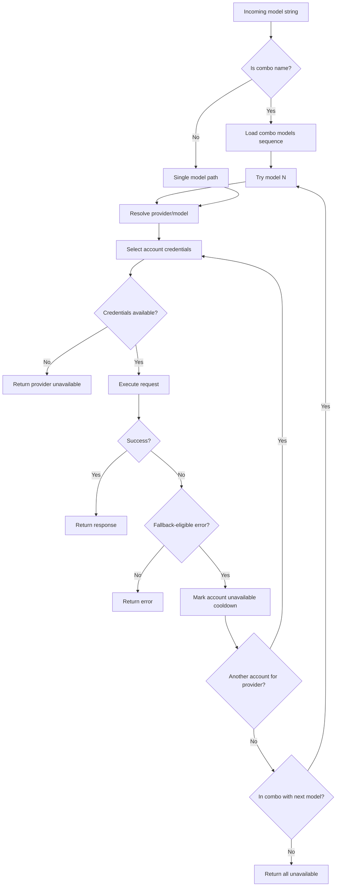
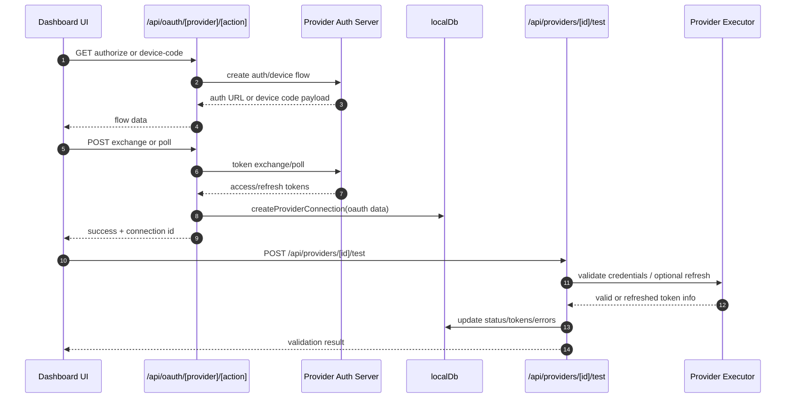
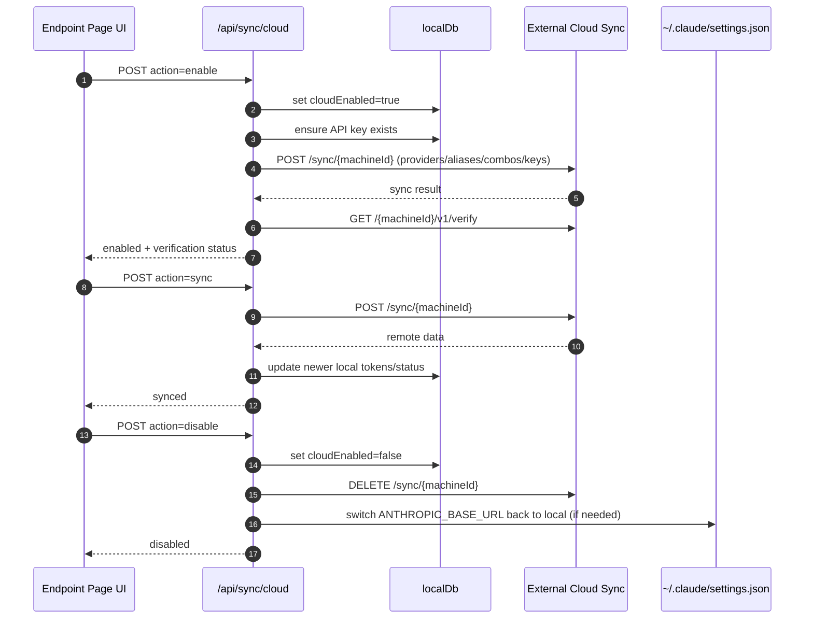
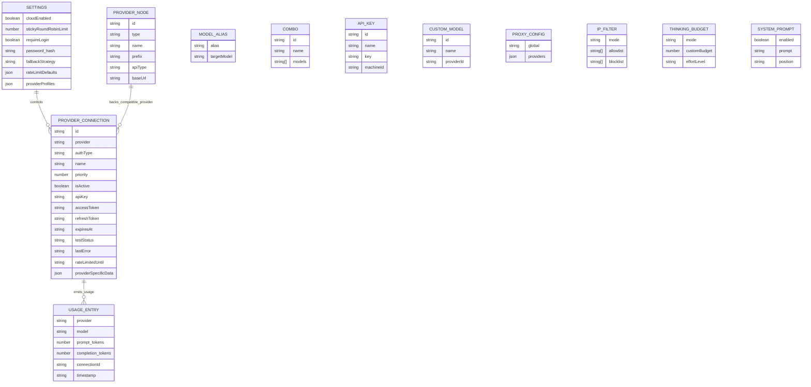
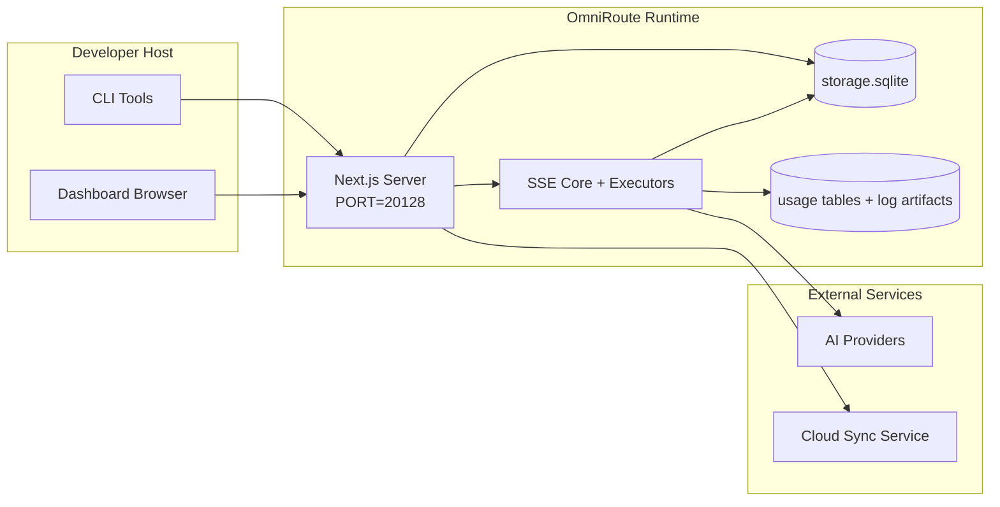

# OmniRoute Architecture (Norsk)

🌐 **Languages:** 🇺🇸 [English](../../../../docs/ARCHITECTURE.md) · 🇪🇸 [es](../../es/docs/ARCHITECTURE.md) · 🇫🇷 [fr](../../fr/docs/ARCHITECTURE.md) · 🇩🇪 [de](../../de/docs/ARCHITECTURE.md) · 🇮🇹 [it](../../it/docs/ARCHITECTURE.md) · 🇷🇺 [ru](../../ru/docs/ARCHITECTURE.md) · 🇨🇳 [zh-CN](../../zh-CN/docs/ARCHITECTURE.md) · 🇯🇵 [ja](../../ja/docs/ARCHITECTURE.md) · 🇰🇷 [ko](../../ko/docs/ARCHITECTURE.md) · 🇸🇦 [ar](../../ar/docs/ARCHITECTURE.md) · 🇮🇳 [hi](../../hi/docs/ARCHITECTURE.md) · 🇮🇳 [in](../../in/docs/ARCHITECTURE.md) · 🇹🇭 [th](../../th/docs/ARCHITECTURE.md) · 🇻🇳 [vi](../../vi/docs/ARCHITECTURE.md) · 🇮🇩 [id](../../id/docs/ARCHITECTURE.md) · 🇲🇾 [ms](../../ms/docs/ARCHITECTURE.md) · 🇳🇱 [nl](../../nl/docs/ARCHITECTURE.md) · 🇵🇱 [pl](../../pl/docs/ARCHITECTURE.md) · 🇸🇪 [sv](../../sv/docs/ARCHITECTURE.md) · 🇳🇴 [no](../../no/docs/ARCHITECTURE.md) · 🇩🇰 [da](../../da/docs/ARCHITECTURE.md) · 🇫🇮 [fi](../../fi/docs/ARCHITECTURE.md) · 🇵🇹 [pt](../../pt/docs/ARCHITECTURE.md) · 🇷🇴 [ro](../../ro/docs/ARCHITECTURE.md) · 🇭🇺 [hu](../../hu/docs/ARCHITECTURE.md) · 🇧🇬 [bg](../../bg/docs/ARCHITECTURE.md) · 🇸🇰 [sk](../../sk/docs/ARCHITECTURE.md) · 🇺🇦 [uk-UA](../../uk-UA/docs/ARCHITECTURE.md) · 🇮🇱 [he](../../he/docs/ARCHITECTURE.md) · 🇵🇭 [phi](../../phi/docs/ARCHITECTURE.md) · 🇧🇷 [pt-BR](../../pt-BR/docs/ARCHITECTURE.md) · 🇨🇿 [cs](../../cs/docs/ARCHITECTURE.md) · 🇹🇷 [tr](../../tr/docs/ARCHITECTURE.md)

---

_Sist oppdatert: 2026-03-28_## Executive Summary

OmniRoute er en lokal AI-rutinggateway og dashbord bygget på Next.js.
Den gir et enkelt OpenAI-kompatibelt endepunkt (`/v1/*`) og ruter trafikk på tvers av flere oppstrømsleverandører med oversettelse, reserve, token-oppdatering og brukssporing.

Kjernefunksjoner:

- OpenAI-kompatibel API-overflate for CLI/verktøy (28 leverandører)
- Forespørsel/svar oversettelse på tvers av leverandørformater
- Modellkombinasjonsfallback (multimodellsekvens)
- Reserveback på kontonivå (multikonto per leverandør)
- OAuth + API-nøkkelleverandør tilkoblingsadministrasjon
- Innebyggingsgenerering via `/v1/embeddings` (6 leverandører, 9 modeller)
- Bildegenerering via `/v1/images/generations` (4 leverandører, 9 modeller)
- Tenk tag-parsing (`<think>...</think>`) for resonneringsmodeller
- Respons sanitization for streng OpenAI SDK-kompatibilitet
- Rollenormalisering (utvikler→system, system→bruker) for kompatibilitet på tvers av leverandører
- Konvertering av strukturert utdata (json_schema → Gemini responseSchema)
- Lokal utholdenhet for leverandører, nøkler, aliaser, kombinasjoner, innstillinger, priser
- Bruks-/kostnadssporing og forespørselslogging
- Valgfri skysynkronisering for synkronisering av flere enheter/tilstander
- IP-godkjenningsliste/blokkeringsliste for API-tilgangskontroll
- Tenker budsjettstyring (gjennomgang/auto/tilpasset/tilpasset)
- Injeksjon av et globalt system
- Sesjonssporing og fingeravtrykk
- Forbedret prisbegrensning per konto med leverandørspesifikke profiler
- Strømbrytermønster for leverandørens motstandskraft
- Anti-tordenbeskyttelse med mutex-låsing
- Signaturbasert forespørselsdedupliseringsbuffer
- Domenelag: modelltilgjengelighet, kostnadsregler, reservepolicy, lockoutpolicy
- Vedvarende domenetilstand (SQLite-gjennomskrivingsbuffer for reserver, budsjetter, lockouts, strømbrytere)
- Policymotor for sentralisert forespørselsevaluering (lockout → budsjett → reserve)
- Be om telemetri med p50/p95/p99 latensaggregering
- Korrelasjons-ID (X-Request-Id) for ende-til-ende-sporing
- Overholdelsesrevisjonslogging med opt-out per API-nøkkel
- Eval rammeverk for LLM kvalitetssikring
- Resilience UI-dashbord med sanntids strømbryterstatus
- Modulære OAuth-leverandører (12 individuelle moduler under `src/lib/oauth/providers/`)

Primær kjøretidsmodell:

– Next.js app-ruter under `src/app/api/*` implementerer både dashbord-APIer og kompatibilitets-APIer

- En delt SSE/rutingkjerne i `src/sse/*` + `open-sse/*` håndterer leverandørutførelse, oversettelse, streaming, fallback og bruk## Scope and Boundaries

### In Scope

- Lokal gateway kjøretid
- Dashboard management APIer
- Leverandørautentisering og tokenoppdatering
- Be om oversettelse og SSE-streaming
- Lokal stat + bruksutholdenhet
- Valgfri skysynkroniseringsorkestrering### Out of Scope

- Implementering av skytjenester bak `NEXT_PUBLIC_CLOUD_URL`
- Leverandør SLA/kontrollplan utenfor lokal prosess
- Eksterne CLI-binærfiler i seg selv (Claude CLI, Codex CLI, etc.)## Dashboard Surface (Current)

Hovedsider under `src/app/(dashboard)/dashboard/`:

- `/dashboard` — hurtigstart + leverandøroversikt
- `/dashboard/endepunkt` — endepunktproxy + MCP + A2A + API-endepunktfaner
- `/dashboard/providers` — leverandørtilkoblinger og legitimasjon
- `/dashboard/combos` — kombinasjonsstrategier, maler, modellrutingsregler
- `/dashboard/costs` — kostnadsaggregering og prissynlighet
- `/dashboard/analytics` — bruksanalyse og evalueringer
- `/dashboard/limits` — kvote-/satskontroller
- `/dashboard/cli-tools` — CLI onboarding, runtime detection, config generering
- `/dashboard/agents` — oppdagede ACP-agenter + tilpasset agentregistrering
- `/dashboard/media` — bilde/video/musikklekeplass
- `/dashboard/search-tools` — testing og historikk for søkeleverandører
- `/dashboard/helse` — oppetid, strømbrytere, rategrenser
- `/dashboard/logs` — request/proxy/audit/console logger
- `/dashboard/innstillinger` — systeminnstillinger-faner (generelt, ruting, kombinasjonsstandarder, etc.)
- `/dashboard/api-manager` — API-nøkkellivssyklus og modelltillatelser## High-Level System Context



## Core Runtime Components

## 1) API and Routing Layer (Next.js App Routes)

Hovedkataloger:

- `src/app/api/v1/*` og `src/app/api/v1beta/*` for kompatibilitets-APIer
- `src/app/api/*` for administrasjons-/konfigurasjons-APIer
- Neste omskrives i `next.config.mjs` kart `/v1/*` til `/api/v1/*`

Viktige kompatibilitetsruter:

- `src/app/api/v1/chat/completions/route.ts`
- `src/app/api/v1/messages/route.ts`
- `src/app/api/v1/responses/route.ts`
- `src/app/api/v1/models/route.ts` – inkluderer egendefinerte modeller med `custom: true`
- `src/app/api/v1/embeddings/route.ts` — generering av innebygging (6 leverandører)
- `src/app/api/v1/images/generations/route.ts` — bildegenerering (4+ leverandører inkl. Antigravity/Nebius)
- `src/app/api/v1/messages/count_tokens/route.ts`
- `src/app/api/v1/providers/[provider]/chat/completions/route.ts` — dedikert chat per leverandør
- `src/app/api/v1/providers/[provider]/embeddings/route.ts` — dedikerte innbygginger per leverandør
- `src/app/api/v1/providers/[provider]/images/generations/route.ts` — dedikerte bilder per leverandør
- `src/app/api/v1beta/models/route.ts`
- `src/app/api/v1beta/models/[...path]/route.ts`

Administrasjonsdomener:

- Auth/innstillinger: `src/app/api/auth/*`, `src/app/api/settings/*`
- Leverandører/tilkoblinger: `src/app/api/providers*`
- Leverandørnoder: `src/app/api/provider-nodes*`
- Egendefinerte modeller: `src/app/api/provider-models` (GET/POST/DELETE)
- Modellkatalog: `src/app/api/models/route.ts` (GET)
- Proxy-konfigurasjon: `src/app/api/settings/proxy` (GET/PUT/DELETE) + `src/app/api/settings/proxy/test` (POST)
- OAuth: `src/app/api/oauth/*`
- Keys/aliases/combos/pricing: `src/app/api/keys*`, `src/app/api/models/alias`, `src/app/api/combos*`, `src/app/api/pricing`
- Bruk: `src/app/api/usage/*`
- Sync/cloud: `src/app/api/sync/*`, `src/app/api/cloud/*`
- CLI-verktøyhjelpere: `src/app/api/cli-tools/*`
- IP-filter: `src/app/api/settings/ip-filter` (GET/PUT)
- Tenkebudsjett: `src/app/api/settings/thinking-budget` (GET/PUT)
- Systemmelding: `src/app/api/settings/system-prompt` (GET/PUT)
- Økter: `src/app/api/sessions` (GET)
- Satsgrenser: `src/app/api/rate-limits` (GET)
- Resiliens: `src/app/api/resilience` (GET/PATCH) – leverandørprofiler, kretsbryter, rategrensetilstand
- Resilience reset: `src/app/api/resilience/reset` (POST) — tilbakestill brytere + nedkjøling
- Bufferstatistikk: `src/app/api/cache/stats` (GET/DELETE)
- Modelltilgjengelighet: `src/app/api/models/availability` (GET/POST)
- Telemetri: `src/app/api/telemetry/summary` (GET)
  – Budsjett: `src/app/api/usage/budget` (GET/POST)
- Reservekjeder: `src/app/api/fallback/chains` (GET/POST/DELETE)
- Samsvarsrevisjon: `src/app/api/compliance/audit-log` (GET)
- Evals: `src/app/api/evals` (GET/POST), `src/app/api/evals/[suiteId]` (GET)
- Retningslinjer: `src/app/api/policies` (GET/POST)## 2) SSE + Translation Core

Hovedstrømningsmoduler:

- Oppføring: `src/sse/handlers/chat.ts`
- Kjerneorkestrering: `open-sse/handlers/chatCore.ts`
- Leverandørutførelsesadaptere: `open-sse/executors/*`
- Formatdeteksjon/leverandørkonfigurasjon: `open-sse/services/provider.ts`
- Modellparse/resolve: `src/sse/services/model.ts`, `open-sse/services/model.ts`
- Kontoreservelogikk: `open-sse/services/accountFallback.ts`
- Oversettelsesregister: `open-sse/translator/index.ts`
- Strømtransformasjoner: `open-sse/utils/stream.ts`, `open-sse/utils/streamHandler.ts`
- Bruksutvinning/normalisering: `open-sse/utils/usageTracking.ts`
- Think tag-parser: `open-sse/utils/thinkTagParser.ts`
- Innebyggingsbehandler: `open-sse/handlers/embeddings.ts`
- Innebyggingsleverandørregister: `open-sse/config/embeddingRegistry.ts`
- Bildegenereringsbehandler: `open-sse/handlers/imageGeneration.ts`
- Bildeleverandørs register: `open-sse/config/imageRegistry.ts`
- Response sanitization: `open-sse/handlers/responseSanitizer.ts`
- Rollenormalisering: `open-sse/services/roleNormalizer.ts`

Tjenester (forretningslogikk):

- Kontovalg/score: `open-sse/services/accountSelector.ts`
- Context lifecycle management: `open-sse/services/contextManager.ts`
- Håndhevelse av IP-filter: `open-sse/services/ipFilter.ts`
- Sesjonssporing: `open-sse/services/sessionManager.ts`
- Be om deduplisering: `open-sse/services/signatureCache.ts`
- Systemprompt-injeksjon: `open-sse/services/systemPrompt.ts`
- Tenkende budsjettstyring: `open-sse/services/thinkingBudget.ts`
- Ruting av jokertegnmodell: `open-sse/services/wildcardRouter.ts`
- Satsgrenseadministrasjon: `open-sse/services/rateLimitManager.ts`
- Strømbryter: `open-sse/services/circuitBreaker.ts`

Domenelagsmoduler:

- Modelltilgjengelighet: `src/lib/domain/modelAvailability.ts`
- Kostnadsregler/budsjetter: `src/lib/domain/costRules.ts`
- Reservepolicy: `src/lib/domain/fallbackPolicy.ts`
- Combo resolver: `src/lib/domain/comboResolver.ts`
- Lockout policy: `src/lib/domain/lockoutPolicy.ts`
- Policymotor: `src/domain/policyEngine.ts` — sentralisert lockout → budsjett → reserveevaluering
- Feilkodekatalog: `src/lib/domain/errorCodes.ts`
- Forespørsels-ID: `src/lib/domain/requestId.ts`
- Tidsavbrudd for henting: `src/lib/domain/fetchTimeout.ts`
- Be om telemetri: `src/lib/domain/requestTelemetry.ts`
- Samsvar/revisjon: `src/lib/domain/compliance/index.ts`
- Eval runner: `src/lib/domain/evalRunner.ts`
- Vedvarende domenetilstand: `src/lib/db/domainState.ts` — SQLite CRUD for reservekjeder, budsjetter, kostnadshistorikk, lockout-tilstand, strømbrytere

OAuth-leverandørmoduler (12 individuelle filer under `src/lib/oauth/providers/`):

- Registerindeks: `src/lib/oauth/providers/index.ts`
- Individuelle leverandører: `claude.ts`, `codex.ts`, `gemini.ts`, `antigravity.ts`, `qoder.ts`, `qwen.ts`, `kimi-coding.ts`, `github.ts`, `kiro.ts`, `cursor.ts.`s.`s.`s.`s.`s.`s.`
- Tynn innpakning: `src/lib/oauth/providers.ts` — re-eksport fra individuelle moduler## 3) Persistence Layer

Primær tilstand DB (SQLite):

- Kjerneinfra: `src/lib/db/core.ts` (better-sqlite3, migreringer, WAL)
- Re-eksport fasade: `src/lib/localDb.ts` (tynt kompatibilitetslag for innringere)
- fil: `${DATA_DIR}/storage.sqlite` (eller `$XDG_CONFIG_HOME/omniroute/storage.sqlite` når angitt, ellers `~/.omniroute/storage.sqlite`)
- enheter (tabeller + KV-navnerom): providerConnections, providerNodes, modelAliases, combos, apiKeys, settings, pricing,**customModels**,**proxyConfig**,**ipFilter**,**thinkingBudget**,**systemPrompt**

Bruksutholdenhet:

- fasade: `src/lib/usageDb.ts` (dekomponerte moduler i `src/lib/usage/*`)
- SQLite-tabeller i `storage.sqlite`: `usage_history`, `call_logs`, `proxy_logs`
- valgfrie filartefakter forblir for kompatibilitet/feilsøking (`${DATA_DIR}/log.txt`, `${DATA_DIR}/call_logs/`, `<repo>/logs/...`)
- eldre JSON-filer migreres til SQLite ved oppstartsmigreringer når de finnes

Domenetilstand DB (SQLite):

- `src/lib/db/domainState.ts` — CRUD-operasjoner for domenetilstand
- Tabeller (opprettet i `src/lib/db/core.ts`): `domain_fallback_chains`, `domain_budgets`, `domain_cost_history`, `domain_lockout_state`, `domain_circuit_breakers`
- Gjennomskrivingsbuffermønster: kart i minnet er autoritative under kjøring; mutasjoner skrives synkront til SQLite; tilstand gjenopprettes fra DB ved kaldstart## 4) Auth + Security Surfaces

- Dashboard-informasjonskapselauth: `src/proxy.ts`, `src/app/api/auth/login/route.ts`
- Generering/verifisering av API-nøkler: `src/shared/utils/apiKey.ts`
- Leverandørhemmeligheter vedvarte i oppføringer for 'providerConnections'
- Utgående proxy-støtte via `open-sse/utils/proxyFetch.ts` (env vars) og `open-sse/utils/networkProxy.ts` (konfigurerbar per leverandør eller global)## 5) Cloud Sync

- Planlegger init: `src/lib/initCloudSync.ts`, `src/shared/services/initializeCloudSync.ts`, `src/shared/services/modelSyncScheduler.ts`
- Periodisk oppgave: `src/shared/services/cloudSyncScheduler.ts`
- Periodisk oppgave: `src/shared/services/modelSyncScheduler.ts`
- Kontrollrute: `src/app/api/sync/cloud/route.ts`## Request Lifecycle (`/v1/chat/completions`)



## Combo + Account Fallback Flow



Reservebeslutninger er drevet av `open-sse/services/accountFallback.ts` ved bruk av statuskoder og feilmeldingsheuristikk. Kombinasjonsruting legger til en ekstra beskyttelse: 400-er med leverandøromfang som oppstrøms innholdsblokkering og rollevalideringsfeil blir behandlet som modelllokale feil, slik at senere kombinasjonsmål fortsatt kan kjøres.## OAuth Onboarding and Token Refresh Lifecycle



Oppdatering under live trafikk utføres inne i `open-sse/handlers/chatCore.ts` via eksekveren `refreshCredentials()`.## Cloud Sync Lifecycle (Enable / Sync / Disable)



Periodisk synkronisering utløses av 'CloudSyncScheduler' når skyen er aktivert.## Data Model and Storage Map



Fysiske lagringsfiler:

- primær kjøretids-DB: `${DATA_DIR}/storage.sqlite`
- be om logglinjer: `${DATA_DIR}/log.txt` (compat/debug artefakt)
- strukturerte anropsnyttelastarkiver: `${DATA_DIR}/call_logs/`
- valgfrie oversetter/forespørsler om feilsøkingsøkter: `<repo>/logs/...`## Deployment Topology



## Module Mapping (Decision-Critical)

### Route and API Modules

- `src/app/api/v1/*`, `src/app/api/v1beta/*`: kompatibilitets-APIer
- `src/app/api/v1/providers/[provider]/*`: dedikerte ruter per leverandør (chat, innebygging, bilder)
- `src/app/api/providers*`: leverandør CRUD, validering, testing
- `src/app/api/provider-nodes*`: tilpasset kompatibel nodeadministrasjon
- `src/app/api/provider-models`: tilpasset modelladministrasjon (CRUD)
- `src/app/api/models/route.ts`: modellkatalog API (aliaser + tilpassede modeller)
- `src/app/api/oauth/*`: OAuth/enhetskode flyter
- `src/app/api/keys*`: lokal API-nøkkellivssyklus
- `src/app/api/models/alias`: aliasadministrasjon
- `src/app/api/combos*`: reservekombinasjonsadministrasjon
- `src/app/api/pricing`: prisoverstyringer for kostnadsberegning
- `src/app/api/settings/proxy`: proxy-konfigurasjon (GET/PUT/DELETE)
- `src/app/api/settings/proxy/test`: utgående proxy-tilkoblingstest (POST)
- `src/app/api/usage/*`: API-er for bruk og logger
- `src/app/api/sync/*` + `src/app/api/cloud/*`: skysynkronisering og skyvendte hjelpere
- `src/app/api/cli-tools/*`: lokale CLI-konfigurasjonsforfattere/kontrollere
- `src/app/api/settings/ip-filter`: IP-godkjenningsliste/blokkeringsliste (GET/PUT)
- `src/app/api/settings/thinking-budget`: budsjettkonfigurasjon for tenketoken (GET/PUT)
- `src/app/api/settings/system-prompt`: global systemmelding (GET/PUT)
- `src/app/api/sessions`: aktiv øktoppføring (GET)
- `src/app/api/rate-limits`: rategrensestatus per konto (GET)### Routing and Execution Core

- `src/sse/handlers/chat.ts`: forespørsel om parse, kombinasjonshåndtering, kontovalgsløyfe
- `open-sse/handlers/chatCore.ts`: oversettelse, eksekutorutsendelse, prøv på nytt/oppdateringshåndtering, strømoppsett
- `open-sse/executors/*`: leverandørspesifikk nettverks- og formatatferd### Translation Registry and Format Converters

- `open-sse/translator/index.ts`: oversetterregister og orkestrering
- Be om oversettere: `open-sse/translator/request/*`
- Responsoversettere: `open-sse/translator/response/*`
- Formatkonstanter: `open-sse/translator/formats.ts`### Persistence

- `src/lib/db/*`: vedvarende config/state og domene persistens på SQLite
- `src/lib/localDb.ts`: re-eksport av kompatibilitet for DB-moduler
- `src/lib/usageDb.ts`: brukshistorikk/anropsloggfasade på toppen av SQLite-tabeller## Provider Executor Coverage (Strategy Pattern)

Hver leverandør har en spesialisert executor som utvider `BaseExecutor` (i `open-sse/executors/base.ts`), som gir URL-bygging, header-konstruksjon, forsøk på nytt med eksponentiell backoff, credential refresh hooks og `execute()`-orkestreringsmetoden.

| Utfører               | Leverandør(er)                                                                                                                                               | Spesiell håndtering                                                          |
| --------------------- | ------------------------------------------------------------------------------------------------------------------------------------------------------------ | ---------------------------------------------------------------------------- |
| `DefaultExecutor`     | OpenAI, Claude, Gemini, Qwen, Qoder, OpenRouter, GLM, Kimi, MiniMax, DeepSeek, Groq, xAI, Mistral, Perplexity, Together, Fireworks, Cerebras, Cohere, NVIDIA | Dynamisk URL/header-konfigurasjon per leverandør                             |
| `AntigravityExecutor` | Google Antigravity                                                                                                                                           | Egendefinerte prosjekt-/sesjons-ID-er, Prøv på nytt etter parsing            |
| `CodexExecutor`       | OpenAI Codex                                                                                                                                                 | Injiserer systeminstruksjoner, tvinger resonnementinnsats                    |
| `CursorExecutor`      | Markør IDE                                                                                                                                                   | ConnectRPC-protokoll, Protobuf-koding, forespørsel om signering via sjekksum |
| `GithubExecutor`      | GitHub Copilot                                                                                                                                               | Copilot token oppdatering, VSCode-lignende overskrifter                      |
| `KiroExecutor`        | AWS CodeWhisperer/Kiro                                                                                                                                       | AWS EventStream binært format → SSE-konvertering                             |
| `GeminiCLIExecutor`   | Gemini CLI                                                                                                                                                   | Oppdateringssyklus for Google OAuth-token                                    |

Alle andre leverandører (inkludert tilpassede kompatible noder) bruker "DefaultExecutor".## Provider Compatibility Matrix

| Leverandør       | Format          | Auth                  | Stream           | Ikke-stream | Token oppdatering | Bruks-API                |
| ---------------- | --------------- | --------------------- | ---------------- | ----------- | ----------------- | ------------------------ | ------------------------------ |
| Claude           | claude          | API-nøkkel / OAuth    | ✅               | ✅          | ✅                | ⚠️ Kun administrator     |
| Tvillingene      | Gemini          | API-nøkkel / OAuth    | ✅               | ✅          | ✅                | ⚠️ Cloud Console         |
| Gemini CLI       | gemini-cli      | OAuth                 | ✅               | ✅          | ✅                | ⚠️ Cloud Console         |
| Antigravitasjon  | antigravitasjon | OAuth                 | ✅               | ✅          | ✅                | ✅ Full kvote API        |
| OpenAI           | openai          | API-nøkkel            | ✅               | ✅          | ❌                | ❌                       |
| Codex            | openai-svar     | OAuth                 | ✅ tvunget       | ❌          | ✅                | ✅ Satsgrenser           |
| GitHub Copilot   | openai          | OAuth + Copilot Token | ✅               | ✅          | ✅                | ✅ Kvote øyeblikksbilder |
| Markør           | markør          | Egendefinert sjekksum | ✅               | ✅          | ❌                | ❌                       |
| Kiro             | kiro            | AWS SSO OIDC          | ✅ (EventStream) | ❌          | ✅                | ✅ Bruksgrenser          |
| Qwen             | openai          | OAuth                 | ✅               | ✅          | ✅                | ⚠️ Per forespørsel       |
| Qoder            | openai          | OAuth (Grunnleggende) | ✅               | ✅          | ✅                | ⚠️ Per forespørsel       |
| OpenRouter       | openai          | API-nøkkel            | ✅               | ✅          | ❌                | ❌                       |
| GLM/Kimi/MiniMax | claude          | API-nøkkel            | ✅               | ✅          | ❌                | ❌                       |
| DeepSeek         | openai          | API-nøkkel            | ✅               | ✅          | ❌                | ❌                       |
| Groq             | openai          | API-nøkkel            | ✅               | ✅          | ❌                | ❌                       |
| xAI (Grok)       | openai          | API-nøkkel            | ✅               | ✅          | ❌                | ❌                       |
| Mistral          | openai          | API-nøkkel            | ✅               | ✅          | ❌                | ❌                       |
| Forvirring       | openai          | API-nøkkel            | ✅               | ✅          | ❌                | ❌                       |
| Sammen AI        | openai          | API-nøkkel            | ✅               | ✅          | ❌                | ❌                       |
| Fyrverkeri AI    | openai          | API-nøkkel            | ✅               | ✅          | ❌                | ❌                       |
| Cerebras         | openai          | API-nøkkel            | ✅               | ✅          | ❌                | ❌                       |
| Sammenheng       | openai          | API-nøkkel            | ✅               | ✅          | ❌                | ❌                       |
| NVIDIA NIM       | openai          | API-nøkkel            | ✅               | ✅          | ❌                | ❌                       | ## Format Translation Coverage |

Oppdagede kildeformater inkluderer:

- `openai`
- `openai-svar`
- `Claude`
- 'tvilling'

Målformater inkluderer:

- OpenAI chat/svar
- Claude
- Gemini/Gemini-CLI/Antigravity konvolutt
- Kiro
- Markør

Oversettelser bruker**OpenAI som hub-format**– alle konverteringer går gjennom OpenAI som mellomliggende:```
Source Format → OpenAI (hub) → Target Format

````

Oversettelser velges dynamisk basert på kildens nyttelastform og leverandørens målformat.

Ytterligere behandlingslag i oversettelsespipelinen:

-**Sansering av svar**- Fjerner ikke-standardfelter fra svar i OpenAI-format (både strømming og ikke-strømming) for å sikre streng SDK-overholdelse
-**Rollenormalisering**— Konverterer `utvikler` → `system` for ikke-OpenAI-mål; slår sammen `system` → `bruker` for modeller som avviser systemrollen (GLM, ERNIE)
-**Tenk-tag-utvinning**— analyserer «<tenke>...</tenke>»-blokker fra innhold til «reasoning_content»-feltet
-**Structured output**— Konverterer OpenAI `response_format.json_schema` til Geminis `responseMimeType` + `responseSchema`## Supported API Endpoints

| Endepunkt | Format | Handler |
| ---------------------------------------------------------- | ------------------ | -------------------------------------------------------------------------- |
| `POST /v1/chat/fullføringer` | OpenAI Chat | `src/sse/handlers/chat.ts` |
| `POST /v1/meldinger` | Claude Meldinger | Samme behandler (automatisk oppdaget) |
| `POST /v1/responses` | OpenAI-svar | `open-sse/handlers/responsesHandler.ts` |
| `POST /v1/embeddings` | OpenAI Embeddings | `open-sse/handlers/embeddings.ts` |
| `GET /v1/embeddings` | Modellliste | API-rute |
| `POST /v1/bilder/generasjoner` | OpenAI-bilder | `open-sse/handlers/imageGeneration.ts` |
| `GET /v1/images/generations` | Modellliste | API-rute |
| `POST /v1/providers/{provider}/chat/completions` | OpenAI Chat | Dedikert per leverandør med modellvalidering |
| `POST /v1/providers/{provider}/embeddings` | OpenAI Embeddings | Dedikert per leverandør med modellvalidering |
| `POST /v1/providers/{provider}/images/generations` | OpenAI-bilder | Dedikert per leverandør med modellvalidering |
| `POST /v1/messages/count_tokens` | Claude Token Count | API-rute |
| `GET /v1/modeller` | OpenAI-modellliste | API-rute (chat + innebygging + bilde + tilpassede modeller) |
| `GET /api/modeller/katalog` | Katalog | Alle modeller gruppert etter leverandør + type |
| `POST /v1beta/models/*:streamGenerateContent` | Gemini innfødt | API-rute |
| `GET/PUT/DELETE /api/settings/proxy` | Proxy-konfigurasjon | Nettverks proxy-konfigurasjon |
| `POST /api/settings/proxy/test` | Proxy-tilkobling | Proxy helse/tilkoblingstestendepunkt |
| `GET/POST/DELETE /api/provider-models` | Leverandørmodeller | Leverandørmodellmetadata støtter tilpassede og administrerte tilgjengelige modeller |## Bypass Handler

Bypass-behandleren (`open-sse/utils/bypassHandler.ts`) avskjærer kjente "kasting"-forespørsler fra Claude CLI – oppvarmingspinger, tittelutdrag og tokentellinger – og returnerer et**falsk svar**uten å forbruke oppstrømsleverandørtokens. Dette utløses bare når `User-Agent` inneholder `claude-cli`.## Request Logger Pipeline

Forespørselsloggeren (`open-sse/utils/requestLogger.ts`) gir en 7-trinns debug logging pipeline, deaktivert som standard, aktivert via `ENABLE_REQUEST_LOGS=true`:```
1_req_client.json → 2_req_source.json → 3_req_openai.json → 4_req_target.json
→ 5_res_provider.txt → 6_res_openai.txt → 7_res_client.txt
````

Filer skrives til `<repo>/logs/<session>/` for hver forespørselsøkt.## Failure Modes and Resilience

## 1) Account/Provider Availability

- Nedkjøling av leverandørens konto på forbigående/rate/auth-feil
- kontoreserve før mislykket forespørsel
- combo modell fallback når gjeldende modell/leverandørbane er oppbrukt## 2) Token Expiry

- forhåndssjekk og oppdater med nytt forsøk for leverandører som kan oppdateres
- 401/403 prøv på nytt etter oppdateringsforsøk i kjernebanen## 3) Stream Safety

- frakoblingsbevisst strømkontroller
- oversettelsesstrøm med flush ved slutten av strømmen og "[FERDIG]"-håndtering
  – fallback for bruksestimat når leverandørbruksmetadata mangler## 4) Cloud Sync Degradation

- Synkroniseringsfeil dukker opp, men lokal kjøretid fortsetter
- planleggeren har logikk som kan forsøke på nytt, men periodisk kjøring kaller for øyeblikket enkeltforsøkssynkronisering som standard## 5) Data Integrity

- SQLite-skjemamigrering og auto-oppgraderingshooks ved oppstart
- eldre JSON → SQLite-migreringskompatibilitetsbane## Observability and Operational Signals

Synlighetskilder for kjøretid:

- konsolllogger fra `src/sse/utils/logger.ts`
- bruksaggregater per forespørsel i SQLite (`usage_history`, `call_logs`, `proxy_logs`)
- fire-trinns detaljert nyttelastfangst i SQLite (`request_detail_logs`) når `settings.detailed_logs_enabled=true`
- statuslogg for tekstforespørsel i `log.txt` (valgfritt/kompat)
- valgfrie dype forespørsels-/oversettelseslogger under `logger/` når `ENABLE_REQUEST_LOGS=true`
- endepunkter for dashbordbruk (`/api/usage/*`) for brukergrensesnittforbruk

Detaljert forespørsel om nyttelastfangst lagrer opptil fire JSON-nyttelaststadier per rutet samtale:

- rå forespørsel mottatt fra klienten
- oversatt forespørsel faktisk sendt oppstrøms
- leverandørsvar rekonstruert som JSON; streamede svar komprimeres til det endelige sammendraget pluss strømmetadata
- endelig kundesvar returnert av OmniRoute; streamede svar lagres i samme kompakte sammendragsskjema## Security-Sensitive Boundaries

- JWT secret (`JWT_SECRET`) sikrer bekreftelse/signering av informasjonskapsler for dashbordøkten
- Oppstartsoppstart for passord ('INITIAL_PASSWORD') bør eksplisitt konfigureres for førstegangsklargjøring
- API-nøkkel HMAC-hemmelighet (`API_KEY_SECRET`) sikrer generert lokalt API-nøkkelformat
- Leverandørhemmeligheter (API-nøkler/-tokens) er bevart i lokal DB og bør beskyttes på filsystemnivå
- Sluttpunkter for skysynkronisering er avhengige av API-nøkkelautentisering + maskin-ID-semantikk## Environment and Runtime Matrix

Miljøvariabler som brukes aktivt av kode:

- App/auth: `JWT_SECRET`, `INITIAL_PASSWORD`
- Lagring: `DATA_DIR`
- Kompatibel nodeoppførsel: `ALLOW_MULTI_CONNECTIONS_PER_COMPAT_NODE`
- Valgfri lagringsbaseoverstyring (Linux/macOS når `DATA_DIR` er deaktivert): `XDG_CONFIG_HOME`
- Sikkerhetshashing: `API_KEY_SECRET`, `MACHINE_ID_SALT`
- Logging: `ENABLE_REQUEST_LOGS`
- Synkronisering/nettadresse i nettskyen: `NEXT_PUBLIC_BASE_URL`, `NEXT_PUBLIC_CLOUD_URL`
- Utgående proxy: `HTTP_PROXY`, `HTTPS_PROXY`, `ALL_PROXY`, `NO_PROXY` og varianter av små bokstaver
- SOCKS5-funksjonsflagg: `ENABLE_SOCKS5_PROXY`, `NEXT_PUBLIC_ENABLE_SOCKS5_PROXY`
  – Plattform-/kjøretidshjelpere (ikke appspesifikk konfigurasjon): `APPDATA`, `NODE_ENV`, `PORT`, `HOSTNAME`## Known Architectural Notes

1. `usageDb` og `localDb` deler samme grunnkatalogpolicy (`DATA_DIR` -> `XDG_CONFIG_HOME/omniroute` -> `~/.omniroute`) med eldre filmigrering.
2. `/api/v1/route.ts` delegerer til den samme enhetlige katalogbyggeren som brukes av `/api/v1/models` (`src/app/api/v1/models/catalog.ts`) for å unngå semantisk drift.
3. Forespørselslogger skriver fullstendige overskrifter/tekst når den er aktivert; behandle loggkatalogen som sensitiv.
4. Skyadferd avhenger av korrekt `NEXT_PUBLIC_BASE_URL` og tilgjengelighet for skyendepunkter.
5. `open-sse/`-katalogen er publisert som `@omniroute/open-sse`**npm-arbeidsområdepakken**. Kildekoden importerer den via `@omniroute/open-sse/...` (løst av Next.js `transpilePackages`). Filbaner i dette dokumentet bruker fortsatt katalognavnet `open-sse/` for konsistens.
6. Diagrammer i dashbordet bruker**Recharts**(SVG-basert) for tilgjengelige, interaktive analysevisualiseringer (stolpediagram for modellbruk, leverandøroversiktstabeller med suksessrater).
7. E2E-tester bruker**Playwright**(`tests/e2e/`), kjøres via `npm run test:e2e`. Enhetstester bruker**Node.js testløper**(`tests/unit/`), kjøres via `npm run test:unit`. Kildekoden under `src/` er**TypeScript**(`.ts`/`.tsx`); «open-sse/»-arbeidsområdet forblir JavaScript (.js).
8. Innstillinger-siden er organisert i 5 faner: Sikkerhet, Ruting (6 globale strategier: fill-first, round-robin, p2c, random, minst brukt, kostnadsoptimalisert), Resiliens (redigerbare hastighetsgrenser, strømbryter, policyer), AI (tenkebudsjett, systemprompt, promptbuffer), Advanced (proxy).## Operational Verification Checklist

- Bygg fra kilden: `npm run build`
- Bygg Docker-bilde: `docker build -t omniroute .`
- Start tjenesten og bekreft:
- `GET /api/innstillinger`
- `GET /api/v1/modeller`
- CLI-målbase-URL skal være «http://<vert>:20128/v1» når «PORT=20128»
