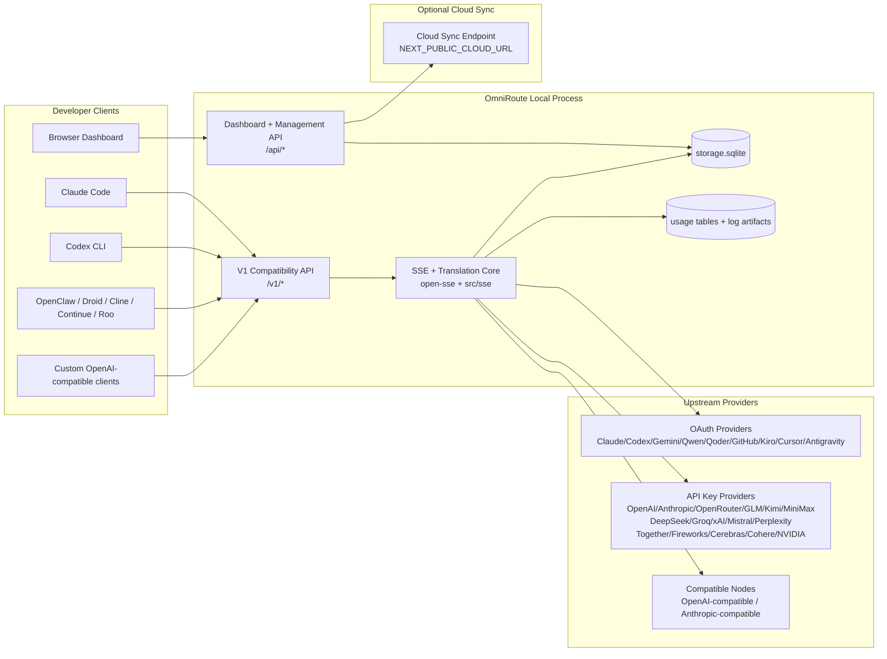
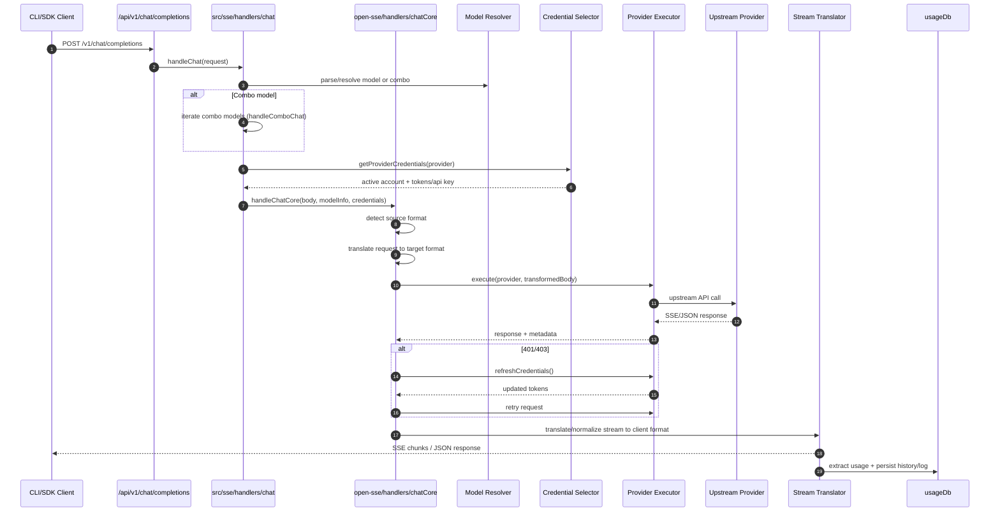
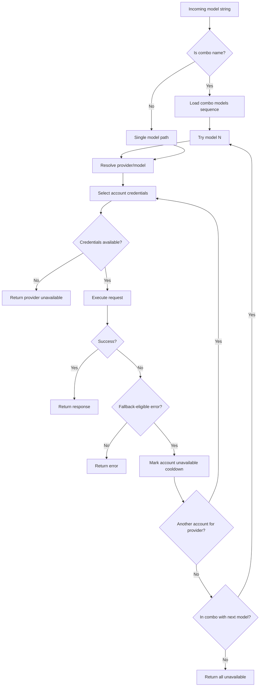
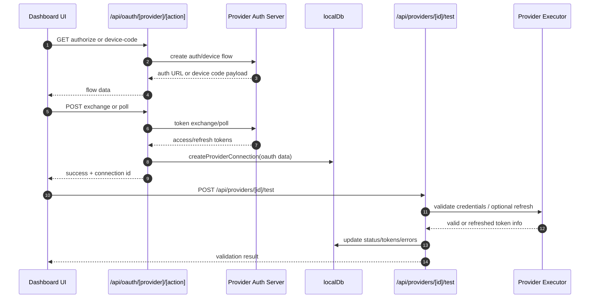
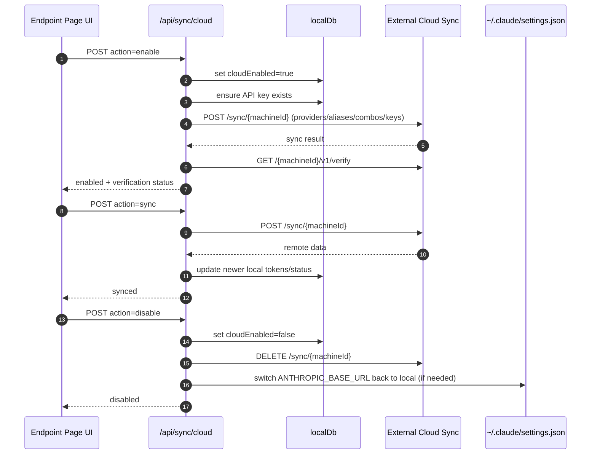
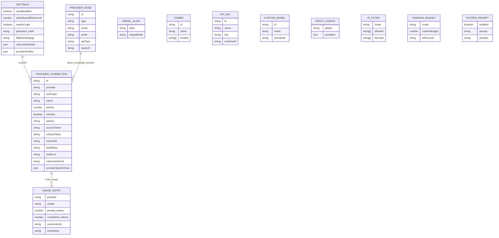
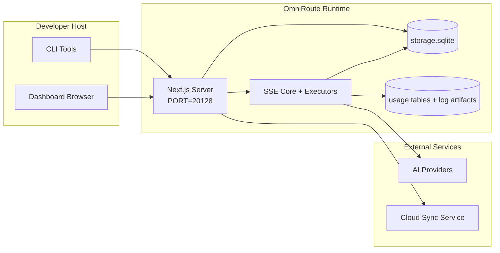

# OmniRoute Architecture (Filipino)

🌐 **Languages:** 🇺🇸 [English](../../../../docs/ARCHITECTURE.md) · 🇪🇸 [es](../../es/docs/ARCHITECTURE.md) · 🇫🇷 [fr](../../fr/docs/ARCHITECTURE.md) · 🇩🇪 [de](../../de/docs/ARCHITECTURE.md) · 🇮🇹 [it](../../it/docs/ARCHITECTURE.md) · 🇷🇺 [ru](../../ru/docs/ARCHITECTURE.md) · 🇨🇳 [zh-CN](../../zh-CN/docs/ARCHITECTURE.md) · 🇯🇵 [ja](../../ja/docs/ARCHITECTURE.md) · 🇰🇷 [ko](../../ko/docs/ARCHITECTURE.md) · 🇸🇦 [ar](../../ar/docs/ARCHITECTURE.md) · 🇮🇳 [hi](../../hi/docs/ARCHITECTURE.md) · 🇮🇳 [in](../../in/docs/ARCHITECTURE.md) · 🇹🇭 [th](../../th/docs/ARCHITECTURE.md) · 🇻🇳 [vi](../../vi/docs/ARCHITECTURE.md) · 🇮🇩 [id](../../id/docs/ARCHITECTURE.md) · 🇲🇾 [ms](../../ms/docs/ARCHITECTURE.md) · 🇳🇱 [nl](../../nl/docs/ARCHITECTURE.md) · 🇵🇱 [pl](../../pl/docs/ARCHITECTURE.md) · 🇸🇪 [sv](../../sv/docs/ARCHITECTURE.md) · 🇳🇴 [no](../../no/docs/ARCHITECTURE.md) · 🇩🇰 [da](../../da/docs/ARCHITECTURE.md) · 🇫🇮 [fi](../../fi/docs/ARCHITECTURE.md) · 🇵🇹 [pt](../../pt/docs/ARCHITECTURE.md) · 🇷🇴 [ro](../../ro/docs/ARCHITECTURE.md) · 🇭🇺 [hu](../../hu/docs/ARCHITECTURE.md) · 🇧🇬 [bg](../../bg/docs/ARCHITECTURE.md) · 🇸🇰 [sk](../../sk/docs/ARCHITECTURE.md) · 🇺🇦 [uk-UA](../../uk-UA/docs/ARCHITECTURE.md) · 🇮🇱 [he](../../he/docs/ARCHITECTURE.md) · 🇵🇭 [phi](../../phi/docs/ARCHITECTURE.md) · 🇧🇷 [pt-BR](../../pt-BR/docs/ARCHITECTURE.md) · 🇨🇿 [cs](../../cs/docs/ARCHITECTURE.md) · 🇹🇷 [tr](../../tr/docs/ARCHITECTURE.md)

---

_Huling na-update: 2026-03-28_## Executive Summary

Ang OmniRoute ay isang lokal na AI routing gateway at dashboard na binuo sa Next.js.
Nagbibigay ito ng isang endpoint na katugma sa OpenAI (`/v1/*`) at niruruta ang trapiko sa maraming upstream provider na may pagsasalin, fallback, pag-refresh ng token, at pagsubaybay sa paggamit.

Mga pangunahing kakayahan:

- OpenAI-compatible na API surface para sa CLI/tools (28 provider)
- Kahilingan/tugon sa pagsasalin sa mga format ng provider
- Modelong combo fallback (multi-model sequence)
- Account-level fallback (multi-account bawat provider)
- Pamamahala ng koneksyon ng provider ng OAuth + API-key
- Pagbuo ng pag-embed sa pamamagitan ng `/v1/embeddings` (6 na provider, 9 na modelo)
- Pagbuo ng larawan sa pamamagitan ng `/v1/images/generations` (4 na provider, 9 na modelo)
- Isipin ang pag-parse ng tag (`<think>...</think>`) para sa mga modelo ng pangangatwiran
- Response sanitization para sa mahigpit na OpenAI SDK compatibility
- Pag-normalize ng tungkulin (developer→system, system→user) para sa cross-provider compatibility
- Structured output conversion (json_schema → Gemini responseSchema)
- Lokal na pagtitiyaga para sa mga provider, key, alias, combo, setting, pagpepresyo
- Pagsubaybay sa paggamit/gastos at pag-log ng kahilingan
- Opsyonal na cloud sync para sa multi-device/state sync
- IP allowlist/blocklist para sa API access control
- Pag-iisip ng pamamahala sa badyet (passthrough/auto/custom/adaptive)
- Global system prompt injection
- Pagsubaybay sa session at fingerprinting
- Paglilimita sa pinahusay na rate ng bawat account gamit ang mga profile na partikular sa provider
- Pattern ng circuit breaker para sa katatagan ng provider
- Proteksyon laban sa dumadagundong na kawan na may mutex locking
- Nakabatay sa lagda ang cache ng pag-deduplication ng kahilingan
- Layer ng domain: availability ng modelo, mga panuntunan sa gastos, patakaran sa fallback, patakaran sa lockout
- Pananatili ng estado ng domain (SQLite write-through cache para sa mga fallback, badyet, lockout, circuit breaker)
- Policy engine para sa sentralisadong pagsusuri ng kahilingan (lockout → budget → fallback)
- Humiling ng telemetry na may p50/p95/p99 latency aggregation
- Correlation ID (X-Request-Id) para sa end-to-end na pagsubaybay
- Pag-log sa audit ng pagsunod gamit ang opt-out sa bawat API key
- Eval framework para sa LLM quality assurance
- Resilience UI dashboard na may real-time na status ng circuit breaker
- Modular OAuth providers (12 indibidwal na module sa ilalim ng `src/lib/oauth/providers/`)

Pangunahing modelo ng runtime:

- Ang mga ruta ng Next.js app sa ilalim ng `src/app/api/*` ay nagpapatupad ng parehong dashboard API at compatibility API
- Isang nakabahaging SSE/routing core sa `src/sse/*` + `open-sse/*` ang humahawak sa pagpapatupad ng provider, pagsasalin, streaming, fallback, at paggamit## Scope and Boundaries

### In Scope

- Lokal na gateway runtime
- Mga API sa pamamahala ng dashboard
- Pagpapatunay ng provider at pag-refresh ng token
- Humiling ng pagsasalin at SSE streaming
- Lokal na estado + pagtitiyaga sa paggamit
- Opsyonal na cloud sync orchestration### Out of Scope

- Pagpapatupad ng serbisyo sa cloud sa likod ng `NEXT_PUBLIC_CLOUD_URL`
- Provider SLA/control plane sa labas ng lokal na proseso
- Mga panlabas na CLI binary mismo (Claude CLI, Codex CLI, atbp.)## Dashboard Surface (Current)

Mga pangunahing pahina sa ilalim ng `src/app/(dashboard)/dashboard/`:

- `/dashboard` — mabilis na pagsisimula + pangkalahatang-ideya ng provider
- `/dashboard/endpoint` — endpoint proxy + MCP + A2A + API endpoint na mga tab
- `/dashboard/providers` — mga koneksyon at kredensyal ng provider
- `/dashboard/combos` — mga combo na diskarte, mga template, mga panuntunan sa pagruruta ng modelo
- `/dashboard/costs` — pagsasama-sama ng gastos at visibility ng pagpepresyo
- `/dashboard/analytics` — analytics ng paggamit at mga pagsusuri
- `/dashboard/limits` — mga kontrol sa quota/rate
- `/dashboard/cli-tools` — CLI onboarding, runtime detection, config generation
- `/dashboard/agents` — nakitang mga ahente ng ACP + pagpaparehistro ng custom na ahente
- `/dashboard/media` — larawan/video/palaruan ng musika
- `/dashboard/search-tools` — pagsubok at kasaysayan ng provider ng paghahanap
- `/dashboard/health` — uptime, mga circuit breaker, mga limitasyon sa rate
- `/dashboard/logs` — kahilingan/proxy/audit/console log
- `/dashboard/settings` — mga tab ng mga setting ng system (pangkalahatan, pagruruta, mga default ng combo, atbp.)
- `/dashboard/api-manager` — Lifecycle ng key ng API at mga pahintulot ng modelo## High-Level System Context



## Core Runtime Components

## 1) API and Routing Layer (Next.js App Routes)

Mga pangunahing direktoryo:

- `src/app/api/v1/*` at `src/app/api/v1beta/*` para sa mga compatibility API
- `src/app/api/*` para sa mga management/configuration API
- Susunod na muling pagsusulat sa `next.config.mjs` na mapa `/v1/*` sa `/api/v1/*`

Mahahalagang ruta ng compatibility:

- `src/app/api/v1/chat/completions/route.ts`
- `src/app/api/v1/messages/route.ts`
- `src/app/api/v1/responses/route.ts`
- `src/app/api/v1/models/route.ts` — kasama ang mga custom na modelo na may `custom: true`
- `src/app/api/v1/embeddings/route.ts` — pagbuo ng pag-embed (6 na provider)
- `src/app/api/v1/images/generations/route.ts` — pagbuo ng larawan (4+ provider kasama ang Antigravity/Nebius)
- `src/app/api/v1/messages/count_tokens/route.ts`
- `src/app/api/v1/providers/[provider]/chat/completions/route.ts` — nakatuong per-provider chat
- `src/app/api/v1/providers/[provider]/embeddings/route.ts` — nakalaang mga pag-embed ng bawat provider
- `src/app/api/v1/providers/[provider]/images/generations/route.ts` — nakalaang mga larawan ng bawat provider
- `src/app/api/v1beta/models/route.ts`
- `src/app/api/v1beta/models/[...path]/route.ts`

Mga domain ng pamamahala:

- Auth/setting: `src/app/api/auth/*`, `src/app/api/settings/*`
- Mga provider/koneksyon: `src/app/api/providers*`
- Mga node ng provider: `src/app/api/provider-nodes*`
- Mga custom na modelo: `src/app/api/provider-models` (GET/POST/DELETE)
- Catalog ng modelo: `src/app/api/models/route.ts` (GET)
- Proxy config: `src/app/api/settings/proxy` (GET/PUT/DELETE) + `src/app/api/settings/proxy/test` (POST)
- OAuth: `src/app/api/oauth/*`
- Mga Key/aliases/combos/presyo: `src/app/api/keys*`, `src/app/api/models/alias`, `src/app/api/combos*`, `src/app/api/pricing`
- Paggamit: `src/app/api/usage/*`
- Pag-sync/cloud: `src/app/api/sync/*`, `src/app/api/cloud/*`
- Mga katulong sa CLI tooling: `src/app/api/cli-tools/*`
- IP filter: `src/app/api/settings/ip-filter` (GET/PUT)
- Pag-iisip na badyet: `src/app/api/settings/thinking-budget` (GET/PUT)
- System prompt: `src/app/api/settings/system-prompt` (GET/PUT)
- Mga Session: `src/app/api/sessions` (GET)
- Mga limitasyon sa rate: `src/app/api/rate-limits` (GET)
- Katatagan: `src/app/api/resilience` (GET/PATCH) — mga profile ng provider, circuit breaker, estado ng limitasyon sa rate
- Resilience reset: `src/app/api/resilience/reset` (POST) — reset breakers + cooldowns
- Mga istatistika ng cache: `src/app/api/cache/stats` (GET/DELETE)
- Availability ng modelo: `src/app/api/models/availability` (GET/POST)
- Telemetry: `src/app/api/telemetry/summary` (GET)
- Badyet: `src/app/api/usage/budget` (GET/POST)
- Fallback chain: `src/app/api/fallback/chains` (GET/POST/DELETE)
- Pag-audit sa pagsunod: `src/app/api/compliance/audit-log` (GET)
- Mga Eval: `src/app/api/evals` (GET/POST), `src/app/api/evals/[suiteId]` (GET)
- Mga Patakaran: `src/app/api/policies` (GET/POST)## 2) SSE + Translation Core

Main flow modules:

- Entry: `src/sse/handlers/chat.ts`
- Pangunahing orkestrasyon: `open-sse/handlers/chatCore.ts`
- Mga adaptor ng pagpapatupad ng provider: `open-sse/executors/*`
- Format detection/provider config: `open-sse/services/provider.ts`
- Model parse/resolve: `src/sse/services/model.ts`, `open-sse/services/model.ts`
- Logic ng fallback ng account: `open-sse/services/accountFallback.ts`
- Rehistro ng pagsasalin: `open-sse/translator/index.ts`
- Mga pagbabago sa stream: `open-sse/utils/stream.ts`, `open-sse/utils/streamHandler.ts`
- Pagkuha/normalisasyon ng paggamit: `open-sse/utils/usageTracking.ts`
- Think tag parser: `open-sse/utils/thinkTagParser.ts`
- Handler ng pag-embed: `open-sse/handlers/embeddings.ts`
- Pag-embed ng registry ng provider: `open-sse/config/embeddingRegistry.ts`
- Handler ng pagbuo ng larawan: `open-sse/handlers/imageGeneration.ts`
- Rehistro ng provider ng larawan: `open-sse/config/imageRegistry.ts`
- Paglilinis ng tugon: `open-sse/handlers/responseSanitizer.ts`
- Pag-normalize ng tungkulin: `open-sse/services/roleNormalizer.ts`

Mga Serbisyo (lohika ng negosyo):

- Pagpili/pagmamarka ng account: `open-sse/services/accountSelector.ts`
- Pamamahala ng lifecycle ng konteksto: `open-sse/services/contextManager.ts`
- Pagpapatupad ng IP filter: `open-sse/services/ipFilter.ts`
- Pagsubaybay sa session: `open-sse/services/sessionManager.ts`
- Humiling ng deduplication: `open-sse/services/signatureCache.ts`
- System prompt injection: `open-sse/services/systemPrompt.ts`
- Pag-iisip ng pamamahala ng badyet: `open-sse/services/thinkingBudget.ts`
- Pagruruta ng modelo ng wildcard: `open-sse/services/wildcardRouter.ts`
- Pamamahala sa limitasyon ng rate: `open-sse/services/rateLimitManager.ts`
- Circuit breaker: `open-sse/services/circuitBreaker.ts`

Mga module ng layer ng domain:

- Availability ng modelo: `src/lib/domain/modelAvailability.ts`
- Mga panuntunan/badyet ng gastos: `src/lib/domain/costRules.ts`
- Patakaran sa Fallback: `src/lib/domain/fallbackPolicy.ts`
- Combo resolver: `src/lib/domain/comboResolver.ts`
- Patakaran sa pag-lockout: `src/lib/domain/lockoutPolicy.ts`
- Policy engine: `src/domain/policyEngine.ts` — sentralisadong lockout → badyet → fallback evaluation
- Catalog ng mga error code: `src/lib/domain/errorCodes.ts`
- Request ID: `src/lib/domain/requestId.ts`
- I-fetch ang timeout: `src/lib/domain/fetchTimeout.ts`
- Humiling ng telemetry: `src/lib/domain/requestTelemetry.ts`
- Pagsunod/pag-audit: `src/lib/domain/compliance/index.ts`
- Eval runner: `src/lib/domain/evalRunner.ts`
- Pananatili ng estado ng domain: `src/lib/db/domainState.ts` — SQLite CRUD para sa mga fallback na chain, badyet, kasaysayan ng gastos, estado ng lockout, mga circuit breaker

Mga module ng OAuth provider (12 indibidwal na file sa ilalim ng `src/lib/oauth/providers/`):

- Registry index: `src/lib/oauth/providers/index.ts`
- Mga indibidwal na provider: `claude.ts`, `codex.ts`, `gemini.ts`, `antigravity.ts`, `qoder.ts`, `qwen.ts`, `kimi-coding.ts`, `github.ts`, `kiro.ts`, `cursor.ts.`, `kilo`c.ts.
- Manipis na wrapper: `src/lib/oauth/providers.ts` — muling pag-export mula sa mga indibidwal na module## 3) Persistence Layer

Pangunahing estado DB (SQLite):

- Core infra: `src/lib/db/core.ts` (better-sqlite3, migrations, WAL)
- Muling i-export ang facade: `src/lib/localDb.ts` (manipis na layer ng compatibility para sa mga tumatawag)
- file: `${DATA_DIR}/storage.sqlite` (o `$XDG_CONFIG_HOME/omniroute/storage.sqlite` kapag nakatakda, kung hindi `~/.omniroute/storage.sqlite`)
- mga entity (table + KV namespaces): providerConnections, providerNodes, modelAliases, combo, apiKeys, setting, pagpepresyo,**customModels**,**proxyConfig**,**ipFilter**,**thinkingBudget**,**systemPrompt**

Pagtitiyaga ng paggamit:

- facade: `src/lib/usageDb.ts` (mga decomposed modules sa `src/lib/usage/*`)
- Mga talahanayan ng SQLite sa `storage.sqlite`: `usage_history`, `call_logs`, `proxy_logs`
- nananatili ang mga opsyonal na artifact ng file para sa compatibility/debug (`${DATA_DIR}/log.txt`, `${DATA_DIR}/call_logs/`, `<repo>/logs/...`)
- Ang mga legacy na JSON file ay inililipat sa SQLite sa pamamagitan ng mga startup na paglilipat kapag naroroon

Domain State DB (SQLite):

- `src/lib/db/domainState.ts` — Mga pagpapatakbo ng CRUD para sa estado ng domain
- Mga talahanayan (ginawa sa `src/lib/db/core.ts`): `domain_fallback_chains`, `domain_budgets`, `domain_cost_history`, `domain_lockout_state`, `domain_circuit_breakers`
- Write-through na cache pattern: in-memoryang Maps ay may awtoridad sa runtime; ang mga mutasyon ay nakasulat nang sabay-sabay sa SQLite; ang estado ay naibalik mula sa DB sa malamig na simula## 4) Auth + Security Surfaces

- Dashboard cookie auth: `src/proxy.ts`, `src/app/api/auth/login/route.ts`
- Pagbuo/pag-verify ng API key: `src/shared/utils/apiKey.ts`
- Nagpatuloy ang mga lihim ng provider sa mga entry ng `providerConnections`
- Outbound proxy na suporta sa pamamagitan ng `open-sse/utils/proxyFetch.ts` (env vars) at `open-sse/utils/networkProxy.ts` (configurable per-provider o global)## 5) Cloud Sync

- Scheduler init: `src/lib/initCloudSync.ts`, `src/shared/services/initializeCloudSync.ts`, `src/shared/services/modelSyncScheduler.ts`
- Pana-panahong gawain: `src/shared/services/cloudSyncScheduler.ts`
- Pana-panahong gawain: `src/shared/services/modelSyncScheduler.ts`
- Kontrolin ang ruta: `src/app/api/sync/cloud/route.ts`## Request Lifecycle (`/v1/chat/completions`)



## Combo + Account Fallback Flow



Ang mga desisyon sa Fallback ay hinihimok ng `open-sse/services/accountFallback.ts` gamit ang mga status code at error-message heuristics. Ang combo routing ay nagdaragdag ng isang karagdagang bantay: provider-scoped 400s gaya ng upstream content-block at role-validation failures ay itinuturing bilang model-local na mga pagkabigo kaya maaaring tumakbo pa rin ang mga combo target sa ibang pagkakataon.## OAuth Onboarding and Token Refresh Lifecycle



Ang pag-refresh sa panahon ng live na trapiko ay isinasagawa sa loob ng `open-sse/handlers/chatCore.ts` sa pamamagitan ng executor `refreshCredentials()`.## Cloud Sync Lifecycle (Enable / Sync / Disable)



Ang pana-panahong pag-sync ay na-trigger ng `CloudSyncScheduler` kapag pinagana ang cloud.## Data Model and Storage Map



Mga file ng pisikal na storage:

- pangunahing runtime DB: `${DATA_DIR}/storage.sqlite`
- mga linya ng log ng kahilingan: `${DATA_DIR}/log.txt` (compat/debug artifact)
- structured call payload archive: `${DATA_DIR}/call_logs/`
- opsyonal na tagasalin/paghiling ng mga sesyon ng pag-debug: `<repo>/logs/...`## Deployment Topology



## Module Mapping (Decision-Critical)

### Route and API Modules

- `src/app/api/v1/*`, `src/app/api/v1beta/*`: mga compatibility API
- `src/app/api/v1/providers/[provider]/*`: nakalaang mga ruta ng bawat provider (chat, mga pag-embed, mga larawan)
- `src/app/api/providers*`: provider CRUD, validation, testing
- `src/app/api/provider-nodes*`: custom na katugmang pamamahala ng node
- `src/app/api/provider-models`: pamamahala ng custom na modelo (CRUD)
- `src/app/api/models/route.ts`: model catalog API (mga alias + custom na modelo)
- `src/app/api/oauth/*`: Ang mga daloy ng OAuth/device-code
- `src/app/api/keys*`: lokal na API key lifecycle
- `src/app/api/models/alias`: pamamahala ng alias
- `src/app/api/combos*`: pamamahala ng fallback combo
- `src/app/api/pricing`: na-override ang pagpepresyo para sa pagkalkula ng gastos
- `src/app/api/settings/proxy`: configuration ng proxy (GET/PUT/DELETE)
- `src/app/api/settings/proxy/test`: outbound proxy connectivity test (POST)
- `src/app/api/usage/*`: mga API ng paggamit at mga log
- `src/app/api/sync/*` + `src/app/api/cloud/*`: cloud sync at cloud-facing helper
- `src/app/api/cli-tools/*`: mga lokal na CLI config writers/checkers
- `src/app/api/settings/ip-filter`: IP allowlist/blocklist (GET/PUT)
- `src/app/api/settings/thinking-budget`: thinking token budget config (GET/PUT)
- `src/app/api/settings/system-prompt`: global system prompt (GET/PUT)
- `src/app/api/sessions`: aktibong listahan ng session (GET)
- `src/app/api/rate-limits`: per-account rate limit status (GET)### Routing and Execution Core

- `src/sse/handlers/chat.ts`: humiling ng parse, combo handling, loop ng pagpili ng account
- `open-sse/handlers/chatCore.ts`: pagsasalin, executor dispatch, retry/refresh handling, stream setup
- `open-sse/executors/*`: network na partikular sa provider at gawi sa format### Translation Registry and Format Converters

- `open-sse/translator/index.ts`: registry ng translator at orkestrasyon
- Humiling ng mga tagasalin: `open-sse/translator/request/*`
- Mga tagasalin ng tugon: `open-sse/translator/response/*`
- Mga constant ng format: `open-sse/translator/formats.ts`### Persistence

- `src/lib/db/*`: persistent config/state at domain persistence sa SQLite
- `src/lib/localDb.ts`: muling pag-export ng compatibility para sa mga DB module
- `src/lib/usageDb.ts`: kasaysayan ng paggamit/mga log ng tawag na facade sa itaas ng mga talahanayan ng SQLite## Provider Executor Coverage (Strategy Pattern)

Ang bawat provider ay may dalubhasang tagapagpatupad na nagpapalawak ng `BaseExecutor` (sa `open-sse/executors/base.ts`), na nagbibigay ng pagbuo ng URL, pagbuo ng header, muling subukang may exponential backoff, credential refresh hook, at ang `execute()` na paraan ng orkestrasyon.

| Tagapagpatupad        | (Mga) Provider                                                                                                                                               | Espesyal na Paghawak                                                                      |
| --------------------- | ------------------------------------------------------------------------------------------------------------------------------------------------------------ | ----------------------------------------------------------------------------------------- |
| `DefaultExecutor`     | OpenAI, Claude, Gemini, Qwen, Qoder, OpenRouter, GLM, Kimi, MiniMax, DeepSeek, Groq, xAI, Mistral, Perplexity, Together, Fireworks, Cerebras, Cohere, NVIDIA | Dynamic na URL/header config bawat provider                                               |
| `AntigravityExecutor` | Google Antigravity                                                                                                                                           | Mga custom na project/session ID, Retry-After parsing                                     |
| `CodexExecutor`       | OpenAI Codex                                                                                                                                                 | Nag-inject ng mga tagubilin sa system, pinipilit ang pagsisikap sa pangangatwiran         |
| `CursorExecutor`      | Cursor IDE                                                                                                                                                   | ConnectRPC protocol, Protobuf encoding, kahilingan sa pagpirma sa pamamagitan ng checksum |
| `GithubExecutor`      | GitHub Copilot                                                                                                                                               | Copilot token refresh, VSCode-mimicking header                                            |
| `KiroExecutor`        | AWS CodeWhisperer/Kiro                                                                                                                                       | AWS EventStream binary format → SSE conversion                                            |
| `GeminiCLIEexecutor`  | Gemini CLI                                                                                                                                                   | Ikot ng pag-refresh ng token ng Google OAuth                                              |

Ang lahat ng iba pang provider (kabilang ang mga custom na katugmang node) ay gumagamit ng `DefaultExecutor`.## Provider Compatibility Matrix

| Provider         | Format           | Awto                  | Stream           | Hindi Stream | Pag-refresh ng Token | Paggamit ng API               |
| ---------------- | ---------------- | --------------------- | ---------------- | ------------ | -------------------- | ----------------------------- | ------------------------------ |
| Claude           | claude           | API Key / OAuth       | ✅               | ✅           | ✅                   | ⚠️ Admin lang                 |
| Gemini           | Gemini           | API Key / OAuth       | ✅               | ✅           | ✅                   | ⚠️ Cloud Console              |
| Gemini CLI       | Gemini-cli       | OAuth                 | ✅               | ✅           | ✅                   | ⚠️ Cloud Console              |
| Antigravity      | antigravity      | OAuth                 | ✅               | ✅           | ✅                   | ✅ Buong quota API            |
| OpenAI           | openai           | API Key               | ✅               | ✅           | ❌                   | ❌                            |
| Codex            | openai-responses | OAuth                 | ✅ pinilit       | ❌           | ✅                   | ✅ Mga limitasyon sa rate     |
| GitHub Copilot   | openai           | OAuth + Copilot Token | ✅               | ✅           | ✅                   | ✅ Mga snapshot ng quota      |
| Cursor           | cursor           | Custom na checksum    | ✅               | ✅           | ❌                   | ❌                            |
| Kiro             | kiro             | AWS SSO OIDC          | ✅ (EventStream) | ❌           | ✅                   | ✅ Mga limitasyon sa paggamit |
| Qwen             | openai           | OAuth                 | ✅               | ✅           | ✅                   | ⚠️ Bawat kahilingan           |
| Qoder            | openai           | OAuth (Basic)         | ✅               | ✅           | ✅                   | ⚠️ Bawat kahilingan           |
| OpenRouter       | openai           | API Key               | ✅               | ✅           | ❌                   | ❌                            |
| GLM/Kimi/MiniMax | claude           | API Key               | ✅               | ✅           | ❌                   | ❌                            |
| DeepSeek         | openai           | API Key               | ✅               | ✅           | ❌                   | ❌                            |
| Groq             | openai           | API Key               | ✅               | ✅           | ❌                   | ❌                            |
| xAI (Grok)       | openai           | API Key               | ✅               | ✅           | ❌                   | ❌                            |
| Mistral          | openai           | API Key               | ✅               | ✅           | ❌                   | ❌                            |
| Pagkagulo        | openai           | API Key               | ✅               | ✅           | ❌                   | ❌                            |
| Magkasama AI     | openai           | API Key               | ✅               | ✅           | ❌                   | ❌                            |
| Fireworks AI     | openai           | API Key               | ✅               | ✅           | ❌                   | ❌                            |
| Cerebras         | openai           | API Key               | ✅               | ✅           | ❌                   | ❌                            |
| Cohere           | openai           | API Key               | ✅               | ✅           | ❌                   | ❌                            |
| NVIDIA NIM       | openai           | API Key               | ✅               | ✅           | ❌                   | ❌                            | ## Format Translation Coverage |

Kasama sa mga natukoy na format ng pinagmulan ang:

- `openai`
- `openai-responses`
- `claude`
- `gemini`

Kasama sa mga target na format ang:

- OpenAI chat/Mga Tugon
- Claude
- Gemini/Gemini-CLI/Antigravity envelope
- Kiro
- Cursor

Ginagamit ng mga pagsasalin ang**OpenAI bilang hub format**— lahat ng conversion ay dumadaan sa OpenAI bilang intermediate:```
Source Format → OpenAI (hub) → Target Format

````

Pinipili ang mga pagsasalin sa dynamic na paraan batay sa hugis ng source payload at format ng target ng provider.

Mga karagdagang layer ng pagpoproseso sa pipeline ng pagsasalin:

-**Response sanitization**— Tinatanggal ang mga hindi karaniwang field mula sa OpenAI-format na mga tugon (parehong streaming at non-streaming) para matiyak ang mahigpit na pagsunod sa SDK
-**Pag-normalize ng tungkulin**— Kino-convert ang `developer` → `system` para sa mga target na hindi OpenAI; pinagsasama ang `system` → `user` para sa mga modelong tumatanggi sa papel ng system (GLM, ERNIE)
-**Think tag extraction**— Pina-parse ang `<think>...</think>` block mula sa content papunta sa `reasoning_content` field
-**Structured output**— Kino-convert ang OpenAI `response_format.json_schema` sa `responseMimeType` + `responseSchema` ni Gemini## Supported API Endpoints

| Endpoint | Format | Handler |
| ---------------------------------------------------- | ------------------- | ------------------------------------------------------------------- |
| `POST /v1/chat/completions` | OpenAI Chat | `src/sse/handlers/chat.ts` |
| `POST /v1/messages` | Claude Messages | Parehong handler (auto-detected) |
| `POST /v1/mga tugon` | Mga Tugon sa OpenAI | `open-sse/handlers/responsesHandler.ts` |
| `POST /v1/embeddings` | OpenAI Embeddings | `open-sse/handlers/embeddings.ts` |
| `GET /v1/embeddings` | Listahan ng modelo | ruta ng API |
| `POST /v1/images/generations` | Mga Larawan ng OpenAI | `open-sse/handlers/imageGeneration.ts` |
| `GET /v1/images/generations` | Listahan ng modelo | ruta ng API |
| `POST /v1/providers/{provider}/chat/completions` | OpenAI Chat | Nakatuon sa bawat provider na may pagpapatunay ng modelo |
| `POST /v1/providers/{provider}/embeddings` | OpenAI Embeddings | Nakatuon sa bawat provider na may pagpapatunay ng modelo |
| `POST /v1/providers/{provider}/images/generations` | Mga Larawan ng OpenAI | Nakatuon sa bawat provider na may pagpapatunay ng modelo |
| `POST /v1/messages/count_tokens` | Bilang ng Token ng Claude | ruta ng API |
| `GET /v1/models` | Listahan ng OpenAI Models | ruta ng API (chat + pag-embed + larawan + mga custom na modelo) |
| `GET /api/models/catalog` | Catalog | Lahat ng mga modelo ay nakapangkat ayon sa provider + uri |
| `POST /v1beta/models/*:streamGenerateContent` | Taong Gemini | ruta ng API |
| `GET/PUT/DELETE /api/settings/proxy` | Proxy Config | Configuration ng proxy ng network |
| `POST /api/settings/proxy/test` | Pagkakakonekta ng Proxy | Endpoint ng pagsubok sa kalusugan/pagkonekta ng proxy |
| `GET/POST/DELETE /api/provider-models` | Mga Modelo ng Provider | Mga custom at pinamamahalaang available na modelo na sinusuportahan ng metadata ng modelo ng provider |## Bypass Handler

Hinaharang ng bypass handler (`open-sse/utils/bypassHandler.ts`) ang mga kilalang "throwaway" na kahilingan mula kay Claude CLI — mga warmup ping, pagkuha ng pamagat, at mga bilang ng token — at nagbabalik ng**pekeng tugon**nang hindi gumagamit ng upstream na mga token ng provider. Nati-trigger lang ito kapag ang `User-Agent` ay naglalaman ng `claude-cli`.## Request Logger Pipeline

Ang request logger (`open-sse/utils/requestLogger.ts`) ay nagbibigay ng 7-stage na debug logging pipeline, na hindi pinagana bilang default, na pinagana sa pamamagitan ng `ENABLE_REQUEST_LOGS=true`:```
1_req_client.json → 2_req_source.json → 3_req_openai.json → 4_req_target.json
→ 5_res_provider.txt → 6_res_openai.txt → 7_res_client.txt
````

Ang mga file ay isinusulat sa `<repo>/logs/<session>/` para sa bawat sesyon ng kahilingan.## Failure Modes and Resilience

## 1) Account/Provider Availability

- cooldown ng provider account sa mga lumilipas/rate/auth error
- fallback ng account bago mabigo ang kahilingan
- fallback ng combo model kapag naubos na ang kasalukuyang modelo/provider path## 2) Token Expiry

- paunang suriin at i-refresh na may muling pagsubok para sa mga nare-refresh na provider
- 401/403 muling subukan pagkatapos i-refresh ang pagtatangka sa pangunahing landas## 3) Stream Safety

- disconnect-aware stream controller
- translation stream na may end-of-stream flush at `[DONE]` handling
- fallback sa pagtatantya ng paggamit kapag nawawala ang metadata ng paggamit ng provider## 4) Cloud Sync Degradation

- Lumilitaw ang mga error sa pag-sync ngunit nagpapatuloy ang lokal na runtime
- Ang scheduler ay may retry-capable logic, ngunit ang pana-panahong execution ay kasalukuyang tumatawag sa single-attempt sync bilang default## 5) Data Integrity

- Mga paglilipat ng schema ng SQLite at mga auto-upgrade na hook sa pagsisimula
- legacy na JSON → path ng compatibility ng paglilipat ng SQLite## Observability and Operational Signals

Runtime visibility source:

- mga console log mula sa `src/sse/utils/logger.ts`
- mga pinagsama-samang paggamit sa bawat kahilingan sa SQLite (`usage_history`, `call_logs`, `proxy_logs`)
- apat na yugto ng detalyadong payload na kumukuha sa SQLite (`request_detail_logs`) kapag `settings.detailed_logs_enabled=true`
- log in sa status ng textual na kahilingan `log.txt` (opsyonal/compat)
- opsyonal na malalim na kahilingan/mga log ng pagsasalin sa ilalim ng `mga log/` kapag `ENABLE_REQUEST_LOGS=true`
- Mga endpoint sa paggamit ng dashboard (`/api/usage/*`) para sa paggamit ng UI

Ang detalyadong paghiling ng payload capture ay nag-iimbak ng hanggang apat na JSON payload stages sa bawat rutang tawag:

- hilaw na kahilingan na natanggap mula sa kliyente
- isinalin na kahilingan ay aktwal na ipinadala sa upstream
- ang tugon ng provider ay muling itinayo bilang JSON; ang mga naka-stream na tugon ay pinagsama sa panghuling buod at stream metadata
- panghuling tugon ng kliyente na ibinalik ng OmniRoute; naka-imbak ang mga naka-stream na tugon sa parehong compact summary form## Security-Sensitive Boundaries

- Sikreto ng JWT (`JWT_SECRET`) ay sinisiguro ang pag-verify/pagpirma ng cookie ng session ng dashboard
- Ang paunang password bootstrap (`INITIAL_PASSWORD`) ay dapat na tahasang i-configure para sa first-run provisioning
- Ang API key HMAC secret (`API_KEY_SECRET`) ay sinisiguro ang nabuong lokal na format ng API key
- Ang mga lihim ng provider (mga API key/token) ay nananatili sa lokal na DB at dapat na protektahan sa antas ng filesystem
- Umaasa ang mga endpoint ng cloud sync sa API key auth + semantics ng machine id## Environment and Runtime Matrix

Mga variable ng kapaligiran na aktibong ginagamit ng code:

- App/auth: `JWT_SECRET`, `INITIAL_PASSWORD`
- Imbakan: `DATA_DIR`
- Katugmang pag-uugali ng node: `ALLOW_MULTI_CONNECTIONS_PER_COMPAT_NODE`
- Opsyonal na pag-override sa base ng imbakan (Linux/macOS kapag hindi nakatakda ang `DATA_DIR`): `XDG_CONFIG_HOME`
- Pag-hash ng seguridad: `API_KEY_SECRET`, `MACHINE_ID_SALT`
- Pag-log: `ENABLE_REQUEST_LOGS`
- Pag-sync/cloud URLing: `NEXT_PUBLIC_BASE_URL`, `NEXT_PUBLIC_CLOUD_URL`
- Outbound proxy: `HTTP_PROXY`, `HTTPS_PROXY`, `ALL_PROXY`, `NO_PROXY` at lowercase na variant
- Mga flag ng tampok ng SOCKS5: `ENABLE_SOCKS5_PROXY`, `NEXT_PUBLIC_ENABLE_SOCKS5_PROXY`
- Mga katulong sa platform/runtime (hindi config na partikular sa app): `APPDATA`, `NODE_ENV`, `PORT`, `HOSTNAME`## Known Architectural Notes

1. Ang `usageDb` at `localDb` ay nagbabahagi ng parehong base directory policy (`DATA_DIR` -> `XDG_CONFIG_HOME/omniroute` -> `~/.omniroute`) na may legacy na paglipat ng file.
2. Nagde-delegate ang `/api/v1/route.ts` sa parehong pinag-isang tagabuo ng catalog na ginagamit ng `/api/v1/models` (`src/app/api/v1/models/catalog.ts`) upang maiwasan ang semantic drift.
3. Ang Request logger ay nagsusulat ng buong header/body kapag pinagana; ituring ang direktoryo ng log bilang sensitibo.
4. Nakadepende ang pag-uugali ng cloud sa tamang `NEXT_PUBLIC_BASE_URL` at maabot ng cloud endpoint.
5. Ang direktoryo ng `open-sse/` ay na-publish bilang `@omniroute/open-sse`**npm workspace package**. Ini-import ito ng source code sa pamamagitan ng `@omniroute/open-sse/...` (nalutas ng Next.js `transpilePackages`). Ginagamit pa rin ng mga path ng file sa dokumentong ito ang pangalan ng direktoryo na `open-sse/` para sa pagkakapare-pareho.
6. Ang mga chart sa dashboard ay gumagamit ng**Recharts**(SVG-based) para sa naa-access, interactive na mga visualization ng analytics (mga bar chart ng paggamit ng modelo, mga talahanayan ng breakdown ng provider na may mga rate ng tagumpay).
7. Gumagamit ang E2E tests ng**Playwright**(`tests/e2e/`), na tumatakbo sa pamamagitan ng `npm run test:e2e`. Gumagamit ang mga unit test ng**Node.js test runner**(`mga pagsubok/unit/`), tumatakbo sa pamamagitan ng `npm run test:unit`. Ang source code sa ilalim ng `src/` ay**TypeScript**(`.ts`/`.tsx`); ang `open-sse/` workspace ay nananatiling JavaScript (`.js`).
8. Ang pahina ng mga setting ay isinaayos sa 5 tab: Seguridad, Pagruruta (6 na pandaigdigang diskarte: fill-first, round-robin, p2c, random, hindi gaanong ginagamit, cost-optimized), Resilience (editable rate limits, circuit breaker, mga patakaran), AI (thinking budget, system prompt, prompt cache), Advanced (proxy).## Operational Verification Checklist

- Bumuo mula sa pinagmulan: `npm run build`
- Bumuo ng imahe ng Docker: `docker build -t omniroute .`
- Simulan ang serbisyo at i-verify:
- `GET /api/settings`
- `GET /api/v1/models`
- Ang CLI target base URL ay dapat na `http://<host>:20128/v1` kapag `PORT=20128`
