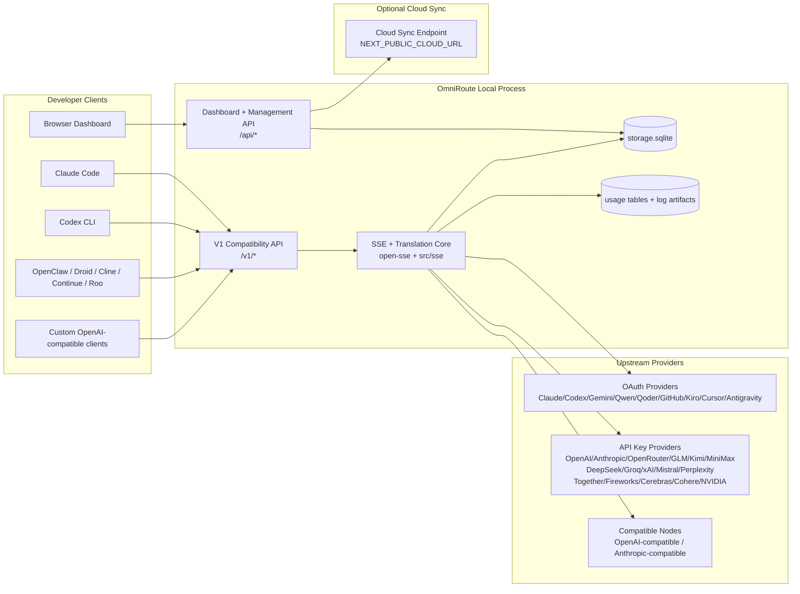
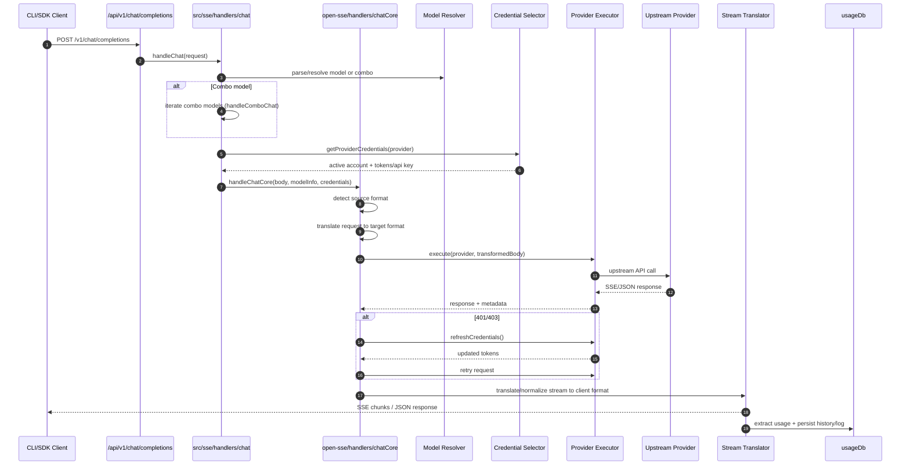
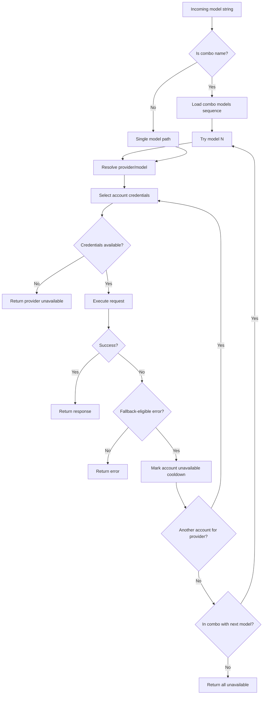
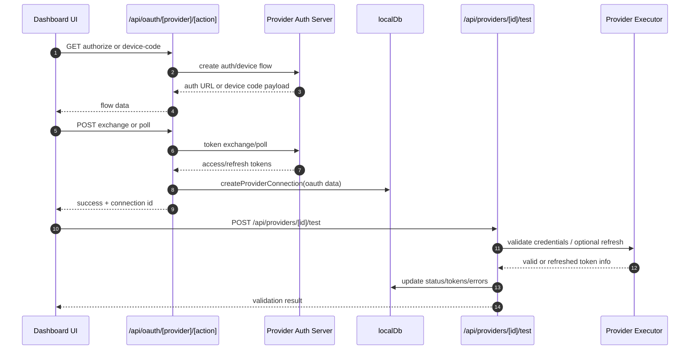
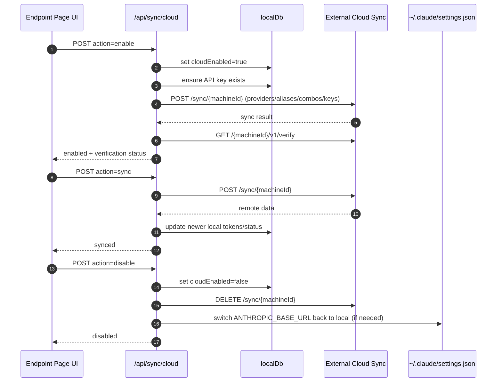
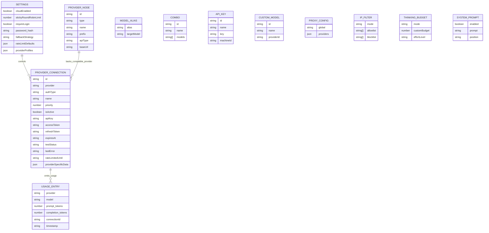
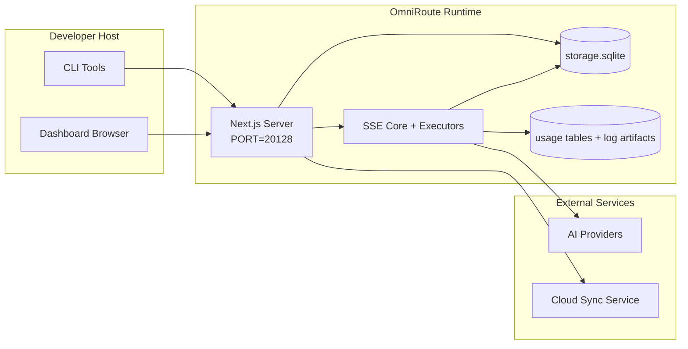

# OmniRoute Architecture (Polski)

🌐 **Languages:** 🇺🇸 [English](../../../../docs/ARCHITECTURE.md) · 🇪🇸 [es](../../es/docs/ARCHITECTURE.md) · 🇫🇷 [fr](../../fr/docs/ARCHITECTURE.md) · 🇩🇪 [de](../../de/docs/ARCHITECTURE.md) · 🇮🇹 [it](../../it/docs/ARCHITECTURE.md) · 🇷🇺 [ru](../../ru/docs/ARCHITECTURE.md) · 🇨🇳 [zh-CN](../../zh-CN/docs/ARCHITECTURE.md) · 🇯🇵 [ja](../../ja/docs/ARCHITECTURE.md) · 🇰🇷 [ko](../../ko/docs/ARCHITECTURE.md) · 🇸🇦 [ar](../../ar/docs/ARCHITECTURE.md) · 🇮🇳 [hi](../../hi/docs/ARCHITECTURE.md) · 🇮🇳 [in](../../in/docs/ARCHITECTURE.md) · 🇹🇭 [th](../../th/docs/ARCHITECTURE.md) · 🇻🇳 [vi](../../vi/docs/ARCHITECTURE.md) · 🇮🇩 [id](../../id/docs/ARCHITECTURE.md) · 🇲🇾 [ms](../../ms/docs/ARCHITECTURE.md) · 🇳🇱 [nl](../../nl/docs/ARCHITECTURE.md) · 🇵🇱 [pl](../../pl/docs/ARCHITECTURE.md) · 🇸🇪 [sv](../../sv/docs/ARCHITECTURE.md) · 🇳🇴 [no](../../no/docs/ARCHITECTURE.md) · 🇩🇰 [da](../../da/docs/ARCHITECTURE.md) · 🇫🇮 [fi](../../fi/docs/ARCHITECTURE.md) · 🇵🇹 [pt](../../pt/docs/ARCHITECTURE.md) · 🇷🇴 [ro](../../ro/docs/ARCHITECTURE.md) · 🇭🇺 [hu](../../hu/docs/ARCHITECTURE.md) · 🇧🇬 [bg](../../bg/docs/ARCHITECTURE.md) · 🇸🇰 [sk](../../sk/docs/ARCHITECTURE.md) · 🇺🇦 [uk-UA](../../uk-UA/docs/ARCHITECTURE.md) · 🇮🇱 [he](../../he/docs/ARCHITECTURE.md) · 🇵🇭 [phi](../../phi/docs/ARCHITECTURE.md) · 🇧🇷 [pt-BR](../../pt-BR/docs/ARCHITECTURE.md) · 🇨🇿 [cs](../../cs/docs/ARCHITECTURE.md) · 🇹🇷 [tr](../../tr/docs/ARCHITECTURE.md)

---

_Ostatnia aktualizacja: 28.03.2026_## Executive Summary

OmniRoute to lokalna brama routingu AI i pulpit nawigacyjny zbudowany w oparciu o Next.js.
Zapewnia pojedynczy punkt końcowy zgodny z OpenAI (`/v1/*`) i kieruje ruch do wielu dostawców nadrzędnych z tłumaczeniem, rezerwą, odświeżaniem tokenów i śledzeniem użycia.

Podstawowe możliwości:

- Powierzchnia API kompatybilna z OpenAI dla CLI/narzędzi (28 dostawców)
- Tłumaczenie żądań/odpowiedzi w różnych formatach dostawców
- Awaryjna kombinacja modeli (sekwencja wielu modeli)
- Rezerwa awaryjna na poziomie konta (wiele kont na dostawcę)
- Zarządzanie połączeniem dostawcy klucza OAuth + API
- Generowanie osadzania poprzez `/v1/embeddings` (6 dostawców, 9 modeli)
- Generowanie obrazu poprzez `/v1/images/generations` (4 dostawców, 9 modeli)
- Pomyśl o analizie tagów (`<think>...</think>`) dla modeli rozumowania
- Oczyszczanie odpowiedzi w celu zapewnienia ścisłej zgodności z OpenAI SDK
- Normalizacja ról (programista → system, system → użytkownik) w celu zapewnienia zgodności między dostawcami
- Strukturalna konwersja danych wyjściowych (json_schema → Gemini respondSchema)
- Lokalna trwałość dostawców, kluczy, aliasów, kombinacji, ustawień, cen
- Śledzenie wykorzystania/kosztów i rejestrowanie żądań
- Opcjonalna synchronizacja w chmurze dla synchronizacji wielu urządzeń/stanów
- Lista dozwolonych/blokowanych adresów IP do kontroli dostępu do API
- Myślenie o zarządzaniu budżetem (przejściowe/automatyczne/niestandardowe/adaptacyjne)
- Globalny system natychmiastowego wstrzyknięcia
- Śledzenie sesji i pobieranie odcisków palców
- Ulepszone ograniczenie stawek dla konta z profilami specyficznymi dla dostawcy
- Wzór wyłącznika zapewniający odporność dostawcy
- Ochrona stada przed piorunami z blokadą mutex
- Pamięć podręczna deduplikacji żądań oparta na sygnaturach
- Warstwa domeny: dostępność modelu, zasady kosztów, polityka awaryjna, polityka blokad
- Trwałość stanu domeny (pamięć podręczna zapisu SQLite dla błędów awaryjnych, budżetów, blokad, wyłączników automatycznych)
- Silnik polityki do scentralizowanej oceny wniosków (blokada → budżet → rezerwa)
  — Żądaj telemetrii z agregacją opóźnień p50/p95/p99
- Identyfikator korelacji (X-Request-Id) do śledzenia od końca do końca
- Rejestrowanie audytu zgodności z możliwością rezygnacji dla każdego klucza API
- Ramy ewaluacyjne dla zapewnienia jakości LLM
- Pulpit nawigacyjny interfejsu użytkownika Resilience ze statusem wyłącznika automatycznego w czasie rzeczywistym
- Modułowi dostawcy OAuth (12 indywidualnych modułów w `src/lib/oauth/providers/`)

Podstawowy model środowiska wykonawczego:

- Trasy aplikacji Next.js w `src/app/api/*` implementują zarówno interfejsy API pulpitu nawigacyjnego, jak i interfejsy API zgodności
- Współdzielony rdzeń SSE/routingowy w `src/sse/*` + `open-sse/*` obsługuje wykonywanie dostawcy, tłumaczenie, przesyłanie strumieniowe, rezerwę i użycie## Scope and Boundaries

### In Scope

- Środowisko wykonawcze bramy lokalnej
- Interfejsy API zarządzania pulpitem nawigacyjnym
- Uwierzytelnianie dostawcy i odświeżanie tokena
- Poproś o tłumaczenie i przesyłanie strumieniowe SSE
- Stan lokalny + trwałość użytkowania
- Opcjonalna orkiestracja synchronizacji w chmurze### Out of Scope

- Wdrożenie usługi w chmurze za `NEXT_PUBLIC_CLOUD_URL`
- Umowa SLA dostawcy/płaszczyzna kontroli poza procesem lokalnym
- Same zewnętrzne pliki binarne CLI (Claude CLI, Codex CLI itp.)## Dashboard Surface (Current)

Strony główne w `src/app/(dashboard)/dashboard/`:

- `/dashboard` — szybki start + przegląd dostawców
- `/dashboard/endpoint` — proxy punktu końcowego + MCP + A2A + zakładki punktu końcowego API
- `/dashboard/providers` — połączenia z dostawcami i dane uwierzytelniające
- `/dashboard/combos` — strategie combo, szablony, reguły routingu modelu
- `/dashboard/costs` — agregacja kosztów i widoczność cen
- `/dashboard/analytics` — analityka i ocena użytkowania
- `/dashboard/limits` — kontrola kwot/stawek
- `/dashboard/cli-tools` — wdrażanie CLI, wykrywanie środowiska wykonawczego, generowanie konfiguracji
- `/dashboard/agents` — wykryto agentów ACP + niestandardową rejestrację agenta
- `/dashboard/media` — plac zabaw dla obrazów/wideo/muzyki
- `/dashboard/search-tools` — testowanie i historia dostawcy wyszukiwania
- `/dashboard/health` — czas pracy, wyłączniki automatyczne, limity szybkości
- `/dashboard/logs` — logi żądań/proxy/audytu/konsoli
- `/dashboard/settings` — zakładki ustawień systemowych (ogólne, routing, domyślne kombinacje itp.)
- `/dashboard/api-manager` — Cykl życia klucza API i uprawnienia modelu## High-Level System Context



## Core Runtime Components

## 1) API and Routing Layer (Next.js App Routes)

Główne katalogi:

- `src/app/api/v1/*` i `src/app/api/v1beta/*` dla interfejsów API zgodności
- `src/app/api/*` dla interfejsów API zarządzania/konfiguracji
- Następnie przepisuje mapę `/v1/*` w `next.config.mjs` na `/api/v1/*`

Ważne ścieżki kompatybilności:

- `src/app/api/v1/chat/completions/route.ts`
- `src/app/api/v1/messages/route.ts`
- `src/app/api/v1/responses/route.ts`
- `src/app/api/v1/models/route.ts` — zawiera niestandardowe modele z opcją `custom: true`
- `src/app/api/v1/embeddings/route.ts` — generacja osadzania (6 dostawców)
- `src/app/api/v1/images/generations/route.ts` — generowanie obrazów (4+ dostawców, w tym Antigravity/Nebius)
- `src/app/api/v1/messages/count_tokens/route.ts`
- `src/app/api/v1/providers/[dostawca]/chat/completions/route.ts` — dedykowany czat dla każdego dostawcy
- `src/app/api/v1/providers/[dostawca]/embeddings/route.ts` — dedykowane osadzanie dla każdego dostawcy
- `src/app/api/v1/providers/[dostawca]/images/generations/route.ts` — obrazy dedykowane dla poszczególnych dostawców
- `src/app/api/v1beta/models/route.ts`
- `src/app/api/v1beta/models/[...ścieżka]/trasa.ts`

Domeny zarządzania:

- Auth/ustawienia: `src/app/api/auth/*`, `src/app/api/settings/*`
- Dostawcy/połączenia: `src/app/api/providers*`
- Węzły dostawcy: `src/app/api/provider-nodes*`
- Modele niestandardowe: `src/app/api/provider-models` (GET/POST/DELETE)
- Katalog modeli: `src/app/api/models/route.ts` (GET)
- Konfiguracja proxy: `src/app/api/settings/proxy` (GET/PUT/DELETE) + `src/app/api/settings/proxy/test` (POST)
- OAuth: `src/app/api/oauth/*`
- Klucze/aliasy/combo/ceny: `src/app/api/keys*`, `src/app/api/models/alias`, `src/app/api/combos*`, `src/app/api/pricing`
- Użycie: `src/app/api/usage/*`
- Synchronizacja/chmura: `src/app/api/sync/*`, `src/app/api/cloud/*`
- Pomocnicy narzędzi CLI: `src/app/api/cli-tools/*`
- Filtr IP: `src/app/api/settings/ip-filter` (GET/PUT)
- Myślący budżet: `src/app/api/settings/thinking-budget` (GET/PUT)
- Monit systemowy: `src/app/api/settings/system-prompt` (GET/PUT)
- Sesje: `src/app/api/sessions` (GET)
- Limity szybkości: `src/app/api/rate-limits` (GET)
- Resilience: `src/app/api/resilience` (GET/PATCH) — profile dostawców, wyłącznik, stan limitu szybkości
- Reset odporności: `src/app/api/resilience/reset` (POST) — resetowanie wyłączników + czasów odnowienia
- Statystyki pamięci podręcznej: `src/app/api/cache/stats` (GET/DELETE)
- Dostępność modelu: `src/app/api/models/availability` (GET/POST)
- Telemetria: `src/app/api/telemetry/summary` (GET)
- Budżet: `src/app/api/usage/budget` (GET/POST)
- Łańcuchy awaryjne: `src/app/api/fallback/chains` (GET/POST/DELETE)
- Audyt zgodności: `src/app/api/compliance/audit-log` (GET)
- Evals: `src/app/api/evals` (GET/POST), `src/app/api/evals/[suiteId]` (GET)
- Zasady: `src/app/api/policies` (GET/POST)## 2) SSE + Translation Core

Główne moduły przepływowe:

- Wpis: `src/sse/handlers/chat.ts`
- Podstawowa orkiestracja: `open-sse/handlers/chatCore.ts`
- Adaptery wykonawcze dostawcy: `open-sse/executors/*`
- Wykrywanie formatu/konfiguracja dostawcy: `open-sse/services/provider.ts`
- Analiza/rozwiązanie modelu: `src/sse/services/model.ts`, `open-sse/services/model.ts`
- Logika rezerwowa konta: `open-sse/services/accountFallback.ts`
- Rejestr tłumaczeń: `open-sse/translator/index.ts`
- Transformacje strumieni: `open-sse/utils/stream.ts`, `open-sse/utils/streamHandler.ts`
- Ekstrakcja/normalizacja użycia: `open-sse/utils/usageTracking.ts`
- Pomyśl o parserze tagów: `open-sse/utils/thinkTagParser.ts`
- Procedura osadzania: `open-sse/handlers/embeddings.ts`
- Rejestr dostawców osadzania: `open-sse/config/embeddingRegistry.ts`
- Procedura obsługi generowania obrazu: `open-sse/handlers/imageGeneration.ts`
- Rejestr dostawców obrazów: `open-sse/config/imageRegistry.ts`
- Odkażanie odpowiedzi: `open-sse/handlers/responseSanitizer.ts`
- Normalizacja ról: `open-sse/services/roleNormalizer.ts`

Usługi (logika biznesowa):

- Wybór konta/punktacja: `open-sse/services/accountSelector.ts`
- Zarządzanie cyklem życia kontekstu: `open-sse/services/contextManager.ts`
- Wymuszanie filtra IP: `open-sse/services/ipFilter.ts`
- Śledzenie sesji: `open-sse/services/sessionManager.ts`
- Zażądaj deduplikacji: `open-sse/services/signatureCache.ts`
- Wstrzyknięcie monitu systemowego: `open-sse/services/systemPrompt.ts`
- Myślenie o zarządzaniu budżetem: `open-sse/services/thinkingBudget.ts`
- Routing modelu Wildcard: `open-sse/services/wildcardRouter.ts`
- Zarządzanie limitami stawek: `open-sse/services/rateLimitManager.ts`
- Wyłącznik automatyczny: `open-sse/services/circuitBreaker.ts`

Moduły warstwy domeny:

- Dostępność modelu: `src/lib/domain/modelAvailability.ts`
- Reguły kosztów/budżety: `src/lib/domain/costRules.ts`
- Polityka awaryjna: `src/lib/domain/fallbackPolicy.ts`
- Funkcja rozpoznawania kombinacji: `src/lib/domain/comboResolver.ts`
- Polityka blokowania: `src/lib/domain/lockoutPolicy.ts`
- Silnik polityki: `src/domain/policyEngine.ts` — scentralizowana blokada → budżet → ocena rezerwowa
- Katalog kodów błędów: `src/lib/domain/errorCodes.ts`
- Identyfikator żądania: `src/lib/domain/requestId.ts`
- Limit czasu pobierania: `src/lib/domain/fetchTimeout.ts`
- Żądanie telemetrii: `src/lib/domain/requestTelemetry.ts`
- Zgodność/audyt: `src/lib/domain/compliance/index.ts`
- Biegacz Eval: `src/lib/domain/evalRunner.ts`
- Trwałość stanu domeny: `src/lib/db/domainState.ts` — SQLite CRUD dla łańcuchów awaryjnych, budżetów, historii kosztów, stanu blokady, wyłączników automatycznych

Moduły dostawcy OAuth (12 pojedynczych plików w `src/lib/oauth/providers/`):

- Indeks rejestru: `src/lib/oauth/providers/index.ts`
- Dostawcy indywidualni: `claude.ts`, `codex.ts`, `gemini.ts`, `antigravity.ts`, `qoder.ts`, `qwen.ts`, `kimi-coding.ts`, `github.ts`, `kiro.ts`, `cursor.ts`, `kilocode.ts`, `cline.ts`
- Cienki wrapper: `src/lib/oauth/providers.ts` — reeksport z poszczególnych modułów## 3) Persistence Layer

Baza danych stanu podstawowego (SQLite):

- Core infra: `src/lib/db/core.ts` (lepsze-sqlite3, migracje, WAL)
- Reeksport fasady: `src/lib/localDb.ts` (cienka warstwa kompatybilności dla osób wywołujących)
- plik: `${DATA_DIR}/storage.sqlite` (lub `$XDG_CONFIG_HOME/omniroute/storage.sqlite`, gdy jest ustawiony, w przeciwnym razie `~/.omniroute/storage.sqlite`)
- encje (tabele + przestrzenie nazw KV): dostawcaConnections, ProvideNodes, modelAliases, combo, apiKeys, ustawienia, ceny,**customModels**,**proxyConfig**,**ipFilter**,**thinkingBudget**,**systemPrompt**

Trwałość użytkowania:

- fasada: `src/lib/usageDb.ts` (rozłożone moduły w `src/lib/usage/*`)
- Tabele SQLite w `storage.sqlite`: `usage_history`, `call_logs`, `proxy_logs`
- opcjonalne artefakty plików pozostają w celu zapewnienia zgodności/debugowania (`${DATA_DIR}/log.txt`, `${DATA_DIR}/call_logs/`, `<repo>/logs/...`)
- starsze pliki JSON są migrowane do SQLite poprzez migracje startowe, jeśli są obecne

Baza danych stanu domeny (SQLite):

- `src/lib/db/domainState.ts` — operacje CRUD na stanie domeny
- Tabele (utworzone w `src/lib/db/core.ts`): `domain_fallback_chains`, `domain_budgets`, `domain_cost_history`, `domain_lockout_state`, `domain_circuit_breakers`
- Wzór pamięci podręcznej zapisu: mapy w pamięci są wiarygodne w czasie wykonywania; mutacje są zapisywane synchronicznie do SQLite; stan jest przywracany z bazy danych przy zimnym starcie## 4) Auth + Security Surfaces

- Uwierzytelnianie plików cookie w panelu kontrolnym: `src/proxy.ts`, `src/app/api/auth/login/route.ts`
- Generowanie/weryfikacja klucza API: `src/shared/utils/apiKey.ts`
- Wpisy tajne dostawcy zostały zachowane we wpisach `providerConnections`
- Obsługa wychodzącego proxy poprzez `open-sse/utils/proxyFetch.ts` (env vars) i `open-sse/utils/networkProxy.ts` (konfigurowalne dla każdego dostawcy lub globalne)## 5) Cloud Sync

- Inicjacja harmonogramu: `src/lib/initCloudSync.ts`, `src/shared/services/initializeCloudSync.ts`, `src/shared/services/modelSyncScheduler.ts`
- Zadanie okresowe: `src/shared/services/cloudSyncScheduler.ts`
- Zadanie okresowe: `src/shared/services/modelSyncScheduler.ts`
- Trasa kontrolna: `src/app/api/sync/cloud/route.ts`## Request Lifecycle (`/v1/chat/completions`)



## Combo + Account Fallback Flow



Decyzje awaryjne są podejmowane przez plik `open-sse/services/accountFallback.ts` przy użyciu kodów stanu i heurystyki komunikatów o błędach. Routing kombinowany dodaje jedną dodatkową osłonę: błędy 400 o zasięgu dostawcy, takie jak błędy blokowania zawartości nadrzędnego i sprawdzania poprawności ról, są traktowane jako awarie lokalne modelu, dzięki czemu późniejsze cele kombinacji mogą nadal działać.## OAuth Onboarding and Token Refresh Lifecycle



Odświeżanie podczas ruchu na żywo jest wykonywane wewnątrz `open-sse/handlers/chatCore.ts` poprzez executor `refreshCredentials()`.## Cloud Sync Lifecycle (Enable / Sync / Disable)



Okresowa synchronizacja jest wyzwalana przez „CloudSyncScheduler”, gdy włączona jest chmura.## Data Model and Storage Map



Pliki pamięci fizycznej:

- podstawowy DB środowiska wykonawczego: `${DATA_DIR}/storage.sqlite`
- żądanie wierszy dziennika: `${DATA_DIR}/log.txt` (artefakt zgodności/debugowania)
- archiwa ładunków wywołań strukturalnych: `${DATA_DIR}/call_logs/`
- opcjonalne sesje debugowania tłumacza/żądania: `<repo>/logs/...`## Deployment Topology



## Module Mapping (Decision-Critical)

### Route and API Modules

- `src/app/api/v1/*`, `src/app/api/v1beta/*`: API zgodności
- `src/app/api/v1/providers/[dostawca]/*`: dedykowane trasy dla poszczególnych dostawców (czat, osadzanie, obrazy)
- `src/app/api/providers*`: dostawca CRUD, walidacja, testowanie
- `src/app/api/provider-nodes*`: niestandardowe zarządzanie kompatybilnymi węzłami
- `src/app/api/provider-models`: zarządzanie modelami niestandardowymi (CRUD)
- `src/app/api/models/route.ts`: API katalogu modeli (aliasy + modele niestandardowe)
- `src/app/api/oauth/*`: przepływy OAuth/kodu urządzenia
- `src/app/api/keys*`: cykl życia lokalnego klucza API
- `src/app/api/models/alias`: zarządzanie aliasami
- `src/app/api/combos*`: zarządzanie rezerwowymi kombinacjami
- `src/app/api/pricing`: zastąpienie cen przy kalkulacji kosztów
- `src/app/api/settings/proxy`: konfiguracja proxy (GET/PUT/DELETE)
- `src/app/api/settings/proxy/test`: test połączenia wychodzącego proxy (POST)
- `src/app/api/usage/*`: API użycia i dzienników
- `src/app/api/sync/*` + `src/app/api/cloud/*`: synchronizacja z chmurą i pomocnicy obsługujący chmurę
- `src/app/api/cli-tools/*`: lokalni autorzy/weryfikatorzy konfiguracji CLI
- `src/app/api/settings/ip-filter`: lista dozwolonych/lista blokowanych adresów IP (GET/PUT)
- `src/app/api/settings/thinking-budget`: konfiguracja budżetu tokena myślącego (GET/PUT)
- `src/app/api/settings/system-prompt`: globalny monit systemowy (GET/PUT)
- `src/app/api/sessions`: lista aktywnych sesji (GET)
- `src/app/api/rate-limits`: stan limitu stawki na konto (GET)### Routing and Execution Core

- `src/sse/handlers/chat.ts`: analiza żądań, obsługa kombinacji, pętla wyboru konta
- `open-sse/handlers/chatCore.ts`: tłumaczenie, wysyłanie executora, obsługa ponawiania/odświeżania, konfiguracja strumienia
- `open-sse/executors/*`: zachowanie sieci i formatu specyficzne dla dostawcy### Translation Registry and Format Converters

- `open-sse/translator/index.ts`: rejestracja i orkiestracja tłumaczy
- Poproś o tłumaczy: `open-sse/translator/request/*`
- Tłumacze odpowiedzi: `open-sse/translator/response/*`
- Stałe formatu: `open-sse/translator/formats.ts`### Persistence

- `src/lib/db/*`: trwała konfiguracja/stan i trwałość domeny w SQLite
- `src/lib/localDb.ts`: reeksport kompatybilności dla modułów DB
- `src/lib/usageDb.ts`: fasada historii użytkowania/dzienników połączeń na tabelach SQLite## Provider Executor Coverage (Strategy Pattern)

Każdy dostawca ma wyspecjalizowany executor rozszerzający `BaseExecutor` (w `open-sse/executors/base.ts`), który zapewnia tworzenie adresów URL, konstruowanie nagłówków, ponawianie prób z wykładniczym wycofywaniem, przechwytywanie odświeżania poświadczeń i metodę orkiestracji `execute()`.

| Wykonawca                  | Dostawca(-y)                                                                                                                                               | Specjalna obsługa                                                                  |
| -------------------------- | ---------------------------------------------------------------------------------------------------------------------------------------------------------- | ---------------------------------------------------------------------------------- |
| `Domyślny wykonawca`       | OpenAI, Claude, Gemini, Qwen, Qoder, OpenRouter, GLM, Kimi, MiniMax, DeepSeek, Groq, xAI, Mistral, Perplexity, Razem, Fajerwerki, Cerebras, Cohere, NVIDIA | Dynamiczna konfiguracja adresu URL/nagłówka dla każdego dostawcy                   |
| `Egzekutor antygrawitacji` | Google Antygrawitacja                                                                                                                                      | Niestandardowe identyfikatory projektów/sesji, ponowna próba po przeanalizowaniu   |
| `Egzekutor Kodeksu`        | Kodeks OpenAI                                                                                                                                              | Wstrzykuje instrukcje systemowe, wymusza wysiłek rozumowania                       |
| `Egzekutor kursora`        | Kursor IDE                                                                                                                                                 | Protokół ConnectRPC, kodowanie Protobuf, podpisywanie żądań poprzez sumę kontrolną |
| `GithubExecutor`           | Drugi pilot GitHuba                                                                                                                                        | Odświeżanie tokenu drugiego pilota, nagłówki naśladujące VSCode                    |
| `KiroExecutor`             | Zaklinacz kodów AWS/Kiro                                                                                                                                   | Format binarny AWS EventStream → Konwersja SSE                                     |
| `GeminiCLIEExecutor`       | Bliźnięta CLI                                                                                                                                              | Cykl odświeżania tokena Google OAuth                                               |

Wszyscy pozostali dostawcy (w tym niestandardowe kompatybilne węzły) używają `DefaultExecutor`.## Provider Compatibility Matrix

| Dostawca            | Formatuj          | Autoryzacja                   | Strumień                | Non-Stream | Odświeżenie tokena | Korzystanie z interfejsu API |
| ------------------- | ----------------- | ----------------------------- | ----------------------- | ---------- | ------------------ | ---------------------------- | ------------------------------ |
| Klaudiusz           | klaudia           | Klucz API / OAuth             | ✅                      | ✅         | ✅                 | ⚠️ Tylko administrator       |
| Bliźnięta           | Bliźnięta         | Klucz API / OAuth             | ✅                      | ✅         | ✅                 | ⚠️ Konsola chmurowa          |
| Bliźnięta CLI       | bliźnięta-cli     | OAuth                         | ✅                      | ✅         | ✅                 | ⚠️ Konsola chmurowa          |
| Antygrawitacja      | antygrawitacja    | OAuth                         | ✅                      | ✅         | ✅                 | ✅ Pełny limit API           |
| OpenAI              | otwieram          | Klucz API                     | ✅                      | ✅         | ❌                 | ❌                           |
| Kodeks              | odpowiedzi openai | OAuth                         | ✅ zmuszony             | ❌         | ✅                 | ✅ Limity stawek             |
| Drugi pilot GitHuba | otwieram          | OAuth + token drugiego pilota | ✅                      | ✅         | ✅                 | ✅ Migawki kwot              |
| Kursor              | kursor            | Niestandardowa suma kontrolna | ✅                      | ✅         | ❌                 | ❌                           |
| Kiro                | Kiro              | AWS SSO OIDC                  | ✅ (Strumień zdarzenia) | ❌         | ✅                 | ✅ Limity użytkowania        |
| Qwen                | otwieram          | OAuth                         | ✅                      | ✅         | ✅                 | ⚠️ Na żądanie                |
| Qoder               | otwieram          | OAuth (podstawowy)            | ✅                      | ✅         | ✅                 | ⚠️ Na żądanie                |
| OtwórzRouter        | otwieram          | Klucz API                     | ✅                      | ✅         | ❌                 | ❌                           |
| GLM/Kimi/MiniMax    | klaudia           | Klucz API                     | ✅                      | ✅         | ❌                 | ❌                           |
| DeepSeek            | otwieram          | Klucz API                     | ✅                      | ✅         | ❌                 | ❌                           |
| Groq                | otwieram          | Klucz API                     | ✅                      | ✅         | ❌                 | ❌                           |
| xAI (Grok)          | otwieram          | Klucz API                     | ✅                      | ✅         | ❌                 | ❌                           |
| Mistral             | otwieram          | Klucz API                     | ✅                      | ✅         | ❌                 | ❌                           |
| Zakłopotanie        | otwieram          | Klucz API                     | ✅                      | ✅         | ❌                 | ❌                           |
| Razem AI            | otwieram          | Klucz API                     | ✅                      | ✅         | ❌                 | ❌                           |
| Fajerwerki AI       | otwieram          | Klucz API                     | ✅                      | ✅         | ❌                 | ❌                           |
| Cerebra             | otwieram          | Klucz API                     | ✅                      | ✅         | ❌                 | ❌                           |
| Spójne              | otwieram          | Klucz API                     | ✅                      | ✅         | ❌                 | ❌                           |
| NVIDIA NIM          | otwieram          | Klucz API                     | ✅                      | ✅         | ❌                 | ❌                           | ## Format Translation Coverage |

Wykryte formaty źródłowe obejmują:

- "openai".
- „odpowiedzi openai”.
- ,,klaudia".
- ,,bliźnięta".

Formaty docelowe obejmują:

- Czat/odpowiedzi OpenAI
- Klaudiusz
- Koperta Gemini/Gemini-CLI/Antygrawitacyjna
- Kiro
- Kursor

Tłumaczenia używają**OpenAI jako formatu centralnego**— wszystkie konwersje przechodzą przez OpenAI jako pośredni:```
Source Format → OpenAI (hub) → Target Format

````

Tłumaczenia są wybierane dynamicznie na podstawie kształtu ładunku źródłowego i formatu docelowego dostawcy.

Dodatkowe warstwy przetwarzania w potoku tłumaczenia:

-**Oczyszczanie odpowiedzi**— Usuwa niestandardowe pola z odpowiedzi w formacie OpenAI (zarówno przesyłanych strumieniowo, jak i nie przesyłanych strumieniowo), aby zapewnić ścisłą zgodność z SDK
-**Normalizacja ról**— Konwertuje „programista” → „system” dla celów innych niż OpenAI; łączy `system` → `użytkownik` dla modeli odrzucających rolę systemową (GLM, ERNIE)
-**Pomyśl o ekstrakcji tagów**— Analizuje bloki `<think>...</think>` z treści do pola `reasoning_content`
-**Ustrukturyzowane dane wyjściowe**— Konwertuje OpenAI `response_format.json_schema` na `responseMimeType` + `responseSchema` firmy Gemini## Supported API Endpoints

| Punkt końcowy | Formatuj | Opiekun |
| -------------------------------------------------- | ------------------ | ------------------------------------------------------------------ |
| `POST /v1/chat/uzupełnienia` | Czat OpenAI | `src/sse/handlers/chat.ts` |
| `POST /v1/wiadomości` | Wiadomości Claude'a | Ten sam program obsługi (wykryty automatycznie) |
| `POST /v1/odpowiedzi` | Odpowiedzi OpenAI | `open-sse/handlers/responsesHandler.ts` |
| `POST /v1/osadzania` | Osadzania OpenAI | `open-sse/handlers/embeddings.ts` |
| `POBIERZ /v1/osadzania` | Lista modeli | Trasa API |
| `POST /v1/images/generacje` | Obrazy OpenAI | `open-sse/handlers/imageGeneration.ts` |
| `POBIERZ /v1/obrazy/generacje` | Lista modeli | Trasa API |
| `POST /v1/providers/{provider}/chat/completions` | Czat OpenAI | Dedykowany dla każdego dostawcy z walidacją modelu |
| `POST /v1/providers/{provider}/embeddings` | Osadzania OpenAI | Dedykowany dla każdego dostawcy z walidacją modelu |
| `POST /v1/providers/{provider}/images/generations` | Obrazy OpenAI | Dedykowany dla każdego dostawcy z walidacją modelu |
| `POST /v1/messages/count_tokens` | Claude Liczba żetonów | Trasa API |
| `POBIERZ /v1/modele` | Lista modeli OpenAI | Ścieżka API (czat + osadzanie + obraz + modele niestandardowe) |
| `POBIERZ /api/models/catalog` | Katalog | Wszystkie modele pogrupowane według dostawcy + typu |
| `POST /v1beta/models/*:streamGenerateContent` | Pochodzący z Bliźniąt | Trasa API |
| `POBIERZ/PUT/USUŃ /api/settings/proxy` | Konfiguracja proxy | Konfiguracja serwera proxy sieci |
| `POST /api/settings/proxy/test` | Łączność proxy | Punkt końcowy testu kondycji/łączności serwera proxy |
| `POBIERZ/POST/USUŃ /api/provider-models` | Modele dostawców | Metadane modelu dostawcy obsługujące niestandardowe i zarządzane dostępne modele |## Bypass Handler

Procedura obsługi obejścia (`open-sse/utils/bypassHandler.ts`) przechwytuje znane żądania „wyrzucenia” z Claude CLI — pingi rozgrzewające, wyodrębnianie tytułów i zliczanie tokenów — i zwraca**fałszywą odpowiedź**bez zużywania tokenów dostawcy nadrzędnego. Jest to wyzwalane tylko wtedy, gdy `User-Agent` zawiera `claude-cli`.## Request Logger Pipeline

Rejestrator żądań (`open-sse/utils/requestLogger.ts`) zapewnia 7-etapowy potok rejestrowania debugowania, domyślnie wyłączony, włączony poprzez `ENABLE_REQUEST_LOGS=true`:```
1_req_client.json → 2_req_source.json → 3_req_openai.json → 4_req_target.json
→ 5_res_provider.txt → 6_res_openai.txt → 7_res_client.txt
````

Pliki są zapisywane w `<repo>/logs/<session>/` dla każdej sesji żądania.## Failure Modes and Resilience

## 1) Account/Provider Availability

- czas oczekiwania na konto dostawcy w przypadku błędów przejściowych/szybkości/auth
- rezerwowe konto przed nieudanym żądaniem
- powrót do modelu kombi, gdy bieżąca ścieżka modelu/dostawcy zostanie wyczerpana## 2) Token Expiry

- wstępne sprawdzenie i odświeżenie z ponowną próbą dla dostawców z możliwością odświeżania
- Ponowna próba 401/403 po próbie odświeżenia w ścieżce podstawowej## 3) Stream Safety

- kontroler strumienia obsługujący rozłączenie
- strumień tłumaczeń z opróżnianiem na końcu strumienia i obsługą `[DONE]`
- rezerwowe oszacowanie użycia w przypadku braku metadanych dotyczących użycia dostawcy## 4) Cloud Sync Degradation

- pojawiają się błędy synchronizacji, ale lokalne środowisko wykonawcze trwa
- harmonogram ma logikę umożliwiającą ponawianie prób, ale wykonywanie okresowe obecnie domyślnie wywołuje synchronizację przy pojedynczej próbie## 5) Data Integrity

- Migracje schematu SQLite i zaczepy do automatycznej aktualizacji przy uruchomieniu
- starsza ścieżka zgodności migracji JSON → SQLite## Observability and Operational Signals

Źródła widoczności w czasie wykonywania:

- logi konsoli z `src/sse/utils/logger.ts`
- agregacje użycia na żądanie w SQLite (`usage_history`, `call_logs`, `proxy_logs`)
- czteroetapowe szczegółowe przechwytywanie ładunku w SQLite (`request_detail_logs`) gdy `settings.detailed_logs_enabled=true`
- logowanie statusu żądania tekstowego w `log.txt` (opcjonalnie/kompatybilne)
- opcjonalne głębokie logi żądań/tłumaczeń w `logs/`, gdy `ENABLE_REQUEST_LOGS=true`
- punkty końcowe użycia dashboardu (`/api/usage/*`) do wykorzystania interfejsu użytkownika

Szczegółowe przechwytywanie ładunku żądania przechowuje do czterech etapów ładunku JSON na kierowane połączenie:

- surowe żądanie otrzymane od klienta
- przetłumaczone żądanie faktycznie wysłane w górę
- odpowiedź dostawcy zrekonstruowana jako JSON; Odpowiedzi przesyłane strumieniowo są kompresowane do końcowego podsumowania plus metadane strumienia
- ostateczna odpowiedź klienta zwrócona przez OmniRoute; odpowiedzi przesyłane strumieniowo są przechowywane w tej samej zwartej formie podsumowania## Security-Sensitive Boundaries

- Sekret JWT („JWT_SECRET”) zabezpiecza weryfikację/podpisywanie plików cookie sesji panelu kontrolnego
- Początkowe ładowanie hasła (`INITIAL_PASSWORD`) powinno być jawnie skonfigurowane na potrzeby udostępniania przy pierwszym uruchomieniu
- Klucz API Sekret HMAC (`API_KEY_SECRET`) zabezpiecza wygenerowany lokalny format klucza API
- Sekrety dostawcy (klucze/tokeny API) są zachowywane w lokalnej bazie danych i powinny być chronione na poziomie systemu plików
- Punkty końcowe synchronizacji w chmurze opierają się na uwierzytelnianiu klucza API + semantyce identyfikatora maszyny## Environment and Runtime Matrix

Zmienne środowiskowe aktywnie używane przez kod:

- Aplikacja/autoryzacja: `JWT_SECRET`, `INITIAL_PASSWORD`
- Pamięć: `DATA_DIR`
- Zgodne zachowanie węzła: `ALLOW_MULTI_CONNECTIONS_PER_COMPAT_NODE`
- Opcjonalne zastąpienie bazy pamięci (Linux/macOS, gdy `DATA_DIR` nie jest ustawione): `XDG_CONFIG_HOME`
- Haszowanie zabezpieczeń: `API_KEY_SECRET`, `MACHINE_ID_SALT`
- Rejestrowanie: `ENABLE_REQUEST_LOGS`
- Adres URL synchronizacji/chmury: `NEXT_PUBLIC_BASE_URL`, `NEXT_PUBLIC_CLOUD_URL`
- Wychodzący serwer proxy: `HTTP_PROXY`, `HTTPS_PROXY`, `ALL_PROXY`, `NO_PROXY` i warianty z małymi literami
- Flagi funkcji SOCKS5: `ENABLE_SOCKS5_PROXY`, `NEXT_PUBLIC_ENABLE_SOCKS5_PROXY`
- Pomocnicy platformy/środowiska wykonawczego (konfiguracja nie specyficzna dla aplikacji): `APPDATA`, `NODE_ENV`, `PORT`, `NAZWA HOSTA`## Known Architectural Notes

1. `usageDb` i `localDb` mają tę samą podstawową politykę katalogową (`DATA_DIR` -> `XDG_CONFIG_HOME/omniroute` -> `~/.omniroute`) z migracją starszych plików.
2. `/api/v1/route.ts` deleguje do tego samego ujednoliconego narzędzia do tworzenia katalogów, którego używa `/api/v1/models` (`src/app/api/v1/models/catalog.ts`), aby uniknąć dryfu semantycznego.
3. Rejestrator żądań zapisuje pełne nagłówki/treść, gdy jest włączony; traktuj katalog dzienników jako poufny.
4. Zachowanie chmury zależy od prawidłowego `NEXT_PUBLIC_BASE_URL` i osiągalności punktu końcowego chmury.
5. Katalog `open-sse/` jest publikowany jako pakiet `@omniroute/open-sse`**npm workspace**. Kod źródłowy importuje go poprzez `@omniroute/open-sse/...` (rozwiązany przez Next.js `transpilePackages`). Ścieżki plików w tym dokumencie nadal używają nazwy katalogu `open-sse/` dla zachowania spójności.
6. Wykresy na pulpicie nawigacyjnym korzystają z**Recharts**(oparte na SVG) w celu uzyskania przystępnych, interaktywnych wizualizacji analitycznych (wykresy słupkowe wykorzystania modelu, tabele podziału dostawców ze wskaźnikami sukcesu).
7. Testy E2E wykorzystują**Playwright**(`tests/e2e/`), uruchamiają się poprzez `npm run test:e2e`. Testy jednostkowe wykorzystują**program uruchamiający testy Node.js**(`tests/unit/`), uruchamiane poprzez `npm run test:unit`. Kod źródłowy pod `src/` to**TypeScript**(`.ts`/`.tsx`); obszarem roboczym `open-sse/` pozostaje JavaScript (`.js`).
8. Strona ustawień jest podzielona na 5 zakładek: Bezpieczeństwo, Routing (6 globalnych strategii: najpierw wypełnij, okrężnie, p2c, losowa, najrzadziej używana, zoptymalizowana pod względem kosztów), Odporność (edytowalne limity szybkości, wyłącznik automatyczny, zasady), AI (przemyślany budżet, monit systemowy, pamięć podręczna podpowiedzi), Zaawansowane (proxy).## Operational Verification Checklist

- Kompiluj ze źródła: `npm run build`
- Zbuduj obraz Dockera: `docker build -t omniroute.`
- Uruchom usługę i sprawdź:
- `POBIERZ /api/ustawienia`
- `POBIERZ /api/v1/models`
- Podstawowy docelowy adres URL CLI powinien mieć postać `http://<host>:20128/v1`, gdy `PORT=20128`
