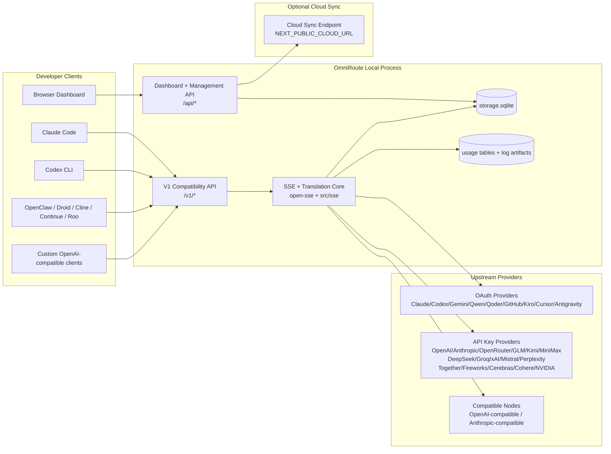
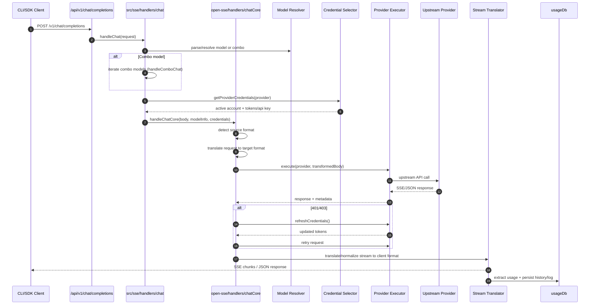
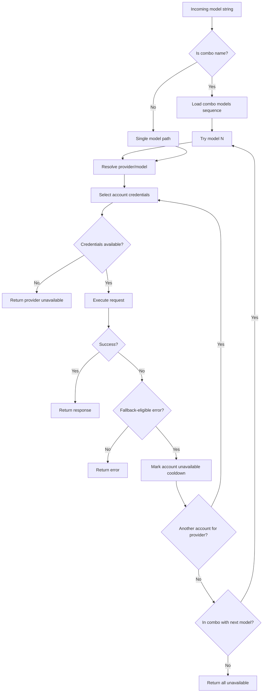
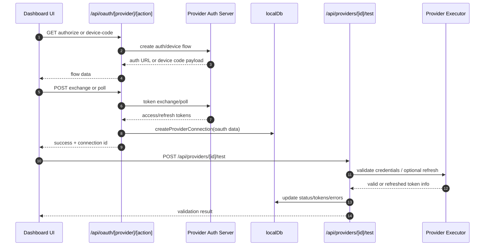
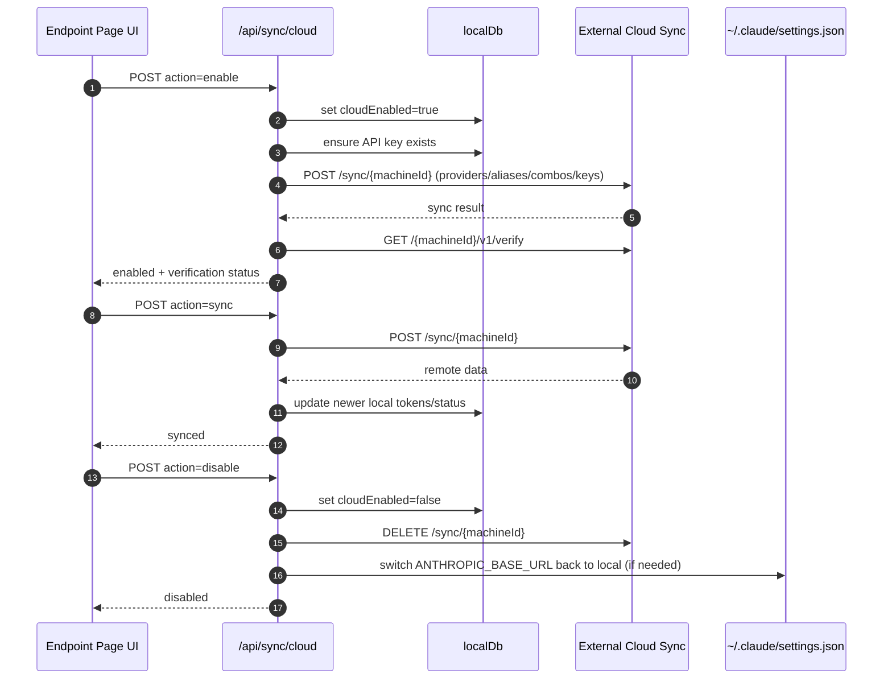
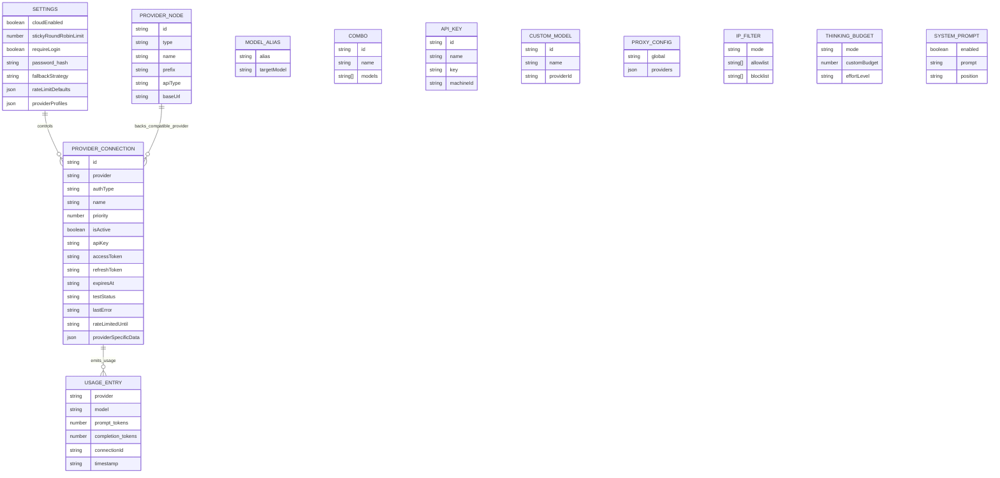
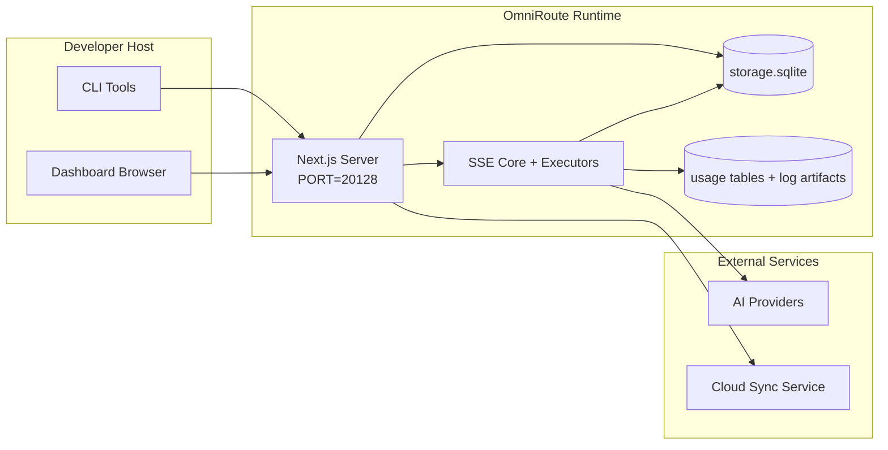

# OmniRoute Architecture (Português (Portugal))

🌐 **Languages:** 🇺🇸 [English](../../../../docs/ARCHITECTURE.md) · 🇪🇸 [es](../../es/docs/ARCHITECTURE.md) · 🇫🇷 [fr](../../fr/docs/ARCHITECTURE.md) · 🇩🇪 [de](../../de/docs/ARCHITECTURE.md) · 🇮🇹 [it](../../it/docs/ARCHITECTURE.md) · 🇷🇺 [ru](../../ru/docs/ARCHITECTURE.md) · 🇨🇳 [zh-CN](../../zh-CN/docs/ARCHITECTURE.md) · 🇯🇵 [ja](../../ja/docs/ARCHITECTURE.md) · 🇰🇷 [ko](../../ko/docs/ARCHITECTURE.md) · 🇸🇦 [ar](../../ar/docs/ARCHITECTURE.md) · 🇮🇳 [hi](../../hi/docs/ARCHITECTURE.md) · 🇮🇳 [in](../../in/docs/ARCHITECTURE.md) · 🇹🇭 [th](../../th/docs/ARCHITECTURE.md) · 🇻🇳 [vi](../../vi/docs/ARCHITECTURE.md) · 🇮🇩 [id](../../id/docs/ARCHITECTURE.md) · 🇲🇾 [ms](../../ms/docs/ARCHITECTURE.md) · 🇳🇱 [nl](../../nl/docs/ARCHITECTURE.md) · 🇵🇱 [pl](../../pl/docs/ARCHITECTURE.md) · 🇸🇪 [sv](../../sv/docs/ARCHITECTURE.md) · 🇳🇴 [no](../../no/docs/ARCHITECTURE.md) · 🇩🇰 [da](../../da/docs/ARCHITECTURE.md) · 🇫🇮 [fi](../../fi/docs/ARCHITECTURE.md) · 🇵🇹 [pt](../../pt/docs/ARCHITECTURE.md) · 🇷🇴 [ro](../../ro/docs/ARCHITECTURE.md) · 🇭🇺 [hu](../../hu/docs/ARCHITECTURE.md) · 🇧🇬 [bg](../../bg/docs/ARCHITECTURE.md) · 🇸🇰 [sk](../../sk/docs/ARCHITECTURE.md) · 🇺🇦 [uk-UA](../../uk-UA/docs/ARCHITECTURE.md) · 🇮🇱 [he](../../he/docs/ARCHITECTURE.md) · 🇵🇭 [phi](../../phi/docs/ARCHITECTURE.md) · 🇧🇷 [pt-BR](../../pt-BR/docs/ARCHITECTURE.md) · 🇨🇿 [cs](../../cs/docs/ARCHITECTURE.md) · 🇹🇷 [tr](../../tr/docs/ARCHITECTURE.md)

---

_Última atualização: 28/03/2026_## Executive Summary

OmniRoute é um gateway de roteamento de IA local e painel construído em Next.js.
Ele fornece um único endpoint compatível com OpenAI (`/v1/*`) e roteia o tráfego entre vários provedores upstream com tradução, fallback, atualização de token e rastreamento de uso.

Capacidades principais:

- Superfície API compatível com OpenAI para CLI/ferramentas (28 provedores)
- Tradução de solicitação/resposta em formatos de provedores
- Fallback de combinação de modelos (sequência de vários modelos)
- Fallback em nível de conta (várias contas por provedor)
- Gerenciamento de conexão de provedor de chave OAuth + API
- Geração de incorporação via `/v1/embeddings` (6 provedores, 9 modelos)
- Geração de imagens via `/v1/images/Generations` (4 provedores, 9 modelos)
- Pense na análise de tags (`<think>...</think>`) para modelos de raciocínio
- Sanitização de resposta para compatibilidade estrita com OpenAI SDK
- Normalização de funções (desenvolvedor→sistema, sistema→usuário) para compatibilidade entre provedores
- Conversão de saída estruturada (json_schema → Gemini responseSchema)
- Persistência local para provedores, chaves, aliases, combos, configurações, preços
- Acompanhamento de uso/custo e registro de solicitações
- Sincronização em nuvem opcional para sincronização de vários dispositivos/estado
- Lista de permissões/lista de bloqueio de IP para controle de acesso à API
- Pensando na gestão orçamentária (passthrough/auto/custom/adaptive)
- Injeção imediata do sistema global
- Rastreamento de sessão e impressão digital
- Limitação de taxa aprimorada por conta com perfis específicos do provedor
- Padrão de disjuntor para resiliência do provedor
- Proteção de rebanho anti-trovão com bloqueio mutex
- Cache de desduplicação de solicitação baseada em assinatura
- Camada de domínio: disponibilidade do modelo, regras de custo, política de fallback, política de bloqueio
- Persistência de estado de domínio (cache write-through SQLite para fallbacks, orçamentos, bloqueios, disjuntores)
- Mecanismo de política para avaliação centralizada de solicitações (bloqueio → orçamento → fallback)
- Solicitar telemetria com agregação de latência p50/p95/p99
- ID de correlação (X-Request-Id) para rastreamento ponta a ponta
- Registro de auditoria de conformidade com cancelamento por chave de API
- Estrutura de avaliação para garantia de qualidade LLM
- Painel de UI de resiliência com status do disjuntor em tempo real
- Provedores OAuth modulares (12 módulos individuais em `src/lib/oauth/providers/`)

Modelo de tempo de execução primário:

- As rotas do aplicativo Next.js em `src/app/api/*` implementam APIs de painel e APIs de compatibilidade
- Um núcleo SSE/roteamento compartilhado em `src/sse/*` + `open-sse/*` lida com execução, tradução, streaming, fallback e uso do provedor## Scope and Boundaries

### In Scope

- Tempo de execução do gateway local
- APIs de gerenciamento de painel
- Autenticação do provedor e atualização de token
- Solicitar tradução e streaming SSE
- Estado local + persistência de uso
- Orquestração opcional de sincronização em nuvem### Out of Scope

- Implementação de serviço em nuvem por trás de `NEXT_PUBLIC_CLOUD_URL`
- Plano de controle/SLA do provedor fora do processo local
- Os próprios binários CLI externos (Claude CLI, Codex CLI, etc.)## Dashboard Surface (Current)

Páginas principais em `src/app/(dashboard)/dashboard/`:

- `/dashboard` — início rápido + visão geral do provedor
- `/dashboard/endpoint` — proxy de endpoint + MCP + A2A + guias de endpoint de API
- `/dashboard/providers` — conexões e credenciais do provedor
- `/dashboard/combos` — estratégias de combinação, modelos, regras de roteamento de modelo
- `/dashboard/costs` — agregação de custos e visibilidade de preços
- `/dashboard/analytics` — análises e avaliações de uso
- `/dashboard/limits` — controles de cota/taxa
- `/dashboard/cli-tools` — integração CLI, detecção de tempo de execução, geração de configuração
- `/dashboard/agents` — agentes ACP detectados + registro de agente personalizado
- `/dashboard/media` — playground de imagem/vídeo/música
- `/dashboard/search-tools` — teste e histórico do provedor de pesquisa
- `/dashboard/health` — tempo de atividade, disjuntores, limites de taxa
- `/dashboard/logs` — solicitação/proxy/auditoria/logs do console
- `/dashboard/settings` — guias de configurações do sistema (geral, roteamento, padrões de combinação, etc.)
- `/dashboard/api-manager` — Ciclo de vida da chave de API e permissões de modelo## High-Level System Context



## Core Runtime Components

## 1) API and Routing Layer (Next.js App Routes)

Diretórios principais:

- `src/app/api/v1/*` e `src/app/api/v1beta/*` para APIs de compatibilidade
- `src/app/api/*` para APIs de gerenciamento/configuração
- Próximas reescritas em `next.config.mjs` mapeiam `/v1/*` para `/api/v1/*`

Rotas de compatibilidade importantes:

- `src/app/api/v1/chat/completions/route.ts`
- `src/app/api/v1/messages/route.ts`
- `src/app/api/v1/responses/route.ts`
- `src/app/api/v1/models/route.ts` — inclui modelos personalizados com `custom: true`
- `src/app/api/v1/embeddings/route.ts` — geração de incorporação (6 provedores)
- `src/app/api/v1/images/generations/route.ts` — geração de imagens (4+ provedores incluindo Antigravity/Nebius)
- `src/app/api/v1/messages/count_tokens/route.ts`
- `src/app/api/v1/providers/[provider]/chat/completions/route.ts` — bate-papo dedicado por provedor
- `src/app/api/v1/providers/[provider]/embeddings/route.ts` — embeddings dedicados por provedor
- `src/app/api/v1/providers/[provider]/images/Generations/route.ts` — imagens dedicadas por provedor
- `src/app/api/v1beta/models/route.ts`
- `src/app/api/v1beta/models/[...caminho]/route.ts`

Domínios de gerenciamento:

- Autenticação/configurações: `src/app/api/auth/*`, `src/app/api/settings/*`
- Provedores/conexões: `src/app/api/providers*`
- Nós do provedor: `src/app/api/provider-nodes*`
- Modelos personalizados: `src/app/api/provider-models` (GET/POST/DELETE)
- Catálogo de modelos: `src/app/api/models/route.ts` (GET)
- Configuração de proxy: `src/app/api/settings/proxy` (GET/PUT/DELETE) + `src/app/api/settings/proxy/test` (POST)
- OAuth: `src/app/api/oauth/*`
- Chaves/aliases/combos/pricing: `src/app/api/keys*`, `src/app/api/models/alias`, `src/app/api/combos*`, `src/app/api/pricing`
- Uso: `src/app/api/usage/*`
- Sincronização/nuvem: `src/app/api/sync/*`, `src/app/api/cloud/*`
- Auxiliares de ferramentas CLI: `src/app/api/cli-tools/*`
- Filtro IP: `src/app/api/settings/ip-filter` (GET/PUT)
- Pensando no orçamento: `src/app/api/settings/thinking-budget` (GET/PUT)
- Prompt do sistema: `src/app/api/settings/system-prompt` (GET/PUT)
- Sessões: `src/app/api/sessions` (GET)
- Limites de taxa: `src/app/api/rate-limits` (GET)
- Resiliência: `src/app/api/resilience` (GET/PATCH) — perfis de provedor, disjuntor, estado limite de taxa
- Redefinição de resiliência: `src/app/api/resilience/reset` (POST) — redefinir disjuntores + resfriamento
- Estatísticas de cache: `src/app/api/cache/stats` (GET/DELETE)
- Disponibilidade do modelo: `src/app/api/models/availability` (GET/POST)
- Telemetria: `src/app/api/telemetry/summary` (GET)
- Orçamento: `src/app/api/usage/budget` (GET/POST)
- Cadeias de fallback: `src/app/api/fallback/chains` (GET/POST/DELETE)
- Auditoria de conformidade: `src/app/api/compliance/audit-log` (GET)
- Avaliações: `src/app/api/evals` (GET/POST), `src/app/api/evals/[suiteId]` (GET)
- Políticas: `src/app/api/policies` (GET/POST)## 2) SSE + Translation Core

Principais módulos de fluxo:

- Entrada: `src/sse/handlers/chat.ts`
- Orquestração central: `open-sse/handlers/chatCore.ts`
- Adaptadores de execução do provedor: `open-sse/executors/*`
- Detecção de formato/configuração do provedor: `open-sse/services/provider.ts`
- Análise/resolução de modelo: `src/sse/services/model.ts`, `open-sse/services/model.ts`
- Lógica de fallback de conta: `open-sse/services/accountFallback.ts`
- Registro de tradução: `open-sse/translator/index.ts`
- Transformações de fluxo: `open-sse/utils/stream.ts`, `open-sse/utils/streamHandler.ts`
- Extração/normalização de uso: `open-sse/utils/usageTracking.ts`
- Pense no analisador de tags: `open-sse/utils/thinkTagParser.ts`
- Manipulador de incorporação: `open-sse/handlers/embeddings.ts`
- Registro do provedor de incorporação: `open-sse/config/embeddingRegistry.ts`
- Manipulador de geração de imagem: `open-sse/handlers/imageGeneration.ts`
- Registro do provedor de imagens: `open-sse/config/imageRegistry.ts`
- Sanitização de resposta: `open-sse/handlers/responseSanitizer.ts`
- Normalização de funções: `open-sse/services/roleNormalizer.ts`

Serviços (lógica de negócios):

- Seleção/pontuação de conta: `open-sse/services/accountSelector.ts`
- Gerenciamento do ciclo de vida do contexto: `open-sse/services/contextManager.ts`
- Aplicação do filtro IP: `open-sse/services/ipFilter.ts`
- Rastreamento de sessão: `open-sse/services/sessionManager.ts`
- Solicitar desduplicação: `open-sse/services/signatureCache.ts`
- Injeção de prompt do sistema: `open-sse/services/systemPrompt.ts`
- Pensando na gestão orçamentária: `open-sse/services/thinkingBudget.ts`
- Roteamento de modelo curinga: `open-sse/services/wildcardRouter.ts`
- Gerenciamento de limite de taxa: `open-sse/services/rateLimitManager.ts`
- Disjuntor: `open-sse/services/circuitBreaker.ts`

Módulos da camada de domínio:

- Disponibilidade do modelo: `src/lib/domain/modelAvailability.ts`
- Regras/orçamentos de custo: `src/lib/domain/costRules.ts`
- Política de fallback: `src/lib/domain/fallbackPolicy.ts`
- Resolvedor combinado: `src/lib/domain/comboResolver.ts`
- Política de bloqueio: `src/lib/domain/lockoutPolicy.ts`
- Mecanismo de política: `src/domain/policyEngine.ts` — bloqueio centralizado → orçamento → avaliação de fallback
- Catálogo de códigos de erro: `src/lib/domain/errorCodes.ts`
- ID da solicitação: `src/lib/domain/requestId.ts`
- Tempo limite de busca: `src/lib/domain/fetchTimeout.ts`
- Solicitar telemetria: `src/lib/domain/requestTelemetry.ts`
- Conformidade/auditoria: `src/lib/domain/compliance/index.ts`
- Corredor de avaliação: `src/lib/domain/evalRunner.ts`
- Persistência de estado de domínio: `src/lib/db/domainState.ts` — SQLite CRUD para cadeias de fallback, orçamentos, histórico de custos, estado de bloqueio, disjuntores

Módulos do provedor OAuth (12 arquivos individuais em `src/lib/oauth/providers/`):

- Índice de registro: `src/lib/oauth/providers/index.ts`
- Provedores individuais: `claude.ts`, `codex.ts`, `gemini.ts`, `antigravity.ts`, `qoder.ts`, `qwen.ts`, `kimi-coding.ts`, `github.ts`, `kiro.ts`, `cursor.ts`, `kilocode.ts`, `cline.ts`
- Thin wrapper: `src/lib/oauth/providers.ts` — reexportações de módulos individuais## 3) Persistence Layer

Banco de dados de estado primário (SQLite):

- Infra principal: `src/lib/db/core.ts` (better-sqlite3, migrações, WAL)
- Fachada de reexportação: `src/lib/localDb.ts` (camada de compatibilidade fina para chamadores)
- arquivo: `${DATA_DIR}/storage.sqlite` (ou `$XDG_CONFIG_HOME/omniroute/storage.sqlite` quando definido, senão `~/.omniroute/storage.sqlite`)
- entidades (tabelas + namespaces KV): ProviderConnections, ProvideNodes, modelAliases, combos, apiKeys, configurações, preços,**customModels**,**proxyConfig**,**ipFilter**,**thinkingBudget**,**systemPrompt**

Persistência de uso:

- fachada: `src/lib/usageDb.ts` (módulos decompostos em `src/lib/usage/*`)
- Tabelas SQLite em `storage.sqlite`: `usage_history`, `call_logs`, `proxy_logs`
- artefatos de arquivo opcionais permanecem para compatibilidade/depuração (`${DATA_DIR}/log.txt`, `${DATA_DIR}/call_logs/`, `<repo>/logs/...`)
- arquivos JSON legados são migrados para SQLite por migrações de inicialização, quando presentes

Banco de dados de estado de domínio (SQLite):

- `src/lib/db/domainState.ts` — operações CRUD para estado de domínio
- Tabelas (criadas em `src/lib/db/core.ts`): `domain_fallback_chains`, `domain_budgets`, `domain_cost_history`, `domain_lockout_state`, `domain_circuit_breakers`
- Padrão de cache write-through: os mapas na memória são autoritativos em tempo de execução; as mutações são escritas de forma síncrona no SQLite; o estado é restaurado do banco de dados na inicialização a frio## 4) Auth + Security Surfaces

- Autenticação de cookie do painel: `src/proxy.ts`, `src/app/api/auth/login/route.ts`
- Geração/verificação de chave de API: `src/shared/utils/apiKey.ts`
- Os segredos do provedor persistiram nas entradas `providerConnections`
- Suporte a proxy de saída via `open-sse/utils/proxyFetch.ts` (env vars) e `open-sse/utils/networkProxy.ts` (configurável por provedor ou global)## 5) Cloud Sync

- Inicialização do agendador: `src/lib/initCloudSync.ts`, `src/shared/services/initializeCloudSync.ts`, `src/shared/services/modelSyncScheduler.ts`
- Tarefa periódica: `src/shared/services/cloudSyncScheduler.ts`
- Tarefa periódica: `src/shared/services/modelSyncScheduler.ts`
- Rota de controle: `src/app/api/sync/cloud/route.ts`## Request Lifecycle (`/v1/chat/completions`)



## Combo + Account Fallback Flow



As decisões de fallback são conduzidas por `open-sse/services/accountFallback.ts` usando códigos de status e heurísticas de mensagens de erro. O roteamento combinado adiciona uma proteção extra: 400s no escopo do provedor, como falhas de bloqueio de conteúdo upstream e de validação de função, são tratadas como falhas locais do modelo para que destinos combinados posteriores ainda possam ser executados.## OAuth Onboarding and Token Refresh Lifecycle



A atualização durante o tráfego ao vivo é executada dentro de `open-sse/handlers/chatCore.ts` por meio do executor `refreshCredentials()`.## Cloud Sync Lifecycle (Enable / Sync / Disable)



A sincronização periódica é acionada por `CloudSyncScheduler` quando a nuvem está habilitada.## Data Model and Storage Map



Arquivos de armazenamento físico:

- banco de dados de tempo de execução primário: `${DATA_DIR}/storage.sqlite`
- solicitar linhas de log: `${DATA_DIR}/log.txt` (artefato de compatibilidade/depuração)
- arquivos de carga útil de chamada estruturada: `${DATA_DIR}/call_logs/`
- sessões opcionais de depuração de tradução/solicitação: `<repo>/logs/...`## Deployment Topology



## Module Mapping (Decision-Critical)

### Route and API Modules

- `src/app/api/v1/*`, `src/app/api/v1beta/*`: APIs de compatibilidade
- `src/app/api/v1/providers/[provider]/*`: rotas dedicadas por provedor (chat, embeddings, imagens)
- `src/app/api/providers*`: provedor CRUD, validação, teste
- `src/app/api/provider-nodes*`: gerenciamento de nó personalizado compatível
- `src/app/api/provider-models`: gerenciamento de modelo personalizado (CRUD)
- `src/app/api/models/route.ts`: API de catálogo de modelos (aliases + modelos personalizados)
- `src/app/api/oauth/*`: fluxos OAuth/código do dispositivo
- `src/app/api/keys*`: ciclo de vida da chave de API local
- `src/app/api/models/alias`: gerenciamento de alias
- `src/app/api/combos*`: gerenciamento de combo substituto
- `src/app/api/pricing`: substituições de preços para cálculo de custos
- `src/app/api/settings/proxy`: configuração de proxy (GET/PUT/DELETE)
- `src/app/api/settings/proxy/test`: teste de conectividade de proxy de saída (POST)
- `src/app/api/usage/*`: APIs de uso e logs
- `src/app/api/sync/*` + `src/app/api/cloud/*`: sincronização na nuvem e ajudantes voltados para a nuvem
- `src/app/api/cli-tools/*`: gravadores/verificadores de configuração CLI locais
- `src/app/api/settings/ip-filter`: lista de permissões/lista de bloqueios de IP (GET/PUT)
- `src/app/api/settings/thinking-budget`: configuração do orçamento do token de pensamento (GET/PUT)
- `src/app/api/settings/system-prompt`: prompt global do sistema (GET/PUT)
- `src/app/api/sessions`: listagem de sessões ativas (GET)
- `src/app/api/rate-limits`: status do limite de taxa por conta (GET)### Routing and Execution Core

- `src/sse/handlers/chat.ts`: análise de solicitação, manipulação de combo, loop de seleção de conta
- `open-sse/handlers/chatCore.ts`: tradução, envio do executor, manipulação de novas tentativas/atualizações, configuração de stream
- `open-sse/executors/*`: rede específica do provedor e comportamento do formato### Translation Registry and Format Converters

- `open-sse/translator/index.ts`: registro e orquestração do tradutor
- Solicitar tradutores: `open-sse/translator/request/*`
- Tradutores de resposta: `open-sse/translator/response/*`
- Constantes de formato: `open-sse/translator/formats.ts`### Persistence

- `src/lib/db/*`: configuração/estado persistente e persistência de domínio no SQLite
- `src/lib/localDb.ts`: reexportação de compatibilidade para módulos de banco de dados
- `src/lib/usageDb.ts`: histórico de uso/fachada de logs de chamadas em cima de tabelas SQLite## Provider Executor Coverage (Strategy Pattern)

Cada provedor tem um executor especializado que estende `BaseExecutor` (em `open-sse/executors/base.ts`), que fornece construção de URL, construção de cabeçalho, nova tentativa com espera exponencial, ganchos de atualização de credenciais e o método de orquestração `execute()`.

| Executor              | Fornecedor(es)                                                                                                                                             | Tratamento Especial                                                                |
| --------------------- | ---------------------------------------------------------------------------------------------------------------------------------------------------------- | ---------------------------------------------------------------------------------- |
| `DefaultExecutor`     | OpenAI, Claude, Gemini, Qwen, Qoder, OpenRouter, GLM, Kimi, MiniMax, DeepSeek, Groq, xAI, Mistral, Perplexity, Juntos, Fireworks, Cerebras, Cohere, NVIDIA | Configuração dinâmica de URL/cabeçalho por provedor                                |
| `AntigravityExecutor` | Antigravidade do Google                                                                                                                                    | IDs de projeto/sessão personalizados, análise repetida após                        |
| `CodexExecutor`       | Códice OpenAI                                                                                                                                              | Injeta instruções do sistema, força esforço de raciocínio                          |
| `CursorExecutor`      | Cursor IDE                                                                                                                                                 | Protocolo ConnectRPC, codificação Protobuf, assinatura de solicitação via checksum |
| `GithubExecutor`      | Copiloto GitHub                                                                                                                                            | Atualização de token do copiloto, cabeçalhos que imitam VSCode                     |
| `KiroExecutor`        | AWS CodeWhisperer/Kiro                                                                                                                                     | Formato binário AWS EventStream → conversão SSE                                    |
| `GeminiCLIExecutor`   | Gêmeos CLI                                                                                                                                                 | Ciclo de atualização do token OAuth do Google                                      |

Todos os outros provedores (incluindo nós compatíveis personalizados) usam o `DefaultExecutor`.## Provider Compatibility Matrix

| Provedor                 | Formato          | Autenticação                      | Transmitir       | Não-transmissão | Atualização de token | API de uso               |
| ------------------------ | ---------------- | --------------------------------- | ---------------- | --------------- | -------------------- | ------------------------ | ------------------------------ |
| Cláudio                  | Cláudio          | Chave API/OAuth                   | ✅               | ✅              | ✅                   | ⚠️ Somente administrador |
| Gêmeos                   | gêmeos           | Chave API/OAuth                   | ✅               | ✅              | ✅                   | ⚠️Console em nuvem       |
| Gêmeos CLI               | gêmeo-cli        | OAuth                             | ✅               | ✅              | ✅                   | ⚠️Console em nuvem       |
| Antigravidade            | antigravidade    | OAuth                             | ✅               | ✅              | ✅                   | ✅ API de cota completa  |
| OpenAI                   | abrirai          | Chave API                         | ✅               | ✅              | ❌                   | ❌                       |
| Códice                   | respostas openai | OAuth                             | ✅ forçado       | ❌              | ✅                   | ✅ Limites de taxas      |
| Copiloto GitHub          | abrirai          | OAuth + token de copiloto         | ✅               | ✅              | ✅                   | ✅ Instantâneos de cota  |
| Cursor                   | cursor           | Soma de verificação personalizada | ✅               | ✅              | ❌                   | ❌                       |
| Kiro                     | Kiro             | AWS SSO OIDC                      | ✅ (EventStream) | ❌              | ✅                   | ✅ Limites de uso        |
| Qwen                     | abrirai          | OAuth                             | ✅               | ✅              | ✅                   | ⚠️ Por solicitação       |
| Qoder                    | abrirai          | OAuth (Básico)                    | ✅               | ✅              | ✅                   | ⚠️ Por solicitação       |
| OpenRouter               | abrirai          | Chave API                         | ✅               | ✅              | ❌                   | ❌                       |
| GLM/Kimi/MiniMax         | Cláudio          | Chave API                         | ✅               | ✅              | ❌                   | ❌                       |
| DeepSeek                 | abrirai          | Chave API                         | ✅               | ✅              | ❌                   | ❌                       |
| Groq                     | abrirai          | Chave API                         | ✅               | ✅              | ❌                   | ❌                       |
| xAI (Grok)               | abrirai          | Chave API                         | ✅               | ✅              | ❌                   | ❌                       |
| Mistral                  | abrirai          | Chave API                         | ✅               | ✅              | ❌                   | ❌                       |
| Perplexidade             | abrirai          | Chave API                         | ✅               | ✅              | ❌                   | ❌                       |
| Juntos IA                | abrirai          | Chave API                         | ✅               | ✅              | ❌                   | ❌                       |
| IA de fogos de artifício | abrirai          | Chave API                         | ✅               | ✅              | ❌                   | ❌                       |
| Cérebros                 | abrirai          | Chave API                         | ✅               | ✅              | ❌                   | ❌                       |
| Coerente                 | abrirai          | Chave API                         | ✅               | ✅              | ❌                   | ❌                       |
| NVIDIA NIM               | abrirai          | Chave API                         | ✅               | ✅              | ❌                   | ❌                       | ## Format Translation Coverage |

Os formatos de origem detectados incluem:

- `openai`
- `openai-respostas`
- `cláudio`
- `gêmeos`

Os formatos de destino incluem:

- Bate-papo/respostas OpenAI
  -Cláudio
- Envelope Gemini/Gemini-CLI/Antigravidade
  -Kiro
- Cursor

As traduções usam**OpenAI como formato de hub**— todas as conversões passam pelo OpenAI como intermediário:```
Source Format → OpenAI (hub) → Target Format

````

As traduções são selecionadas dinamicamente com base no formato da carga útil de origem e no formato de destino do provedor.

Camadas de processamento adicionais no pipeline de tradução:

-**Sanitização de respostas**— Remove campos não padrão de respostas no formato OpenAI (streaming e não streaming) para garantir conformidade estrita com o SDK
-**Normalização de funções**— Converte `desenvolvedor` → `sistema` para alvos não-OpenAI; mescla `sistema` → `usuário` para modelos que rejeitam a função do sistema (GLM, ERNIE)
-**Extração de tag Think**— Analisa blocos `<think>...</think>` do conteúdo no campo `reasoning_content`
-**Saída estruturada**— Converte `response_format.json_schema` do OpenAI em `responseMimeType` + `responseSchema` do Gemini## Supported API Endpoints

| Ponto final | Formato | Manipulador |
| -------------------------------------------------- | ------------------ | ---------------------------------------------------------------------------------- |
| `POST /v1/chat/completions` | Bate-papo OpenAI | `src/sse/handlers/chat.ts` |
| `POST /v1/mensagens` | Mensagens de Cláudio | Mesmo manipulador (detectado automaticamente) |
| `POST /v1/respostas` | Respostas OpenAI | `open-sse/handlers/responsesHandler.ts` |
| `POST /v1/embeddings` | Incorporações OpenAI | `open-sse/handlers/embeddings.ts` |
| `GET /v1/embeddings` | Listagem de modelos | Rota API |
| `POST /v1/imagens/gerações` | Imagens OpenAI | `open-sse/handlers/imageGeneration.ts` |
| `GET /v1/imagens/gerações` | Listagem de modelos | Rota API |
| `POST /v1/provedores/{provedor}/chat/completions` | Bate-papo OpenAI | Dedicado por provedor com validação de modelo |
| `POST /v1/provedores/{provedor}/embeddings` | Incorporações OpenAI | Dedicado por provedor com validação de modelo |
| `POST /v1/provedores/{provedor}/imagens/gerações` | Imagens OpenAI | Dedicado por provedor com validação de modelo |
| `POST /v1/messages/count_tokens` | Contagem de tokens de Claude | Rota API |
| `OBTER /v1/modelos` | Lista de modelos OpenAI | Rota API (chat + incorporação + imagem + modelos customizados) |
| `GET /api/models/catalog` | Catálogo | Todos os modelos agrupados por fornecedor + tipo |
| `POST /v1beta/models/*:streamGenerateContent` | Nativo de Gêmeos | Rota API |
| `GET/PUT/DELETE /api/settings/proxy` | Configuração de proxy | Configuração de proxy de rede |
| `POST /api/settings/proxy/test` | Conectividade proxy | Endpoint de teste de integridade/conectividade do proxy |
| `GET/POST/DELETE /api/provider-models` | Modelos de Provedores | Metadados de modelo de provedor que respaldam modelos disponíveis personalizados e gerenciados |## Bypass Handler

O manipulador de bypass (`open-sse/utils/bypassHandler.ts`) intercepta solicitações "descartáveis" conhecidas da Claude CLI — pings de aquecimento, extrações de títulos e contagens de tokens — e retorna uma**resposta falsa**sem consumir tokens do provedor upstream. Isso é acionado apenas quando `User-Agent` contém `claude-cli`.## Request Logger Pipeline

O registrador de solicitações (`open-sse/utils/requestLogger.ts`) fornece um pipeline de registro de depuração de 7 estágios, desabilitado por padrão, habilitado via `ENABLE_REQUEST_LOGS=true`:```
1_req_client.json → 2_req_source.json → 3_req_openai.json → 4_req_target.json
→ 5_res_provider.txt → 6_res_openai.txt → 7_res_client.txt
````

Os arquivos são gravados em `<repo>/logs/<session>/` para cada sessão de solicitação.## Failure Modes and Resilience

## 1) Account/Provider Availability

- resfriamento da conta do provedor em erros transitórios/taxa/autenticação
- fallback da conta antes da falha na solicitação
- modelo combinado substituto quando o caminho do modelo/provedor atual se esgota## 2) Token Expiry

- pré-verificação e atualização com nova tentativa para provedores atualizáveis
- Nova tentativa 401/403 após tentativa de atualização no caminho principal## 3) Stream Safety

- controlador de fluxo com reconhecimento de desconexão
- fluxo de tradução com liberação de fim de fluxo e tratamento `[DONE]`
- fallback de estimativa de uso quando faltam metadados de uso do provedor## 4) Cloud Sync Degradation

- erros de sincronização aparecem, mas o tempo de execução local continua
- o agendador tem lógica com capacidade de repetição, mas a execução periódica atualmente chama a sincronização de tentativa única por padrão## 5) Data Integrity

- Migrações de esquema SQLite e ganchos de atualização automática na inicialização
- legado JSON → caminho de compatibilidade de migração SQLite## Observability and Operational Signals

Fontes de visibilidade em tempo de execução:

- logs do console de `src/sse/utils/logger.ts`
- agregados de uso por solicitação no SQLite (`usage_history`, `call_logs`, `proxy_logs`)
- capturas detalhadas de carga útil em quatro estágios no SQLite (`request_detail_logs`) quando `settings.detailed_logs_enabled=true`
- registro de status de solicitação textual em `log.txt` (opcional/compatível)
- logs opcionais de solicitação/tradução profunda em `logs/` quando `ENABLE_REQUEST_LOGS=true`
- endpoints de uso do painel (`/api/usage/*`) para consumo da UI

A captura detalhada da carga útil da solicitação armazena até quatro estágios de carga útil JSON por chamada roteada:

- solicitação bruta recebida do cliente
- solicitação traduzida realmente enviada upstream
- resposta do provedor reconstruída como JSON; as respostas transmitidas são compactadas no resumo final mais os metadados do fluxo
- resposta final do cliente retornada pelo OmniRoute; as respostas transmitidas são armazenadas no mesmo formulário de resumo compacto## Security-Sensitive Boundaries

- O segredo JWT (`JWT_SECRET`) protege a verificação/assinatura de cookies da sessão do painel
- O bootstrap de senha inicial (`INITIAL_PASSWORD`) deve ser configurado explicitamente para provisionamento de primeira execução
- O segredo HMAC da chave de API (`API_KEY_SECRET`) protege o formato de chave de API local gerado
- Os segredos do provedor (chaves/tokens de API) persistem no banco de dados local e devem ser protegidos no nível do sistema de arquivos
- Os endpoints de sincronização em nuvem dependem da semântica de autenticação de chave de API + ID de máquina## Environment and Runtime Matrix

Variáveis de ambiente usadas ativamente pelo código:

- Aplicativo/autenticação: `JWT_SECRET`, `INITIAL_PASSWORD`
- Armazenamento: `DATA_DIR`
- Comportamento do nó compatível: `ALLOW_MULTI_CONNECTIONS_PER_COMPAT_NODE`
- Substituição opcional da base de armazenamento (Linux/macOS quando `DATA_DIR` não definido): `XDG_CONFIG_HOME`
- Hash de segurança: `API_KEY_SECRET`, `MACHINE_ID_SALT`
- Registro: `ENABLE_REQUEST_LOGS`
- URL de sincronização/nuvem: `NEXT_PUBLIC_BASE_URL`, `NEXT_PUBLIC_CLOUD_URL`
- Proxy de saída: `HTTP_PROXY`, `HTTPS_PROXY`, `ALL_PROXY`, `NO_PROXY` e variantes em letras minúsculas
- Sinalizadores de recurso SOCKS5: `ENABLE_SOCKS5_PROXY`, `NEXT_PUBLIC_ENABLE_SOCKS5_PROXY`
- Auxiliares de plataforma/tempo de execução (não configuração específica do aplicativo): `APPDATA`, `NODE_ENV`, `PORT`, `HOSTNAME`## Known Architectural Notes

1. `usageDb` e `localDb` compartilham a mesma política de diretório base (`DATA_DIR` -> `XDG_CONFIG_HOME/omniroute` -> `~/.omniroute`) com migração de arquivo legado.
2. `/api/v1/route.ts` delega para o mesmo construtor de catálogo unificado usado por `/api/v1/models` (`src/app/api/v1/models/catalog.ts`) para evitar desvio semântico.
3. O registrador de solicitações grava cabeçalhos/corpo completos quando habilitado; trate o diretório de log como confidencial.
4. O comportamento da nuvem depende do `NEXT_PUBLIC_BASE_URL` correto e da acessibilidade do endpoint da nuvem.
5. O diretório `open-sse/` é publicado como `@omniroute/open-sse`**pacote de espaço de trabalho npm**. O código-fonte o importa via `@omniroute/open-sse/...` (resolvido por Next.js `transpilePackages`). Os caminhos de arquivo neste documento ainda usam o nome de diretório `open-sse/` para consistência.
6. Os gráficos no painel usam**Recharts**(baseados em SVG) para visualizações analíticas interativas e acessíveis (gráficos de barras de uso de modelo, tabelas de detalhamento de fornecedores com taxas de sucesso).
7. Os testes E2E usam**Playwright**(`tests/e2e/`), executados via `npm run test:e2e`. Os testes de unidade usam**Node.js test runner**(`tests/unit/`), executados via `npm run test:unit`. O código fonte em `src/` é**TypeScript**(`.ts`/`.tsx`); o espaço de trabalho `open-sse/` permanece JavaScript (`.js`).
8. A página de configurações é organizada em 5 guias: Segurança, Roteamento (6 estratégias globais: preenchimento primeiro, round-robin, p2c, aleatório, menos usado, com custo otimizado), Resiliência (limites de taxa editáveis, disjuntor, políticas), IA (pensando no orçamento, prompt do sistema, cache de prompt), Avançado (proxy).## Operational Verification Checklist

- Compilar a partir do código-fonte: `npm run build`
- Construa a imagem do Docker: `docker build -t omniroute .`
- Inicie o serviço e verifique:
- `GET /api/configurações`
- `GET /api/v1/models`
- O URL base de destino da CLI deve ser `http://<host>:20128/v1` quando `PORT=20128`
