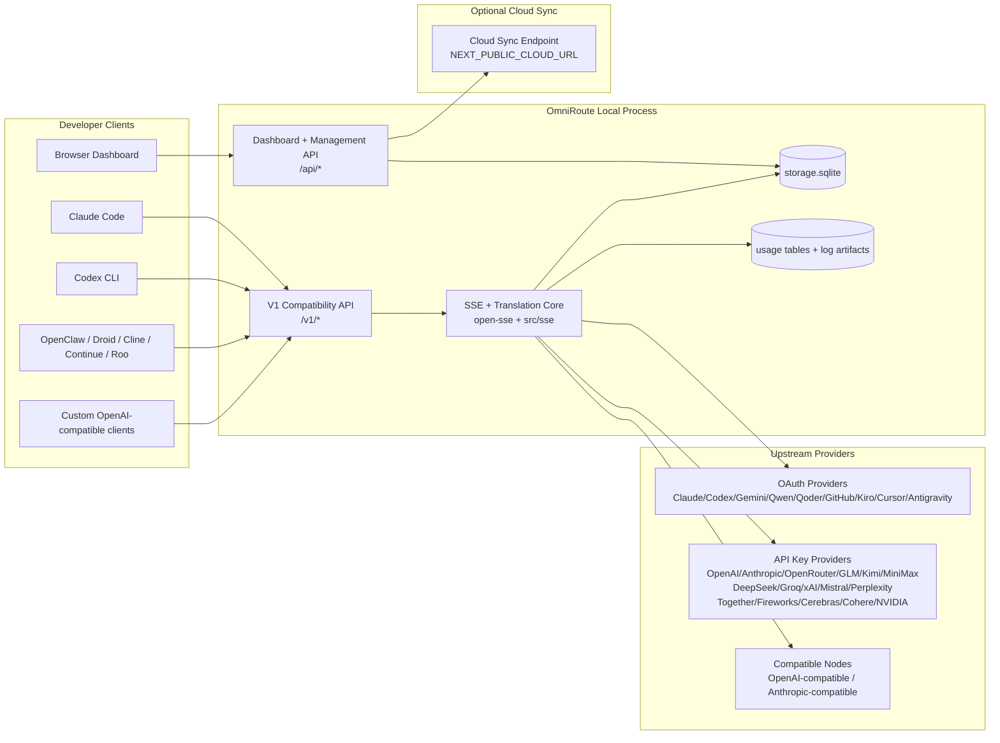
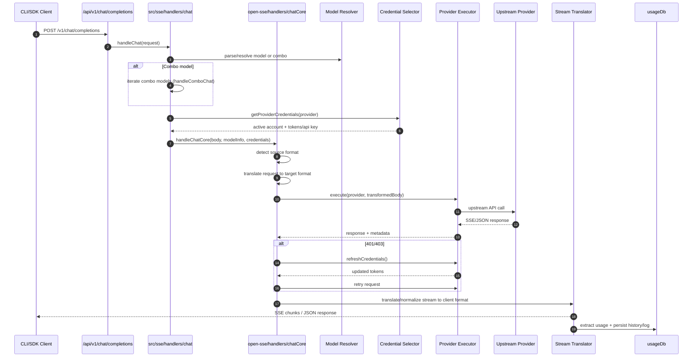
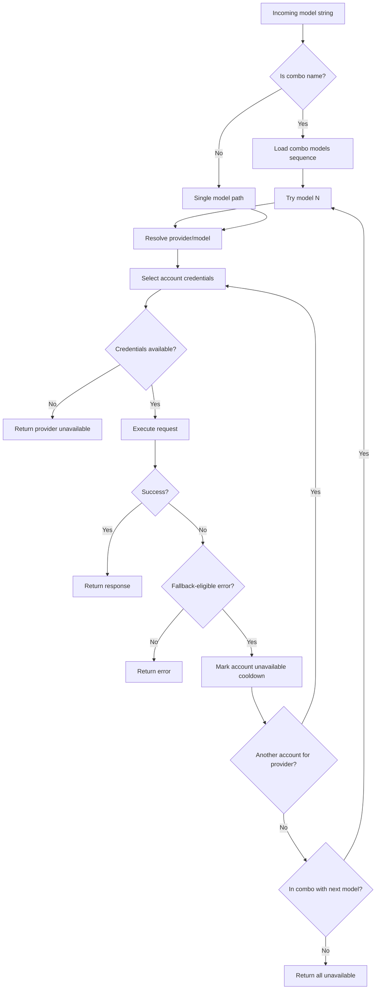
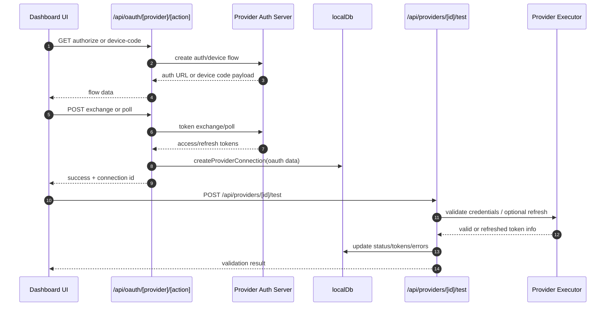
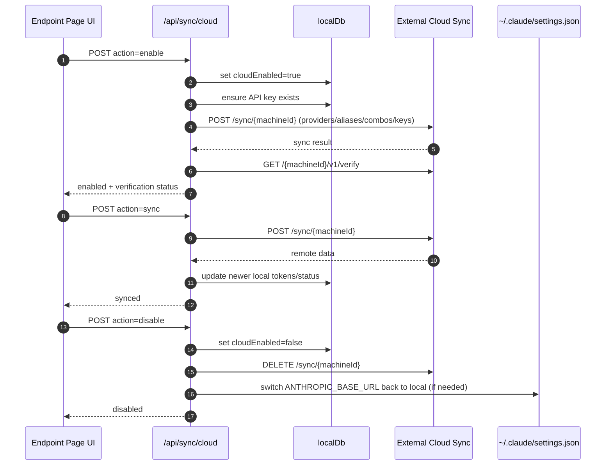
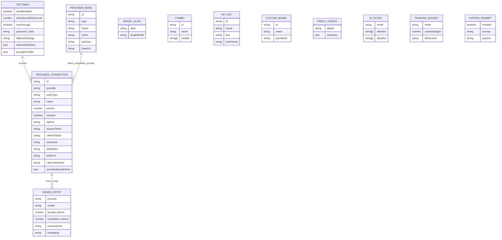
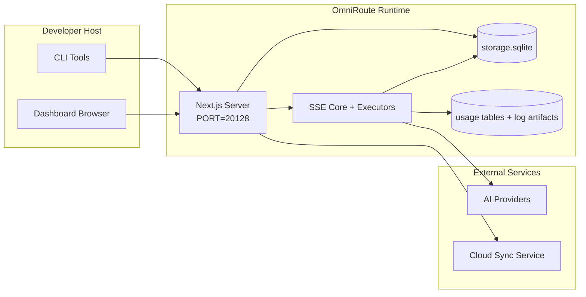

# OmniRoute Architecture (Română)

🌐 **Languages:** 🇺🇸 [English](../../../../docs/ARCHITECTURE.md) · 🇪🇸 [es](../../es/docs/ARCHITECTURE.md) · 🇫🇷 [fr](../../fr/docs/ARCHITECTURE.md) · 🇩🇪 [de](../../de/docs/ARCHITECTURE.md) · 🇮🇹 [it](../../it/docs/ARCHITECTURE.md) · 🇷🇺 [ru](../../ru/docs/ARCHITECTURE.md) · 🇨🇳 [zh-CN](../../zh-CN/docs/ARCHITECTURE.md) · 🇯🇵 [ja](../../ja/docs/ARCHITECTURE.md) · 🇰🇷 [ko](../../ko/docs/ARCHITECTURE.md) · 🇸🇦 [ar](../../ar/docs/ARCHITECTURE.md) · 🇮🇳 [hi](../../hi/docs/ARCHITECTURE.md) · 🇮🇳 [in](../../in/docs/ARCHITECTURE.md) · 🇹🇭 [th](../../th/docs/ARCHITECTURE.md) · 🇻🇳 [vi](../../vi/docs/ARCHITECTURE.md) · 🇮🇩 [id](../../id/docs/ARCHITECTURE.md) · 🇲🇾 [ms](../../ms/docs/ARCHITECTURE.md) · 🇳🇱 [nl](../../nl/docs/ARCHITECTURE.md) · 🇵🇱 [pl](../../pl/docs/ARCHITECTURE.md) · 🇸🇪 [sv](../../sv/docs/ARCHITECTURE.md) · 🇳🇴 [no](../../no/docs/ARCHITECTURE.md) · 🇩🇰 [da](../../da/docs/ARCHITECTURE.md) · 🇫🇮 [fi](../../fi/docs/ARCHITECTURE.md) · 🇵🇹 [pt](../../pt/docs/ARCHITECTURE.md) · 🇷🇴 [ro](../../ro/docs/ARCHITECTURE.md) · 🇭🇺 [hu](../../hu/docs/ARCHITECTURE.md) · 🇧🇬 [bg](../../bg/docs/ARCHITECTURE.md) · 🇸🇰 [sk](../../sk/docs/ARCHITECTURE.md) · 🇺🇦 [uk-UA](../../uk-UA/docs/ARCHITECTURE.md) · 🇮🇱 [he](../../he/docs/ARCHITECTURE.md) · 🇵🇭 [phi](../../phi/docs/ARCHITECTURE.md) · 🇧🇷 [pt-BR](../../pt-BR/docs/ARCHITECTURE.md) · 🇨🇿 [cs](../../cs/docs/ARCHITECTURE.md) · 🇹🇷 [tr](../../tr/docs/ARCHITECTURE.md)

---

_Ultima actualizare: 2026-03-28_## Executive Summary

OmniRoute este un gateway local de rutare AI și un tablou de bord construit pe Next.js.
Oferă un singur punct final compatibil cu OpenAI (`/v1/*`) și direcționează traficul către mai mulți furnizori din amonte cu traducere, alternativă, reîmprospătare token și urmărire a utilizării.

Capacitățile de bază:

- Suprafață API compatibilă cu OpenAI pentru CLI/instrumente (28 de furnizori)
- Traducerea cererii/răspunsurilor între formatele furnizorilor
- Alternativ combo de model (secvență cu mai multe modele)
- Rezervă de rezervă la nivel de cont (cu mai multe conturi pentru fiecare furnizor)
- Gestionarea conexiunii furnizorului OAuth + cheie API
- Generare de încorporare prin `/v1/embeddings` (6 furnizori, 9 modele)
- Generare de imagini prin `/v1/images/generations` (4 furnizori, 9 modele)
- Gândiți-vă la analizarea etichetelor (`<think>...</think>`) pentru modele de raționament
- Sanitizarea răspunsului pentru compatibilitate strictă cu OpenAI SDK
- Normalizarea rolurilor (dezvoltator→sistem, sistem→utilizator) pentru compatibilitate între furnizori
- Conversie de ieșire structurată (json_schema → Gemini responseSchema)
- Persistență locală pentru furnizori, chei, aliasuri, combo-uri, setări, prețuri
- Urmărirea utilizării/costurilor și înregistrarea cererilor
- Sincronizare cloud opțională pentru sincronizare multi-dispozitiv/state
- Lista permisă/lista blocată IP pentru controlul accesului API
- Gândire la managementul bugetului (passthrough/auto/personalizat/adaptativ)
- Sistem global de injectare promptă
- Urmărirea sesiunii și amprentarea
- Limitare îmbunătățită a ratei per cont cu profiluri specifice furnizorului
- Model de întrerupător pentru rezistența furnizorului
- Protectie anti-tunet cu blocare mutex
- Cache de deduplicare a cererilor bazate pe semnătură
- Nivelul domeniului: disponibilitatea modelului, regulile de cost, politica de rezervă, politica de blocare
- Persistența stării domeniului (cache-ul de scriere SQLite pentru rezervări, bugete, blocări, întreruptoare de circuit)
- Motor de politici pentru evaluarea centralizată a cererilor (blocare → buget → rezervă)
- Solicitați telemetrie cu agregarea latenței p50/p95/p99
- ID de corelare (X-Request-Id) pentru urmărirea de la capăt la capăt
- Înregistrare de audit de conformitate cu renunțare pentru fiecare cheie API
- Cadrul de evaluare pentru asigurarea calității LLM
- Tabloul de bord Resilience UI cu starea întreruptorului în timp real
- Furnizori OAuth modulari (12 module individuale sub `src/lib/oauth/providers/`)

Model de rulare principal:

- Rutele aplicației Next.js sub `src/app/api/*` implementează atât API-uri de tablou de bord, cât și API-uri de compatibilitate
- Un nucleu SSE/rutare partajat în `src/sse/*` + `open-sse/*` se ocupă de execuția furnizorului, traducerea, streamingul, fallback-ul și utilizarea## Scope and Boundaries

### In Scope

- Timp de rulare gateway local
- API-uri de gestionare a tabloului de bord
- Autentificarea furnizorului și reîmprospătarea simbolului
- Solicitați traducere și streaming SSE
- Stare locală + persistență de utilizare
- Orchestrare opțională de sincronizare în cloud### Out of Scope

- Implementarea serviciului cloud în spatele „NEXT_PUBLIC_CLOUD_URL”.
- Furnizor SLA/plan de control în afara procesului local
- Binarele CLI externe în sine (Claude CLI, Codex CLI etc.)## Dashboard Surface (Current)

Paginile principale din `src/app/(tabloul de bord)/tabloul de bord/`:

- `/dashboard` — pornire rapidă + prezentare generală a furnizorului
- `/dashboard/endpoint` — proxy punct final + MCP + A2A + file API endpoint
- `/dashboard/providers` — conexiuni și acreditări ale furnizorului
- `/dashboard/combos` — strategii combinate, șabloane, reguli de rutare a modelului
- `/dashboard/costs` — agregarea costurilor și vizibilitatea prețurilor
- `/dashboard/analytics` — analize de utilizare și evaluări
- `/dashboard/limits` — controale de cotă/rată
- `/dashboard/cli-tools` — onboarding CLI, detectarea timpului de execuție, generarea config.
- `/dashboard/agents` — agenți ACP detectați + înregistrare personalizată a agentului
- `/dashboard/media` — imagine/video/muzică loc de joacă
- `/dashboard/search-tools` — testarea și istoricul furnizorului de căutare
- `/tableau de bord/sănătate` — timp de funcționare, întrerupătoare, limite de rată
- `/dashboard/logs` — jurnalele cereri/proxy/audit/console
- `/dashboard/settings` — file cu setări de sistem (general, rutare, setări implicite combo etc.)
- `/dashboard/api-manager` — ciclul de viață al cheii API și permisiunile modelului## High-Level System Context



## Core Runtime Components

## 1) API and Routing Layer (Next.js App Routes)

Directoare principale:

- `src/app/api/v1/*` și `src/app/api/v1beta/*` pentru API-uri de compatibilitate
- `src/app/api/*` pentru API-uri de gestionare/configurare
- Următoarea rescrie în harta `next.config.mjs` `/v1/*` la `/api/v1/*`

Rute importante de compatibilitate:

- `src/app/api/v1/chat/completions/route.ts`
- `src/app/api/v1/messages/route.ts`
- `src/app/api/v1/responses/route.ts`
- `src/app/api/v1/models/route.ts` — include modele personalizate cu `custom: true`
- `src/app/api/v1/embeddings/route.ts` — generare de încorporare (6 furnizori)
- `src/app/api/v1/images/generations/route.ts` — generare de imagini (4+ furnizori inclusiv Antigravity/Nebius)
- `src/app/api/v1/messages/count_tokens/route.ts`
- `src/app/api/v1/providers/[provider]/chat/completions/route.ts` — chat dedicat pentru fiecare furnizor
- `src/app/api/v1/providers/[provider]/embeddings/route.ts` — înglobări dedicate pentru fiecare furnizor
- `src/app/api/v1/providers/[provider]/images/generations/route.ts` — imagini dedicate pentru fiecare furnizor
- `src/app/api/v1beta/models/route.ts`
- `src/app/api/v1beta/models/[...cale]/route.ts`

Domenii de management:

- Auth/settings: `src/app/api/auth/*`, `src/app/api/settings/*`
- Furnizori/conexiuni: `src/app/api/providers*`
- Noduri furnizor: `src/app/api/provider-nodes*`
- Modele personalizate: `src/app/api/provider-models` (GET/POST/DELETE)
- Catalog de modele: `src/app/api/models/route.ts` (GET)
- Configurare proxy: `src/app/api/settings/proxy` (GET/PUT/DELETE) + `src/app/api/settings/proxy/test` (POST)
- OAuth: `src/app/api/oauth/*`
- Chei/aliase/combo/preț: `src/app/api/keys*`, `src/app/api/models/alias`, `src/app/api/combos*`, `src/app/api/pricing`
- Utilizare: `src/app/api/usage/*`
- Sincronizare/cloud: `src/app/api/sync/*`, `src/app/api/cloud/*`
- Ajutor de instrumente CLI: `src/app/api/cli-tools/*`
- Filtru IP: `src/app/api/settings/ip-filter` (GET/PUT)
- Buget de gândire: `src/app/api/settings/thinking-budget` (GET/PUT)
- prompt de sistem: `src/app/api/settings/system-prompt` (GET/PUT)
- Sesiuni: `src/app/api/sessions` (GET)
- Limite de rată: `src/app/api/rate-limits` (GET)
- Reziliență: `src/app/api/resilience` (GET/PATCH) — profiluri furnizor, întrerupător, stare limită a ratei
- Resetare rezistență: `src/app/api/resilience/reset` (POST) - resetare întrerupătoare + cooldown-uri
- Statistici cache: `src/app/api/cache/stats` (GET/DELETE)
- Disponibilitatea modelului: `src/app/api/models/availability` (GET/POST)
- Telemetrie: `src/app/api/telemetry/summary` (GET)
- Buget: `src/app/api/usage/budget` (GET/POST)
- Lanțuri de rezervă: `src/app/api/fallback/chains` (GET/POST/DELETE)
- Audit de conformitate: `src/app/api/compliance/audit-log` (GET)
- Evaluări: `src/app/api/evals` (GET/POST), `src/app/api/evals/[suiteId]` (GET)
- Politici: `src/app/api/policies` (GET/POST)## 2) SSE + Translation Core

Module principale de flux:

- Intrare: `src/sse/handlers/chat.ts`
- Orchestrare de bază: `open-sse/handlers/chatCore.ts`
- Adaptoare de execuție furnizor: `open-sse/executors/*`
- Format de detectare/config furnizor: `open-sse/services/provider.ts`
- Analiza/rezolvarea modelului: `src/sse/services/model.ts`, `open-sse/services/model.ts`
- Logica de rezervă a contului: `open-sse/services/accountFallback.ts`
- Registrul traducerilor: `open-sse/translator/index.ts`
- Transformări de flux: `open-sse/utils/stream.ts`, `open-sse/utils/streamHandler.ts`
- Extragerea/normalizarea utilizării: `open-sse/utils/usageTracking.ts`
- Think tag parser: `open-sse/utils/thinkTagParser.ts`
- Embedding handler: `open-sse/handlers/embeddings.ts`
- Registrul furnizorului de încorporare: `open-sse/config/embeddingRegistry.ts`
- Manager de generare a imaginii: `open-sse/handlers/imageGeneration.ts`
- Registrul furnizorului de imagini: `open-sse/config/imageRegistry.ts`
- igienizare răspuns: `open-sse/handlers/responseSanitizer.ts`
- Normalizarea rolurilor: `open-sse/services/roleNormalizer.ts`

Servicii (logica de afaceri):

- Selectarea/punctarea contului: `open-sse/services/accountSelector.ts`
- Managementul ciclului de viață context: `open-sse/services/contextManager.ts`
- Aplicarea filtrului IP: `open-sse/services/ipFilter.ts`
- Urmărirea sesiunii: `open-sse/services/sessionManager.ts`
- Solicitați deduplicarea: `open-sse/services/signatureCache.ts`
- Injectarea promptă a sistemului: `open-sse/services/systemPrompt.ts`
- Gândire la managementul bugetului: `open-sse/services/thinkingBudget.ts`
- Rutarea modelului wildcard: `open-sse/services/wildcardRouter.ts`
- Gestionarea limitelor de tarife: `open-sse/services/rateLimitManager.ts`
- Întrerupător: `open-sse/services/circuitBreaker.ts`

Module de nivel de domeniu:

- Disponibilitatea modelului: `src/lib/domain/modelAvailability.ts`
- Reguli de cost/bugete: `src/lib/domain/costRules.ts`
- Politica de rezervă: `src/lib/domain/fallbackPolicy.ts`
- Soluție combinată: `src/lib/domain/comboResolver.ts`
- Politica de blocare: `src/lib/domain/lockoutPolicy.ts`
- Motor de politici: `src/domain/policyEngine.ts` — blocare centralizată → buget → evaluare alternativă
- Catalog de coduri de eroare: `src/lib/domain/errorCodes.ts`
- ID cerere: `src/lib/domain/requestId.ts`
- Timeout pentru preluare: `src/lib/domain/fetchTimeout.ts`
- Solicitați telemetrie: `src/lib/domain/requestTelemetry.ts`
- Conformitate/audit: `src/lib/domain/compliance/index.ts`
- Runner de evaluare: `src/lib/domain/evalRunner.ts`
- Persistența stării domeniului: `src/lib/db/domainState.ts` — SQLite CRUD pentru lanțuri de rezervă, bugete, istoricul costurilor, starea de blocare, întrerupătoarele de circuit

Module furnizor OAuth (12 fișiere individuale sub `src/lib/oauth/providers/`):

- Index de registru: `src/lib/oauth/providers/index.ts`
- Furnizori individuali: `claude.ts`, `codex.ts`, `gemini.ts`, `antigravity.ts`, `qoder.ts`, `qwen.ts`, `kimi-coding.ts`, `github.ts`, `kiro.ts`, `cursor.ts`, `tski`, `cursor.ts`, `tski`, `locode.
- Ambalaj subțire: `src/lib/oauth/providers.ts` — reexporturi din module individuale## 3) Persistence Layer

DB de stat primar (SQLite):

- Core infra: `src/lib/db/core.ts` (better-sqlite3, migrations, WAL)
- Reexportați fațada: `src/lib/localDb.ts` (strat subțire de compatibilitate pentru apelanți)
- fișier: `${DATA_DIR}/storage.sqlite` (sau `$XDG_CONFIG_HOME/omniroute/storage.sqlite` când este setat, altfel `~/.omniroute/storage.sqlite`)
- entități (tabele + spații de nume KV): providerConnections, providerNodes, modelAliases, combo, apiKeys, setări, prețuri,**customModels**,**proxyConfig**,**ipFilter**,**thinkingBudget**,**systemPrompt**

Persistență de utilizare:

- fațadă: `src/lib/usageDb.ts` (module descompuse în `src/lib/usage/*`)
- Tabelele SQLite în `storage.sqlite`: `usage_history`, `call_logs`, `proxy_logs`
- artefactele de fișier opționale rămân pentru compatibilitate/depanare (`${DATA_DIR}/log.txt`, `${DATA_DIR}/call_logs/`, `<repo>/logs/...`)
- fișierele JSON moștenite sunt migrate la SQLite prin migrații de pornire atunci când sunt prezente

DB Stare Domeniu (SQLite):

- `src/lib/db/domainState.ts` — operațiuni CRUD pentru starea domeniului
- Tabele (create în `src/lib/db/core.ts`): `domain_fallback_chains`, `domain_budgets`, `domain_cost_history`, `domain_lockout_state`, `domain_circuit_breakers`
- Model de cache de scriere: hărțile din memorie sunt autorizate în timpul execuției; mutațiile sunt scrise sincron cu SQLite; starea este restabilită din DB la pornirea la rece## 4) Auth + Security Surfaces

- Autentificare cookie de tablou de bord: `src/proxy.ts`, `src/app/api/auth/login/route.ts`
- Generarea/verificarea cheii API: `src/shared/utils/apiKey.ts`
- Secretele furnizorului au persistat în intrările `providerConnections`
- Suport proxy de ieșire prin `open-sse/utils/proxyFetch.ts` (env vars) și `open-sse/utils/networkProxy.ts` (configurabil per furnizor sau global)## 5) Cloud Sync

- Scheduler init: `src/lib/initCloudSync.ts`, `src/shared/services/initializeCloudSync.ts`, `src/shared/services/modelSyncScheduler.ts`
- Sarcină periodică: `src/shared/services/cloudSyncScheduler.ts`
- Sarcină periodică: `src/shared/services/modelSyncScheduler.ts`
- Ruta de control: `src/app/api/sync/cloud/route.ts`## Request Lifecycle (`/v1/chat/completions`)



## Combo + Account Fallback Flow



Deciziile de rezervă sunt conduse de `open-sse/services/accountFallback.ts` folosind coduri de stare și euristica mesajelor de eroare. Rutarea combinată adaugă o protecție suplimentară: 400-urile la nivel de furnizor, cum ar fi eșecurile de blocare a conținutului în amonte și de validare a rolului, sunt tratate ca eșecuri locale ale modelului, astfel încât țintele combo ulterioare să poată rula în continuare.## OAuth Onboarding and Token Refresh Lifecycle



Reîmprospătarea în timpul traficului live este executată în `open-sse/handlers/chatCore.ts` prin intermediul executorului `refreshCredentials()`.## Cloud Sync Lifecycle (Enable / Sync / Disable)



Sincronizarea periodică este declanșată de „CloudSyncScheduler” atunci când cloud este activat.## Data Model and Storage Map



Fișiere de stocare fizică:

- DB primar de rulare: `${DATA_DIR}/storage.sqlite`
- linii de jurnal de solicitare: `${DATA_DIR}/log.txt` (artefact de compatibilitate/depanare)
- arhive structurate de încărcare a apelurilor: `${DATA_DIR}/call_logs/`
- sesiuni opționale de traducător/cerere de depanare: `<repo>/logs/...`## Deployment Topology



## Module Mapping (Decision-Critical)

### Route and API Modules

- `src/app/api/v1/*`, `src/app/api/v1beta/*`: API-uri de compatibilitate
- `src/app/api/v1/providers/[provider]/*`: rute dedicate pentru fiecare furnizor (chat, încorporare, imagini)
- `src/app/api/providers*`: furnizor CRUD, validare, testare
- `src/app/api/provider-nodes*`: gestionarea nodurilor compatibile personalizate
- `src/app/api/provider-models`: management personalizat model (CRUD)
- `src/app/api/models/route.ts`: API de catalog de modele (alias-uri + modele personalizate)
- `src/app/api/oauth/*`: fluxuri OAuth/device-code
- `src/app/api/keys*`: ciclul de viață local al cheii API
- `src/app/api/models/alias`: gestionare alias
- `src/app/api/combos*`: gestionarea combo de rezervă
- `src/app/api/pricing`: înlocuirea prețurilor pentru calcularea costurilor
- `src/app/api/settings/proxy`: configurație proxy (GET/PUT/DELETE)
- `src/app/api/settings/proxy/test`: test de conectivitate proxy de ieșire (POST)
- `src/app/api/usage/*`: API-uri de utilizare și jurnal
- `src/app/api/sync/*` + `src/app/api/cloud/*`: sincronizare în cloud și asistență orientată spre nor
- `src/app/api/cli-tools/*`: scriitori/verificatori de configurare CLI locale
- `src/app/api/settings/ip-filter`: lista IP permisă/lista blocată (GET/PUT)
- `src/app/api/settings/thinking-budget`: configurația bugetului simbolului de gândire (GET/PUT)
- `src/app/api/settings/system-prompt`: prompt de sistem global (GET/PUT)
- `src/app/api/sessions`: listarea sesiunilor active (GET)
- `src/app/api/rate-limits`: starea limitei ratei per cont (GET)### Routing and Execution Core

- `src/sse/handlers/chat.ts`: analizarea cererii, gestionarea combinațiilor, bucla de selecție a contului
- `open-sse/handlers/chatCore.ts`: traducere, expediere executor, reîncercare/reîmprospătare manipulare, configurarea fluxului
- `open-sse/executors/*`: comportamentul de rețea și format specific furnizorului### Translation Registry and Format Converters

- `open-sse/translator/index.ts`: registru și orchestrare a traducătorilor
- Solicitați traducători: `open-sse/translator/request/*`
- Traducători de răspuns: `open-sse/translator/response/*`
- Formatarea constantelor: `open-sse/translator/formats.ts`### Persistence

- `src/lib/db/*`: configurație/stare persistentă și persistența domeniului pe SQLite
- `src/lib/localDb.ts`: reexport de compatibilitate pentru modulele DB
- `src/lib/usageDb.ts`: istoricul utilizării/jurnalele de apeluri fațadă deasupra tabelelor SQLite## Provider Executor Coverage (Strategy Pattern)

Fiecare furnizor are un executor specializat care extinde `BaseExecutor` (în `open-sse/executors/base.ts`), care oferă crearea URL, construcția antetului, reîncercarea cu backoff exponențial, cârlige de reîmprospătare a acreditărilor și metoda de orchestrare `execute()`.

| Executant             | Furnizor(i)                                                                                                                                                  | Manipulare specială                                                                |
| --------------------- | ------------------------------------------------------------------------------------------------------------------------------------------------------------ | ---------------------------------------------------------------------------------- |
| `DefaultExecutor`     | OpenAI, Claude, Gemini, Qwen, Qoder, OpenRouter, GLM, Kimi, MiniMax, DeepSeek, Groq, xAI, Mistral, Perplexity, Together, Fireworks, Cerebras, Cohere, NVIDIA | Configurare URL dinamică/antet per furnizor                                        |
| `AntigravityExecutor` | Google Antigravity                                                                                                                                           | ID-uri personalizate de proiect/sesiune, Reîncercați-După analizare                |
| `CodexExecutor`       | OpenAI Codex                                                                                                                                                 | Injectează instrucțiuni de sistem, forțează efortul de raționament                 |
| `CursorExecutor`      | Cursor IDE                                                                                                                                                   | Protocolul ConnectRPC, codificarea Protobuf, semnarea cererii prin suma de control |
| `GithubExecutor`      | GitHub Copilot                                                                                                                                               | Reîmprospătare jeton Copilot, anteturi care imită VSCode                           |
| `KiroExecutor`        | AWS CodeWhisperer/Kiro                                                                                                                                       | Format binar AWS EventStream → conversie SSE                                       |
| `GeminiCLIExecutor`   | Gemeni CLI                                                                                                                                                   | Ciclul de reîmprospătare a simbolului OAuth Google                                 |

Toți ceilalți furnizori (inclusiv noduri compatibile personalizate) folosesc `DefaultExecutor`.## Provider Compatibility Matrix

| Furnizor         | Format           | Auth                          | Flux             | Non-Stream | Token Refresh | Utilizare API          |
| ---------------- | ---------------- | ----------------------------- | ---------------- | ---------- | ------------- | ---------------------- | ------------------------------ |
| Claude           | claude           | Cheie API / OAuth             | ✅               | ✅         | ✅            | ⚠️ Doar administrator  |
| Gemeni           | gemeni           | Cheie API / OAuth             | ✅               | ✅         | ✅            | ⚠️ Cloud Console       |
| Gemeni CLI       | gemeni-cli       | OAuth                         | ✅               | ✅         | ✅            | ⚠️ Cloud Console       |
| Antigravitație   | antigravitație   | OAuth                         | ✅               | ✅         | ✅            | ✅ Cota completă API   |
| OpenAI           | deschis          | Cheie API                     | ✅               | ✅         | ❌            | ❌                     |
| Codex            | openai-responses | OAuth                         | ✅ forțat        | ❌         | ✅            | ✅ Limite de tarif     |
| GitHub Copilot   | deschis          | OAuth + Token Copilot         | ✅               | ✅         | ✅            | ✅ Instantanee de cotă |
| Cursor           | cursor           | Sumă de control personalizată | ✅               | ✅         | ❌            | ❌                     |
| Kiro             | kiro             | AWS SSO OIDC                  | ✅ (EventStream) | ❌         | ✅            | ✅ Limite de utilizare |
| Qwen             | deschis          | OAuth                         | ✅               | ✅         | ✅            | ⚠️ La cerere           |
| Qoder            | deschis          | OAuth (de bază)               | ✅               | ✅         | ✅            | ⚠️ La cerere           |
| OpenRouter       | deschis          | Cheie API                     | ✅               | ✅         | ❌            | ❌                     |
| GLM/Kimi/MiniMax | claude           | Cheie API                     | ✅               | ✅         | ❌            | ❌                     |
| DeepSeek         | deschis          | Cheie API                     | ✅               | ✅         | ❌            | ❌                     |
| Groq             | deschis          | Cheie API                     | ✅               | ✅         | ❌            | ❌                     |
| xAI (Grok)       | deschis          | Cheie API                     | ✅               | ✅         | ❌            | ❌                     |
| Mistral          | deschis          | Cheie API                     | ✅               | ✅         | ❌            | ❌                     |
| Nedumerire       | deschis          | Cheie API                     | ✅               | ✅         | ❌            | ❌                     |
| Împreună AI      | deschis          | Cheie API                     | ✅               | ✅         | ❌            | ❌                     |
| Artificii AI     | deschis          | Cheie API                     | ✅               | ✅         | ❌            | ❌                     |
| Cerebre          | deschis          | Cheie API                     | ✅               | ✅         | ❌            | ❌                     |
| Cohere           | deschis          | Cheie API                     | ✅               | ✅         | ❌            | ❌                     |
| NVIDIA NIM       | deschis          | Cheie API                     | ✅               | ✅         | ❌            | ❌                     | ## Format Translation Coverage |

Formatele sursă detectate includ:

- `openai`
- `openai-responses`
- `claude`
- `gemeni`

Formatele țintă includ:

- Chat/Răspunsuri OpenAI
- Claude
- Plic Gemeni/Gemeni-CLI/Antigravity
- Kiro
- Cursor

Traducerile folosesc**OpenAI ca format hub**— toate conversiile trec prin OpenAI ca intermediar:```
Source Format → OpenAI (hub) → Target Format

````

Traducerile sunt selectate dinamic pe baza formei încărcăturii sursei și a formatului țintă al furnizorului.

Straturi de procesare suplimentare în conducta de traducere:

-**Sanitizarea răspunsurilor**— Elimina câmpurile nestandard din răspunsurile în format OpenAI (atât în flux, cât și în non-streaming) pentru a asigura conformitatea strictă cu SDK
-**Normalizarea rolurilor**— Convertește `dezvoltator` → `sistem` pentru ținte non-OpenAI; îmbină `sistem` → `utilizator` pentru modelele care resping rolul de sistem (GLM, ERNIE)
-**Think tag extraction**— Analizează blocurile `<think>...</think>` din conținut în câmpul `resoning_content`
-**Ieșire structurată**— Convertește OpenAI `response_format.json_schema` în `responseMimeType` + `responseSchema` al lui Gemini## Supported API Endpoints

| Punct final | Format | Manipulator |
| -------------------------------------------------- | ------------------ | ------------------------------------------------------------------ |
| `POST /v1/chat/completions` | OpenAI Chat | `src/sse/handlers/chat.ts` |
| `POST /v1/messages` | Claude Mesaje | Același handler (detectat automat) |
| `POST /v1/responses` | Răspunsuri OpenAI | `open-sse/handlers/responsesHandler.ts` |
| `POST /v1/embeddings` | Încorporare OpenAI | `open-sse/handlers/embeddings.ts` |
| `GET /v1/embeddings` | Lista de modele | Rută API |
| `POST /v1/images/generations` | Imagini OpenAI | `open-sse/handlers/imageGeneration.ts` |
| `GET /v1/images/generations` | Lista de modele | Rută API |
| `POST /v1/providers/{provider}/chat/completions` | OpenAI Chat | Dedicat pentru fiecare furnizor cu validare a modelului |
| `POST /v1/providers/{provider}/embeddings` | Încorporare OpenAI | Dedicat pentru fiecare furnizor cu validare a modelului |
| `POST /v1/providers/{provider}/images/generations` | Imagini OpenAI | Dedicat pentru fiecare furnizor cu validare a modelului |
| `POST /v1/messages/count_tokens` | Claude Token Count | Rută API |
| `GET /v1/models` | Lista de modele OpenAI | Rută API (chat + încorporare + imagine + modele personalizate) |
| `GET /api/models/catalog` | Catalog | Toate modelele grupate după furnizor + tip |
| `POST /v1beta/models/*:streamGenerateContent` | nativ Gemeni | Rută API |
| `GET/PUT/DELETE /api/settings/proxy` | Configurare proxy | Configurare proxy de rețea |
| `POST /api/settings/proxy/test` | Conectivitate proxy | Punct final de testare de sănătate/conectivitate proxy |
| `GET/POST/DELETE /api/provider-models` | Modele de furnizori | Metadatele modelului furnizorului care susțin modelele disponibile personalizate și gestionate |## Bypass Handler

Managerul de ocolire (`open-sse/utils/bypassHandler.ts`) interceptează cererile cunoscute „de aruncat” de la Claude CLI — ping-uri de încălzire, extrageri de titluri și numărătoare de jetonuri — și returnează un**răspuns fals**fără a consuma jetoane de furnizor în amonte. Acest lucru este declanșat numai când `User-Agent` conține `claude-cli`.## Request Logger Pipeline

Loggerul de solicitare (`open-sse/utils/requestLogger.ts`) oferă o conductă de înregistrare a depanării în 7 etape, dezactivată implicit, activată prin `ENABLE_REQUEST_LOGS=true`:```
1_req_client.json → 2_req_source.json → 3_req_openai.json → 4_req_target.json
→ 5_res_provider.txt → 6_res_openai.txt → 7_res_client.txt
````

Fișierele sunt scrise în `<repo>/logs/<session>/` pentru fiecare sesiune de solicitare.## Failure Modes and Resilience

## 1) Account/Provider Availability

- cooldown contului furnizorului pentru erori tranzitorii/rate/auth
- rezervă de cont înainte de cererea eșuată
- alternativă model combo atunci când modelul curent/calea furnizorului este epuizată## 2) Token Expiry

- preverificare și reîmprospătare cu reîncercare pentru furnizorii care pot fi reîmprospătați
- 401/403 reîncercați după încercarea de reîmprospătare în calea de bază## 3) Stream Safety

- controler de flux conștient de deconectare
- flux de traducere cu spălare la sfârșitul fluxului și gestionarea `[DONE]`
- estimarea utilizării de rezervă atunci când metadatele de utilizare ale furnizorului lipsesc## 4) Cloud Sync Degradation

- apar erori de sincronizare, dar timpul de execuție local continuă
- planificatorul are o logică capabilă să reîncerce, dar execuția periodică apelează în mod implicit sincronizarea cu o singură încercare## 5) Data Integrity

- Migrații de schemă SQLite și cârlige de actualizare automată la pornire
- moștenire JSON → cale de compatibilitate cu migrarea SQLite## Observability and Operational Signals

Surse de vizibilitate la runtime:

- jurnalele consolei de la `src/sse/utils/logger.ts`
- agregate de utilizare pe cerere în SQLite (`usage_history`, `call_logs`, `proxy_logs`)
- capturi detaliate de încărcare utilă în patru etape în SQLite (`request_detail_logs`) când `settings.detailed_logs_enabled=true`
- Jurnalul de stare a cererii textuale în `log.txt` (opțional/compat)
- jurnalele opționale de solicitare/traducere profundă sub `jurnale/` când `ENABLE_REQUEST_LOGS=true`
- puncte finale de utilizare a tabloului de bord (`/api/usage/*`) pentru consumul UI

Captura detaliată a sarcinii utile a cererii stochează până la patru etape JSON de încărcare utilă pentru fiecare apel direcționat:

- cerere bruta primita de la client
- cerere tradusă trimisă efectiv în amonte
- răspunsul furnizorului reconstruit ca JSON; răspunsurile transmise în flux sunt compactate în rezumatul final plus metadatele fluxului
- răspunsul final al clientului returnat de OmniRoute; răspunsurile transmise în flux sunt stocate în aceeași formă de rezumat compact## Security-Sensitive Boundaries

- Secretul JWT (`JWT_SECRET`) securizează verificarea/semnarea cookie-urilor sesiunii de bord
- Bootstrap-ul inițial al parolei (`INITIAL_PASSWORD`) ar trebui să fie configurat în mod explicit pentru furnizarea la prima executare
- Cheia API secretă HMAC (`API_KEY_SECRET`) securizează formatul cheii API locale generate
- Secretele furnizorului (chei/token-uri API) sunt păstrate în DB local și ar trebui protejate la nivel de sistem de fișiere
- Punctele finale de sincronizare în cloud se bazează pe semantica de autentificare a cheii API + ID-ul mașinii## Environment and Runtime Matrix

Variabilele de mediu utilizate în mod activ de cod:

- Aplicație/autentificare: `JWT_SECRET`, `INITIAL_PASSWORD`
- Stocare: `DATA_DIR`
- Comportamentul nodului compatibil: `ALLOW_MULTI_CONNECTIONS_PER_COMPAT_NODE`
- Suprascrierea opțională a bazei de stocare (Linux/macOS când `DATA_DIR` este dezactivat): `XDG_CONFIG_HOME`
- Hashing de securitate: `API_KEY_SECRET`, `MACHINE_ID_SALT`
- Înregistrare: `ENABLE_REQUEST_LOGS`
- URL sincronizare/cloud: `NEXT_PUBLIC_BASE_URL`, `NEXT_PUBLIC_CLOUD_URL`
- Proxy de ieșire: `HTTP_PROXY`, `HTTPS_PROXY`, `ALL_PROXY`, `NO_PROXY` și variante cu litere mici
- Indicatori de caracteristică SOCKS5: `ENABLE_SOCKS5_PROXY`, `NEXT_PUBLIC_ENABLE_SOCKS5_PROXY`
- Ajutor platformă/execuție (configurație nu specifică aplicației): `APPDATA`, `NODE_ENV`, `PORT`, `HOSTNAME`## Known Architectural Notes

1. `usageDb` și `localDb` au aceeași politică de bază de director (`DATA_DIR` -> `XDG_CONFIG_HOME/omniroute` -> `~/.omniroute`) cu migrarea fișierelor moștenite.
2. `/api/v1/route.ts` se deleagă la același constructor de catalog unificat folosit de `/api/v1/models` (`src/app/api/v1/models/catalog.ts`) pentru a evita deriva semantică.
3. Loggerul solicitărilor scrie anteturi/corp complet atunci când este activat; tratați directorul de jurnal ca fiind sensibil.
4. Comportamentul în cloud depinde de „NEXT_PUBLIC_BASE_URL” corect și de accesibilitatea punctului final din cloud.
5. Directorul `open-sse/` este publicat ca pachetul de spațiu de lucru `@omniroute/open-sse`**npm**. Codul sursă îl importă prin `@omniroute/open-sse/...` (rezolvat de Next.js `transpilePackages`). Căile fișierelor din acest document încă folosesc numele de director `open-sse/` pentru consecvență.
6. Diagramele din tabloul de bord utilizează**Recharts**(bazate pe SVG) pentru vizualizări analitice accesibile, interactive (diagrame cu bare de utilizare a modelelor, tabele de defalcare a furnizorilor cu rate de succes).
7. Testele E2E folosesc**Playwright**(`tests/e2e/`), rulează prin `npm run test:e2e`. Testele unitare folosesc**Node.js test runner**(`tests/unit/`), rulează prin `npm run test:unit`. Codul sursă sub `src/` este**TypeScript**(`.ts`/`.tsx`); spațiul de lucru `open-sse/` rămâne JavaScript (`.js`).
8. Pagina Setări este organizată în 5 file: Securitate, Rutare (6 strategii globale: fill-first, round-robin, p2c, aleatoriu, cel mai puțin utilizat, optimizat pentru cost), Reziliență (limite ale ratei editabile, întrerupător de circuit, politici), AI (buget de gândire, prompt de sistem, cache prompt), Avansat (proxy).## Operational Verification Checklist

- Construire din sursă: `npm run build`
- Build Docker imagine: `docker build -t omniroute .`
- Porniți serviciul și verificați:
- `GET /api/settings`
- `GET /api/v1/models`
- Adresa URL de bază țintă CLI ar trebui să fie `http://<gazdă>:20128/v1` când `PORT=20128`
