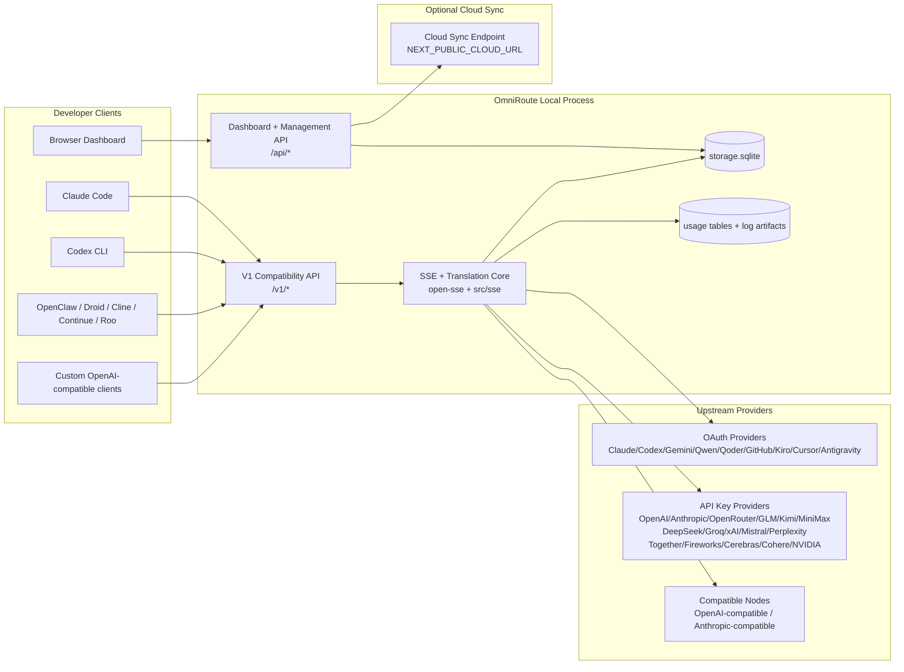
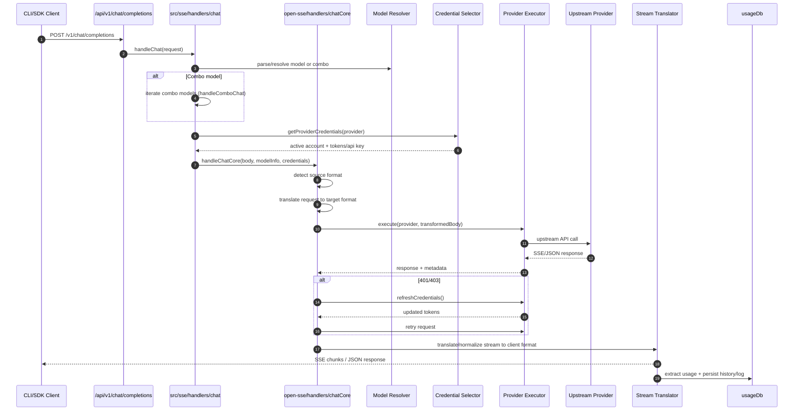
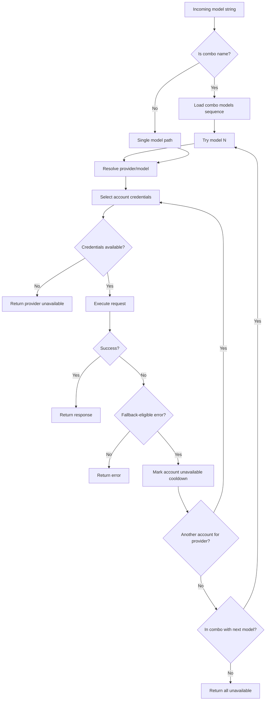
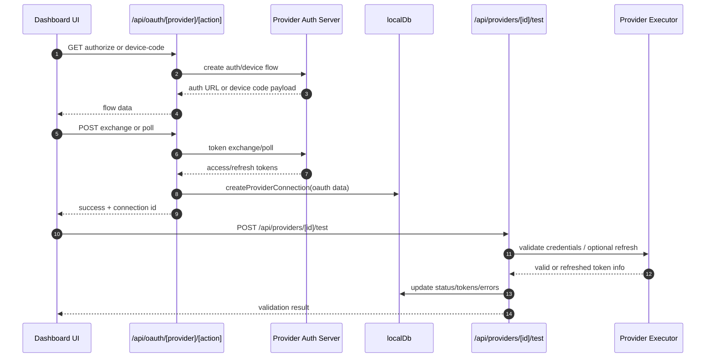
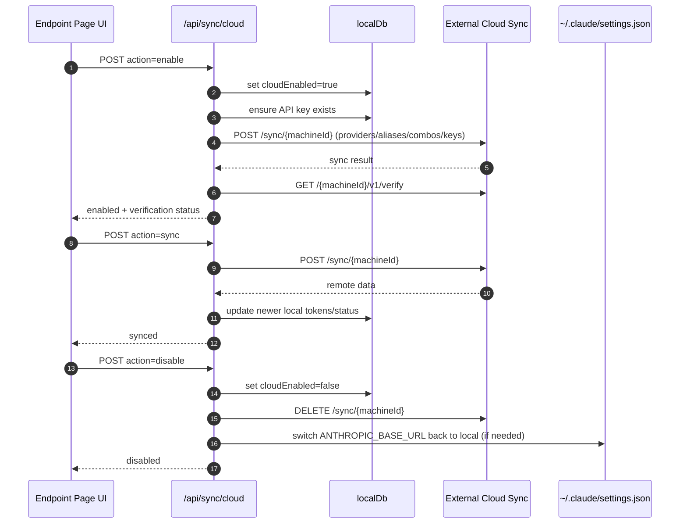
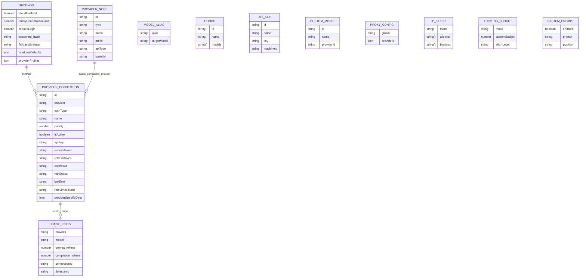
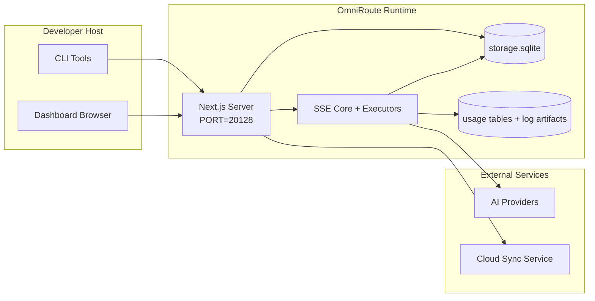

# OmniRoute Architecture (Русский)

🌐 **Languages:** 🇺🇸 [English](../../../../docs/ARCHITECTURE.md) · 🇪🇸 [es](../../es/docs/ARCHITECTURE.md) · 🇫🇷 [fr](../../fr/docs/ARCHITECTURE.md) · 🇩🇪 [de](../../de/docs/ARCHITECTURE.md) · 🇮🇹 [it](../../it/docs/ARCHITECTURE.md) · 🇷🇺 [ru](../../ru/docs/ARCHITECTURE.md) · 🇨🇳 [zh-CN](../../zh-CN/docs/ARCHITECTURE.md) · 🇯🇵 [ja](../../ja/docs/ARCHITECTURE.md) · 🇰🇷 [ko](../../ko/docs/ARCHITECTURE.md) · 🇸🇦 [ar](../../ar/docs/ARCHITECTURE.md) · 🇮🇳 [hi](../../hi/docs/ARCHITECTURE.md) · 🇮🇳 [in](../../in/docs/ARCHITECTURE.md) · 🇹🇭 [th](../../th/docs/ARCHITECTURE.md) · 🇻🇳 [vi](../../vi/docs/ARCHITECTURE.md) · 🇮🇩 [id](../../id/docs/ARCHITECTURE.md) · 🇲🇾 [ms](../../ms/docs/ARCHITECTURE.md) · 🇳🇱 [nl](../../nl/docs/ARCHITECTURE.md) · 🇵🇱 [pl](../../pl/docs/ARCHITECTURE.md) · 🇸🇪 [sv](../../sv/docs/ARCHITECTURE.md) · 🇳🇴 [no](../../no/docs/ARCHITECTURE.md) · 🇩🇰 [da](../../da/docs/ARCHITECTURE.md) · 🇫🇮 [fi](../../fi/docs/ARCHITECTURE.md) · 🇵🇹 [pt](../../pt/docs/ARCHITECTURE.md) · 🇷🇴 [ro](../../ro/docs/ARCHITECTURE.md) · 🇭🇺 [hu](../../hu/docs/ARCHITECTURE.md) · 🇧🇬 [bg](../../bg/docs/ARCHITECTURE.md) · 🇸🇰 [sk](../../sk/docs/ARCHITECTURE.md) · 🇺🇦 [uk-UA](../../uk-UA/docs/ARCHITECTURE.md) · 🇮🇱 [he](../../he/docs/ARCHITECTURE.md) · 🇵🇭 [phi](../../phi/docs/ARCHITECTURE.md) · 🇧🇷 [pt-BR](../../pt-BR/docs/ARCHITECTURE.md) · 🇨🇿 [cs](../../cs/docs/ARCHITECTURE.md) · 🇹🇷 [tr](../../tr/docs/ARCHITECTURE.md)

---

_Последнее обновление: 28 марта 2026 г._## Executive Summary

OmniRoute — это локальный шлюз маршрутизации AI и панель управления, созданная на основе Next.js.
Он предоставляет единую конечную точку, совместимую с OpenAI (`/v1/*`), и маршрутизирует трафик между несколькими вышестоящими поставщиками с трансляцией, резервным копированием, обновлением токена и отслеживанием использования.

Основные возможности:

- OpenAI-совместимая поверхность API для CLI/инструментов (28 поставщиков)
- Трансляция запроса/ответа в форматах провайдера.
- Резервный вариант комбо-модели (последовательность из нескольких моделей)
- Резервный вариант на уровне учетной записи (несколько учетных записей для каждого провайдера)
- Управление подключением к поставщику OAuth + API-ключей
- Генерация встраивания через `/v1/embeddings` (6 поставщиков, 9 моделей)
- Генерация изображений через `/v1/images/generations` (4 поставщика, 9 моделей)
- Подумайте о разборе тегов (`<think>...</think>`) для моделей рассуждений.
- Очистка ответов для строгой совместимости OpenAI SDK.
- Нормализация ролей (разработчик→система, система→пользователь) для совместимости между поставщиками.
- Преобразование структурированного вывода (json_schema → Gemini responseSchema)
- Локальное сохранение поставщиков, ключей, псевдонимов, комбинаций, настроек, цен.
- Отслеживание использования/расходов и регистрация запросов
- Дополнительная облачная синхронизация для синхронизации нескольких устройств/состояний.
- Список разрешенных/блокированных IP-адресов для контроля доступа к API.
- Продуманное управление бюджетом (сквозное/автоматическое/настраиваемое/адаптивное)
- Оперативное внедрение глобальной системы
- Отслеживание сеансов и снятие отпечатков пальцев
- Расширенное ограничение скорости для каждой учетной записи с помощью профилей для конкретного поставщика.
- Схема автоматического выключателя для устойчивости поставщика
- Анти-громовая защита стада с блокировкой мьютекса
- Кэш дедупликации запросов на основе сигнатур.
- Уровень домена: доступность модели, правила затрат, резервная политика, политика блокировки.
- Сохранение состояния домена (кэш сквозной записи SQLite для резервных копий, бюджетов, блокировок, автоматических выключателей)
- Механизм политики для централизованной оценки запросов (блокировка → бюджет → резервный вариант)
- Запрос телеметрии с агрегацией задержек p50/p95/p99.
- Идентификатор корреляции (X-Request-Id) для сквозной трассировки.
- Ведение журнала аудита соответствия с возможностью отказа для каждого ключа API.
- Система оценки для обеспечения качества LLM
- Панель управления устойчивостью пользовательского интерфейса с отображением состояния автоматического выключателя в реальном времени.
- Модульные поставщики OAuth (12 отдельных модулей в `src/lib/oauth/providers/`)

Основная модель времени выполнения:

- Маршруты приложений Next.js в `src/app/api/*` реализуют как API панели мониторинга, так и API совместимости.
- Общее ядро SSE/маршрутизации в `src/sse/*` + `open-sse/*` управляет выполнением, трансляцией, потоковой передачей, резервным копированием и использованием поставщика.## Scope and Boundaries

### In Scope

- Среда выполнения локального шлюза
- API-интерфейсы управления информационной панелью
- Аутентификация поставщика и обновление токена
- Запросить перевод и потоковую передачу SSE
- Локальное состояние + постоянство использования
- Дополнительная оркестровка облачной синхронизации.### Out of Scope

- Реализация облачного сервиса за `NEXT_PUBLIC_CLOUD_URL`
- Соглашение об уровне обслуживания поставщика/плоскость управления вне локального процесса.
- Сами внешние двоичные файлы CLI (Claude CLI, Codex CLI и т. д.)## Dashboard Surface (Current)

Главные страницы в `src/app/(dashboard)/dashboard/`:

- `/dashboard` — быстрый старт + обзор провайдера
- `/dashboard/endpoint` — прокси конечной точки + MCP + A2A + вкладки конечной точки API
- `/dashboard/providers` — подключения и учетные данные провайдера.
- `/dashboard/combos` — комбинированные стратегии, шаблоны, правила маршрутизации модели.
- `/dashboard/costs` — агрегирование затрат и видимость цен.
- `/dashboard/analytics` — аналитика и оценка использования.
- `/dashboard/limits` — управление квотами/ставками
- `/dashboard/cli-tools` — подключение CLI, обнаружение во время выполнения, генерация конфигурации.
- `/dashboard/agents` — обнаруженные агенты ACP + регистрация специального агента.
- `/dashboard/media` — площадка для изображений/видео/музыки.
- `/dashboard/search-tools` — тестирование и история поискового провайдера.
- `/dashboard/health` — время безотказной работы, автоматические выключатели, ограничения скорости.
- `/dashboard/logs` — логи запроса/прокси/аудита/консоли.
- `/dashboard/settings` — вкладки настроек системы (общие, маршрутизация, комбо по умолчанию и т.д.)
- `/dashboard/api-manager` — жизненный цикл ключа API и разрешения модели.## High-Level System Context



## Core Runtime Components

## 1) API and Routing Layer (Next.js App Routes)

Основные каталоги:

- `src/app/api/v1/*` и `src/app/api/v1beta/*` для API совместимости.
- `src/app/api/*` для API управления/конфигурации.
- Далее перезаписывается в `next.config.mjs` карта `/v1/*` на `/api/v1/*`

Важные пути совместимости:

- `src/app/api/v1/chat/completions/route.ts`
- `src/app/api/v1/messages/route.ts`
- `src/app/api/v1/responses/route.ts`
- `src/app/api/v1/models/route.ts` — включает пользовательские модели с `custom: true`
- `src/app/api/v1/embeddings/route.ts` — генерация встраивания (6 провайдеров)
- `src/app/api/v1/images/generations/route.ts` — генерация изображений (4+ провайдера, включая Antigravity/Nebius)
- `src/app/api/v1/messages/count_tokens/route.ts`
- `src/app/api/v1/providers/[provider]/chat/completions/route.ts` — специальный чат для каждого провайдера.
- `src/app/api/v1/providers/[provider]/embeddings/route.ts` — выделенные встраивания для каждого провайдера.
- `src/app/api/v1/providers/[provider]/images/generations/route.ts` — отдельные изображения для каждого провайдера.
- `src/app/api/v1beta/models/route.ts`
- `src/app/api/v1beta/models/[...path]/route.ts`

Домены управления:

- Аутентификация/настройки: `src/app/api/auth/*`, `src/app/api/settings/*`
- Поставщики/соединения: `src/app/api/providers*`
- Узлы поставщика: `src/app/api/provider-nodes*`
- Пользовательские модели: `src/app/api/provider-models` (GET/POST/DELETE)
- Каталог моделей: `src/app/api/models/route.ts` (GET)
- Конфигурация прокси: `src/app/api/settings/proxy` (GET/PUT/DELETE) + `src/app/api/settings/proxy/test` (POST)
- OAuth: `src/app/api/oauth/*`
- Ключи/псевдонимы/комбо/цены: `src/app/api/keys*`, `src/app/api/models/alias`, `src/app/api/combos*`, `src/app/api/pricing`
- Использование: `src/app/api/usage/*`
- Синхронизация/облако: `src/app/api/sync/*`, `src/app/api/cloud/*`
- Помощники по инструментам CLI: `src/app/api/cli-tools/*`
- IP-фильтр: `src/app/api/settings/ip-filter` (GET/PUT)
- Бюджет мышления: `src/app/api/settings/thinking-budget` (GET/PUT)
- Системное приглашение: `src/app/api/settings/system-prompt` (GET/PUT)
- Сеансы: `src/app/api/sessions` (GET)
- Ограничения скорости: `src/app/api/rate-limits` (GET)
- Устойчивость: `src/app/api/resilience` (GET/PATCH) — профили провайдера, автоматический выключатель, состояние ограничения скорости.
- Сброс устойчивости: `src/app/api/resilience/reset` (POST) — сброс прерывателей + время восстановления.
- Статистика кэширования: `src/app/api/cache/stats` (GET/DELETE)
- Доступность модели: `src/app/api/models/availability` (GET/POST)
- Телеметрия: `src/app/api/telemetry/summary` (GET)
- Бюджет: `src/app/api/usage/budget` (GET/POST)
- Резервные цепочки: `src/app/api/fallback/chains` (GET/POST/DELETE)
- Аудит соответствия: `src/app/api/compliance/audit-log` (GET)
- Оценки: `src/app/api/evals` (GET/POST), `src/app/api/evals/[suiteId]` (GET)
- Политики: `src/app/api/policies` (GET/POST)## 2) SSE + Translation Core

Модули основного потока:

- Запись: `src/sse/handlers/chat.ts`
  — Базовая оркестровка: `open-sse/handlers/chatCore.ts`
- Адаптеры выполнения поставщика: `open-sse/executors/*`
- Конфигурация обнаружения формата/провайдера: `open-sse/services/provider.ts`
- Анализ/решение модели: `src/sse/services/model.ts`, `open-sse/services/model.ts`
  — Логика возврата учетной записи: `open-sse/services/accountFallback.ts`
- Реестр переводов: `open-sse/translator/index.ts`
- Преобразования потока: `open-sse/utils/stream.ts`, `open-sse/utils/streamHandler.ts`
  — Извлечение/нормализация использования: `open-sse/utils/usageTracking.ts`
- Анализатор тегов Think: `open-sse/utils/thinkTagParser.ts`
- Обработчик встраивания: `open-sse/handlers/embeddings.ts`
- Реестр поставщиков встраивания: `open-sse/config/embeddingRegistry.ts`
  — Обработчик генерации изображения: `open-sse/handlers/imageGeneration.ts`
  — Реестр поставщика изображений: `open-sse/config/imageRegistry.ts`
- Санитация ответа: `open-sse/handlers/responseSanitizer.ts`
- Нормализация ролей: `open-sse/services/roleNormalizer.ts`

Сервисы (бизнес-логика):

- Выбор/оценка учетной записи: `open-sse/services/accountSelector.ts`
- Управление жизненным циклом контекста: `open-sse/services/contextManager.ts`
- Применение IP-фильтра: `open-sse/services/ipFilter.ts`
- Отслеживание сеанса: `open-sse/services/sessionManager.ts`
- Запросить дедупликацию: `open-sse/services/signatureCache.ts`
- Внедрение системного приглашения: `open-sse/services/systemPrompt.ts`
- Мышление управления бюджетом: `open-sse/services/thinkingBudget.ts`
  — Маршрутизация по шаблонной модели: `open-sse/services/wildcardRouter.ts`
- Управление лимитом скорости: `open-sse/services/rateLimitManager.ts`
- Автоматический выключатель: `open-sse/services/circuitBreaker.ts`

Модули доменного уровня:

- Доступность модели: `src/lib/domain/modelAvailability.ts`
- Правила/бюджеты затрат: `src/lib/domain/costRules.ts`
- Резервная политика: `src/lib/domain/fallbackPolicy.ts`
  — Комбинированный преобразователь: `src/lib/domain/comboResolver.ts`
- Политика блокировки: `src/lib/domain/lockoutPolicy.ts`
- Механизм политики: `src/domain/policyEngine.ts` — централизованная блокировка → бюджет → резервная оценка.
- Каталог кодов ошибок: `src/lib/domain/errorCodes.ts`
- Идентификатор запроса: `src/lib/domain/requestId.ts`
- Таймаут получения: `src/lib/domain/fetchTimeout.ts`
- Запрос телеметрии: `src/lib/domain/requestTelemetry.ts`
- Соответствие/аудит: `src/lib/domain/compliance/index.ts`
- Eval runner: `src/lib/domain/evalRunner.ts`
- Сохранение состояния домена: `src/lib/db/domainState.ts` — SQLite CRUD для резервных цепочек, бюджетов, истории затрат, состояния блокировки, автоматических выключателей.

Модули провайдера OAuth (12 отдельных файлов в `src/lib/oauth/providers/`):

- Индекс реестра: `src/lib/oauth/providers/index.ts`
- Индивидуальные провайдеры: claude.ts, codex.ts, Gemini.ts, antigravity.ts, qoder.ts, qwen.ts, kimi-coding.ts, github.ts, kiro.ts, cursor.ts, kilocode.ts, cline.ts.
  — Тонкая оболочка: `src/lib/oauth/providers.ts` — реэкспорт из отдельных модулей.## 3) Persistence Layer

База данных первичного состояния (SQLite):

- Базовая инфраструктура: `src/lib/db/core.ts` (better-sqlite3, миграции, WAL)
- Фасад реэкспорта: `src/lib/localDb.ts` (тонкий уровень совместимости для вызывающих абонентов)
- файл: `${DATA_DIR}/storage.sqlite` (или `$XDG_CONFIG_HOME/omniroute/storage.sqlite`, если установлен, иначе `~/.omniroute/storage.sqlite`)
- сущности (таблицы + пространства имен KV):ProviderConnections,ProviderNodes,modelAliases,combos,apiKeys,settings,pricing,**customModels**,**proxyConfig**,**ipFilter**,**thinkingBudget**,**systemPrompt**

Постоянство использования:

- фасад: `src/lib/usageDb.ts` (модули разложены в `src/lib/usage/*`)
- Таблицы SQLite в `storage.sqlite`: `usage_history`, `call_logs`, `proxy_logs`
- дополнительные артефакты файлов остаются для совместимости/отладки (`${DATA_DIR}/log.txt`, `${DATA_DIR}/call_logs/`, `<repo>/logs/...`)
- устаревшие файлы JSON переносятся в SQLite при запуске миграции, если они присутствуют.

БД состояний домена (SQLite):

- `src/lib/db/domainState.ts` — операции CRUD для состояния домена
- Таблицы (созданные в `src/lib/db/core.ts`): `domain_fallback_chains`, `domain_budgets`, `domain_cost_history`, `domain_lockout_state`, `domain_circuit_breakers`
- Шаблон кэша со сквозной записью: карты в памяти являются авторитетными во время выполнения; мутации записываются синхронно в SQLite; состояние восстанавливается из БД при холодном запуске## 4) Auth + Security Surfaces

- Аутентификация файлов cookie информационной панели: `src/proxy.ts`, `src/app/api/auth/login/route.ts`
- Генерация/проверка ключей API: `src/shared/utils/apiKey.ts`
- Секреты провайдера сохранялись в записях `providerConnections`.
- Поддержка исходящего прокси через `open-sse/utils/proxyFetch.ts` (env vars) и `open-sse/utils/networkProxy.ts` (настраивается для каждого провайдера или глобально)## 5) Cloud Sync

- Инициализация планировщика: `src/lib/initCloudSync.ts`, `src/shared/services/initializeCloudSync.ts`, `src/shared/services/modelSyncScheduler.ts`
- Периодическая задача: `src/shared/services/cloudSyncScheduler.ts`
- Периодическая задача: `src/shared/services/modelSyncScheduler.ts`
- Маршрут управления: `src/app/api/sync/cloud/route.ts`## Request Lifecycle (`/v1/chat/completions`)



## Combo + Account Fallback Flow



Решения об откате принимаются `open-sse/services/accountFallback.ts` с использованием кодов состояния и эвристики сообщений об ошибках. Комбинированная маршрутизация добавляет одну дополнительную защиту: 400 на уровне поставщика, такие как сбои восходящего блока контента и проверки роли, рассматриваются как локальные сбои модели, поэтому более поздние комбинированные цели все еще могут выполняться.## OAuth Onboarding and Token Refresh Lifecycle



Обновление во время живого трафика выполняется внутри `open-sse/handlers/chatCore.ts` через исполнителя `refreshCredentials()`.## Cloud Sync Lifecycle (Enable / Sync / Disable)



Периодическая синхронизация запускается CloudSyncScheduler, когда облако включено.## Data Model and Storage Map



Файлы физического хранилища:

- основная база данных времени выполнения: `${DATA_DIR}/storage.sqlite`
  — строки журнала запроса: `${DATA_DIR}/log.txt` (артефакт совместимости/отладки)
- структурированные архивы полезной нагрузки вызовов: `${DATA_DIR}/call_logs/`
- дополнительные сеансы отладки транслятора/запроса: `<repo>/logs/...`## Deployment Topology



## Module Mapping (Decision-Critical)

### Route and API Modules

- `src/app/api/v1/*`, `src/app/api/v1beta/*`: API совместимости.
- `src/app/api/v1/providers/[provider]/*`: выделенные маршруты для каждого поставщика (чат, встраивания, изображения)
- `src/app/api/providers*`: CRUD поставщика, проверка, тестирование.
- `src/app/api/provider-nodes*`: управление настраиваемыми совместимыми узлами.
- `src/app/api/provider-models`: управление настраиваемыми моделями (CRUD).
- `src/app/api/models/route.ts`: API каталога моделей (псевдонимы + пользовательские модели)
- `src/app/api/oauth/*`: потоки кода OAuth/устройства.
- `src/app/api/keys*`: жизненный цикл локального ключа API.
- `src/app/api/models/alias`: управление псевдонимами.
- `src/app/api/combos*`: управление резервными комбинациями.
- `src/app/api/pricing`: переопределение цен для расчета затрат.
- `src/app/api/settings/proxy`: конфигурация прокси (GET/PUT/DELETE)
- `src/app/api/settings/proxy/test`: проверка исходящего прокси-соединения (POST)
- `src/app/api/usage/*`: API использования и журналов.
- `src/app/api/sync/*` + `src/app/api/cloud/*`: облачная синхронизация и помощники для работы с облаком.
- `src/app/api/cli-tools/*`: локальные средства записи/проверки конфигурации CLI.
- `src/app/api/settings/ip-filter`: список разрешенных/блокированных IP-адресов (GET/PUT)
- `src/app/api/settings/thinking-budget`: конфигурация бюджета токена мышления (GET/PUT)
- `src/app/api/settings/system-prompt`: глобальное системное приглашение (GET/PUT)
- `src/app/api/sessions`: список активных сеансов (GET)
- `src/app/api/rate-limits`: статус ограничения скорости для каждой учетной записи (GET)### Routing and Execution Core

- `src/sse/handlers/chat.ts`: анализ запроса, обработка комбо, цикл выбора учетной записи.
- `open-sse/handlers/chatCore.ts`: перевод, отправка исполнителя, обработка повтора/обновления, настройка потока.
- `open-sse/executors/*`: поведение сети и формата в зависимости от поставщика.### Translation Registry and Format Converters

- `open-sse/translator/index.ts`: реестр и оркестровка переводчика.
- Запросить переводчиков: `open-sse/translator/request/*`
- Переводчики ответов: `open-sse/translator/response/*`
- Константы формата: `open-sse/translator/formats.ts`### Persistence

- `src/lib/db/*`: постоянная конфигурация/состояние и постоянство домена в SQLite.
- `src/lib/localDb.ts`: реэкспорт совместимости для модулей БД.
- `src/lib/usageDb.ts`: фасад истории использования/журналов вызовов поверх таблиц SQLite.## Provider Executor Coverage (Strategy Pattern)

У каждого провайдера есть специализированный исполнитель, расширяющий BaseExecutor (в open-sse/executors/base.ts), который обеспечивает создание URL-адресов, построение заголовка, повторную попытку с экспоненциальной отсрочкой, перехватчики обновления учетных данных и метод оркестрации execute().

| Исполнитель                      | Поставщик(и)                                                                                                                                                 | Специальная обработка                                                            |
| -------------------------------- | ------------------------------------------------------------------------------------------------------------------------------------------------------------ | -------------------------------------------------------------------------------- |
| `DefaultExecutor`                | OpenAI, Claude, Gemini, Qwen, Qoder, OpenRouter, GLM, Kimi, MiniMax, DeepSeek, Groq, xAI, Mistral, Perplexity, Together, Fireworks, Cerebras, Cohere, NVIDIA | Динамическая конфигурация URL/заголовка для каждого провайдера                   |
| `Антигравитационный Исполнитель` | Google Антигравитация                                                                                                                                        | Пользовательские идентификаторы проекта/сеанса, повторная попытка после анализа  |
| `CodexExecutor`                  | Кодекс OpenAI                                                                                                                                                | Вводит системные инструкции, заставляет мыслить                                  |
| `КурсорЭкзекутор`                | Курсор IDE                                                                                                                                                   | Протокол ConnectRPC, кодировка Protobuf, подпись запроса через контрольную сумму |
| `GithubExecutor`                 | Второй пилот GitHub                                                                                                                                          | Обновление токена Copilot, заголовки, имитирующие VSCode                         |
| `КироЭкзекутор`                  | AWS CodeWhisperer/Киро                                                                                                                                       | Бинарный формат AWS EventStream → Преобразование SSE                             |
| `GeminiCLIExecutor`              | Близнецы CLI                                                                                                                                                 | Цикл обновления токена Google OAuth                                              |

Все остальные поставщики (включая пользовательские совместимые узлы) используют DefaultExecutor.## Provider Compatibility Matrix

| Провайдер           | Формат         | Авторизация                        | Поток             | Непоток | Обновление токена | API использования            |
| ------------------- | -------------- | ---------------------------------- | ----------------- | ------- | ----------------- | ---------------------------- | ------------------------------ |
| Клод                | Клод           | Ключ API / OAuth                   | ✅                | ✅      | ✅                | ⚠️ Только администратор      |
| Близнецы            | близнецы       | Ключ API / OAuth                   | ✅                | ✅      | ✅                | ⚠️ Облачная консоль          |
| Близнецы CLI        | Близнецы-кли   | ОАутент                            | ✅                | ✅      | ✅                | ⚠️ Облачная консоль          |
| Антигравитация      | антигравитация | ОАутент                            | ✅                | ✅      | ✅                | ✅ API с полной квотой       |
| ОпенАИ              | опенай         | API-ключ                           | ✅                | ✅      | ❌                | ❌                           |
| Кодекс              | openai-ответы  | ОАутент                            | ✅ принудительный | ❌      | ✅                | ✅ Ограничения ставок        |
| Второй пилот GitHub | опенай         | OAuth + токен второго пилота       | ✅                | ✅      | ✅                | ✅ Снимки квот               |
| Курсор              | курсор         | Пользовательская контрольная сумма | ✅                | ✅      | ❌                | ❌                           |
| Киро                | Киро           | AWS SSO OIDC                       | ✅ (EventStream)  | ❌      | ✅                | ✅ Ограничения использования |
| Квен                | опенай         | ОАутент                            | ✅                | ✅      | ✅                | ⚠️ По запросу                |
| Кодер               | опенай         | OAuth (базовый)                    | ✅                | ✅      | ✅                | ⚠️ По запросу                |
| OpenRouter          | опенай         | API-ключ                           | ✅                | ✅      | ❌                | ❌                           |
| ГЛМ/Кими/МиниМакс   | Клод           | API-ключ                           | ✅                | ✅      | ❌                | ❌                           |
| ДипСик              | опенай         | API-ключ                           | ✅                | ✅      | ❌                | ❌                           |
| Грок                | опенай         | API-ключ                           | ✅                | ✅      | ❌                | ❌                           |
| xAI (Грок)          | опенай         | API-ключ                           | ✅                | ✅      | ❌                | ❌                           |
| Мистраль            | опенай         | API-ключ                           | ✅                | ✅      | ❌                | ❌                           |
| Растерянность       | опенай         | API-ключ                           | ✅                | ✅      | ❌                | ❌                           |
| Вместе ИИ           | опенай         | API-ключ                           | ✅                | ✅      | ❌                | ❌                           |
| Фейерверк ИИ        | опенай         | API-ключ                           | ✅                | ✅      | ❌                | ❌                           |
| Церебра             | опенай         | API-ключ                           | ✅                | ✅      | ❌                | ❌                           |
| Согласовано         | опенай         | API-ключ                           | ✅                | ✅      | ❌                | ❌                           |
| NVIDIA НИМ          | опенай         | API-ключ                           | ✅                | ✅      | ❌                | ❌                           | ## Format Translation Coverage |

Обнаруженные исходные форматы включают:

- `опенай`
- `openai-ответы`
- `Клод`
- `близнецы`

Целевые форматы включают:

- Чат OpenAI/Ответы
- Клод
- Оболочка Gemini/Gemini-CLI/Антигравитация
- Киро
- Курсор

В переводах используется**OpenAI в качестве хаб-формата**— все преобразования проходят через OpenAI в качестве промежуточного звена:```
Source Format → OpenAI (hub) → Target Format

````

Переводы выбираются динамически на основе формы исходной полезной нагрузки и целевого формата поставщика.

Дополнительные уровни обработки в конвейере перевода:

-**Обеззараживание ответов** — удаляет нестандартные поля из ответов формата OpenAI (как потоковых, так и непотоковых) для обеспечения строгого соответствия SDK.
-**Нормализация ролей**— преобразует `разработчик` → `система` для целей, отличных от OpenAI; объединяет `system` → `user` для моделей, которые отвергают системную роль (GLM, ERNIE)
-**Извлечение тегов Think**— анализирует блоки `<think>...</think>` из содержимого в поле `reasoning_content`.
-**Структурированный вывод** — преобразует OpenAI `response_format.json_schema` в `responseMimeType` + `responseSchema` Gemini.## Supported API Endpoints

| Конечная точка | Формат | Обработчик |
| -------------------------------------------------- | ------------------ | ------------------------------------------------------------------ |
| `POST /v1/chat/completions` | Чат OpenAI | `src/sse/handlers/chat.ts` |
| `POST /v1/messages` | Клод Сообщения | Тот же обработчик (определяется автоматически) |
| `POST /v1/ответы` | Ответы OpenAI | `open-sse/handlers/responsesHandler.ts` |
| `POST /v1/embeddings` | Вложения OpenAI | `open-sse/handlers/embeddings.ts` |
| `GET /v1/embeddings` | Список моделей | API-маршрут |
| `POST /v1/images/generations` | Изображения OpenAI | `open-sse/handlers/imageGeneration.ts` |
| `GET /v1/images/generations` | Список моделей | API-маршрут |
| `POST /v1/providers/{provider}/chat/completions` | Чат OpenAI | Выделенный для каждого поставщика с проверкой модели |
| `POST /v1/providers/{provider}/embeddings` | Вложения OpenAI | Выделенный для каждого поставщика с проверкой модели |
| `POST /v1/providers/{provider}/images/generations` | Изображения OpenAI | Выделенный для каждого поставщика с проверкой модели |
| `POST /v1/messages/count_tokens` | Количество жетонов Клода | API-маршрут |
| `GET /v1/models` | Список моделей OpenAI | Маршрут API (чат + встраивание + изображение + пользовательские модели) |
| `GET /api/models/catalog` | Каталог | Все модели сгруппированы по поставщику + типу |
| `POST /v1beta/models/*:streamGenerateContent` | Уроженец Близнецов | API-маршрут |
| `GET/PUT/DELETE /api/settings/proxy` | Конфигурация прокси | Конфигурация сетевого прокси |
| `POST /api/settings/proxy/test` | Подключение через прокси | Конечная точка проверки работоспособности/подключения прокси-сервера |
| `GET/POST/DELETE /api/provider-models` | Модели поставщиков | Метаданные модели поставщика, поддерживающие пользовательские и управляемые доступные модели |## Bypass Handler

Обработчик обхода (`open-sse/utils/bypassHandler.ts`) перехватывает известные «одноразовые» запросы от Claude CLI — пинги прогрева, извлечение заголовков и подсчет токенов — и возвращает**поддельный ответ**без использования токенов вышестоящего поставщика. Это срабатывает только тогда, когда «User-Agent» содержит «claude-cli».## Request Logger Pipeline

Регистратор запросов (`open-sse/utils/requestLogger.ts`) обеспечивает 7-этапный конвейер журналирования отладки, отключенный по умолчанию и включенный через `ENABLE_REQUEST_LOGS=true`:```
1_req_client.json → 2_req_source.json → 3_req_openai.json → 4_req_target.json
→ 5_res_provider.txt → 6_res_openai.txt → 7_res_client.txt
````

Файлы записываются в `<repo>/logs/<session>/` для каждого сеанса запроса.## Failure Modes and Resilience

## 1) Account/Provider Availability

- Время восстановления учетной записи провайдера при ошибках переходного процесса/скорости/авторизации
- резервный аккаунт перед неудачным запросом
- откат комбинированной модели, когда текущий путь модели/провайдера исчерпан.## 2) Token Expiry

- предварительная проверка и обновление с повтором для обновляемых поставщиков
- Повторная попытка 401/403 после попытки обновления по основному пути.## 3) Stream Safety

- контроллер потока с поддержкой отключения
- поток перевода со сбросом в конце потока и обработкой `[DONE]`
- запасной вариант оценки использования, когда метаданные об использовании поставщика отсутствуют.## 4) Cloud Sync Degradation

- Обнаруживаются ошибки синхронизации, но локальное выполнение продолжается.
- планировщик имеет логику с возможностью повторных попыток, но периодическое выполнение в настоящее время по умолчанию вызывает синхронизацию с одной попыткой.## 5) Data Integrity

- Миграция схемы SQLite и автоматическое обновление при запуске.
- устаревший JSON → путь совместимости миграции SQLite## Observability and Operational Signals

Источники видимости во время выполнения:

- журналы консоли из `src/sse/utils/logger.ts`
- агрегаты использования для каждого запроса в SQLite (`usage_history`, `call_logs`, `proxy_logs`)
- четырехэтапный подробный захват полезной нагрузки в SQLite (`request_detail_logs`), когда `settings.detailed_logs_enabled=true`
- текстовый журнал статуса запроса в `log.txt` (необязательно/совместимо)
- дополнительные журналы глубоких запросов/трансляций в `logs/`, когда `ENABLE_REQUEST_LOGS=true`
- конечные точки использования информационной панели (`/api/usage/*`) для использования пользовательского интерфейса.

Подробный захват полезных данных запроса сохраняет до четырех этапов полезных данных JSON для каждого маршрутизируемого вызова:

- необработанный запрос, полученный от клиента
- переведенный запрос фактически отправлен вверх по течению
- ответ провайдера реконструирован в формате JSON; потоковые ответы сжимаются до итоговой сводки плюс метаданные потока.
- окончательный ответ клиента, возвращаемый OmniRoute; потоковые ответы хранятся в той же компактной сводной форме## Security-Sensitive Boundaries

- Секрет JWT (`JWT_SECRET`) обеспечивает проверку/подпись файлов cookie сеанса информационной панели.
- Начальная загрузка пароля (INITIAL_PASSWORD) должна быть явно настроена для инициализации при первом запуске.
- Секрет HMAC ключа API (`API_KEY_SECRET`) защищает сгенерированный локальный формат ключа API.
- Секреты поставщика (ключи/токены API) сохраняются в локальной базе данных и должны быть защищены на уровне файловой системы.
- Конечные точки облачной синхронизации полагаются на аутентификацию по ключу API + семантику идентификатора машины.## Environment and Runtime Matrix

Переменные среды, активно используемые кодом:

- Приложение/аутентификация: `JWT_SECRET`, `INITIAL_PASSWORD`
- Хранилище: `DATA_DIR`
- Совместимое поведение узла: `ALLOW_MULTI_CONNECTIONS_PER_COMPAT_NODE`
- Дополнительное переопределение базы хранения (Linux/macOS, если `DATA_DIR` не установлен): `XDG_CONFIG_HOME`
- Хеширование безопасности: `API_KEY_SECRET`, `MACHINE_ID_SALT`
- Ведение журнала: `ENABLE_REQUEST_LOGS`
  – URL-адрес синхронизации/облака: `NEXT_PUBLIC_BASE_URL`, `NEXT_PUBLIC_CLOUD_URL`
- Исходящий прокси: HTTP_PROXY, HTTPS_PROXY, ALL_PROXY, NO_PROXY и варианты в нижнем регистре.
- Флаги функций SOCKS5: `ENABLE_SOCKS5_PROXY`, `NEXT_PUBLIC_ENABLE_SOCKS5_PROXY`
- Помощники платформы/среды выполнения (не специфичные для приложения конфигурации): `APPDATA`, `NODE_ENV`, `PORT`, `HOSTNAME`## Known Architectural Notes

1. `usageDb` и `localDb` используют одну и ту же политику базового каталога (`DATA_DIR` -> `XDG_CONFIG_HOME/omniroute` → `~/.omniroute`) с миграцией устаревших файлов.
2. `/api/v1/route.ts` делегирует тот же единый конструктор каталогов, который используется `/api/v1/models` (`src/app/api/v1/models/catalog.ts`), чтобы избежать семантического дрейфа.
3. Регистратор запросов записывает полные заголовки/тело, если включен; рассматривать каталог журналов как конфиденциальный.
4. Поведение облака зависит от правильного `NEXT_PUBLIC_BASE_URL` и доступности конечной точки облака.
5. Каталог `open-sse/` публикуется как `@omniroute/open-sse`**пакет рабочего пространства npm**. Исходный код импортирует его через `@omniroute/open-sse/...` (разрешается с помощью Next.js `transpilePackages`). Пути к файлам в этом документе по-прежнему используют имя каталога open-sse/ для обеспечения единообразия.
6. В диаграммах на панели мониторинга используются**Recharts**(на основе SVG) для доступных интерактивных аналитических визуализаций (столбчатые диаграммы использования модели, таблицы разбивки поставщиков с показателями успешности).
7. В тестах E2E используется**Playwright**(`tests/e2e/`), который запускается через `npm run test:e2e`. Модульные тесты используют**Node.js Test Runner**(`tests/unit/`), запускаемый через `npm run test:unit`. Исходный код в `src/` —**TypeScript**(`.ts`/`.tsx`); рабочее пространство `open-sse/` остается JavaScript (`.js`).
8. Страница настроек разделена на 5 вкладок: Безопасность, Маршрутизация (6 глобальных стратегий: сначала заполнение, циклический анализ, p2c, случайная, наименее используемая, оптимизация затрат), Устойчивость (редактируемые ограничения скорости, автоматический выключатель, политики), AI (продумывание бюджета, системные подсказки, кеш подсказок), Дополнительно (прокси).## Operational Verification Checklist

- Сборка из исходного кода: `npm run build`
  — Создайте образ Docker: `docker build -t omniroute .`
- Запустите службу и проверьте:
- `GET /api/settings`
- `GET /api/v1/models`
- Целевой базовый URL-адрес CLI должен быть `http://<host>:20128/v1`, если `PORT=20128`.
