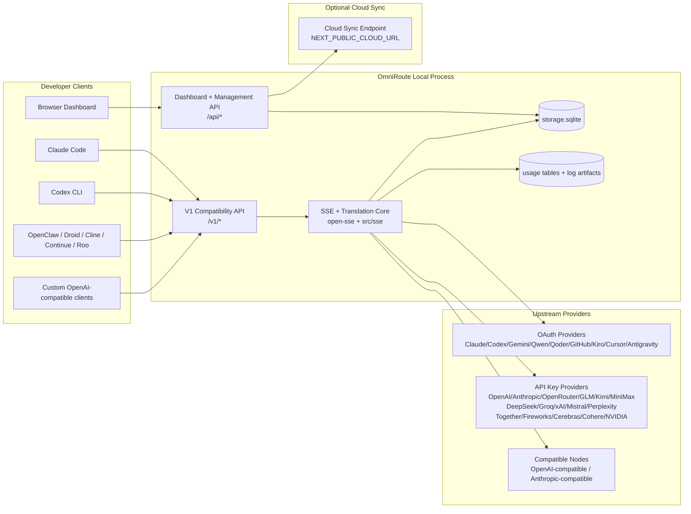
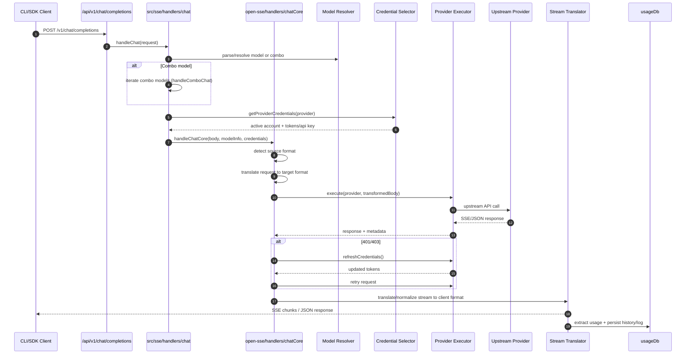
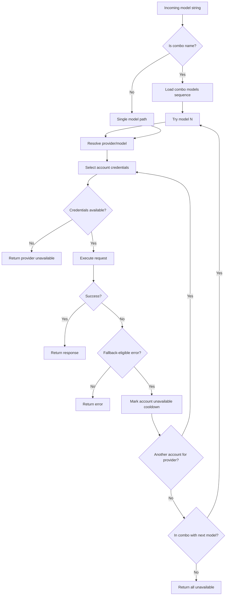
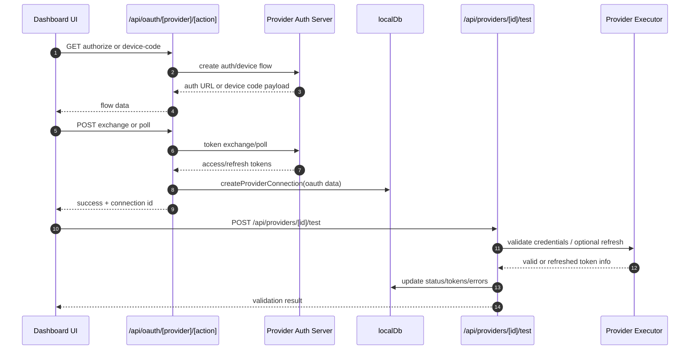
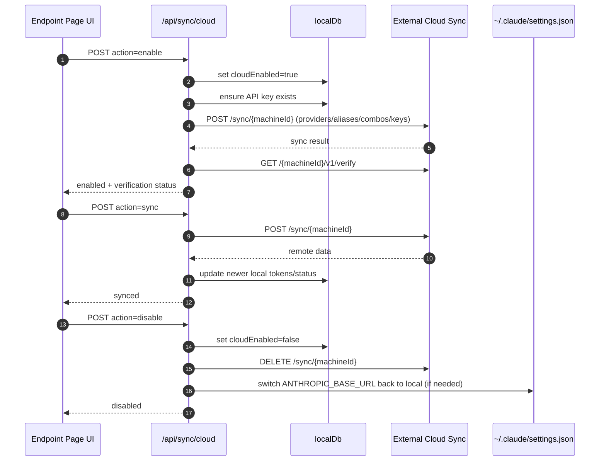
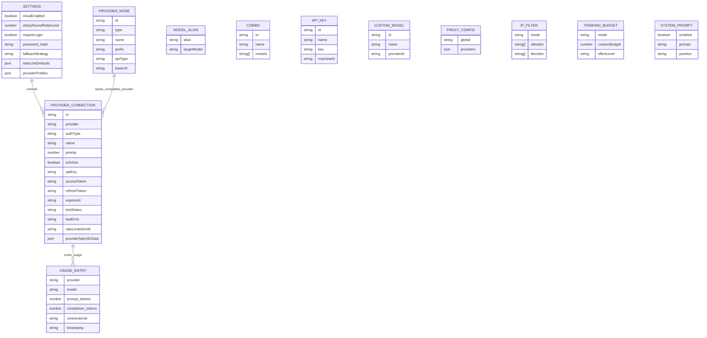
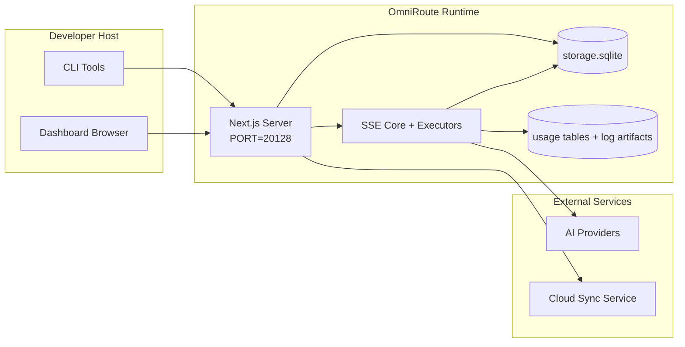

# OmniRoute Architecture (Slovenčina)

🌐 **Languages:** 🇺🇸 [English](../../../../docs/ARCHITECTURE.md) · 🇪🇸 [es](../../es/docs/ARCHITECTURE.md) · 🇫🇷 [fr](../../fr/docs/ARCHITECTURE.md) · 🇩🇪 [de](../../de/docs/ARCHITECTURE.md) · 🇮🇹 [it](../../it/docs/ARCHITECTURE.md) · 🇷🇺 [ru](../../ru/docs/ARCHITECTURE.md) · 🇨🇳 [zh-CN](../../zh-CN/docs/ARCHITECTURE.md) · 🇯🇵 [ja](../../ja/docs/ARCHITECTURE.md) · 🇰🇷 [ko](../../ko/docs/ARCHITECTURE.md) · 🇸🇦 [ar](../../ar/docs/ARCHITECTURE.md) · 🇮🇳 [hi](../../hi/docs/ARCHITECTURE.md) · 🇮🇳 [in](../../in/docs/ARCHITECTURE.md) · 🇹🇭 [th](../../th/docs/ARCHITECTURE.md) · 🇻🇳 [vi](../../vi/docs/ARCHITECTURE.md) · 🇮🇩 [id](../../id/docs/ARCHITECTURE.md) · 🇲🇾 [ms](../../ms/docs/ARCHITECTURE.md) · 🇳🇱 [nl](../../nl/docs/ARCHITECTURE.md) · 🇵🇱 [pl](../../pl/docs/ARCHITECTURE.md) · 🇸🇪 [sv](../../sv/docs/ARCHITECTURE.md) · 🇳🇴 [no](../../no/docs/ARCHITECTURE.md) · 🇩🇰 [da](../../da/docs/ARCHITECTURE.md) · 🇫🇮 [fi](../../fi/docs/ARCHITECTURE.md) · 🇵🇹 [pt](../../pt/docs/ARCHITECTURE.md) · 🇷🇴 [ro](../../ro/docs/ARCHITECTURE.md) · 🇭🇺 [hu](../../hu/docs/ARCHITECTURE.md) · 🇧🇬 [bg](../../bg/docs/ARCHITECTURE.md) · 🇸🇰 [sk](../../sk/docs/ARCHITECTURE.md) · 🇺🇦 [uk-UA](../../uk-UA/docs/ARCHITECTURE.md) · 🇮🇱 [he](../../he/docs/ARCHITECTURE.md) · 🇵🇭 [phi](../../phi/docs/ARCHITECTURE.md) · 🇧🇷 [pt-BR](../../pt-BR/docs/ARCHITECTURE.md) · 🇨🇿 [cs](../../cs/docs/ARCHITECTURE.md) · 🇹🇷 [tr](../../tr/docs/ARCHITECTURE.md)

---

_Posledná aktualizácia: 28.03.2026_## Executive Summary

OmniRoute je lokálna AI smerovacia brána a dashboard postavená na Next.js.
Poskytuje jeden koncový bod kompatibilný s OpenAI (`/v1/*`) a nasmeruje prevádzku naprieč viacerými poskytovateľmi upstream s prekladom, záložným, obnovovaním tokenov a sledovaním používania.

Základné schopnosti:

- OpenAI kompatibilný povrch API pre CLI/nástroje (28 poskytovateľov)
- Požiadavka / odpoveď na preklad medzi formátmi poskytovateľov
- Záložná kombinácia modelov (sekvencia viacerých modelov)
  – Záložný režim na úrovni účtu (viac účtov na poskytovateľa)
- Správa pripojenia poskytovateľa s kľúčom OAuth + API
- Generovanie vkladania cez `/v1/embeddings` (6 poskytovateľov, 9 modelov)
- Generovanie obrázkov prostredníctvom `/v1/images/generations` (4 poskytovatelia, 9 modelov)
- Myslite na analýzu značiek (`<think>...</think>`) pre modely uvažovania
- Dezinfekcia odozvy pre prísnu kompatibilitu OpenAI SDK
- Normalizácia rolí (vývojár→systém, systém→používateľ) pre kompatibilitu medzi poskytovateľmi
- Konverzia štruktúrovaného výstupu (json_schema → Gemini responseSchema)
- Miestna perzistencia pre poskytovateľov, kľúče, aliasy, kombá, nastavenia, ceny
- Sledovanie používania / nákladov a zaznamenávanie žiadostí
- Voliteľná cloudová synchronizácia pre synchronizáciu viacerých zariadení/stavov
- Zoznam povolených/blokovaných IP adries pre riadenie prístupu k API
- Myslenie na správu rozpočtu (priechodový/automatický/vlastný/adaptívny)
- Rýchle vstrekovanie globálneho systému
- Sledovanie relácií a snímanie odtlačkov prstov
- Rozšírené obmedzenie sadzieb na účet s profilmi špecifickými pre poskytovateľov
- Vzor ističa pre odolnosť poskytovateľa
- Ochrana stáda proti hromu s blokovaním mutex
- Cache deduplikácie požiadaviek na základe podpisu
- Doménová vrstva: dostupnosť modelu, cenové pravidlá, záložná politika, politika blokovania
- Stálosť stavu domény (vyrovnávacia pamäť SQLite pre záložné zdroje, rozpočty, blokovania, ističe)
- Modul politiky pre centralizované vyhodnocovanie požiadaviek (uzamknutie → rozpočet → záložné)
- Požiadajte o telemetriu s agregáciou latencie p50/p95/p99
- ID korelácie (X-Request-Id) pre end-to-end sledovanie
- Protokolovanie auditu súladu s odhlásením podľa kľúča API
- Hodnotný rámec pre zabezpečenie kvality LLM
- Prístrojová doska UI Resilience so stavom ističa v reálnom čase
- Modulárni poskytovatelia OAuth (12 samostatných modulov pod `src/lib/oauth/providers/`)

Primárny runtime model:

- Trasy aplikácií Next.js pod `src/app/api/*` implementujú rozhrania API dashboardu aj rozhrania API kompatibility
- Zdieľané jadro SSE/smerovanie v `src/sse/*` + `open-sse/*` sa stará o vykonávanie poskytovateľa, preklad, streamovanie, záložné zdroje a používanie## Scope and Boundaries

### In Scope

- Runtime lokálnej brány
- Rozhrania API na správu informačných panelov
- Overenie poskytovateľa a obnovenie tokenu
- Požiadajte o preklad a streamovanie SSE
- Miestny stav + pretrvávanie používania
- Voliteľná orchestrácia synchronizácie s cloudom### Out of Scope

- Implementácia cloudovej služby za `NEXT_PUBLIC_CLOUD_URL`
- Poskytovateľ SLA/riadiaca rovina mimo lokálneho procesu
- Samotné externé binárne súbory CLI (Claude CLI, Codex CLI atď.)## Dashboard Surface (Current)

Hlavné stránky pod `src/app/(dashboard)/dashboard/`:

- `/dashboard` — rýchly štart + prehľad poskytovateľa
- `/dashboard/endpoint` — proxy koncového bodu + MCP + A2A + karty koncového bodu rozhrania API
- `/dashboard/providers` – pripojenia a poverenia poskytovateľa
- `/dashboard/combos` — kombinované stratégie, šablóny, pravidlá smerovania modelov
- `/dashboard/costs` – agregácia nákladov a viditeľnosť cien
- `/dashboard/analytics` – analýzy a hodnotenia používania
- „/dashboard/limits“ – kontroly kvót/sadzieb
- `/dashboard/cli-tools` — CLI onboarding, runtime detekcia, generovanie konfigurácie
- `/dashboard/agents` — zistení agenti AKT + registrácia vlastného agenta
- `/dashboard/media` – ihrisko s obrázkami/videom/hudbou
- `/dashboard/search-tools` — testovanie a história poskytovateľa vyhľadávania
- „/dashboard/health“ – doba prevádzkyschopnosti, ističe, limity sadzieb
- `/dashboard/logs` — denníky požiadaviek/proxy/audit/konzoly
- `/dashboard/settings` — karty systémových nastavení (všeobecné, smerovanie, predvolené nastavenia komba atď.)
- `/dashboard/api-manager` — životný cyklus kľúča API a povolenia modelu## High-Level System Context



## Core Runtime Components

## 1) API and Routing Layer (Next.js App Routes)

Hlavné adresáre:

- `src/app/api/v1/*` a `src/app/api/v1beta/*` pre rozhrania API kompatibility
- `src/app/api/*` pre spravovanie/konfiguráciu API
- Ďalej prepíše mapu `next.config.mjs` `/v1/*` na `/api/v1/*`

Dôležité cesty kompatibility:

- `src/app/api/v1/chat/completions/route.ts`
- `src/app/api/v1/messages/route.ts`
- `src/app/api/v1/responses/route.ts`
- `src/app/api/v1/models/route.ts` — zahŕňa vlastné modely s `custom: true`
- `src/app/api/v1/embeddings/route.ts` — generovanie vloženia (6 poskytovateľov)
- `src/app/api/v1/images/generations/route.ts` — generovanie obrázkov (4+ poskytovatelia vrátane Antigravity/Nebius)
- `src/app/api/v1/messages/count_tokens/route.ts`
  – `src/app/api/v1/providers/[poskytovateľ]/chat/completions/route.ts` – vyhradený chat pre jednotlivých poskytovateľov
  – `src/app/api/v1/providers/[poskytovateľ]/embeddings/route.ts` – vyhradené vloženia podľa jednotlivých poskytovateľov
  – `src/app/api/v1/providers/[poskytovateľ]/images/generations/route.ts` – vyhradené obrázky podľa jednotlivých poskytovateľov
- `src/app/api/v1beta/models/route.ts`
- `src/app/api/v1beta/models/[...cesta]/route.ts`

Manažérske domény:

- Auth/settings: `src/app/api/auth/*`, `src/app/api/settings/*`
- Poskytovatelia/pripojenia: `src/app/api/providers*`
- Uzly poskytovateľa: `src/app/api/provider-nodes*`
- Vlastné modely: `src/app/api/provider-models` (GET/POST/DELETE)
- Katalóg modelov: `src/app/api/models/route.ts` (GET)
  – Konfigurácia proxy: `src/app/api/settings/proxy` (GET/PUT/DELETE) + `src/app/api/settings/proxy/test` (POST)
- OAuth: `src/app/api/oauth/*`
  – Kľúče/aliasy/kombá/cena: `src/app/api/keys*`, `src/app/api/models/alias`, `src/app/api/combos*`, `src/app/api/pricing`
- Použitie: `src/app/api/usage/*`
- Sync/cloud: `src/app/api/sync/*`, `src/app/api/cloud/*`
- Pomocníci nástrojov CLI: `src/app/api/cli-tools/*`
- IP filter: `src/app/api/settings/ip-filter` (GET/PUT)
- Thinking budget: `src/app/api/settings/thinking-budget` (GET/PUT)
- Systémová výzva: `src/app/api/settings/system-prompt` (GET/PUT)
- Relácie: `src/app/api/sessions` (GET)
- Limity sadzby: `src/app/api/rate-limits` (GET)
- Odolnosť: `src/app/api/resilience` (GET/PATCH) – profily poskytovateľa, istič, stav limitu rýchlosti
- Resetovanie odolnosti: `src/app/api/resilience/reset` (POST) — reset ističov + cooldowny
- Štatistiky vyrovnávacej pamäte: `src/app/api/cache/stats` (GET/DELETE)
- Dostupnosť modelu: `src/app/api/models/availability` (GET/POST)
  – Telemetria: `src/app/api/telemetry/summary` (GET)
  – Rozpočet: `src/app/api/usage/budget` (GET/POST)
- Záložné reťazce: `src/app/api/fallback/chains` (GET/POST/DELETE)
- Audit súladu: `src/app/api/compliance/audit-log` (GET)
- Hodnoty: `src/app/api/evals` (GET/POST), `src/app/api/evals/[suiteId]` (GET)
- Zásady: `src/app/api/policies` (GET/POST)## 2) SSE + Translation Core

Hlavné prietokové moduly:

- Záznam: `src/sse/handlers/chat.ts`
- Základná orchestrácia: `open-sse/handlers/chatCore.ts`
- Spúšťacie adaptéry poskytovateľa: `open-sse/executors/*`
- Detekcia formátu/konfigurácia poskytovateľa: `open-sse/services/provider.ts`
- Analýza/rozlíšenie modelu: `src/sse/services/model.ts`, `open-sse/services/model.ts`
- Logika záložného účtu: `open-sse/services/accountFallback.ts`
- Register prekladov: `open-sse/translator/index.ts`
- Transformácie streamu: `open-sse/utils/stream.ts`, `open-sse/utils/streamHandler.ts`
- Extrakcia/normalizácia použitia: `open-sse/utils/usageTracking.ts`
- Analyzátor značiek Think: `open-sse/utils/thinkTagParser.ts`
- Ovládač vkladania: `open-sse/handlers/embeddings.ts`
- Register poskytovateľa vkladania: `open-sse/config/embeddingRegistry.ts`
- Obslužný program generovania obrázkov: `open-sse/handlers/imageGeneration.ts`
- Register poskytovateľa obrázkov: `open-sse/config/imageRegistry.ts`
- Dezinfekcia odozvy: `open-sse/handlers/responseSanitizer.ts`
- Normalizácia rolí: `open-sse/services/roleNormalizer.ts`

Služby (obchodná logika):

- Výber účtu/bodovanie: `open-sse/services/accountSelector.ts`
- Kontextová správa životného cyklu: `open-sse/services/contextManager.ts`
- Vynútenie filtra IP: `open-sse/services/ipFilter.ts`
- Sledovanie relácií: `open-sse/services/sessionManager.ts`
- Žiadosť o deduplikáciu: `open-sse/services/signatureCache.ts`
- Vloženie systémovej výzvy: `open-sse/services/systemPrompt.ts`
- Myslenie na riadenie rozpočtu: `open-sse/services/thinkingBudget.ts`
- Smerovanie modelu so zástupnými znakmi: `open-sse/services/wildcardRouter.ts`
- Správa limitov sadzieb: `open-sse/services/rateLimitManager.ts`
- Istič: `open-sse/services/circuitBreaker.ts`

Moduly vrstvy domény:

- Dostupnosť modelu: `src/lib/domain/modelAvailability.ts`
- Cenové pravidlá/rozpočty: `src/lib/domain/costRules.ts`
- Záložná politika: `src/lib/domain/fallbackPolicy.ts`
- Kombinovaný prekladač: `src/lib/domain/comboResolver.ts`
- Zásady blokovania: `src/lib/domain/lockoutPolicy.ts`
- Modul politiky: `src/domain/policyEngine.ts` – centralizované uzamknutie → rozpočet → záložné hodnotenie
- Katalóg kódov chýb: `src/lib/domain/errorCodes.ts`
  – ID požiadavky: `src/lib/domain/requestId.ts`
- Časový limit načítania: `src/lib/domain/fetchTimeout.ts`
- Požiadať o telemetriu: `src/lib/domain/requestTelemetry.ts`
- Súlad/audit: `src/lib/domain/compliance/index.ts`
- Eval runner: `src/lib/domain/evalRunner.ts`
- Trvalosť stavu domény: `src/lib/db/domainState.ts` — SQLite CRUD pre záložné reťazce, rozpočty, históriu nákladov, stav uzamknutia, ističe

Moduly poskytovateľa OAuth (12 samostatných súborov pod `src/lib/oauth/providers/`):

- Index registra: `src/lib/oauth/providers/index.ts`
  – Jednotliví poskytovatelia: `claude.ts`, `codex.ts`, `gemini.ts`, `antigravity.ts`, `qoder.ts`, `qwen.ts`, `kimi-coding.ts`, `github.ts`, `kiro.ts`, `cursor.ts`, `kilo`coded, `kilo``
- Tenký obal: `src/lib/oauth/providers.ts` — reexporty z jednotlivých modulov## 3) Persistence Layer

Primárny stav DB (SQLite):

- Infračervené jadro: `src/lib/db/core.ts` (better-sqlite3, migrácie, WAL)
- Fasáda opätovného exportu: `src/lib/localDb.ts` (tenká vrstva kompatibility pre volajúcich)
- súbor: `${DATA_DIR}/storage.sqlite` (alebo `$XDG_CONFIG_HOME/omniroute/storage.sqlite`, ak je nastavený, inak `~/.omniroute/storage.sqlite`)
- entity (tabuľky + priestory názvov KV): providerConnections, providerNodes, modelAliases, kombá, apiKeys, nastavenia, ceny,**customModels**,**proxyConfig**,**ipFilter**,**thinkingBudget**,**systemPrompt**

Trvanlivosť pri používaní:

- fasáda: `src/lib/usageDb.ts` (rozložené moduly v `src/lib/usage/*`)
- SQLite tabuľky v `storage.sqlite`: `usage_history`, `call_logs`, `proxy_logs`
- voliteľné artefakty súboru zostávajú kvôli kompatibilite/ladeniu (`${DATA_DIR}/log.txt`, `${DATA_DIR}/call_logs/`, `<repo>/logs/...`)
- staršie súbory JSON sa migrujú na SQLite migráciami pri spustení, ak sú k dispozícii

DB stavu domény (SQLite):

- `src/lib/db/domainState.ts` — operácie CRUD pre stav domény
  – Tabuľky (vytvorené v `src/lib/db/core.ts`): `domain_fallback_chains`, `domain_budgets`, `doména_cost_history`, `domain_lockout_state`, `prerušovače_obvodu_domény`
- Vzor vyrovnávacej pamäte pre zápis: mapy v pamäti sú autoritatívne za behu; mutácie sa zapisujú synchrónne do SQLite; stav sa obnoví z DB pri studenom štarte## 4) Auth + Security Surfaces

- Overenie súboru cookie informačného panela: `src/proxy.ts`, `src/app/api/auth/login/route.ts`
- Generovanie/overenie kľúča API: `src/shared/utils/apiKey.ts`
- Tajomstvá poskytovateľa pretrvávali v záznamoch `providerConnections`
- Podpora odchádzajúceho servera proxy cez `open-sse/utils/proxyFetch.ts` (env vars) a `open-sse/utils/networkProxy.ts` (konfigurovateľné podľa jednotlivých poskytovateľov alebo globálne)## 5) Cloud Sync

- Spustenie plánovača: `src/lib/initCloudSync.ts`, `src/shared/services/initializeCloudSync.ts`, `src/shared/services/modelSyncScheduler.ts`
- Pravidelná úloha: `src/shared/services/cloudSyncScheduler.ts`
- Pravidelná úloha: `src/shared/services/modelSyncScheduler.ts`
- Riadiaca cesta: `src/app/api/sync/cloud/route.ts`## Request Lifecycle (`/v1/chat/completions`)



## Combo + Account Fallback Flow



Záložné rozhodnutia riadi `open-sse/services/accountFallback.ts` pomocou stavových kódov a heuristiky chybových správ. Kombinované smerovanie pridáva ďalšiu ochranu: 400 v rozsahu poskytovateľa, ako sú zlyhania blokovania obsahu a overovania rolí, sa považujú za lokálne zlyhania modelu, takže neskoršie kombinované ciele môžu stále bežať.## OAuth Onboarding and Token Refresh Lifecycle



Obnovenie počas živej prevádzky sa vykonáva v rámci `open-sse/handlers/chatCore.ts` prostredníctvom spúšťača `refreshCredentials()`.## Cloud Sync Lifecycle (Enable / Sync / Disable)



Pravidelnú synchronizáciu spúšťa „CloudSyncScheduler“, keď je povolený cloud.## Data Model and Storage Map



Súbory fyzického úložiska:

- primárny runtime DB: `${DATA_DIR}/storage.sqlite`
- riadky denníka žiadostí: `${DATA_DIR}/log.txt` (artefakt compat/debug)
- archívy štruktúrovaného obsahu hovorov: `${DATA_DIR}/call_logs/`
- voliteľné relácie ladenia prekladača/požiadavky: `<repo>/logs/...`## Deployment Topology



## Module Mapping (Decision-Critical)

### Route and API Modules

- `src/app/api/v1/*`, `src/app/api/v1beta/*`: rozhrania API pre kompatibilitu
- `src/app/api/v1/providers/[poskytovateľ]/*`: vyhradené trasy pre jednotlivých poskytovateľov (chat, vkladanie, obrázky)
- `src/app/api/providers*`: poskytovateľ CRUD, validácia, testovanie
- `src/app/api/provider-nodes*`: vlastná správa kompatibilných uzlov
- `src/app/api/provider-models`: správa vlastných modelov (CRUD)
- `src/app/api/models/route.ts`: API katalógu modelov (aliasy + vlastné modely)
- `src/app/api/oauth/*`: toky OAuth/kódu zariadenia
- `src/app/api/keys*`: životný cyklus lokálneho kľúča API
- `src/app/api/models/alias`: správa aliasov
- `src/app/api/combos*`: správa náhradných kombinácií
- `src/app/api/pricing`: prepíše ceny pre výpočet nákladov
- `src/app/api/settings/proxy`: konfigurácia proxy (GET/PUT/DELETE)
- `src/app/api/settings/proxy/test`: test externej konektivity (POST)
- `src/app/api/usage/*`: využitie a protokoly API
- `src/app/api/sync/*` + `src/app/api/cloud/*`: synchronizácia v cloude a pomocníci pre cloud
- `src/app/api/cli-tools/*`: miestne zapisovače/kontroly konfigurácie CLI
- `src/app/api/settings/ip-filter`: zoznam povolených adries IP/zoznam blokovaných adries (GET/PUT)
- `src/app/api/settings/thinking-budget`: konfigurácia rozpočtu tokenu myslenia (GET/PUT)
- `src/app/api/settings/system-prompt`: globálna systémová výzva (GET/PUT)
- `src/app/api/sessions`: zoznam aktívnych relácií (GET)
- `src/app/api/rate-limits`: stav limitu sadzby na účet (GET)### Routing and Execution Core

- `src/sse/handlers/chat.ts`: analýza požiadaviek, spracovanie komb, slučka výberu účtu
- `open-sse/handlers/chatCore.ts`: preklad, odoslanie vykonávateľa, spracovanie opakovania/obnovenia, nastavenie streamu
- `open-sse/executors/*`: správanie siete a formátu špecifické pre poskytovateľa### Translation Registry and Format Converters

- `open-sse/translator/index.ts`: register a orchestrácia prekladateľov
- Žiadosť o prekladateľov: `open-sse/translator/request/*`
- Prekladače odpovedí: `open-sse/translator/response/*`
- Formátové konštanty: `open-sse/translator/formats.ts`### Persistence

- `src/lib/db/*`: trvalá konfigurácia/stav a trvalosť domény na SQLite
- `src/lib/localDb.ts`: reexport kompatibility pre DB moduly
- `src/lib/usageDb.ts`: fasáda histórie používania/protokolov hovorov nad tabuľkami SQLite## Provider Executor Coverage (Strategy Pattern)

Každý poskytovateľ má špecializovaný spúšťač rozširujúci `BaseExecutor` (v `open-sse/executors/base.ts`), ktorý poskytuje vytváranie adries URL, konštrukciu hlavičiek, opakovanie s exponenciálnym stiahnutím, háčiky na obnovenie poverení a metódu orchestrácie `execute()`.

| Exekútor              | Poskytovatelia                                                                                                                                               | Špeciálna manipulácia                                                          |
| --------------------- | ------------------------------------------------------------------------------------------------------------------------------------------------------------ | ------------------------------------------------------------------------------ |
| "DefaultExecutor"     | OpenAI, Claude, Gemini, Qwen, Qoder, OpenRouter, GLM, Kimi, MiniMax, DeepSeek, Groq, xAI, Mistral, Perplexity, Together, Fireworks, Cerebras, Cohere, NVIDIA | Konfigurácia dynamickej adresy URL/hlavičky podľa poskytovateľa                |
| "AntigravityExecutor" | Google Antigravity                                                                                                                                           | Vlastné ID projektu/relácie, Opakovať po analýze                               |
| "CodexExecutor"       | Kódex OpenAI                                                                                                                                                 | Vkladá pokyny systému, vynucuje úsilie na uvažovanie                           |
| "CursorExecutor"      | Kurzor IDE                                                                                                                                                   | Protokol ConnectRPC, kódovanie Protobuf, podpis požiadavky cez kontrolný súčet |
| "GithubExecutor"      | GitHub Copilot                                                                                                                                               | Obnovenie tokenu kopilota, hlavičky napodobňujúce VSCode                       |
| "KiroExecutor"        | AWS CodeWhisperer/Kiro                                                                                                                                       | Binárny formát AWS EventStream → Konverzia SSE                                 |
| "GeminiCLIExecutor"   | Gemini CLI                                                                                                                                                   | Cyklus obnovenia tokenu Google OAuth                                           |

Všetci ostatní poskytovatelia (vrátane vlastných kompatibilných uzlov) používajú `DefaultExecutor`.## Provider Compatibility Matrix

| Poskytovateľ     | Formát           | Auth                    | Stream               | Nestreamovať | Obnovenie tokenu | Použitie API        |
| ---------------- | ---------------- | ----------------------- | -------------------- | ------------ | ---------------- | ------------------- | ------------------------------ |
| Claude           | claude           | Kľúč API / OAuth        | ✅                   | ✅           | ✅               | ⚠️ Len správca      |
| Blíženci         | Blíženci         | Kľúč API / OAuth        | ✅                   | ✅           | ✅               | ⚠️ Cloudová konzola |
| Gemini CLI       | gemini-cli       | OAuth                   | ✅                   | ✅           | ✅               | ⚠️ Cloudová konzola |
| Antigravitácia   | antigravitácia   | OAuth                   | ✅                   | ✅           | ✅               | ✅ Plná kvóta API   |
| OpenAI           | openai           | API kľúč                | ✅                   | ✅           | ❌               | ❌                  |
| Kódex            | openai-responses | OAuth                   | ✅ nútený            | ❌           | ✅               | ✅ Sadzobné limity  |
| GitHub Copilot   | openai           | OAuth + token Copilot   | ✅                   | ✅           | ✅               | ✅ Snímky kvóty     |
| Kurzor           | kurzor           | Vlastný kontrolný súčet | ✅                   | ✅           | ❌               | ❌                  |
| Kiro             | kiro             | AWS SSO OIDC            | ✅ (Stream udalostí) | ❌           | ✅               | ✅ Limity použitia  |
| Qwen             | openai           | OAuth                   | ✅                   | ✅           | ✅               | ⚠️ Na požiadanie    |
| Qoder            | openai           | OAuth (základné)        | ✅                   | ✅           | ✅               | ⚠️ Na požiadanie    |
| OpenRouter       | openai           | API kľúč                | ✅                   | ✅           | ❌               | ❌                  |
| GLM/Kimi/MiniMax | claude           | API kľúč                | ✅                   | ✅           | ❌               | ❌                  |
| DeepSeek         | openai           | API kľúč                | ✅                   | ✅           | ❌               | ❌                  |
| Groq             | openai           | API kľúč                | ✅                   | ✅           | ❌               | ❌                  |
| xAI (Grok)       | openai           | API kľúč                | ✅                   | ✅           | ❌               | ❌                  |
| Mistral          | openai           | API kľúč                | ✅                   | ✅           | ❌               | ❌                  |
| Zmätok           | openai           | API kľúč                | ✅                   | ✅           | ❌               | ❌                  |
| Spolu AI         | openai           | API kľúč                | ✅                   | ✅           | ❌               | ❌                  |
| Ohňostroje AI    | openai           | API kľúč                | ✅                   | ✅           | ❌               | ❌                  |
| Cerebras         | openai           | API kľúč                | ✅                   | ✅           | ❌               | ❌                  |
| Cohere           | openai           | API kľúč                | ✅                   | ✅           | ❌               | ❌                  |
| NVIDIA NIM       | openai           | API kľúč                | ✅                   | ✅           | ❌               | ❌                  | ## Format Translation Coverage |

Medzi zistené zdrojové formáty patria:

- "openai".
- "openai-odpovede".
- "claude".
- "blíženec".

Cieľové formáty zahŕňajú:

- OpenAI chat/reakcie
- Claude
- Gemini/Gemini-CLI/Antigravitačná obálka
- Kiro
- Kurzor

Preklady používajú**OpenAI ako formát centra**— všetky konverzie prechádzajú cez OpenAI ako medziprodukt:```
Source Format → OpenAI (hub) → Target Format

````

Preklady sa vyberajú dynamicky na základe tvaru zdroja a cieľového formátu poskytovateľa.

Ďalšie vrstvy spracovania v reťazci prekladu:

–**Dezinfekcia odpovedí**– Odstráni neštandardné polia z odpovedí vo formáte OpenAI (streamovaných aj nestreamovaných), aby sa zabezpečil prísny súlad so súpravou SDK
-**Normalizácia rolí**– Konvertuje „vývojár“ → „systém“ pre ciele, ktoré nie sú OpenAI; zlučuje „systém“ → „používateľ“ pre modely, ktoré odmietajú systémovú rolu (GLM, ERNIE)
–**Think tagextrakcia**– analyzuje bloky „<think>...</think>“ z obsahu do poľa „reasoning_content“
–**Štruktúrovaný výstup**– Konvertuje OpenAI `response_format.json_schema` na Gemini `responseMimeType` + `responseSchema`## Supported API Endpoints

| Koncový bod | Formát | Psovod |
| --------------------------------------------------- | ------------------- | -------------------------------------------------------------------- |
| `POST /v1/chat/completions` | OpenAI Chat | `src/sse/handlers/chat.ts` |
| `POST /v1/messages` | Claude Správy | Rovnaký handler (automaticky detekovaný) |
| `POST /v1/responses` | Odpovede OpenAI | `open-sse/handlers/responsesHandler.ts` |
| `POST /v1/embeddings` | OpenAI Embeddings | `open-sse/handlers/embeddings.ts` |
| "GET /v1/embeddings" | Zoznam modelov | Cesta API |
| `POST /v1/images/generations` | Obrázky OpenAI | `open-sse/handlers/imageGeneration.ts` |
| "GET /v1/images/generations" | Zoznam modelov | Cesta API |
| `POST /v1/providers/{poskytovateľ}/chat/completions` | OpenAI Chat | Vyhradené pre každého poskytovateľa s overením modelu |
| `POST /v1/providers/{provider}/embeddings` | OpenAI Embeddings | Vyhradené pre každého poskytovateľa s overením modelu |
| `POST /v1/providers/{poskytovateľ}/images/generations` | Obrázky OpenAI | Vyhradené pre každého poskytovateľa s overením modelu |
| `POST /v1/messages/count_tokens` | Počet tokenov Claude | Cesta API |
| "GET /v1/models" | Zoznam modelov OpenAI | Cesta API (chat + vkladanie + obrázok + vlastné modely) |
| "GET /api/models/catalog" | Katalóg | Všetky modely zoskupené podľa poskytovateľa + typ |
| `POST /v1beta/models/*:streamGenerateContent` | Rodák Blíženci | Cesta API |
| "GET/PUT/DELETE /api/settings/proxy" | Konfigurácia proxy | Konfigurácia sieťového proxy |
| `POST /api/settings/proxy/test` | Pripojenie proxy | Koncový bod testu stavu proxy/konektivity |
| "ZÍSKAŤ/POST/DELETE /api/modely poskytovateľa" | Modely poskytovateľov | Vlastné a spravované dostupné modely podporujúce metadáta modelu poskytovateľa |## Bypass Handler

Obídený obslužný program (`open-sse/utils/bypassHandler.ts`) zachytí známe požiadavky na „zahodenie“ z Claude CLI – zahrievacie pingy, extrakcie titulov a počty tokenov – a vráti**falošnú odpoveď**bez spotrebovania tokenov poskytovateľa upstream. Toto sa spustí iba vtedy, keď „User-Agent“ obsahuje „claude-cli“.## Request Logger Pipeline

Záznamník požiadaviek (`open-sse/utils/requestLogger.ts`) poskytuje 7-stupňový kanál na zaznamenávanie ladenia, ktorý je predvolene vypnutý, povolený cez `ENABLE_REQUEST_LOGS=true`:```
1_req_client.json → 2_req_source.json → 3_req_openai.json → 4_req_target.json
→ 5_res_provider.txt → 6_res_openai.txt → 7_res_client.txt
````

Súbory sa zapisujú do `<repo>/logs/<session>/` pre každú reláciu požiadavky.## Failure Modes and Resilience

## 1) Account/Provider Availability

- Ochladenie účtu poskytovateľa pri prechodných chybách/chybách rýchlosti/autorizácie
- záložný účet pred neúspešnou žiadosťou
- záložný kombinovaný model, keď je vyčerpaná aktuálna cesta modelu/poskytovateľa## 2) Token Expiry

- predbežná kontrola a obnovenie s opätovným pokusom pre poskytovateľov obnoviteľných zdrojov
- 401/403 zopakovanie po pokuse o obnovenie v základnej ceste## 3) Stream Safety

- regulátor prúdu s vedomím odpojenia
- prekladový tok s vyprázdnením konca toku a spracovaním `[DONE]`
- záložný odhad použitia, keď chýbajú metadáta používania poskytovateľa## 4) Cloud Sync Degradation

- Objavia sa chyby synchronizácie, ale lokálny runtime pokračuje
- plánovač má logiku schopnú opakovania, ale pravidelné vykonávanie v súčasnosti štandardne volá synchronizáciu na jeden pokus## 5) Data Integrity

- Migrácie schém SQLite a automatické aktualizácie pri spustení
- staršia cesta kompatibility migrácie JSON → SQLite## Observability and Operational Signals

Zdroje viditeľnosti pri spustení:

- protokoly konzoly z `src/sse/utils/logger.ts`
- agregáty využitia na požiadanie v SQLite (`usage_history`, `call_logs`, `proxy_logs`)
- štvorstupňové podrobné zachytávanie užitočného zaťaženia v SQLite (`request_detail_logs`), keď je `settings.detailed_logs_enabled=true`
- textový denník stavu požiadavky v `log.txt` (voliteľné/kompatibilné)
- voliteľné hĺbkové protokoly požiadaviek/prekladov pod `logs/`, keď `ENABLE_REQUEST_LOGS=true`
- koncové body používania dashboardu (`/api/usage/*`) pre spotrebu používateľského rozhrania

Podrobné zachytenie dátovej časti požiadavky ukladá až štyri fázy užitočného zaťaženia JSON na jeden smerovaný hovor:

- nespracovaná požiadavka prijatá od klienta
- preložená žiadosť skutočne odoslaná proti prúdu
- odpoveď poskytovateľa zrekonštruovaná ako JSON; streamované odpovede sú zhutnené do konečného súhrnu plus stream metadát
- konečná odpoveď klienta vrátená OmniRoute; streamované odpovede sú uložené v rovnakom kompaktnom súhrnnom formulári## Security-Sensitive Boundaries

- Tajný kľúč JWT (`JWT_SECRET`) zabezpečuje overenie/podpísanie súboru cookie relácie dashboardu
- Zavedenie počiatočného hesla (`INITIAL_PASSWORD`) by malo byť explicitne nakonfigurované na poskytovanie pri prvom spustení
- Tajný kľúč API HMAC (`API_KEY_SECRET`) zabezpečuje vygenerovaný lokálny formát kľúča API
- Tajomstvá poskytovateľa (kľúče/tokeny API) sú uložené v lokálnej databáze a mali by byť chránené na úrovni súborového systému
- Koncové body cloudovej synchronizácie sa spoliehajú na sémantiku kľúča API + ID stroja## Environment and Runtime Matrix

Premenné prostredia aktívne používané kódom:

- Aplikácia/autorizácia: `JWT_SECRET`, `INITIAL_PASSWORD`
- Úložisko: `DATA_DIR`
- Kompatibilné správanie uzla: `ALLOW_MULTI_CONNECTIONS_PER_COMPAT_NODE`
- Voliteľné prepísanie základne úložiska (Linux/macOS, keď nie je nastavený `DATA_DIR`): `XDG_CONFIG_HOME`
  – Hašovanie zabezpečenia: `API_KEY_SECRET`, `MACHINE_ID_SALT`
  – Protokolovanie: „ENABLE_REQUEST_LOGS“.
  – Synchronizácia/cloudové URL: `NEXT_PUBLIC_BASE_URL`, `NEXT_PUBLIC_CLOUD_URL`
  – Outbound proxy: `HTTP_PROXY`, `HTTPS_PROXY`, `ALL_PROXY`, `NO_PROXY` a varianty s malými písmenami
- Príznaky funkcie SOCKS5: `ENABLE_SOCKS5_PROXY`, `NEXT_PUBLIC_ENABLE_SOCKS5_PROXY`
- Pomocníci platformy/behu (nie konfigurácia špecifická pre aplikáciu): `APPDATA`, `NODE_ENV`, `PORT`, `HOSTNAME`## Known Architectural Notes

1. `usageDb` a `localDb` zdieľajú rovnakú politiku základného adresára (`DATA_DIR` -> `XDG_CONFIG_HOME/omniroute` -> `~/.omniroute`) s migráciou starších súborov.
2. `/api/v1/route.ts` deleguje rovnakého tvorcu jednotného katalógu, ktorý používa `/api/v1/models` (`src/app/api/v1/models/catalog.ts`), aby sa predišlo sémantickému posunu.
3. Požiadavka zapisovača zapíše úplné hlavičky/telo, keď je povolené; považovať adresár denníka za citlivý.
4. Správanie cloudu závisí od správnej adresy URL NEXT_PUBLIC_BASE_URL a od dostupnosti koncového bodu cloudu.
5. Adresár `open-sse/` je publikovaný ako balík pracovného priestoru `@omniroute/open-sse`**npm**. Zdrojový kód ho importuje cez `@omniroute/open-sse/...` (vyriešené Next.js `transpilePackages`). Cesty k súborom v tomto dokumente stále používajú názov adresára `open-sse/` kvôli konzistencii.
6. Grafy na ovládacom paneli používajú**Recharts**(založené na SVG) na prístupné interaktívne analytické vizualizácie (stĺpcové grafy používania modelov, tabuľky rozdelenia poskytovateľov s mierou úspešnosti).
7. E2E testy používajú**Playwright**(`tests/e2e/`), spúšťajú sa cez `npm run test:e2e`. Jednotkové testy používajú**Node.js test runner**(`tests/unit/`), spúšťajú sa cez `npm run test:unit`. Zdrojový kód pod `src/` je**TypeScript**(`.ts`/`.tsx`); pracovný priestor `open-sse/` zostáva JavaScript (`.js`).
8. Stránka s nastaveniami je usporiadaná do 5 záložiek: Zabezpečenie, Smerovanie (6 globálnych stratégií: fill-first, round-robin, p2c, náhodné, najmenej používané, nákladovo optimalizované), Resilience (upraviteľné limity sadzieb, istič, politiky), AI (rozpočet na myslenie, systémová výzva, prompt cache), Advanced (proxy).## Operational Verification Checklist

- Zostavte zo zdroja: `npm run build`
- Vytvorenie obrazu Docker: `docker build -t omniroute .`
- Spustite službu a overte:
- "ZÍSKAJTE /api/nastavenia".
- `ZÍSKAJTE /api/v1/models`
- Základná adresa URL cieľového CLI by mala byť `http://<hostiteľ>:20128/v1`, keď `PORT=20128`
