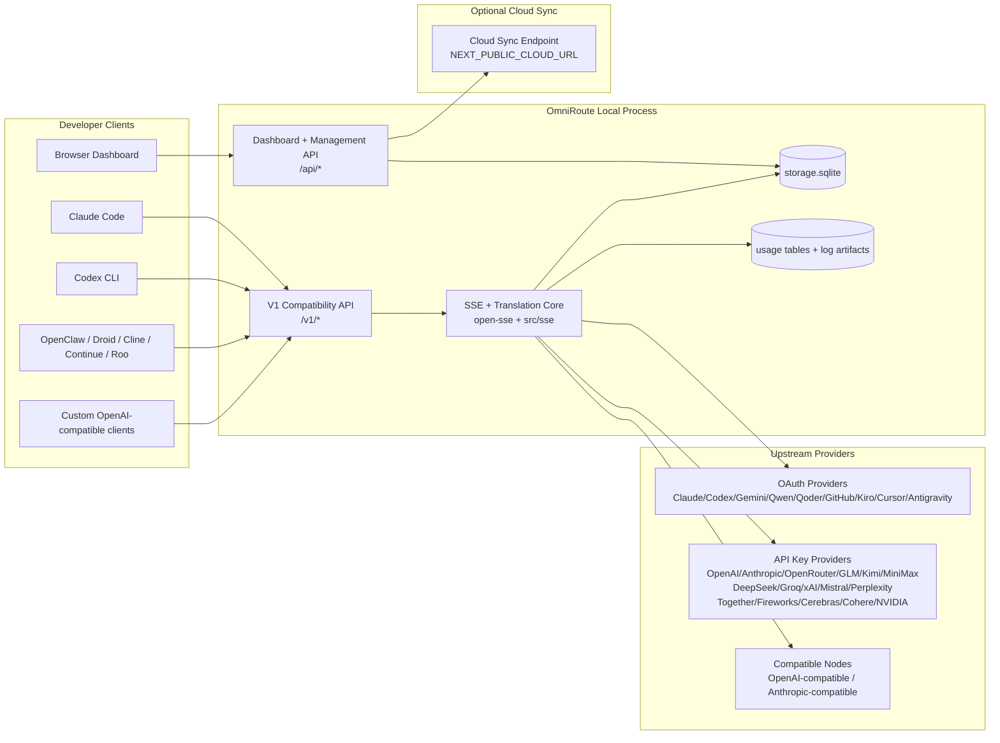
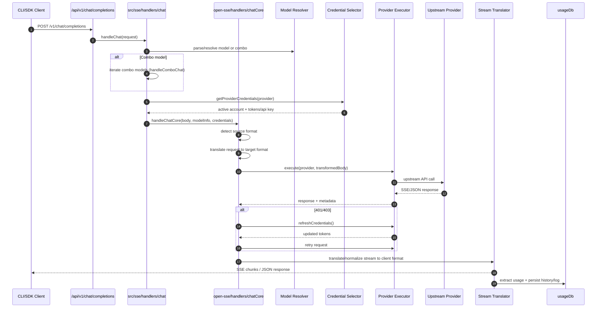
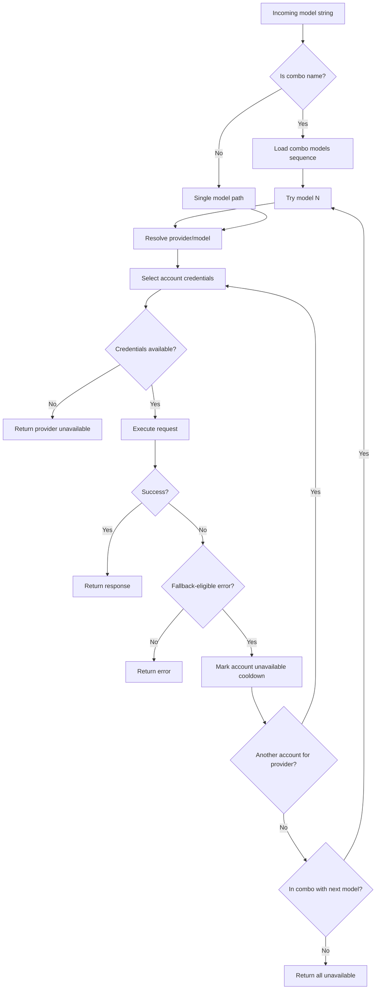
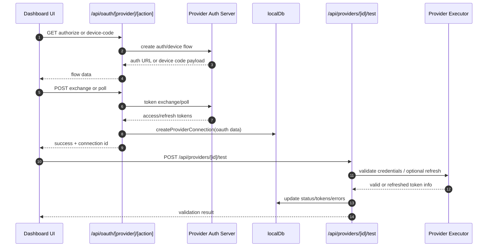
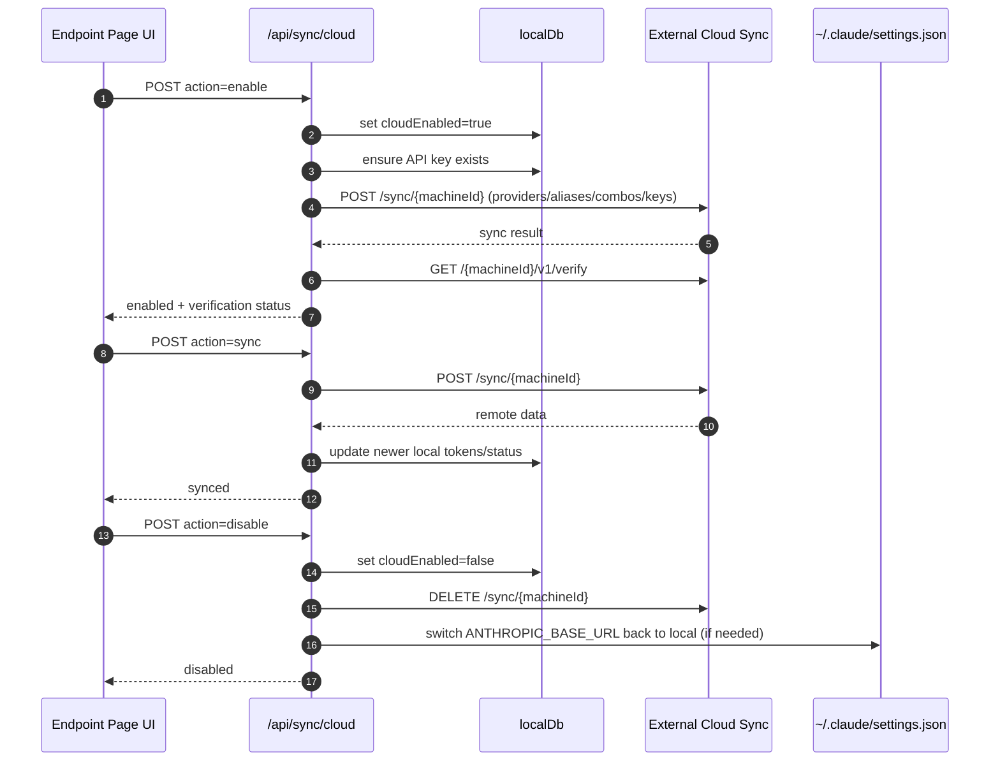
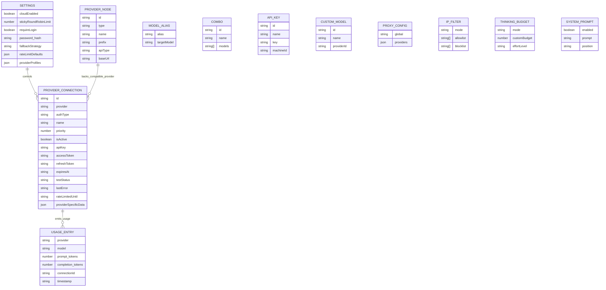
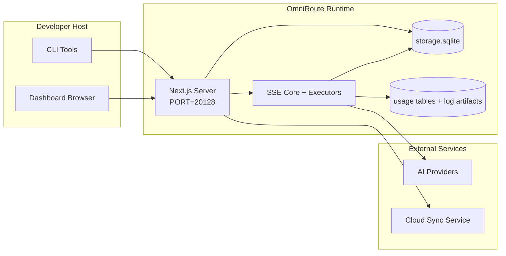

# OmniRoute Architecture (Svenska)

🌐 **Languages:** 🇺🇸 [English](../../../../docs/ARCHITECTURE.md) · 🇪🇸 [es](../../es/docs/ARCHITECTURE.md) · 🇫🇷 [fr](../../fr/docs/ARCHITECTURE.md) · 🇩🇪 [de](../../de/docs/ARCHITECTURE.md) · 🇮🇹 [it](../../it/docs/ARCHITECTURE.md) · 🇷🇺 [ru](../../ru/docs/ARCHITECTURE.md) · 🇨🇳 [zh-CN](../../zh-CN/docs/ARCHITECTURE.md) · 🇯🇵 [ja](../../ja/docs/ARCHITECTURE.md) · 🇰🇷 [ko](../../ko/docs/ARCHITECTURE.md) · 🇸🇦 [ar](../../ar/docs/ARCHITECTURE.md) · 🇮🇳 [hi](../../hi/docs/ARCHITECTURE.md) · 🇮🇳 [in](../../in/docs/ARCHITECTURE.md) · 🇹🇭 [th](../../th/docs/ARCHITECTURE.md) · 🇻🇳 [vi](../../vi/docs/ARCHITECTURE.md) · 🇮🇩 [id](../../id/docs/ARCHITECTURE.md) · 🇲🇾 [ms](../../ms/docs/ARCHITECTURE.md) · 🇳🇱 [nl](../../nl/docs/ARCHITECTURE.md) · 🇵🇱 [pl](../../pl/docs/ARCHITECTURE.md) · 🇸🇪 [sv](../../sv/docs/ARCHITECTURE.md) · 🇳🇴 [no](../../no/docs/ARCHITECTURE.md) · 🇩🇰 [da](../../da/docs/ARCHITECTURE.md) · 🇫🇮 [fi](../../fi/docs/ARCHITECTURE.md) · 🇵🇹 [pt](../../pt/docs/ARCHITECTURE.md) · 🇷🇴 [ro](../../ro/docs/ARCHITECTURE.md) · 🇭🇺 [hu](../../hu/docs/ARCHITECTURE.md) · 🇧🇬 [bg](../../bg/docs/ARCHITECTURE.md) · 🇸🇰 [sk](../../sk/docs/ARCHITECTURE.md) · 🇺🇦 [uk-UA](../../uk-UA/docs/ARCHITECTURE.md) · 🇮🇱 [he](../../he/docs/ARCHITECTURE.md) · 🇵🇭 [phi](../../phi/docs/ARCHITECTURE.md) · 🇧🇷 [pt-BR](../../pt-BR/docs/ARCHITECTURE.md) · 🇨🇿 [cs](../../cs/docs/ARCHITECTURE.md) · 🇹🇷 [tr](../../tr/docs/ARCHITECTURE.md)

---

_Senast uppdaterad: 2026-03-28_## Executive Summary

OmniRoute är en lokal AI-routinggateway och instrumentpanel byggd på Next.js.
Den tillhandahåller en enda OpenAI-kompatibel slutpunkt (`/v1/*`) och dirigerar trafik över flera uppströmsleverantörer med översättning, reserv, tokenuppdatering och användningsspårning.

Kärnfunktioner:

- OpenAI-kompatibel API-yta för CLI/verktyg (28 leverantörer)
- Begäran/svar översättning över leverantörsformat
- Modellkombination fallback (multi-modell sekvens)
- Reservkonto på kontonivå (flera konto per leverantör)
- Anslutningshantering för OAuth + API-nyckelleverantör
- Inbäddningsgenerering via `/v1/embeddings` (6 leverantörer, 9 modeller)
- Bildgenerering via `/v1/images/generations` (4 leverantörer, 9 modeller)
- Tänk taggparsning (`<think>...</think>`) för resonemangsmodeller
- Svarssanering för strikt OpenAI SDK-kompatibilitet
- Rollnormalisering (utvecklare→system, system→användare) för kompatibilitet mellan olika leverantörer
- Strukturerad utdatakonvertering (json_schema → Gemini responseSchema)
- Lokal beständighet för leverantörer, nycklar, alias, kombinationer, inställningar, prissättning
- Användnings-/kostnadsspårning och förfrågningsloggning
- Valfri molnsynkronisering för synkronisering av flera enheter/tillstånd
- IP-tillståndslista/blockeringslista för API-åtkomstkontroll
- Tänkande budgethantering (genomföring/auto/custom/adaptiv)
- Global systemprompt injektion
- Sessionsspårning och fingeravtryck
- Förbättrad prisbegränsning per konto med leverantörsspecifika profiler
- Strömbrytarmönster för leverantörens motståndskraft
- Åskskyddande flockskydd med mutex-låsning
- Signaturbaserad cache för begärandeduplicering
- Domänlager: modelltillgänglighet, kostnadsregler, reservpolicy, lockoutpolicy
- Beständig domäntillstånd (SQLite-genomskrivningscache för reservdelar, budgetar, lockouter, strömbrytare)
- Policymotor för centraliserad förfrågningsutvärdering (lockout → budget → reserv)
- Begär telemetri med p50/p95/p99 latensaggregation
- Korrelations-ID (X-Request-Id) för spårning från början till slut
- Loggning av efterlevnadsrevision med opt-out per API-nyckel
- Utvärderingsramverk för LLM kvalitetssäkring
- Resilience UI-instrumentpanel med strömbrytarstatus i realtid
- Modulära OAuth-leverantörer (12 individuella moduler under `src/lib/oauth/providers/`)

Primär körtidsmodell:

- Next.js-apprutter under `src/app/api/*` implementerar både instrumentpanels-API:er och kompatibilitets-API:er
- En delad SSE/routing-kärna i `src/sse/*` + `open-sse/*` hanterar leverantörsexekvering, översättning, streaming, reserv och användning## Scope and Boundaries

### In Scope

- Lokal gateway körtid
- Dashboard management API:er
- Leverantörsautentisering och tokenuppdatering
- Begär översättning och SSE-streaming
- Lokal stat + användningsbeständighet
- Valfri molnsynkroniseringsorkestrering### Out of Scope

- Implementering av molntjänster bakom `NEXT_PUBLIC_CLOUD_URL`
- Leverantör SLA/kontrollplan utanför lokal process
- Externa CLI-binärer själva (Claude CLI, Codex CLI, etc.)## Dashboard Surface (Current)

Huvudsidor under `src/app/(dashboard)/dashboard/`:

- `/dashboard` — snabbstart + leverantörsöversikt
- `/dashboard/endpoint` — endpoint proxy + MCP + A2A + API endpoint tabs
- `/dashboard/providers` — leverantörsanslutningar och referenser
- `/dashboard/combos` — kombinationsstrategier, mallar, regler för modelldirigering
- `/dashboard/costs` — kostnadsaggregation och prissättningssynlighet
- `/dashboard/analytics` — användningsanalyser och utvärderingar
- `/dashboard/limits` — kvot-/kurskontroller
- `/dashboard/cli-tools` — CLI onboarding, runtime detection, config generation
- `/dashboard/agents` — upptäckta ACP-agenter + anpassad agentregistrering
- `/dashboard/media` — bild/video/musiklekplats
- `/dashboard/search-tools` — testning av sökleverantörer och historik
- `/dashboard/health` — drifttid, strömbrytare, hastighetsgränser
- `/dashboard/logs` — request/proxy/audit/console logs
- `/dashboard/inställningar` — systeminställningar flikar (allmänt, routing, kombinationsstandarder, etc.)
- `/dashboard/api-manager` — API-nyckellivscykel och modellbehörigheter## High-Level System Context



## Core Runtime Components

## 1) API and Routing Layer (Next.js App Routes)

Huvudkataloger:

- `src/app/api/v1/*` och `src/app/api/v1beta/*` för kompatibilitets-API:er
- `src/app/api/*` för hanterings-/konfigurations-API:er
- Nästa omskrivning i `next.config.mjs` map `/v1/*` till `/api/v1/*`

Viktiga kompatibilitetsvägar:

- `src/app/api/v1/chat/completions/route.ts`
- `src/app/api/v1/messages/route.ts`
- `src/app/api/v1/responses/route.ts`
- `src/app/api/v1/models/route.ts` – inkluderar anpassade modeller med `custom: true`
- `src/app/api/v1/embeddings/route.ts` — inbäddningsgenerering (6 leverantörer)
- `src/app/api/v1/images/generations/route.ts` — bildgenerering (4+ leverantörer inkl. Antigravity/Nebius)
- `src/app/api/v1/messages/count_tokens/route.ts`
- `src/app/api/v1/providers/[provider]/chat/completions/route.ts` — dedikerad chatt per leverantör
- `src/app/api/v1/providers/[provider]/embeddings/route.ts` — dedikerade inbäddningar per leverantör
- `src/app/api/v1/providers/[provider]/images/generations/route.ts` — dedikerade bilder per leverantör
- `src/app/api/v1beta/models/route.ts`
- `src/app/api/v1beta/models/[...path]/route.ts`

Hanteringsdomäner:

- Auth/inställningar: `src/app/api/auth/*`, `src/app/api/settings/*`
- Leverantörer/anslutningar: `src/app/api/providers*`
- Leverantörsnoder: `src/app/api/provider-nodes*`
- Anpassade modeller: `src/app/api/provider-models` (GET/POST/DELETE)
- Modellkatalog: `src/app/api/models/route.ts` (GET)
- Proxykonfiguration: `src/app/api/settings/proxy` (GET/PUT/DELETE) + `src/app/api/settings/proxy/test` (POST)
- OAuth: `src/app/api/oauth/*`
- Nycklar/alias/combos/pricing: `src/app/api/keys*`, `src/app/api/models/alias`, `src/app/api/combos*`, `src/app/api/pricing`
- Användning: `src/app/api/usage/*`
- Sync/cloud: `src/app/api/sync/*`, `src/app/api/cloud/*`
- CLI-verktygshjälpare: `src/app/api/cli-tools/*`
- IP-filter: `src/app/api/settings/ip-filter` (GET/PUT)
- Tänkande budget: `src/app/api/settings/thinking-budget` (GET/PUT)
- Systemprompt: `src/app/api/settings/system-prompt` (GET/PUT)
- Sessioner: `src/app/api/sessions` (GET)
- Prisgränser: `src/app/api/rate-limits` (GET)
- Motståndskraft: `src/app/api/resilience` (GET/PATCH) — leverantörsprofiler, strömbrytare, hastighetsgränstillstånd
- Resilience reset: `src/app/api/resilience/reset` (POST) — återställningsbrytare + nedkylningar
- Cachestatistik: `src/app/api/cache/stats` (GET/DELETE)
- Modelltillgänglighet: `src/app/api/models/availability` (GET/POST)
- Telemetri: `src/app/api/telemetry/summary` (GET)
- Budget: `src/app/api/usage/budget` (GET/POST)
- Reservkedjor: `src/app/api/fallback/chains` (GET/POST/DELETE)
- Efterlevnadsgranskning: `src/app/api/compliance/audit-log` (GET)
- Evals: `src/app/api/evals` (GET/POST), `src/app/api/evals/[suiteId]` (GET)
- Policyer: `src/app/api/policies` (GET/POST)## 2) SSE + Translation Core

Huvudflödesmoduler:

- Post: `src/sse/handlers/chat.ts`
- Kärnorkestrering: `open-sse/handlers/chatCore.ts`
- Providers exekveringsadaptrar: `open-sse/executors/*`
- Formatdetektion/leverantörskonfiguration: `open-sse/services/provider.ts`
- Model parse/resolve: `src/sse/services/model.ts`, `open-sse/services/model.ts`
- Konto reservlogik: `open-sse/services/accountFallback.ts`
- Översättningsregister: `open-sse/translator/index.ts`
- Strömtransformationer: `open-sse/utils/stream.ts`, `open-sse/utils/streamHandler.ts`
- Användningsextraktion/normalisering: `open-sse/utils/usageTracking.ts`
- Tänk taggparser: `open-sse/utils/thinkTagParser.ts`
- Inbäddningshanterare: `open-sse/handlers/embeddings.ts`
- Inbäddningsleverantörsregister: `open-sse/config/embeddingRegistry.ts`
- Hanterare för bildgenerering: `open-sse/handlers/imageGeneration.ts`
- Bildleverantörsregister: `open-sse/config/imageRegistry.ts`
- Sanering av svar: `open-sse/handlers/responseSanitizer.ts`
- Rollnormalisering: `open-sse/services/roleNormalizer.ts`

Tjänster (affärslogik):

- Kontoval/poängsättning: `open-sse/services/accountSelector.ts`
- Kontextlivscykelhantering: `open-sse/services/contextManager.ts`
- Genomförande av IP-filter: `open-sse/services/ipFilter.ts`
- Sessionsspårning: `open-sse/services/sessionManager.ts`
- Begär deduplicering: `open-sse/services/signatureCache.ts`
- Injektion av systemprompt: `open-sse/services/systemPrompt.ts`
- Tänkande budgethantering: `open-sse/services/thinkingBudget.ts`
- Jokertecken modell routing: `open-sse/services/wildcardRouter.ts`
- Hantering av prisgränser: `open-sse/services/rateLimitManager.ts`
- Strömbrytare: `open-sse/services/circuitBreaker.ts`

Domänlagermoduler:

- Modelltillgänglighet: `src/lib/domain/modelAvailability.ts`
- Kostnadsregler/budgetar: `src/lib/domain/costRules.ts`
- Reservpolicy: `src/lib/domain/fallbackPolicy.ts`
- Combo resolver: `src/lib/domain/comboResolver.ts`
- Lockoutpolicy: `src/lib/domain/lockoutPolicy.ts`
- Policymotor: `src/domain/policyEngine.ts` — centraliserad lockout → budget → reservutvärdering
- Felkodskatalog: `src/lib/domain/errorCodes.ts`
- Begärans ID: `src/lib/domain/requestId.ts`
- Timeout för hämtning: `src/lib/domain/fetchTimeout.ts`
- Begär telemetri: `src/lib/domain/requestTelemetry.ts`
- Efterlevnad/revision: `src/lib/domain/compliance/index.ts`
- Eval runner: `src/lib/domain/evalRunner.ts`
- Domäntillståndsbeständighet: `src/lib/db/domainState.ts` — SQLite CRUD för reservkedjor, budgetar, kostnadshistorik, lockouttillstånd, strömbrytare

OAuth-leverantörsmoduler (12 enskilda filer under `src/lib/oauth/providers/`):

- Registerindex: `src/lib/oauth/providers/index.ts`
- Individuella leverantörer: `claude.ts`, `codex.ts`, `gemini.ts`, `antigravity.ts`, `qoder.ts`, `qwen.ts`, `kimi-coding.ts`, `github.ts`, `kiro.ts`, `cursor.ts.`, `ts.`s.`s.`
- Tunt omslag: `src/lib/oauth/providers.ts` — återexport från enskilda moduler## 3) Persistence Layer

Primärt tillstånd DB (SQLite):

- Core infra: `src/lib/db/core.ts` (bättre-sqlite3, migrationer, WAL)
- Återexportera fasad: `src/lib/localDb.ts` (tunt kompatibilitetslager för uppringare)
- fil: `${DATA_DIR}/storage.sqlite` (eller `$XDG_CONFIG_HOME/omniroute/storage.sqlite` när den är inställd, annars `~/.omniroute/storage.sqlite`)
- enheter (tabeller + KV-namnrymder): providerConnections, providerNodes, modelAlias, combos, apiKeys, inställningar, prissättning,**customModels**,**proxyConfig**,**ipFilter**,**thinkingBudget**,**systemPrompt**

Användningsbeständighet:

- fasad: `src/lib/usageDb.ts` (dekomponerade moduler i `src/lib/usage/*`)
- SQLite-tabeller i `storage.sqlite`: `usage_history`, `call_logs`, `proxy_logs`
- valfria filartefakter kvarstår för kompatibilitet/debug (`${DATA_DIR}/log.txt`, `${DATA_DIR}/call_logs/`, `<repo>/logs/...`)
- äldre JSON-filer migreras till SQLite genom startmigreringar när sådana finns

Domain State DB (SQLite):

- `src/lib/db/domainState.ts` — CRUD-operationer för domäntillstånd
- Tabeller (skapade i `src/lib/db/core.ts`): `domain_fallback_chains`, `domain_budgets`, `domain_cost_history`, `domain_lockout_state`, `domain_circuit_breakers`
- Genomskrivningscachemönster: i minneskartor är auktoritativa under körning; mutationer skrivs synkront till SQLite; tillståndet återställs från DB vid kallstart## 4) Auth + Security Surfaces

- Dashboard cookie auth: `src/proxy.ts`, `src/app/api/auth/login/route.ts`
- Generering/verifiering av API-nyckel: `src/shared/utils/apiKey.ts`
- Leverantörshemligheter kvarstod i "providerConnections"-poster
- Utgående proxystöd via `open-sse/utils/proxyFetch.ts` (env vars) och `open-sse/utils/networkProxy.ts` (konfigurerbar per leverantör eller global)## 5) Cloud Sync

- Scheduler init: `src/lib/initCloudSync.ts`, `src/shared/services/initializeCloudSync.ts`, `src/shared/services/modelSyncScheduler.ts`
- Periodisk uppgift: `src/shared/services/cloudSyncScheduler.ts`
- Periodisk uppgift: `src/shared/services/modelSyncScheduler.ts`
- Styr rutt: `src/app/api/sync/cloud/route.ts`## Request Lifecycle (`/v1/chat/completions`)



## Combo + Account Fallback Flow



Reservbeslut drivs av `open-sse/services/accountFallback.ts` med hjälp av statuskoder och felmeddelandeheuristik. Kombinerad routing lägger till ett extra skydd: 400-tal som omfattas av leverantörer som uppströms innehållsblock och rollvalideringsfel behandlas som modelllokala fel så att senare kombinationsmål fortfarande kan köras.## OAuth Onboarding and Token Refresh Lifecycle



Uppdatering under livetrafik exekveras inuti `open-sse/handlers/chatCore.ts` via executor `refreshCredentials()`.## Cloud Sync Lifecycle (Enable / Sync / Disable)



Periodic sync is triggered by `CloudSyncScheduler` when cloud is enabled.

## Data Model and Storage Map



Fysiska lagringsfiler:

- primär runtime DB: `${DATA_DIR}/storage.sqlite`
- begära loggrader: `${DATA_DIR}/log.txt` (compat/debug-artefakt)
- strukturerade samtalsnyttolastarkiv: `${DATA_DIR}/call_logs/`
- valfria felsökningssessioner för översättare/begäran: `<repo>/logs/...`## Deployment Topology



## Module Mapping (Decision-Critical)

### Route and API Modules

- `src/app/api/v1/*`, `src/app/api/v1beta/*`: kompatibilitets-API:er
- `src/app/api/v1/providers/[provider]/*`: dedikerade rutter per leverantör (chatt, inbäddningar, bilder)
- `src/app/api/providers*`: leverantör CRUD, validering, testning
- `src/app/api/provider-nodes*`: anpassad kompatibel nodhantering
- `src/app/api/provider-models`: anpassad modellhantering (CRUD)
- `src/app/api/models/route.ts`: modellkatalog-API (alias + anpassade modeller)
- `src/app/api/oauth/*`: OAuth/enhetskod flyter
- `src/app/api/keys*`: lokal API-nyckellivscykel
- `src/app/api/models/alias`: aliashantering
- `src/app/api/combos*`: reservkombinationshantering
- `src/app/api/pricing`: prissättning åsidosätter för kostnadsberäkning
- `src/app/api/settings/proxy`: proxykonfiguration (GET/PUT/DELETE)
- `src/app/api/settings/proxy/test`: test för utgående proxyanslutning (POST)
- `src/app/api/usage/*`: API:er för användning och loggar
- `src/app/api/sync/*` + `src/app/api/cloud/*`: molnsynkronisering och molnvända hjälpmedel
- `src/app/api/cli-tools/*`: lokala CLI-konfigurationsförfattare/checkers
- `src/app/api/settings/ip-filter`: IP-godkännandelista/blockeringslista (GET/PUT)
- `src/app/api/settings/thinking-budget`: budgetkonfig för tänkande token (GET/PUT)
- `src/app/api/settings/system-prompt`: global systemprompt (GET/PUT)
- `src/app/api/sessions`: aktiv sessionslista (GET)
- `src/app/api/rate-limits`: räntegränsstatus per konto (GET)### Routing and Execution Core

- `src/sse/handlers/chat.ts`: begäran parse, kombinationshantering, kontovalsloop
- `open-sse/handlers/chatCore.ts`: översättning, exekutörsutskick, försök igen/uppdatera hantering, stream setup
- `open-sse/executors/*`: leverantörsspecifikt nätverk och formatbeteende### Translation Registry and Format Converters

- `open-sse/translator/index.ts`: översättarregister och orkestrering
- Begär översättare: `open-sse/translator/request/*`
- Svarsöversättare: `open-sse/translator/response/*`
- Formatkonstanter: `open-sse/translator/formats.ts`### Persistence

- `src/lib/db/*`: beständig config/state och domänbeständighet på SQLite
- `src/lib/localDb.ts`: återexport av kompatibilitet för DB-moduler
- `src/lib/usageDb.ts`: användningshistorik/samtalsloggar fasad ovanpå SQLite-tabeller## Provider Executor Coverage (Strategy Pattern)

Varje leverantör har en specialiserad exekutor som utökar `BaseExecutor` (i `open-sse/executors/base.ts`), som tillhandahåller URL-byggande, rubrikkonstruktion, försök igen med exponentiell backoff, autentiseringsuppdateringskrokar och orkestreringsmetoden `execute()`.

| Exekutor              | Leverantör(er)                                                                                                                                               | Specialhantering                                                               |
| --------------------- | ------------------------------------------------------------------------------------------------------------------------------------------------------------ | ------------------------------------------------------------------------------ |
| `DefaultExecutor`     | OpenAI, Claude, Gemini, Qwen, Qoder, OpenRouter, GLM, Kimi, MiniMax, DeepSeek, Groq, xAI, Mistral, Perplexity, Together, Fireworks, Cerebras, Cohere, NVIDIA | Dynamisk URL/header-konfiguration per leverantör                               |
| `AntigravityExecutor` | Google Antigravity                                                                                                                                           | Anpassade projekt-/sessions-ID:n, försök igen-efter analys                     |
| `CodexExecutor`       | OpenAI Codex                                                                                                                                                 | Injicerar systeminstruktioner, tvingar fram resonemang                         |
| `CursorExecutor`      | Markör IDE                                                                                                                                                   | ConnectRPC-protokoll, Protobuf-kodning, begäran om signering via kontrollsumma |
| `GithubExecutor`      | GitHub Copilot                                                                                                                                               | Copilot token uppdatering, VSCode-härmar rubriker                              |
| `KiroExecutor`        | AWS CodeWhisperer/Kiro                                                                                                                                       | AWS EventStream binärt format → SSE-konvertering                               |
| `GeminiCLIEexekutor`  | Gemini CLI                                                                                                                                                   | Uppdateringscykel för Google OAuth-token                                       |

Alla andra leverantörer (inklusive anpassade kompatibla noder) använder "DefaultExecutor".## Provider Compatibility Matrix

| Leverantör       | Format          | Auth                   | Streama          | Icke-stream | Token Refresh | Användnings-API       |
| ---------------- | --------------- | ---------------------- | ---------------- | ----------- | ------------- | --------------------- | ------------------------------ |
| Claude           | claude          | API-nyckel / OAuth     | ✅               | ✅          | ✅            | ⚠️ Endast admin       |
| Tvillingarna     | Tvillingarna    | API-nyckel / OAuth     | ✅               | ✅          | ✅            | ⚠️ Cloud Console      |
| Gemini CLI       | gemini-cli      | OAuth                  | ✅               | ✅          | ✅            | ⚠️ Cloud Console      |
| Antigravitation  | antigravitation | OAuth                  | ✅               | ✅          | ✅            | ✅ Full kvot API      |
| OpenAI           | openai          | API-nyckel             | ✅               | ✅          | ❌            | ❌                    |
| Codex            | openai-svar     | OAuth                  | ✅ tvingad       | ❌          | ✅            | ✅ Prisgränser        |
| GitHub Copilot   | openai          | OAuth + Copilot Token  | ✅               | ✅          | ✅            | ✅ Kvotbilder         |
| Markör           | markören        | Anpassad kontrollsumma | ✅               | ✅          | ❌            | ❌                    |
| Kiro             | kiro            | AWS SSO OIDC           | ✅ (EventStream) | ❌          | ✅            | ✅ Användningsgränser |
| Qwen             | openai          | OAuth                  | ✅               | ✅          | ✅            | ⚠️ Per förfrågan      |
| Qoder            | openai          | OAuth (Grundläggande)  | ✅               | ✅          | ✅            | ⚠️ Per förfrågan      |
| OpenRouter       | openai          | API-nyckel             | ✅               | ✅          | ❌            | ❌                    |
| GLM/Kimi/MiniMax | claude          | API-nyckel             | ✅               | ✅          | ❌            | ❌                    |
| DeepSeek         | openai          | API-nyckel             | ✅               | ✅          | ❌            | ❌                    |
| Groq             | openai          | API-nyckel             | ✅               | ✅          | ❌            | ❌                    |
| xAI (Grok)       | openai          | API-nyckel             | ✅               | ✅          | ❌            | ❌                    |
| Mistral          | openai          | API-nyckel             | ✅               | ✅          | ❌            | ❌                    |
| Förvirring       | openai          | API-nyckel             | ✅               | ✅          | ❌            | ❌                    |
| Tillsammans AI   | openai          | API-nyckel             | ✅               | ✅          | ❌            | ❌                    |
| Fireworks AI     | openai          | API-nyckel             | ✅               | ✅          | ❌            | ❌                    |
| Cerebras         | openai          | API-nyckel             | ✅               | ✅          | ❌            | ❌                    |
| Sammanhålla      | openai          | API-nyckel             | ✅               | ✅          | ❌            | ❌                    |
| NVIDIA NIM       | openai          | API-nyckel             | ✅               | ✅          | ❌            | ❌                    | ## Format Translation Coverage |

Upptäckta källformat inkluderar:

- `openai`
- `openai-svar`
- `Claude`
- "tvillingarna".

Målformat inkluderar:

- OpenAI chatt/svar
- Claude
- Gemini/Gemini-CLI/Antigravity kuvert
- Kiro
- Markör

Översättningar använder**OpenAI som navformat**— alla konverteringar går via OpenAI som mellanliggande:```
Source Format → OpenAI (hub) → Target Format

````

Översättningar väljs dynamiskt baserat på källnyttolastens form och leverantörens målformat.

Ytterligare bearbetningslager i översättningspipelinen:

-**Responssanering**— Tar bort icke-standardiserade fält från svar i OpenAI-format (både strömmande och icke-strömmande) för att säkerställa strikt SDK-efterlevnad
-**Rollnormalisering**— Konverterar `utvecklare` → `system` för icke-OpenAI-mål; slår samman `system` → `användare` för modeller som avvisar systemrollen (GLM, ERNIE)
-**Think-taggextraktion**— Parsar "<think>...</think>"-block från innehåll till fältet "reasoning_content"
-**Structured output**— Konverterar OpenAI `response_format.json_schema` till Geminis `responseMimeType` + `responseSchema`## Supported API Endpoints

| Slutpunkt | Format | Handlare |
| ---------------------------------------------------------- | ------------------ | -------------------------------------------------------------------------- |
| `POST /v1/chat/kompletteringar` | OpenAI Chat | `src/sse/handlers/chat.ts` |
| `POST /v1/meddelanden` | Claude Meddelanden | Samma hanterare (automatiskt upptäckt) |
| `POST /v1/svar` | OpenAI-svar | `open-sse/handlers/responsesHandler.ts` |
| `POST /v1/inbäddningar` | OpenAI Inbäddningar | `open-sse/handlers/embeddings.ts` |
| `GET /v1/inbäddningar` | Modelllista | API-rutt |
| `POST /v1/images/generations` | OpenAI bilder | `open-sse/handlers/imageGeneration.ts` |
| `GET /v1/images/generations` | Modelllista | API-rutt |
| `POST /v1/providers/{provider}/chat/completions` | OpenAI Chat | Dedikerad per leverantör med modellvalidering |
| `POST /v1/providers/{provider}/inbäddningar` | OpenAI Inbäddningar | Dedikerad per leverantör med modellvalidering |
| `POST /v1/providers/{provider}/images/generations` | OpenAI bilder | Dedikerad per leverantör med modellvalidering |
| `POST /v1/messages/count_tokens` | Claude Token Count | API-rutt |
| `GET /v1/modeller` | OpenAI-modelllista | API-rutt (chatt + inbäddning + bild + anpassade modeller) |
| `GET /api/modeller/katalog` | Katalog | Alla modeller grupperade efter leverantör + typ |
| `POST /v1beta/models/*:streamGenerateContent` | Tvillinginfödd | API-rutt |
| `GET/PUT/DELETE /api/settings/proxy` | Proxykonfiguration | Nätverksproxykonfiguration |
| `POST /api/settings/proxy/test` | Proxyanslutning | Proxy hälsa/anslutningstest slutpunkt |
| `GET/POST/DELETE /api/provider-models` | Leverantörsmodeller | Leverantörsmodellens metadata stödjer anpassade och hanterade tillgängliga modeller |## Bypass Handler

Bypass-hanteraren (`open-sse/utils/bypassHandler.ts`) fångar upp kända "kastningsförfrågningar" från Claude CLI – uppvärmningsping, titelextraktioner och tokenräkningar – och returnerar ett**falskt svar**utan att konsumera uppströmsleverantörstokens. Detta utlöses endast när `User-Agent` innehåller `claude-cli`.## Request Logger Pipeline

Begäranloggaren (`open-sse/utils/requestLogger.ts`) tillhandahåller en pipeline för felsökningsloggning i 7 steg, inaktiverad som standard, aktiverad via `ENABLE_REQUEST_LOGS=true`:```
1_req_client.json → 2_req_source.json → 3_req_openai.json → 4_req_target.json
→ 5_res_provider.txt → 6_res_openai.txt → 7_res_client.txt
````

Filer skrivs till `<repo>/logs/<session>/` för varje begäranssession.## Failure Modes and Resilience

## 1) Account/Provider Availability

- Nedkylning av leverantörskonto på övergående/hastighets-/auth-fel
- reservkonto innan begäran misslyckas
- kombimodell fallback när nuvarande modell/leverantörsväg är uttömd## 2) Token Expiry

- Förkontroll och uppdatera med ett nytt försök för uppdateringsbara leverantörer
- 401/403 försök igen efter uppdateringsförsök i kärnvägen## 3) Stream Safety

- frånkopplingsmedveten strömkontroller
- översättningsström med spolning i slutet av strömmen och "[KLAR]"-hantering
- användningsuppskattning fallback när leverantörens användningsmetadata saknas## 4) Cloud Sync Degradation

- Synkroniseringsfel dyker upp men den lokala körtiden fortsätter
- Schemaläggaren har logik som kan försöka igen, men periodisk exekvering anropar för närvarande synkronisering med ett enda försök som standard## 5) Data Integrity

- SQLite-schemamigreringar och automatisk uppgraderingskrokar vid start
- äldre JSON → SQLite-migreringskompatibilitetssökväg## Observability and Operational Signals

Källor för synlighet vid körning:

- konsolloggar från `src/sse/utils/logger.ts`
- användningsaggregat per begäran i SQLite (`usage_history`, `call_logs`, `proxy_logs`)
- Fyrstegs detaljerad nyttolastfångst i SQLite (`request_detail_logs`) när `settings.detailed_logs_enabled=true`
- statusloggning för textförfrågan i `log.txt` (valfritt/kompat)
- valfria djupa förfrågningar/översättningsloggar under `loggar/` när `ENABLE_REQUEST_LOGS=true`
- dashboard-användningsslutpunkter (`/api/usage/*`) för UI-konsumtion

Detaljerad nyttolastfångst för begäran lagrar upp till fyra JSON-nyttolaststeg per dirigerat samtal:

- rå förfrågan från kunden
- översatt begäran som faktiskt skickas uppströms
- leverantörssvar rekonstruerat som JSON; strömmade svar komprimeras till den slutliga sammanfattningen plus strömmetadata
- slutligt kundsvar som returneras av OmniRoute; streamade svar lagras i samma kompakta sammanfattningsformulär## Security-Sensitive Boundaries

- JWT-hemlighet (`JWT_SECRET`) säkrar verifiering/signering av cookies på instrumentpanelen
- Initial lösenordsbootstrap ('INITIAL_PASSWORD') bör uttryckligen konfigureras för förstakörning
- API-nyckel HMAC-hemlighet (`API_KEY_SECRET`) säkrar genererat lokalt API-nyckelformat
- Leverantörshemligheter (API-nycklar/tokens) finns kvar i lokal DB och bör skyddas på filsystemnivå
- Slutpunkter för molnsynkronisering är beroende av API-nyckelbehörighet + maskin-id-semantik## Environment and Runtime Matrix

Miljövariabler som används aktivt av kod:

- App/auth: `JWT_SECRET`, `INITIAL_PASSWORD`
- Lagring: `DATA_DIR`
- Kompatibelt nodbeteende: `ALLOW_MULTI_CONNECTIONS_PER_COMPAT_NODE`
- Valfri åsidosättande av lagringsbas (Linux/macOS när 'DATA_DIR' inte är inställt): 'XDG_CONFIG_HOME'
- Säkerhetshashing: `API_KEY_SECRET`, `MACHINE_ID_SALT`
- Loggning: `ENABLE_REQUEST_LOGS`
- Synkronisera/molnet URL: `NEXT_PUBLIC_BASE_URL`, `NEXT_PUBLIC_CLOUD_URL`
- Utgående proxy: `HTTP_PROXY`, `HTTPS_PROXY`, `ALL_PROXY`, `NO_PROXY` och varianter av små bokstäver
- SOCKS5-funktionsflaggor: `ENABLE_SOCKS5_PROXY`, `NEXT_PUBLIC_ENABLE_SOCKS5_PROXY`
- Plattforms-/runtime-hjälpare (inte app-specifik konfiguration): "APPDATA", "NODE_ENV", "PORT", "HOSTNAME"## Known Architectural Notes

1. `usageDb` och `localDb` delar samma baskatalogpolicy (`DATA_DIR` -> `XDG_CONFIG_HOME/omniroute` -> `~/.omniroute`) med äldre filmigrering.
2. `/api/v1/route.ts` delegerar till samma enhetliga katalogbyggare som används av `/api/v1/models` (`src/app/api/v1/models/catalog.ts`) för att undvika semantisk drift.
3. Request logger skriver fullständiga rubriker/text när den är aktiverad; behandla loggkatalogen som känslig.
4. Molnets beteende beror på korrekt `NEXT_PUBLIC_BASE_URL` och molnets slutpunkts tillgänglighet.
5. Katalogen `open-sse/` publiceras som `@omniroute/open-sse`**npm workspace-paketet**. Källkoden importerar den via `@omniroute/open-sse/...` (löses av Next.js `transpilePackages`). Filsökvägar i det här dokumentet använder fortfarande katalognamnet `open-sse/` för konsekvens.
6. Diagram i instrumentpanelen använder**Recharts**(SVG-baserad) för tillgängliga, interaktiva analysvisualiseringar (stapeldiagram för modellanvändning, leverantörsuppdelningstabeller med framgångsfrekvenser).
7. E2E-tester använder**Playwright**(`tests/e2e/`), körs via `npm run test:e2e`. Enhetstest använder**Node.js testrunner**(`tests/unit/`), körs via `npm run test:unit`. Källkoden under `src/` är**TypeScript**(`.ts`/`.tsx`); arbetsytan `open-sse/` förblir JavaScript (`.js`).
8. Inställningssidan är organiserad i 5 flikar: Säkerhet, Routing (6 globala strategier: fill-first, round-robin, p2c, slumpmässig, minst använda, kostnadsoptimerad), Resiliens (redigerbara hastighetsgränser, strömbrytare, policyer), AI (tänkande budget, systemprompt, promptcache), Advanced (proxy).## Operational Verification Checklist

- Bygg från källan: `npm run build`
- Build Docker-bild: `docker build -t omniroute .`
- Starta tjänsten och verifiera:
- `GET /api/inställningar`
- `GET /api/v1/modeller`
- CLI-målbasadressen ska vara "http://<host>:20128/v1" när "PORT=20128"
