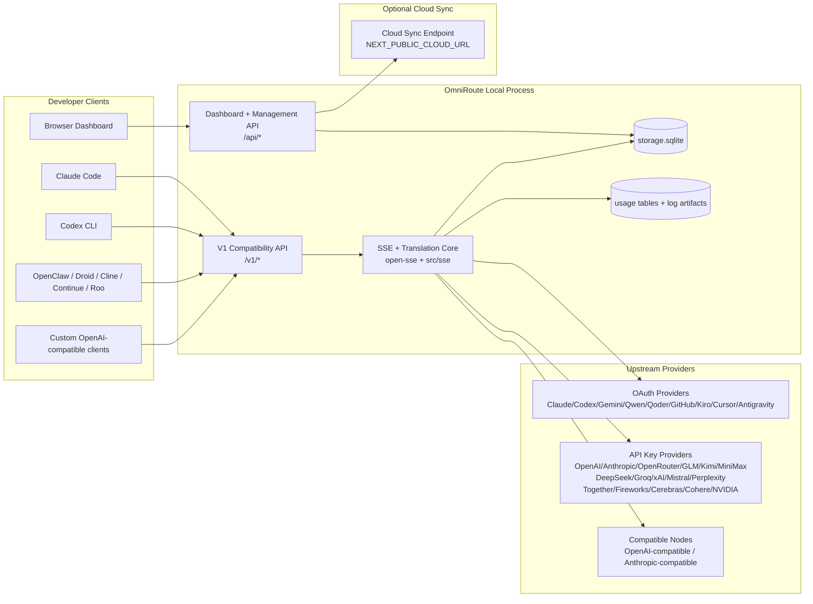
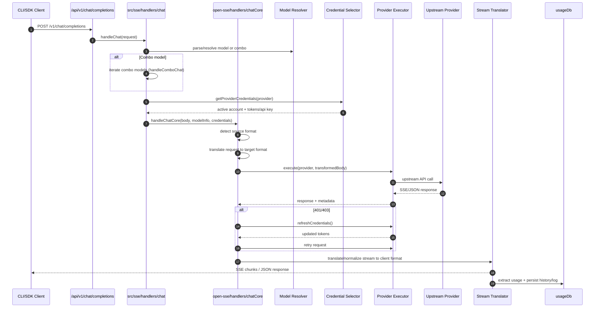
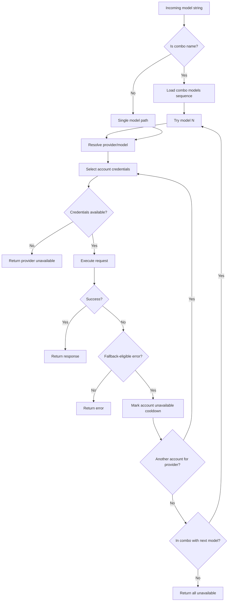
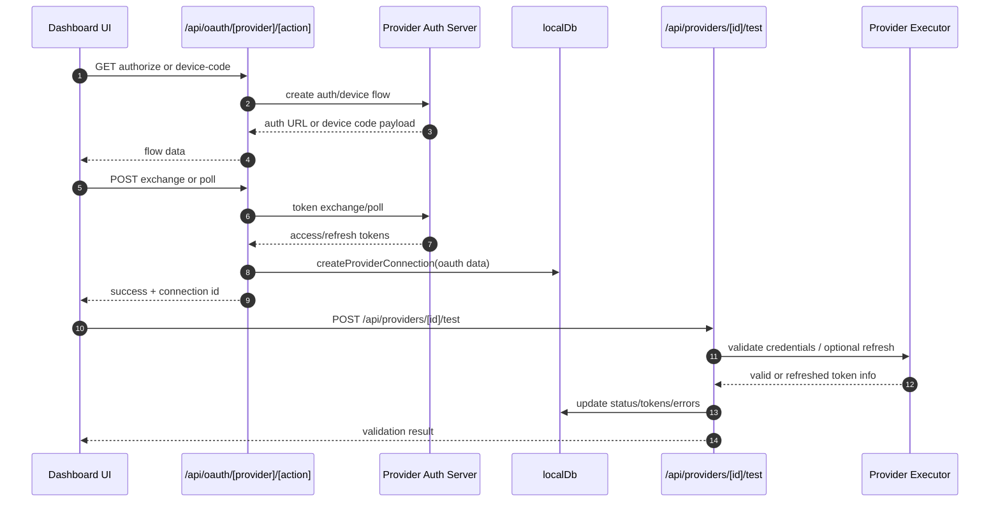
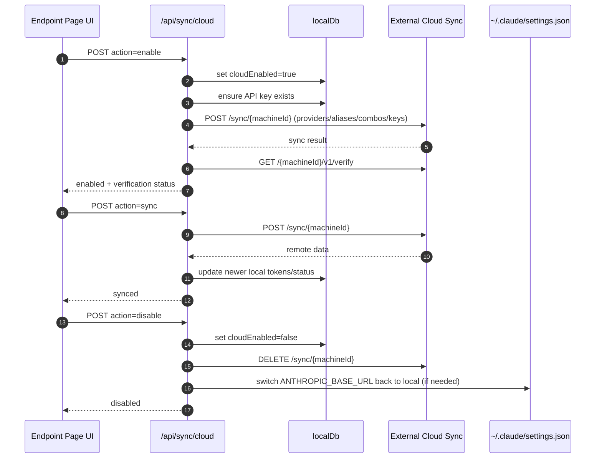
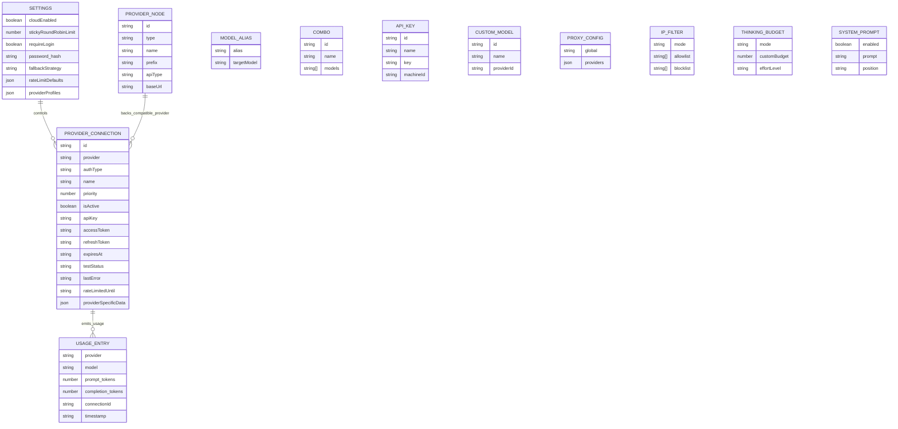
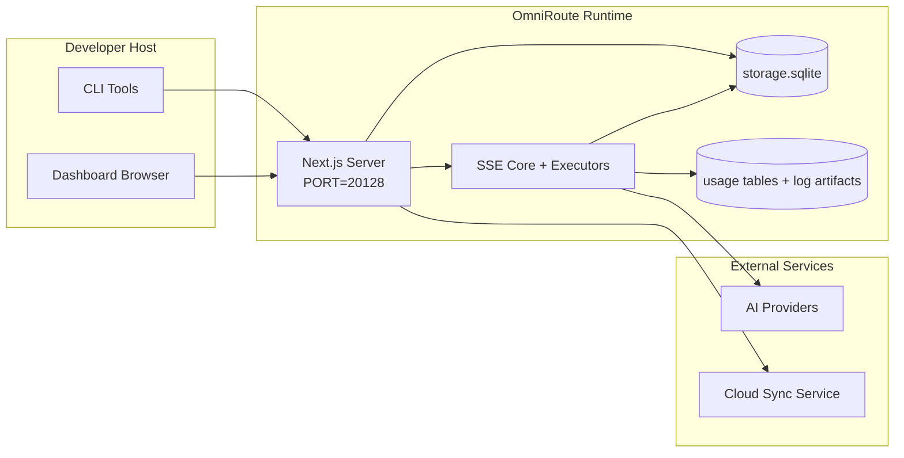

# OmniRoute Architecture (ไทย)

🌐 **Languages:** 🇺🇸 [English](../../../../docs/ARCHITECTURE.md) · 🇪🇸 [es](../../es/docs/ARCHITECTURE.md) · 🇫🇷 [fr](../../fr/docs/ARCHITECTURE.md) · 🇩🇪 [de](../../de/docs/ARCHITECTURE.md) · 🇮🇹 [it](../../it/docs/ARCHITECTURE.md) · 🇷🇺 [ru](../../ru/docs/ARCHITECTURE.md) · 🇨🇳 [zh-CN](../../zh-CN/docs/ARCHITECTURE.md) · 🇯🇵 [ja](../../ja/docs/ARCHITECTURE.md) · 🇰🇷 [ko](../../ko/docs/ARCHITECTURE.md) · 🇸🇦 [ar](../../ar/docs/ARCHITECTURE.md) · 🇮🇳 [hi](../../hi/docs/ARCHITECTURE.md) · 🇮🇳 [in](../../in/docs/ARCHITECTURE.md) · 🇹🇭 [th](../../th/docs/ARCHITECTURE.md) · 🇻🇳 [vi](../../vi/docs/ARCHITECTURE.md) · 🇮🇩 [id](../../id/docs/ARCHITECTURE.md) · 🇲🇾 [ms](../../ms/docs/ARCHITECTURE.md) · 🇳🇱 [nl](../../nl/docs/ARCHITECTURE.md) · 🇵🇱 [pl](../../pl/docs/ARCHITECTURE.md) · 🇸🇪 [sv](../../sv/docs/ARCHITECTURE.md) · 🇳🇴 [no](../../no/docs/ARCHITECTURE.md) · 🇩🇰 [da](../../da/docs/ARCHITECTURE.md) · 🇫🇮 [fi](../../fi/docs/ARCHITECTURE.md) · 🇵🇹 [pt](../../pt/docs/ARCHITECTURE.md) · 🇷🇴 [ro](../../ro/docs/ARCHITECTURE.md) · 🇭🇺 [hu](../../hu/docs/ARCHITECTURE.md) · 🇧🇬 [bg](../../bg/docs/ARCHITECTURE.md) · 🇸🇰 [sk](../../sk/docs/ARCHITECTURE.md) · 🇺🇦 [uk-UA](../../uk-UA/docs/ARCHITECTURE.md) · 🇮🇱 [he](../../he/docs/ARCHITECTURE.md) · 🇵🇭 [phi](../../phi/docs/ARCHITECTURE.md) · 🇧🇷 [pt-BR](../../pt-BR/docs/ARCHITECTURE.md) · 🇨🇿 [cs](../../cs/docs/ARCHITECTURE.md) · 🇹🇷 [tr](../../tr/docs/ARCHITECTURE.md)

---

_อัพเดตล่าสุด: 2026-03-28_## Executive Summary

OmniRoute เป็นเกตเวย์การกำหนดเส้นทาง AI ในพื้นที่และแดชบอร์ดที่สร้างขึ้นบน Next.js
โดยให้จุดสิ้นสุดที่เข้ากันได้กับ OpenAI จุดเดียว (`/v1/*`) และกำหนดเส้นทางการรับส่งข้อมูลผ่านผู้ให้บริการอัปสตรีมหลายรายพร้อมการแปล ทางเลือกสำรอง การรีเฟรชโทเค็น และการติดตามการใช้งาน

ความสามารถหลัก:

- พื้นผิว API ที่เข้ากันได้กับ OpenAI สำหรับ CLI/เครื่องมือ (ผู้ให้บริการ 28 ราย)
- การแปลคำขอ/ตอบกลับในรูปแบบต่างๆ ของผู้ให้บริการ
- ทางเลือกคำสั่งผสมโมเดล (ลำดับหลายรุ่น)
- ทางเลือกระดับบัญชี (หลายบัญชีต่อผู้ให้บริการ)
- การจัดการการเชื่อมต่อผู้ให้บริการ OAuth + API-key
- การสร้างการฝังผ่าน `/v1/embeddings` (ผู้ให้บริการ 6 ราย, 9 โมเดล)
- การสร้างภาพผ่าน `/v1/images/ generations` (ผู้ให้บริการ 4 ราย, 9 รุ่น)
- คิดการแยกวิเคราะห์แท็ก (`<think>...</think>`) สำหรับโมเดลการให้เหตุผล
- การตอบสนองการฆ่าเชื้อสำหรับความเข้ากันได้ของ OpenAI SDK ที่เข้มงวด
- การปรับบทบาทให้เป็นมาตรฐาน (ผู้พัฒนา → ระบบ, ระบบ → ผู้ใช้) เพื่อความเข้ากันได้ระหว่างผู้ให้บริการ
- การแปลงเอาต์พุตที่มีโครงสร้าง (json_schema → Gemini responseSchema)
- ความคงอยู่ในท้องถิ่นสำหรับผู้ให้บริการ คีย์ นามแฝง คอมโบ การตั้งค่า การกำหนดราคา
- การติดตามการใช้งาน/ต้นทุน และขอบันทึก
- ตัวเลือกการซิงค์บนคลาวด์สำหรับการซิงค์หลายอุปกรณ์/สถานะ
- รายการที่อนุญาต/รายการบล็อก IP สำหรับการควบคุมการเข้าถึง API
- คิดการจัดการงบประมาณ (ส่งผ่าน/อัตโนมัติ/กำหนดเอง/ปรับเปลี่ยน)
- ระบบฉีดพร้อมท์ทั่วโลก
- การติดตามเซสชันและการพิมพ์ลายนิ้วมือ
- การจำกัดอัตราการปรับปรุงต่อบัญชีด้วยโปรไฟล์เฉพาะของผู้ให้บริการ
- รูปแบบเซอร์กิตเบรกเกอร์เพื่อความยืดหยุ่นของผู้ให้บริการ
- ป้องกันฝูงฟ้าผ่าพร้อมระบบล็อค mutex
- แคชการขจัดข้อมูลซ้ำซ้อนของคำขอตามลายเซ็น
- เลเยอร์โดเมน: ความพร้อมใช้งานของโมเดล กฎต้นทุน นโยบายทางเลือก นโยบายการล็อก
- การคงอยู่ของสถานะโดเมน (แคชการเขียนผ่าน SQLite สำหรับทางเลือกสำรอง งบประมาณ การล็อคเอาต์ เซอร์กิตเบรกเกอร์)
- กลไกนโยบายสำหรับการประเมินคำขอแบบรวมศูนย์ (ล็อค → งบประมาณ → ทางเลือก)
- ขอการตรวจวัดทางไกลด้วยการรวมเวลาแฝง p50/p95/p99
- Correlation ID (X-Request-Id) สำหรับการติดตามจากต้นทางถึงปลายทาง
- การบันทึกการตรวจสอบการปฏิบัติตามข้อกำหนดโดยเลือกไม่ใช้ต่อคีย์ API
- กรอบการประเมินสำหรับการประกันคุณภาพ LLM
- แดชบอร์ด UI ความยืดหยุ่นพร้อมสถานะเบรกเกอร์แบบเรียลไทม์
- ผู้ให้บริการ OAuth แบบโมดูลาร์ (12 โมดูลแต่ละโมดูลภายใต้ `src/lib/oauth/providers/`)

โมเดลรันไทม์หลัก:

- เส้นทางแอป Next.js ภายใต้ `src/app/api/*` ใช้ทั้ง API แดชบอร์ดและ API ที่เข้ากันได้
- SSE/routing core ที่ใช้ร่วมกันใน `src/sse/*` + `open-sse/*` จัดการการดำเนินการของผู้ให้บริการ การแปล การสตรีม ทางเลือกสำรอง และการใช้งาน## Scope and Boundaries

### In Scope

- รันไทม์เกตเวย์ท้องถิ่น
- API การจัดการแดชบอร์ด
- การรับรองความถูกต้องของผู้ให้บริการและการรีเฟรชโทเค็น
- ขอการแปลและการสตรีม SSE
- สภาพท้องถิ่น + ความคงทนในการใช้งาน
- การประสานการซิงค์บนคลาวด์เสริม### Out of Scope

- การใช้งานบริการคลาวด์เบื้องหลัง `NEXT_PUBLIC_CLOUD_URL`
- SLA ของผู้ให้บริการ/ระนาบควบคุมอยู่นอกกระบวนการท้องถิ่น
- ไบนารี CLI ภายนอกเอง (Claude CLI, Codex CLI ฯลฯ )## Dashboard Surface (Current)

หน้าหลักภายใต้ `src/app/(dashboard)/dashboard/`:

- `/dashboard` — เริ่มต้นอย่างรวดเร็ว + ภาพรวมของผู้ให้บริการ
- `/dashboard/endpoint` — พร็อกซีปลายทาง + MCP + A2A + แท็บปลายทาง API
- `/dashboard/providers` — การเชื่อมต่อและข้อมูลประจำตัวของผู้ให้บริการ
- `/dashboard/combos` — กลยุทธ์คอมโบ เทมเพลต กฎการกำหนดเส้นทางโมเดล
- `/dashboard/costs` — การรวมต้นทุนและการมองเห็นราคา
- `/dashboard/analytics` — การวิเคราะห์และการประเมินผลการใช้งาน
- `/dashboard/limits` — การควบคุมโควต้า/อัตรา
- `/dashboard/cli-tools` — การเริ่มต้นใช้งาน CLI, การตรวจจับรันไทม์, การสร้างการกำหนดค่า
- `/dashboard/agents` — ตรวจพบตัวแทน ACP + การลงทะเบียนตัวแทนแบบกำหนดเอง
- `/dashboard/media` — รูปภาพ/วิดีโอ/สนามเด็กเล่นเพลง
- `/dashboard/search-tools` — การทดสอบและประวัติของผู้ให้บริการค้นหา
- `/dashboard/health` — สถานะการออนไลน์ เซอร์กิตเบรกเกอร์ ขีดจำกัดอัตรา
- `/dashboard/logs` — บันทึกคำขอ/พร็อกซี/การตรวจสอบ/คอนโซล
- `/dashboard/settings` — แท็บการตั้งค่าระบบ (ทั่วไป การกำหนดเส้นทาง ค่าเริ่มต้นคอมโบ ฯลฯ)
- `/dashboard/api-manager` — วงจรการใช้งานคีย์ API และการอนุญาตโมเดล## High-Level System Context



## Core Runtime Components

## 1) API and Routing Layer (Next.js App Routes)

ไดเรกทอรีหลัก:

- `src/app/api/v1/*` และ `src/app/api/v1beta/*` สำหรับ API ที่เข้ากันได้
- `src/app/api/*` สำหรับ API การจัดการ/การกำหนดค่า
- ถัดไปเขียนใหม่ในแมป `next.config.mjs` `/v1/*` เป็น `/api/v1/*`

เส้นทางความเข้ากันได้ที่สำคัญ:

- `src/app/api/v1/chat/completions/route.ts`
- `src/app/api/v1/messages/route.ts`
- `src/app/api/v1/responses/route.ts`
- `src/app/api/v1/models/route.ts` — รวมโมเดลที่กำหนดเองด้วย `custom: true`
- `src/app/api/v1/embeddings/route.ts` — การสร้างการฝัง (ผู้ให้บริการ 6 ราย)
- `src/app/api/v1/images/ generations/route.ts` — การสร้างภาพ (ผู้ให้บริการ 4+ รายรวม Antigravity/Nebius)
- `src/app/api/v1/messages/count_tokens/route.ts`
- `src/app/api/v1/providers/[provider]/chat/completions/route.ts` — แชทเฉพาะต่อผู้ให้บริการ
- `src/app/api/v1/providers/[provider]/embeddings/route.ts` — การฝังต่อผู้ให้บริการโดยเฉพาะ
- `src/app/api/v1/providers/[provider]/images/ generations/route.ts` — อิมเมจต่อผู้ให้บริการโดยเฉพาะ
- `src/app/api/v1beta/models/route.ts`
- `src/app/api/v1beta/models/[...path]/route.ts`

โดเมนการจัดการ:

- การรับรองความถูกต้อง/การตั้งค่า: `src/app/api/auth/*`, `src/app/api/settings/*`
- ผู้ให้บริการ/การเชื่อมต่อ: `src/app/api/providers*`
- โหนดผู้ให้บริการ: `src/app/api/provider-nodes*`
- โมเดลที่กำหนดเอง: `src/app/api/provider-models` (GET/POST/DELETE)
- แคตตาล็อกโมเดล: `src/app/api/models/route.ts` (GET)
- การกำหนดค่าพร็อกซี: `src/app/api/settings/proxy` (GET/PUT/DELETE) + `src/app/api/settings/proxy/test` (POST)
- OAuth: `src/app/api/oauth/*`
- คีย์/นามแฝง/คอมโบ/การกำหนดราคา: `src/app/api/keys*`, `src/app/api/models/alias`, `src/app/api/combos*`, `src/app/api/pricing`
- การใช้งาน: `src/app/api/usage/*`
- ซิงค์/คลาวด์: `src/app/api/sync/*`, `src/app/api/cloud/*`
- ผู้ช่วยเครื่องมือ CLI: `src/app/api/cli-tools/*`
- ตัวกรอง IP: `src/app/api/settings/ip-filter` (GET/PUT)
- งบประมาณการคิด: `src/app/api/settings/thinking-budget` (GET/PUT)
- พร้อมท์ระบบ: `src/app/api/settings/system-prompt` (GET/PUT)
- เซสชัน: `src/app/api/sessions` (GET)
- ขีดจำกัดอัตรา: `src/app/api/rate-limits` (GET)
- ความยืดหยุ่น: `src/app/api/resilience` (GET/PATCH) — โปรไฟล์ผู้ให้บริการ, เซอร์กิตเบรกเกอร์, สถานะขีดจำกัดอัตรา
- รีเซ็ตความยืดหยุ่น: `src/app/api/resilience/reset` (POST) — รีเซ็ตเบรกเกอร์ + คูลดาวน์
- สถิติแคช: `src/app/api/cache/stats` (GET/DELETE)
- ความพร้อมใช้งานของโมเดล: `src/app/api/models/availability` (GET/POST)
- การวัดและส่งข้อมูลทางไกล: `src/app/api/telemetry/summary` (GET)
- งบประมาณ: `src/app/api/usage/budget` (GET/POST)
- เชนทางเลือก: `src/app/api/fallback/chains` (GET/POST/DELETE)
- การตรวจสอบการปฏิบัติตามข้อกำหนด: `src/app/api/compliance/audit-log` (GET)
- Evals: `src/app/api/evals` (GET/POST), `src/app/api/evals/[suiteId]` (GET)
- นโยบาย: `src/app/api/policies` (GET/POST)## 2) SSE + Translation Core

โมดูลการไหลหลัก:

- รายการ: `src/sse/handlers/chat.ts`
- การประสานหลัก: `open-sse/handlers/chatCore.ts`
- อะแดปเตอร์การดำเนินการของผู้ให้บริการ: `open-sse/executors/*`
- รูปแบบการตรวจจับ/การกำหนดค่าผู้ให้บริการ: `open-sse/services/provider.ts`
- โมเดลแยกวิเคราะห์ / แก้ไข: `src/sse/services/model.ts`, `open-sse/services/model.ts`
- ตรรกะทางเลือกของบัญชี: `open-sse/services/accountFallback.ts`
- รีจิสทรีการแปล: `open-sse/translator/index.ts`
- การแปลงสตรีม: `open-sse/utils/stream.ts`, `open-sse/utils/streamHandler.ts`
- การแยกการใช้งาน/การทำให้เป็นมาตรฐาน: `open-sse/utils/usageTracking.ts`
- คิดว่าตัวแยกวิเคราะห์แท็ก: `open-sse/utils/thinkTagParser.ts`
- ตัวจัดการการฝัง: `open-sse/handlers/embeddings.ts`
- การลงทะเบียนผู้ให้บริการการฝัง: `open-sse/config/embeddingRegistry.ts`
- ตัวจัดการการสร้างอิมเมจ: `open-sse/handlers/imageGeneration.ts`
- รีจิสทรีของผู้ให้บริการอิมเมจ: `open-sse/config/imageRegistry.ts`
- การตอบสนองการฆ่าเชื้อ: `open-sse/handlers/responseSanitizer.ts`
- การทำให้บทบาทเป็นมาตรฐาน: `open-sse/services/roleNormalizer.ts`

บริการ (ตรรกะทางธุรกิจ):

- การเลือกบัญชี/การให้คะแนน: `open-sse/services/accountSelector.ts`
- การจัดการวงจรชีวิตบริบท: `open-sse/services/contextManager.ts`
- การบังคับใช้ตัวกรอง IP: `open-sse/services/ipFilter.ts`
- การติดตามเซสชัน: `open-sse/services/sessionManager.ts`
- ขอการขจัดข้อมูลซ้ำซ้อน: `open-sse/services/signatureCache.ts`
- การแจ้งระบบ: `open-sse/services/systemPrompt.ts`
- การคิดการจัดการงบประมาณ: `open-sse/services/thinkingBudget.ts`
- การกำหนดเส้นทางโมเดลตัวแทน: `open-sse/services/wildcardRouter.ts`
- การจัดการขีดจำกัดอัตรา: `open-sse/services/rateLimitManager.ts`
- เซอร์กิตเบรกเกอร์: `open-sse/services/circuitBreaker.ts`

โมดูลเลเยอร์โดเมน:

- ความพร้อมใช้งานของโมเดล: `src/lib/domain/modelAvailability.ts`
- กฎต้นทุน/งบประมาณ: `src/lib/domain/costRules.ts`
- นโยบายทางเลือก: `src/lib/domain/fallbackPolicy.ts`
- ตัวแก้ไขคำสั่งผสม: `src/lib/domain/comboResolver.ts`
- นโยบายการล็อก: `src/lib/domain/lockoutPolicy.ts`
- เครื่องมือนโยบาย: `src/domain/policyEngine.ts` — การล็อคแบบรวมศูนย์ → งบประมาณ → การประเมินทางเลือก
- แคตตาล็อกรหัสข้อผิดพลาด: `src/lib/domain/errorCodes.ts`
- รหัสคำขอ: `src/lib/domain/requestId.ts`
- หมดเวลาการดึงข้อมูล: `src/lib/domain/fetchTimeout.ts`
- ขอการตรวจวัดทางไกล: `src/lib/domain/requestTelemetry.ts`
- การปฏิบัติตามข้อกำหนด/การตรวจสอบ: `src/lib/domain/compliance/index.ts`
- นักวิ่ง Eval: `src/lib/domain/evalRunner.ts`
- การคงอยู่ของสถานะโดเมน: `src/lib/db/domainState.ts` — SQLite CRUD สำหรับเชนสำรอง งบประมาณ ประวัติต้นทุน สถานะการล็อกเอาต์ เซอร์กิตเบรกเกอร์

โมดูลผู้ให้บริการ OAuth (12 ไฟล์แต่ละไฟล์ภายใต้ `src/lib/oauth/providers/`):

- ดัชนีรีจิสทรี: `src/lib/oauth/providers/index.ts`
- ผู้ให้บริการส่วนบุคคล: `claude.ts`, `codex.ts`, `gemini.ts`, `antigravity.ts`, `qoder.ts`, `qwen.ts`, `kimi-coding.ts`, `github.ts`, `kiro.ts`, `cursor.ts`, `kilocode.ts`, `cline.ts`
- Thin wrapper: `src/lib/oauth/providers.ts` — ส่งออกซ้ำจากแต่ละโมดูล## 3) Persistence Layer

ฐานข้อมูลสถานะหลัก (SQLite):

- Core infra: `src/lib/db/core.ts` (ดีกว่า sqlite3, การโยกย้าย, WAL)
- ส่งออกส่วนหน้าอีกครั้ง: `src/lib/localDb.ts` (เลเยอร์ความเข้ากันได้แบบบางสำหรับผู้โทร)
- ไฟล์: `${DATA_DIR}/storage.sqlite` (หรือ `$XDG_CONFIG_HOME/omniroute/storage.sqlite` เมื่อตั้งค่า มิฉะนั้น `~/.omniroute/storage.sqlite`)
- เอนทิตี (ตาราง + เนมสเปซ KV): providerConnections, providerNodes, modelAliases, คอมโบ, apiKeys, การตั้งค่า, การกำหนดราคา,**customModels**,**proxyConfig**,**ipFilter**,**thinkingBudget**,**systemPrompt**

ความคงทนในการใช้งาน:

- ด้านหน้า: `src/lib/usageDb.ts` (แยกส่วนโมดูลใน `src/lib/usage/*`)
- ตาราง SQLite ใน `storage.sqlite`: `usage_history`, `call_logs`, `proxy_logs`
- สิ่งประดิษฐ์ของไฟล์ทางเลือกยังคงอยู่สำหรับความเข้ากันได้/การแก้ไขข้อบกพร่อง (`${DATA_DIR}/log.txt`, `${DATA_DIR}/call_logs/`, `<repo>/logs/...`)
- ไฟล์ JSON เดิมจะถูกย้ายไปยัง SQLite โดยการโยกย้ายเริ่มต้นเมื่อมีอยู่

ฐานข้อมูลสถานะโดเมน (SQLite):

- `src/lib/db/domainState.ts` — การดำเนินการ CRUD สำหรับสถานะโดเมน
- ตาราง (สร้างใน `src/lib/db/core.ts`): `domain_fallback_chains`, `domain_budgets`, `domain_cost_history`, `domain_lockout_state`, `domain_circuit_breakers`
- รูปแบบแคชการเขียนผ่าน: แผนที่ในหน่วยความจำเชื่อถือได้ ณ รันไทม์ การกลายพันธุ์จะถูกเขียนพร้อมกันกับ SQLite; สถานะถูกกู้คืนจาก DB เมื่อสตาร์ทขณะเย็น## 4) Auth + Security Surfaces

- การตรวจสอบคุกกี้แดชบอร์ด: `src/proxy.ts`, `src/app/api/auth/login/route.ts`
- การสร้าง/การตรวจสอบคีย์ API: `src/shared/utils/apiKey.ts`
- ข้อมูลลับของผู้ให้บริการยังคงอยู่ในรายการ `providerConnections`
- รองรับพร็อกซีขาออกผ่าน `open-sse/utils/proxyFetch.ts` (env vars) และ `open-sse/utils/networkProxy.ts` (กำหนดค่าได้ต่อผู้ให้บริการหรือทั่วโลก)## 5) Cloud Sync

- เริ่มต้นตัวกำหนดเวลา: `src/lib/initCloudSync.ts`, `src/shared/services/initializeCloudSync.ts`, `src/shared/services/modelSyncScheduler.ts`
- งานประจำ: `src/shared/services/cloudSyncScheduler.ts`
- งานประจำ: `src/shared/services/modelSyncScheduler.ts`
- เส้นทางควบคุม: `src/app/api/sync/cloud/route.ts`## Request Lifecycle (`/v1/chat/completions`)



## Combo + Account Fallback Flow



การตัดสินใจทางเลือกนั้นขับเคลื่อนโดย `open-sse/services/accountFallback.ts` โดยใช้รหัสสถานะและการวิเคราะห์พฤติกรรมข้อความแสดงข้อผิดพลาด การกำหนดเส้นทางแบบคอมโบเพิ่มการป้องกันพิเศษหนึ่งรายการ: 400s ที่กำหนดขอบเขตโดยผู้ให้บริการ เช่น ความล้มเหลวในการบล็อกเนื้อหาอัปสตรีมและการตรวจสอบบทบาทจะถือเป็นความล้มเหลวในแบบจำลองภายใน ดังนั้นเป้าหมายคอมโบในภายหลังยังคงสามารถทำงานได้## OAuth Onboarding and Token Refresh Lifecycle



การรีเฟรชระหว่างการรับส่งข้อมูลสดจะดำเนินการภายใน `open-sse/handlers/chatCore.ts` ผ่านทางตัวดำเนินการ `refreshCredentials()`## Cloud Sync Lifecycle (Enable / Sync / Disable)



การซิงค์เป็นระยะจะถูกทริกเกอร์โดย `CloudSyncScheduler` เมื่อเปิดใช้งานระบบคลาวด์## Data Model and Storage Map



ไฟล์จัดเก็บข้อมูลทางกายภาพ:

- ฐานข้อมูลรันไทม์หลัก: `${DATA_DIR}/storage.sqlite`
- ขอบรรทัดบันทึก: `${DATA_DIR}/log.txt` (compat/debug artifact)
- ไฟล์เก็บถาวรเพย์โหลดการโทรที่มีโครงสร้าง: `${DATA_DIR}/call_logs/`
- ตัวเลือกสำหรับนักแปล/คำขอเซสชันการแก้ไขข้อบกพร่อง: `<repo>/logs/...`## Deployment Topology



## Module Mapping (Decision-Critical)

### Route and API Modules

- `src/app/api/v1/*`, `src/app/api/v1beta/*`: API ความเข้ากันได้
- `src/app/api/v1/providers/[provider]/*`: เส้นทางเฉพาะต่อผู้ให้บริการ (แชท การฝัง รูปภาพ)
- `src/app/api/providers*`: ผู้ให้บริการ CRUD, การตรวจสอบความถูกต้อง, การทดสอบ
- `src/app/api/provider-nodes*`: การจัดการโหนดที่เข้ากันได้แบบกำหนดเอง
- `src/app/api/provider-models`: การจัดการโมเดลแบบกำหนดเอง (CRUD)
- `src/app/api/models/route.ts`: API แคตตาล็อกโมเดล (นามแฝง + โมเดลที่กำหนดเอง)
- `src/app/api/oauth/*`: การไหลของ OAuth/รหัสอุปกรณ์
- `src/app/api/keys*`: วงจรการใช้งานคีย์ API ภายในเครื่อง
- `src/app/api/models/alias`: การจัดการนามแฝง
- `src/app/api/combos*`: การจัดการคำสั่งผสมสำรอง
- `src/app/api/pricing`: แทนที่การกำหนดราคาสำหรับการคำนวณต้นทุน
- `src/app/api/settings/proxy`: การกำหนดค่าพร็อกซี (GET/PUT/DELETE)
- `src/app/api/settings/proxy/test`: การทดสอบการเชื่อมต่อพร็อกซีขาออก (POST)
- `src/app/api/usage/*`: การใช้งานและบันทึก API
- `src/app/api/sync/*` + `src/app/api/cloud/*`: การซิงค์บนคลาวด์และผู้ช่วยเหลือบนคลาวด์
- `src/app/api/cli-tools/*`: ตัวเขียน/ตัวตรวจสอบการกำหนดค่า CLI ในเครื่อง
- `src/app/api/settings/ip-filter`: รายการ IP ที่อนุญาต/รายการบล็อก (GET/PUT)
- `src/app/api/settings/thinking-budget`: กำหนดค่างบประมาณโทเค็นการคิด (GET/PUT)
- `src/app/api/settings/system-prompt`: แจ้งระบบทั่วโลก (GET/PUT)
- `src/app/api/sessions`: รายการเซสชันที่ใช้งานอยู่ (GET)
- `src/app/api/rate-limits`: สถานะขีดจำกัดอัตราต่อบัญชี (GET)### Routing and Execution Core

- `src/sse/handlers/chat.ts`: คำขอแยกวิเคราะห์, การจัดการคำสั่งผสม, วนรอบการเลือกบัญชี
- `open-sse/handlers/chatCore.ts`: การแปล, การส่งตัวดำเนินการ, การจัดการลองใหม่/รีเฟรช, การตั้งค่าสตรีม
- `open-sse/executors/*`: เครือข่ายเฉพาะผู้ให้บริการและพฤติกรรมรูปแบบ### Translation Registry and Format Converters

- `open-sse/translator/index.ts`: รีจิสทรีของนักแปลและการจัดเรียบเรียง
- ขอนักแปล: `open-sse/translator/request/*`
- ผู้แปลคำตอบ: `open-sse/translator/response/*`
- จัดรูปแบบค่าคงที่: `open-sse/translator/formats.ts`### Persistence

- `src/lib/db/*`: การกำหนดค่า/สถานะและการคงอยู่ของโดเมนแบบถาวรบน SQLite
- `src/lib/localDb.ts`: ส่งออกความเข้ากันได้อีกครั้งสำหรับโมดูล DB
- `src/lib/usageDb.ts`: ประวัติการใช้งาน/บันทึกการโทรที่อยู่ด้านบนของตาราง SQLite## Provider Executor Coverage (Strategy Pattern)

ผู้ให้บริการแต่ละรายมีตัวดำเนินการเฉพาะที่ขยาย `BaseExecutor` (ใน `open-sse/executors/base.ts`) ซึ่งจัดให้มีการสร้าง URL, การสร้างส่วนหัว, ลองอีกครั้งโดยใช้ Exponential Backoff, Hook การรีเฟรชข้อมูลประจำตัว และวิธีการประสาน `execute()`

| ผู้ดำเนินการ                  | ผู้ให้บริการ                                                                                                                                                    | การจัดการพิเศษ                                                   |
| ----------------------------- | --------------------------------------------------------------------------------------------------------------------------------------------------------------- | ---------------------------------------------------------------- |
| `DefaultExecutor`             | OpenAI, Claude, Gemini, Qwen, Qoder, OpenRouter, GLM, Kimi, MiniMax, DeepSeek, Groq, xAI, Mistral, ความฉงนสนเท่ห์, Together, ดอกไม้ไฟ, Cerebras, Cohere, NVIDIA | URL แบบไดนามิก/การกำหนดค่าส่วนหัวต่อผู้ให้บริการ                 |
| `ผู้ดำเนินการต้านแรงโน้มถ่วง` | Google ต้านแรงโน้มถ่วง                                                                                                                                          | รหัสโปรเจ็กต์/เซสชันแบบกำหนดเอง ลองอีกครั้งหลังจากแยกวิเคราะห์   |
| `CodexExecutor`               | OpenAI Codex                                                                                                                                                    | แทรกคำสั่งของระบบ บังคับใช้ความพยายามในการให้เหตุผล              |
| `เคอร์เซอร์เอ็กเซ็กเตอร์`     | เคอร์เซอร์ IDE                                                                                                                                                  | โปรโตคอล ConnectRPC, การเข้ารหัส Protobuf, ขอการลงนามผ่านเช็คซัม |
| `GithubExecutor`              | นักบิน GitHub                                                                                                                                                   | การรีเฟรชโทเค็น Copilot ส่วนหัวการเลียนแบบ VSCode                |
| `KiroExecutor`                | AWS CodeWhisperer/Kiro                                                                                                                                          | รูปแบบไบนารี AWS EventStream → การแปลง SSE                       |
| `GeminiCLIExecutor`           | ราศีเมถุน CLI                                                                                                                                                   | วงจรการรีเฟรชโทเค็น Google OAuth                                 |

ผู้ให้บริการรายอื่นทั้งหมด (รวมถึงโหนดที่เข้ากันได้แบบกำหนดเอง) ใช้ `DefaultExecutor`## Provider Compatibility Matrix

| ผู้ให้บริการ        | รูปแบบ          | รับรองความถูกต้อง      | สตรีม            | ไม่ใช่สตรีม | รีเฟรชโทเค็น | API การใช้งาน         |
| ------------------- | --------------- | ---------------------- | ---------------- | ----------- | ------------ | --------------------- | ------------------------------ |
| คลอดด์              | คลอด            | คีย์ API / OAuth       | ✅               | ✅          | ✅           | ⚠️เฉพาะแอดมินเท่านั้น |
| ราศีเมถุน           | ราศีเมถุน       | คีย์ API / OAuth       | ✅               | ✅          | ✅           | ⚠️ คลาวด์คอนโซล       |
| ราศีเมถุน CLI       | ราศีเมถุน-cli   | OAuth                  | ✅               | ✅          | ✅           | ⚠️ คลาวด์คอนโซล       |
| ต้านแรงโน้มถ่วง     | ต้านแรงโน้มถ่วง | OAuth                  | ✅               | ✅          | ✅           | ✅ API โควต้าเต็ม     |
| OpenAI              | เปิดใจ          | คีย์ API               | ✅               | ✅          | ❌           | ❌                    |
| โคเด็กซ์            | openai ตอบกลับ  | OAuth                  | ✅บังคับ         | ❌          | ✅           | ✅ ขีดจำกัดอัตรา      |
| นักบิน GitHub       | เปิดใจ          | OAuth + โทเค็น Copilot | ✅               | ✅          | ✅           | ✅ สแนปชอตโควต้า      |
| เคอร์เซอร์          | เคอร์เซอร์      | เช็คซัมแบบกำหนดเอง     | ✅               | ✅          | ❌           | ❌                    |
| คิโระ               | คิโระ           | AWS SSO OIDC           | ✅ (EventStream) | ❌          | ✅           | ✅ ขีดจำกัดการใช้งาน  |
| ควีน                | เปิดใจ          | OAuth                  | ✅               | ✅          | ✅           | ⚠️ตามคำขอ             |
| คิวเดอร์            | เปิดใจ          | OAuth (พื้นฐาน)        | ✅               | ✅          | ✅           | ⚠️ตามคำขอ             |
| OpenRouter          | เปิดใจ          | คีย์ API               | ✅               | ✅          | ❌           | ❌                    |
| GLM/คิมิ/มินิแม็กซ์ | คลอด            | คีย์ API               | ✅               | ✅          | ❌           | ❌                    |
| DeepSeek            | เปิดใจ          | คีย์ API               | ✅               | ✅          | ❌           | ❌                    |
| กรอค                | เปิดใจ          | คีย์ API               | ✅               | ✅          | ❌           | ❌                    |
| xAI (โกรก)          | เปิดใจ          | คีย์ API               | ✅               | ✅          | ❌           | ❌                    |
| มิสทรัล             | เปิดใจ          | คีย์ API               | ✅               | ✅          | ❌           | ❌                    |
| ความฉงนสนเท่ห์      | เปิดใจ          | คีย์ API               | ✅               | ✅          | ❌           | ❌                    |
| ร่วมกัน AI          | เปิดใจ          | คีย์ API               | ✅               | ✅          | ❌           | ❌                    |
| ดอกไม้ไฟ AI         | เปิดใจ          | คีย์ API               | ✅               | ✅          | ❌           | ❌                    |
| สมอง                | เปิดใจ          | คีย์ API               | ✅               | ✅          | ❌           | ❌                    |
| เชื่อมโยง           | เปิดใจ          | คีย์ API               | ✅               | ✅          | ❌           | ❌                    |
| NVIDIA NIM          | เปิดใจ          | คีย์ API               | ✅               | ✅          | ❌           | ❌                    | ## Format Translation Coverage |

รูปแบบแหล่งที่มาที่ตรวจพบ ได้แก่:

- `เปิดใจ`
- `การตอบกลับแบบ openai'
- 'โคลด'
- `ราศีเมถุน`

รูปแบบเป้าหมายได้แก่:

- แชท / ตอบกลับ OpenAI
- คลอดด์
- Gemini/Gemini-CLI/ซองต้านแรงโน้มถ่วง
- คิโระ
- เคอร์เซอร์

การแปลใช้**OpenAI เป็นรูปแบบฮับ**— การแปลงทั้งหมดผ่าน OpenAI เป็นตัวกลาง:```
Source Format → OpenAI (hub) → Target Format

````

การแปลจะถูกเลือกแบบไดนามิกตามรูปร่างเพย์โหลดต้นทางและรูปแบบเป้าหมายของผู้ให้บริการ

เลเยอร์การประมวลผลเพิ่มเติมในไปป์ไลน์การแปล:

-**การฆ่าเชื้อการตอบสนอง**— ตัดช่องที่ไม่ได้มาตรฐานออกจากการตอบสนองในรูปแบบ OpenAI (ทั้งแบบสตรีมมิ่งและไม่ใช่สตรีมมิ่ง) เพื่อให้มั่นใจว่าสอดคล้องกับ SDK ที่เข้มงวด
-**การปรับบทบาทให้เป็นมาตรฐาน**— แปลง `ผู้พัฒนา` → `ระบบ` สำหรับเป้าหมายที่ไม่ใช่ OpenAI ผสาน `system` → `user` สำหรับโมเดลที่ปฏิเสธบทบาทของระบบ (GLM, ERNIE)
-**คิดว่าการแยกแท็ก**— แยกวิเคราะห์บล็อก `<think>...</think>` จากเนื้อหาลงในช่อง `reasoning_content`
-**เอาต์พุตที่มีโครงสร้าง**— แปลง OpenAI `response_format.json_schema` เป็น `responseMimeType` + `responseSchema` ของ Gemini## Supported API Endpoints

| จุดสิ้นสุด | รูปแบบ | ตัวจัดการ |
| -------------------------------------------------- | ------------------ | ------------------------------------------------------------------- |
| `โพสต์ /v1/แชท/เสร็จสิ้น` | แชท OpenAI | `src/sse/handlers/chat.ts` |
| `โพสต์ /v1/ข้อความ` | ข้อความของคลอดด์ | ตัวจัดการเดียวกัน (ตรวจพบอัตโนมัติ) |
| `POST /v1/ตอบกลับ` | การตอบสนองของ OpenAI | `open-sse/handlers/responsesHandler.ts` |
| `POST /v1/การฝัง` | การฝัง OpenAI | `open-sse/handlers/embeddings.ts` |
| `GET /v1/การฝัง` | รายการรุ่น | เส้นทาง API |
| `POST /v1/images/รุ่น` | รูปภาพ OpenAI | `open-sse/handlers/imageGeneration.ts` |
| `รับ /v1/รูปภาพ/รุ่น` | รายการรุ่น | เส้นทาง API |
| `POST /v1/providers/{provider}/chat/completions` | แชท OpenAI | เฉพาะต่อผู้ให้บริการพร้อมการตรวจสอบโมเดล |
| `POST /v1/providers/{provider}/embeddings` | การฝัง OpenAI | เฉพาะต่อผู้ให้บริการพร้อมการตรวจสอบโมเดล |
| `POST /v1/providers/{provider}/images/รุ่น` | รูปภาพ OpenAI | เฉพาะต่อผู้ให้บริการพร้อมการตรวจสอบโมเดล |
| `POST /v1/messages/count_tokens` | จำนวนโทเค็นของ Claude | เส้นทาง API |
| `GET /v1/models` | รายการโมเดล OpenAI | เส้นทาง API (แชท + การฝัง + รูปภาพ + โมเดลที่กำหนดเอง) |
| `GET /api/models/catalog` | แคตตาล็อก | ทุกรุ่นจัดกลุ่มตามผู้ให้บริการ + ประเภท |
| `POST /v1beta/models/*:streamGenerateContent` | ชาวราศีเมถุนพื้นเมือง | เส้นทาง API |
| `รับ/วาง/ลบ /api/การตั้งค่า/พร็อกซี` | การกำหนดค่าพร็อกซี | การกำหนดค่าพร็อกซีเครือข่าย |
| `POST /api/settings/proxy/test` | การเชื่อมต่อพร็อกซี | จุดสิ้นสุดการทดสอบความสมบูรณ์ของพร็อกซี/การเชื่อมต่อ |
| `GET/POST/DELETE /api/provider-models` | โมเดลผู้ให้บริการ | ผู้ให้บริการสนับสนุนข้อมูลเมตาโมเดลที่กำหนดเองและโมเดลที่มีการจัดการ |## Bypass Handler

ตัวจัดการบายพาส (`open-sse/utils/bypassHandler.ts`) สกัดกั้นคำขอ "ที่ใช้แล้วทิ้ง" ที่รู้จักจาก Claude CLI เช่น การปิงการอุ่นเครื่อง การแตกชื่อ และจำนวนโทเค็น และส่งคืน**การตอบกลับปลอม**โดยไม่ต้องใช้โทเค็นของผู้ให้บริการอัปสตรีม ซึ่งจะเกิดขึ้นเมื่อ `User-Agent` มี `claude-cli` เท่านั้น## Request Logger Pipeline

ตัวบันทึกคำขอ (`open-sse/utils/requestLogger.ts`) จัดเตรียมไปป์ไลน์การบันทึกการดีบัก 7 ขั้นตอน ซึ่งปิดใช้งานตามค่าเริ่มต้น เปิดใช้งานผ่าน `ENABLE_REQUEST_LOGS=true`:```
1_req_client.json → 2_req_source.json → 3_req_openai.json → 4_req_target.json
→ 5_res_provider.txt → 6_res_openai.txt → 7_res_client.txt
````

ไฟล์ถูกเขียนไปที่ `<repo>/logs/<session>/` สำหรับแต่ละเซสชันคำขอ## Failure Modes and Resilience

## 1) Account/Provider Availability

- คูลดาวน์บัญชีผู้ให้บริการเกี่ยวกับข้อผิดพลาดชั่วคราว/อัตรา/การตรวจสอบสิทธิ์
- ทางเลือกบัญชีก่อนที่จะล้มเหลวในการร้องขอ
- ทางเลือกของโมเดลคอมโบเมื่อพาธของโมเดล/ผู้ให้บริการปัจจุบันหมดลง## 2) Token Expiry

- ตรวจสอบล่วงหน้าและรีเฟรชด้วยการลองอีกครั้งสำหรับผู้ให้บริการที่รีเฟรชได้
- 401/403 ลองอีกครั้งหลังจากพยายามรีเฟรชในเส้นทางหลัก## 3) Stream Safety

- ตัวควบคุมสตรีมที่รับรู้การตัดการเชื่อมต่อ
- สตรีมการแปลพร้อมฟลัชปลายสตรีมและการจัดการ `[เสร็จสิ้น]`
- ทางเลือกการประมาณการใช้งานเมื่อข้อมูลเมตาการใช้งานของผู้ให้บริการหายไป## 4) Cloud Sync Degradation

- ข้อผิดพลาดในการซิงค์ปรากฏขึ้น แต่รันไทม์ในเครื่องยังคงดำเนินต่อไป
- ตัวกำหนดตารางเวลามีตรรกะที่สามารถลองใหม่ได้ แต่การดำเนินการตามระยะเวลาในปัจจุบันจะเรียกการซิงค์แบบพยายามครั้งเดียวตามค่าเริ่มต้น## 5) Data Integrity

- การโยกย้ายสคีมา SQLite และ hooks อัปเกรดอัตโนมัติเมื่อเริ่มต้น
- JSON ดั้งเดิม → เส้นทางความเข้ากันได้ของการโยกย้าย SQLite## Observability and Operational Signals

แหล่งที่มาของการมองเห็นรันไทม์:

- บันทึกคอนโซลจาก `src/sse/utils/logger.ts`
- การรวมการใช้งานต่อคำขอใน SQLite (`usage_history`, `call_logs`, `proxy_logs`)
- การจับเพย์โหลดโดยละเอียดสี่ขั้นตอนใน SQLite (`request_detail_logs`) เมื่อ `settings.detailed_logs_enabled=true`
- บันทึกสถานะคำขอที่เป็นข้อความใน `log.txt` (ตัวเลือก / เข้ากันได้)
- บันทึกคำขอ/การแปลเชิงลึกที่เป็นทางเลือกภายใต้ `logs/` เมื่อ `ENABLE_REQUEST_LOGS=true`
- จุดสิ้นสุดการใช้งานแดชบอร์ด (`/api/usage/*`) สำหรับการใช้ UI

การบันทึกเพย์โหลดคำขอโดยละเอียดจะจัดเก็บขั้นตอนเพย์โหลด JSON ได้สูงสุดสี่ขั้นตอนต่อการโทรที่กำหนดเส้นทาง:

- คำขอดิบที่ได้รับจากลูกค้า
- คำขอที่แปลแล้วส่งต้นทางจริง
- การตอบสนองของผู้ให้บริการสร้างใหม่เป็น JSON การตอบกลับแบบสตรีมจะถูกบีบอัดเป็นข้อมูลสรุปสุดท้ายพร้อมข้อมูลเมตาของสตรีม
- การตอบสนองของลูกค้าขั้นสุดท้ายที่ส่งคืนโดย OmniRoute; การตอบกลับแบบสตรีมจะถูกจัดเก็บไว้ในแบบฟอร์มสรุปแบบกะทัดรัดเดียวกัน## Security-Sensitive Boundaries

- ความลับ JWT (`JWT_SECRET`) รักษาความปลอดภัยการตรวจสอบ / การลงนามคุกกี้เซสชันแดชบอร์ด
- บูตสแตรปรหัสผ่านเริ่มต้น (`INITIAL_PASSWORD`) ควรได้รับการกำหนดค่าอย่างชัดเจนสำหรับการจัดเตรียมการทำงานครั้งแรก
- คีย์ API ความลับ HMAC (`API_KEY_SECRET`) รักษาความปลอดภัยให้กับรูปแบบคีย์ API ในเครื่องที่สร้างขึ้น
- ความลับของผู้ให้บริการ (คีย์/โทเค็น API) ยังคงอยู่ในฐานข้อมูลในเครื่องและควรได้รับการปกป้องในระดับระบบไฟล์
- จุดสิ้นสุดการซิงค์บนคลาวด์อาศัยการตรวจสอบสิทธิ์คีย์ API + ซีแมนทิกส์รหัสเครื่อง## Environment and Runtime Matrix

ตัวแปรสภาพแวดล้อมที่ใช้งานโดยโค้ด:

- แอป/การรับรองความถูกต้อง: `JWT_SECRET`, `INITIAL_PASSWORD`
- พื้นที่เก็บข้อมูล: `DATA_DIR`
- ลักษณะการทำงานของโหนดที่เข้ากันได้: `ALLOW_MULTI_CONNECTIONS_PER_COMPAT_NODE`
- การแทนที่ฐานจัดเก็บข้อมูลเสริม (Linux/macOS เมื่อไม่ได้ตั้งค่า `DATA_DIR`): `XDG_CONFIG_HOME`
- การรักษาความปลอดภัย: `API_KEY_SECRET`, `MACHINE_ID_SALT`
- การบันทึก: `ENABLE_REQUEST_LOGS`
- การซิงค์/คลาวด์ URL: `NEXT_PUBLIC_BASE_URL`, `NEXT_PUBLIC_CLOUD_URL`
- พร็อกซีขาออก: `HTTP_PROXY`, `HTTPS_PROXY`, `ALL_PROXY`, `NO_PROXY` และรูปแบบตัวพิมพ์เล็ก
- ธงคุณลักษณะ SOCKS5: `ENABLE_SOCKS5_PROXY`, `NEXT_PUBLIC_ENABLE_SOCKS5_PROXY`
- ตัวช่วยแพลตฟอร์ม/รันไทม์ (ไม่ใช่การกำหนดค่าเฉพาะแอป): `APPDATA`, `NODE_ENV`, `PORT`, `HOSTNAME`## Known Architectural Notes

1. `usageDb` และ `localDb` ใช้นโยบายไดเรกทอรีฐานเดียวกัน (`DATA_DIR` -> `XDG_CONFIG_HOME/omniroute` -> `~/.omniroute`) พร้อมการย้ายไฟล์แบบเดิม
2. `/api/v1/route.ts` มอบสิทธิ์ให้กับตัวสร้างแคตตาล็อกแบบรวมตัวเดียวกันกับที่ใช้โดย `/api/v1/models` (`src/app/api/v1/models/catalog.ts`) เพื่อหลีกเลี่ยงการเบี่ยงเบนทางความหมาย
3. ตัวบันทึกคำขอเขียนส่วนหัว/เนื้อหาแบบเต็มเมื่อเปิดใช้งาน ถือว่าไดเร็กทอรีบันทึกมีความละเอียดอ่อน
4. พฤติกรรมของคลาวด์ขึ้นอยู่กับ `NEXT_PUBLIC_BASE_URL` ที่ถูกต้องและการเข้าถึงจุดสิ้นสุดของคลาวด์
5. ไดเรกทอรี `open-sse/` ได้รับการเผยแพร่เป็น `@omniroute/open-sse`**แพ็คเกจพื้นที่ทำงาน npm**ซอร์สโค้ดนำเข้าผ่าน `@omniroute/open-sse/...` (แก้ไขโดย Next.js `transpilePackages`) เส้นทางของไฟล์ในเอกสารนี้ยังคงใช้ชื่อไดเรกทอรี `open-sse/` เพื่อความสอดคล้อง
6. แผนภูมิในแดชบอร์ดใช้**แผนภูมิใหม่**(อิงตาม SVG) สำหรับการแสดงภาพการวิเคราะห์เชิงโต้ตอบที่เข้าถึงได้ (แผนภูมิแท่งการใช้งานโมเดล ตารางแจกแจงผู้ให้บริการพร้อมอัตราความสำเร็จ)
7. การทดสอบ E2E ใช้**นักเขียนบทละคร**(`tests/e2e/`) รันผ่าน `npm run test:e2e` การทดสอบหน่วยใช้**ตัวรันการทดสอบ Node.js**(`tests/unit/`) รันผ่าน `npm run test:unit` ซอร์สโค้ดภายใต้ `src/` คือ**TypeScript**(`.ts`/`.tsx`); พื้นที่ทำงาน `open-sse/` ยังคงเป็น JavaScript (`.js`)
8. หน้าการตั้งค่าแบ่งออกเป็น 5 แท็บ: ความปลอดภัย การกำหนดเส้นทาง (6 กลยุทธ์ระดับโลก: เติมก่อน ปัดเศษ p2c สุ่ม ใช้น้อยที่สุด ปรับต้นทุนให้เหมาะสม) ความยืดหยุ่น (จำกัดอัตราที่แก้ไขได้ เซอร์กิตเบรกเกอร์ นโยบาย) AI (การคิดงบประมาณ พรอมต์ของระบบ แคชพร้อมต์) ขั้นสูง (พร็อกซี)## Operational Verification Checklist

- สร้างจากแหล่งที่มา: `npm run build`
- สร้างอิมเมจ Docker: `docker build -t omniroute .`
- เริ่มบริการและตรวจสอบ:
- `รับ /api/การตั้งค่า`
- `GET /api/v1/models`
- URL ฐานเป้าหมาย CLI ควรเป็น `http://<host>:20128/v1` เมื่อ `PORT=20128`
