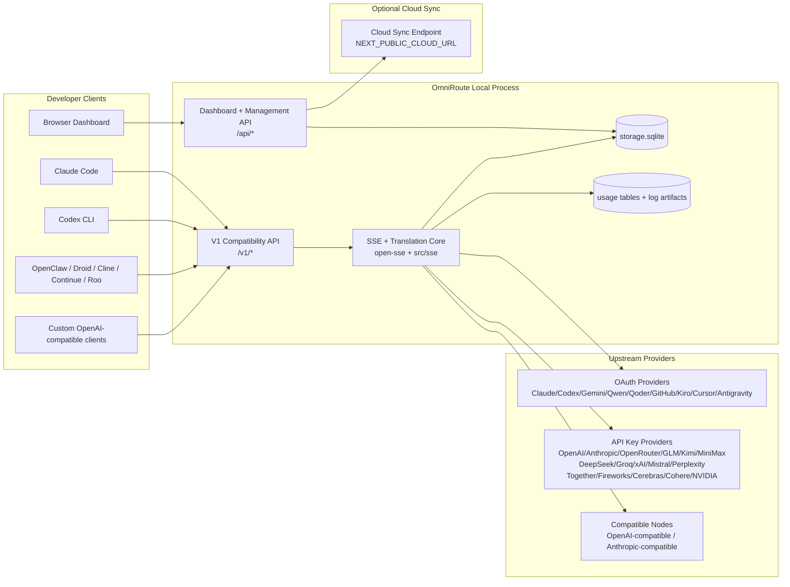
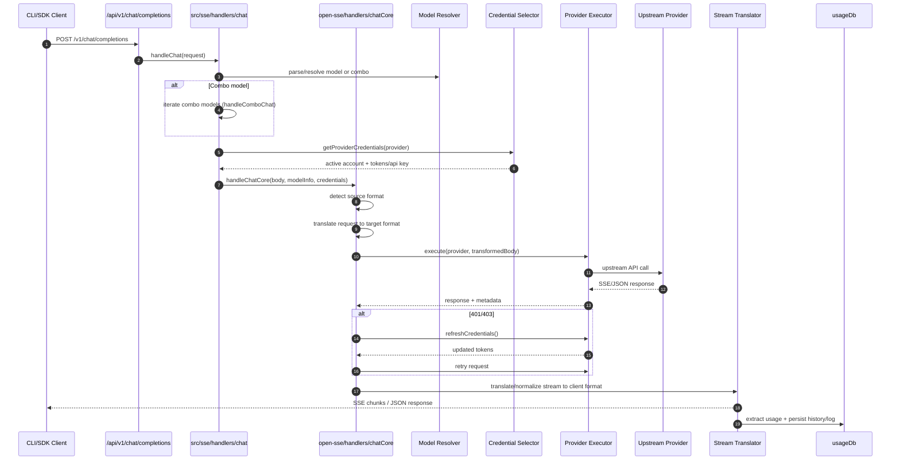
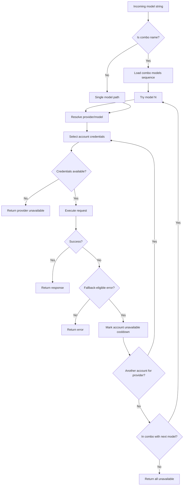
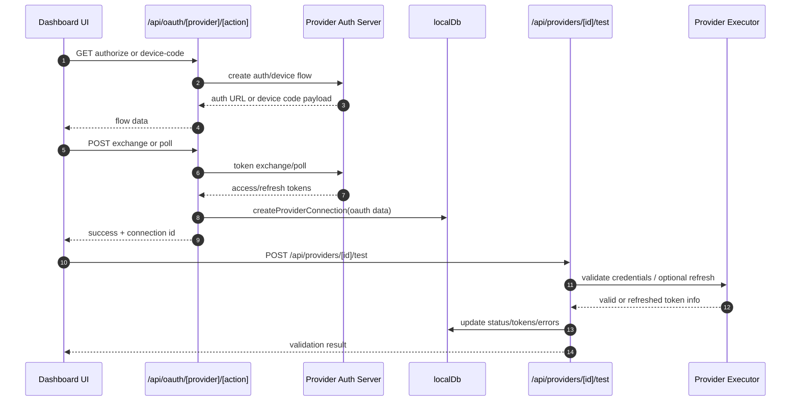
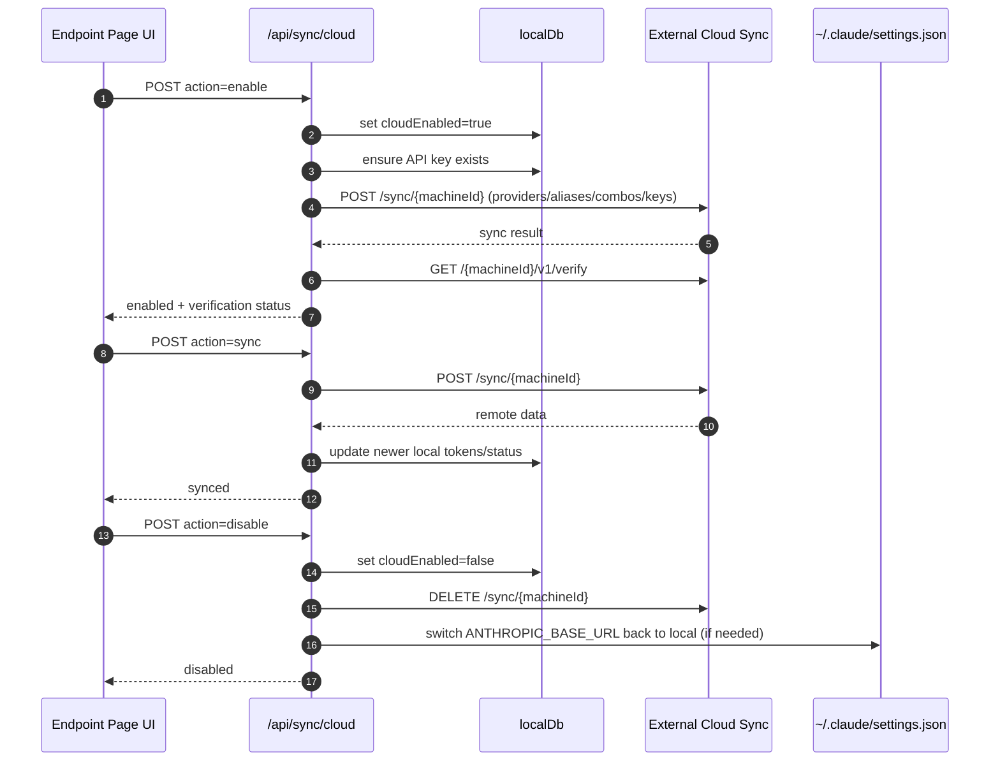
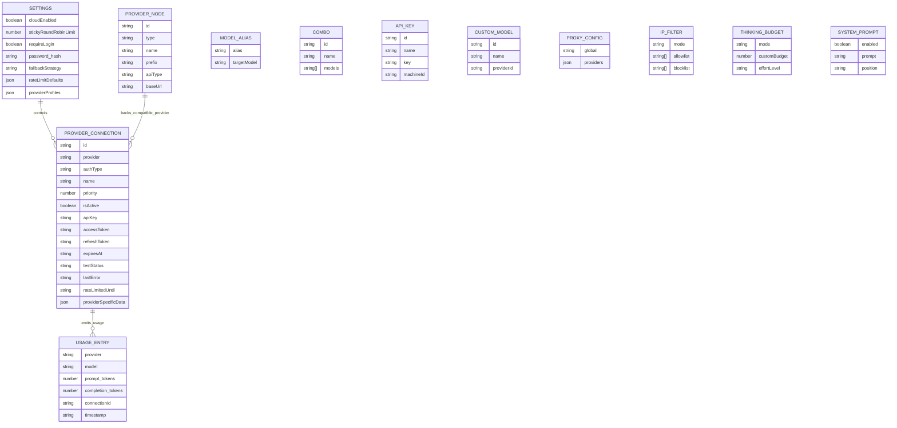
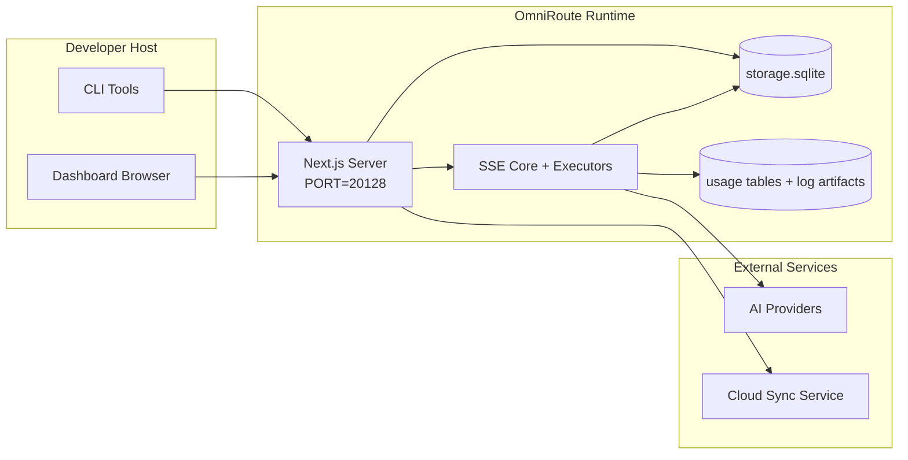

# OmniRoute Architecture (Türkçe)

🌐 **Languages:** 🇺🇸 [English](../../../../docs/ARCHITECTURE.md) · 🇪🇸 [es](../../es/docs/ARCHITECTURE.md) · 🇫🇷 [fr](../../fr/docs/ARCHITECTURE.md) · 🇩🇪 [de](../../de/docs/ARCHITECTURE.md) · 🇮🇹 [it](../../it/docs/ARCHITECTURE.md) · 🇷🇺 [ru](../../ru/docs/ARCHITECTURE.md) · 🇨🇳 [zh-CN](../../zh-CN/docs/ARCHITECTURE.md) · 🇯🇵 [ja](../../ja/docs/ARCHITECTURE.md) · 🇰🇷 [ko](../../ko/docs/ARCHITECTURE.md) · 🇸🇦 [ar](../../ar/docs/ARCHITECTURE.md) · 🇮🇳 [hi](../../hi/docs/ARCHITECTURE.md) · 🇮🇳 [in](../../in/docs/ARCHITECTURE.md) · 🇹🇭 [th](../../th/docs/ARCHITECTURE.md) · 🇻🇳 [vi](../../vi/docs/ARCHITECTURE.md) · 🇮🇩 [id](../../id/docs/ARCHITECTURE.md) · 🇲🇾 [ms](../../ms/docs/ARCHITECTURE.md) · 🇳🇱 [nl](../../nl/docs/ARCHITECTURE.md) · 🇵🇱 [pl](../../pl/docs/ARCHITECTURE.md) · 🇸🇪 [sv](../../sv/docs/ARCHITECTURE.md) · 🇳🇴 [no](../../no/docs/ARCHITECTURE.md) · 🇩🇰 [da](../../da/docs/ARCHITECTURE.md) · 🇫🇮 [fi](../../fi/docs/ARCHITECTURE.md) · 🇵🇹 [pt](../../pt/docs/ARCHITECTURE.md) · 🇷🇴 [ro](../../ro/docs/ARCHITECTURE.md) · 🇭🇺 [hu](../../hu/docs/ARCHITECTURE.md) · 🇧🇬 [bg](../../bg/docs/ARCHITECTURE.md) · 🇸🇰 [sk](../../sk/docs/ARCHITECTURE.md) · 🇺🇦 [uk-UA](../../uk-UA/docs/ARCHITECTURE.md) · 🇮🇱 [he](../../he/docs/ARCHITECTURE.md) · 🇵🇭 [phi](../../phi/docs/ARCHITECTURE.md) · 🇧🇷 [pt-BR](../../pt-BR/docs/ARCHITECTURE.md) · 🇨🇿 [cs](../../cs/docs/ARCHITECTURE.md) · 🇹🇷 [tr](../../tr/docs/ARCHITECTURE.md)

---

_Son güncelleme: 2026-03-28_## Executive Summary

OmniRoute, Next.js üzerine oluşturulmuş yerel bir AI yönlendirme ağ geçidi ve kontrol panelidir.
OpenAI uyumlu tek bir uç nokta (`/v1/*`) sağlar ve çeviri, geri dönüş, belirteç yenileme ve kullanım izleme özellikleriyle trafiği birden fazla yukarı akış sağlayıcısına yönlendirir.

Çekirdek yetenekler:

- CLI/araçlar için OpenAI uyumlu API yüzeyi (28 sağlayıcı)
- Sağlayıcı formatları arasında istek/yanıt çevirisi
- Model birleşik geri dönüşü (çoklu model sırası)
- Hesap düzeyinde geri dönüş (sağlayıcı başına çoklu hesap)
- OAuth + API anahtarı sağlayıcı bağlantı yönetimi
- '/v1/embeddings' yoluyla yerleştirme oluşturma (6 sağlayıcı, 9 model)
- '/v1/images/ Generations' aracılığıyla görüntü oluşturma (4 sağlayıcı, 9 model)
- Akıl yürütme modelleri için etiket ayrıştırmayı (`<think>...</think>`) düşünün
- OpenAI SDK uyumluluğu için yanıt temizliği
- Sağlayıcılar arası uyumluluk için rol normalleştirme (geliştirici→sistem, sistem→kullanıcı)
- Yapılandırılmış çıktı dönüşümü (json_schema → Gemini ResponseSchema)
- Sağlayıcılar, anahtarlar, takma adlar, kombinasyonlar, ayarlar ve fiyatlandırma için yerel kalıcılık
- Kullanım/maliyet takibi ve talep kaydı
- Çoklu cihaz/durum senkronizasyonu için isteğe bağlı bulut senkronizasyonu
- API erişim kontrolü için IP izin verilenler listesi/engellenenler listesi
- Bütçe yönetimini düşünmek (geçişli/otomatik/özel/uyarlanabilir)
- Küresel sistem istemi enjeksiyonu
- Oturum takibi ve parmak izi alma
- Sağlayıcıya özel profillerle hesap başına geliştirilmiş oran sınırlaması
- Sağlayıcı esnekliği için devre kesici modeli
- Mutex kilitlemeli, yıldırım önleyici sürü koruması
- İmza tabanlı istek tekilleştirme önbelleği
- Etki alanı katmanı: model kullanılabilirliği, maliyet kuralları, geri dönüş politikası, kilitleme politikası
- Etki alanı durumunun kalıcılığı (geri dönüşler, bütçeler, kilitlemeler, devre kesiciler için SQLite yazma önbelleği)
- Merkezi talep değerlendirmesi için politika motoru (kilitleme → bütçe → geri dönüş)
- p50/p95/p99 gecikme toplama ile telemetri isteği
- Uçtan uca izleme için Korelasyon Kimliği (X-Request-Id)
- API anahtarı başına devre dışı bırakma özelliğiyle uyumluluk denetiminin günlüğe kaydedilmesi
- LLM kalite güvencesi için değerlendirme çerçevesi
- Gerçek zamanlı devre kesici durumuna sahip Resilience UI kontrol paneli
- Modüler OAuth sağlayıcıları ('src/lib/oauth/providers/' altında 12 ayrı modül)

Birincil çalışma zamanı modeli:

- "src/app/api/\*" altındaki Next.js uygulama rotaları, hem kontrol paneli API'lerini hem de uyumluluk API'lerini uygular
- "src/sse/_" + "open-sse/_" içindeki paylaşılan bir SSE/yönlendirme çekirdeği, sağlayıcı yürütmeyi, çeviriyi, akışı, geri dönüşü ve kullanımı yönetir## Scope and Boundaries

### In Scope

- Yerel ağ geçidi çalışma zamanı
- Kontrol paneli yönetimi API'leri
- Sağlayıcı kimlik doğrulaması ve belirteç yenileme
- Çeviri ve SSE akışı isteyin
- Yerel durum + kullanım kalıcılığı
- İsteğe bağlı bulut senkronizasyonu düzenlemesi### Out of Scope

- `NEXT_PUBLIC_CLOUD_URL` arkasında bulut hizmeti uygulaması
- Sağlayıcı SLA'sı/yerel sürecin dışındaki kontrol düzlemi
- Harici CLI ikili dosyalarının kendileri (Claude CLI, Codex CLI, vb.)## Dashboard Surface (Current)

'Src/app/(dashboard)/dashboard/' altındaki ana sayfalar:

- `/dashboard` — hızlı başlangıç + sağlayıcıya genel bakış
- `/dashboard/endpoint` — uç nokta proxy'si + MCP + A2A + API uç noktası sekmeleri
- `/dashboard/providers` — sağlayıcı bağlantıları ve kimlik bilgileri
- `/dashboard/combos` — birleşik stratejiler, şablonlar, model yönlendirme kuralları
- `/dashboard/costs` — maliyet toplama ve fiyatlandırma görünürlüğü
- `/dashboard/analytics` — kullanım analizleri ve değerlendirmeler
- `/dashboard/limits` — kota/oran kontrolleri
- `/dashboard/cli-tools` — CLI'ye katılım, çalışma zamanı algılama, yapılandırma oluşturma
- `/dashboard/agents` — algılanan ACP aracıları + özel aracı kaydı
- `/dashboard/media` — resim/video/müzik oyun alanı
- `/dashboard/search-tools` — arama sağlayıcı testi ve geçmişi
- `/dashboard/health` — çalışma süresi, devre kesiciler, oran sınırları
- `/dashboard/logs` — istek/proxy/denetim/konsol günlükleri
- `/dashboard/settings` — sistem ayarları sekmeleri (genel, yönlendirme, birleşik varsayılanlar vb.)
- `/dashboard/api-manager` — API anahtarı yaşam döngüsü ve model izinleri## High-Level System Context



## Core Runtime Components

## 1) API and Routing Layer (Next.js App Routes)

Ana dizinler:

- Uyumluluk API'leri için `src/app/api/v1/*` ve `src/app/api/v1beta/*`
- yönetim/yapılandırma API'leri için `src/app/api/*`
- Sonraki `next.config.mjs` haritasında `/v1/*` ile `/api/v1/*` arasında yeniden yazar

Önemli uyumluluk yolları:

- 'src/app/api/v1/chat/completions/route.ts'
- `src/app/api/v1/messages/route.ts`
- `src/app/api/v1/responses/route.ts`
- `src/app/api/v1/models/route.ts` — 'custom: true' özelliğine sahip özel modelleri içerir
- `src/app/api/v1/embeddings/route.ts` — yerleştirme nesli (6 sağlayıcı)
- `src/app/api/v1/images/ Generations/route.ts` — görüntü oluşturma (Antigravity/Nebius dahil 4+ sağlayıcı)
- `src/app/api/v1/messages/count_tokens/route.ts'
- `src/app/api/v1/providers/[provider]/chat/completions/route.ts` — sağlayıcı başına özel sohbet
- `src/app/api/v1/providers/[provider]/embeddings/route.ts` — sağlayıcı başına özel yerleştirmeler
- `src/app/api/v1/providers/[provider]/images/ Generations/route.ts` — sağlayıcı başına ayrılmış görüntüler
- 'src/app/api/v1beta/models/route.ts'
- `src/app/api/v1beta/models/[...yol]/route.ts'

Yönetim alanları:

- Kimlik doğrulama/ayarlar: "src/app/api/auth/_", "src/app/api/settings/_"
- Sağlayıcılar/bağlantılar: `src/app/api/providers\*'
- Sağlayıcı düğümleri: `src/app/api/provider-nodes\*'
- Özel modeller: `src/app/api/provider-models` (GET/POST/DELETE)
- Model kataloğu: `src/app/api/models/route.ts` (GET)
- Proxy yapılandırması: "src/app/api/settings/proxy" (GET/PUT/DELETE) + "src/app/api/settings/proxy/test" (POST)
- OAuth: `src/app/api/oauth/*`
- Anahtarlar/takma adlar/kombinasyonlar/fiyatlandırma: "src/app/api/keys*", "src/app/api/models/alias", "src/app/api/combos*", "src/app/api/pricing"
- Kullanım: `src/app/api/usage/*`
- Senkronizasyon/bulut: "src/app/api/sync/_", "src/app/api/cloud/_"
- CLI araç yardımcıları: `src/app/api/cli-tools/*`
- IP filtresi: `src/app/api/settings/ip-filter` (GET/PUT)
- Düşünme bütçesi: `src/app/api/settings/thinking-budget` (GET/PUT)
- Sistem istemi: `src/app/api/settings/system-prompt` (GET/PUT)
- Oturumlar: `src/app/api/sessions` (GET)
- Hız sınırları: `src/app/api/rate-limits` (GET)
- Esneklik: "src/app/api/resilience" (GET/PATCH) — sağlayıcı profilleri, devre kesici, hız sınırı durumu
- Dayanıklılığı sıfırlama: `src/app/api/resilience/reset` (POST) — kesicileri + bekleme sürelerini sıfırla
- Önbellek istatistikleri: `src/app/api/cache/stats` (GET/DELETE)
- Model kullanılabilirliği: "src/app/api/models/availability" (GET/POST)
- Telemetri: 'src/app/api/telemetry/summary' (GET)
- Bütçe: `src/app/api/usage/budget` (GET/POST)
- Geri dönüş zincirleri: `src/app/api/fallback/chains' (GET/POST/DELETE)
- Uyumluluk denetimi: `src/app/api/compliance/audit-log` (GET)
- Değerlendirmeler: "src/app/api/evals" (GET/POST), "src/app/api/evals/[suiteId]" (GET)
- Politikalar: `src/app/api/policies` (GET/POST)## 2) SSE + Translation Core

Ana akış modülleri:

- Giriş: `src/sse/handlers/chat.ts`
- Çekirdek düzenleme: `open-sse/handlers/chatCore.ts`
- Sağlayıcı yürütme bağdaştırıcıları: `open-sse/executors/\*'
- Biçim algılama/sağlayıcı yapılandırması: `open-sse/services/provider.ts`
- Model ayrıştırma/çözme: `src/sse/services/model.ts`, `open-sse/services/model.ts`
- Hesap geri dönüş mantığı: `open-sse/services/accountFallback.ts`
- Çeviri kaydı: `open-sse/translator/index.ts`
- Akış dönüşümleri: "open-sse/utils/stream.ts", "open-sse/utils/streamHandler.ts"
- Kullanım çıkarma/normalleştirme: `open-sse/utils/usageTracking.ts`
- Etiket ayrıştırıcıyı düşünün: `open-sse/utils/thinkTagParser.ts`
- Gömme işleyicisi: 'open-sse/handlers/embeddings.ts'
- Katıştırma sağlayıcısı kayıt defteri: `open-sse/config/embeddingRegistry.ts`
- Görüntü oluşturma işleyicisi: `open-sse/handlers/imageGeneration.ts`
- Resim sağlayıcı kaydı: `open-sse/config/imageRegistry.ts`
- Yanıt temizleme: `open-sse/handlers/responseSanitizer.ts`
- Rol normalleştirme: `open-sse/services/roleNormalizer.ts`

Hizmetler (iş mantığı):

- Hesap seçimi/puanlama: `open-sse/services/accountSelector.ts`
- Bağlam yaşam döngüsü yönetimi: 'open-sse/services/contextManager.ts'
- IP filtresi uygulaması: `open-sse/services/ipFilter.ts`
- Oturum izleme: `open-sse/services/sessionManager.ts`
- Tekilleştirme isteği: `open-sse/services/signatureCache.ts`
- Sistem istemi enjeksiyonu: 'open-sse/services/systemPrompt.ts'
- Bütçe yönetimini düşünmek: `open-sse/services/thinkingBudget.ts`
- Joker karakterli model yönlendirme: `open-sse/services/wildcardRouter.ts`
- Oran sınırı yönetimi: `open-sse/services/rateLimitManager.ts`
- Devre kesici: 'open-sse/services/circuitBreaker.ts'

Etki alanı katmanı modülleri:

- Model kullanılabilirliği: `src/lib/domain/modelAvailability.ts`
- Maliyet kuralları/bütçeler: `src/lib/domain/costRules.ts`
- Geri dönüş politikası: `src/lib/domain/fallbackPolicy.ts`
- Birleşik çözümleyici: `src/lib/domain/comboResolver.ts`
- Kilitleme politikası: `src/lib/domain/lockoutPolicy.ts`
- Politika motoru: `src/domain/policyEngine.ts` — merkezi kilitleme → bütçe → geri dönüş değerlendirmesi
- Hata kodları kataloğu: `src/lib/domain/errorCodes.ts`
- İstek Kimliği: `src/lib/domain/requestId.ts`
- Getirme zaman aşımı: `src/lib/domain/fetchTimeout.ts`
- Telemetri isteği: `src/lib/domain/requestTelemetry.ts`
- Uyumluluk/denetim: `src/lib/domain/compliance/index.ts`
- Değerlendirme çalıştırıcısı: `src/lib/domain/evalRunner.ts`
- Etki alanı durumu kalıcılığı: `src/lib/db/domainState.ts` — Geri dönüş zincirleri, bütçeler, maliyet geçmişi, kilitleme durumu, devre kesiciler için SQLite CRUD

OAuth sağlayıcı modülleri ('src/lib/oauth/providers/' altında 12 ayrı dosya):

- Kayıt defteri dizini: `src/lib/oauth/providers/index.ts`
- Bireysel sağlayıcılar: "claude.ts", "codex.ts", "gemini.ts", "antigravity.ts", "qoder.ts", "qwen.ts", "kimi-coding.ts", "github.ts", "kiro.ts", "cursor.ts", "kilocode.ts", 'cline.ts'
- İnce sarmalayıcı: `src/lib/oauth/providers.ts` — bireysel modüllerden yeniden dışa aktarım## 3) Persistence Layer

Birincil durum DB'si (SQLite):

- Çekirdek altyapısı: `src/lib/db/core.ts` (better-sqlite3, geçişler, WAL)
- Dışa aktarma cephesi: `src/lib/localDb.ts` (arayanlar için ince uyumluluk katmanı)
- dosya: `${DATA_DIR}/storage.sqlite` (veya ayarlandığında `$XDG_CONFIG_HOME/omniroute/storage.sqlite`, aksi takdirde `~/.omniroute/storage.sqlite`)
- varlıklar (tablolar + KV ad alanları): sağlayıcı Bağlantıları, sağlayıcı Node'ları, modelAliases, kombinasyonlar, apiKey'ler, ayarlar, fiyatlandırma,**customModels**,**proxyConfig**,**ipFilter**,**thinkingBudget**,**systemPrompt**

Kullanım kalıcılığı:

- cephe: `src/lib/usageDb.ts` (`src/lib/usage/*` içinde ayrıştırılmış modüller)
- `storage.sqlite` içindeki SQLite tabloları: `usage_history`, `call_logs`, `proxy_logs`
- uyumluluk/hata ayıklama için isteğe bağlı dosya yapıları kalır (`${DATA_DIR}/log.txt`, `${DATA_DIR}/call_logs/`, `<repo>/logs/...`)
- eski JSON dosyaları, mevcut olduklarında başlangıç geçişleriyle SQLite'a taşınır

Etki Alanı Durumu Veritabanı (SQLite):

- `src/lib/db/domainState.ts` — Etki alanı durumu için CRUD işlemleri
- Tablolar ("src/lib/db/core.ts" içinde oluşturulmuştur): "domain_fallback_chains", "domain_budgets", "domain_cost_history", "domain_lockout_state", "domain_circuit_breakers"
- İçe yazma önbellek modeli: bellek içi Haritalar çalışma zamanında yetkilidir; mutasyonlar SQLite'a eşzamanlı olarak yazılır; soğuk başlatma sırasında durum DB'den geri yüklenir## 4) Auth + Security Surfaces

- Kontrol paneli çerez kimlik doğrulaması: `src/proxy.ts`, `src/app/api/auth/login/route.ts`
- API anahtarı oluşturma/doğrulama: `src/shared/utils/apiKey.ts`
- Sağlayıcı sırları 'providerConnections' girişlerinde kalıcı oldu
- 'open-sse/utils/proxyFetch.ts' (env vars) ve 'open-sse/utils/networkProxy.ts' (sağlayıcı başına yapılandırılabilir veya genel) aracılığıyla giden proxy desteği## 5) Cloud Sync

- Zamanlayıcı başlatma: "src/lib/initCloudSync.ts", "src/shared/services/initializeCloudSync.ts", "src/shared/services/modelSyncScheduler.ts"
- Periyodik görev: `src/shared/services/cloudSyncScheduler.ts`
- Periyodik görev: `src/shared/services/modelSyncScheduler.ts`
- Kontrol rotası: `src/app/api/sync/cloud/route.ts`## Request Lifecycle (`/v1/chat/completions`)



## Combo + Account Fallback Flow



Geri dönüş kararları, durum kodları ve hata mesajı buluşsal yöntemleri kullanılarak "open-sse/services/accountFallback.ts" tarafından yönlendirilir. Birleşik yönlendirme ekstra bir koruma ekler: yukarı akış içerik bloğu ve rol doğrulama hataları gibi sağlayıcı kapsamlı 400'ler, model yerel hataları olarak ele alınır, böylece daha sonraki birleşik hedefler çalışmaya devam edebilir.## OAuth Onboarding and Token Refresh Lifecycle



Canlı trafik sırasında yenileme, 'refreshCredentials()' yürütücüsü aracılığıyla 'open-sse/handlers/chatCore.ts' içinde yürütülür.## Cloud Sync Lifecycle (Enable / Sync / Disable)



Bulut etkinleştirildiğinde periyodik senkronizasyon "CloudSyncScheduler" tarafından tetiklenir.## Data Model and Storage Map



Fiziksel depolama dosyaları:

- birincil çalışma zamanı veritabanı: `${DATA_DIR}/storage.sqlite`
- istek günlük satırları: `${DATA_DIR}/log.txt` (compat/debug yapısı)
- yapılandırılmış çağrı verisi arşivleri: `${DATA_DIR}/call_logs/`
- isteğe bağlı çevirmen/hata ayıklama isteğinde bulunma oturumları: `<repo>/logs/...`## Deployment Topology



## Module Mapping (Decision-Critical)

### Route and API Modules

- `src/app/api/v1/*`, `src/app/api/v1beta/*`: uyumluluk API'leri
- `src/app/api/v1/providers/[provider]/*`: sağlayıcı başına ayrılmış yollar (sohbet, yerleştirmeler, resimler)
- `src/app/api/providers*`: sağlayıcı CRUD, doğrulama, test etme
- `src/app/api/provider-nodes*`: özel uyumlu düğüm yönetimi
- `src/app/api/provider-models`: özel model yönetimi (CRUD)
- `src/app/api/models/route.ts`: model kataloğu API'si (takma adlar + özel modeller)
- `src/app/api/oauth/*`: OAuth/cihaz kodu akışları
- `src/app/api/keys*`: yerel API anahtarı yaşam döngüsü
- `src/app/api/models/alias`: takma ad yönetimi
- `src/app/api/combos*`: geri dönüş kombo yönetimi
- `src/app/api/pricing`: maliyet hesaplaması için fiyatlandırmayı geçersiz kılma
- `src/app/api/settings/proxy`: proxy yapılandırması (GET/PUT/DELETE)
- `src/app/api/settings/proxy/test`: giden proxy bağlantı testi (POST)
- `src/app/api/usage/*`: kullanım ve günlük API'leri
- `src/app/api/sync/*` + `src/app/api/cloud/*`: bulut senkronizasyonu ve buluta yönelik yardımcılar
- `src/app/api/cli-tools/*`: yerel CLI yapılandırma yazarları/denetleyicileri
- `src/app/api/settings/ip-filter`: IP izin verilenler listesi/engellenenler listesi (GET/PUT)
- `src/app/api/settings/thinking-budget`: düşünme belirteci bütçe yapılandırması (GET/PUT)
- `src/app/api/settings/system-prompt`: genel sistem istemi (GET/PUT)
- `src/app/api/sessions`: aktif oturum listesi (GET)
- `src/app/api/rate-limits`: hesap başına oran sınırı durumu (GET)### Routing and Execution Core

- `src/sse/handlers/chat.ts`: istek ayrıştırma, birleşik işleme, hesap seçim döngüsü
- `open-sse/handlers/chatCore.ts`: çeviri, yürütücü gönderimi, yeniden deneme/yenileme işlemi, akış kurulumu
- `open-sse/executors/*`: sağlayıcıya özel ağ ve format davranışı### Translation Registry and Format Converters

- `open-sse/translator/index.ts`: çevirmen kaydı ve orkestrasyonu
- Çevirmen iste: `open-sse/translator/request/\*'
- Yanıt çevirmenleri: `open-sse/translator/response/\*'
- Biçim sabitleri: `open-sse/translator/formats.ts`### Persistence

- `src/lib/db/*`: SQLite'ta kalıcı yapılandırma/durum ve etki alanı kalıcılığı
- `src/lib/localDb.ts`: Veritabanı modülleri için uyumluluğun yeniden dışa aktarımı
- `src/lib/usageDb.ts`: SQLite tablolarının üstünde kullanım geçmişi/çağrı günlükleri görünümü## Provider Executor Coverage (Strategy Pattern)

Her sağlayıcının, URL oluşturma, başlık oluşturma, üstel geri alma ile yeniden deneme, kimlik bilgisi yenileme kancaları ve "execute()" düzenleme yöntemini sağlayan "BaseExecutor"u ("open-sse/executors/base.ts" içinde) genişleten özel bir yürütücüsü vardır.

| Yürütücü                   | Sağlayıcı(lar)                                                                                                                                                | Özel İşleme                                                                       |
| -------------------------- | ------------------------------------------------------------------------------------------------------------------------------------------------------------- | --------------------------------------------------------------------------------- |
| 'DefaultExecutor'          | OpenAI, Claude, Gemini, Qwen, Qoder, OpenRouter, GLM, Kimi, MiniMax, DeepSeek, Groq, xAI, Mistral, Şaşkınlık, Birlikte, Havai Fişek, Cerebras, Cohere, NVIDIA | Sağlayıcı başına dinamik URL/başlık yapılandırması                                |
| 'Antiyerçekimi Yürütücüsü' | Google Yerçekimine Karşı                                                                                                                                      | Özel proje/oturum kimlikleri, Ayrıştırmadan Sonra Yeniden Dene                    |
| 'CodexExecutor'            | OpenAI Kodeksi                                                                                                                                                | Sistem talimatlarını enjekte ediyor, muhakeme çabasını zorluyor                   |
| 'İmleçYürütücüsü'          | İmleç IDE'si                                                                                                                                                  | ConnectRPC protokolü, Protobuf kodlaması, sağlama toplamı yoluyla imzalama isteği |
| 'GithubYürütücüsü'         | GitHub Yardımcı Pilotu                                                                                                                                        | Yardımcı Pilot belirteci yenilemesi, VSCode'u taklit eden başlıklar               |
| 'KiroExecutor'             | AWS CodeWhisperer/Kiro                                                                                                                                        | AWS EventStream ikili biçimi → SSE dönüşümü                                       |
| `GeminiCLIExecutor`        | İkizler CLI                                                                                                                                                   | Google OAuth jetonu yenileme döngüsü                                              |

Diğer tüm sağlayıcılar (özel uyumlu düğümler dahil) 'DefaultExecutor'u kullanır.## Provider Compatibility Matrix

| Sağlayıcı              | Biçim             | Yetki                         | Akış                | Yayın Dışı | Jeton Yenileme | Kullanım API'si           |
| ---------------------- | ----------------- | ----------------------------- | ------------------- | ---------- | -------------- | ------------------------- | ------------------------------ |
| Claude                 | Claude            | API Anahtarı / OAuth          | ✅                  | ✅         | ✅             | ⚠️ Yalnızca yönetici      |
| İkizler                | ikizler           | API Anahtarı / OAuth          | ✅                  | ✅         | ✅             | ⚠️ Bulut Konsolu          |
| İkizler CLI            | İkizler-cli       | OAuth                         | ✅                  | ✅         | ✅             | ⚠️ Bulut Konsolu          |
| Yer çekimine karşı     | yerçekimine karşı | OAuth                         | ✅                  | ✅         | ✅             | ✅ Tam kota API'si        |
| OpenAI                 | açık              | API Anahtarı                  | ✅                  | ✅         | ❌             | ❌                        |
| Kodeks                 | openai-yanıtları  | OAuth                         | ✅ zorunlu          | ❌         | ✅             | ✅ Oran sınırları         |
| GitHub Yardımcı Pilotu | açık              | OAuth + Yardımcı Pilot Jetonu | ✅                  | ✅         | ✅             | ✅ Kota anlık görüntüleri |
| İmleç                  | imleç             | Özel sağlama toplamı          | ✅                  | ✅         | ❌             | ❌                        |
| Kiro                   | kira              | AWS SSO OIDC                  | ✅ (Etkinlik Akışı) | ❌         | ✅             | ✅ Kullanım sınırları     |
| Qwen                   | açık              | OAuth                         | ✅                  | ✅         | ✅             | ⚠️ İsteğe göre            |
| Kod                    | açık              | OAuth (Temel)                 | ✅                  | ✅         | ✅             | ⚠️ İsteğe göre            |
| OpenRouter             | açık              | API Anahtarı                  | ✅                  | ✅         | ❌             | ❌                        |
| GLM/Kimi/MiniMax       | Claude            | API Anahtarı                  | ✅                  | ✅         | ❌             | ❌                        |
| Derin Arama            | açık              | API Anahtarı                  | ✅                  | ✅         | ❌             | ❌                        |
| Büyük                  | açık              | API Anahtarı                  | ✅                  | ✅         | ❌             | ❌                        |
| xAI (Grok)             | açık              | API Anahtarı                  | ✅                  | ✅         | ❌             | ❌                        |
| Mistral                | açık              | API Anahtarı                  | ✅                  | ✅         | ❌             | ❌                        |
| Şaşkınlık              | açık              | API Anahtarı                  | ✅                  | ✅         | ❌             | ❌                        |
| Birlikte AI            | açık              | API Anahtarı                  | ✅                  | ✅         | ❌             | ❌                        |
| Havai Fişek Yapay Zeka | açık              | API Anahtarı                  | ✅                  | ✅         | ❌             | ❌                        |
| Beyinler               | açık              | API Anahtarı                  | ✅                  | ✅         | ❌             | ❌                        |
| Tutarlı                | açık              | API Anahtarı                  | ✅                  | ✅         | ❌             | ❌                        |
| NVIDIA NIM             | açık              | API Anahtarı                  | ✅                  | ✅         | ❌             | ❌                        | ## Format Translation Coverage |

Algılanan kaynak formatları şunları içerir:

- "açık"
- "açık yanıtlar"
- 'Claude'
- 'ikizler'

Hedef formatlar şunları içerir:

- OpenAI sohbeti/Yanıtlar
  -Claude
- Gemini/Gemini-CLI/Antiyer çekimi zarfı
- Kiro
- İmleç

Çeviriler, hub formatı olarak**OpenAI**kullanır; tüm dönüşümler, ara düzey olarak OpenAI üzerinden gerçekleştirilir:```
Source Format → OpenAI (hub) → Target Format

````

Çeviriler, kaynak yükünün şekline ve sağlayıcının hedef biçimine göre dinamik olarak seçilir.

Çeviri hattındaki ek işleme katmanları:

-**Yanıt temizleme**— Kesin SDK uyumluluğunu sağlamak için standart olmayan alanları OpenAI biçimindeki yanıtlardan (hem akışlı hem de akışsız) çıkarır
-**Rol normalleştirme**— OpenAI olmayan hedefler için "geliştirici" → "sistem"i dönüştürür; sistem rolünü reddeden modeller için "sistem" → "kullanıcı"yı birleştirir (GLM, ERNIE)
-**Think etiketi çıkarma**— İçerikteki "<think>...</think>" bloklarını "reasoning_content" alanına ayrıştırır
-**Yapılandırılmış çıktı**— OpenAI `response_format.json_schema`yı Gemini'nin `responseMimeType` + `responseSchema`sına dönüştürür## Supported API Endpoints

| Uç nokta | Biçim | İşleyici |
| -------------------------------------------------- | ------------------ | ------------------------------------------------------------------- |
| 'POST /v1/sohbet/tamamlamalar' | OpenAI Sohbet | `src/sse/handlers/chat.ts` |
| 'POST /v1/mesajlar' | Claude Mesajları | Aynı işleyici (otomatik olarak algılandı) |
| 'POST /v1/yanıtlar' | OpenAI Yanıtları | 'open-sse/handlers/responsesHandler.ts' |
| 'POST /v1/yerleştirmeler' | OpenAI Yerleştirmeleri | 'open-sse/handlers/embeddings.ts' |
| 'GET /v1/yerleştirmeler' | Model listesi | API rotası |
| 'POST /v1/images/nesiller' | OpenAI Resimleri | 'open-sse/handlers/imageGeneration.ts' |
| 'GET /v1/images/nesiller' | Model listesi | API rotası |
| `POST /v1/providers/{provider}/chat/tamamlamalar` | OpenAI Sohbet | Model doğrulamayla sağlayıcı başına özel |
| `POST /v1/providers/{provider}/embeddings` | OpenAI Yerleştirmeleri | Model doğrulamayla sağlayıcı başına özel |
| `POST /v1/providers/{provider}/images/jenerasyonlar` | OpenAI Resimleri | Model doğrulamayla sağlayıcı başına özel |
| 'POST /v1/messages/count_tokens' | Claude Token Sayımı | API rotası |
| 'GET /v1/models' | OpenAI Modelleri listesi | API rotası (sohbet + yerleştirme + resim + özel modeller) |
| 'GET /api/models/catalog' | Katalog | Tüm modeller sağlayıcı + türe göre gruplandırılmıştır |
| 'POST /v1beta/models/*:streamGenerateContent' | İkizler yerlisi | API rotası |
| 'GET/PUT/DELETE /api/settings/proxy' | Proxy Yapılandırması | Ağ proxy yapılandırması |
| 'POST /api/settings/proxy/test' | Proxy Bağlantısı | Proxy durumu/bağlantı testi uç noktası |
| 'GET/POST/DELETE /api/provider-models' | Sağlayıcı Modelleri | Özel ve yönetilen mevcut modelleri destekleyen sağlayıcı modeli meta verileri |## Bypass Handler

Atlama işleyicisi (`open-sse/utils/bypassHandler.ts`), Claude CLI'den gelen bilinen "tek kullanımlık" istekleri (ısınma pingleri, başlık çıkarmalar ve belirteç sayıları) yakalar ve yukarı akış sağlayıcı belirteçlerini tüketmeden bir**sahte yanıt**döndürür. Bu yalnızca "Kullanıcı Aracısı" "claude-cli" içerdiğinde tetiklenir.## Request Logger Pipeline

İstek kaydedici ('open-sse/utils/requestLogger.ts'), varsayılan olarak devre dışı bırakılan ve 'ENABLE_REQUEST_LOGS=true' aracılığıyla etkinleştirilen 7 aşamalı bir hata ayıklama günlük kaydı ardışık düzeni sağlar:```
1_req_client.json → 2_req_source.json → 3_req_openai.json → 4_req_target.json
→ 5_res_provider.txt → 6_res_openai.txt → 7_res_client.txt
````

Dosyalar her istek oturumu için `<repo>/logs/<session>/` dizinine yazılır.## Failure Modes and Resilience

## 1) Account/Provider Availability

- geçici/oran/kimlik hatalarında sağlayıcı hesabı bekleme süresi
- başarısız istekten önce hesap geri dönüşü
- geçerli model/sağlayıcı yolu tükendiğinde birleşik model geri dönüşü## 2) Token Expiry

- yenilenebilir sağlayıcılar için ön kontrol ve yenileme ile yeniden deneme
- Çekirdek yolda yenileme denemesinden sonra 401/403 yeniden deneme## 3) Stream Safety

- bağlantının kesilmesine duyarlı akış denetleyicisi
- yayın sonu temizleme ve "[BİTTİ]" işlemeli çeviri akışı
- sağlayıcı kullanım meta verileri eksik olduğunda kullanım tahmini geri dönüşü## 4) Cloud Sync Degradation

- senkronizasyon hataları ortaya çıkıyor ancak yerel çalışma zamanı devam ediyor
- zamanlayıcının yeniden deneme özellikli mantığı vardır, ancak periyodik yürütme şu anda varsayılan olarak tek denemeli senkronizasyonu çağırır## 5) Data Integrity

- Başlangıçta SQLite şema geçişleri ve otomatik yükseltme kancaları
- eski JSON → SQLite geçiş uyumluluk yolu## Observability and Operational Signals

Çalışma zamanı görünürlük kaynakları:

- `src/sse/utils/logger.ts` adresinden konsol günlükleri
- SQLite'ta istek başına kullanım toplamları ("usage_history", "call_logs", "proxy_logs")
- `settings.detailed_logs_enabled=true` olduğunda SQLite'da ("request_detail_logs") dört aşamalı ayrıntılı yük yakalamaları
- 'log.txt' dosyasındaki metinsel istek durumu günlüğü (isteğe bağlı/uyumlu)
- "ENABLE_REQUEST_LOGS=true" olduğunda "logs/" altında isteğe bağlı derin istek/çeviri günlükleri
- kullanıcı arayüzü tüketimi için kontrol paneli kullanım uç noktaları (`/api/usage/*`)

Ayrıntılı istek yükü yakalama, yönlendirilen çağrı başına en fazla dört JSON verisi aşamasını saklar:

- istemciden alınan ham istek
- çevrilmiş istek aslında yukarı yönde gönderildi
- sağlayıcı yanıtı JSON olarak yeniden yapılandırıldı; akışlı yanıtlar, son özet artı akış meta verilerine sıkıştırılır
- OmniRoute tarafından döndürülen son müşteri yanıtı; akışlı yanıtlar aynı kompakt özet formunda saklanır## Security-Sensitive Boundaries

- JWT sırrı ("JWT_SECRET"), kontrol paneli oturumu çerez doğrulamasını/imzalamayı güvence altına alır
- İlk parola önyüklemesi ("INITIAL_PASSWORD"), ilk çalıştırma yetkilendirmesi için açıkça yapılandırılmalıdır
- API anahtarı HMAC sırrı (`API_KEY_SECRET`), oluşturulan yerel API anahtarı biçimini korur
- Sağlayıcı sırları (API anahtarları/belirteçleri) yerel veritabanında kalıcıdır ve dosya sistemi düzeyinde korunmalıdır
- Bulut senkronizasyonu uç noktaları, API anahtarı kimlik doğrulaması + makine kimliği semantiğine dayanır## Environment and Runtime Matrix

Kod tarafından aktif olarak kullanılan ortam değişkenleri:

- Uygulama/kimlik doğrulama: `JWT_SECRET`, `INITIAL_PASSWORD`
- Depolama: `DATA_DIR`
- Uyumlu düğüm davranışı: `ALLOW_MULTI_CONNECTIONS_PER_COMPAT_NODE`
- İsteğe bağlı depolama tabanını geçersiz kılma ('DATA_DIR' ayarlanmadığında Linux/macOS): 'XDG_CONFIG_HOME'
- Güvenlik karması: `API_KEY_SECRET`, `MACHINE_ID_SALT`
- Günlüğe kaydetme: `ENABLE_REQUEST_LOGS`
- Senkronizasyon/bulut URL'si: `NEXT_PUBLIC_BASE_URL`, `NEXT_PUBLIC_CLOUD_URL`
- Giden proxy: "HTTP_PROXY", "HTTPS_PROXY", "ALL_PROXY", "NO_PROXY" ve küçük harf çeşitleri
- SOCKS5 özellik işaretleri: `ENABLE_SOCKS5_PROXY`, `NEXT_PUBLIC_ENABLE_SOCKS5_PROXY`
- Platform/çalışma zamanı yardımcıları (uygulamaya özel yapılandırma değil): `APPDATA`, `NODE_ENV`, `PORT`, `HOSTNAME`## Known Architectural Notes

1. `usageDb` ve `localDb` eski dosya geçişiyle aynı temel dizin politikasını (`DATA_DIR` -> `XDG_CONFIG_HOME/omniroute` -> `~/.omniroute`) paylaşır.
2. `/api/v1/route.ts`, anlamsal kaymayı önlemek için `/api/v1/models` (`src/app/api/v1/models/catalog.ts`) tarafından kullanılan aynı birleşik katalog oluşturucuya yetki verir.
3. İstek kaydedici etkinleştirildiğinde tüm başlıkları/gövdeyi yazar; günlük dizinini hassas olarak değerlendirin.
4. Bulut davranışı, doğru `NEXT_PUBLIC_BASE_URL`ye ve bulut uç noktası erişilebilirliğine bağlıdır.
5. `open-sse/` dizini `@omniroute/open-sse`**npm çalışma alanı paketi**olarak yayınlanır. Kaynak kodu bunu `@omniroute/open-sse/...` aracılığıyla içe aktarır (Next.js `transpilePackages` tarafından çözümlenir). Bu belgedeki dosya yolları tutarlılık açısından hâlâ `open-sse/` dizin adını kullanıyor.
6. Kontrol panelindeki grafikler, erişilebilir, etkileşimli analiz görselleştirmeleri (model kullanım çubuk grafikleri, başarı oranlarını içeren sağlayıcı döküm tabloları) için**Recharts**(SVG tabanlı) kullanır.
7. E2E testleri**Oyun Yazarı**("tests/e2e/`) kullanır ve 'npm run test:e2e' aracılığıyla yürütülür. Birim testleri**Node.js test çalıştırıcısını**("tests/unit/`) kullanır ve "npm run test:unit" aracılığıyla çalıştırılır. `src/` altındaki kaynak kodu**TypeScript**'tir (`.ts`/`.tsx`); `open-sse/` çalışma alanı JavaScript (`.js`) olarak kalır.
8. Ayarlar sayfası 5 sekme halinde düzenlenmiştir: Güvenlik, Yönlendirme (6 genel strateji: önce doldurma, hepsini bir kez deneme, p2c, rastgele, en az kullanılan, maliyet açısından optimize edilmiş), Dayanıklılık (düzenlenebilir hız sınırları, devre kesici, politikalar), AI (bütçeyi düşünme, sistem istemi, istem önbelleği), Gelişmiş (proxy).## Operational Verification Checklist

- Kaynaktan derle: `npm run build'
- Docker görüntüsü oluşturun: `docker build -t omniroute.'
- Hizmeti başlatın ve şunları doğrulayın:
- '/api/ayarları AL'
- '/api/v1/models' AL'
- `PORT=20128` olduğunda CLI hedefi temel URL'si `http://<host>:20128/v1` olmalıdır
