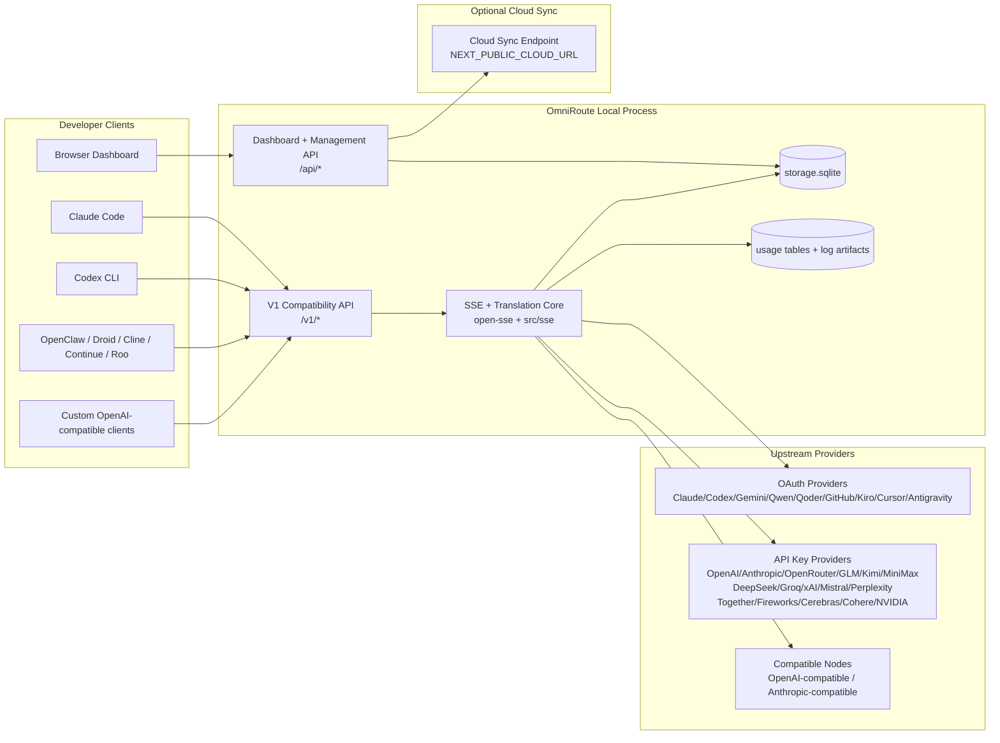
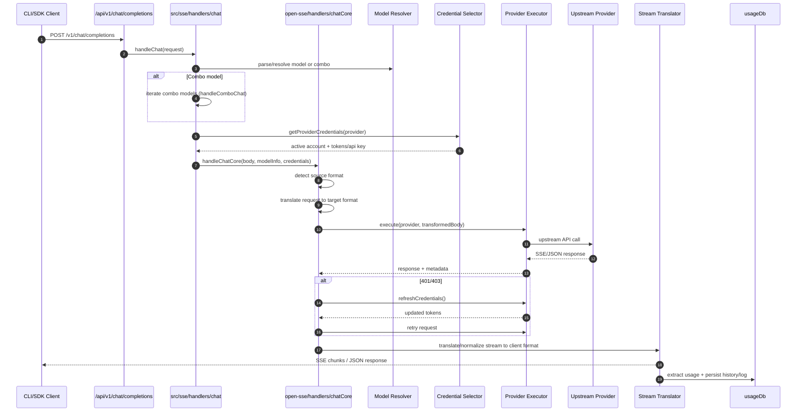
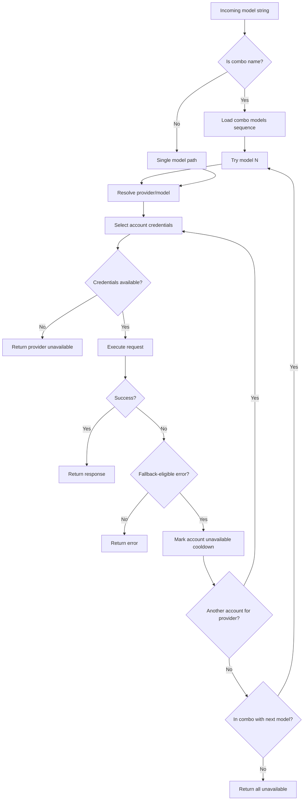
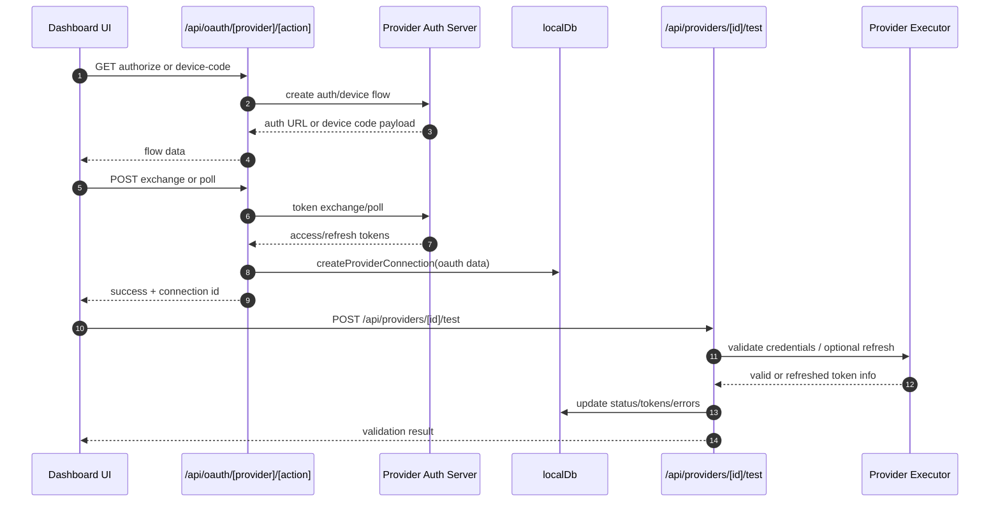
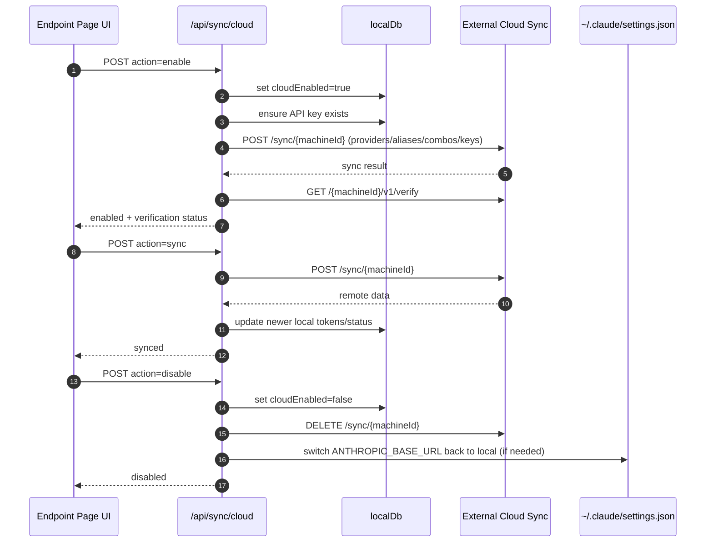
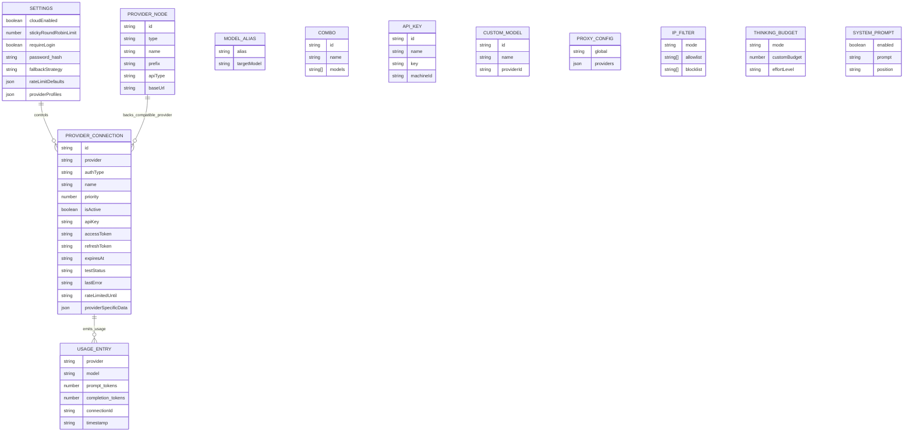
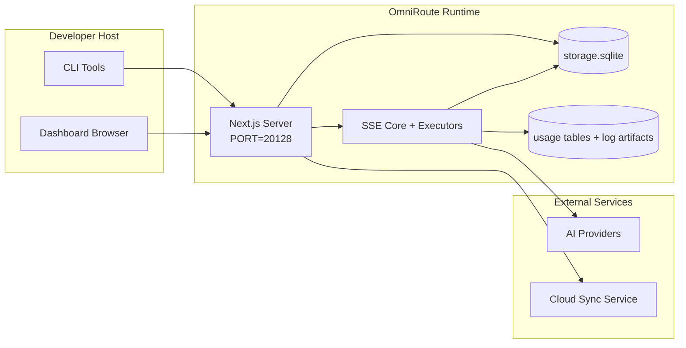

# OmniRoute Architecture (中文（简体）)

🌐 **Languages:** 🇺🇸 [English](../../../../docs/ARCHITECTURE.md) · 🇪🇸 [es](../../es/docs/ARCHITECTURE.md) · 🇫🇷 [fr](../../fr/docs/ARCHITECTURE.md) · 🇩🇪 [de](../../de/docs/ARCHITECTURE.md) · 🇮🇹 [it](../../it/docs/ARCHITECTURE.md) · 🇷🇺 [ru](../../ru/docs/ARCHITECTURE.md) · 🇨🇳 [zh-CN](../../zh-CN/docs/ARCHITECTURE.md) · 🇯🇵 [ja](../../ja/docs/ARCHITECTURE.md) · 🇰🇷 [ko](../../ko/docs/ARCHITECTURE.md) · 🇸🇦 [ar](../../ar/docs/ARCHITECTURE.md) · 🇮🇳 [hi](../../hi/docs/ARCHITECTURE.md) · 🇮🇳 [in](../../in/docs/ARCHITECTURE.md) · 🇹🇭 [th](../../th/docs/ARCHITECTURE.md) · 🇻🇳 [vi](../../vi/docs/ARCHITECTURE.md) · 🇮🇩 [id](../../id/docs/ARCHITECTURE.md) · 🇲🇾 [ms](../../ms/docs/ARCHITECTURE.md) · 🇳🇱 [nl](../../nl/docs/ARCHITECTURE.md) · 🇵🇱 [pl](../../pl/docs/ARCHITECTURE.md) · 🇸🇪 [sv](../../sv/docs/ARCHITECTURE.md) · 🇳🇴 [no](../../no/docs/ARCHITECTURE.md) · 🇩🇰 [da](../../da/docs/ARCHITECTURE.md) · 🇫🇮 [fi](../../fi/docs/ARCHITECTURE.md) · 🇵🇹 [pt](../../pt/docs/ARCHITECTURE.md) · 🇷🇴 [ro](../../ro/docs/ARCHITECTURE.md) · 🇭🇺 [hu](../../hu/docs/ARCHITECTURE.md) · 🇧🇬 [bg](../../bg/docs/ARCHITECTURE.md) · 🇸🇰 [sk](../../sk/docs/ARCHITECTURE.md) · 🇺🇦 [uk-UA](../../uk-UA/docs/ARCHITECTURE.md) · 🇮🇱 [he](../../he/docs/ARCHITECTURE.md) · 🇵🇭 [phi](../../phi/docs/ARCHITECTURE.md) · 🇧🇷 [pt-BR](../../pt-BR/docs/ARCHITECTURE.md) · 🇨🇿 [cs](../../cs/docs/ARCHITECTURE.md) · 🇹🇷 [tr](../../tr/docs/ARCHITECTURE.md)

---

_最后更新：2026-03-28_## Executive Summary

OmniRoute 是基于 Next.js 构建的本地 AI 路由网关和仪表板。
它提供单个 OpenAI 兼容端点 (`/v1/*`)，并通过转换、回退、令牌刷新和使用跟踪在多个上游提供商之间路由流量。

核心能力：

- 用于 CLI/工具的 OpenAI 兼容 API 界面（28 个提供商）
- 跨提供商格式的请求/响应翻译
- 模型组合后备（多模型序列）
- 账户级回退（每个提供商多个账户）
- OAuth + API 密钥提供商连接管理
- 通过 `/v1/embeddings` 生成嵌入（6 个提供程序，9 个模型）
- 通过 `/v1/images/ Generations` 生成图像（4 个提供商，9 个模型）
- 用于推理模型的 Think 标签解析（`<think>...</think>`）
- 响应清理以实现严格的 OpenAI SDK 兼容性
- 角色标准化（开发人员→系统、系统→用户）以实现跨提供商兼容性
- 结构化输出转换（json_schema→Gemini responseSchema）
- 提供商、密钥、别名、组合、设置、定价的本地持久性
- 使用/成本跟踪和请求记录
- 可选的云同步用于多设备/状态同步
- API 访问控制的 IP 允许列表/阻止列表
- 思考预算管理（直通/自动/自定义/自适应）
- 全局系统提示注入
- 会话跟踪和指纹识别
- 使用特定于提供商的配置文件增强每个帐户的速率限制
- 提供者弹性的断路器模式
- 具有互斥锁的防雷群保护
- 基于签名的请求重复数据删除缓存
- 领域层：模型可用性、成本规则、后备策略、锁定策略
- 域状态持久性（用于回退、预算、锁定、断路器的 SQLite 直写式缓存）
- 用于集中请求评估的策略引擎（锁定→预算→后备）
- 使用 p50/p95/p99 延迟聚合请求遥测
- 用于端到端跟踪的关联 ID (X-Request-Id)
- 合规性审核日志记录，可根据 API 密钥选择退出
- LLM质量保证评估框架
- 具有实时断路器状态的 Resilience UI 仪表板
- 模块化 OAuth 提供程序（`src/lib/oauth/providers/` 下有 12 个单独的模块）

主要运行时模型：

- `src/app/api/*` 下的 Next.js 应用程序路由实现了仪表板 API 和兼容性 API
- `src/sse/*` + `open-sse/*` 中的共享 SSE/路由核心处理提供程序执行、转换、流式传输、回退和使用## Scope and Boundaries

### In Scope

- 本地网关运行时
- 仪表板管理 API
- 提供商身份验证和令牌刷新
- 请求翻译和 SSE 流媒体
- 本地状态+使用持久性
- 可选的云同步编排### Out of Scope

- “NEXT_PUBLIC_CLOUD_URL”背后的云服务实现
- 本地流程之外的提供商 SLA/控制平面
- 外部 CLI 二进制文件本身（Claude CLI、Codex CLI 等）## Dashboard Surface (Current)

`src/app/(dashboard)/dashboard/`下的主要页面：

- `/dashboard` — 快速启动 + 提供商概述
- `/dashboard/endpoint` — 端点代理 + MCP + A2A + API 端点选项卡
- `/dashboard/providers` — 提供商连接和凭证
- `/dashboard/combos` — 组合策略、模板、模型路由规则
- `/dashboard/costs` — 成本汇总和定价可见性
- `/dashboard/analytics` — 使用情况分析和评估
- `/dashboard/limits` — 配额/速率控制
- `/dashboard/cli-tools` — CLI 入门、运行时检测、配置生成
- `/dashboard/agents` — 检测到的 ACP 代理 + 自定义代理注册
- `/dashboard/media` — 图像/视频/音乐游乐场
- `/dashboard/search-tools` — 搜索提供商测试和历史记录
- `/dashboard/health` — 正常运行时间、断路器、速率限制
- `/dashboard/logs` — 请求/代理/审核/控制台日志
- `/dashboard/settings` — 系统设置选项卡（常规、路由、组合默认值等）
- `/dashboard/api-manager` — API 密钥生命周期和模型权限## High-Level System Context



## Core Runtime Components

## 1) API and Routing Layer (Next.js App Routes)

主要目录：

- `src/app/api/v1/*` 和 `src/app/api/v1beta/*` 用于兼容性 API
- `src/app/api/*` 用于管理/配置 API
- Next 在 `next.config.mjs` 中重写，将 `/v1/*` 映射到 `/api/v1/*`

重要的兼容性路线：

- `src/app/api/v1/chat/completions/route.ts`
- `src/app/api/v1/messages/route.ts`
- `src/app/api/v1/responses/route.ts`
- `src/app/api/v1/models/route.ts` — 包括带有 `custom: true` 的自定义模型
- `src/app/api/v1/embeddings/route.ts` — 嵌入生成（6 个提供程序）
- `src/app/api/v1/images/ Generations/route.ts` — 图像生成（4 个以上提供商，包括 Antigravity/Nebius）
- `src/app/api/v1/messages/count_tokens/route.ts`
- `src/app/api/v1/providers/[provider]/chat/completions/route.ts` — 每个提供商的专用聊天
- `src/app/api/v1/providers/[provider]/embeddings/route.ts` — 专用的每个提供商嵌入
- `src/app/api/v1/providers/[provider]/images/ Generations/route.ts` — 每个提供商专用的图像
- `src/app/api/v1beta/models/route.ts`
- `src/app/api/v1beta/models/[...path]/route.ts`

管理域：

- 身份验证/设置：`src/app/api/auth/*`、`src/app/api/settings/*`
- 提供者/连接：`src/app/api/providers*`
- 提供者节点：`src/app/api/provider-nodes*`
- 自定义模型：`src/app/api/provider-models` (GET/POST/DELETE)
- 模型目录：`src/app/api/models/route.ts` (GET)
- 代理配置：`src/app/api/settings/proxy` (GET/PUT/DELETE) + `src/app/api/settings/proxy/test` (POST)
- OAuth：`src/app/api/oauth/*`
- 键/别名/组合/定价：`src/app/api/keys*`、`src/app/api/models/alias`、`src/app/api/combos*`、`src/app/api/pricing`
- 用法：`src/app/api/usage/*`
- 同步/云：`src/app/api/sync/*`、`src/app/api/cloud/*`
- CLI 工具助手：`src/app/api/cli-tools/*`
- IP 过滤器：`src/app/api/settings/ip-filter` (GET/PUT)
- 思考预算：`src/app/api/settings/thinking-budget` (GET/PUT)
- 系统提示：`src/app/api/settings/system-prompt` (GET/PUT)
- 会话：`src/app/api/sessions` (GET)
- 速率限制：`src/app/api/rate-limits` (GET)
- 弹性：`src/app/api/resilience` (GET/PATCH) — 提供商配置文件、断路器、速率限制状态
- 弹性重置：`src/app/api/resilience/reset` (POST) — 重置断路器 + 冷却时间
- 缓存统计信息：`src/app/api/cache/stats`（获取/删除）
- 模型可用性：`src/app/api/models/availability` (GET/POST)
- 遥测：`src/app/api/telemetry/summary` (GET)
- 预算：`src/app/api/usage/budget` (GET/POST)
- 后备链：`src/app/api/fallback/chains` (GET/POST/DELETE)
- 合规性审计：`src/app/api/compliance/audit-log` (GET)
- 评估：`src/app/api/evals` (GET/POST)、`src/app/api/evals/[suiteId]` (GET)
- 政策：`src/app/api/policies` (GET/POST)## 2) SSE + Translation Core

主要流程模块：

- 条目：`src/sse/handlers/chat.ts`
- 核心编排：`open-sse/handlers/chatCore.ts`
- 提供程序执行适配器：`open-sse/executors/*`
- 格式检测/提供程序配置：`open-sse/services/provider.ts`
- 模型解析/解析：`src/sse/services/model.ts`、`open-sse/services/model.ts`
- 帐户后备逻辑：`open-sse/services/accountFallback.ts`
- 翻译注册表：`open-sse/translator/index.ts`
- 流转换：`open-sse/utils/stream.ts`、`open-sse/utils/streamHandler.ts`
- 使用情况提取/规范化：`open-sse/utils/usageTracking.ts`
- Think 标签解析器：`open-sse/utils/thinkTagParser.ts`
- 嵌入处理程序：`open-sse/handlers/embeddings.ts`
- 嵌入提供程序注册表：`open-sse/config/embeddingRegistry.ts`
- 图像生成处理程序：`open-sse/handlers/imageGeneration.ts`
- 图像提供程序注册表：`open-sse/config/imageRegistry.ts`
- 响应清理：`open-sse/handlers/responseSanitizer.ts`
- 角色规范化：`open-sse/services/roleNormalizer.ts`

服务（业务逻辑）：

- 账户选择/评分：`open-sse/services/accountSelector.ts`
- 上下文生命周期管理：`open-sse/services/contextManager.ts`
- IP 过滤器强制执行：`open-sse/services/ipFilter.ts`
- 会话跟踪：`open-sse/services/sessionManager.ts`
- 请求重复数据删除：`open-sse/services/signatureCache.ts`
- 系统提示注入：`open-sse/services/systemPrompt.ts`
- 思维预算管理：`open-sse/services/thinkingBudget.ts`
- 通配符模型路由：`open-sse/services/wildcardRouter.ts`
- 速率限制管理：`open-sse/services/rateLimitManager.ts`
- 断路器：`open-sse/services/CircuitBreaker.ts`

领域层模块：

- 模型可用性：`src/lib/domain/modelAvailability.ts`
- 成本规则/预算：`src/lib/domain/costRules.ts`
- 后备策略：`src/lib/domain/fallbackPolicy.ts`
- 组合解析器：`src/lib/domain/comboResolver.ts`
- 锁定策略：`src/lib/domain/lockoutPolicy.ts`
- 策略引擎：`src/domain/policyEngine.ts` — 集中锁定→预算→后备评估
- 错误代码目录：`src/lib/domain/errorCodes.ts`
- 请求 ID：`src/lib/domain/requestId.ts`
- 获取超时：`src/lib/domain/fetchTimeout.ts`
- 请求遥测：`src/lib/domain/requestTelemetry.ts`
- 合规性/审核：`src/lib/domain/compliance/index.ts`
- 评估运行器：`src/lib/domain/evalRunner.ts`
- 域状态持久化：`src/lib/db/domainState.ts` — 用于后备链、预算、成本历史记录、锁定状态、断路器的 SQLite CRUD

OAuth 提供程序模块（`src/lib/oauth/providers/` 下有 12 个单独的文件）：

- 注册表索引：`src/lib/oauth/providers/index.ts`
- 个别提供者：`claude.ts`、`codex.ts`、`gemini.ts`、`antigravity.ts`、`qoder.ts`、`qwen.ts`、`kimi-coding.ts`、`github.ts`、`kiro.ts`、`cursor.ts`、`kilocode.ts`、`cline.ts`
- 薄包装器：`src/lib/oauth/providers.ts` — 从各个模块重新导出## 3) Persistence Layer

主状态数据库（SQLite）：

- 核心基础设施：`src/lib/db/core.ts`（better-sqlite3、迁移、WAL）
- 重新导出外观：`src/lib/localDb.ts`（调用者的薄兼容层）
- 文件：`${DATA_DIR}/storage.sqlite`（或设置时为`$XDG_CONFIG_HOME/omniroute/storage.sqlite`，否则为`~/.omniroute/storage.sqlite`）
- 实体（表 + KV 命名空间）：providerConnections、providerNodes、modelAliases、组合、apiKeys、设置、定价、**customModels**、**proxyConfig**、**ipFilter**、**thinkingBudget**、**systemPrompt**

使用持久性：

- 门面：`src/lib/usageDb.ts`（在`src/lib/usage/*`中分解模块）
- `storage.sqlite` 中的 SQLite 表：`usage_history`、`call_logs`、`proxy_logs`
- 保留可选文件工件以实现兼容性/调试（`${DATA_DIR}/log.txt`、`${DATA_DIR}/call_logs/`、`<repo>/logs/...`）
- 旧版 JSON 文件通过启动迁移（如果存在）迁移到 SQLite

域状态数据库（SQLite）：

- `src/lib/db/domainState.ts` — 域状态的 CRUD 操作
- 表（在 `src/lib/db/core.ts` 中创建）：`domain_fallback_chains`、`domain_budgets`、`domain_cost_history`、`domain_lockout_state`、`domain_Circuit_breakers`
- 直写式缓存模式：内存中的Map在运行时具有权威性；突变同步写入SQLite；冷启动时从数据库恢复状态## 4) Auth + Security Surfaces

- 仪表板 cookie 身份验证：`src/proxy.ts`、`src/app/api/auth/login/route.ts`
- API 密钥生成/验证：`src/shared/utils/apiKey.ts`
- 提供商机密保留在“providerConnections”条目中
- 通过“open-sse/utils/proxyFetch.ts”（环境变量）和“open-sse/utils/networkProxy.ts”（可按提供商或全局配置）提供出站代理支持## 5) Cloud Sync

- 调度程序初始化：`src/lib/initCloudSync.ts`、`src/shared/services/initializeCloudSync.ts`、`src/shared/services/modelSyncScheduler.ts`
- 定期任务：`src/shared/services/cloudSyncScheduler.ts`
- 定期任务：`src/shared/services/modelSyncScheduler.ts`
- 控制路由：`src/app/api/sync/cloud/route.ts`## Request Lifecycle (`/v1/chat/completions`)



## Combo + Account Fallback Flow



回退决策由“open-sse/services/accountFallback.ts”使用状态代码和错误消息启发法驱动。组合路由增加了一项额外的防护：提供者范围内的 400（例如上游内容块和角色验证失败）被视为模型本地失败，因此后面的组合目标仍然可以运行。## OAuth Onboarding and Token Refresh Lifecycle



实时流量期间的刷新通过执行器“refreshCredentials()”在“open-sse/handlers/chatCore.ts”内执行。## Cloud Sync Lifecycle (Enable / Sync / Disable)



启用云时，定期同步由“CloudSyncScheduler”触发。## Data Model and Storage Map



物理存储文件：

- 主运行时数据库：`${DATA_DIR}/storage.sqlite`
- 请求日志行：`${DATA_DIR}/log.txt`（兼容/调试工件）
- 结构化调用有效负载档案：`${DATA_DIR}/call_logs/`
- 可选的转换器/请求调试会话：`<repo>/logs/...`## Deployment Topology



## Module Mapping (Decision-Critical)

### Route and API Modules

- `src/app/api/v1/*`、`src/app/api/v1beta/*`：兼容性 API
- `src/app/api/v1/providers/[provider]/*`：每个提供商的专用路由（聊天、嵌入、图像）
- `src/app/api/providers*`：提供者 CRUD、验证、测试
- `src/app/api/provider-nodes*`：自定义兼容节点管理
- `src/app/api/provider-models`：自定义模型管理（CRUD）
- `src/app/api/models/route.ts`：模型目录 API（别名+自定义模型）
- `src/app/api/oauth/*`：OAuth/设备代码流
- `src/app/api/keys*`：本地 API 密钥生命周期
- `src/app/api/models/alias`：别名管理
- `src/app/api/combos*`：后备组合管理
- `src/app/api/pricing`：成本计算的定价覆盖
- `src/app/api/settings/proxy`：代理配置（GET/PUT/DELETE）-`src/app/api/settings/proxy/test`：出站代理连接测试（POST）
- `src/app/api/usage/*`：使用情况和日志 API
- `src/app/api/sync/*` + `src/app/api/cloud/*`：云同步和面向云的助手
- `src/app/api/cli-tools/*`：本地 CLI 配置编写器/检查器
- `src/app/api/settings/ip-filter`: IP 允许列表/阻止列表 (GET/PUT)
- `src/app/api/settings/thinking-budget`：思考代币预算配置（GET/PUT）
- `src/app/api/settings/system-prompt`：全局系统提示符（GET/PUT）
- `src/app/api/sessions`：活动会话列表（GET）
- `src/app/api/rate-limits`：每个帐户的速率限制状态 (GET)### Routing and Execution Core

- `src/sse/handlers/chat.ts`：请求解析、组合处理、帐户选择循环
- `open-sse/handlers/chatCore.ts`：翻译、执行器调度、重试/刷新处理、流设置
- `open-sse/executors/*`：特定于提供商的网络和格式行为### Translation Registry and Format Converters

- `open-sse/translator/index.ts`：翻译器注册表和编排
- 请求翻译器：`open-sse/translator/request/*`
- 响应翻译器：`open-sse/translator/response/*`
- 格式常量：`open-sse/translator/formats.ts`### Persistence

- `src/lib/db/*`：SQLite 上的持久配置/状态和域持久性
- `src/lib/localDb.ts`：数据库模块的兼容性重新导出
- `src/lib/usageDb.ts`：SQLite 表顶部的使用历史记录/调用日志外观## Provider Executor Coverage (Strategy Pattern)

每个提供者都有一个扩展“BaseExecutor”的专门执行器（在“open-sse/executors/base.ts”中），它提供 URL 构建、标头构建、指数退避重试、凭证刷新挂钩和“execute()”编排方法。

| 执行人              | 提供商                                                                                                                                                       | 特殊处理                                               |
| ------------------- | ------------------------------------------------------------------------------------------------------------------------------------------------------------ | ------------------------------------------------------ | ------------------------------------------------------------ |
| `默认执行器`        | OpenAI、Claude、Gemini、Qwen、Qoder、OpenRouter、GLM、Kimi、MiniMax、DeepSeek、Groq、xAI、Mistral、Perplexity、Together、Fireworks、Cerebras、Cohere、NVIDIA | 每个提供商的动态 URL/标头配置                          |
| `反重力执行者`      | 谷歌反重力                                                                                                                                                   | 自定义项目/会话 ID，解析后重试                         |
| `CodexExecutor`     | OpenAI 法典                                                                                                                                                  | 注入系统指令，强制推理工作                             |
| `CursorExecutor`    | 光标IDE                                                                                                                                                      | ConnectRPC 协议、Protobuf 编码、通过校验和进行请求签名 |
| `GithubExecutor`    | GitHub 副驾驶                                                                                                                                                | Copilot 令牌刷新，模仿 VSCode 标头                     |
| `KiroExecutor`      | AWS CodeWhisperer/Kiro                                                                                                                                       | AWS CodeWhisperer/Kiro                                 | AWS CodeWhisperer/Kiro AWS EventStream 二进制格式 → SSE 转换 |
| `GeminiCLIExecutor` | 双子座 CLI                                                                                                                                                   | Google OAuth 令牌刷新周期                              |

所有其他提供者（包括自定义兼容节点）都使用“DefaultExecutor”。## Provider Compatibility Matrix

| 供应商           | 格式        | 授权               | 流           | 非流                      | 令牌刷新 | 使用API​​      |
| ---------------- | ----------- | ------------------ | ------------ | ------------------------- | -------- | -------------- | ------------------------------ |
| 克劳德           | 克劳德      | API 密钥/OAuth     | ✅           | ✅                        | ✅       | ⚠️ 仅限管理员  |
| 双子座           | 双子座      | API 密钥/OAuth     | ✅           | ✅                        | ✅       | ⚠️ 云控制台    |
| 双子座 CLI       | Gemini-cli  | OAuth              | ✅           | ✅                        | ✅       | ⚠️ 云控制台    |
| 反重力           | 反重力      | OAuth              | ✅           | ✅                        | ✅       | ✅ 完整配额API |
| 开放人工智能     | 开放        | API 密钥           | ✅           | ✅                        | ❌       | ❌             |
| 法典             | openai-回应 | OAuth              | ✅ 强迫      | ❌                        | ✅       | ✅ 速率限制    |
| GitHub 副驾驶    | 开放        | OAuth + 副驾驶令牌 | ✅           | ✅                        | ✅       | ✅ 配额快照    |
| 光标             | 光标        | 自定义校验和       | ✅           | ✅                        | ❌       | ❌             |
| 基罗             | 基罗        | AWS SSO OIDC       | AWS SSO OIDC | AWS SSO OIDC ✅（事件流） | ❌       | ✅             | ✅ 使用限制                    |
| 奎文             | 开放        | OAuth              | ✅           | ✅                        | ✅       | ⚠️ 根据要求    |
| 科德尔           | 开放        | OAuth（基本）      | ✅           | ✅                        | ✅       | ⚠️ 根据要求    |
| 开放路由器       | 开放        | API 密钥           | ✅           | ✅                        | ❌       | ❌             |
| GLM/Kimi/MiniMax | 克劳德      | API 密钥           | ✅           | ✅                        | ❌       | ❌             |
| 深度搜索         | 开放        | API 密钥           | ✅           | ✅                        | ❌       | ❌             |
| 格罗克           | 开放        | API 密钥           | ✅           | ✅                        | ❌       | ❌             |
| xAI (Grok)       | 开放        | API 密钥           | ✅           | ✅                        | ❌       | ❌             |
| 米斯特拉尔       | 开放        | API 密钥           | ✅           | ✅                        | ❌       | ❌             |
| 困惑             | 开放        | API 密钥           | ✅           | ✅                        | ❌       | ❌             |
| 一起人工智能     | 开放        | API 密钥           | ✅           | ✅                        | ❌       | ❌             |
| 烟花人工智能     | 开放        | API 密钥           | ✅           | ✅                        | ❌       | ❌             |
| 大脑             | 开放        | API 密钥           | ✅           | ✅                        | ❌       | ❌             |
| 连贯             | 开放        | API 密钥           | ✅           | ✅                        | ❌       | ❌             |
| NVIDIA NIM       | 开放        | API 密钥           | ✅           | ✅                        | ❌       | ❌             | ## Format Translation Coverage |

检测到的源格式包括：

- `openai`
- `openai-响应`
  -“克劳德”
  -“双子座”

目标格式包括：

- OpenAI 聊天/回复
  ——克劳德
- Gemini/Gemini-CLI/反重力信封
- 基罗
- 光标

翻译使用**OpenAI 作为中心格式**- 所有转换都通过 OpenAI 作为中间：```
Source Format → OpenAI (hub) → Target Format

````

根据源有效负载形状和提供程序目标格式动态选择翻译。

翻译管道中的附加处理层：

-**响应清理**- 从 OpenAI 格式响应（流式和非流式）中去除非标准字段，以确保严格的 SDK 合规性
-**角色规范化**— 对于非 OpenAI 目标，将“开发人员”转换为“系统”；对于拒绝系统角色的模型（GLM、ERNIE），合并“system”→“user”
-**Think 标签提取**— 将内容中的 `<think>...</think>` 块解析到 `reasoning_content` 字段中
-**结构化输出**— 将 OpenAI `response_format.json_schema` 转换为 Gemini 的 `responseMimeType` + `responseSchema`## Supported API Endpoints

|端点 |格式|处理程序 |
| -------------------------------------------------- | ------------------ | ---------------------------------------------------------------------------------- |
| `POST /v1/chat/completions` | OpenAI 聊天 | `src/sse/handlers/chat.ts` |
| `POST /v1/messages` |克劳德消息 |相同的处理程序（自动检测）|
| `POST /v1/response` | OpenAI 回应 | `open-sse/handlers/responsesHandler.ts` |
| `POST /v1/embeddings` | OpenAI 嵌入 | `open-sse/handlers/embeddings.ts` |
| `GET /v1/embeddings` |型号列表 | API路线 |
| `POST /v1/images/Generations` | OpenAI 图像 | `open-sse/handlers/imageGeneration.ts` |
| `获取/v1/图像/世代` |型号列表 | API路线 |
| `POST /v1/providers/{provider}/chat/completions` | OpenAI 聊天 |专用于每个提供商的模型验证 |
| `POST /v1/providers/{provider}/embeddings` | OpenAI 嵌入 |专用于每个提供商的模型验证 |
| `POST /v1/providers/{provider}/images/ Generations` | OpenAI 图像 |专用于每个提供商的模型验证 |
| `POST /v1/messages/count_tokens` |克劳德代币计数 | API路线 |
| `获取/v1/模型` | OpenAI 模型列表 | API路线（聊天+嵌入+图像+自定义模型）|
| `GET /api/models/catalog` |目录|所有模型按提供商+类型分组 |
| `POST /v1beta/models/*:streamGenerateContent` |双子座人 | API路线|
| `获取/放置/删除 /api/settings/proxy` |代理配置 |网络代理配置|
| `POST /api/settings/proxy/test` |代理连接 |代理运行状况/连接测试端点 |
| `GET/POST/DELETE /api/provider-models` |供应商模型|支持自定义和托管可用模型的提供者模型元数据 |## Bypass Handler

旁路处理程序 (`open-sse/utils/bypassHandler.ts`) 拦截来自 Claude CLI 的已知“一次性”请求（预热 ping、标题提取和令牌计数），并返回**虚假响应**，而不消耗上游提供商令牌。仅当“User-Agent”包含“claude-cli”时才会触发。## Request Logger Pipeline

请求记录器 (`open-sse/utils/requestLogger.ts`) 提供了一个 7 阶段调试日志记录管道，默认情况下禁用，通过 `ENABLE_REQUEST_LOGS=true` 启用：```
1_req_client.json → 2_req_source.json → 3_req_openai.json → 4_req_target.json
→ 5_res_provider.txt → 6_res_openai.txt → 7_res_client.txt
````

每个请求会话的文件都会写入“<repo>/logs/<session>/”。## Failure Modes and Resilience

## 1) Account/Provider Availability

- 提供商帐户因瞬态/速率/身份验证错误而冷却
- 请求失败之前的帐户回退
- 当前模型/提供商路径耗尽时组合模型回退## 2) Token Expiry

- 对可刷新提供程序进行预检查和刷新并重试
- 401/403 在核心路径中尝试刷新后重试## 3) Stream Safety

- 断开连接感知流控制器
- 带有流尾刷新和“[DONE]”处理的翻译流
- 当提供者使用元数据丢失时使用估计回退## 4) Cloud Sync Degradation

- 出现同步错误，但本地运行时仍在继续
- 调度程序具有可重试的逻辑，但定期执行当前默认调用单次尝试同步## 5) Data Integrity

- SQLite 模式迁移和启动时自动升级挂钩
- 遗留 JSON → SQLite 迁移兼容性路径## Observability and Operational Signals

运行时可见性来源：

- 来自`src/sse/utils/logger.ts`的控制台日志
- SQLite 中每个请求的使用情况聚合（`usage_history`、`call_logs`、`proxy_logs`）
- 当“settings.detailed_logs_enabled=true”时，SQLite 中的四阶段详细有效负载捕获（“request_detail_logs”）
- “log.txt”中的文本请求状态日志（可选/兼容）
- 当“ENABLE_REQUEST_LOGS=true”时，可选的深度请求/翻译日志位于“logs/”下
- 用于 UI 使用的仪表板使用端点 (`/api/usage/*`)

详细的请求有效负载捕获为每个路由调用存储最多四个 JSON 有效负载阶段：

- 从客户端收到的原始请求
- 翻译后的请求实际发送到上游
- 提供商响应重构为 JSON；流式响应被压缩为最终摘要加上流元数据
- OmniRoute 返回的最终客户端响应；流式响应以相同的紧凑摘要形式存储## Security-Sensitive Boundaries

- JWT 秘密 (`JWT_SECRET`) 确保仪表板会话 cookie 验证/签名
- 应为首次运行配置显式配置初始密码引导程序（“INITIAL_PASSWORD”）
- API 密钥 HMAC 秘密 (`API_KEY_SECRET`) 确保生成的本地 API 密钥格式
- 提供者机密（API 密钥/令牌）保留在本地数据库中，并应在文件系统级别受到保护
- 云同步端点依赖于 API 密钥身份验证 + 机器 ID 语义## Environment and Runtime Matrix

代码主动使用的环境变量：

- 应用程序/身份验证：`JWT_SECRET`、`INITIAL_PASSWORD`
- 存储：`DATA_DIR`
- 兼容的节点行为：`ALLOW_MULTI_CONNECTIONS_PER_COMPAT_NODE`
- 可选的存储基础覆盖（Linux/macOS 当 `DATA_DIR` 未设置时）：`XDG_CONFIG_HOME`
- 安全哈希：`API_KEY_SECRET`、`MACHINE_ID_SALT`
- 日志记录：`ENABLE_REQUEST_LOGS`
- 同步/云 URL：`NEXT_PUBLIC_BASE_URL`、`NEXT_PUBLIC_CLOUD_URL`
- 出站代理：`HTTP_PROXY`、`HTTPS_PROXY`、`ALL_PROXY`、`NO_PROXY` 和小写变体
- SOCKS5 功能标志：`ENABLE_SOCKS5_PROXY`、`NEXT_PUBLIC_ENABLE_SOCKS5_PROXY`
- 平台/运行时帮助程序（不是特定于应用程序的配置）：`APPDATA`、`NODE_ENV`、`PORT`、`HOSTNAME`## Known Architectural Notes

1. `usageDb` 和 `localDb` 与旧文件迁移共享相同的基本目录策略 (`DATA_DIR` -> `XDG_CONFIG_HOME/omniroute` -> `~/.omniroute`)。
2. `/api/v1/route.ts` 委托给 `/api/v1/models` (`src/app/api/v1/models/catalog.ts`) 使用的同一统一目录构建器，以避免语义漂移。
3. 请求记录器在启用时写入完整的标头/正文；将日志目录视为敏感目录。
4. 云行为取决于正确的“NEXT_PUBLIC_BASE_URL”和云端点可访问性。
5. `open-sse/` 目录发布为 `@omniroute/open-sse`**npm 工作区包**。源代码通过 `@omniroute/open-sse/...` 导入它（由 Next.js `transpilePackages` 解析）。为了保持一致性，本文档中的文件路径仍然使用目录名称“open-sse/”。
6. 仪表板中的图表使用**Recharts**（基于 SVG）来实现可访问的交互式分析可视化（模型使用情况条形图、包含成功率的提供商细分表）。
7. E2E 测试使用**Playwright**(`tests/e2e/`)，通过 `npm run test:e2e` 运行。单元测试使用**Node.js 测试运行程序**(`tests/unit/`)，通过 `npm run test:unit` 运​​行。 `src/` 下的源代码是**TypeScript**(`.ts`/`.tsx`)； `open-sse/` 工作区仍然是 JavaScript (`.js`)。
8. 设置页面分为 5 个选项卡：安全、路由（6 种全局策略：先填充、循环、p2c、随机、最少使用、成本优化）、弹性（可编辑速率限制、断路器、策略）、AI（思考预算、系统提示、提示缓存）、高级（代理）。## Operational Verification Checklist

- 从源代码构建：`npm run build`
- 构建 Docker 镜像：“docker build -tomniroute”。
- 启动服务并验证：
- `获取/api/设置`
- `GET /api/v1/models`
- 当“PORT=20128”时，CLI 目标基本 URL 应为“http://<host>:20128/v1”
